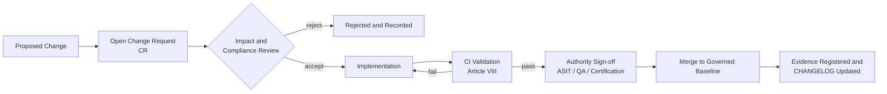
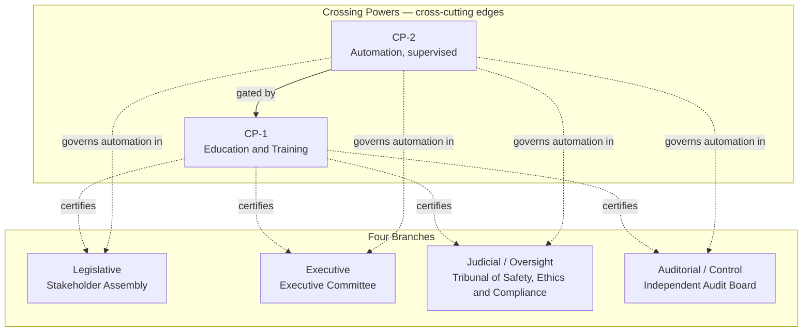
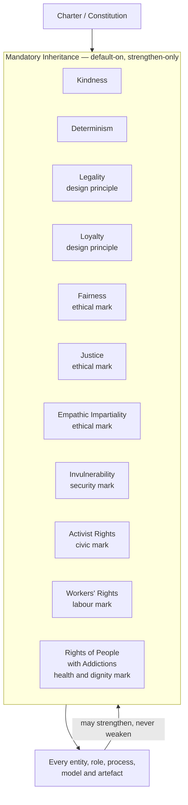

# MODEL DIGITAL CONSTITUTION

**Path:** `MODEL_DIGITAL_CONSTITUTION.md`  
**Authority:** ASIT  
**Scope:** Repository-wide  
**Status:** ACTIVE  
**Repository:** AEROSPACEMODEL  
**Classification:** Open governance baseline  

---

## Article I — Purpose

This document establishes the foundational digital governance charter for **AEROSPACEMODEL**.

AEROSPACEMODEL is a governed digital environment. All content, structure, logic, data, automation, documentation, evidence, and repository operations within this repository are subject to this constitution.

This constitution defines the repository-level governance rules for:

- product primacy;
- traceability;
- lifecycle governance;
- controlled vocabulary;
- evidence addressability;
- standard binding;
- change control;
- CI validation;
- audit integrity;
- incorporation by reference of the Democratic Enterprise Governance Framework.

---

## Article II — Governing Principles

1. **Product Primacy** — The product is the primary governed object. All lifecycle, compliance, and traceability logic resolves to a product, product family, or controlled variant.

2. **Traceability Completeness** — Every obligation must be traceable from requirement through evidence to signoff. Broken chains are nonconformances.

3. **Single Source of Truth** — Each controlled datum has one authoritative location. Duplication without controlled reference is prohibited.

4. **Machine Readability** — Governance structures, mappings, vocabularies, lifecycle states, and evidence records must be machine-readable and CI-validatable wherever practicable.

5. **Lifecycle Governance** — All product lifecycle states are governed by the canonical `LC01–LC14` phase model.

6. **Standard Binding** — Standards are not narrative references. They are executable compliance subsystems bound to the lifecycle.

7. **Evidence Addressability** — All evidence must be addressable via controlled identifiers and registered in the evidence register.

8. **Audit Integrity** — Audit records must be immutable once signed. Corrections require new records with supersession references.

9. **Constitutional Supremacy** — Repository policies, automation, templates, taxonomies, and programme structures are subordinate to this constitution.

10. **No Silent Governance Drift** — Changes to authority, lifecycle logic, vocabulary, or controlled structures require explicit change control.

---

## Article III — Authority Structure

| Role | Responsibility |
|---|---|
| **ASIT** | Repository traceability integrity, structural consistency, lifecycle operating coherence |
| **QA Authority** | Quality assurance sign-off |
| **Certification Authority** | Compliance and certification sign-off |
| **Delineant** | Boundary definition, applicability scoping, repository-scope control |
| **Observer** | Read and monitor access |

### III.1 Authority Boundary

ASIT governs repository structure and traceability integrity.  
QA Authority governs quality conformity.  
Certification Authority governs certification and compliance evidence.  
Delineant defines scope boundaries.  
Observer has no modification authority.

---

## Article IV — Controlled Vocabulary

All folder names, status codes, acronyms, field values, lifecycle states, authority labels, impact flags, and controlled taxonomy elements used within this repository are controlled vocabulary.

Definitions are maintained in:

- `00_META/glossary/acronyms.md`
- `00_META/glossary/terms.md`
- `00_META/glossary/controlled_vocabulary.yaml`

If a term appears in repository content but is absent from the controlled vocabulary, it is provisional until accepted through change control.

---

## Article V — Glossary of Terms and Acronyms

The canonical, machine-readable glossaries remain those listed in Article IV. This article provides a human-readable working glossary for constitutional interpretation.

### V.1 Terms

| Term | Definition |
|---|---|
| **AEROSPACEMODEL** | The governed digital environment defined and bound by this constitution. |
| **Controlled Vocabulary** | Closed or controlled set of folder names, status codes, acronyms, field values, taxonomy labels, and authority names authorized for repository use. |
| **Crossing Power** | Cross-cutting governance edge, not a branch, that traverses and unifies the four governance branches; supporting, never sovereign. |
| **Evidence** | Auditable artefact — record, report, manifest, log, signed package, verification result, or controlled dataset — addressable via a controlled identifier and registered in the evidence register. |
| **Lifecycle `LC01–LC14`** | Canonical 14-phase product lifecycle model under which all lifecycle states are governed. |
| **Mandatory Inheritance** | Default-on, non-waivable duties inherited by every entity at creation; strengthen-only, never weakened. |
| **Nonconformance** | Deviation from a controlled obligation, including broken traceability chains, unauthorized modifications, invalid vocabulary, or unregistered evidence. |
| **Product Primacy** | Principle that the product is the primary governed object; lifecycle, compliance, and traceability logic resolves to a product or variant. |
| **Separation of Powers** | Division of enterprise authority across Legislative, Executive, Judicial/Oversight, and Auditorial/Control branches. |
| **Single Source of Truth** | Rule that each controlled datum has exactly one authoritative location; duplication without controlled reference is prohibited. |
| **Standard Binding** | Treatment of standards as executable compliance subsystems bound to lifecycle gates, not as narrative references. |
| **Supersession** | Correction mechanism where a new immutable record references and supersedes a prior record. |
| **Traceability Completeness** | Requirement that every obligation be traceable from requirement through evidence to signoff. |

### V.2 Acronyms

| Acronym | Expansion |
|---|---|
| **AR** | Activist Rights — Civic Mark, Mandatory Inheritance |
| **AS9100D / EN 9100** | Aerospace quality management system standard |
| **ASIT** | Authority for Structural and Integrity Traceability |
| **CCT** | Conditions Cross-Reference Table, S1000D |
| **CI** | Continuous Integration |
| **COI** | Conflict of Interest |
| **CP-1** | Crossing Power 1 — Education & Training |
| **CP-2** | Crossing Power 2 — Automation, Supervised Execution |
| **CR** | Change Request |
| **CSDB** | Common Source DataBase, S1000D |
| **D** | Determinism — Mandatory Inheritance |
| **DEGF** | Democratic Enterprise Governance Framework |
| **DO-178C** | Software Considerations in Airborne Systems and Equipment Certification |
| **DO-254** | Design Assurance Guidance for Airborne Electronic Hardware |
| **EAP** | Employee Assistance Programme |
| **EAR** | Export Administration Regulations, United States |
| **EASA** | European Union Aviation Safety Agency |
| **EVM** | Earned Value Management |
| **F** | Fairness — Ethical Mark, Mandatory Inheritance |
| **FAA** | Federal Aviation Administration, United States |
| **GDPR** | General Data Protection Regulation, European Union |
| **HR** | Human Resources |
| **IE** | Imparzialità Empatica / Empathic Impartiality — Ethical Mark |
| **IETP** | Interactive Electronic Technical Publication |
| **ILO** | International Labour Organization |
| **INV** | Invulnerability — Security Mark, Mandatory Inheritance |
| **ITAR** | International Traffic in Arms Regulations, United States |
| **J** | Justice — Ethical Mark, Mandatory Inheritance |
| **K** | Kindness — Mandatory Inheritance |
| **KPI** | Key Performance Indicator |
| **L** | Legality and/or Loyalty — Design Principles, Mandatory Inheritance |
| **LC01–LC14** | Canonical 14-phase product lifecycle phase model |
| **MLOps** | Machine Learning Operations |
| **NDA** | Non-Disclosure Agreement |
| **ORB-Functions** | Enterprise support functions: ORB-PMO, ORB-FIN, ORB-HR, ORB-MKTG, ORB-CSR, ORB-LEG, ORB-OPS, ORB-RISK, ORB-GOV |
| **ORB-FIN** | Finance and Budget Control |
| **ORB-HR** | Human Resources and Competence |
| **ORB-LEG** | Legal, Compliance and Contracts |
| **P&L inc.** | Peace-and-Love inc. |
| **QA** | Quality Assurance |
| **Q-AIR** | Q-Division — Aerodynamics, flight systems, aircraft-level air domain |
| **Q-DATAGOV** | Q-Division — Data governance, CSDB, digital thread, evidence, cybersecurity coordination |
| **Q-GREENTECH** | Q-Division — Energy, propulsion, hydrogen, hybrid-electric, sustainability technologies |
| **Q-GROUND** | Q-Division — Ground operations, infrastructure, logistics and support systems |
| **Q-HORIZON** | Q-Division — Foresight, future technologies, research insertion, horizon scanning |
| **Q-HPC** | Q-Division — High-performance computing, simulation, digital twin, software and AI workloads |
| **Q-HUESCORT-SCIRES-OPEN** | Horizon / SCIRES / OPEN Interface Layer for research intake, evidence feasibility, and downstream Q-Division handoff |
| **Q-INDUSTRY** | Q-Division — Industrialization, FAL, manufacturing, supply chain |
| **Q-MECHANICS** | Q-Division — Mechanical systems, mechanisms, physical integration |
| **Q-SCIRES** | Q-Division — Scientific research and evidence validation |
| **Q-SPACE** | Q-Division — Space systems, spacecraft, orbital infrastructure |
| **Q-STRUCTURES** | Q-Division — Structures, materials, loads, primary and secondary structures |
| **RA** | Rights of People with Addictions — Health & Dignity Mark |
| **S1000D** | International specification for technical publications using a Common Source DataBase |
| **SBOM** | Software Bill of Materials |
| **SLAPP** | Strategic Lawsuit Against Public Participation |
| **SLA** | Service Level Agreement |
| **TMC** | Training Master Class |
| **UTCS** | Universal Traceability and Configuration System |
| **WR** | Workers' Rights — Labour Mark |

---

## Article VI — Diagrams

The following diagrams render the structures described in Articles I–V and Appendix A. They are normative for relationship shape and informative for visual layout.

### VI.1 Authority Structure

```mermaid
flowchart TB
    ASIT[ASIT<br/>Repository traceability integrity]
    QA[QA Authority<br/>Quality sign-off]
    CERT[Certification Authority<br/>Compliance and certification sign-off]
    DEL[Delineant<br/>Boundary definition and scoping]
    OBS[Observer<br/>Read and monitor]
    REPO[(AEROSPACEMODEL Repository)]

    ASIT -->|governs structure and traceability| REPO
    QA -->|signs off quality conformity| REPO
    CERT -->|signs off compliance evidence| REPO
    DEL -->|defines scope boundaries| REPO
    REPO -->|exposes governed baseline to| OBS
````

### VI.2 Lifecycle Phase Model `LC01–LC14`

```mermaid
flowchart LR
    LC01[LC01 Concept Definition]
    LC02[LC02 Requirements Definition]
    LC03[LC03 Architecture Definition]
    LC04[LC04 Preliminary Design]
    LC05[LC05 Detailed Design]
    LC06[LC06 Verification Planning]
    LC07[LC07 Construction / Implementation]
    LC08[LC08 Integration]
    LC09[LC09 Commissioning]
    LC10[LC10 Certification / Approval]
    LC11[LC11 Operation]
    LC12[LC12 Maintenance / Support]
    LC13[LC13 Upgrade / Modification]
    LC14[LC14 Decommissioning / Retirement]

    LC01 --> LC02 --> LC03 --> LC04 --> LC05 --> LC06 --> LC07
    LC07 --> LC08 --> LC09 --> LC10 --> LC11 --> LC12 --> LC13 --> LC14
```

### VI.3 Change Control Workflow



### VI.4 DEGF — Separation of Powers and Crossing Powers



### VI.5 Mandatory Inheritance



---

## Article VII — Change Control

All changes to controlled objects require a Change Request processed through:

```text
01_GOVERNANCE/workflows/change_request_workflow.md
```

Controlled objects include:

* folder structures;
* naming conventions;
* lifecycle gates;
* impact flags;
* controlled vocabulary;
* authority roles;
* evidence registers;
* automation pipelines;
* constitutional clauses;
* standard-binding logic.

Unauthorized modifications to controlled objects are nonconformances.

---

## Article VIII — Validation and CI

The repository CI pipeline is the enforcement mechanism for structural and semantic integrity.

Canonical path:

```text
08_AUTOMATION/ci/pipeline.yaml
```

CI validation is mandatory before any merge to a governed baseline branch.

CI should validate, at minimum:

* folder naming rules;
* controlled vocabulary use;
* lifecycle phase values;
* evidence register references;
* broken links;
* schema validity;
* machine-readable metadata;
* controlled status codes;
* supersession references;
* unauthorized duplicate authoritative data.

---

## Article IX — Controlled Vocabulary Enforcement

Controlled vocabulary is binding.

The following are nonconformances:

* use of unauthorized folder names;
* use of deprecated hierarchy labels;
* use of uncontrolled acronyms;
* creation of duplicate authoritative terms;
* mismatch between Markdown, YAML, JSON, XML, and registry terminology;
* use of deprecated domain labels such as `AAA`.

Definitions are maintained in:

* `00_META/glossary/acronyms.md`
* `00_META/glossary/terms.md`
* `00_META/glossary/controlled_vocabulary.yaml`

---

## Article X — Supersession and Audit Integrity

Once signed, audit and evidence records are immutable.

Corrections must be issued through supersession:

```text
new_record supersedes previous_record
```

The superseding record must include:

* prior record identifier;
* reason for correction;
* authority approving correction;
* date of supersession;
* affected lifecycle gate;
* affected evidence register entry.

Silent modification of signed evidence is prohibited.

---

## Article XI — Constitutional Binding

This constitution binds:

* repository maintainers;
* contributors;
* automation agents;
* AI-assisted generation workflows;
* documentation workflows;
* lifecycle governance workflows;
* CI validation;
* evidence registration;
* programme impact studies;
* S1000D / CSDB mappings;
* controlled taxonomy structures.

Any repository object that conflicts with this constitution must be corrected, superseded, or explicitly exempted by controlled change request.

---

## Appendix A — Controlled Reference to Repository Root README §5

To preserve the **Single Source of Truth** required by Article II, this constitution does **not** duplicate the full Democratic Enterprise Governance Framework text.

The canonical source for that material is:

```text
README.md#5-democratic-enterprise-governance-framework
```

That section is incorporated into this constitution by reference and is binding within the repository governance model to the extent stated in its canonical location.

The **Democratic Enterprise Governance Framework (DEGF) v1.0** defines the organizational constitution, stakeholder rights, accountability structures, mandatory inheritance traits, crossing powers, and decision mechanisms for the governed enterprise model.

It distributes authority while preserving non-negotiable constraints required by aerospace and quantum-critical systems:

* safety;
* certification;
* regulatory compliance;
* financial discipline;
* export control;
* data security;
* technical authority;
* evidence integrity;
* stakeholder rights.

Any amendment to the Democratic Enterprise Governance Framework must be made in the canonical README §5 location rather than in this appendix.

This appendix exists solely to declare constitutional applicability without creating a second authoritative copy.

---

## Appendix B — Mandatory Inheritance Summary

The full canonical text is maintained in `README.md` §5.

This constitution recognizes the following inherited traits as binding:

| Trait                            | Mark                  |
| -------------------------------- | --------------------- |
| Kindness                         | Operating duty        |
| Determinism                      | Operating duty        |
| Legality                         | Design principle      |
| Loyalty                          | Design principle      |
| Fairness                         | Ethical mark          |
| Justice                          | Ethical mark          |
| Empathic Impartiality            | Ethical mark          |
| Invulnerability                  | Security mark         |
| Activist Rights                  | Civic mark            |
| Workers' Rights                  | Labour mark           |
| Rights of People with Addictions | Health & Dignity mark |

Inheritance rule:

```text
default-on
non-waivable
design-time
strengthen-only
evidence-based
never weakened by descendants
```

---

## Appendix C — Safety and Certification Guardrails

| Guardrail             | Mechanism                                              | Override                                               |
| --------------------- | ------------------------------------------------------ | ------------------------------------------------------ |
| Safety Veto           | CTO + independent oversight authority                  | None                                                   |
| Regulatory Supremacy  | EASA / FAA / AS9100D / DO-178C / DO-254 / ISO controls | None                                                   |
| Fiduciary Discipline  | ORB-FIN + independent audit                            | No override if solvency or EVM thresholds are breached |
| Export Control        | ORB-LEG + Q-DATAGOV + Q-SPACE                          | No unauthorized release                                |
| Evidence Integrity    | ASIT + Auditorial / Control                            | No unsigned alteration                                 |
| Controlled Vocabulary | ASIT + CI validation                                   | No uncontrolled terms in governed baseline             |

---

## Appendix D — Change Log

| Version |       Date | Change                                                                                                                                                                             | Authority |
| ------- | ---------: | ---------------------------------------------------------------------------------------------------------------------------------------------------------------------------------- | --------- |
| 1.0.0   | 2026-05-13 | Constitution normalized for Single Source of Truth, controlled vocabulary enforcement, LC01–LC14 lifecycle governance, DEGF incorporation by reference, and audit-integrity rules. | ASIT      |


