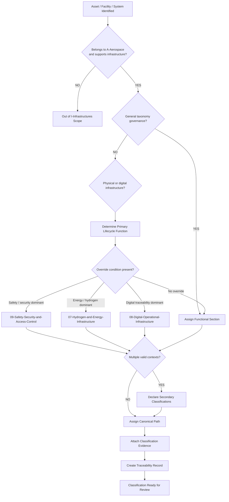
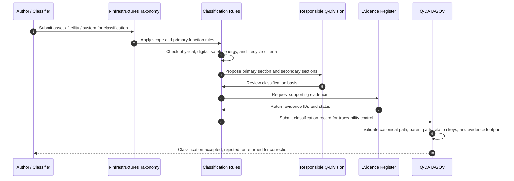
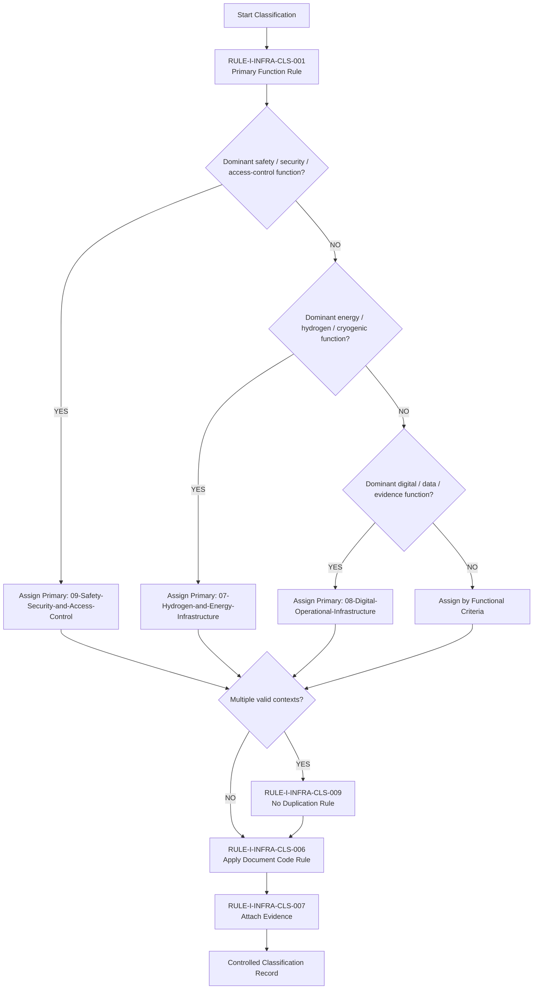
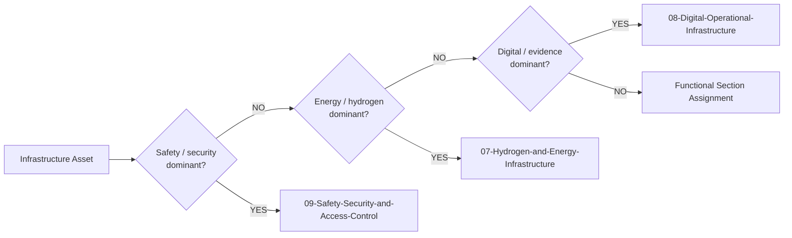
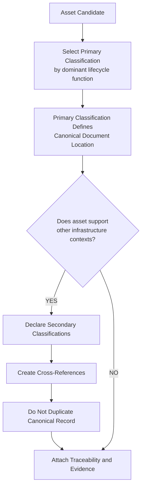
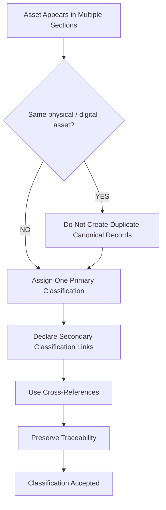
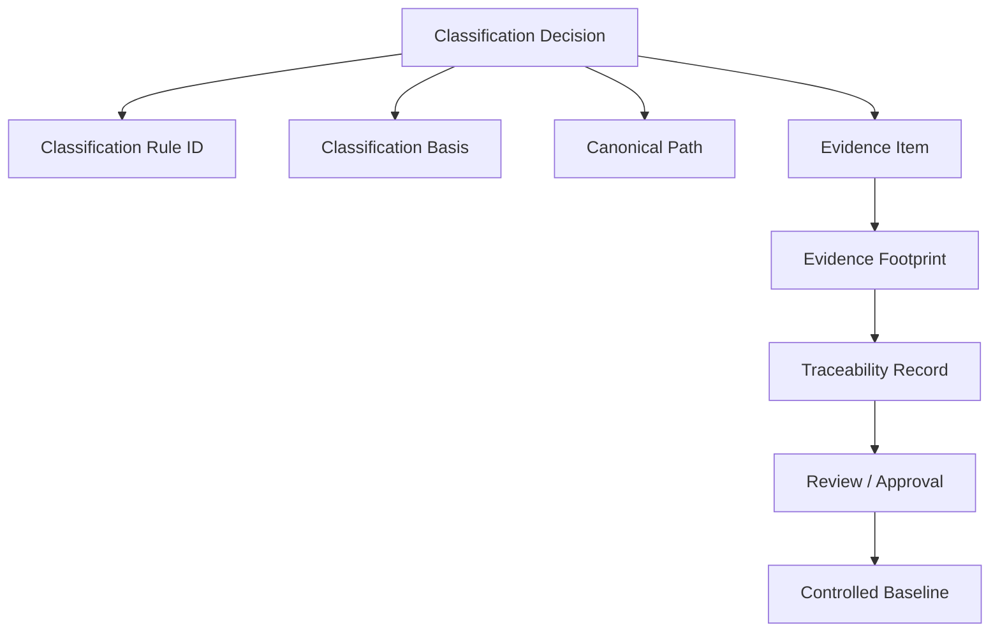
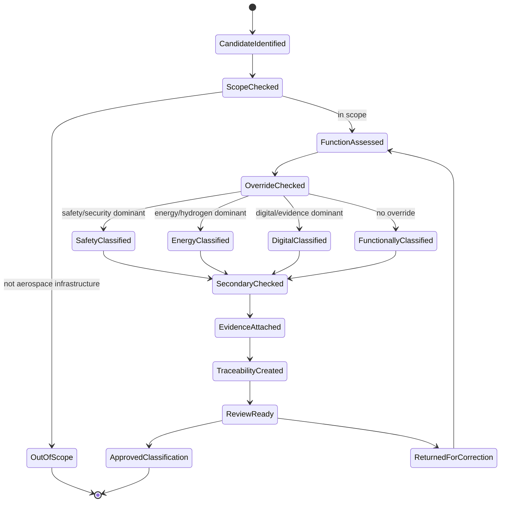

---

# 00-02-Infrastructure-Classification-Rules — Infrastructure Classification Rules

## Purpose

Rules and criteria for classifying aerospace infrastructure assets within this taxonomy.

This document defines how infrastructure assets, facilities, systems, environments, and supporting digital platforms shall be assigned to controlled sections under:

```text
IDEALE-ESG.panpara.eu/A-Aerospace/I-Infrastructures/00-General/
```

## Parent

[`README.md`](README.md) — `IDEALE-ESG/A-Aerospace/I-Infrastructures/00-General/`

---

# 1. Classification Principle

Every infrastructure asset shall be classified by its **primary lifecycle function**, not only by its physical form.

An asset shall be assigned to the section that best represents the activity it enables:

| Primary Function                                                                      | Classification Section                     |
| ------------------------------------------------------------------------------------- | ------------------------------------------ |
| Aircraft landing, taxiing, parking, servicing, passenger/cargo movement               | `01-Airports`                              |
| VTOL/eVTOL landing, charging, passenger access, AAM/UAM operations                    | `02-Vertiports`                            |
| Launch, reentry, launcher integration, payload processing, range safety               | `03-Spaceports-and-Launchers`              |
| Inspection, maintenance, repair, overhaul, return-to-service support                  | `04-Maintenance-Hangars`                   |
| Industrial assembly, major joins, production flow, final assembly                     | `05-Assemblies-and-FAL`                    |
| Verification, testing, certification evidence, qualification campaigns                | `06-Test-and-Certification-Infrastructure` |
| Hydrogen, cryogenics, electrical charging, refuelling, energy supply                  | `07-Hydrogen-and-Energy-Infrastructure`    |
| CSDB, PLM, IETP, digital twin, operational data, ledger, evidence systems             | `08-Digital-Operational-Infrastructure`    |
| Safety zones, restricted areas, physical security, emergency response, access control | `09-Safety-Security-and-Access-Control`    |

---

# 2. Classification Rules

## RULE-I-INFRA-CLS-001 — Primary Function Rule

An infrastructure asset shall be classified according to its dominant operational or lifecycle function.

If an asset supports multiple functions, the primary function shall be determined by:

1. the main activity performed there;
2. the dominant safety or certification role;
3. the lifecycle phase it primarily supports;
4. the responsible operating organization;
5. the evidence or data it generates.

## RULE-I-INFRA-CLS-002 — Physical vs Digital Rule

Physical infrastructure and digital infrastructure shall both be classified under `I-Infrastructures` when they enable aerospace lifecycle activity.

Physical examples:

* runway;
* taxiway;
* apron;
* hangar;
* launch pad;
* test rig;
* FAL station;
* LH2 storage area.

Digital examples:

* CSDB;
* PLM environment;
* IETP platform;
* digital twin;
* infrastructure data lake;
* certification evidence repository;
* operational ledger.

## RULE-I-INFRA-CLS-003 — Facility vs System Rule

A facility shall be classified by the infrastructure section representing its main use.

A system installed within that facility may receive a secondary classification if it has a distinct lifecycle, safety, energy, digital, or certification function.

Example:

| Item                                | Primary Classification                  | Secondary Classification                |
| ----------------------------------- | --------------------------------------- | --------------------------------------- |
| Airport hydrogen refuelling station | `07-Hydrogen-and-Energy-Infrastructure` | `01-Airports`                           |
| Airport passenger terminal          | `01-Airports`                           | `09-Safety-Security-and-Access-Control` |
| FAL quality gate database           | `08-Digital-Operational-Infrastructure` | `05-Assemblies-and-FAL`                 |
| Launch range safety system          | `09-Safety-Security-and-Access-Control` | `03-Spaceports-and-Launchers`           |

## RULE-I-INFRA-CLS-004 — Parent-Child Path Rule

Every classified infrastructure document shall preserve the parent-child path.

Required path pattern:

```text
IDEALE-ESG.panpara.eu/A-Aerospace/I-Infrastructures/<SECTION>/<DOCUMENT>.md
```

Example:

```text
IDEALE-ESG.panpara.eu/A-Aerospace/I-Infrastructures/01-Airports/01-01-Runways-Taxiways-and-Aprons.md
```

## RULE-I-INFRA-CLS-005 — Section Code Rule

Each infrastructure class shall use a two-digit section code.

| Section Code | Section Name                          |
| -----------: | ------------------------------------- |
|         `00` | General                               |
|         `01` | Airports                              |
|         `02` | Vertiports                            |
|         `03` | Spaceports and Launchers              |
|         `04` | Maintenance Hangars                   |
|         `05` | Assemblies and FAL                    |
|         `06` | Test and Certification Infrastructure |
|         `07` | Hydrogen and Energy Infrastructure    |
|         `08` | Digital Operational Infrastructure    |
|         `09` | Safety, Security and Access Control   |

## RULE-I-INFRA-CLS-006 — Local Document Code Rule

Each document under a section shall use the pattern:

```text
<SECTION-CODE>-<LOCAL-CODE>-<TITLE-SLUG>.md
```

Example:

```text
01-03-Ground-Support-Equipment-GSE.md
02-03-Charging-and-Energy-Infrastructure.md
03-05-Range-Safety-and-Flight-Termination-Interfaces.md
05-04-Major-Joins-and-Station-Flow.md
```

## RULE-I-INFRA-CLS-007 — Classification Evidence Rule

Each classified infrastructure asset shall include evidence supporting its classification.

Minimum evidence:

1. asset name;
2. asset type;
3. primary function;
4. parent infrastructure class;
5. operational context;
6. lifecycle phase;
7. applicable references;
8. traceability footprint.

## RULE-I-INFRA-CLS-008 — Multiple-Classification Rule

An asset may have one primary classification and one or more secondary classifications.

The primary classification shall define the canonical document location.

Secondary classifications shall be declared through cross-links, not duplicate source documents.

## RULE-I-INFRA-CLS-009 — No-Duplication Rule

The same infrastructure asset shall not be duplicated as independent canonical records in multiple sections.

When the same asset supports multiple infrastructure classes, use:

* primary classification;
* secondary classification;
* cross-reference;
* applicability statement;
* traceability link.

## RULE-I-INFRA-CLS-010 — Safety Override Rule

If an infrastructure element has a dominant safety, emergency, access-control, hazard-zone, or security function, it shall be classified under:

```text
09-Safety-Security-and-Access-Control/
```

It may retain secondary classification to the facility where it is physically installed.

## RULE-I-INFRA-CLS-011 — Energy Override Rule

If an infrastructure element primarily stores, transfers, converts, delivers, meters, or controls energy, it shall be classified under:

```text
07-Hydrogen-and-Energy-Infrastructure/
```

This includes:

* LH2 storage;
* cryogenic transfer systems;
* hydrogen refuelling stations;
* high-voltage charging systems;
* ground-power supply;
* energy metering;
* fuel-cell support infrastructure;
* emergency energy isolation systems.

## RULE-I-INFRA-CLS-012 — Digital Infrastructure Rule

If an infrastructure element primarily governs data, models, configuration, evidence, operational information, or lifecycle traceability, it shall be classified under:

```text
08-Digital-Operational-Infrastructure/
```

This includes:

* CSDB;
* PLM;
* IETP;
* digital twin;
* operational data platform;
* infrastructure ledger;
* evidence repository;
* maintenance data platform.

## RULE-I-INFRA-CLS-013 — Programme-Specific Asset Rule

Programme-specific infrastructure shall be classified under the relevant infrastructure section and linked to the corresponding `P-Programs` node.

Example:

```yaml
classification:
  primary_axis: "I-Infrastructures"
  primary_section: "05-Assemblies-and-FAL"
  linked_program_axis: "P-Programs"
  programme: "AMPEL360"
```

## RULE-I-INFRA-CLS-014 — Technology-Specific Asset Rule

Technology-specific infrastructure shall be classified under the relevant infrastructure section and linked to the corresponding `T-Technologies` node.

Example:

```yaml
classification:
  primary_axis: "I-Infrastructures"
  primary_section: "07-Hydrogen-and-Energy-Infrastructure"
  linked_technology_axis: "T-Technologies"
  technology: "LH2 Fuel Systems"
```

## RULE-I-INFRA-CLS-015 — Neural-Network Infrastructure Rule

Infrastructure supporting neural-network training, validation, inference, monitoring, simulation, prediction, or operational optimization shall be classified under the relevant infrastructure section and linked to the `N-Neural-Networks` axis.

Example:

```yaml
classification:
  primary_axis: "I-Infrastructures"
  primary_section: "08-Digital-Operational-Infrastructure"
  linked_neural_axis: "N-Neural-Networks"
  neural_function: "Predictive maintenance inference"
```

---

# 3. Classification Decision Tree

```text
START
 |
 |-- Does the asset support general taxonomy governance?
 |       |-- YES → 00-General
 |
 |-- Does the asset support aircraft landing, taxiing, parking, servicing, or passenger/cargo movement?
 |       |-- YES → 01-Airports
 |
 |-- Does the asset support VTOL/eVTOL/AAM/UAM landing, charging, passenger flow, or urban air mobility?
 |       |-- YES → 02-Vertiports
 |
 |-- Does the asset support launch, reentry, payload processing, launcher integration, or range safety?
 |       |-- YES → 03-Spaceports-and-Launchers
 |
 |-- Does the asset support maintenance, repair, inspection, overhaul, or return-to-service?
 |       |-- YES → 04-Maintenance-Hangars
 |
 |-- Does the asset support industrial assembly, major joins, station flow, or final assembly?
 |       |-- YES → 05-Assemblies-and-FAL
 |
 |-- Does the asset support test, verification, qualification, or certification evidence?
 |       |-- YES → 06-Test-and-Certification-Infrastructure
 |
 |-- Does the asset primarily store, transfer, convert, deliver, or control energy?
 |       |-- YES → 07-Hydrogen-and-Energy-Infrastructure
 |
 |-- Does the asset primarily manage digital operations, data, CSDB, PLM, IETP, digital twins, or evidence?
 |       |-- YES → 08-Digital-Operational-Infrastructure
 |
 |-- Does the asset primarily provide safety, security, emergency response, access control, or hazard zoning?
 |       |-- YES → 09-Safety-Security-and-Access-Control
 |
END
```

## 3.1 Classification Logic Overview



---

## 3.2 Classification Sequence Diagram



---

## 3.3 Rule Priority Logic



---

## 3.4 Override Decision Logic



---

## 3.5 Primary and Secondary Classification Logic



---

## 3.6 No-Duplication Logic



---

## 3.7 Evidence and Traceability Logic



---

## 3.8 Classification State Machine



---

## 3.9 Boolean Rule Representation

```yaml
classification_logic:
  scope_gate:
    in_scope: "asset.domain == 'A-Aerospace' and asset.supports_infrastructure == true"
    out_of_scope: "asset.domain != 'A-Aerospace' or asset.supports_infrastructure == false"

  primary_classification:
    rule: "primary_section = dominant_lifecycle_function(asset)"

  override_priority:
    - priority: 1
      condition: "asset.primary_function in ['safety', 'security', 'access_control', 'emergency_response', 'hazard_zoning']"
      result: "09-Safety-Security-and-Access-Control"

    - priority: 2
      condition: "asset.primary_function in ['hydrogen_storage', 'energy_transfer', 'refuelling', 'charging', 'cryogenic_control']"
      result: "07-Hydrogen-and-Energy-Infrastructure"

    - priority: 3
      condition: "asset.primary_function in ['data_governance', 'configuration_control', 'evidence_management', 'digital_twin', 'CSDB', 'PLM', 'IETP']"
      result: "08-Digital-Operational-Infrastructure"

    - priority: 4
      condition: "no_override_condition_detected"
      result: "functional_section_assignment"

  duplication_control:
    canonical_record_count: 1
    secondary_classifications_allowed: true
    duplicate_canonical_records_allowed: false

  evidence_required:
    minimum:
      - asset_name
      - asset_type
      - primary_function
      - classification_basis
      - canonical_path
      - lifecycle_role
      - traceability_footprint
      - evidence_footprint
```

---

## 3.10 Pseudocode Representation

```text
function classify_infrastructure_asset(asset):

    if asset.domain != "A-Aerospace":
        return OUT_OF_SCOPE

    if asset.supports_infrastructure == false:
        return OUT_OF_SCOPE

    if asset.supports_general_taxonomy_governance:
        primary_section = "00-General"

    else if asset.primary_function in SAFETY_SECURITY_ACCESS_CONTROL:
        primary_section = "09-Safety-Security-and-Access-Control"

    else if asset.primary_function in ENERGY_HYDROGEN_CRYOGENIC:
        primary_section = "07-Hydrogen-and-Energy-Infrastructure"

    else if asset.primary_function in DIGITAL_DATA_EVIDENCE:
        primary_section = "08-Digital-Operational-Infrastructure"

    else:
        primary_section = determine_by_lifecycle_function(asset)

    secondary_sections = identify_secondary_contexts(asset, primary_section)

    canonical_path = build_canonical_path(primary_section, asset)

    evidence = collect_classification_evidence(asset)

    traceability = create_traceability_record(
        asset,
        primary_section,
        secondary_sections,
        canonical_path,
        evidence
    )

    return classification_record(
        primary_section,
        secondary_sections,
        canonical_path,
        evidence,
        traceability
    )
```

---

## 3.11 Decision Table Representation

| Condition | Primary Result | Secondary Result |
|---|---|---|
| Asset supports general taxonomy governance | `00-General` | None unless cross-axis governance applies. |
| Asset supports aircraft landing, taxiing, parking, servicing, passenger/cargo flow | `01-Airports` | `07` if energy; `09` if safety/security; `08` if digital. |
| Asset supports VTOL/eVTOL/AAM/UAM operations | `02-Vertiports` | `07` if charging/energy; `09` if safety/security; `08` if digital. |
| Asset supports launch, reentry, launcher integration, payload processing | `03-Spaceports-and-Launchers` | `09` if range safety; `08` if mission data; `06` if test/certification. |
| Asset supports inspection, maintenance, repair, overhaul | `04-Maintenance-Hangars` | `09` if safety zone; `08` if maintenance data; `05` if production interface. |
| Asset supports assembly, major joins, production flow, FAL | `05-Assemblies-and-FAL` | `08` if digital production system; `06` if verification station; `09` if restricted area. |
| Asset supports verification, qualification, test, certification evidence | `06-Test-and-Certification-Infrastructure` | `08` if evidence repository; `09` if safety-critical test zone. |
| Asset primarily stores, transfers, converts, delivers, meters, or controls energy | `07-Hydrogen-and-Energy-Infrastructure` | Physical host section as secondary. |
| Asset primarily manages CSDB, PLM, IETP, digital twin, data, ledger, or evidence | `08-Digital-Operational-Infrastructure` | Physical/operational section as secondary. |
| Asset primarily provides safety, security, access control, emergency response, hazard zoning | `09-Safety-Security-and-Access-Control` | Physical host section as secondary. |

---

# 4. Primary and Secondary Classification

## 4.1 Primary Classification

The **primary classification** defines the canonical location of the infrastructure asset.

Required fields:

```yaml
primary_classification:
  opt_in_axis: "I-Infrastructures"
  section_code: ""
  section_name: ""
  classification_basis: ""
  canonical_path: ""
```

## 4.2 Secondary Classification

A **secondary classification** identifies additional relevant infrastructure contexts without duplicating the canonical source document.

Required fields:

```yaml
secondary_classification:
  related_sections:
    - section_code: ""
      section_name: ""
      relation: ""
```

## 4.3 Classification Example

```yaml
asset:
  name: "LH2 Airport Refuelling Station"
  asset_type: "Energy infrastructure"
  primary_classification:
    opt_in_axis: "I-Infrastructures"
    section_code: "07"
    section_name: "Hydrogen and Energy Infrastructure"
    classification_basis: "Primary function is LH2 storage, conditioning, transfer, and refuelling."
    canonical_path: "IDEALE-ESG.panpara.eu/A-Aerospace/I-Infrastructures/07-Hydrogen-and-Energy-Infrastructure/"
  secondary_classification:
    related_sections:
      - section_code: "01"
        section_name: "Airports"
        relation: "Installed within airport operational environment."
      - section_code: "09"
        section_name: "Safety, Security and Access Control"
        relation: "Requires safety zones, emergency response, access control, and hazard management."
```

---

# 5. Classification Criteria

## 5.1 Functional Criteria

Classify by the function the infrastructure performs:

| Function                | Classification                             |
| ----------------------- | ------------------------------------------ |
| landing and take-off    | `01-Airports` or `02-Vertiports`           |
| launch and reentry      | `03-Spaceports-and-Launchers`              |
| maintenance and repair  | `04-Maintenance-Hangars`                   |
| assembly and production | `05-Assemblies-and-FAL`                    |
| test and certification  | `06-Test-and-Certification-Infrastructure` |
| energy and refuelling   | `07-Hydrogen-and-Energy-Infrastructure`    |
| digital operations      | `08-Digital-Operational-Infrastructure`    |
| safety and security     | `09-Safety-Security-and-Access-Control`    |

## 5.2 Lifecycle Criteria

Classify by the lifecycle phase primarily supported:

| Lifecycle Role                 | Classification                                                |
| ------------------------------ | ------------------------------------------------------------- |
| concept governance             | `00-General`                                                  |
| operation                      | `01-Airports`, `02-Vertiports`, `03-Spaceports-and-Launchers` |
| maintenance                    | `04-Maintenance-Hangars`                                      |
| production                     | `05-Assemblies-and-FAL`                                       |
| verification and certification | `06-Test-and-Certification-Infrastructure`                    |
| energy supply                  | `07-Hydrogen-and-Energy-Infrastructure`                       |
| data governance                | `08-Digital-Operational-Infrastructure`                       |
| hazard control                 | `09-Safety-Security-and-Access-Control`                       |

## 5.3 Asset-Type Criteria

Classify by asset type when the function is ambiguous:

| Asset Type                                         | Default Classification                     |
| -------------------------------------------------- | ------------------------------------------ |
| runway, taxiway, apron, stand                      | `01-Airports`                              |
| FATO, TLOF, vertiport pad                          | `02-Vertiports`                            |
| launch pad, integration tower, payload facility    | `03-Spaceports-and-Launchers`              |
| hangar bay, MRO dock, inspection platform          | `04-Maintenance-Hangars`                   |
| jig, fixture, FAL station, major-join station      | `05-Assemblies-and-FAL`                    |
| test rig, lab, certification evidence facility     | `06-Test-and-Certification-Infrastructure` |
| LH2 tank, charging station, refuelling system      | `07-Hydrogen-and-Energy-Infrastructure`    |
| CSDB, PLM, digital twin, ledger                    | `08-Digital-Operational-Infrastructure`    |
| safety zone, access-control gate, emergency system | `09-Safety-Security-and-Access-Control`    |

---

# 6. Ambiguity Resolution

## 6.1 Ambiguity Rule

When an asset could fit multiple sections, classify it by asking:

1. What is the asset’s primary function?
2. What lifecycle phase does it mainly support?
3. Which organization operates or owns it?
4. What failure mode dominates its risk profile?
5. What evidence does it generate?
6. Which section would be the most useful canonical location for downstream reuse?

## 6.2 Tie-Breaking Order

If classification remains ambiguous, apply the following order:

1. safety-critical function;
2. energy or hazardous-material function;
3. certification or test function;
4. operational function;
5. industrial production function;
6. digital traceability function;
7. physical location.

## 6.3 Physical Location Is Not Sufficient

Physical location alone shall not determine classification.

Example:

An LH2 refuelling station located at an airport shall not be classified primarily as `01-Airports` if its dominant function is hydrogen energy storage and transfer.

Primary classification:

```text
07-Hydrogen-and-Energy-Infrastructure
```

Secondary classification:

```text
01-Airports
```

---

# 7. Naming Rules

## 7.1 Folder Naming

Folder names shall use:

* two-digit section code;
* hyphenated English title;
* title-case keywords;
* no spaces;
* no uncontrolled abbreviations except accepted abbreviations such as `FAL`, `GSE`, `LH2`, `CSDB`, `PLM`, `IETP`.

Example:

```text
05-Assemblies-and-FAL/
07-Hydrogen-and-Energy-Infrastructure/
08-Digital-Operational-Infrastructure/
```

## 7.2 Document Naming

Document names shall use:

```text
<SECTION-CODE>-<LOCAL-CODE>-<TITLE-SLUG>.md
```

Example:

```text
00-02-Infrastructure-Classification-Rules.md
01-05-Fuel-and-Hydrogen-Readiness.md
05-04-Major-Joins-and-Station-Flow.md
```

## 7.3 Title Naming

Document titles shall use:

```text
<SECTION-CODE>-<LOCAL-CODE>-<Title> — <Readable Title>
```

Example:

```text
00-02-Infrastructure-Classification-Rules — Infrastructure Classification Rules
```

---

# 8. Required Classification Record

Every classified infrastructure asset should be expressible using the following minimum record:

```yaml
infrastructure_classification_record:
  asset_id: ""
  asset_name: ""
  asset_type: ""
  primary_function: ""
  lifecycle_role: ""
  primary_classification:
    section_code: ""
    section_name: ""
    canonical_path: ""
  secondary_classifications:
    - section_code: ""
      section_name: ""
      relation: ""
  applicability:
    domain: "A-Aerospace"
    opt_in_axis: "I-Infrastructures"
    programme: ""
    facility: ""
    configuration: ""
  references:
    citation_keys: []
  traceability:
    upstream: []
    downstream: []
  evidence:
    evidence_items: []
  status: "controlled-candidate"
```

---

# 9. Classification Examples

## 9.1 Airport Runway

```yaml
asset:
  asset_name: "Runway"
  asset_type: "Physical airport infrastructure"
  primary_function: "Aircraft landing and take-off"
  primary_classification:
    section_code: "01"
    section_name: "Airports"
```

## 9.2 Vertiport Charging Pad

```yaml
asset:
  asset_name: "eVTOL Charging Pad"
  asset_type: "Vertiport and energy interface"
  primary_function: "VTOL parking and charging"
  primary_classification:
    section_code: "02"
    section_name: "Vertiports"
  secondary_classifications:
    - section_code: "07"
      section_name: "Hydrogen and Energy Infrastructure"
      relation: "Electrical charging interface"
```

## 9.3 Launch Pad

```yaml
asset:
  asset_name: "Launch Pad"
  asset_type: "Spaceport infrastructure"
  primary_function: "Launcher preparation and launch"
  primary_classification:
    section_code: "03"
    section_name: "Spaceports and Launchers"
  secondary_classifications:
    - section_code: "09"
      section_name: "Safety, Security and Access Control"
      relation: "Launch hazard zones and access control"
```

## 9.4 Maintenance Hangar Dock

```yaml
asset:
  asset_name: "Widebody Maintenance Dock"
  asset_type: "Maintenance infrastructure"
  primary_function: "Aircraft access, inspection, and repair"
  primary_classification:
    section_code: "04"
    section_name: "Maintenance Hangars"
```

## 9.5 FAL Station

```yaml
asset:
  asset_name: "Final Assembly Line Station 40"
  asset_type: "Industrial assembly infrastructure"
  primary_function: "Major assembly integration"
  primary_classification:
    section_code: "05"
    section_name: "Assemblies and FAL"
```

## 9.6 Structural Test Rig

```yaml
asset:
  asset_name: "Full-Scale Wing Structural Test Rig"
  asset_type: "Test infrastructure"
  primary_function: "Structural verification and certification evidence generation"
  primary_classification:
    section_code: "06"
    section_name: "Test and Certification Infrastructure"
```

## 9.7 LH2 Storage Farm

```yaml
asset:
  asset_name: "LH2 Storage Farm"
  asset_type: "Hydrogen energy infrastructure"
  primary_function: "Liquid hydrogen storage and distribution"
  primary_classification:
    section_code: "07"
    section_name: "Hydrogen and Energy Infrastructure"
  secondary_classifications:
    - section_code: "09"
      section_name: "Safety, Security and Access Control"
      relation: "Cryogenic hazard zoning and emergency response"
```

## 9.8 CSDB Environment

```yaml
asset:
  asset_name: "S1000D CSDB"
  asset_type: "Digital operational infrastructure"
  primary_function: "Technical publication source-data management"
  primary_classification:
    section_code: "08"
    section_name: "Digital Operational Infrastructure"
```

## 9.9 Emergency Response Zone

```yaml
asset:
  asset_name: "Airport Emergency Response Zone"
  asset_type: "Safety infrastructure"
  primary_function: "Emergency response and hazard isolation"
  primary_classification:
    section_code: "09"
    section_name: "Safety, Security and Access Control"
  secondary_classifications:
    - section_code: "01"
      section_name: "Airports"
      relation: "Located within airport operational environment"
```

---

# 10. Traceability Requirements

Each classification decision shall be traceable to:

1. taxonomy section;
2. classification rule;
3. primary function;
4. lifecycle role;
5. applicable references;
6. parent document;
7. responsible owner;
8. evidence item.

Required traceability pattern:

```yaml
traceability:
  classification_rule:
    - "RULE-I-INFRA-CLS-001"
    - "RULE-I-INFRA-CLS-008"
  upstream:
    - document_id: "IDEALE-ESG-A-AEROSPACE-I-INFRASTRUCTURES-00-00-SCOPE-PURPOSE"
    - document_id: "IDEALE-ESG-A-AEROSPACE-I-INFRASTRUCTURES-00-01-DEFINITIONS"
  downstream:
    - section_code: ""
      section_name: ""
  evidence:
    - evidence_id: ""
      evidence_type: ""
      evidence_status: ""
```

---

# 11. Footprints

## Semantic Footprint

```yaml
semantic_footprint:
  id: FP-SEM-I-INFRA-00-02
  subject: "Classification rules for aerospace infrastructure assets"
  meaning_boundary:
    includes:
      - classification logic
      - primary and secondary classification
      - section-code assignment
      - ambiguity resolution
      - naming rules
      - classification evidence
    excludes:
      - detailed facility design
      - detailed certification demonstration
      - programme-specific engineering work instructions
```

## Taxonomy Footprint

```yaml
taxonomy_footprint:
  id: FP-TAX-I-INFRA-00-02
  hierarchy:
    root: "IDEALE-ESG"
    domain: "A-Aerospace"
    opt_in_axis: "I-Infrastructures"
    section: "00-General"
    document: "00-02-Infrastructure-Classification-Rules"
```

## Lifecycle Footprint

```yaml
lifecycle_footprint:
  id: FP-LC-I-INFRA-00-02
  lifecycle_phase: "LC01"
  lifecycle_role: "Classification rule definition and taxonomy control"
  exit_criteria:
    - section codes defined
    - primary classification rule established
    - secondary classification rule established
    - ambiguity-resolution logic defined
    - classification record template provided
    - traceability requirements defined
```

## Compliance Footprint

```yaml
compliance_footprint:
  id: FP-COMP-I-INFRA-00-02
  reference_families:
    aerodromes:
      - "ICAO-ANNEX14"
      - "EASA-ADR"
    vertiports:
      - "EASA-VERTIPORT"
    launch_and_reentry:
      - "FAA-LAUNCH"
      - "ECSS"
    quality_management:
      - "IAQG-9100"
    asset_and_risk_management:
      - "ISO-55000"
      - "ISO-31000"
```

## Evidence Footprint

```yaml
evidence_footprint:
  id: FP-EVD-I-INFRA-00-02
  expected_evidence:
    - controlled markdown document
    - YAML frontmatter
    - canonical path
    - parent path
    - classification rules
    - decision tree
    - classification examples
    - citation keys
    - reference map
    - traceability requirements
```

---

# 12. Citation Map

| Citation Key     | Applies To                     | Use in This Taxonomy                                                                                 |
| ---------------- | ------------------------------ | ---------------------------------------------------------------------------------------------------- |
| `ICAO-ANNEX14`   | Airports / Aerodromes          | Classification support for airport-side infrastructure and aerodrome terminology.                    |
| `EASA-ADR`       | EU aerodrome infrastructure    | Classification support for EU airport and aerodrome infrastructure governance.                       |
| `EASA-VERTIPORT` | Vertiports                     | Classification support for VTOL/eVTOL vertiport infrastructure.                                      |
| `FAA-LAUNCH`     | Spaceports / Launchers         | Classification support for launch, reentry, range safety, and spaceport infrastructure.              |
| `ECSS`           | Space systems / Ground systems | Classification support for space infrastructure, ground support, engineering, and product assurance. |
| `IAQG-9100`      | Aerospace quality management   | Classification support for aviation, space, and defense quality-managed infrastructure.              |
| `ISO-55000`      | Asset management               | Classification support for infrastructure asset lifecycle and asset-governance principles.           |
| `ISO-31000`      | Risk management                | Classification support for risk, hazard, uncertainty, and control-based classification.              |

---

# 13. Controlled References

## [ICAO-ANNEX14]

**ICAO Annex 14 — Aerodromes, Volume I, Aerodrome Design and Operations.**

Used as the airport and aerodrome reference family for classifying airport-side infrastructure.

## [EASA-ADR]

**EASA Easy Access Rules for Aerodromes — Regulation (EU) No 139/2014.**

Used as the EU aerodrome regulatory and administrative reference family for airport infrastructure classification.

## [EASA-VERTIPORT]

**EASA Prototype Technical Design Specifications for Vertiports.**

Used as the vertiport design and terminology reference family for classifying VTOL/eVTOL infrastructure.

## [FAA-LAUNCH]

**14 CFR Part 450 — Launch and Reentry License Requirements.**

Used as the launch and reentry reference family for classifying spaceport, launch-site, launcher, and range-safety infrastructure.

## [ECSS]

**European Cooperation for Space Standardization — ECSS Standards.**

Used as the European space standardization reference family for classifying space infrastructure, launch support, ground systems, product assurance, and engineering governance.

## [IAQG-9100]

**IAQG 9100 — Quality Management Systems Requirements for Aviation, Space and Defense Organizations.**

Used as the aerospace quality-management reference family for infrastructure suppliers, operators, production systems, maintenance systems, and lifecycle governance.

## [ISO-55000]

**ISO 55000 — Asset Management, Vocabulary, Overview and Principles.**

Used as the asset-management reference family for lifecycle asset classification, value, risk, and infrastructure governance.

## [ISO-31000]

**ISO 31000 — Risk Management.**

Used as the risk-management reference family for hazard, uncertainty, risk, and control-based infrastructure classification.

---

# 14. Governance Rule

Any infrastructure asset classified under `I-Infrastructures` shall include:

1. a primary classification;
2. a classification basis;
3. a canonical path;
4. a lifecycle role;
5. applicable secondary classifications, if required;
6. citation keys, if external standards or regulatory families are invoked;
7. a traceability footprint;
8. an evidence footprint.

Classification shall be stable enough to support downstream authoring, infrastructure documentation, lifecycle governance, and evidence reuse.

---

# 15. Acceptance Criteria

This document is acceptable when:

* classification sections are defined;
* primary and secondary classification rules are clear;
* naming rules are stated;
* ambiguity-resolution logic is provided;
* classification examples are included;
* citation keys are declared;
* traceability requirements are defined;
* child documents can apply the rules without requiring reinterpretation.

---

# 16. Summary

`00-02-Infrastructure-Classification-Rules` defines the controlled rules for assigning aerospace infrastructure assets to the `I-Infrastructures` taxonomy.

Its function is to ensure that airports, vertiports, spaceports, launchers, maintenance hangars, assemblies, FAL environments, test facilities, hydrogen and energy systems, digital operational systems, and safety/security assets are classified consistently, traceably, and without uncontrolled duplication.
