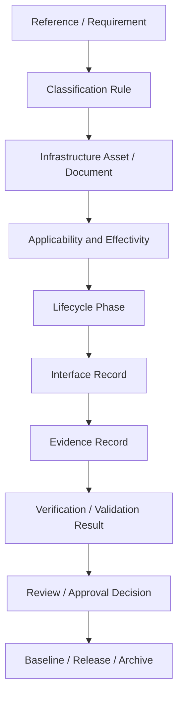
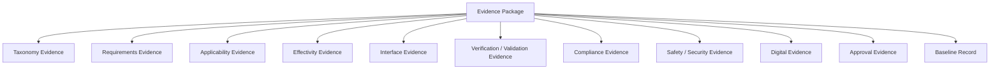
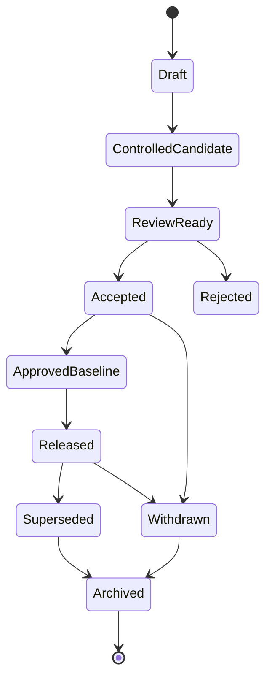
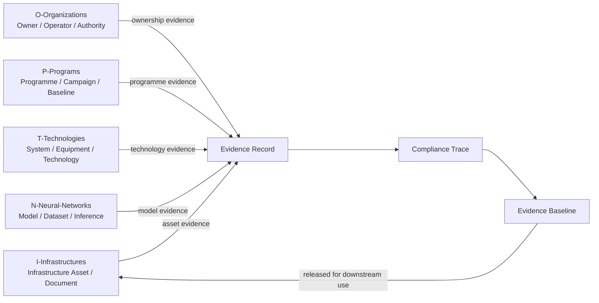

# 00-07-Traceability-and-Evidence — Traceability and Evidence

## Purpose

Traceability requirements and evidence packaging for infrastructure compliance.

This document defines the controlled traceability and evidence model for infrastructure assets, facilities, digital systems, lifecycle records, compliance mappings, and governance decisions under:

```text
IDEALE-ESG/A-Aerospace/I-Infrastructures/00-General/
```

## Parent

[`README.md`](README.md) — `IDEALE-ESG/A-Aerospace/I-Infrastructures/00-General/`

---

# 1. Traceability and Evidence Principle

Every infrastructure classification, applicability statement, lifecycle decision, interface, compliance mapping, and governance approval shall be traceable to evidence.

Traceability shall answer:

```text
Where did this claim, decision, requirement, classification, or compliance statement come from?
```

Evidence shall answer:

```text
What controlled artifact supports the claim, decision, requirement, classification, or compliance statement?
```

No infrastructure document shall claim compliance without a defined evidence basis.

---

# 2. Scope

This document applies to traceability and evidence packaging for:

| Section | Infrastructure Class |
|---:|---|
| `00` | General |
| `01` | Airports |
| `02` | Vertiports |
| `03` | Spaceports and Launchers |
| `04` | Maintenance Hangars |
| `05` | Assemblies and FAL |
| `06` | Test and Certification Infrastructure |
| `07` | Hydrogen and Energy Infrastructure |
| `08` | Digital Operational Infrastructure |
| `09` | Safety, Security and Access Control |

---

# 3. Controlled Definitions

## 3.1 Traceability

**Traceability** is the ability to link a statement, requirement, asset, document, reference, decision, interface, configuration, evidence item, or lifecycle event to its origin, rationale, parent, child, verification record, approval state, and downstream use.

## 3.2 Evidence

**Evidence** is controlled information used to support a claim, classification, decision, requirement, interface, compliance statement, lifecycle gate, or governance action.

## 3.3 Evidence Package

An **evidence package** is a controlled set of evidence records assembled for a defined purpose, such as classification, lifecycle gate review, compliance mapping, certification support, commissioning, maintenance, audit, or decommissioning.

## 3.4 Evidence Record

An **evidence record** is a controlled metadata block that identifies one evidence item, its owner, status, location, lifecycle phase, applicability, effectivity, and traceability links.

## 3.5 Traceability Matrix

A **traceability matrix** is a controlled table linking requirements, rules, assets, references, evidence, verification methods, lifecycle phases, and approval states.

## 3.6 Compliance Trace

A **compliance trace** is a controlled link between an applicable standard, regulation, requirement, means of compliance, evidence item, and verification result.

## 3.7 Digital Thread

A **digital thread** is the controlled continuity of data, evidence, configuration, and lifecycle records across the infrastructure lifecycle.

## 3.8 Evidence Baseline

An **evidence baseline** is an approved set of evidence records frozen at a defined lifecycle gate, configuration state, or review point.

---

# 4. Traceability Model

## 4.1 Required Traceability Chain

Each infrastructure item shall preserve the following traceability chain when applicable:

```text
Reference / Requirement
        ↓
Classification Rule
        ↓
Infrastructure Asset / Document
        ↓
Applicability and Effectivity
        ↓
Lifecycle Phase
        ↓
Interface Record
        ↓
Evidence Record
        ↓
Verification / Validation Result
        ↓
Review / Approval Decision
        ↓
Baseline / Release / Archive
```

## 4.2 Traceability Chain Diagram



---

# 5. Traceability Requirements

## RULE-I-INFRA-TRC-001 — Source Traceability Rule

Each controlled statement shall be traceable to a source.

Sources may include:

- parent taxonomy document;
- controlled definition;
- classification rule;
- standard;
- regulation;
- guidance document;
- programme requirement;
- asset record;
- facility record;
- design record;
- test record;
- inspection record;
- approval record;
- change record.

## RULE-I-INFRA-TRC-002 — Parent-Child Traceability Rule

Each child document under `I-Infrastructures` shall trace to its parent path and parent document.

Minimum fields:

```yaml
parent_traceability:
  parent_path: "IDEALE-ESG/A-Aerospace/I-Infrastructures/00-General/"
  parent_document: "README.md"
  upstream_documents:
    - "00-00-Scope-and-Purpose"
    - "00-01-Definitions"
    - "00-02-Infrastructure-Classification-Rules"
    - "00-03-Standards-and-Regulatory-References"
    - "00-04-Applicability-and-Effectivity"
    - "00-05-Lifecycle-and-Governance"
    - "00-06-Interfaces-with-OPTIN-Axes"
```

## RULE-I-INFRA-TRC-003 — Bidirectional Traceability Rule

Traceability shall be bidirectional when the item supports lifecycle, compliance, certification, safety, security, or digital-governance decisions.

Bidirectional traceability means:

```text
upstream source → evidence item → downstream use
downstream use → evidence item → upstream source
```

## RULE-I-INFRA-TRC-004 — Evidence Link Rule

Each classification, applicability, effectivity, lifecycle, interface, or compliance claim shall identify at least one supporting evidence item.

## RULE-I-INFRA-TRC-005 — No Orphan Evidence Rule

No evidence item shall exist without:

1. evidence ID;
2. evidence class;
3. owner;
4. lifecycle phase;
5. related asset or document;
6. storage location or reference path;
7. status;
8. traceability links.

## RULE-I-INFRA-TRC-006 — No Unsupported Compliance Rule

No document shall claim compliance unless the claim is supported by:

1. applicable reference;
2. requirement or clause mapping;
3. evidence item;
4. verification or validation method;
5. result or status;
6. reviewer or approver;
7. applicability and effectivity statement.

## RULE-I-INFRA-TRC-007 — Change Traceability Rule

Any change affecting classification, applicability, effectivity, lifecycle, interface, compliance, safety, security, or evidence shall produce a change trace.

## RULE-I-INFRA-TRC-008 — Supersession Traceability Rule

Superseded evidence shall remain traceable.

It shall identify:

- superseded evidence ID;
- replacement evidence ID;
- supersession date;
- reason for supersession;
- retained applicability, if any;
- archival location.

## RULE-I-INFRA-TRC-009 — Digital Evidence Rule

Digital evidence shall declare its digital effectivity.

Digital effectivity may include:

- CSDB baseline;
- PLM baseline;
- IETP release;
- digital twin version;
- dataset version;
- schema version;
- model version;
- ledger entry;
- hash or checksum;
- repository path;
- release tag.

## RULE-I-INFRA-TRC-010 — Evidence Baseline Rule

Evidence used for gate approval, compliance mapping, certification support, or release shall be baselined.

---

# 6. Evidence Classes

Evidence shall be classified using the following controlled evidence classes.

| Evidence Class | Purpose | Examples |
|---|---|---|
| `taxonomy-evidence` | Supports taxonomy structure, naming, classification, and parent-child logic. | README, classification rule, definitions document. |
| `requirements-evidence` | Supports infrastructure requirements and stakeholder needs. | Requirements matrix, need statement, constraints register. |
| `classification-evidence` | Supports infrastructure class assignment. | Classification record, decision tree, rationale. |
| `applicability-evidence` | Supports applicability scope. | Applicability matrix, jurisdiction statement, asset scope record. |
| `effectivity-evidence` | Supports exact asset, configuration, programme, jurisdiction, or version scope. | Effectivity record, baseline record, configuration record. |
| `design-evidence` | Supports infrastructure design or architecture. | Layout, drawing, model, architecture description. |
| `interface-evidence` | Supports cross-axis or system interfaces. | ICD, interface matrix, RACI, integration record. |
| `verification-evidence` | Supports verification that requirements are met. | Test plan, test result, inspection report, analysis report. |
| `validation-evidence` | Supports validation that intended use is satisfied. | Operational trial, stakeholder acceptance, commissioning record. |
| `certification-evidence` | Supports certification or authority review. | Compliance matrix, MoC record, conformity record, issue paper. |
| `safety-evidence` | Supports hazard, risk, emergency, or safety-zone control. | Hazard log, risk assessment, emergency-response plan. |
| `security-evidence` | Supports access control, restricted areas, cyber-physical security. | Security plan, access matrix, security assessment. |
| `quality-evidence` | Supports QMS and process control. | Audit record, nonconformity record, corrective action. |
| `maintenance-evidence` | Supports maintenance and operational support. | Inspection record, calibration record, repair record. |
| `digital-evidence` | Supports digital systems, data, models, ledgers, or publication systems. | CSDB package, PLM record, IETP release, digital twin version. |
| `neural-evidence` | Supports AI, ML, neural-network, inference, or model governance. | Model card, validation report, dataset card, monitoring record. |
| `change-evidence` | Supports governed changes. | Change request, impact assessment, approval record. |
| `baseline-evidence` | Supports approved baseline state. | Baseline package, release record, configuration index. |
| `archive-evidence` | Supports retirement, decommissioning, or historical preservation. | Archive register, retention record, decommissioning package. |

---

# 7. Evidence Record Template

Each evidence item shall be expressible using the following controlled structure.

```yaml
evidence_record:
  evidence_id: ""
  evidence_title: ""
  evidence_class: ""
  status: "controlled-candidate"
  version: "0.1.0"
  revision: "A"

  owner: ""
  author: ""
  reviewer: ""
  approver: ""

  related_domain: "A-Aerospace"
  related_axis: "I-Infrastructures"
  related_section: ""
  related_document_id: ""
  related_asset_id: ""

  lifecycle_phase: ""
  maturity_state: ""

  applicability:
    applies_to:
      - ""
    does_not_apply_to:
      - ""
    applicability_basis: ""

  effectivity:
    asset_effectivity: ""
    programme_effectivity: ""
    facility_effectivity: ""
    configuration_effectivity: ""
    temporal_effectivity: ""
    jurisdiction_effectivity: ""
    digital_effectivity: ""

  traceability:
    upstream:
      - ""
    downstream:
      - ""
    related_requirements:
      - ""
    related_references:
      - ""
    related_interfaces:
      - ""

  storage:
    repository_path: ""
    file_name: ""
    format: ""
    hash: ""
    ledger_entry: ""

  approval:
    approval_status: ""
    approval_date: ""
    approval_authority: ""

  retention:
    retention_status: ""
    archive_required: true
    archive_location: ""
```

---

# 8. Evidence Package Template

```yaml
evidence_package:
  package_id: ""
  package_title: ""
  package_type: ""
  status: "controlled-candidate"
  version: "0.1.0"
  revision: "A"

  purpose: ""
  owner: ""
  lifecycle_phase: ""
  infrastructure_section: ""

  applicability:
    applies_to:
      - ""
    does_not_apply_to:
      - ""

  effectivity:
    asset_effectivity: ""
    programme_effectivity: ""
    facility_effectivity: ""
    configuration_effectivity: ""
    temporal_effectivity: ""
    jurisdiction_effectivity: ""

  evidence_items:
    - evidence_id: ""
      evidence_class: ""
      title: ""
      status: ""
      repository_path: ""

  traceability_matrix:
    requirements:
      - requirement_id: ""
        evidence_id: ""
        verification_method: ""
        result: ""
        status: ""

  approvals:
    reviewers:
      - ""
    approver: ""
    approval_date: ""

  release:
    baseline_id: ""
    release_status: ""
    released_on: ""
```

---

# 9. Traceability Matrix Template

```yaml
traceability_matrix:
  matrix_id: ""
  title: ""
  infrastructure_section: ""
  lifecycle_phase: ""
  status: "controlled-candidate"

  rows:
    - trace_id: ""
      source_type: ""
      source_id: ""
      requirement_or_rule: ""
      infrastructure_asset_id: ""
      applicability_id: ""
      effectivity_id: ""
      evidence_id: ""
      verification_method: ""
      result: ""
      approval_status: ""
      downstream_use:
        - ""
```

---

# 10. Compliance Trace Template

A compliance trace shall be used when infrastructure claims are mapped to standards, regulations, guidance, or certification references.

```yaml
compliance_trace:
  compliance_trace_id: ""
  infrastructure_section: ""
  infrastructure_asset_id: ""
  reference:
    citation_key: ""
    reference_title: ""
    issuing_body: ""
    jurisdiction: ""
    clause_or_requirement: ""
  applicability:
    applicability_basis: ""
    jurisdiction_basis: ""
    programme_basis: ""
  means_of_compliance:
    moc_id: ""
    moc_type: ""
    description: ""
  evidence:
    evidence_id: ""
    evidence_class: "certification-evidence"
    repository_path: ""
  verification:
    method: ""
    result: ""
    status: ""
  approval:
    reviewer: ""
    approver: ""
    decision: ""
    decision_date: ""
```

---

# 11. Evidence Packaging Types

| Package Type | Purpose |
|---|---|
| `classification-package` | Supports classification of an infrastructure asset or section. |
| `applicability-package` | Supports applicability and scope decisions. |
| `effectivity-package` | Supports asset, configuration, programme, temporal, jurisdiction, or digital effectivity. |
| `interface-package` | Supports interface control and cross-axis traceability. |
| `lifecycle-gate-package` | Supports lifecycle gate review and maturity progression. |
| `compliance-package` | Supports standards, regulatory, or internal compliance mapping. |
| `certification-support-package` | Supports certification basis, MoC, verification, and authority review. |
| `safety-package` | Supports hazard identification, risk assessment, emergency response, and safety controls. |
| `security-package` | Supports physical security, access control, restricted areas, and cyber-physical protection. |
| `digital-thread-package` | Supports CSDB, PLM, IETP, digital twin, ledger, and operational-data traceability. |
| `neural-governance-package` | Supports AI/ML model validation, dataset traceability, inference monitoring, and deterministic control. |
| `change-package` | Supports change impact assessment, approval, and supersession. |
| `archive-package` | Supports retirement, decommissioning, archival, and historical traceability. |

---

# 12. Evidence Package Architecture



---

# 13. Evidence Status Model

Evidence records shall use controlled status values.

| Evidence Status | Meaning |
|---|---|
| `draft` | Evidence item is incomplete or unreviewed. |
| `controlled-candidate` | Evidence item has structure, ID, owner, and traceability context. |
| `review-ready` | Evidence item is ready for technical, quality, safety, regulatory, or governance review. |
| `accepted` | Evidence item has been accepted for a defined use. |
| `approved-baseline` | Evidence item is approved and baselined. |
| `released` | Evidence item is released for downstream use. |
| `superseded` | Evidence item has been replaced. |
| `withdrawn` | Evidence item is removed from active use. |
| `archived` | Evidence item is preserved for historical or audit traceability. |
| `rejected` | Evidence item is not accepted for the declared purpose. |

---

# 14. Verification and Validation Linkage

## 14.1 Verification Methods

| Verification Method | Meaning |
|---|---|
| `inspection` | Confirmation by review, observation, or physical inspection. |
| `analysis` | Confirmation through calculation, modelling, simulation, or analytical reasoning. |
| `test` | Confirmation through controlled test execution. |
| `demonstration` | Confirmation by showing the item performs its intended function. |
| `audit` | Confirmation through process or compliance audit. |
| `simulation` | Confirmation through simulation environment or digital model. |
| `document-review` | Confirmation through controlled document review. |
| `data-review` | Confirmation through dataset, data trace, or digital record review. |
| `model-validation` | Confirmation through model validation or performance evaluation. |

## 14.2 Verification Record Template

```yaml
verification_record:
  verification_id: ""
  related_requirement_id: ""
  related_evidence_id: ""
  method: ""
  objective: ""
  acceptance_criteria:
    - ""
  result: ""
  status: ""
  performed_by: ""
  reviewed_by: ""
  date: ""
```

## 14.3 Validation Record Template

```yaml
validation_record:
  validation_id: ""
  related_need_or_use_case: ""
  related_evidence_id: ""
  validation_context: ""
  intended_use: ""
  acceptance_criteria:
    - ""
  result: ""
  status: ""
  stakeholder_acceptance: ""
  reviewed_by: ""
  date: ""
```

---

# 15. Infrastructure Compliance Evidence Matrix

| Infrastructure Section | Typical Compliance Evidence |
|---:|---|
| `01-Airports` | Aerodrome design reference mapping, airport operating certificate evidence, safety assessment, emergency-response records, runway/taxiway/apron inspection evidence. |
| `02-Vertiports` | Vertiport layout evidence, FATO/TLOF design evidence, charging interface evidence, emergency-response evidence, passenger-flow and access-control evidence. |
| `03-Spaceports-and-Launchers` | Launch-site safety evidence, range safety evidence, payload processing evidence, launcher integration evidence, mission readiness evidence. |
| `04-Maintenance-Hangars` | MRO approval evidence, tooling calibration records, maintenance access records, inspection-bay readiness, safety and quality audit records. |
| `05-Assemblies-and-FAL` | FAL station readiness, jig and fixture records, production flow evidence, quality records, configuration and conformity records. |
| `06-Test-and-Certification-Infrastructure` | Test plans, test results, verification matrices, certification-support packages, calibration records, laboratory readiness evidence. |
| `07-Hydrogen-and-Energy-Infrastructure` | Hydrogen safety evidence, cryogenic storage evidence, refuelling interface evidence, emergency isolation records, leak detection and venting evidence. |
| `08-Digital-Operational-Infrastructure` | CSDB baseline, PLM baseline, IETP release, digital twin version, ledger entry, data-governance record, cybersecurity evidence. |
| `09-Safety-Security-and-Access-Control` | Safety-zone maps, hazard logs, access-control matrix, emergency-response plan, physical security record, cyber-physical protection assessment. |

---

# 16. Digital Thread Requirements

## RULE-I-INFRA-EVD-001 — Digital Thread Continuity Rule

Digital evidence shall maintain continuity across lifecycle phases.

Minimum digital-thread fields:

```yaml
digital_thread:
  source_system: ""
  source_record_id: ""
  data_owner: ""
  lifecycle_phase: ""
  configuration_baseline: ""
  related_document_id: ""
  related_asset_id: ""
  related_evidence_id: ""
  downstream_use:
    - ""
```

## RULE-I-INFRA-EVD-002 — Repository Path Rule

Each evidence item shall declare a repository path or storage location.

Example:

```yaml
storage:
  repository_path: "IDEALE-ESG/A-Aerospace/I-Infrastructures/08-Digital-Operational-Infrastructure/Evidence/"
  file_name: ""
  format: ""
```

## RULE-I-INFRA-EVD-003 — Hash or Ledger Rule

Where auditability, certification support, or controlled release is required, evidence should include a hash, ledger entry, or immutable reference.

```yaml
integrity_anchor:
  hash_algorithm: ""
  hash_value: ""
  ledger_entry: ""
  timestamp: ""
```

---

# 17. Evidence Lifecycle



---

# 18. Traceability Diagram by OPT-IN Axis



---

# 19. Q-Division Evidence Responsibilities

| Q-Division | Evidence Responsibility |
|---|---|
| `Q-AIR` | Airport, vertiport, airside, aircraft-compatibility, ground-handling, and AAM/UAM infrastructure evidence. |
| `Q-DATAGOV` | Traceability, taxonomy evidence, CSDB, PLM, IETP, ledger, digital thread, naming, and publication-readiness evidence. |
| `Q-GREENTECH` | Hydrogen, LH2, cryogenic, charging, refuelling, energy, environmental, and sustainability evidence. |
| `Q-GROUND` | Ground operations, GSE, maintenance access, apron support, support equipment, and MRO infrastructure evidence. |
| `Q-HORIZON` | Horizon scanning, future concepts, low-TRL roadmap, and strategic positioning evidence. |
| `Q-HPC` | Simulation, digital twin computation, AI/ML support, semantic scanning, and computational evidence. |
| `Q-HUESCORT-SCIRES-OPEN` | Horizon / SCIRES / OPEN interface evidence, calling-order routing, research intake, provenance, and resilient-touch handoff evidence. |
| `Q-INDUSTRY` | Industrialization, FAL, station flow, production, assembly, supplier, and manufacturing-governance evidence. |
| `Q-MECHANICS` | Mechanical tooling, fixtures, rigs, handling systems, mechanisms, and mechanical-interface evidence. |
| `Q-SCIRES` | Scientific research, test planning, verification, validation, certification-feasibility, and experimental evidence. |
| `Q-SPACE` | Spaceport, launcher, launch pad, payload processing, range safety, mission-control, and reentry evidence. |
| `Q-STRUCTURES` | Structural facilities, hangars, major assemblies, materials, structural tests, jigs, fixtures, and load-bearing infrastructure evidence. |

---

# 20. Evidence Review and Approval

## 20.1 Review Types

| Review Type | Purpose |
|---|---|
| `taxonomy-review` | Confirms naming, path, classification, and parent-child traceability. |
| `technical-review` | Confirms technical adequacy of infrastructure evidence. |
| `quality-review` | Confirms QMS alignment and process evidence. |
| `safety-review` | Confirms hazard, risk, emergency, and safety-zone evidence. |
| `security-review` | Confirms access-control, restricted-area, and cyber-physical evidence. |
| `regulatory-review` | Confirms standards and regulatory applicability boundaries. |
| `digital-thread-review` | Confirms data, model, CSDB, PLM, IETP, ledger, and repository traceability. |
| `neural-governance-review` | Confirms AI/ML model, dataset, inference, and deterministic-control evidence. |
| `configuration-review` | Confirms baseline, version, supersession, and release state. |
| `evidence-package-review` | Confirms package completeness and readiness for gate, compliance, or release. |

## 20.2 Review Record Template

```yaml
evidence_review_record:
  review_id: ""
  review_type: ""
  reviewed_evidence_id: ""
  reviewed_package_id: ""
  lifecycle_phase: ""
  reviewers:
    - name: ""
      role: ""
      q_division: ""
  findings:
    - finding_id: ""
      severity: ""
      description: ""
      disposition: ""
  decision: ""
  decision_date: ""
  approval_status: ""
```

---

# 21. Evidence Packaging for Lifecycle Gates

| Lifecycle Gate | Required Evidence Package |
|---|---|
| `GATE-I-INFRA-01` | Classification package and scope evidence. |
| `GATE-I-INFRA-02` | Requirements package and applicability evidence. |
| `GATE-I-INFRA-03` | Architecture and interface evidence package. |
| `GATE-I-INFRA-04` | Preliminary design and trade-study evidence package. |
| `GATE-I-INFRA-05` | Detailed design and implementation-readiness evidence package. |
| `GATE-I-INFRA-06` | Verification planning and acceptance-criteria evidence package. |
| `GATE-I-INFRA-07` | Construction, implementation, or deployment evidence package. |
| `GATE-I-INFRA-08` | Integration evidence package. |
| `GATE-I-INFRA-09` | Commissioning and handover evidence package. |
| `GATE-I-INFRA-10` | Certification, approval, and compliance-support evidence package. |
| `GATE-I-INFRA-11` | Operational-readiness evidence package. |
| `GATE-I-INFRA-12` | Maintenance and support evidence package. |
| `GATE-I-INFRA-13` | Upgrade, modification, and change-control evidence package. |
| `GATE-I-INFRA-14` | Decommissioning, retirement, and archival evidence package. |

---

# 22. Evidence Completeness Criteria

An evidence package is complete when it includes:

1. package ID;
2. purpose;
3. owner;
4. lifecycle phase;
5. applicable infrastructure section;
6. applicability statement;
7. effectivity statement;
8. evidence item list;
9. traceability matrix;
10. verification or validation records, if applicable;
11. compliance trace, if applicable;
12. review record;
13. approval record;
14. baseline or release record;
15. archive or retention rule.

---

# 23. Footprints

## Semantic Footprint

```yaml
semantic_footprint:
  id: FP-SEM-I-INFRA-00-07
  subject: "Traceability and evidence packaging for aerospace infrastructure compliance"
  meaning_boundary:
    includes:
      - traceability requirements
      - evidence records
      - evidence packages
      - compliance traces
      - digital thread
      - lifecycle gate evidence
      - review and approval evidence
      - evidence baselines
      - Mermaid traceability diagrams
    excludes:
      - full legal compliance determination
      - authority-approved certification basis
      - detailed engineering verification execution
      - uncontrolled evidence repositories
```

## Taxonomy Footprint

```yaml
taxonomy_footprint:
  id: FP-TAX-I-INFRA-00-07
  hierarchy:
    root: "IDEALE-ESG"
    domain: "A-Aerospace"
    opt_in_axis: "I-Infrastructures"
    section: "00-General"
    document: "00-07-Traceability-and-Evidence"
```

## Lifecycle Footprint

```yaml
lifecycle_footprint:
  id: FP-LC-I-INFRA-00-07
  lifecycle_phase: "LC01"
  lifecycle_role: "Defines traceability and evidence model for infrastructure taxonomy"
  exit_criteria:
    - traceability chain defined
    - evidence classes defined
    - evidence record template provided
    - evidence package template provided
    - traceability matrix template provided
    - compliance trace template provided
    - evidence lifecycle defined
    - review and approval model defined
    - Q-Division evidence responsibilities defined
```

## Compliance Footprint

```yaml
compliance_footprint:
  id: FP-COMP-I-INFRA-00-07
  reference_families:
    system_lifecycle:
      - "ISO-IEC-IEEE-15288"
    asset_management:
      - "ISO-55000"
    risk_management:
      - "ISO-31000"
    quality_management:
      - "ISO-9001"
      - "IAQG-9100"
    technical_publications:
      - "S1000D"
    space_systems:
      - "ECSS"
    aerodromes:
      - "ICAO-ANNEX14"
      - "EASA-ADR"
      - "FAA-PART-139"
    vertiports:
      - "EASA-VERTIPORT"
    launch_and_reentry:
      - "FAA-PART-450"
    hydrogen_and_energy:
      - "ISO-19880-1"
      - "NFPA-2"
```

## Evidence Footprint

```yaml
evidence_footprint:
  id: FP-EVD-I-INFRA-00-07
  expected_evidence:
    - controlled markdown document
    - YAML frontmatter
    - canonical path
    - parent path
    - traceability rules
    - evidence classes
    - evidence record template
    - evidence package template
    - traceability matrix template
    - compliance trace template
    - evidence lifecycle diagram
    - Q-Division evidence responsibility matrix
```

---

# 24. Citation Map

| Citation Key | Applies To | Use in This Taxonomy |
|---|---|---|
| `ISO-IEC-IEEE-15288` | System lifecycle evidence | Lifecycle process and traceability reference family. |
| `ISO-55000` | Infrastructure assets | Asset-management and lifecycle evidence reference family. |
| `ISO-31000` | Risk and safety evidence | Risk-management, hazard-control, and mitigation evidence reference family. |
| `ISO-9001` | Quality evidence | General QMS evidence, process control, review, and improvement reference family. |
| `IAQG-9100` | Aerospace QMS evidence | Aviation, space, and defense quality-governance evidence reference family. |
| `S1000D` | Technical-publication evidence | CSDB and structured technical-publication evidence reference family. |
| `ECSS` | Space infrastructure evidence | Space engineering, product assurance, and project evidence reference family. |
| `ICAO-ANNEX14` | Airport evidence | Aerodrome design and operations reference family. |
| `EASA-ADR` | EU aerodrome evidence | Aerodrome regulatory and operational evidence reference family. |
| `EASA-VERTIPORT` | Vertiport evidence | VTOL/eVTOL vertiport infrastructure evidence reference family. |
| `FAA-PART-139` | US airport evidence | Airport certification evidence reference family. |
| `FAA-PART-450` | Launch and reentry evidence | Launch, reentry, licensing, safety, and spaceport evidence reference family. |
| `ISO-19880-1` | Hydrogen fuelling evidence | Hydrogen fuelling infrastructure evidence reference family. |
| `NFPA-2` | Hydrogen safety evidence | Hydrogen safety, storage, handling, and installation evidence reference family. |

---

# 25. Controlled References

## [ISO-IEC-IEEE-15288]

**ISO/IEC/IEEE 15288 — Systems and Software Engineering, System Life Cycle Processes.**

Used as the systems lifecycle-process reference family for infrastructure traceability, lifecycle evidence, verification, validation, and controlled handoff.

## [ISO-55000]

**ISO 55000 — Asset Management, Vocabulary, Overview and Principles.**

Used as the asset-management reference family for infrastructure asset lifecycle, value, risk, traceability, and evidence governance.

## [ISO-31000]

**ISO 31000 — Risk Management Guidelines.**

Used as the risk-management reference family for hazard, risk, mitigation, safety evidence, and uncertainty-control traceability.

## [ISO-9001]

**ISO 9001 — Quality Management Systems Requirements.**

Used as the general quality-management reference family for process evidence, review, improvement, audit, and controlled records.

## [IAQG-9100]

**IAQG 9100 — Quality Management Systems Requirements for Aviation, Space and Defense Organizations.**

Used as the aerospace QMS reference family for aviation, space, defense, production, maintenance, supplier, and lifecycle evidence.

## [S1000D]

**S1000D — International Specification for Technical Publications Using a Common Source Database.**

Used as the technical-publication and CSDB reference family for structured source data, publication-ready evidence, applicability, effectivity, and digital traceability.

## [ECSS]

**European Cooperation for Space Standardization — ECSS Standards.**

Used as the European space-sector reference family for space engineering, product assurance, project evidence, launch infrastructure, and ground-system traceability.

## [ICAO-ANNEX14]

**ICAO Annex 14 — Aerodromes, Volume I, Aerodrome Design and Operations.**

Used as the airport and aerodrome reference family for design, operation, and infrastructure evidence.

## [EASA-ADR]

**EASA Easy Access Rules for Aerodromes — Regulation (EU) No 139/2014.**

Used as the EU aerodrome reference family for airport infrastructure, operational evidence, safety evidence, and governance traceability.

## [EASA-VERTIPORT]

**EASA Prototype Technical Design Specifications for Vertiports.**

Used as the vertiport reference family for VTOL/eVTOL infrastructure, vertiport layout, safety areas, and advanced air mobility evidence.

## [FAA-PART-139]

**14 CFR Part 139 — Certification of Airports.**

Used as the US airport certification reference family for airport infrastructure evidence and jurisdiction-specific applicability.

## [FAA-PART-450]

**14 CFR Part 450 — Launch and Reentry License Requirements.**

Used as the launch and reentry reference family for spaceport, launcher, range safety, mission, licensing, and operational evidence.

## [ISO-19880-1]

**ISO 19880-1 — Gaseous Hydrogen Fuelling Stations.**

Used as the hydrogen fuelling-station reference family for hydrogen infrastructure evidence. Programme-specific assessment is required for LH2 aerospace applications.

## [NFPA-2]

**NFPA 2 — Hydrogen Technologies Code.**

Used as the hydrogen safety-code reference family for hydrogen storage, handling, installation, safety control, and emergency-response evidence.

---

# 26. Governance Rule

Any child document under `I-Infrastructures` shall declare traceability and evidence when it includes:

1. classification decisions;
2. applicability statements;
3. effectivity statements;
4. lifecycle gates;
5. standards or regulatory references;
6. compliance mappings;
7. interfaces;
8. safety or security claims;
9. digital systems;
10. neural-network or AI-related infrastructure;
11. change-control actions;
12. baseline or release decisions.

No evidence package shall be accepted unless it includes traceability, applicability, effectivity, ownership, lifecycle phase, and review status.

---

# 27. Acceptance Criteria

This document is acceptable when:

- traceability is defined;
- evidence is defined;
- traceability rules are listed;
- evidence classes are controlled;
- evidence record template is provided;
- evidence package template is provided;
- traceability matrix template is provided;
- compliance trace template is provided;
- evidence lifecycle is defined;
- digital thread requirements are defined;
- Q-Division evidence responsibilities are mapped;
- lifecycle gate evidence packaging is defined;
- child documents can reuse the evidence model without reinterpretation.

---

# 28. Summary

`00-07-Traceability-and-Evidence` defines the controlled traceability and evidence model for the `I-Infrastructures` axis.

It governs how infrastructure classifications, applicability statements, effectivity declarations, lifecycle phases, interfaces, compliance mappings, evidence records, evidence packages, digital-thread records, and approval baselines are created, reviewed, released, superseded, and archived.
````
