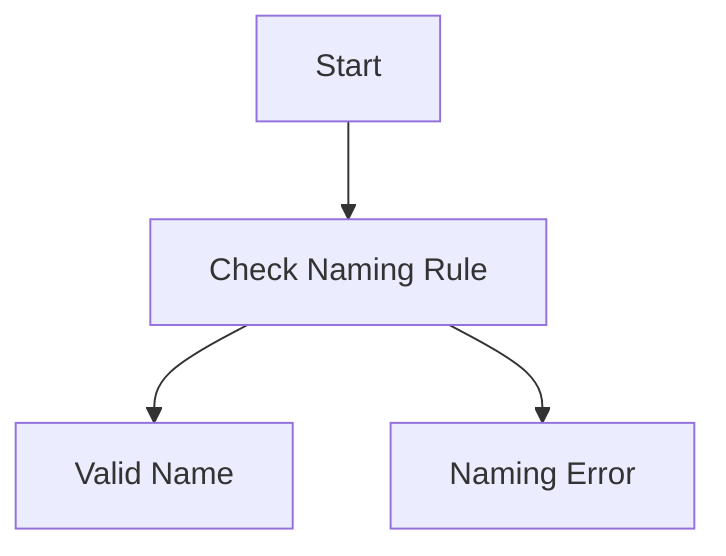
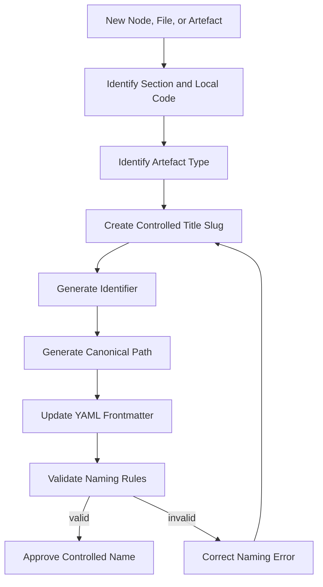
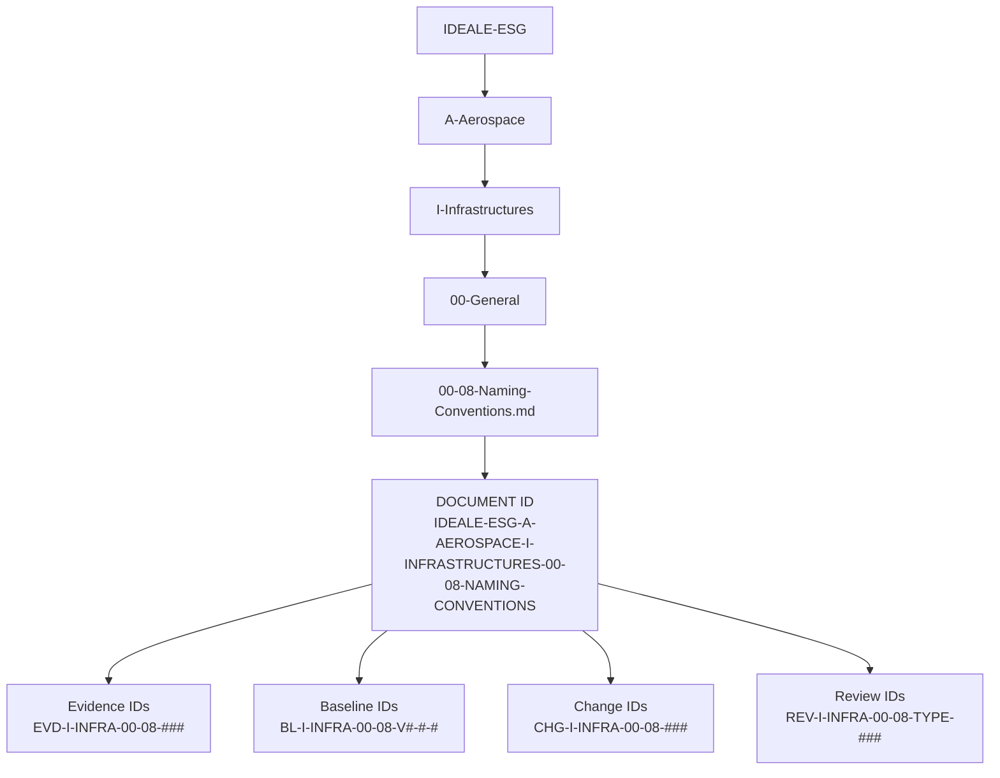

# 00-08-Naming-Conventions — Naming Conventions

## Purpose

Naming conventions and identifier rules for nodes, files, and artefacts in this taxonomy.

This document defines the controlled naming model for infrastructure folders, documents, nodes, identifiers, evidence packages, interface records, diagrams, matrices, configuration records, and lifecycle artefacts under:

```text
IDEALE-ESG/A-Aerospace/I-Infrastructures/00-General/
```

## Parent

[`README.md`](README.md) — `IDEALE-ESG/A-Aerospace/I-Infrastructures/00-General/`

---

# 1. Naming Principle

Naming shall be:

1. deterministic;
2. human-readable;
3. repository-safe;
4. machine-parseable;
5. lifecycle-traceable;
6. stable across revisions;
7. aligned with parent-child hierarchy;
8. compatible with evidence packaging and digital-thread governance.

A name shall identify what the artefact is, where it belongs, and how it relates to the taxonomy.

---

# 2. Root Path Convention

The controlled root path for this taxonomy is:

```text
IDEALE-ESG/A-Aerospace/I-Infrastructures/
```

All infrastructure documents shall be placed under this root unless explicitly superseded by a higher-level governance decision.

---

# 3. Section Folder Naming

## 3.1 Section Folder Pattern

Section folders shall use the following pattern:

```text
<SECTION-CODE>-<SECTION-NAME>/
```

Where:

| Field | Rule |
|---|---|
| `SECTION-CODE` | Two digits: `00` to `09`. |
| `SECTION-NAME` | English title case, hyphen-separated, repository-safe. |
| `/` | Folder separator. |

## 3.2 Controlled Section Folders

```text
IDEALE-ESG/A-Aerospace/I-Infrastructures/
├── 00-General/
├── 01-Airports/
├── 02-Vertiports/
├── 03-Spaceports-and-Launchers/
├── 04-Maintenance-Hangars/
├── 05-Assemblies-and-FAL/
├── 06-Test-and-Certification-Infrastructure/
├── 07-Hydrogen-and-Energy-Infrastructure/
├── 08-Digital-Operational-Infrastructure/
└── 09-Safety-Security-and-Access-Control/
```

## 3.3 Section Folder Rules

### RULE-I-INFRA-NAM-001 — Two-Digit Section Rule

Each infrastructure section shall use a two-digit section code.

Valid examples:

```text
00-General/
01-Airports/
02-Vertiports/
```

Invalid examples:

```text
0-General/
1-Airports/
001-Airports/
Airports-01/
```

### RULE-I-INFRA-NAM-002 — Hyphen Separator Rule

Words in folder names shall be separated by hyphens.

Valid:

```text
05-Assemblies-and-FAL/
07-Hydrogen-and-Energy-Infrastructure/
```

Invalid:

```text
05 Assemblies and FAL/
05_Assemblies_and_FAL/
05-Assemblies & FAL/
```

### RULE-I-INFRA-NAM-003 — Controlled Acronym Rule

Controlled acronyms may remain uppercase.

Accepted examples:

```text
FAL
GSE
LH2
CSDB
PLM
IETP
AAM
UAM
VTOL
eVTOL
```

---

# 4. Document Naming

## 4.1 Document Filename Pattern

Documents shall use the following pattern:

```text
<SECTION-CODE>-<LOCAL-CODE>-<TITLE-SLUG>.md
```

Where:

| Field | Rule |
|---|---|
| `SECTION-CODE` | Two-digit parent section code. |
| `LOCAL-CODE` | Two-digit local document code inside the section. |
| `TITLE-SLUG` | English title case, hyphen-separated, repository-safe. |
| `.md` | Markdown file extension. |

## 4.2 Examples

```text
00-00-Scope-and-Purpose.md
00-01-Definitions.md
00-02-Infrastructure-Classification-Rules.md
00-03-Standards-and-Regulatory-References.md
00-04-Applicability-and-Effectivity.md
00-05-Lifecycle-and-Governance.md
00-06-Interfaces-with-OPTIN-Axes.md
00-07-Traceability-and-Evidence.md
00-08-Naming-Conventions.md
```

## 4.3 Document Naming Rules

### RULE-I-INFRA-NAM-004 — Local Code Rule

Each document inside a section shall use a local two-digit code.

Valid:

```text
01-00-Airports-General.md
01-01-Runways-Taxiways-and-Aprons.md
01-02-Terminals-Gates-and-Passenger-Interfaces.md
```

Invalid:

```text
01-Airports-General.md
01-001-Airports-General.md
Airports-General.md
```

### RULE-I-INFRA-NAM-005 — Markdown Extension Rule

Controlled narrative documents shall use:

```text
.md
```

Do not use:

```text
.markdown
.txt
.docx
.pdf
```

unless a controlled export package explicitly requires another format.

### RULE-I-INFRA-NAM-006 — No Spaces Rule

File names shall not contain spaces.

Valid:

```text
03-05-Range-Safety-and-Flight-Termination-Interfaces.md
```

Invalid:

```text
03-05-Range Safety and Flight Termination Interfaces.md
```

### RULE-I-INFRA-NAM-007 — No Special Characters Rule

File and folder names shall avoid uncontrolled special characters.

Avoid:

```text
&
%
#
@
!
?
:
;
,
.
+
=
()
[]
{}
```

Exception:

- the file extension dot in `.md`;
- controlled plus sign in framework names only when approved, not preferred for file names.

---

# 5. Title Naming

## 5.1 Document Title Pattern

Document titles shall use:

```text
<SECTION-CODE>-<LOCAL-CODE>-<Title-Slug> — <Readable Title>
```

Example:

```text
# 00-08-Naming-Conventions — Naming Conventions
```

## 5.2 Title Rules

### RULE-I-INFRA-NAM-008 — Title Consistency Rule

The document heading shall match the filename content.

Filename:

```text
00-08-Naming-Conventions.md
```

Heading:

```markdown
# 00-08-Naming-Conventions — Naming Conventions
```

### RULE-I-INFRA-NAM-009 — Em Dash Title Separator Rule

The title shall use an em dash `—` between the controlled slug and readable title.

Valid:

```markdown
# 00-08-Naming-Conventions — Naming Conventions
```

Invalid:

```markdown
# 00-08-Naming-Conventions - Naming Conventions
# 00-08-Naming-Conventions: Naming Conventions
```

---

# 6. Identifier Naming

## 6.1 Document ID Pattern

Document IDs shall use uppercase controlled tokens separated by hyphens.

Pattern:

```text
IDEALE-ESG-A-AEROSPACE-I-INFRASTRUCTURES-<SECTION-CODE>-<LOCAL-CODE>-<TITLE>
```

Example:

```text
IDEALE-ESG-A-AEROSPACE-I-INFRASTRUCTURES-00-08-NAMING-CONVENTIONS
```

## 6.2 Document ID Rules

### RULE-I-INFRA-NAM-010 — Uppercase Identifier Rule

`document_id` values shall be uppercase.

Valid:

```yaml
document_id: IDEALE-ESG-A-AEROSPACE-I-INFRASTRUCTURES-00-08-NAMING-CONVENTIONS
```

Invalid:

```yaml
document_id: ideale-esg-a-aerospace-i-infrastructures-00-08-naming-conventions
```

### RULE-I-INFRA-NAM-011 — Stable Identifier Rule

A `document_id` shall not change when the document version or revision changes.

The identifier remains stable.

The version and revision fields carry change state.

### RULE-I-INFRA-NAM-012 — No Path Separators in IDs Rule

Identifiers shall not use `/`.

Valid:

```text
IDEALE-ESG-A-AEROSPACE-I-INFRASTRUCTURES-00-08-NAMING-CONVENTIONS
```

Invalid:

```text
IDEALE-ESG/A-Aerospace/I-Infrastructures/00-08-Naming-Conventions
```

---

# 7. Canonical Path Naming

## 7.1 Canonical Path Pattern

Canonical paths shall use repository-style paths.

Pattern:

```text
IDEALE-ESG/A-Aerospace/I-Infrastructures/<SECTION>/<DOCUMENT>.md
```

Example:

```text
IDEALE-ESG/A-Aerospace/I-Infrastructures/00-General/00-08-Naming-Conventions.md
```

## 7.2 Canonical Path Rules

### RULE-I-INFRA-NAM-013 — Canonical Path Consistency Rule

The `canonical_path` in YAML frontmatter shall match the file location.

### RULE-I-INFRA-NAM-014 — Parent Path Rule

The `parent_path` shall point to the immediate parent folder.

Example:

```yaml
parent_path: "IDEALE-ESG/A-Aerospace/I-Infrastructures/00-General/"
```

### RULE-I-INFRA-NAM-015 — Parent Document Rule

The `parent_document` shall identify the parent README unless a more specific parent is declared.

Example:

```yaml
parent_document: "README.md"
```

---

# 8. YAML Frontmatter Naming Rules

## 8.1 Minimum Frontmatter Fields

Each controlled Markdown document shall include:

```yaml
---
document_id: ""
title: ""
canonical_path: ""
parent_path: ""
parent_document: ""

domain: ""
opt_in_axis: ""
section: ""
node_code: ""

status: ""
version: ""
revision: ""
date: ""
language: ""
classification: ""

owner: ""
lifecycle_phase: ""
maturity: ""

citation_keys:
  - ""

tags:
  - ""
---
```

## 8.2 YAML List Rule

YAML lists shall use hyphen list syntax.

Valid:

```yaml
tags:
  - IDEALE-ESG
  - A-Aerospace
  - I-Infrastructures
```

Invalid:

```yaml
tags:

* IDEALE-ESG
* A-Aerospace
* I-Infrastructures
```

## 8.3 Quoting Rule

Strings containing special characters, slashes, em dashes, colons, or spaces should be quoted.

Recommended:

```yaml
title: "00-08-Naming-Conventions — Naming Conventions"
canonical_path: "IDEALE-ESG/A-Aerospace/I-Infrastructures/00-General/00-08-Naming-Conventions.md"
```

## 8.4 YAML Field Naming Rule

YAML keys shall use lowercase snake_case.

Valid:

```yaml
document_id:
canonical_path:
parent_document:
lifecycle_phase:
citation_keys:
```

Invalid:

```yaml
DocumentID:
canonicalPath:
Parent Document:
Lifecycle-Phase:
```

---

# 9. Node Code Naming

## 9.1 Node Code Pattern

Node codes shall use:

```text
<SECTION-CODE>-<LOCAL-CODE>
```

Example:

```text
00-08
```

## 9.2 Node Code Rules

### RULE-I-INFRA-NAM-016 — Node Code Consistency Rule

The `node_code` in YAML shall match the first two numeric blocks in the filename.

Filename:

```text
00-08-Naming-Conventions.md
```

YAML:

```yaml
node_code: "00-08"
```

### RULE-I-INFRA-NAM-017 — Node Code Quoting Rule

Node codes shall be quoted as strings to preserve leading zeroes.

Valid:

```yaml
node_code: "00-08"
```

Invalid:

```yaml
node_code: 00-08
```

---

# 10. Slug Rules

## 10.1 Slug Definition

A slug is the repository-safe title fragment used in file and folder names.

Example:

```text
Naming-Conventions
```

## 10.2 Slug Construction Rules

Slugs shall:

1. use English technical naming unless a controlled bilingual baseline exists;
2. use hyphens between words;
3. preserve controlled acronyms;
4. avoid articles unless needed for meaning;
5. avoid punctuation;
6. avoid unstable adjectives;
7. avoid version numbers unless the artefact is explicitly version-specific.

## 10.3 Slug Examples

Valid:

```text
Traceability-and-Evidence
Applicability-and-Effectivity
Lifecycle-and-Governance
Interfaces-with-OPTIN-Axes
Hydrogen-and-Energy-Infrastructure
```

Invalid:

```text
Traceability & Evidence
Applicability_Effectivity
Lifecycle Governance v2
Important-Infrastructure-Things
```

---

# 11. Artefact Naming

## 11.1 Artefact Categories

The taxonomy may include the following artefact types:

| Artefact Type | Recommended Extension |
|---|---|
| Markdown document | `.md` |
| YAML record | `.yaml` |
| JSON record | `.json` |
| CSV matrix | `.csv` |
| Spreadsheet matrix | `.xlsx` |
| Mermaid diagram source | `.mmd` or embedded Markdown |
| SVG diagram export | `.svg` |
| PNG diagram export | `.png` |
| PDF release export | `.pdf` |
| Evidence package index | `.yaml` or `.md` |

## 11.2 Artefact Filename Pattern

Artefacts shall use:

```text
<SECTION-CODE>-<LOCAL-CODE>-<ARTEFACT-TYPE>-<TITLE-SLUG>.<extension>
```

Example:

```text
00-08-YAML-Frontmatter-Template.yaml
00-08-MATRIX-Naming-Validation.csv
00-08-DIAGRAM-Naming-Control-Flow.mmd
00-08-EVIDENCE-Naming-Conventions-Package.yaml
```

## 11.3 Artefact Type Tokens

Controlled artefact type tokens:

| Token | Meaning |
|---|---|
| `DOC` | Document |
| `YAML` | YAML record |
| `JSON` | JSON record |
| `MATRIX` | Matrix or table |
| `DIAGRAM` | Diagram source or export |
| `EVIDENCE` | Evidence package |
| `ICD` | Interface Control Document |
| `RACI` | Responsibility matrix |
| `REGISTER` | Controlled register |
| `LOG` | Log file |
| `BASELINE` | Baseline package |
| `CHANGE` | Change record |
| `REVIEW` | Review record |
| `EXPORT` | Exported representation |

---

# 12. Evidence Naming

## 12.1 Evidence ID Pattern

Evidence IDs shall use:

```text
EVD-I-INFRA-<SECTION-CODE>-<LOCAL-CODE>-<SEQUENCE>
```

Example:

```text
EVD-I-INFRA-00-08-001
```

## 12.2 Evidence Package ID Pattern

Evidence package IDs shall use:

```text
PKG-EVD-I-INFRA-<SECTION-CODE>-<LOCAL-CODE>-<TITLE>
```

Example:

```text
PKG-EVD-I-INFRA-00-08-NAMING-CONVENTIONS
```

## 12.3 Evidence File Pattern

Evidence files shall use:

```text
<EVIDENCE-ID>-<TITLE-SLUG>.<extension>
```

Example:

```text
EVD-I-INFRA-00-08-001-Naming-Validation-Checklist.yaml
```

---

# 13. Interface Naming

## 13.1 Interface ID Pattern

Interface IDs shall use:

```text
ICD-I-INFRA-<SECTION-CODE>-<LOCAL-CODE>-<TARGET-AXIS>-<SEQUENCE>
```

Example:

```text
ICD-I-INFRA-00-06-O-001
ICD-I-INFRA-00-06-P-001
ICD-I-INFRA-00-06-T-001
ICD-I-INFRA-00-06-N-001
```

## 13.2 Interface File Pattern

Interface files shall use:

```text
<INTERFACE-ID>-<TITLE-SLUG>.md
```

Example:

```text
ICD-I-INFRA-00-06-N-001-Neural-Network-Infrastructure-Interface.md
```

---

# 14. Baseline Naming

## 14.1 Baseline ID Pattern

Baseline IDs shall use:

```text
BL-I-INFRA-<SECTION-CODE>-<LOCAL-CODE>-<VERSION>
```

Example:

```text
BL-I-INFRA-00-08-V0-1-0
```

## 14.2 Baseline File Pattern

Baseline files shall use:

```text
<BASELINE-ID>-<TITLE-SLUG>.yaml
```

Example:

```text
BL-I-INFRA-00-08-V0-1-0-Naming-Conventions-Baseline.yaml
```

## 14.3 Version-to-Filename Rule

Semantic versions shall replace dots with hyphens in file names.

Version:

```text
0.1.0
```

Filename token:

```text
V0-1-0
```

---

# 15. Change Record Naming

## 15.1 Change ID Pattern

Change records shall use:

```text
CHG-I-INFRA-<SECTION-CODE>-<LOCAL-CODE>-<SEQUENCE>
```

Example:

```text
CHG-I-INFRA-00-08-001
```

## 15.2 Change File Pattern

```text
CHG-I-INFRA-00-08-001-Naming-Conventions-Initial-Baseline.md
```

---

# 16. Review Record Naming

## 16.1 Review ID Pattern

Review records shall use:

```text
REV-I-INFRA-<SECTION-CODE>-<LOCAL-CODE>-<REVIEW-TYPE>-<SEQUENCE>
```

Example:

```text
REV-I-INFRA-00-08-TAXONOMY-001
REV-I-INFRA-00-08-DATAGOV-001
REV-I-INFRA-00-08-CONFIGURATION-001
```

## 16.2 Review File Pattern

```text
REV-I-INFRA-00-08-TAXONOMY-001-Naming-Conventions-Review.md
```

---

# 17. Register Naming

## 17.1 Register ID Pattern

Registers shall use:

```text
REG-I-INFRA-<SECTION-CODE>-<REGISTER-TYPE>
```

Example:

```text
REG-I-INFRA-00-DOCUMENTS
REG-I-INFRA-00-CITATIONS
REG-I-INFRA-00-EVIDENCE
REG-I-INFRA-00-INTERFACES
```

## 17.2 Register File Pattern

```text
00-REGISTER-Documents.yaml
00-REGISTER-Citation-Keys.yaml
00-REGISTER-Evidence.yaml
00-REGISTER-Interfaces.yaml
```

---

# 18. Diagram Naming

## 18.1 Mermaid Diagram Naming

Embedded Mermaid diagrams shall use a heading before the diagram.

Example:

```markdown
## 18.3 Naming Control Flow Diagram


```

## 18.2 Diagram Export Naming

Exported diagrams shall use:

```text
<SECTION-CODE>-<LOCAL-CODE>-DIAGRAM-<TITLE-SLUG>.<extension>
```

Example:

```text
00-08-DIAGRAM-Naming-Control-Flow.svg
00-08-DIAGRAM-Identifier-Hierarchy.png
```

## 18.3 Naming Control Flow Diagram



---

# 19. Identifier Hierarchy Diagram



---

# 20. Version and Revision Naming

## 20.1 Version Field

Versions shall follow semantic versioning logic:

```text
MAJOR.MINOR.PATCH
```

Example:

```yaml
version: "0.1.0"
```

## 20.2 Revision Field

Revisions shall use uppercase alphabetic revision markers unless a programme-specific rule supersedes this convention.

Example:

```yaml
revision: "A"
```

## 20.3 Version Change Rule

Use:

| Change Type | Version Impact |
|---|---|
| Editorial correction | Patch increment |
| Minor clarification | Minor increment |
| New section or new rule | Minor increment |
| Breaking governance change | Major increment |
| Approved baseline release | Baseline record required |

---

# 21. Case Rules

## 21.1 Folder and File Case

Folders and files shall use title case for readable words.

Example:

```text
00-General/
00-08-Naming-Conventions.md
```

## 21.2 Identifier Case

Identifiers shall use uppercase.

Example:

```text
IDEALE-ESG-A-AEROSPACE-I-INFRASTRUCTURES-00-08-NAMING-CONVENTIONS
```

## 21.3 YAML Key Case

YAML keys shall use lowercase snake_case.

Example:

```yaml
canonical_path: ""
parent_document: ""
lifecycle_phase: ""
```

---

# 22. Language Rules

## 22.1 Default Language

The default technical language for paths, filenames, identifiers, and controlled artefacts is English.

## 22.2 Bilingual Content Rule

Bilingual content may be included in document body sections, but canonical filenames and identifiers should remain English unless a controlled bilingual baseline is declared.

## 22.3 Accent and Diacritic Rule

File and folder names shall avoid accented characters.

Valid:

```text
Definitions
Classification-Rules
```

Avoid:

```text
Definición
Clasificación
```

---

# 23. Reserved Words

The following words are controlled and shall be used consistently.

| Controlled Term | Use |
|---|---|
| `General` | Section 00 common governance. |
| `Airports` | Section 01 airport infrastructure. |
| `Vertiports` | Section 02 vertiport infrastructure. |
| `Spaceports-and-Launchers` | Section 03 space access infrastructure. |
| `Maintenance-Hangars` | Section 04 MRO and hangar infrastructure. |
| `Assemblies-and-FAL` | Section 05 assembly and final assembly infrastructure. |
| `Test-and-Certification-Infrastructure` | Section 06 test and certification infrastructure. |
| `Hydrogen-and-Energy-Infrastructure` | Section 07 hydrogen and energy infrastructure. |
| `Digital-Operational-Infrastructure` | Section 08 digital infrastructure. |
| `Safety-Security-and-Access-Control` | Section 09 safety/security infrastructure. |

---

# 24. Prohibited Naming Patterns

The following patterns shall not be used:

```text
misc/
miscellaneous/
new-folder/
draft-final/
final-final/
copy/
copy-2/
untitled/
test/
old/
backup/
temp/
random/
general2/
```

If temporary work is required, it shall be placed in a controlled development area with status declared.

Example:

```text
DEV/
WIP/
```

Only when the parent governance model permits it.

---

# 25. Naming Validation Checklist

Before release, each file shall satisfy:

| Check | Requirement |
|---|---|
| Section code | Two digits and matches parent folder. |
| Local code | Two digits and unique within section. |
| Filename | Uses controlled pattern. |
| Extension | Uses `.md` for Markdown documents. |
| Title | Matches filename and node code. |
| `document_id` | Uppercase, stable, path-aligned. |
| `canonical_path` | Matches actual repository location. |
| `parent_path` | Points to immediate parent folder. |
| `node_code` | Quoted and matches filename. |
| YAML lists | Use `-`, not `*`. |
| Tags | Repository-safe and relevant. |
| Citation keys | Controlled and declared when references are used. |
| No special characters | No uncontrolled symbols in filenames. |
| No spaces | No spaces in folder or file names. |
| Version | Semantic version string. |
| Revision | Uppercase revision marker. |

---

# 26. Naming Validation Record Template

```yaml
naming_validation_record:
  validation_id: ""
  document_id: ""
  file_name: ""
  canonical_path: ""
  parent_path: ""
  validation_date: ""
  validator: ""
  checks:
    section_code_valid: false
    local_code_valid: false
    filename_pattern_valid: false
    title_matches_filename: false
    document_id_valid: false
    canonical_path_valid: false
    yaml_frontmatter_valid: false
    yaml_lists_valid: false
    tags_valid: false
    citation_keys_valid: false
    no_spaces: false
    no_uncontrolled_special_characters: false
    version_valid: false
    revision_valid: false
  result: ""
  findings:
    - finding_id: ""
      description: ""
      disposition: ""
```

---

# 27. Naming Examples

## 27.1 Valid Document Example

```yaml
document:
  file_name: "00-08-Naming-Conventions.md"
  document_id: "IDEALE-ESG-A-AEROSPACE-I-INFRASTRUCTURES-00-08-NAMING-CONVENTIONS"
  canonical_path: "IDEALE-ESG/A-Aerospace/I-Infrastructures/00-General/00-08-Naming-Conventions.md"
  parent_path: "IDEALE-ESG/A-Aerospace/I-Infrastructures/00-General/"
  node_code: "00-08"
```

## 27.2 Valid Evidence Example

```yaml
evidence:
  evidence_id: "EVD-I-INFRA-00-08-001"
  file_name: "EVD-I-INFRA-00-08-001-Naming-Validation-Checklist.yaml"
  related_document_id: "IDEALE-ESG-A-AEROSPACE-I-INFRASTRUCTURES-00-08-NAMING-CONVENTIONS"
```

## 27.3 Valid Baseline Example

```yaml
baseline:
  baseline_id: "BL-I-INFRA-00-08-V0-1-0"
  file_name: "BL-I-INFRA-00-08-V0-1-0-Naming-Conventions-Baseline.yaml"
  related_document_id: "IDEALE-ESG-A-AEROSPACE-I-INFRASTRUCTURES-00-08-NAMING-CONVENTIONS"
```

## 27.4 Invalid Naming Example

```yaml
invalid:
  file_name: "Naming conventions final FINAL.md"
  reasons:
    - "contains spaces"
    - "does not include section code"
    - "does not include local code"
    - "uses uncontrolled final marker"
    - "not repository-safe"
```

---

# 28. Q-Division Naming Ownership

| Q-Division | Naming Responsibility |
|---|---|
| `Q-DATAGOV` | Owns taxonomy naming, identifiers, paths, YAML frontmatter, citation keys, evidence IDs, and publication-readiness naming. |
| `Q-AIR` | Reviews naming for airport, vertiport, AAM/UAM, airside, and aircraft-compatibility infrastructure. |
| `Q-GREENTECH` | Reviews naming for hydrogen, LH2, cryogenic, charging, refuelling, and sustainable energy infrastructure. |
| `Q-GROUND` | Reviews naming for ground operations, GSE, maintenance access, support equipment, and MRO infrastructure. |
| `Q-HORIZON` | Reviews naming for horizon scanning, future concepts, low-TRL roadmaps, and strategic research positioning. |
| `Q-HPC` | Reviews naming for simulation, computational, AI/ML, semantic scanning, and digital twin computation artefacts. |
| `Q-HUESCORT-SCIRES-OPEN` | Reviews naming for Horizon / SCIRES / OPEN interface artefacts, calling-order routing, research intake, provenance, and resilient-touch handoff records. |
| `Q-INDUSTRY` | Reviews naming for industrialization, FAL, station flow, assembly systems, and manufacturing infrastructure. |
| `Q-MECHANICS` | Reviews naming for tooling, fixtures, rigs, equipment, mechanisms, and mechanical infrastructure interfaces. |
| `Q-SCIRES` | Reviews naming for scientific research, testing, verification, validation, and certification-evidence artefacts. |
| `Q-SPACE` | Reviews naming for spaceports, launchers, range safety, payload processing, reentry, and mission infrastructure. |
| `Q-STRUCTURES` | Reviews naming for structures, materials, hangars, major assemblies, jigs, fixtures, and structural test infrastructure. |

---

# 29. Footprints

## Semantic Footprint

```yaml
semantic_footprint:
  id: FP-SEM-I-INFRA-00-08
  subject: "Naming conventions and identifier rules for aerospace infrastructure taxonomy"
  meaning_boundary:
    includes:
      - folder naming
      - file naming
      - document identifiers
      - canonical paths
      - node codes
      - YAML frontmatter rules
      - artefact naming
      - evidence naming
      - interface naming
      - baseline naming
      - change record naming
      - review record naming
      - register naming
      - diagram naming
    excludes:
      - programme-specific part numbering
      - aircraft product serial numbering
      - supplier proprietary naming
      - uncontrolled working names
```

## Taxonomy Footprint

```yaml
taxonomy_footprint:
  id: FP-TAX-I-INFRA-00-08
  hierarchy:
    root: "IDEALE-ESG"
    domain: "A-Aerospace"
    opt_in_axis: "I-Infrastructures"
    section: "00-General"
    document: "00-08-Naming-Conventions"
```

## Lifecycle Footprint

```yaml
lifecycle_footprint:
  id: FP-LC-I-INFRA-00-08
  lifecycle_phase: "LC01"
  lifecycle_role: "Defines naming and identifier conventions for infrastructure taxonomy"
  exit_criteria:
    - root path convention defined
    - section folder naming defined
    - document naming defined
    - identifier naming defined
    - YAML frontmatter naming rules defined
    - artefact naming defined
    - evidence naming defined
    - interface naming defined
    - baseline naming defined
    - validation checklist provided
```

## Compliance Footprint

```yaml
compliance_footprint:
  id: FP-COMP-I-INFRA-00-08
  reference_families:
    system_lifecycle:
      - "ISO-IEC-IEEE-15288"
    asset_management:
      - "ISO-55000"
    quality_management:
      - "ISO-9001"
      - "IAQG-9100"
    technical_publications:
      - "S1000D"
    space_systems:
      - "ECSS"
```

## Evidence Footprint

```yaml
evidence_footprint:
  id: FP-EVD-I-INFRA-00-08
  expected_evidence:
    - controlled markdown document
    - YAML frontmatter
    - canonical path
    - parent path
    - naming rules
    - identifier patterns
    - artefact naming patterns
    - validation checklist
    - naming validation record template
    - naming control flow diagram
    - identifier hierarchy diagram
```

---

# 30. Citation Map

| Citation Key | Applies To | Use in This Taxonomy |
|---|---|---|
| `ISO-IEC-IEEE-15288` | System lifecycle artefacts | Supports lifecycle process naming and controlled artefact traceability. |
| `ISO-55000` | Infrastructure asset records | Supports asset-management naming and lifecycle asset identification. |
| `ISO-9001` | Quality records | Supports controlled-document, record, and QMS naming discipline. |
| `IAQG-9100` | Aerospace quality records | Supports aviation, space, and defense quality-record naming and traceability. |
| `S1000D` | Technical-publication data | Supports CSDB, data-module, publication, applicability, and source-data naming alignment. |
| `ECSS` | Space-system artefacts | Supports space-sector engineering, product-assurance, and project-document naming discipline. |

---

# 31. Controlled References

## [ISO-IEC-IEEE-15288]

**ISO/IEC/IEEE 15288 — Systems and Software Engineering, System Life Cycle Processes.**

Used as the systems lifecycle-process reference family for lifecycle artefact naming, controlled records, and traceable system-process documentation.

## [ISO-55000]

**ISO 55000 — Asset Management, Vocabulary, Overview and Principles.**

Used as the asset-management reference family for infrastructure asset naming, lifecycle asset records, and asset-governance identifiers.

## [ISO-9001]

**ISO 9001 — Quality Management Systems Requirements.**

Used as the general quality-management reference family for controlled documents, records, review states, and document-control naming.

## [IAQG-9100]

**IAQG 9100 — Quality Management Systems Requirements for Aviation, Space and Defense Organizations.**

Used as the aerospace quality-management reference family for aviation, space, and defense naming discipline, controlled records, and traceability.

## [S1000D]

**S1000D — International Specification for Technical Publications Using a Common Source Database.**

Used as the technical-publication reference family for CSDB, structured source data, applicability, effectivity, and publication-ready artefact naming.

## [ECSS]

**European Cooperation for Space Standardization — ECSS Standards.**

Used as the European space-sector reference family for space-system engineering, product-assurance, and project-document naming discipline.

---

# 32. Governance Rule

Any child document, record, evidence package, interface artefact, baseline, change record, review record, register, or diagram under `I-Infrastructures` shall comply with this naming convention unless a stricter programme-specific naming rule is declared.

A naming deviation shall be accepted only when:

1. the deviation is documented;
2. the reason is stated;
3. the affected artefact is identified;
4. Q-DATAGOV reviews the deviation;
5. traceability is preserved;
6. downstream references are not broken.

---

# 33. Acceptance Criteria

This document is acceptable when:

- root path naming is defined;
- section folder naming is defined;
- document filename naming is defined;
- document title naming is defined;
- identifier naming is defined;
- canonical path naming is defined;
- YAML frontmatter rules are defined;
- artefact naming rules are defined;
- evidence, interface, baseline, change, review, register, and diagram naming rules are defined;
- naming validation checklist is provided;
- naming validation record template is provided;
- Q-Division naming ownership is defined;
- child documents can apply the naming rules without reinterpretation.

---

# 34. Summary

`00-08-Naming-Conventions` defines the controlled naming model for the `I-Infrastructures` axis.

It governs folders, files, document IDs, canonical paths, YAML frontmatter, node codes, slugs, artefacts, evidence packages, interface records, baselines, changes, reviews, registers, diagrams, and validation records.

Its purpose is to make the infrastructure taxonomy deterministic, repository-safe, machine-parseable, human-readable, and traceable across the full IDEALE-ESG / A-Aerospace lifecycle.
````
