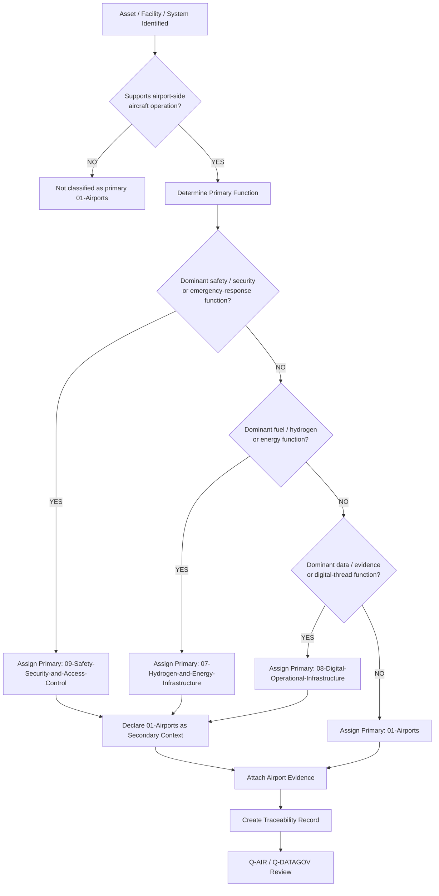
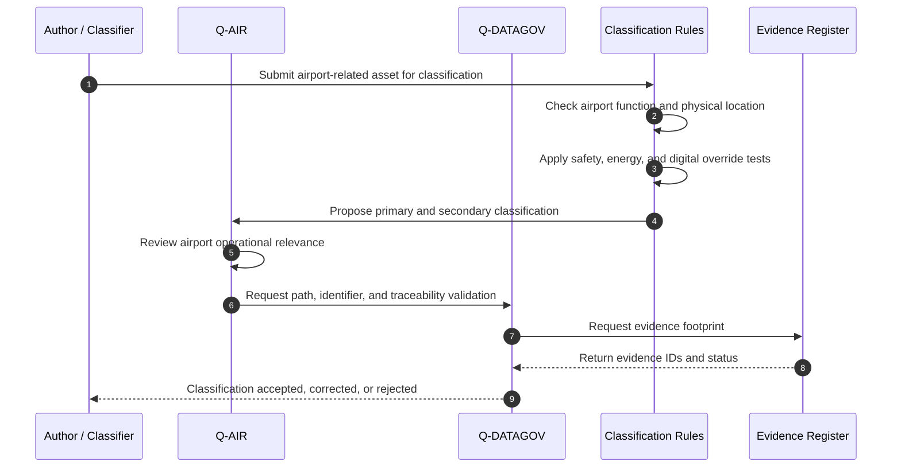
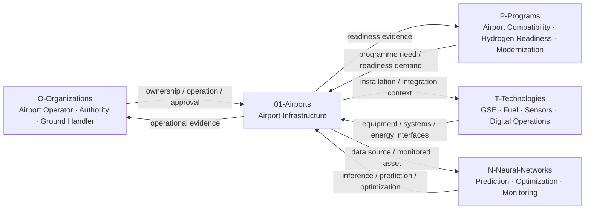
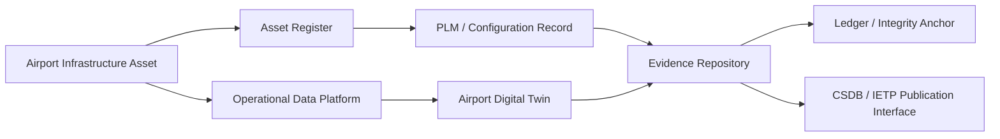

# 01-00-Airports-General — Airports General

## Purpose

Overview of airport infrastructure scope within `I-Infrastructures`.

This document defines the general classification boundary, scope, interfaces, governance logic, evidence expectations, and reference families for airport infrastructure under:

```text
IDEALE-ESG/A-Aerospace/I-Infrastructures/01-Airports/
```

## Parent

[`README.md`](README.md) — `IDEALE-ESG/A-Aerospace/I-Infrastructures/01-Airports/`

---

# 1. Airport Infrastructure Scope

`01-Airports` covers infrastructure that enables aircraft arrival, departure, taxiing, parking, servicing, passenger handling, cargo handling, airside operation, emergency response, ground support, energy interfaces, and airport compatibility.

Airport infrastructure includes physical, digital, operational, safety, and lifecycle-support assets.

It covers the airport-side environment required to support aerospace operations, but it does not replace aircraft product-design data, airline operational manuals, airport master plans, or authority-approved compliance documentation.

---

# 2. Controlled Definition

For this taxonomy, an **airport infrastructure asset** is:

> A physical, digital, operational, safety, energy, or support asset located in or functionally connected to an airport environment and used to enable aircraft operation, servicing, turnaround, maintenance access, passenger or cargo movement, emergency response, airport compatibility, or lifecycle evidence.

Airport infrastructure may include:

- runways;
- taxiways;
- aprons;
- aircraft stands;
- terminals;
- gates;
- ground support equipment;
- airside roads;
- fuel and energy interfaces;
- hydrogen-readiness infrastructure;
- emergency-response areas;
- airport digital systems;
- airport safety zones;
- airport access-control systems;
- inspection and maintenance-support areas.

---

# 3. Airport Infrastructure Boundary

## 3.1 Included

This section includes:

- airport-side physical infrastructure;
- aircraft movement areas;
- passenger and cargo interface infrastructure;
- ground support and turnaround infrastructure;
- airport fuel and energy interfaces;
- hydrogen-readiness interfaces;
- safety and emergency-response infrastructure;
- airport digital operational infrastructure;
- airport compatibility evidence;
- airport infrastructure lifecycle records;
- traceability and governance records.

## 3.2 Excluded

This section does not include:

- aircraft type-design data;
- aircraft onboard systems;
- airline operating procedures not tied to infrastructure classification;
- detailed airport master-planning documents;
- detailed civil engineering calculations;
- detailed airport security procedures outside taxonomy classification;
- regulator-approved airport certification basis;
- programme-specific compliance demonstration packages.

Those items may be cross-referenced when they support airport infrastructure classification, applicability, or evidence.

---

# 4. Airport Infrastructure Subsections

The `01-Airports` section should use the following controlled subsection structure:

```text
01-Airports/
├── README.md
├── 01-00-Airports-General.md
├── 01-01-Runways-Taxiways-and-Aprons.md
├── 01-02-Terminals-Gates-and-Passenger-Interfaces.md
├── 01-03-Ground-Support-Equipment-GSE.md
├── 01-04-Aircraft-Turnaround-and-Servicing.md
├── 01-05-Fuel-and-Hydrogen-Readiness.md
├── 01-06-Airport-Safety-and-Emergency-Response.md
├── 01-07-Airport-Digital-Operations.md
├── 01-08-Airport-Compatibility-and-Certification.md
└── 01-09-Traceability-Governance-and-Evidence.md
```

---

# 5. Airport Infrastructure Classes

| Code | Infrastructure Class | Scope |
|---:|---|---|
| `01-00` | Airports General | General scope, boundary, governance, classification, and reference map for airport infrastructure. |
| `01-01` | Runways, Taxiways and Aprons | Aircraft movement surfaces, runway/taxiway/apron interfaces, stand access, pavement-related classification. |
| `01-02` | Terminals, Gates and Passenger Interfaces | Passenger movement, gates, boarding, disembarkation, terminal-aircraft interfaces, accessibility, passenger-side flows. |
| `01-03` | Ground Support Equipment GSE | Ground-support equipment, servicing vehicles, ground power, towing, loading, cooling, air-start, support equipment. |
| `01-04` | Aircraft Turnaround and Servicing | Turnaround workflows, servicing zones, aircraft ground handling, dispatch-support infrastructure. |
| `01-05` | Fuel and Hydrogen Readiness | Fuel interfaces, hydrogen-readiness, LH2 interface zones, energy transition, refuelling compatibility. |
| `01-06` | Airport Safety and Emergency Response | Emergency response, rescue and firefighting interfaces, safety areas, hazard zones, incident response. |
| `01-07` | Airport Digital Operations | A-CDM, digital operations, airport data platforms, digital twin, operational monitoring, CSDB/PLM/IETP interfaces when relevant. |
| `01-08` | Airport Compatibility and Certification | Airport compatibility, aircraft-infrastructure compatibility, certification-support evidence, reference mapping. |
| `01-09` | Traceability, Governance and Evidence | Airport infrastructure evidence, lifecycle records, traceability matrices, audit records, governance records. |

---

# 6. Airport Classification Rules

## RULE-I-INFRA-AIR-001 — Airport Function Rule

An infrastructure asset shall be classified under `01-Airports` when its primary function is to support aircraft operation, movement, parking, servicing, turnaround, passenger handling, cargo handling, or airport-side operational integration.

## RULE-I-INFRA-AIR-002 — Aerodrome Terminology Rule

The term `airport` may be used for the broad infrastructure class.

The term `aerodrome` may be used when referring to regulatory, design, or standards terminology.

## RULE-I-INFRA-AIR-003 — Physical Location Rule

An asset located at an airport shall not automatically be classified under `01-Airports`.

The primary lifecycle function remains decisive.

Example:

```yaml
asset:
  name: "LH2 Airport Refuelling Station"
  physical_location: "Airport"
  primary_classification: "07-Hydrogen-and-Energy-Infrastructure"
  secondary_classification:
    - "01-Airports"
    - "09-Safety-Security-and-Access-Control"
  rationale: "Primary function is hydrogen storage, transfer, refuelling, and safety-controlled energy delivery."
```

## RULE-I-INFRA-AIR-004 — Airport Digital Operations Rule

Digital systems primarily supporting airport operations may be classified under `01-Airports` when their dominant purpose is airport-side operation.

Digital systems primarily governing data, configuration, evidence, lifecycle records, CSDB, PLM, IETP, or digital twin baselines shall be classified under `08-Digital-Operational-Infrastructure` and cross-linked to `01-Airports`.

## RULE-I-INFRA-AIR-005 — Airport Safety Override Rule

If an airport infrastructure element primarily provides safety, emergency response, restricted-area control, hazard zoning, or security, it may be classified under `09-Safety-Security-and-Access-Control` with secondary classification to `01-Airports`.

## RULE-I-INFRA-AIR-006 — Airport Energy Override Rule

If an airport infrastructure element primarily stores, transfers, converts, meters, or delivers fuel, hydrogen, LH2, electrical charging, or ground energy, it may be classified under `07-Hydrogen-and-Energy-Infrastructure` with secondary classification to `01-Airports`.

## RULE-I-INFRA-AIR-007 — Airport Compatibility Evidence Rule

Airport infrastructure records shall identify compatibility evidence when the asset affects aircraft operation, servicing, turnaround, certification support, or dispatch readiness.

Compatibility evidence may include:

- runway compatibility;
- taxiway compatibility;
- stand compatibility;
- GSE compatibility;
- refuelling compatibility;
- passenger interface compatibility;
- emergency-response compatibility;
- hydrogen-readiness compatibility;
- digital operations compatibility.

---

# 7. Airport Classification Logic

## 7.1 Airport Classification Flow



## 7.2 Airport Classification Sequence



## 7.3 Airport Rule Logic Representation

```yaml
airport_classification_logic:
  scope_gate:
    condition: "asset.domain == 'A-Aerospace' and asset.supports_airport_operations == true"
    result_if_false: "not_primary_01_airports"

  primary_airport_condition:
    condition: "asset.primary_function in ['landing', 'takeoff', 'taxiing', 'parking', 'servicing', 'turnaround', 'passenger_flow', 'cargo_flow', 'airport_ground_support']"
    result: "01-Airports"

  override_priority:
    - priority: 1
      condition: "asset.primary_function in ['safety', 'security', 'emergency_response', 'hazard_zoning', 'restricted_area_control']"
      primary_result: "09-Safety-Security-and-Access-Control"
      secondary_result: "01-Airports"

    - priority: 2
      condition: "asset.primary_function in ['fuel_storage', 'hydrogen_storage', 'LH2_transfer', 'refuelling', 'charging', 'ground_power']"
      primary_result: "07-Hydrogen-and-Energy-Infrastructure"
      secondary_result: "01-Airports"

    - priority: 3
      condition: "asset.primary_function in ['data_governance', 'digital_twin', 'CSDB', 'PLM', 'IETP', 'evidence_repository']"
      primary_result: "08-Digital-Operational-Infrastructure"
      secondary_result: "01-Airports"

  evidence_required:
    - asset_name
    - asset_type
    - airport_function
    - operational_context
    - primary_classification
    - secondary_classification_if_applicable
    - airport_compatibility_statement
    - lifecycle_phase
    - traceability_footprint
```

---

# 8. Airport Interfaces with OPT-IN Axes

## 8.1 Interface Summary

| OPT-IN Axis | Airport Interface |
|---|---|
| `O-Organizations` | Airport operators, aerodrome authorities, ground handlers, emergency services, energy suppliers, maintenance organizations, regulators. |
| `P-Programs` | Aircraft airport-compatibility programmes, hydrogen-readiness programmes, airport modernization, certification campaigns, AAM integration. |
| `T-Technologies` | GSE, refuelling systems, hydrogen interfaces, digital operations, airport sensors, ground power, passenger systems. |
| `I-Infrastructures` | Physical and digital airport infrastructure assets. |
| `N-Neural-Networks` | Turnaround optimization, runway occupancy prediction, ground-traffic anomaly detection, safety monitoring, energy-demand forecasting. |

## 8.2 Airport OPT-IN Interface Diagram



## 8.3 Airport Interface Record Template

```yaml
airport_interface_record:
  infrastructure_section: "01-Airports"
  asset_id: ""
  asset_name: ""
  interfaces:
    O-Organizations:
      - organization_id: ""
        role: ""
        relation: ""
    P-Programs:
      - programme_id: ""
        role: ""
        relation: ""
    T-Technologies:
      - technology_id: ""
        role: ""
        relation: ""
    N-Neural-Networks:
      - model_id: ""
        role: ""
        relation: ""
  primary_q_division: "Q-AIR"
  supporting_q_divisions:
    - "Q-GROUND"
    - "Q-DATAGOV"
    - "Q-GREENTECH"
    - "Q-SCIRES"
  evidence:
    - evidence_id: ""
      evidence_type: ""
      evidence_status: ""
```

---

# 9. Airport Q-Division Governance

| Q-Division | Airport Governance Role |
|---|---|
| `Q-AIR` | Primary owner for airport infrastructure, aerodrome compatibility, airside operations, aircraft movement, airport operational interfaces, and airport readiness. |
| `Q-DATAGOV` | Owns airport taxonomy control, traceability, evidence architecture, naming, CSDB/PLM/IETP interfaces, and digital-thread governance. |
| `Q-GROUND` | Supports ground operations, GSE, aircraft servicing, ramp activity, access platforms, and turnaround infrastructure. |
| `Q-GREENTECH` | Supports airport fuel, hydrogen-readiness, LH2, charging, energy interfaces, and sustainable infrastructure transition. |
| `Q-SCIRES` | Supports verification, validation, safety evidence, certification feasibility, and airport compatibility evidence. |
| `Q-STRUCTURES` | Supports structural infrastructure, hangar-adjacent assets, load-bearing interfaces, pavement-related structural evidence, and physical asset integrity. |
| `Q-HPC` | Supports simulation, digital twin computation, airport operational modeling, traffic-flow optimization, and AI/ML infrastructure analytics. |

---

# 10. Airport Lifecycle Applicability

| Lifecycle Phase | Airport Infrastructure Role |
|---|---|
| `LC01` | Define airport infrastructure scope, compatibility needs, and classification boundary. |
| `LC02` | Define airport infrastructure requirements, constraints, safety needs, and stakeholder needs. |
| `LC03` | Define airport infrastructure architecture, asset breakdown, and operational interfaces. |
| `LC04` | Develop preliminary layouts, compatibility assumptions, and early airport-readiness studies. |
| `LC05` | Produce detailed airport infrastructure design, configuration, and implementation evidence. |
| `LC06` | Define verification, inspection, test, and acceptance criteria. |
| `LC07` | Construct, configure, install, or deploy airport infrastructure assets. |
| `LC08` | Integrate infrastructure with aircraft, operations, digital systems, energy systems, or emergency response. |
| `LC09` | Commission and hand over airport infrastructure for controlled use. |
| `LC10` | Support certification, approval, or operational readiness evidence. |
| `LC11` | Operate airport infrastructure in service. |
| `LC12` | Maintain, inspect, repair, calibrate, and support airport infrastructure. |
| `LC13` | Upgrade, modify, retrofit, or modernize airport infrastructure. |
| `LC14` | Retire, archive, replace, remove, or decommission airport infrastructure. |

---

# 11. Airport Evidence Requirements

## 11.1 Minimum Evidence

Airport infrastructure records shall include:

1. asset name;
2. asset type;
3. airport function;
4. physical or digital location;
5. primary classification;
6. secondary classifications, if applicable;
7. airport compatibility statement;
8. lifecycle phase;
9. applicability statement;
10. effectivity statement, if applicable;
11. governing references;
12. responsible Q-Division;
13. evidence footprint;
14. traceability record.

## 11.2 Airport Evidence Classes

| Evidence Class | Airport Use |
|---|---|
| `classification-evidence` | Supports assignment to `01-Airports`. |
| `applicability-evidence` | Defines which airport assets, programmes, facilities, or jurisdictions are in scope. |
| `effectivity-evidence` | Defines exact facility, asset, configuration, timeframe, jurisdiction, or digital baseline. |
| `compatibility-evidence` | Supports aircraft-airport compatibility. |
| `safety-evidence` | Supports emergency response, safety zones, hazard controls, and risk assessment. |
| `digital-evidence` | Supports airport digital operations, data platforms, digital twin, and traceability. |
| `energy-evidence` | Supports fuel, hydrogen, charging, ground power, and energy infrastructure interfaces. |
| `maintenance-evidence` | Supports inspection, servicing, GSE, calibration, and maintenance access. |
| `certification-evidence` | Supports regulatory, authority, or programme approval context. |

## 11.3 Airport Evidence Package Template

```yaml
airport_evidence_package:
  package_id: ""
  package_title: ""
  infrastructure_section: "01-Airports"
  asset_id: ""
  asset_name: ""
  owner: "Q-AIR"
  supporting_q_divisions:
    - "Q-DATAGOV"
    - "Q-GROUND"
    - "Q-GREENTECH"
    - "Q-SCIRES"
  lifecycle_phase: ""
  applicability:
    applies_to:
      - ""
    does_not_apply_to:
      - ""
  effectivity:
    airport_id: ""
    facility_id: ""
    asset_configuration: ""
    temporal_effectivity: ""
    jurisdiction_effectivity: ""
  evidence_items:
    - evidence_id: ""
      evidence_class: ""
      title: ""
      status: ""
      repository_path: ""
  traceability:
    upstream:
      - ""
    downstream:
      - ""
  review:
    reviewer: ""
    approval_status: ""
```

---

# 12. Airport Digital Thread

Airport infrastructure may interface with digital systems when lifecycle evidence, compatibility data, inspection data, operational data, or configuration records must be governed.

Digital-thread interfaces may include:

- airport asset register;
- airport inspection records;
- GSE configuration records;
- airport compatibility matrices;
- airport digital twin;
- operational data platform;
- emergency-response evidence;
- energy interface monitoring;
- CSDB publication packages;
- PLM configuration records;
- IETP references;
- infrastructure ledger.

## 12.1 Airport Digital Thread Diagram



---

# 13. Airport Reference Map

| Citation Key | Applies To | Use in `01-Airports` |
|---|---|---|
| `ICAO-ANNEX14` | Aerodrome design and operations | Baseline international reference family for airport and aerodrome infrastructure. |
| `EASA-ADR` | EU aerodrome rules | EU aerodrome regulatory and administrative reference family. |
| `EASA-CS-ADR-DSN` | Aerodrome design | Aerodrome design certification specification reference family. |
| `FAA-PART-139` | US airport certification | US airport certification reference family. |
| `ISO-55000` | Asset management | Airport infrastructure lifecycle and asset-management reference family. |
| `ISO-31000` | Risk management | Airport risk, hazard, safety, and emergency-response reference family. |
| `ISO-9001` | Quality management | General QMS reference family for airport infrastructure processes. |
| `IAQG-9100` | Aerospace QMS | Aviation, space, and defense QMS reference family. |
| `ISO-19880-1` | Hydrogen fuelling | Hydrogen fuelling-station reference family; programme-specific assessment required for aerospace LH2 use. |
| `NFPA-2` | Hydrogen safety | Hydrogen safety, storage, handling, and emergency-response reference family. |
| `S1000D` | Technical publications | CSDB/IETP reference family for controlled airport infrastructure documentation when publication-ready technical data is required. |

---

# 14. Controlled References

## [ICAO-ANNEX14]

**ICAO Annex 14 — Aerodromes, Volume I, Aerodrome Design and Operations.**

Used as the international airport and aerodrome reference family for airport infrastructure classification, aerodrome design concepts, and operational infrastructure context.

## [EASA-ADR]

**EASA Easy Access Rules for Aerodromes — Regulation (EU) No 139/2014.**

Used as the EU aerodrome regulatory reference family for airport infrastructure governance, aerodrome certification context, administrative procedures, and operational requirements.

## [EASA-CS-ADR-DSN]

**EASA Certification Specifications and Guidance Material for Aerodrome Design.**

Used as the aerodrome design reference family for physical airport infrastructure classification and airport design compatibility.

## [FAA-PART-139]

**14 CFR Part 139 — Certification of Airports.**

Used as the US airport certification reference family for airport infrastructure, operating certificates, airport safety, and jurisdiction-specific applicability.

## [ISO-55000]

**ISO 55000 — Asset Management, Vocabulary, Overview and Principles.**

Used as the asset-management reference family for airport infrastructure lifecycle, asset value, asset governance, and controlled asset management.

## [ISO-31000]

**ISO 31000 — Risk Management Guidelines.**

Used as the risk-management reference family for airport hazard identification, risk assessment, mitigation, safety governance, and emergency-response context.

## [ISO-9001]

**ISO 9001 — Quality Management Systems Requirements.**

Used as the general quality-management reference family for process governance, review, improvement, audit, and controlled records.

## [IAQG-9100]

**IAQG 9100 — Quality Management Systems Requirements for Aviation, Space and Defense Organizations.**

Used as the aerospace quality-management reference family for aviation, space, defense, supplier, maintenance, production, and lifecycle governance.

## [ISO-19880-1]

**ISO 19880-1 — Gaseous Hydrogen Fuelling Stations.**

Used as the hydrogen fuelling-station reference family for airport hydrogen-readiness context. Programme-specific assessment is required for LH2 aerospace applications.

## [NFPA-2]

**NFPA 2 — Hydrogen Technologies Code.**

Used as the hydrogen safety-code reference family for hydrogen storage, handling, installation, safety control, and emergency-response evidence.

## [S1000D]

**S1000D — International Specification for Technical Publications Using a Common Source Database.**

Used as the technical-publication and CSDB reference family when airport infrastructure documentation requires controlled data modules, applicability, effectivity, publication readiness, or IETP integration.

---

# 15. Airport Traceability Record

```yaml
airport_traceability_record:
  document_id: "IDEALE-ESG-A-AEROSPACE-I-INFRASTRUCTURES-01-00-AIRPORTS-GENERAL"
  canonical_path: "IDEALE-ESG/A-Aerospace/I-Infrastructures/01-Airports/01-00-Airports-General.md"
  parent_path: "IDEALE-ESG/A-Aerospace/I-Infrastructures/01-Airports/"
  upstream:
    - "IDEALE-ESG-A-AEROSPACE-I-INFRASTRUCTURES-00-00-SCOPE-PURPOSE"
    - "IDEALE-ESG-A-AEROSPACE-I-INFRASTRUCTURES-00-01-DEFINITIONS"
    - "IDEALE-ESG-A-AEROSPACE-I-INFRASTRUCTURES-00-02-INFRASTRUCTURE-CLASSIFICATION-RULES"
    - "IDEALE-ESG-A-AEROSPACE-I-INFRASTRUCTURES-00-03-STANDARDS-AND-REGULATORY-REFERENCES"
    - "IDEALE-ESG-A-AEROSPACE-I-INFRASTRUCTURES-00-04-APPLICABILITY-AND-EFFECTIVITY"
    - "IDEALE-ESG-A-AEROSPACE-I-INFRASTRUCTURES-00-05-LIFECYCLE-AND-GOVERNANCE"
    - "IDEALE-ESG-A-AEROSPACE-I-INFRASTRUCTURES-00-06-INTERFACES-WITH-OPTIN-AXES"
    - "IDEALE-ESG-A-AEROSPACE-I-INFRASTRUCTURES-00-07-TRACEABILITY-AND-EVIDENCE"
    - "IDEALE-ESG-A-AEROSPACE-I-INFRASTRUCTURES-00-08-NAMING-CONVENTIONS"
  downstream:
    - "01-01-Runways-Taxiways-and-Aprons"
    - "01-02-Terminals-Gates-and-Passenger-Interfaces"
    - "01-03-Ground-Support-Equipment-GSE"
    - "01-04-Aircraft-Turnaround-and-Servicing"
    - "01-05-Fuel-and-Hydrogen-Readiness"
    - "01-06-Airport-Safety-and-Emergency-Response"
    - "01-07-Airport-Digital-Operations"
    - "01-08-Airport-Compatibility-and-Certification"
    - "01-09-Traceability-Governance-and-Evidence"
```

---

# 16. Footprints

## Semantic Footprint

```yaml
semantic_footprint:
  id: FP-SEM-I-INFRA-01-00
  subject: "General scope and governance for airport infrastructure"
  meaning_boundary:
    includes:
      - airport infrastructure scope
      - aerodrome infrastructure context
      - airport classification boundary
      - airport operational infrastructure
      - airport compatibility
      - airport digital operations
      - airport evidence requirements
      - airport reference map
    excludes:
      - aircraft type-design data
      - detailed airport master planning
      - detailed civil engineering design
      - regulator-approved compliance demonstration
      - airline operating procedures not linked to infrastructure classification
```

## Taxonomy Footprint

```yaml
taxonomy_footprint:
  id: FP-TAX-I-INFRA-01-00
  hierarchy:
    root: "IDEALE-ESG"
    domain: "A-Aerospace"
    opt_in_axis: "I-Infrastructures"
    section: "01-Airports"
    document: "01-00-Airports-General"
```

## Lifecycle Footprint

```yaml
lifecycle_footprint:
  id: FP-LC-I-INFRA-01-00
  lifecycle_phase: "LC01"
  lifecycle_role: "Defines general airport infrastructure scope and classification boundary"
  exit_criteria:
    - airport scope defined
    - airport boundary established
    - airport subsections listed
    - airport classification rules defined
    - airport interfaces mapped
    - airport evidence requirements defined
    - reference families mapped
```

## Compliance Footprint

```yaml
compliance_footprint:
  id: FP-COMP-I-INFRA-01-00
  reference_families:
    aerodromes:
      - "ICAO-ANNEX14"
      - "EASA-ADR"
      - "EASA-CS-ADR-DSN"
      - "FAA-PART-139"
    asset_management:
      - "ISO-55000"
    risk_management:
      - "ISO-31000"
    quality_management:
      - "ISO-9001"
      - "IAQG-9100"
    hydrogen_and_energy:
      - "ISO-19880-1"
      - "NFPA-2"
    technical_publications:
      - "S1000D"
```

## Evidence Footprint

```yaml
evidence_footprint:
  id: FP-EVD-I-INFRA-01-00
  expected_evidence:
    - controlled markdown document
    - YAML frontmatter
    - canonical path
    - parent path
    - airport scope statement
    - airport boundary definition
    - airport classification rules
    - airport interface diagram
    - airport digital thread diagram
    - airport evidence template
    - airport reference map
    - traceability record
```

---

# 17. Governance Rule

Any child document under `01-Airports` shall declare:

1. airport infrastructure asset or topic;
2. primary function;
3. primary classification;
4. secondary classifications, if applicable;
5. airport operational context;
6. applicability;
7. effectivity, when required;
8. lifecycle phase;
9. responsible Q-Division;
10. references and citation keys;
11. evidence footprint;
12. traceability record.

No airport infrastructure document shall claim regulatory compliance solely because it references ICAO, EASA, FAA, ISO, IAQG, NFPA, or S1000D material.

Compliance requires programme-specific, jurisdiction-specific, authority-accepted evidence.

---

# 18. Acceptance Criteria

This document is acceptable when:

- airport infrastructure scope is defined;
- airport infrastructure boundary is stated;
- airport subsections are listed;
- airport classification rules are present;
- airport override logic is defined;
- airport interfaces with OPT-IN axes are mapped;
- Q-Division responsibilities are declared;
- airport lifecycle applicability is included;
- evidence requirements are defined;
- reference families are mapped;
- traceability records are provided;
- child airport documents can reuse the structure without reinterpretation.

---

# 19. Summary

`01-00-Airports-General` defines the general scope, boundary, classification logic, governance model, interfaces, lifecycle applicability, evidence requirements, and reference map for airport infrastructure under `I-Infrastructures`.

It provides the controlled entry point for all airport infrastructure child documents, including runways, taxiways, aprons, terminals, gates, GSE, turnaround, servicing, fuel and hydrogen readiness, emergency response, digital operations, compatibility, certification support, traceability, governance, and evidence.
````
