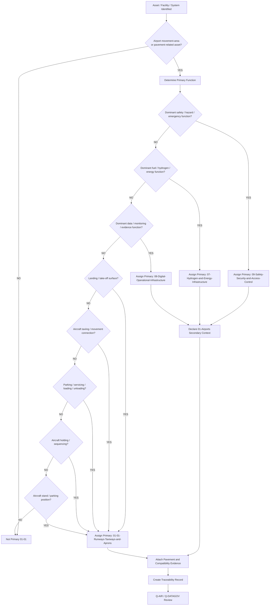
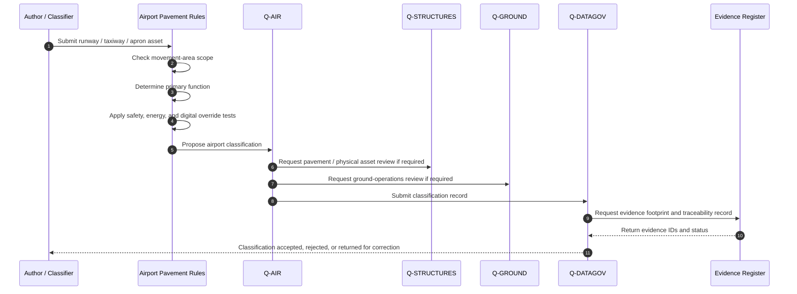
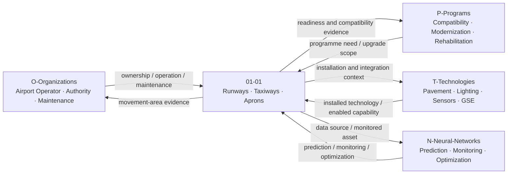
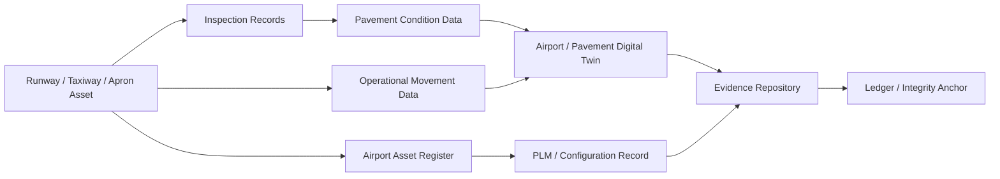

# 01-01-Runways-Taxiways-and-Aprons — Runways Taxiways and Aprons

## Purpose

Physical pavement infrastructure including runways, taxiways, holding areas, and aprons.

This document defines the classification boundary, scope, interfaces, evidence requirements, lifecycle logic, and traceability model for runway, taxiway, holding-area, and apron infrastructure under:

```text
IDEALE-ESG/A-Aerospace/I-Infrastructures/01-Airports/
```

## Parent

[`README.md`](README.md) — `IDEALE-ESG/A-Aerospace/I-Infrastructures/01-Airports/`

---

# 1. Scope

`01-01-Runways-Taxiways-and-Aprons` covers airport-side physical pavement and movement-area infrastructure used to support aircraft landing, take-off, taxiing, holding, parking, servicing, loading, unloading, inspection access, and ground movement.

This document covers the infrastructure classification layer, not detailed civil engineering design.

It provides controlled taxonomy logic for:

- runways;
- taxiways;
- holding areas;
- runway exits;
- rapid-exit taxiways;
- aprons;
- aircraft stands;
- pavement shoulders;
- pavement markings and associated physical classification context;
- pavement condition evidence;
- pavement strength evidence;
- movement-area compatibility evidence;
- aircraft ground-movement compatibility.

---

# 2. Controlled Definition

For this taxonomy, **runways, taxiways, and aprons** are physical airport infrastructure assets that provide controlled surfaces and associated movement-area environments for aircraft landing, take-off, taxiing, holding, parking, servicing, loading, unloading, and ground handling.

They are classified primarily under:

```text
01-Airports
```

when their dominant function is airport-side aircraft movement, parking, or ground operation.

---

# 3. Infrastructure Boundary

## 3.1 Included

This document includes:

- runway infrastructure;
- taxiway infrastructure;
- apron infrastructure;
- holding bays and holding points;
- aircraft stands and parking positions;
- pavement-related movement-area classification;
- pavement condition records;
- pavement strength and compatibility records;
- pavement marking and signage context when tied to movement-area classification;
- airside access interfaces;
- GSE movement interfaces;
- maintenance access zones on movement surfaces;
- airport compatibility evidence related to aircraft ground movement.

## 3.2 Excluded

This document does not include:

- detailed pavement structural design calculations;
- detailed civil engineering drawings;
- detailed construction method statements;
- detailed airport master planning;
- detailed airport operating procedures;
- aircraft landing gear design;
- onboard braking system design;
- air traffic control procedures;
- airport security procedures not tied to movement-area infrastructure classification;
- regulator-approved compliance demonstration packages.

Excluded items may be referenced when they support classification, applicability, effectivity, or evidence.

---

# 4. Asset Classes

| Asset Class | Description | Primary Classification |
|---|---|---|
| Runway | Defined surface used for aircraft landing and take-off. | `01-Airports` |
| Taxiway | Defined aircraft ground-movement path between runways, aprons, stands, terminals, hangars, and other airport areas. | `01-Airports` |
| Apron | Area used for aircraft parking, servicing, boarding, disembarkation, loading, unloading, and ground handling. | `01-Airports` |
| Holding Area | Defined area where aircraft may wait before runway entry, taxiway movement, or apron access. | `01-Airports` |
| Aircraft Stand | Designated apron position for aircraft parking, servicing, boarding, loading, or turnaround. | `01-Airports` |
| Runway Exit | Taxiway segment enabling aircraft to leave the runway after landing. | `01-Airports` |
| Rapid-Exit Taxiway | Taxiway designed to allow aircraft to vacate a runway at higher speed than conventional exit taxiways. | `01-Airports` |
| Pavement Shoulder | Adjacent prepared area supporting pavement edge protection, safety, or operational resilience. | `01-Airports` / `09-Safety-Security-and-Access-Control` when safety dominant |
| Airside Service Road Interface | Road or route interfacing with apron, stand, servicing, or GSE movement. | `01-Airports` / `04-Maintenance-Hangars` or `03-GSE` context when applicable |
| Pavement Monitoring System | System monitoring pavement condition, loads, or degradation. | `08-Digital-Operational-Infrastructure` with secondary `01-Airports` when digital dominant |

---

# 5. Classification Rules

## RULE-I-INFRA-AIR-RTA-001 — Movement Surface Rule

An infrastructure asset shall be classified under `01-01-Runways-Taxiways-and-Aprons` when its primary function is to provide a controlled physical surface for aircraft landing, take-off, taxiing, parking, holding, servicing, or ground movement.

## RULE-I-INFRA-AIR-RTA-002 — Runway Rule

A pavement asset shall be classified as `Runway` when its dominant function is aircraft landing or take-off.

Minimum classification fields:

```yaml
runway_classification:
  asset_type: "runway"
  primary_function:
    - "landing"
    - "take-off"
  primary_section: "01-Airports"
  local_node: "01-01-Runways-Taxiways-and-Aprons"
```

## RULE-I-INFRA-AIR-RTA-003 — Taxiway Rule

A pavement asset shall be classified as `Taxiway` when its dominant function is aircraft ground movement between airport operational areas.

Minimum classification fields:

```yaml
taxiway_classification:
  asset_type: "taxiway"
  primary_function:
    - "aircraft taxiing"
    - "movement-area connection"
  primary_section: "01-Airports"
  local_node: "01-01-Runways-Taxiways-and-Aprons"
```

## RULE-I-INFRA-AIR-RTA-004 — Apron Rule

A pavement asset shall be classified as `Apron` when its dominant function is aircraft parking, servicing, loading, unloading, boarding, disembarkation, or ground handling.

Minimum classification fields:

```yaml
apron_classification:
  asset_type: "apron"
  primary_function:
    - "aircraft parking"
    - "servicing"
    - "ground handling"
  primary_section: "01-Airports"
  local_node: "01-01-Runways-Taxiways-and-Aprons"
```

## RULE-I-INFRA-AIR-RTA-005 — Holding Area Rule

A holding area shall be classified under this node when its primary function is aircraft sequencing, waiting, or controlled positioning before runway, taxiway, or apron movement.

## RULE-I-INFRA-AIR-RTA-006 — Aircraft Stand Rule

An aircraft stand shall be classified under this node when its primary function is aircraft parking, servicing, passenger boarding, cargo loading, maintenance access, or turnaround support.

If the stand includes energy, charging, hydrogen, or fuel systems with dominant energy function, those systems shall be classified under:

```text
07-Hydrogen-and-Energy-Infrastructure
```

with secondary classification to:

```text
01-Airports
```

## RULE-I-INFRA-AIR-RTA-007 — Safety Override Rule

If a runway, taxiway, apron, holding area, or stand element primarily functions as a safety zone, emergency access zone, restricted area, blast protection zone, obstacle-protection area, or hazard-control asset, it may be classified under:

```text
09-Safety-Security-and-Access-Control
```

with secondary classification to:

```text
01-Airports
```

## RULE-I-INFRA-AIR-RTA-008 — Digital Override Rule

If the asset primarily manages pavement condition data, movement-area monitoring data, digital twin state, operational records, inspection data, or evidence records, it shall be classified under:

```text
08-Digital-Operational-Infrastructure
```

with secondary classification to:

```text
01-Airports
```

## RULE-I-INFRA-AIR-RTA-009 — Pavement Evidence Rule

Each controlled pavement asset shall include evidence supporting its classification, condition, compatibility, lifecycle phase, and operational role.

Minimum evidence:

1. asset name;
2. asset type;
3. physical location;
4. operational function;
5. pavement compatibility statement;
6. lifecycle phase;
7. inspection or condition evidence;
8. applicable reference family;
9. traceability footprint.

## RULE-I-INFRA-AIR-RTA-010 — No Physical-Location-Only Rule

A pavement-related asset located on an airport shall not automatically be classified under `01-01`.

The classification shall be based on primary function.

Example:

```yaml
asset:
  name: "Apron LH2 Refuelling Interface"
  physical_location: "Apron"
  primary_classification: "07-Hydrogen-and-Energy-Infrastructure"
  secondary_classification:
    - "01-Airports"
    - "09-Safety-Security-and-Access-Control"
  rationale: "Dominant function is energy transfer and hydrogen safety control, not pavement movement."
```

---

# 6. Classification Logic

## 6.1 Runway, Taxiway, and Apron Classification Flow



## 6.2 Classification Sequence Diagram



## 6.3 Rule Priority Logic

```yaml
runway_taxiway_apron_classification_logic:
  scope_gate:
    condition: "asset.domain == 'A-Aerospace' and asset.airport_context == true and asset.pavement_or_movement_area_related == true"
    result_if_false: "not_primary_01_01"

  override_priority:
    - priority: 1
      condition: "asset.primary_function in ['safety_zone', 'emergency_response', 'hazard_control', 'restricted_area', 'security_control']"
      primary_result: "09-Safety-Security-and-Access-Control"
      secondary_result: "01-Airports"

    - priority: 2
      condition: "asset.primary_function in ['fuel_transfer', 'hydrogen_transfer', 'LH2_refuelling', 'charging', 'ground_power_energy_delivery']"
      primary_result: "07-Hydrogen-and-Energy-Infrastructure"
      secondary_result: "01-Airports"

    - priority: 3
      condition: "asset.primary_function in ['pavement_monitoring', 'condition_data', 'digital_twin', 'inspection_data', 'evidence_repository']"
      primary_result: "08-Digital-Operational-Infrastructure"
      secondary_result: "01-Airports"

    - priority: 4
      condition: "asset.primary_function in ['landing', 'takeoff', 'taxiing', 'parking', 'holding', 'servicing', 'loading', 'unloading']"
      primary_result: "01-Airports"
      local_node: "01-01-Runways-Taxiways-and-Aprons"

  evidence_required:
    - asset_id
    - asset_name
    - asset_type
    - location
    - primary_function
    - pavement_role
    - compatibility_statement
    - lifecycle_phase
    - condition_or_inspection_evidence
    - traceability_record
```

---

# 7. Pavement Asset Record

Each controlled runway, taxiway, holding-area, apron, or stand asset should be expressible using the following record.

```yaml
pavement_asset_record:
  asset_id: ""
  asset_name: ""
  asset_type: ""
  airport_id: ""
  physical_location: ""

  classification:
    domain: "A-Aerospace"
    opt_in_axis: "I-Infrastructures"
    section: "01-Airports"
    local_node: "01-01-Runways-Taxiways-and-Aprons"
    primary_classification: ""
    secondary_classifications:
      - ""

  pavement_role:
    primary_function: ""
    movement_area_role: ""
    operational_context: ""

  compatibility:
    aircraft_category: ""
    aircraft_reference_code: ""
    pavement_strength_reference: ""
    dimensional_constraints: ""
    operational_limitations: ""

  lifecycle:
    lifecycle_phase: ""
    maturity_state: ""
    governance_status: "controlled-candidate"

  applicability:
    applies_to:
      - ""
    does_not_apply_to:
      - ""

  effectivity:
    facility_effectivity: ""
    asset_effectivity: ""
    configuration_effectivity: ""
    temporal_effectivity: ""
    jurisdiction_effectivity: ""

  evidence:
    evidence_items:
      - evidence_id: ""
        evidence_class: ""
        evidence_status: ""

  traceability:
    upstream:
      - ""
    downstream:
      - ""
```

---

# 8. Pavement Compatibility Fields

## 8.1 Minimum Compatibility Fields

Runway, taxiway, apron, and stand records should include compatibility fields when the asset affects aircraft operation.

```yaml
pavement_compatibility:
  asset_id: ""
  asset_type: ""
  intended_aircraft_classes:
    - ""
  operational_function:
    - ""
  dimensional_data:
    length: ""
    width: ""
    shoulder_width: ""
    clearance_limits: ""
  pavement_data:
    surface_type: ""
    pavement_strength_reference: ""
    condition_status: ""
    inspection_status: ""
  operational_constraints:
    max_aircraft_weight_context: ""
    taxi_limitations: ""
    stand_limitations: ""
    special_operating_conditions: ""
  evidence:
    - evidence_id: ""
      evidence_class: "compatibility-evidence"
```

## 8.2 Compatibility Rule

A pavement asset shall declare compatibility evidence when it affects:

- aircraft landing;
- aircraft take-off;
- aircraft taxiing;
- aircraft parking;
- aircraft stand use;
- GSE movement;
- turnaround;
- aircraft servicing;
- emergency response;
- hydrogen or fuel interface access;
- maintenance access;
- aircraft dispatch readiness.

---

# 9. Airport Pavement Interfaces with OPT-IN Axes

| OPT-IN Axis | Interface with Runways, Taxiways and Aprons |
|---|---|
| `O-Organizations` | Airport operator, aerodrome authority, pavement maintenance organization, ground handler, emergency services, regulator. |
| `P-Programs` | Aircraft airport-compatibility programme, airport modernization programme, pavement rehabilitation programme, hydrogen-readiness programme. |
| `T-Technologies` | Pavement materials, lighting systems, markings, sensors, GSE, inspection systems, pavement monitoring systems, digital twin tools. |
| `I-Infrastructures` | Runway, taxiway, apron, holding area, stand, service road, pavement monitoring infrastructure. |
| `N-Neural-Networks` | Pavement degradation prediction, runway occupancy prediction, taxi-flow optimization, apron congestion prediction, anomaly detection. |

## 9.1 OPT-IN Interface Diagram



---

# 10. Q-Division Governance

| Q-Division | Governance Role |
|---|---|
| `Q-AIR` | Primary owner for runway, taxiway, apron, movement-area, aircraft ground-movement, and airport compatibility classification. |
| `Q-DATAGOV` | Controls naming, traceability, evidence records, digital thread, canonical paths, and publication readiness. |
| `Q-GROUND` | Supports ground operations, GSE movement, apron servicing, turnaround infrastructure, and airside access logic. |
| `Q-STRUCTURES` | Supports pavement structural integrity context, load-bearing infrastructure, physical asset condition, and inspection evidence. |
| `Q-SCIRES` | Supports verification, validation, safety evidence, inspection evidence, and certification-feasibility context. |
| `Q-GREENTECH` | Supports energy, hydrogen, charging, and refuelling interfaces located on or adjacent to apron or stand areas. |
| `Q-HPC` | Supports pavement digital twin computation, operational simulation, traffic-flow modeling, predictive maintenance, and AI/ML analytics. |

---

# 11. Lifecycle Applicability

| Lifecycle Phase | Runway / Taxiway / Apron Role |
|---|---|
| `LC01` | Define movement-area scope, asset class, and airport compatibility intent. |
| `LC02` | Define requirements, operational constraints, safety needs, and compatibility requirements. |
| `LC03` | Define pavement asset architecture, movement-area interfaces, and operational boundaries. |
| `LC04` | Develop preliminary layouts, compatibility assumptions, and pavement strategy. |
| `LC05` | Produce detailed design, configuration records, and implementation evidence. |
| `LC06` | Define verification, inspection, testing, and acceptance criteria. |
| `LC07` | Construct, rehabilitate, configure, or implement pavement assets. |
| `LC08` | Integrate pavement assets with operations, markings, lighting, GSE, digital systems, and emergency response. |
| `LC09` | Commission movement-area assets and establish handover evidence. |
| `LC10` | Support certification, operational approval, compatibility evidence, or authority review. |
| `LC11` | Operate runways, taxiways, aprons, holding areas, and stands. |
| `LC12` | Inspect, maintain, repair, monitor, and support pavement assets. |
| `LC13` | Upgrade, rehabilitate, expand, modify, or reconfigure pavement assets. |
| `LC14` | Retire, close, replace, archive, or decommission pavement assets. |

---

# 12. Evidence Requirements

## 12.1 Minimum Evidence

Each controlled runway, taxiway, apron, holding-area, or stand record shall include:

1. asset ID;
2. asset name;
3. asset type;
4. airport or facility context;
5. primary operational function;
6. primary classification;
7. secondary classifications, if applicable;
8. dimensional or compatibility statement;
9. pavement condition or inspection evidence;
10. lifecycle phase;
11. applicability statement;
12. effectivity statement, if applicable;
13. responsible Q-Division;
14. citation keys, if applicable;
15. traceability record;
16. evidence footprint.

## 12.2 Evidence Classes

| Evidence Class | Use |
|---|---|
| `classification-evidence` | Supports assignment to `01-01-Runways-Taxiways-and-Aprons`. |
| `compatibility-evidence` | Supports aircraft-airport movement-area compatibility. |
| `condition-evidence` | Supports pavement condition and inspection state. |
| `asset-management-evidence` | Supports lifecycle asset governance. |
| `safety-evidence` | Supports hazard zones, emergency response, runway/taxiway/apron safety context. |
| `operational-evidence` | Supports movement-area operation, ground movement, turnaround, and apron operations. |
| `maintenance-evidence` | Supports inspection, pavement maintenance, repair, and rehabilitation records. |
| `digital-evidence` | Supports digital twin, monitoring, pavement data, and operational data systems. |
| `certification-evidence` | Supports certification, operational approval, or authority review context. |

## 12.3 Evidence Package Template

```yaml
runway_taxiway_apron_evidence_package:
  package_id: ""
  package_title: ""
  infrastructure_section: "01-Airports"
  local_node: "01-01-Runways-Taxiways-and-Aprons"
  asset_id: ""
  asset_name: ""
  owner: "Q-AIR"

  supporting_q_divisions:
    - "Q-DATAGOV"
    - "Q-GROUND"
    - "Q-STRUCTURES"
    - "Q-SCIRES"

  lifecycle_phase: ""

  applicability:
    applies_to:
      - ""
    does_not_apply_to:
      - ""

  effectivity:
    airport_id: ""
    facility_id: ""
    asset_configuration: ""
    operational_status: ""
    temporal_effectivity: ""
    jurisdiction_effectivity: ""

  evidence_items:
    - evidence_id: ""
      evidence_class: ""
      title: ""
      status: ""
      repository_path: ""

  traceability:
    upstream:
      - ""
    downstream:
      - ""

  review:
    reviewer: ""
    approval_status: ""
```

---

# 13. Digital Thread

Runway, taxiway, and apron infrastructure may interface with digital systems for asset management, operational monitoring, inspection, pavement condition, digital twin, and compatibility evidence.

Digital-thread interfaces may include:

- airport asset register;
- pavement condition database;
- inspection records;
- maintenance records;
- operational movement data;
- airport digital twin;
- GIS or spatial asset records;
- PLM or configuration record;
- evidence repository;
- ledger or integrity anchor.

## 13.1 Pavement Digital Thread Diagram



---

# 14. Classification Examples

## 14.1 Runway

```yaml
asset:
  asset_name: "Runway 09/27"
  asset_type: "Runway"
  primary_function: "Aircraft landing and take-off"
  primary_classification:
    section_code: "01"
    section_name: "Airports"
    local_node: "01-01-Runways-Taxiways-and-Aprons"
  evidence:
    - evidence_class: "compatibility-evidence"
    - evidence_class: "condition-evidence"
```

## 14.2 Taxiway

```yaml
asset:
  asset_name: "Taxiway B"
  asset_type: "Taxiway"
  primary_function: "Aircraft taxiing between runway and apron"
  primary_classification:
    section_code: "01"
    section_name: "Airports"
    local_node: "01-01-Runways-Taxiways-and-Aprons"
  evidence:
    - evidence_class: "operational-evidence"
    - evidence_class: "maintenance-evidence"
```

## 14.3 Apron

```yaml
asset:
  asset_name: "Main Passenger Apron"
  asset_type: "Apron"
  primary_function: "Aircraft parking, servicing, boarding, and turnaround"
  primary_classification:
    section_code: "01"
    section_name: "Airports"
    local_node: "01-01-Runways-Taxiways-and-Aprons"
  secondary_classifications:
    - section_code: "01-04"
      relation: "Aircraft turnaround and servicing interface"
```

## 14.4 Apron Energy Interface

```yaml
asset:
  asset_name: "Apron Ground Power and Charging Interface"
  asset_type: "Energy interface"
  physical_location: "Apron"
  primary_function: "Electrical energy delivery"
  primary_classification:
    section_code: "07"
    section_name: "Hydrogen and Energy Infrastructure"
  secondary_classifications:
    - section_code: "01"
      section_name: "Airports"
      relation: "Located in apron operational environment"
```

---

# 15. Reference Map

| Citation Key | Applies To | Use in `01-01` |
|---|---|---|
| `ICAO-ANNEX14` | Runways, taxiways, aprons, aerodrome physical characteristics | Baseline aerodrome design and operations reference family. |
| `EASA-ADR` | EU aerodrome governance | EU aerodrome regulatory and administrative reference family. |
| `EASA-CS-ADR-DSN` | Aerodrome design | Aerodrome design certification specification reference family. |
| `FAA-PART-139` | US airport certification | US airport certification and operational safety reference family. |
| `ISO-55000` | Asset management | Pavement asset lifecycle and asset-management reference family. |
| `ISO-31000` | Risk management | Pavement-related hazard, risk, safety, and emergency-response reference family. |
| `ISO-9001` | Quality management | General QMS reference family for controlled records and infrastructure processes. |
| `IAQG-9100` | Aerospace QMS | Aviation, space, and defense QMS governance reference family. |
| `S1000D` | Technical publications | CSDB/IETP reference family for controlled publication-ready infrastructure data. |

---

# 16. Controlled References

## [ICAO-ANNEX14]

**ICAO Annex 14 — Aerodromes, Volume I, Aerodrome Design and Operations.**

Used as the international airport and aerodrome reference family for runway, taxiway, apron, movement-area, and physical airport infrastructure context.

## [EASA-ADR]

**EASA Easy Access Rules for Aerodromes — Regulation (EU) No 139/2014.**

Used as the EU aerodrome regulatory reference family for airport infrastructure governance, aerodrome certification context, administrative procedures, and operational requirements.

## [EASA-CS-ADR-DSN]

**EASA Certification Specifications and Guidance Material for Aerodrome Design.**

Used as the aerodrome design reference family for physical airport infrastructure, including runway, taxiway, apron, and related design classification context.

## [FAA-PART-139]

**14 CFR Part 139 — Certification of Airports.**

Used as the US airport certification reference family for runway, taxiway, apron, airport safety, and jurisdiction-specific applicability.

## [ISO-55000]

**ISO 55000 — Asset Management, Vocabulary, Overview and Principles.**

Used as the asset-management reference family for pavement infrastructure lifecycle, asset value, asset governance, and controlled asset management.

## [ISO-31000]

**ISO 31000 — Risk Management Guidelines.**

Used as the risk-management reference family for pavement hazards, movement-area risk, operational safety, and emergency-response context.

## [ISO-9001]

**ISO 9001 — Quality Management Systems Requirements.**

Used as the general quality-management reference family for process governance, review, improvement, audit, and controlled records.

## [IAQG-9100]

**IAQG 9100 — Quality Management Systems Requirements for Aviation, Space and Defense Organizations.**

Used as the aerospace quality-management reference family for aviation, space, defense, supplier, maintenance, production, and lifecycle governance.

## [S1000D]

**S1000D — International Specification for Technical Publications Using a Common Source Database.**

Used as the technical-publication and CSDB reference family when runway, taxiway, apron, or airport infrastructure documentation requires controlled data modules, applicability, effectivity, publication readiness, or IETP integration.

---

# 17. Traceability Record

```yaml
runway_taxiway_apron_traceability_record:
  document_id: "IDEALE-ESG-A-AEROSPACE-I-INFRASTRUCTURES-01-01-RUNWAYS-TAXIWAYS-AND-APRONS"
  canonical_path: "IDEALE-ESG/A-Aerospace/I-Infrastructures/01-Airports/01-01-Runways-Taxiways-and-Aprons.md"
  parent_path: "IDEALE-ESG/A-Aerospace/I-Infrastructures/01-Airports/"
  upstream:
    - "IDEALE-ESG-A-AEROSPACE-I-INFRASTRUCTURES-01-00-AIRPORTS-GENERAL"
    - "IDEALE-ESG-A-AEROSPACE-I-INFRASTRUCTURES-00-02-INFRASTRUCTURE-CLASSIFICATION-RULES"
    - "IDEALE-ESG-A-AEROSPACE-I-INFRASTRUCTURES-00-04-APPLICABILITY-AND-EFFECTIVITY"
    - "IDEALE-ESG-A-AEROSPACE-I-INFRASTRUCTURES-00-07-TRACEABILITY-AND-EVIDENCE"
    - "IDEALE-ESG-A-AEROSPACE-I-INFRASTRUCTURES-00-08-NAMING-CONVENTIONS"
  downstream:
    - "01-03-Ground-Support-Equipment-GSE"
    - "01-04-Aircraft-Turnaround-and-Servicing"
    - "01-05-Fuel-and-Hydrogen-Readiness"
    - "01-06-Airport-Safety-and-Emergency-Response"
    - "01-07-Airport-Digital-Operations"
    - "01-08-Airport-Compatibility-and-Certification"
    - "01-09-Traceability-Governance-and-Evidence"
```

---

# 18. Footprints

## Semantic Footprint

```yaml
semantic_footprint:
  id: FP-SEM-I-INFRA-01-01
  subject: "Runway, taxiway, holding-area, stand, and apron infrastructure classification"
  meaning_boundary:
    includes:
      - runway infrastructure
      - taxiway infrastructure
      - apron infrastructure
      - holding areas
      - aircraft stands
      - pavement movement-area classification
      - pavement compatibility evidence
      - pavement condition evidence
      - movement-area digital thread
    excludes:
      - detailed pavement structural design
      - detailed civil engineering calculations
      - aircraft landing gear design
      - airport master planning
      - air traffic control procedures
      - authority-approved compliance demonstration
```

## Taxonomy Footprint

```yaml
taxonomy_footprint:
  id: FP-TAX-I-INFRA-01-01
  hierarchy:
    root: "IDEALE-ESG"
    domain: "A-Aerospace"
    opt_in_axis: "I-Infrastructures"
    section: "01-Airports"
    document: "01-01-Runways-Taxiways-and-Aprons"
```

## Lifecycle Footprint

```yaml
lifecycle_footprint:
  id: FP-LC-I-INFRA-01-01
  lifecycle_phase: "LC01"
  lifecycle_role: "Defines runway, taxiway, holding-area, stand, and apron infrastructure scope"
  exit_criteria:
    - pavement asset classes defined
    - classification rules defined
    - override logic defined
    - compatibility fields defined
    - evidence requirements defined
    - digital-thread interfaces mapped
    - reference families mapped
```

## Compliance Footprint

```yaml
compliance_footprint:
  id: FP-COMP-I-INFRA-01-01
  reference_families:
    aerodromes:
      - "ICAO-ANNEX14"
      - "EASA-ADR"
      - "EASA-CS-ADR-DSN"
      - "FAA-PART-139"
    asset_management:
      - "ISO-55000"
    risk_management:
      - "ISO-31000"
    quality_management:
      - "ISO-9001"
      - "IAQG-9100"
    technical_publications:
      - "S1000D"
```

## Evidence Footprint

```yaml
evidence_footprint:
  id: FP-EVD-I-INFRA-01-01
  expected_evidence:
    - controlled markdown document
    - YAML frontmatter
    - canonical path
    - parent path
    - pavement asset classes
    - classification rules
    - classification logic diagrams
    - pavement asset record template
    - compatibility fields
    - evidence package template
    - digital-thread diagram
    - reference map
    - traceability record
```

---

# 19. Governance Rule

Any child or derivative record under `01-01-Runways-Taxiways-and-Aprons` shall declare:

1. pavement asset type;
2. airport context;
3. primary function;
4. primary classification;
5. secondary classifications, if applicable;
6. movement-area role;
7. compatibility statement;
8. applicability;
9. effectivity, when required;
10. lifecycle phase;
11. responsible Q-Division;
12. evidence footprint;
13. traceability record.

No runway, taxiway, apron, holding-area, or stand document shall claim regulatory compliance solely because it references ICAO, EASA, FAA, ISO, IAQG, or S1000D material.

Compliance requires programme-specific, jurisdiction-specific, authority-accepted evidence.

---

# 20. Acceptance Criteria

This document is acceptable when:

- runway, taxiway, holding-area, stand, and apron scope is defined;
- included and excluded boundaries are stated;
- classification rules are present;
- override logic is defined;
- classification diagrams are included;
- compatibility fields are defined;
- evidence requirements are defined;
- digital-thread interfaces are mapped;
- Q-Division responsibilities are declared;
- reference families are mapped;
- traceability records are provided;
- downstream airport documents can reuse the structure without reinterpretation.

---

# 21. Summary

`01-01-Runways-Taxiways-and-Aprons` defines the controlled taxonomy scope for airport pavement and movement-area infrastructure.

It covers runways, taxiways, aprons, holding areas, aircraft stands, pavement compatibility, movement-area evidence, lifecycle governance, digital-thread interfaces, and traceability for aircraft ground-movement infrastructure under `01-Airports`.
````
