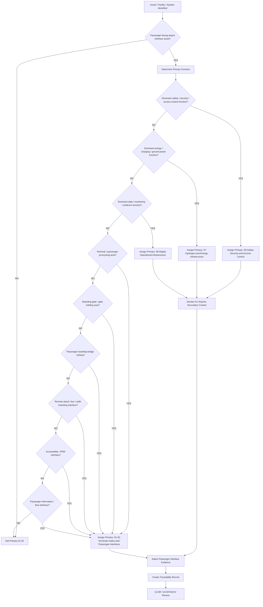
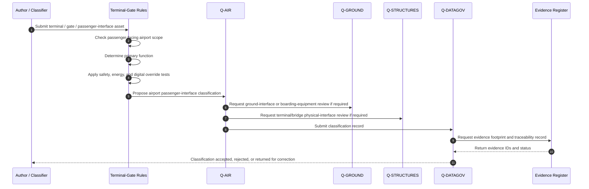
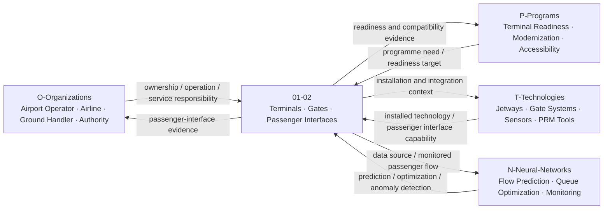
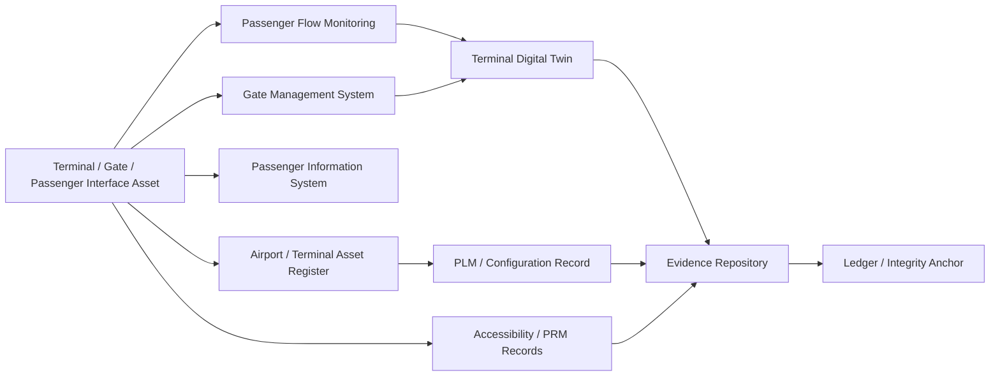

# 01-02-Terminals-Gates-and-Passenger-Interfaces — Terminals Gates and Passenger Interfaces

## Purpose

Terminal buildings, boarding gates, jetways, and passenger-facing ground interfaces.

This document defines the classification boundary, scope, interfaces, evidence requirements, lifecycle logic, and traceability model for airport terminal, boarding-gate, jetway, passenger-flow, and passenger-facing ground-interface infrastructure under:

```text
IDEALE-ESG/A-Aerospace/I-Infrastructures/01-Airports/
```

## Parent

[`README.md`](README.md) — `IDEALE-ESG/A-Aerospace/I-Infrastructures/01-Airports/`

---

# 1. Scope

`01-02-Terminals-Gates-and-Passenger-Interfaces` covers airport infrastructure used to process, route, board, disembark, protect, inform, and support passengers between landside, terminal, airside, aircraft interface, and ground-transport environments.

This document covers the infrastructure classification layer, not detailed building design, airport operating procedures, commercial terminal planning, or passenger-service policy.

It provides controlled taxonomy logic for:

- terminal buildings;
- check-in halls;
- security-screening interface areas;
- border-control interface areas;
- departure lounges;
- arrival halls;
- boarding gates;
- gate holding areas;
- passenger boarding bridges;
- jetways;
- walk-boarding routes;
- bus-boarding interfaces;
- remote stand passenger interfaces;
- passenger stairs and mobile boarding equipment interfaces;
- passenger information infrastructure;
- passenger accessibility interfaces;
- passenger flow and queue-management infrastructure;
- baggage reclaim passenger interfaces;
- passenger emergency egress interfaces;
- terminal digital operations interfaces;
- terminal-to-aircraft compatibility evidence.

---

# 2. Controlled Definition

For this taxonomy, a **terminal, gate, or passenger interface asset** is:

> A physical, digital, operational, safety, accessibility, or passenger-facing airport infrastructure element that enables passengers to move between landside, terminal, airside, gate, stand, and aircraft environments.

These assets are classified primarily under:

```text
01-Airports
```

when their dominant function is passenger processing, passenger movement, boarding, disembarkation, gate operation, terminal-aircraft interface, or airport-side passenger support.

---

# 3. Infrastructure Boundary

## 3.1 Included

This document includes:

- terminal passenger-processing areas;
- departure and arrival interfaces;
- boarding gates;
- gate holding areas;
- passenger boarding bridges;
- jetways;
- mobile passenger stairs when treated as gate or stand interface infrastructure;
- passenger bus boarding areas;
- remote stand passenger routes;
- passenger information displays and interface points;
- accessibility and PRM interface infrastructure;
- queue-management infrastructure;
- terminal-airside transition points;
- gate-to-aircraft compatibility interfaces;
- passenger-flow digital monitoring when airport-operation dominant;
- terminal emergency egress infrastructure when passenger-interface dominant;
- passenger-facing evidence and traceability records.

## 3.2 Excluded

This document does not include:

- aircraft cabin interiors;
- aircraft doors and onboard boarding systems;
- airline passenger-service procedures;
- detailed architectural terminal design;
- detailed civil engineering calculations;
- commercial retail layouts not linked to aerospace infrastructure classification;
- airport security procedures outside infrastructure classification;
- baggage-handling systems when their dominant function is logistics rather than passenger interface;
- detailed regulatory compliance packages;
- personal passenger data processing rules outside infrastructure taxonomy scope.

Excluded items may be cross-referenced when they support classification, applicability, effectivity, or evidence.

---

# 4. Asset Classes

| Asset Class | Description | Primary Classification |
|---|---|---|
| Terminal Building | Passenger-facing building infrastructure supporting departures, arrivals, waiting, flow, and airport services. | `01-Airports` |
| Check-In Area | Passenger interface for ticketing, baggage acceptance, and departure processing. | `01-Airports` |
| Security Screening Interface | Passenger-processing area before airside access. | `09-Safety-Security-and-Access-Control` when security dominant; secondary `01-Airports` |
| Border Control Interface | Passenger-processing interface for immigration, customs, or border authority flow. | `01-Airports` / `09-Safety-Security-and-Access-Control` when control dominant |
| Departure Lounge | Waiting and passenger-holding infrastructure before boarding. | `01-Airports` |
| Arrival Hall | Passenger-facing arrival and onward-connection interface. | `01-Airports` |
| Boarding Gate | Passenger boarding-control point and gate-holding interface. | `01-Airports` |
| Gate Holding Area | Passenger waiting area assigned to one or more gates. | `01-Airports` |
| Passenger Boarding Bridge | Controlled movable bridge between terminal/gate and aircraft. | `01-Airports` / `04-Maintenance-Hangars` if maintenance access dominant |
| Jetway | Passenger boarding bridge or enclosed aircraft-access interface. | `01-Airports` |
| Walk-Boarding Route | Controlled passenger route between terminal and aircraft stand. | `01-Airports` / `09-Safety-Security-and-Access-Control` if safety dominant |
| Bus Boarding Interface | Interface between terminal, bus operation, remote stand, and aircraft access route. | `01-Airports` |
| Passenger Stairs Interface | Interface using mobile or fixed stairs for aircraft boarding or disembarkation. | `01-Airports` / `03-GSE` context when equipment dominant |
| PRM Interface | Infrastructure supporting passengers with reduced mobility or accessibility needs. | `01-Airports` |
| Passenger Information Interface | Digital or physical passenger-facing information infrastructure. | `08-Digital-Operational-Infrastructure` when digital system dominant; secondary `01-Airports` |
| Queue Management System | Physical or digital system managing passenger flow and waiting. | `01-Airports` / `08-Digital-Operational-Infrastructure` when data dominant |
| Emergency Egress Interface | Passenger evacuation and emergency movement route. | `09-Safety-Security-and-Access-Control` when safety dominant; secondary `01-Airports` |

---

# 5. Classification Rules

## RULE-I-INFRA-AIR-TGP-001 — Passenger Interface Rule

An infrastructure asset shall be classified under `01-02-Terminals-Gates-and-Passenger-Interfaces` when its primary function is passenger movement, passenger processing, boarding, disembarkation, waiting, passenger information, passenger accessibility, or terminal-aircraft interface.

## RULE-I-INFRA-AIR-TGP-002 — Terminal Rule

A building or area shall be classified as terminal infrastructure when its dominant function is to support passenger departure, arrival, transfer, waiting, or airport-side processing.

Minimum classification fields:

```yaml
terminal_classification:
  asset_type: "terminal"
  primary_function:
    - "passenger processing"
    - "departure flow"
    - "arrival flow"
    - "passenger waiting"
  primary_section: "01-Airports"
  local_node: "01-02-Terminals-Gates-and-Passenger-Interfaces"
```

## RULE-I-INFRA-AIR-TGP-003 — Gate Rule

An asset shall be classified as gate infrastructure when its dominant function is passenger boarding control, passenger holding, gate operations, boarding sequence support, or aircraft access coordination.

Minimum classification fields:

```yaml
gate_classification:
  asset_type: "boarding gate"
  primary_function:
    - "boarding control"
    - "passenger holding"
    - "aircraft access coordination"
  primary_section: "01-Airports"
  local_node: "01-02-Terminals-Gates-and-Passenger-Interfaces"
```

## RULE-I-INFRA-AIR-TGP-004 — Passenger Boarding Bridge Rule

A passenger boarding bridge or jetway shall be classified under `01-02` when its dominant function is passenger movement between terminal/gate and aircraft.

If the asset is being considered primarily as a maintainable mechanical system, maintenance tooling, or access equipment, it may also be linked to:

```text
04-Maintenance-Hangars
```

or:

```text
01-03-Ground-Support-Equipment-GSE
```

as a secondary context.

## RULE-I-INFRA-AIR-TGP-005 — Remote Stand Passenger Interface Rule

Remote stand passenger infrastructure shall be classified under `01-02` when its dominant function is passenger movement between terminal, bus, stand, and aircraft.

This may include:

- bus boarding areas;
- passenger route markings;
- controlled pedestrian paths;
- temporary passenger shelters;
- mobile stair interface zones;
- passenger safety corridors.

## RULE-I-INFRA-AIR-TGP-006 — Accessibility Interface Rule

Passenger-facing infrastructure supporting accessibility, passengers with reduced mobility, assisted boarding, accessible gates, lifts, ramps, or boarding support shall be classified under `01-02` unless the dominant function is medical, security, or emergency response.

## RULE-I-INFRA-AIR-TGP-007 — Safety and Security Override Rule

If a terminal, gate, or passenger-interface asset primarily provides safety, emergency egress, restricted-area control, security screening, or access control, it may be classified under:

```text
09-Safety-Security-and-Access-Control
```

with secondary classification to:

```text
01-Airports
```

## RULE-I-INFRA-AIR-TGP-008 — Digital Override Rule

If an asset primarily manages passenger-flow data, operational information, passenger-interface monitoring, gate data, biometric access, evidence records, digital twin state, or data governance, it shall be classified under:

```text
08-Digital-Operational-Infrastructure
```

with secondary classification to:

```text
01-Airports
```

## RULE-I-INFRA-AIR-TGP-009 — Energy Interface Rule

If a terminal, gate, or passenger-interface asset primarily delivers electrical energy, ground power, charging, hydrogen-related energy support, or energy isolation, it shall be classified under:

```text
07-Hydrogen-and-Energy-Infrastructure
```

with secondary classification to:

```text
01-Airports
```

## RULE-I-INFRA-AIR-TGP-010 — Passenger Compatibility Evidence Rule

Passenger-interface records shall include compatibility evidence when the asset affects boarding, disembarkation, accessibility, turnaround, aircraft interface, emergency egress, or passenger-flow capacity.

Minimum evidence:

1. asset name;
2. asset type;
3. passenger-interface function;
4. terminal or gate context;
5. aircraft-interface compatibility statement, if applicable;
6. accessibility statement, if applicable;
7. lifecycle phase;
8. applicable reference family;
9. evidence footprint;
10. traceability record.

---

# 6. Classification Logic

## 6.1 Terminal, Gate, and Passenger Interface Classification Flow



## 6.2 Classification Sequence Diagram



## 6.3 Rule Priority Logic

```yaml
terminal_gate_passenger_interface_classification_logic:
  scope_gate:
    condition: "asset.domain == 'A-Aerospace' and asset.airport_context == true and asset.passenger_interface_related == true"
    result_if_false: "not_primary_01_02"

  override_priority:
    - priority: 1
      condition: "asset.primary_function in ['security_screening', 'restricted_area_control', 'emergency_egress', 'evacuation', 'access_control', 'safety_monitoring']"
      primary_result: "09-Safety-Security-and-Access-Control"
      secondary_result: "01-Airports"

    - priority: 2
      condition: "asset.primary_function in ['ground_power_delivery', 'charging', 'energy_isolation', 'terminal_energy_supply']"
      primary_result: "07-Hydrogen-and-Energy-Infrastructure"
      secondary_result: "01-Airports"

    - priority: 3
      condition: "asset.primary_function in ['passenger_flow_data', 'gate_data', 'digital_twin', 'monitoring', 'evidence_repository', 'biometric_data_governance']"
      primary_result: "08-Digital-Operational-Infrastructure"
      secondary_result: "01-Airports"

    - priority: 4
      condition: "asset.primary_function in ['passenger_processing', 'boarding', 'disembarkation', 'gate_holding', 'terminal_flow', 'passenger_information', 'accessibility_support']"
      primary_result: "01-Airports"
      local_node: "01-02-Terminals-Gates-and-Passenger-Interfaces"

  evidence_required:
    - asset_id
    - asset_name
    - asset_type
    - terminal_or_gate_context
    - passenger_interface_function
    - aircraft_interface_compatibility_if_applicable
    - accessibility_statement_if_applicable
    - lifecycle_phase
    - traceability_record
```

---

# 7. Passenger Interface Asset Record

Each controlled terminal, gate, jetway, boarding bridge, or passenger-interface asset should be expressible using the following record.

```yaml
passenger_interface_asset_record:
  asset_id: ""
  asset_name: ""
  asset_type: ""
  airport_id: ""
  terminal_id: ""
  gate_id: ""
  physical_location: ""

  classification:
    domain: "A-Aerospace"
    opt_in_axis: "I-Infrastructures"
    section: "01-Airports"
    local_node: "01-02-Terminals-Gates-and-Passenger-Interfaces"
    primary_classification: ""
    secondary_classifications:
      - ""

  passenger_interface_role:
    primary_function: ""
    passenger_flow_role: ""
    operational_context: ""

  compatibility:
    aircraft_interface_required: false
    applicable_aircraft_classes:
      - ""
    gate_compatibility_context: ""
    bridge_or_jetway_compatibility: ""
    boarding_method: ""
    accessibility_context: ""
    operational_limitations: ""

  lifecycle:
    lifecycle_phase: ""
    maturity_state: ""
    governance_status: "controlled-candidate"

  applicability:
    applies_to:
      - ""
    does_not_apply_to:
      - ""

  effectivity:
    facility_effectivity: ""
    asset_effectivity: ""
    configuration_effectivity: ""
    temporal_effectivity: ""
    jurisdiction_effectivity: ""
    digital_effectivity: ""

  evidence:
    evidence_items:
      - evidence_id: ""
        evidence_class: ""
        evidence_status: ""

  traceability:
    upstream:
      - ""
    downstream:
      - ""
```

---

# 8. Passenger Interface Compatibility Fields

## 8.1 Minimum Compatibility Fields

Terminal, gate, boarding bridge, jetway, and passenger-interface records should include compatibility fields when the asset affects passenger movement or aircraft interface.

```yaml
passenger_interface_compatibility:
  asset_id: ""
  asset_type: ""
  passenger_interface_type: ""

  passenger_flow:
    intended_flow_type:
      - "departure"
      - "arrival"
      - "transfer"
      - "boarding"
      - "disembarkation"
    capacity_context: ""
    queue_context: ""
    segregation_context: ""

  aircraft_interface:
    aircraft_interface_required: false
    applicable_aircraft_classes:
      - ""
    door_interface_context: ""
    bridge_or_stair_context: ""
    stand_or_gate_context: ""

  accessibility:
    prm_applicability: ""
    assisted_boarding_context: ""
    accessible_route_context: ""
    lift_or_ramp_context: ""

  safety_and_security:
    emergency_egress_context: ""
    restricted_area_context: ""
    access_control_context: ""

  digital_interface:
    passenger_information_system: ""
    gate_management_system: ""
    monitoring_or_prediction_system: ""

  evidence:
    - evidence_id: ""
      evidence_class: "compatibility-evidence"
```

## 8.2 Compatibility Rule

A passenger-interface asset shall declare compatibility evidence when it affects:

- boarding;
- disembarkation;
- gate assignment;
- aircraft-door interface;
- passenger boarding bridge use;
- mobile stair use;
- remote stand passenger access;
- passenger flow;
- queue management;
- accessibility;
- emergency egress;
- security screening interface;
- terminal-airside boundary;
- turnaround timing;
- operational readiness.

---

# 9. Passenger Interface with OPT-IN Axes

| OPT-IN Axis | Interface with Terminals, Gates and Passenger Interfaces |
|---|---|
| `O-Organizations` | Airport operator, terminal operator, airline, ground handler, PRM service provider, border authority, security authority, emergency services, regulator. |
| `P-Programs` | Airport modernization programme, terminal readiness programme, passenger-flow improvement programme, aircraft compatibility campaign, accessibility improvement programme. |
| `T-Technologies` | Boarding bridges, passenger information systems, gate management systems, access-control systems, sensors, passenger-flow monitoring, lifts, ramps, mobile stairs. |
| `I-Infrastructures` | Terminal, gate, jetway, passenger route, boarding interface, arrival and departure interface, PRM infrastructure. |
| `N-Neural-Networks` | Passenger-flow prediction, queue optimization, gate-allocation support, boarding-time prediction, congestion detection, anomaly detection. |

## 9.1 OPT-IN Interface Diagram



---

# 10. Q-Division Governance

| Q-Division | Governance Role |
|---|---|
| `Q-AIR` | Primary owner for terminal, gate, passenger-interface, boarding, disembarkation, passenger-flow, and airport compatibility classification. |
| `Q-DATAGOV` | Controls naming, traceability, evidence records, digital thread, canonical paths, passenger-interface data governance, and publication readiness. |
| `Q-GROUND` | Supports boarding interfaces, ground handling, passenger access to stands, mobile stairs, passenger bus interfaces, and gate-side operational support. |
| `Q-STRUCTURES` | Supports physical terminal structures, boarding bridge interfaces, fixed access infrastructure, load-bearing elements, and structural integrity context. |
| `Q-GREENTECH` | Supports terminal and gate energy interfaces, charging, ground-power context, low-emission ground operations, and sustainable infrastructure transition. |
| `Q-SCIRES` | Supports verification, validation, safety evidence, passenger-flow evidence, accessibility evidence, and certification-feasibility context. |
| `Q-HPC` | Supports passenger-flow simulation, terminal digital twins, queue prediction, gate optimization, and AI/ML infrastructure analytics. |

---

# 11. Lifecycle Applicability

| Lifecycle Phase | Terminal / Gate / Passenger Interface Role |
|---|---|
| `LC01` | Define passenger-interface scope, terminal/gate classification boundary, and airport compatibility intent. |
| `LC02` | Define passenger-flow requirements, accessibility needs, safety constraints, security interfaces, and operational requirements. |
| `LC03` | Define terminal/gate infrastructure architecture, passenger-flow model, and interface boundaries. |
| `LC04` | Develop preliminary layouts, passenger-flow assumptions, gate compatibility concepts, and accessibility concepts. |
| `LC05` | Produce detailed design, configuration records, gate-interface records, and implementation evidence. |
| `LC06` | Define verification, inspection, test, passenger-flow simulation, and acceptance criteria. |
| `LC07` | Construct, configure, install, or deploy terminal, gate, passenger-interface, or boarding infrastructure. |
| `LC08` | Integrate passenger-interface assets with operations, aircraft stands, gate systems, digital systems, safety systems, and accessibility services. |
| `LC09` | Commission passenger-interface infrastructure and establish handover evidence. |
| `LC10` | Support certification, approval, accessibility, operational-readiness, or authority review evidence. |
| `LC11` | Operate terminal, gate, jetway, and passenger-interface infrastructure in service. |
| `LC12` | Maintain, inspect, repair, calibrate, and support passenger-interface infrastructure. |
| `LC13` | Upgrade, expand, modify, reconfigure, or modernize passenger-interface infrastructure. |
| `LC14` | Retire, close, replace, archive, or decommission passenger-interface infrastructure. |

---

# 12. Evidence Requirements

## 12.1 Minimum Evidence

Each controlled terminal, gate, boarding bridge, jetway, or passenger-interface record shall include:

1. asset ID;
2. asset name;
3. asset type;
4. airport, terminal, gate, or stand context;
5. passenger-interface function;
6. primary classification;
7. secondary classifications, if applicable;
8. passenger-flow statement;
9. aircraft-interface compatibility statement, if applicable;
10. accessibility statement, if applicable;
11. safety or security interface statement, if applicable;
12. lifecycle phase;
13. applicability statement;
14. effectivity statement, if applicable;
15. responsible Q-Division;
16. citation keys, if applicable;
17. traceability record;
18. evidence footprint.

## 12.2 Evidence Classes

| Evidence Class | Use |
|---|---|
| `classification-evidence` | Supports assignment to `01-02-Terminals-Gates-and-Passenger-Interfaces`. |
| `compatibility-evidence` | Supports aircraft-gate, jetway, stand, and passenger-interface compatibility. |
| `passenger-flow-evidence` | Supports passenger movement, queue, capacity, and flow-management context. |
| `accessibility-evidence` | Supports PRM, assisted boarding, accessible route, lift, ramp, and passenger-support context. |
| `safety-evidence` | Supports emergency egress, crowd safety, restricted areas, and passenger hazard controls. |
| `security-evidence` | Supports access control, border-control interface, security screening context, and restricted zones. |
| `operational-evidence` | Supports gate operations, boarding, disembarkation, turnaround, and terminal-airside interface. |
| `maintenance-evidence` | Supports inspection, calibration, maintenance, and repair of bridges, gates, sensors, and passenger-interface equipment. |
| `digital-evidence` | Supports gate systems, passenger information systems, passenger-flow monitoring, digital twins, and data governance. |
| `certification-evidence` | Supports regulatory, authority, accessibility, or programme approval context. |

## 12.3 Evidence Package Template

```yaml
terminal_gate_passenger_interface_evidence_package:
  package_id: ""
  package_title: ""
  infrastructure_section: "01-Airports"
  local_node: "01-02-Terminals-Gates-and-Passenger-Interfaces"
  asset_id: ""
  asset_name: ""
  owner: "Q-AIR"

  supporting_q_divisions:
    - "Q-DATAGOV"
    - "Q-GROUND"
    - "Q-STRUCTURES"
    - "Q-SCIRES"

  lifecycle_phase: ""

  applicability:
    applies_to:
      - ""
    does_not_apply_to:
      - ""

  effectivity:
    airport_id: ""
    terminal_id: ""
    gate_id: ""
    stand_id: ""
    asset_configuration: ""
    operational_status: ""
    temporal_effectivity: ""
    jurisdiction_effectivity: ""

  evidence_items:
    - evidence_id: ""
      evidence_class: ""
      title: ""
      status: ""
      repository_path: ""

  traceability:
    upstream:
      - ""
    downstream:
      - ""

  review:
    reviewer: ""
    approval_status: ""
```

---

# 13. Digital Thread

Terminal, gate, and passenger-interface infrastructure may interface with digital systems for passenger-flow monitoring, gate operations, accessibility support, operational data, safety monitoring, digital twin models, and evidence traceability.

Digital-thread interfaces may include:

- airport asset register;
- terminal asset register;
- gate management system;
- passenger information system;
- passenger-flow monitoring system;
- queue-management system;
- accessibility service records;
- boarding bridge maintenance records;
- airport operational data platform;
- terminal digital twin;
- PLM or configuration record;
- evidence repository;
- ledger or integrity anchor.

## 13.1 Passenger Interface Digital Thread Diagram



---

# 14. Classification Examples

## 14.1 Terminal Building

```yaml
asset:
  asset_name: "Terminal 1 Departure Hall"
  asset_type: "Terminal building area"
  primary_function: "Passenger departure processing and flow"
  primary_classification:
    section_code: "01"
    section_name: "Airports"
    local_node: "01-02-Terminals-Gates-and-Passenger-Interfaces"
  evidence:
    - evidence_class: "passenger-flow-evidence"
    - evidence_class: "operational-evidence"
```

## 14.2 Boarding Gate

```yaml
asset:
  asset_name: "Gate A12"
  asset_type: "Boarding gate"
  primary_function: "Boarding control and passenger holding"
  primary_classification:
    section_code: "01"
    section_name: "Airports"
    local_node: "01-02-Terminals-Gates-and-Passenger-Interfaces"
  evidence:
    - evidence_class: "compatibility-evidence"
    - evidence_class: "operational-evidence"
```

## 14.3 Passenger Boarding Bridge

```yaml
asset:
  asset_name: "Passenger Boarding Bridge A12-L"
  asset_type: "Passenger boarding bridge"
  primary_function: "Passenger movement between gate and aircraft"
  primary_classification:
    section_code: "01"
    section_name: "Airports"
    local_node: "01-02-Terminals-Gates-and-Passenger-Interfaces"
  secondary_classifications:
    - section_code: "04"
      section_name: "Maintenance Hangars"
      relation: "Maintainable mechanical access equipment context"
  evidence:
    - evidence_class: "compatibility-evidence"
    - evidence_class: "maintenance-evidence"
```

## 14.4 Security Screening Interface

```yaml
asset:
  asset_name: "Terminal Security Screening Zone"
  asset_type: "Security interface"
  physical_location: "Terminal"
  primary_function: "Passenger security screening and restricted-area access control"
  primary_classification:
    section_code: "09"
    section_name: "Safety, Security and Access Control"
  secondary_classifications:
    - section_code: "01"
      section_name: "Airports"
      relation: "Located within passenger terminal operational environment"
```

## 14.5 Passenger Flow Monitoring System

```yaml
asset:
  asset_name: "Passenger Flow Monitoring System"
  asset_type: "Digital passenger-interface system"
  physical_location: "Terminal"
  primary_function: "Passenger-flow data collection and operational analytics"
  primary_classification:
    section_code: "08"
    section_name: "Digital Operational Infrastructure"
  secondary_classifications:
    - section_code: "01"
      section_name: "Airports"
      relation: "Supports terminal and gate passenger-flow management"
```

---

# 15. Reference Map

| Citation Key | Applies To | Use in `01-02` |
|---|---|---|
| `ICAO-ANNEX14` | Aerodrome operations and infrastructure context | Baseline international aerodrome reference family for airport-side infrastructure. |
| `EASA-ADR` | EU aerodrome governance | EU aerodrome regulatory and administrative reference family. |
| `EASA-CS-ADR-DSN` | Aerodrome design context | Aerodrome design certification specification reference family when passenger-interface assets affect airside layout. |
| `FAA-PART-139` | US airport certification | US airport certification and operational safety reference family. |
| `EU-1107-2006` | Passengers with reduced mobility | Passenger accessibility and PRM assistance reference family in EU air transport context. |
| `ISO-55000` | Asset management | Terminal, gate, and passenger-interface asset lifecycle reference family. |
| `ISO-31000` | Risk management | Passenger-flow, emergency egress, crowd safety, and access-control risk reference family. |
| `ISO-9001` | Quality management | General QMS reference family for controlled records and infrastructure processes. |
| `IAQG-9100` | Aerospace QMS | Aviation, space, and defense QMS governance reference family. |
| `S1000D` | Technical publications | CSDB/IETP reference family for controlled publication-ready infrastructure data. |

---

# 16. Controlled References

## [ICAO-ANNEX14]

**ICAO Annex 14 — Aerodromes, Volume I, Aerodrome Design and Operations.**

Used as the international airport and aerodrome reference family for airport infrastructure, operational context, and terminal-airside interface classification.

## [EASA-ADR]

**EASA Easy Access Rules for Aerodromes — Regulation (EU) No 139/2014.**

Used as the EU aerodrome regulatory reference family for airport infrastructure governance, aerodrome certification context, administrative procedures, and operational requirements.

## [EASA-CS-ADR-DSN]

**EASA Certification Specifications and Guidance Material for Aerodrome Design.**

Used as the aerodrome design reference family when terminal, gate, or passenger-interface assets interact with airside layout, stands, aircraft access, or physical airport infrastructure.

## [FAA-PART-139]

**14 CFR Part 139 — Certification of Airports.**

Used as the US airport certification reference family for airport infrastructure, airport safety, and jurisdiction-specific applicability.

## [EU-1107-2006]

**Regulation (EC) No 1107/2006 — Rights of Disabled Persons and Persons with Reduced Mobility when Travelling by Air.**

Used as the EU passenger accessibility and reduced-mobility reference family for passenger-facing infrastructure context.

## [ISO-55000]

**ISO 55000 — Asset Management, Vocabulary, Overview and Principles.**

Used as the asset-management reference family for terminal, gate, boarding bridge, and passenger-interface lifecycle governance.

## [ISO-31000]

**ISO 31000 — Risk Management Guidelines.**

Used as the risk-management reference family for passenger-flow hazards, emergency egress, restricted-area interfaces, crowd safety, and operational risk context.

## [ISO-9001]

**ISO 9001 — Quality Management Systems Requirements.**

Used as the general quality-management reference family for process governance, review, improvement, audit, and controlled records.

## [IAQG-9100]

**IAQG 9100 — Quality Management Systems Requirements for Aviation, Space and Defense Organizations.**

Used as the aerospace quality-management reference family for aviation, space, defense, supplier, maintenance, production, and lifecycle governance.

## [S1000D]

**S1000D — International Specification for Technical Publications Using a Common Source Database.**

Used as the technical-publication and CSDB reference family when terminal, gate, or passenger-interface infrastructure documentation requires controlled data modules, applicability, effectivity, publication readiness, or IETP integration.

---

# 17. Traceability Record

```yaml
terminal_gate_passenger_interface_traceability_record:
  document_id: "IDEALE-ESG-A-AEROSPACE-I-INFRASTRUCTURES-01-02-TERMINALS-GATES-AND-PASSENGER-INTERFACES"
  canonical_path: "IDEALE-ESG/A-Aerospace/I-Infrastructures/01-Airports/01-02-Terminals-Gates-and-Passenger-Interfaces.md"
  parent_path: "IDEALE-ESG/A-Aerospace/I-Infrastructures/01-Airports/"
  upstream:
    - "IDEALE-ESG-A-AEROSPACE-I-INFRASTRUCTURES-01-00-AIRPORTS-GENERAL"
    - "IDEALE-ESG-A-AEROSPACE-I-INFRASTRUCTURES-00-02-INFRASTRUCTURE-CLASSIFICATION-RULES"
    - "IDEALE-ESG-A-AEROSPACE-I-INFRASTRUCTURES-00-04-APPLICABILITY-AND-EFFECTIVITY"
    - "IDEALE-ESG-A-AEROSPACE-I-INFRASTRUCTURES-00-06-INTERFACES-WITH-OPTIN-AXES"
    - "IDEALE-ESG-A-AEROSPACE-I-INFRASTRUCTURES-00-07-TRACEABILITY-AND-EVIDENCE"
    - "IDEALE-ESG-A-AEROSPACE-I-INFRASTRUCTURES-00-08-NAMING-CONVENTIONS"
  downstream:
    - "01-03-Ground-Support-Equipment-GSE"
    - "01-04-Aircraft-Turnaround-and-Servicing"
    - "01-05-Fuel-and-Hydrogen-Readiness"
    - "01-06-Airport-Safety-and-Emergency-Response"
    - "01-07-Airport-Digital-Operations"
    - "01-08-Airport-Compatibility-and-Certification"
    - "01-09-Traceability-Governance-and-Evidence"
```

---

# 18. Footprints

## Semantic Footprint

```yaml
semantic_footprint:
  id: FP-SEM-I-INFRA-01-02
  subject: "Terminal, gate, jetway, and passenger-facing airport interface infrastructure classification"
  meaning_boundary:
    includes:
      - terminal buildings
      - boarding gates
      - gate holding areas
      - passenger boarding bridges
      - jetways
      - remote stand passenger interfaces
      - passenger stairs interfaces
      - passenger information interfaces
      - accessibility interfaces
      - passenger-flow infrastructure
      - terminal digital thread
    excludes:
      - aircraft cabin interiors
      - aircraft door design
      - airline passenger-service procedures
      - detailed architectural design
      - commercial retail planning
      - personal passenger data protection rules outside infrastructure taxonomy
      - authority-approved compliance demonstration
```

## Taxonomy Footprint

```yaml
taxonomy_footprint:
  id: FP-TAX-I-INFRA-01-02
  hierarchy:
    root: "IDEALE-ESG"
    domain: "A-Aerospace"
    opt_in_axis: "I-Infrastructures"
    section: "01-Airports"
    document: "01-02-Terminals-Gates-and-Passenger-Interfaces"
```

## Lifecycle Footprint

```yaml
lifecycle_footprint:
  id: FP-LC-I-INFRA-01-02
  lifecycle_phase: "LC01"
  lifecycle_role: "Defines terminal, gate, boarding, jetway, and passenger-interface infrastructure scope"
  exit_criteria:
    - passenger-interface asset classes defined
    - classification rules defined
    - override logic defined
    - compatibility fields defined
    - accessibility context defined
    - evidence requirements defined
    - digital-thread interfaces mapped
    - reference families mapped
```

## Compliance Footprint

```yaml
compliance_footprint:
  id: FP-COMP-I-INFRA-01-02
  reference_families:
    aerodromes:
      - "ICAO-ANNEX14"
      - "EASA-ADR"
      - "EASA-CS-ADR-DSN"
      - "FAA-PART-139"
    passenger_accessibility:
      - "EU-1107-2006"
    asset_management:
      - "ISO-55000"
    risk_management:
      - "ISO-31000"
    quality_management:
      - "ISO-9001"
      - "IAQG-9100"
    technical_publications:
      - "S1000D"
```

## Evidence Footprint

```yaml
evidence_footprint:
  id: FP-EVD-I-INFRA-01-02
  expected_evidence:
    - controlled markdown document
    - YAML frontmatter
    - canonical path
    - parent path
    - passenger-interface asset classes
    - classification rules
    - classification logic diagrams
    - passenger interface asset record template
    - compatibility fields
    - accessibility fields
    - evidence package template
    - digital-thread diagram
    - reference map
    - traceability record
```

---

# 19. Governance Rule

Any child or derivative record under `01-02-Terminals-Gates-and-Passenger-Interfaces` shall declare:

1. passenger-interface asset type;
2. airport, terminal, gate, or stand context;
3. primary function;
4. primary classification;
5. secondary classifications, if applicable;
6. passenger-flow role;
7. aircraft-interface compatibility statement, if applicable;
8. accessibility statement, if applicable;
9. applicability;
10. effectivity, when required;
11. lifecycle phase;
12. responsible Q-Division;
13. evidence footprint;
14. traceability record.

No terminal, gate, boarding bridge, jetway, or passenger-interface document shall claim regulatory compliance solely because it references ICAO, EASA, FAA, EU, ISO, IAQG, or S1000D material.

Compliance requires programme-specific, jurisdiction-specific, authority-accepted evidence.

---

# 20. Acceptance Criteria

This document is acceptable when:

- terminal, gate, jetway, and passenger-interface scope is defined;
- included and excluded boundaries are stated;
- classification rules are present;
- override logic is defined;
- classification diagrams are included;
- passenger-interface compatibility fields are defined;
- accessibility context is addressed;
- evidence requirements are defined;
- digital-thread interfaces are mapped;
- Q-Division responsibilities are declared;
- reference families are mapped;
- traceability records are provided;
- downstream airport documents can reuse the structure without reinterpretation.

---

# 21. Summary

`01-02-Terminals-Gates-and-Passenger-Interfaces` defines the controlled taxonomy scope for passenger-facing airport infrastructure.

It covers terminals, gates, gate holding areas, boarding bridges, jetways, remote stand passenger interfaces, passenger stairs interfaces, passenger information systems, accessibility interfaces, passenger-flow infrastructure, lifecycle evidence, digital-thread interfaces, and traceability for passenger movement and aircraft-interface infrastructure under `01-Airports`.
````
