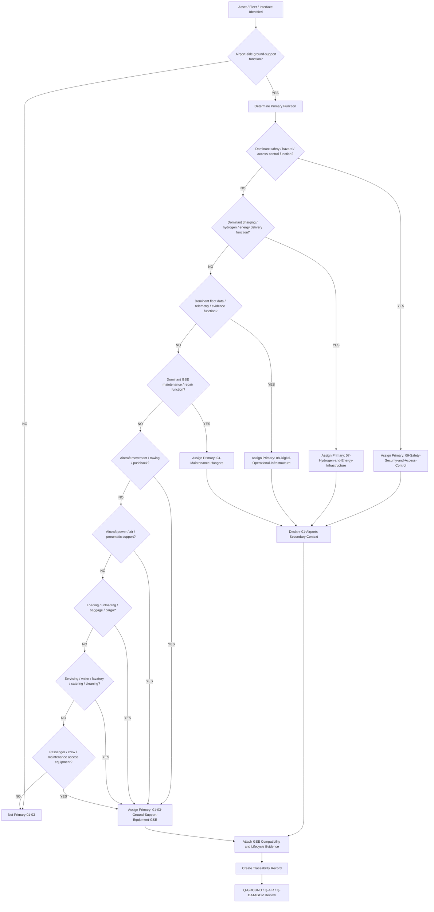
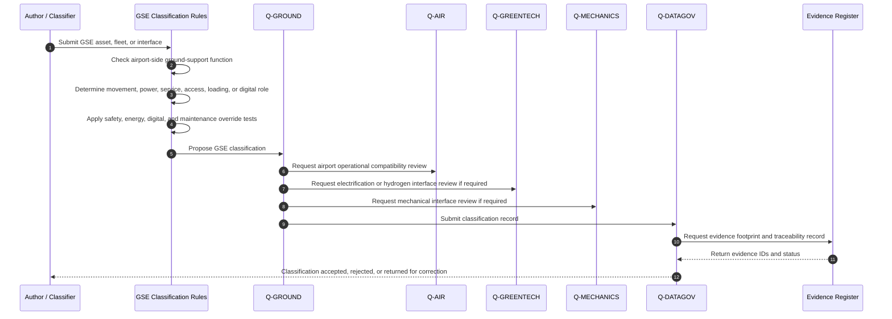
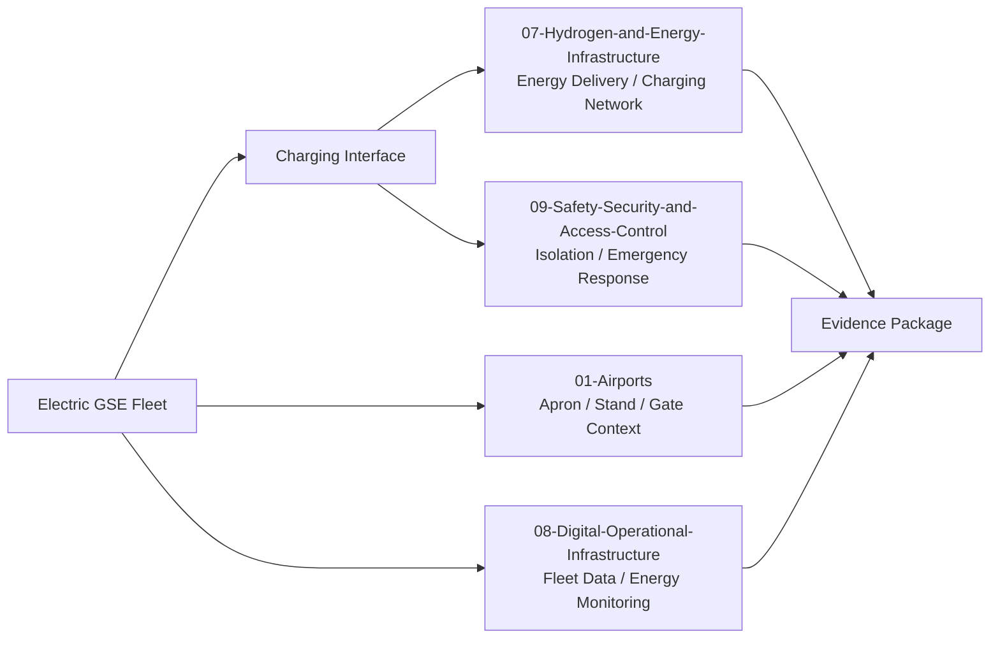
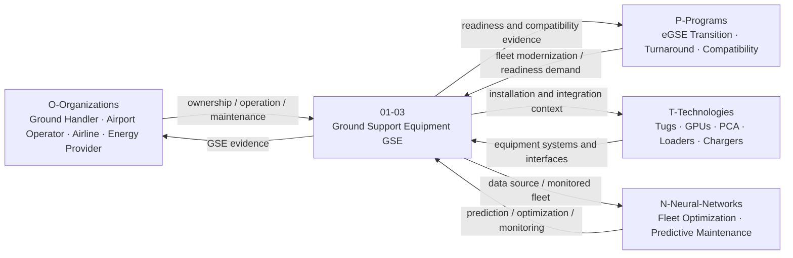
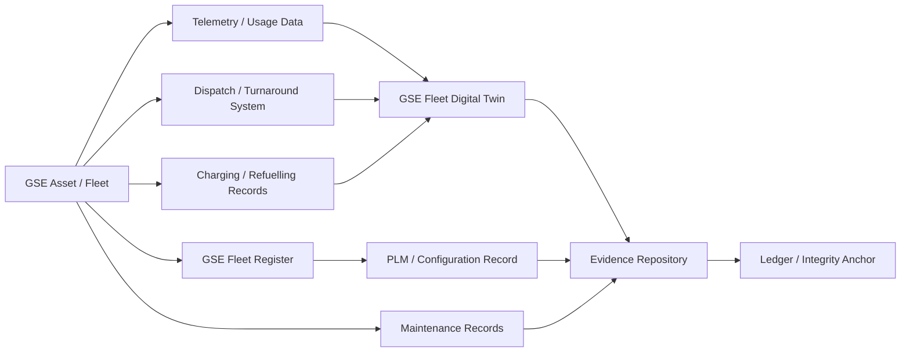

# 01-03-Ground-Support-Equipment-GSE — Ground Support Equipment GSE

## Purpose

Ground support equipment fleets, interfaces, electrification, and compatibility requirements.

This document defines the classification boundary, scope, interfaces, evidence requirements, lifecycle logic, electrification logic, and traceability model for ground support equipment under:

```text
IDEALE-ESG/A-Aerospace/I-Infrastructures/01-Airports/
```

## Parent

[`README.md`](README.md) — `IDEALE-ESG/A-Aerospace/I-Infrastructures/01-Airports/`

---

# 1. Scope

`01-03-Ground-Support-Equipment-GSE` covers airport-side equipment, fleets, interfaces, energy provisions, compatibility constraints, and support infrastructure used to service, move, power, cool, load, unload, inspect, tow, dispatch, or support aircraft on the ground.

This document covers the infrastructure classification layer, not detailed equipment design, manufacturer maintenance manuals, airport operating procedures, or ground-handler work instructions.

It provides controlled taxonomy logic for:

- tow tractors;
- pushback tractors;
- towbarless tractors;
- towbars;
- ground power units;
- pre-conditioned air units;
- air-start units;
- belt loaders;
- cargo loaders;
- container loaders;
- baggage tractors;
- dollies;
- passenger stairs;
- service lifts;
- catering trucks;
- lavatory service vehicles;
- potable water service vehicles;
- de-icing and anti-icing equipment;
- aircraft jacks and servicing stands when airport-side;
- GSE charging infrastructure;
- electric GSE fleet infrastructure;
- hydrogen or alternative-energy GSE interfaces;
- GSE telemetry and fleet-management systems;
- GSE compatibility evidence;
- GSE safety and access-control interfaces;
- GSE lifecycle and maintenance evidence.

---

# 2. Controlled Definition

For this taxonomy, **Ground Support Equipment**, or **GSE**, is:

> Airport-side physical, mobile, fixed, powered, unpowered, digital, or fleet-managed equipment used to support aircraft movement, turnaround, servicing, loading, unloading, powering, cooling, towing, inspection, maintenance access, and dispatch readiness while the aircraft is on the ground.

GSE is classified primarily under:

```text
01-Airports
```

and locally under:

```text
01-03-Ground-Support-Equipment-GSE
```

when its dominant function is airport-side aircraft support.

---

# 3. Infrastructure Boundary

## 3.1 Included

This document includes:

- mobile GSE fleets;
- fixed GSE interfaces;
- aircraft towing equipment;
- aircraft ground power equipment;
- pre-conditioned air equipment;
- air-start equipment;
- cargo and baggage loading equipment;
- passenger boarding equipment when equipment-dominant;
- lavatory and potable-water servicing equipment;
- catering and cabin-service equipment;
- de-icing and anti-icing support equipment;
- GSE charging points and fleet charging interfaces;
- eGSE operational interfaces;
- hydrogen or alternative-energy GSE readiness;
- GSE digital fleet-management systems when operationally coupled to GSE;
- GSE compatibility with aircraft interfaces;
- GSE safety zones, access limits, and emergency isolation context;
- GSE evidence and traceability records.

## 3.2 Excluded

This document does not include:

- aircraft onboard systems;
- aircraft maintenance manuals;
- detailed GSE manufacturer design data;
- detailed GSE repair procedures;
- detailed airline ground-handling procedures;
- detailed airport apron operating procedures;
- passenger boarding bridges when classified as terminal/gate infrastructure;
- fixed airport energy-generation infrastructure when dominant energy function applies;
- charging networks when dominant classification belongs to `07-Hydrogen-and-Energy-Infrastructure`;
- digital fleet platforms when dominant classification belongs to `08-Digital-Operational-Infrastructure`;
- regulator-approved compliance demonstration packages.

Excluded items may be cross-referenced when they support classification, applicability, effectivity, or evidence.

---

# 4. Asset Classes

| Asset Class | Description | Primary Classification |
|---|---|---|
| Pushback Tractor | Vehicle used to push aircraft back from stands or gates. | `01-Airports` / `01-03` |
| Tow Tractor | Vehicle used to tow aircraft between airport locations. | `01-Airports` / `01-03` |
| Towbarless Tractor | Towing equipment engaging aircraft landing gear without conventional towbar. | `01-Airports` / `01-03` |
| Towbar | Mechanical interface between aircraft nose gear and towing vehicle. | `01-Airports` / `01-03` |
| Ground Power Unit | Equipment supplying electrical power to aircraft on the ground. | `01-Airports` / `01-03`; `07` if energy infrastructure dominant |
| Pre-Conditioned Air Unit | Equipment supplying conditioned air to aircraft on the ground. | `01-Airports` / `01-03` |
| Air-Start Unit | Equipment supplying compressed air for engine start or pneumatic support. | `01-Airports` / `01-03` |
| Belt Loader | Equipment used to load or unload baggage and cargo through lower-hold access. | `01-Airports` / `01-03` |
| Cargo Loader | Equipment used to load or unload unit load devices, pallets, or cargo. | `01-Airports` / `01-03` |
| Baggage Tractor | Vehicle used to move baggage carts or dollies. | `01-Airports` / `01-03` |
| Dolly / Cart | Unpowered or powered unit used to move baggage, cargo, or equipment. | `01-Airports` / `01-03` |
| Passenger Stairs | Mobile stairs used for aircraft boarding or disembarkation. | `01-Airports` / `01-03`; secondary `01-02` when passenger-interface relevant |
| Catering Truck | Vehicle or lift system used to service aircraft catering interfaces. | `01-Airports` / `01-03` |
| Lavatory Service Vehicle | Equipment used to service aircraft waste systems on the ground. | `01-Airports` / `01-03` |
| Potable Water Service Vehicle | Equipment used to service aircraft potable-water systems. | `01-Airports` / `01-03` |
| De-Icing Vehicle | Equipment used for aircraft de-icing or anti-icing operations. | `01-Airports` / `01-03`; secondary `09` when hazard control dominant |
| eGSE Charging Point | Charging interface for electric ground support equipment. | `07-Hydrogen-and-Energy-Infrastructure`; secondary `01-Airports` |
| GSE Fleet Management System | Digital system used to track, dispatch, monitor, or optimize GSE fleets. | `08-Digital-Operational-Infrastructure`; secondary `01-Airports` |
| GSE Maintenance Bay | Maintenance area for GSE inspection, repair, charging, or calibration. | `04-Maintenance-Hangars` or `01-Airports`, depending on dominant function |

---

# 5. Classification Rules

## RULE-I-INFRA-AIR-GSE-001 — GSE Function Rule

An asset shall be classified under `01-03-Ground-Support-Equipment-GSE` when its primary function is to support aircraft on the ground through movement, power, air, loading, unloading, servicing, access, cleaning, inspection, or dispatch-support activity.

## RULE-I-INFRA-AIR-GSE-002 — Mobile GSE Rule

Mobile equipment shall be classified under `01-03` when it is used in airport-side aircraft servicing, turnaround, towing, cargo handling, baggage handling, or support operations.

Minimum classification fields:

```yaml
mobile_gse_classification:
  asset_type: "mobile GSE"
  primary_function: ""
  airport_context: true
  primary_section: "01-Airports"
  local_node: "01-03-Ground-Support-Equipment-GSE"
```

## RULE-I-INFRA-AIR-GSE-003 — Fixed GSE Interface Rule

Fixed ground-support interfaces shall be classified under `01-03` when their dominant function is aircraft ground support at stands, gates, aprons, hangars, or service positions.

If the fixed asset primarily delivers energy, fuel, hydrogen, charging, or ground power at infrastructure level, primary classification may shift to:

```text
07-Hydrogen-and-Energy-Infrastructure
```

with secondary classification to:

```text
01-Airports
```

## RULE-I-INFRA-AIR-GSE-004 — Aircraft Interface Compatibility Rule

GSE assets shall declare aircraft-interface compatibility when they connect physically, electrically, pneumatically, hydraulically, thermally, digitally, or operationally to an aircraft.

Compatibility may include:

- towbar / nose landing gear interface;
- electrical power connector;
- air-conditioning interface;
- pneumatic start interface;
- cargo-door height interface;
- passenger-door interface;
- service-panel interface;
- lavatory service interface;
- potable-water service interface;
- aircraft clearance envelope;
- stand and apron maneuvering constraints.

## RULE-I-INFRA-AIR-GSE-005 — eGSE Electrification Rule

Electric GSE, charging interfaces, battery systems, and charging logistics shall declare electrification applicability.

If the dominant asset function is GSE operation, classify under `01-03`.

If the dominant asset function is electrical energy delivery, charging network, metering, isolation, or energy management, classify under:

```text
07-Hydrogen-and-Energy-Infrastructure
```

with secondary classification to:

```text
01-Airports
```

## RULE-I-INFRA-AIR-GSE-006 — Hydrogen or Alternative-Energy GSE Rule

Hydrogen-powered, fuel-cell-powered, or alternative-energy GSE shall declare energy interface, safety interface, and operational compatibility.

Primary classification shall depend on dominant function:

| Dominant Function | Primary Classification |
|---|---|
| Aircraft ground support operation | `01-03-Ground-Support-Equipment-GSE` |
| Hydrogen storage, fuelling, transfer, or isolation | `07-Hydrogen-and-Energy-Infrastructure` |
| Hazard zoning or emergency response | `09-Safety-Security-and-Access-Control` |
| Digital fleet energy optimization | `08-Digital-Operational-Infrastructure` |

## RULE-I-INFRA-AIR-GSE-007 — Digital GSE Rule

Digital systems primarily used for GSE fleet tracking, dispatch, maintenance, telemetry, optimization, or evidence control shall be classified under:

```text
08-Digital-Operational-Infrastructure
```

with secondary classification to:

```text
01-Airports
```

unless the digital system is inseparable from a specific GSE equipment record.

## RULE-I-INFRA-AIR-GSE-008 — Safety Override Rule

If a GSE-related asset primarily provides safety, emergency isolation, restricted-area control, collision prevention, hazard detection, or access control, it may be classified under:

```text
09-Safety-Security-and-Access-Control
```

with secondary classification to:

```text
01-Airports
```

## RULE-I-INFRA-AIR-GSE-009 — Maintenance Context Rule

GSE maintenance equipment, repair bays, calibration benches, and inspection areas shall be classified by dominant lifecycle function.

If the asset primarily supports GSE maintenance, inspection, repair, or calibration, classify under:

```text
04-Maintenance-Hangars
```

or a GSE maintenance child node, if defined.

If the asset primarily supports live airport ground operations, classify under:

```text
01-03-Ground-Support-Equipment-GSE
```

## RULE-I-INFRA-AIR-GSE-010 — GSE Evidence Rule

Each controlled GSE asset or fleet record shall include evidence supporting its classification, compatibility, energy mode, lifecycle phase, safety context, and operational role.

Minimum evidence:

1. asset name;
2. GSE type;
3. ground-support function;
4. aircraft-interface compatibility;
5. airport operating context;
6. energy mode;
7. lifecycle phase;
8. safety interface, if applicable;
9. digital interface, if applicable;
10. traceability footprint.

---

# 6. Classification Logic

## 6.1 GSE Classification Flow



## 6.2 GSE Classification Sequence Diagram



## 6.3 GSE Rule Priority Logic

```yaml
gse_classification_logic:
  scope_gate:
    condition: "asset.domain == 'A-Aerospace' and asset.airport_context == true and asset.supports_ground_operations == true"
    result_if_false: "not_primary_01_03"

  override_priority:
    - priority: 1
      condition: "asset.primary_function in ['hazard_control', 'collision_prevention', 'emergency_isolation', 'restricted_area_control', 'safety_monitoring']"
      primary_result: "09-Safety-Security-and-Access-Control"
      secondary_result: "01-Airports"

    - priority: 2
      condition: "asset.primary_function in ['charging', 'energy_metering', 'hydrogen_fuelling', 'LH2_transfer', 'ground_energy_distribution', 'energy_isolation']"
      primary_result: "07-Hydrogen-and-Energy-Infrastructure"
      secondary_result: "01-Airports"

    - priority: 3
      condition: "asset.primary_function in ['fleet_tracking', 'telemetry', 'dispatch_optimization', 'maintenance_data', 'digital_twin', 'evidence_repository']"
      primary_result: "08-Digital-Operational-Infrastructure"
      secondary_result: "01-Airports"

    - priority: 4
      condition: "asset.primary_function in ['GSE_maintenance', 'GSE_repair', 'GSE_calibration', 'GSE_overhaul']"
      primary_result: "04-Maintenance-Hangars"
      secondary_result: "01-Airports"

    - priority: 5
      condition: "asset.primary_function in ['towing', 'pushback', 'ground_power', 'pre_conditioned_air', 'air_start', 'baggage_loading', 'cargo_loading', 'servicing', 'passenger_access']"
      primary_result: "01-Airports"
      local_node: "01-03-Ground-Support-Equipment-GSE"

  evidence_required:
    - asset_id
    - asset_name
    - gse_type
    - ground_support_function
    - aircraft_interface_compatibility
    - airport_operational_context
    - energy_mode
    - lifecycle_phase
    - safety_interface_if_applicable
    - digital_interface_if_applicable
    - traceability_record
```

---

# 7. GSE Asset Record

Each controlled GSE asset, fleet, or interface should be expressible using the following record.

```yaml
gse_asset_record:
  asset_id: ""
  asset_name: ""
  gse_type: ""
  fleet_id: ""
  airport_id: ""
  stand_or_apron_context: ""
  physical_location: ""

  classification:
    domain: "A-Aerospace"
    opt_in_axis: "I-Infrastructures"
    section: "01-Airports"
    local_node: "01-03-Ground-Support-Equipment-GSE"
    primary_classification: ""
    secondary_classifications:
      - ""

  ground_support_role:
    primary_function: ""
    operational_context: ""
    aircraft_interface_required: false
    turnaround_role: ""
    servicing_role: ""

  compatibility:
    applicable_aircraft_classes:
      - ""
    aircraft_interface_type: ""
    dimensional_constraints: ""
    clearance_constraints: ""
    connector_or_coupling_context: ""
    operational_limitations: ""

  energy_mode:
    propulsion_or_power_type: ""
    battery_electric: false
    hydrogen_powered: false
    diesel_or_combustion: false
    ground_power_interface: false
    charging_or_refuelling_context: ""

  lifecycle:
    lifecycle_phase: ""
    maturity_state: ""
    governance_status: "controlled-candidate"

  applicability:
    applies_to:
      - ""
    does_not_apply_to:
      - ""

  effectivity:
    asset_effectivity: ""
    fleet_effectivity: ""
    facility_effectivity: ""
    configuration_effectivity: ""
    temporal_effectivity: ""
    jurisdiction_effectivity: ""
    digital_effectivity: ""

  evidence:
    evidence_items:
      - evidence_id: ""
        evidence_class: ""
        evidence_status: ""

  traceability:
    upstream:
      - ""
    downstream:
      - ""
```

---

# 8. GSE Compatibility Fields

## 8.1 Minimum Compatibility Fields

GSE records should include compatibility fields when the asset interfaces with an aircraft, stand, apron, gate, energy source, or digital system.

```yaml
gse_compatibility:
  asset_id: ""
  gse_type: ""

  aircraft_interface:
    interface_required: false
    applicable_aircraft_classes:
      - ""
    aircraft_zone:
      - ""
    connector_type: ""
    coupling_type: ""
    door_or_panel_context: ""
    landing_gear_interface: ""
    electrical_interface: ""
    pneumatic_interface: ""
    hydraulic_interface: ""
    thermal_interface: ""

  airport_interface:
    stand_context: ""
    apron_context: ""
    gate_context: ""
    movement_area_constraints: ""
    turning_radius_context: ""
    clearance_context: ""
    operating_surface_context: ""

  operational_interface:
    turnaround_role: ""
    dispatch_role: ""
    service_sequence_dependency: ""
    human_operator_required: true
    autonomous_operation_allowed: false

  energy_interface:
    power_source: ""
    charging_required: false
    hydrogen_refuelling_required: false
    energy_isolation_required: false

  safety_interface:
    exclusion_zone_required: false
    collision_prevention_required: false
    emergency_stop_required: false
    fire_or_hazard_context: ""

  evidence:
    - evidence_id: ""
      evidence_class: "compatibility-evidence"
```

## 8.2 Compatibility Rule

A GSE asset shall declare compatibility evidence when it affects:

- towing;
- pushback;
- aircraft electrical power;
- aircraft pneumatic support;
- pre-conditioned air;
- cargo loading;
- baggage loading;
- passenger boarding by stairs;
- catering;
- lavatory service;
- potable-water service;
- de-icing or anti-icing;
- turnaround timing;
- stand clearance;
- apron maneuvering;
- energy delivery;
- aircraft dispatch readiness.

---

# 9. Electrification and Alternative-Energy Interfaces

## 9.1 eGSE Applicability

Electric GSE shall declare:

1. equipment type;
2. energy source;
3. battery or charging requirements;
4. charging location;
5. charging duty cycle;
6. operational availability constraints;
7. safety isolation requirements;
8. digital monitoring requirements;
9. lifecycle and maintenance impact.

```yaml
egse_applicability:
  asset_id: ""
  gse_type: ""
  battery_electric: true
  charging_interface:
    charging_location: ""
    charging_power_context: ""
    connector_context: ""
    duty_cycle_context: ""
    charging_schedule_context: ""
  operational_constraints:
    range_or_runtime_context: ""
    charging_downtime_context: ""
    fleet_availability_context: ""
  safety:
    isolation_required: true
    emergency_response_context: ""
  digital:
    battery_health_monitoring: true
    fleet_energy_optimization: true
```

## 9.2 Hydrogen or Fuel-Cell GSE Applicability

Hydrogen-powered or fuel-cell GSE shall declare:

```yaml
hydrogen_gse_applicability:
  asset_id: ""
  gse_type: ""
  hydrogen_powered: true
  fuel_cell_system: ""
  hydrogen_storage_context: ""
  refuelling_context: ""
  safety_zone_context: ""
  leak_detection_context: ""
  emergency_response_context: ""
  primary_classification_logic:
    equipment_operation: "01-03-Ground-Support-Equipment-GSE"
    hydrogen_refuelling_infrastructure: "07-Hydrogen-and-Energy-Infrastructure"
    safety_control: "09-Safety-Security-and-Access-Control"
```

## 9.3 Electrification Interface Diagram



---

# 10. GSE Interfaces with OPT-IN Axes

| OPT-IN Axis | Interface with GSE |
|---|---|
| `O-Organizations` | Airport operator, ground handler, airline, GSE owner, maintenance provider, energy provider, safety authority, regulator. |
| `P-Programs` | Airport compatibility programme, eGSE transition programme, hydrogen-readiness programme, turnaround optimization programme, GSE fleet modernization. |
| `T-Technologies` | Tow tractors, GPUs, PCA units, loaders, sensors, charging systems, hydrogen systems, fleet-management systems, automation systems. |
| `I-Infrastructures` | Aprons, stands, gates, service roads, GSE parking areas, charging areas, maintenance bays, energy interfaces. |
| `N-Neural-Networks` | Fleet optimization, predictive maintenance, battery-health prediction, dispatch optimization, collision-risk prediction, turnaround optimization. |

## 10.1 OPT-IN Interface Diagram



---

# 11. Q-Division Governance

| Q-Division | Governance Role |
|---|---|
| `Q-GROUND` | Primary owner for GSE fleets, ground handling equipment, aircraft servicing equipment, turnaround-support equipment, and GSE operational interfaces. |
| `Q-AIR` | Supports airport operational compatibility, stand/gate/apron integration, aircraft-interface compatibility, and airport readiness. |
| `Q-DATAGOV` | Controls naming, traceability, evidence records, digital thread, canonical paths, fleet data governance, and publication readiness. |
| `Q-GREENTECH` | Supports electric GSE, hydrogen GSE, charging interfaces, refuelling interfaces, energy transition, and emissions-reduction infrastructure. |
| `Q-MECHANICS` | Supports mechanical interfaces, towing hardware, lifting systems, couplings, mechanisms, service equipment, and maintainability interfaces. |
| `Q-SCIRES` | Supports verification, validation, safety evidence, compatibility evidence, and certification-feasibility context. |
| `Q-HPC` | Supports fleet simulation, turnaround optimization, predictive maintenance, energy optimization, and AI/ML analytics. |
| `Q-INDUSTRY` | Supports procurement, fleet industrialization, supplier integration, equipment standardization, and lifecycle support models. |

---

# 12. Lifecycle Applicability

| Lifecycle Phase | GSE Role |
|---|---|
| `LC01` | Define GSE scope, fleet need, airport compatibility intent, and electrification strategy. |
| `LC02` | Define GSE requirements, aircraft-interface needs, energy constraints, safety needs, and operational constraints. |
| `LC03` | Define GSE fleet architecture, interface boundaries, energy architecture, and digital data interfaces. |
| `LC04` | Develop preliminary fleet concepts, trade studies, turnaround assumptions, and electrification assumptions. |
| `LC05` | Produce detailed fleet configuration, equipment selection, compatibility data, and implementation evidence. |
| `LC06` | Define verification, inspection, testing, acceptance, and operational readiness criteria. |
| `LC07` | Procure, configure, install, deploy, or commission GSE assets and charging/refuelling interfaces. |
| `LC08` | Integrate GSE with aircraft, apron operations, gates, digital systems, energy systems, and safety systems. |
| `LC09` | Commission GSE fleets and establish handover evidence. |
| `LC10` | Support certification, operational approval, compatibility evidence, or authority review where applicable. |
| `LC11` | Operate GSE in airport ground operations. |
| `LC12` | Maintain, inspect, repair, calibrate, charge, refuel, and support GSE assets. |
| `LC13` | Upgrade, electrify, retrofit, automate, replace, or reconfigure GSE fleets. |
| `LC14` | Retire, dispose, archive, or replace GSE assets and fleet records. |

---

# 13. Evidence Requirements

## 13.1 Minimum Evidence

Each controlled GSE asset, fleet, charging interface, or digital GSE record shall include:

1. asset ID;
2. asset name;
3. GSE type;
4. fleet ID, if applicable;
5. airport, apron, stand, gate, or facility context;
6. ground-support function;
7. aircraft-interface compatibility statement;
8. energy mode;
9. electrification or alternative-energy statement, if applicable;
10. safety interface statement, if applicable;
11. digital interface statement, if applicable;
12. lifecycle phase;
13. applicability statement;
14. effectivity statement, if applicable;
15. responsible Q-Division;
16. citation keys, if applicable;
17. traceability record;
18. evidence footprint.

## 13.2 Evidence Classes

| Evidence Class | Use |
|---|---|
| `classification-evidence` | Supports assignment to `01-03-Ground-Support-Equipment-GSE`. |
| `compatibility-evidence` | Supports aircraft-interface, stand, gate, apron, or operational compatibility. |
| `fleet-evidence` | Supports fleet composition, asset inventory, configuration, deployment, and readiness. |
| `energy-evidence` | Supports charging, hydrogen, fuel, ground power, battery, or energy-mode evidence. |
| `electrification-evidence` | Supports eGSE transition, charging duty cycle, battery health, and energy readiness. |
| `safety-evidence` | Supports collision prevention, emergency stop, exclusion zones, hazard control, and emergency response. |
| `operational-evidence` | Supports ground handling, turnaround, dispatch support, towing, loading, and aircraft servicing. |
| `maintenance-evidence` | Supports GSE inspection, calibration, repair, servicing, overhaul, and lifecycle support. |
| `digital-evidence` | Supports telemetry, fleet management, predictive maintenance, dispatch optimization, and digital twin systems. |
| `certification-evidence` | Supports regulatory, authority, programme, or airport approval context where applicable. |

## 13.3 GSE Evidence Package Template

```yaml
gse_evidence_package:
  package_id: ""
  package_title: ""
  infrastructure_section: "01-Airports"
  local_node: "01-03-Ground-Support-Equipment-GSE"
  asset_id: ""
  asset_name: ""
  fleet_id: ""
  owner: "Q-GROUND"

  supporting_q_divisions:
    - "Q-AIR"
    - "Q-DATAGOV"
    - "Q-GREENTECH"
    - "Q-MECHANICS"
    - "Q-SCIRES"

  lifecycle_phase: ""

  applicability:
    applies_to:
      - ""
    does_not_apply_to:
      - ""

  effectivity:
    airport_id: ""
    apron_id: ""
    stand_id: ""
    fleet_configuration: ""
    asset_configuration: ""
    energy_configuration: ""
    operational_status: ""
    temporal_effectivity: ""
    jurisdiction_effectivity: ""

  evidence_items:
    - evidence_id: ""
      evidence_class: ""
      title: ""
      status: ""
      repository_path: ""

  traceability:
    upstream:
      - ""
    downstream:
      - ""

  review:
    reviewer: ""
    approval_status: ""
```

---

# 14. Digital Thread

GSE infrastructure may interface with digital systems for fleet management, dispatch, telemetry, maintenance, energy monitoring, predictive analytics, compatibility evidence, and operational traceability.

Digital-thread interfaces may include:

- airport asset register;
- GSE fleet register;
- GSE maintenance system;
- charging management system;
- hydrogen refuelling records;
- ground-handling dispatch system;
- turnaround management platform;
- operational data platform;
- fleet digital twin;
- PLM or configuration record;
- evidence repository;
- ledger or integrity anchor.

## 14.1 GSE Digital Thread Diagram



---

# 15. Classification Examples

## 15.1 Pushback Tractor

```yaml
asset:
  asset_name: "Electric Pushback Tractor"
  asset_type: "Pushback tractor"
  primary_function: "Aircraft pushback from stand"
  energy_mode: "battery-electric"
  primary_classification:
    section_code: "01"
    section_name: "Airports"
    local_node: "01-03-Ground-Support-Equipment-GSE"
  secondary_classifications:
    - section_code: "07"
      section_name: "Hydrogen and Energy Infrastructure"
      relation: "Charging interface and battery energy support"
  evidence:
    - evidence_class: "compatibility-evidence"
    - evidence_class: "electrification-evidence"
```

## 15.2 Ground Power Unit

```yaml
asset:
  asset_name: "Mobile Ground Power Unit"
  asset_type: "Ground power unit"
  primary_function: "Aircraft electrical power supply on ground"
  primary_classification:
    section_code: "01"
    section_name: "Airports"
    local_node: "01-03-Ground-Support-Equipment-GSE"
  secondary_classifications:
    - section_code: "07"
      section_name: "Hydrogen and Energy Infrastructure"
      relation: "Electrical power delivery context"
  evidence:
    - evidence_class: "compatibility-evidence"
    - evidence_class: "energy-evidence"
```

## 15.3 Belt Loader

```yaml
asset:
  asset_name: "Belt Loader BL-01"
  asset_type: "Belt loader"
  primary_function: "Baggage loading and unloading"
  primary_classification:
    section_code: "01"
    section_name: "Airports"
    local_node: "01-03-Ground-Support-Equipment-GSE"
  evidence:
    - evidence_class: "operational-evidence"
    - evidence_class: "maintenance-evidence"
```

## 15.4 Passenger Stairs

```yaml
asset:
  asset_name: "Mobile Passenger Stairs"
  asset_type: "Passenger access GSE"
  primary_function: "Passenger boarding and disembarkation support"
  primary_classification:
    section_code: "01"
    section_name: "Airports"
    local_node: "01-03-Ground-Support-Equipment-GSE"
  secondary_classifications:
    - section_code: "01-02"
      section_name: "Terminals Gates and Passenger Interfaces"
      relation: "Passenger-facing boarding interface"
  evidence:
    - evidence_class: "compatibility-evidence"
    - evidence_class: "safety-evidence"
```

## 15.5 GSE Fleet Management System

```yaml
asset:
  asset_name: "GSE Fleet Management System"
  asset_type: "Digital GSE system"
  primary_function: "Fleet tracking, dispatch, telemetry, and maintenance planning"
  primary_classification:
    section_code: "08"
    section_name: "Digital Operational Infrastructure"
  secondary_classifications:
    - section_code: "01"
      section_name: "Airports"
      relation: "Supports airport-side GSE operations"
  evidence:
    - evidence_class: "digital-evidence"
    - evidence_class: "fleet-evidence"
```

## 15.6 eGSE Charging Area

```yaml
asset:
  asset_name: "Apron eGSE Charging Area"
  asset_type: "Charging infrastructure"
  physical_location: "Apron"
  primary_function: "Electrical charging for GSE fleet"
  primary_classification:
    section_code: "07"
    section_name: "Hydrogen and Energy Infrastructure"
  secondary_classifications:
    - section_code: "01"
      section_name: "Airports"
      relation: "Located within airport apron operational environment"
    - section_code: "09"
      section_name: "Safety, Security and Access Control"
      relation: "Requires electrical safety isolation and access control"
  evidence:
    - evidence_class: "energy-evidence"
    - evidence_class: "safety-evidence"
```

---

# 16. Reference Map

| Citation Key | Applies To | Use in `01-03` |
|---|---|---|
| `ICAO-ANNEX14` | Aerodrome operations and airport infrastructure context | Baseline international aerodrome reference family for airport-side GSE context. |
| `EASA-ADR` | EU aerodrome governance | EU aerodrome regulatory and administrative reference family. |
| `FAA-PART-139` | US airport certification | US airport certification and operational safety reference family. |
| `IATA-AHM` | Ground handling and airport handling context | Ground-handling and airport handling reference family for GSE operations and interfaces. |
| `SAE-GSE` | Ground support equipment technical standards | GSE technical and interface reference family. |
| `ISO-55000` | Asset management | GSE fleet lifecycle and asset-management reference family. |
| `ISO-31000` | Risk management | GSE operational risk, collision risk, safety, and emergency-response reference family. |
| `ISO-9001` | Quality management | General QMS reference family for controlled records and infrastructure processes. |
| `IAQG-9100` | Aerospace QMS | Aviation, space, and defense QMS governance reference family. |
| `IEC-61851` | Electric vehicle conductive charging systems | Reference family for electric charging interface context where applicable to eGSE charging. |
| `ISO-19880-1` | Hydrogen fuelling | Hydrogen fuelling-station reference family; programme-specific assessment required for hydrogen GSE use. |
| `S1000D` | Technical publications | CSDB/IETP reference family for controlled publication-ready GSE infrastructure data. |

---

# 17. Controlled References

## [ICAO-ANNEX14]

**ICAO Annex 14 — Aerodromes, Volume I, Aerodrome Design and Operations.**

Used as the international airport and aerodrome reference family for airport infrastructure and GSE operating context.

## [EASA-ADR]

**EASA Easy Access Rules for Aerodromes — Regulation (EU) No 139/2014.**

Used as the EU aerodrome regulatory reference family for airport infrastructure governance, aerodrome certification context, administrative procedures, and operational requirements.

## [FAA-PART-139]

**14 CFR Part 139 — Certification of Airports.**

Used as the US airport certification reference family for airport infrastructure, airport safety, and jurisdiction-specific applicability.

## [IATA-AHM]

**IATA Airport Handling Manual.**

Used as a ground-handling reference family for airport handling processes, GSE operational context, and interface classification.

## [SAE-GSE]

**SAE Ground Support Equipment Standards.**

Used as a GSE technical reference family for ground-support equipment, aircraft servicing interfaces, and compatibility context.

## [ISO-55000]

**ISO 55000 — Asset Management, Vocabulary, Overview and Principles.**

Used as the asset-management reference family for GSE fleet lifecycle, asset value, asset governance, and controlled asset management.

## [ISO-31000]

**ISO 31000 — Risk Management Guidelines.**

Used as the risk-management reference family for GSE hazards, operational risk, collision risk, emergency response, and safety governance.

## [ISO-9001]

**ISO 9001 — Quality Management Systems Requirements.**

Used as the general quality-management reference family for process governance, review, improvement, audit, and controlled records.

## [IAQG-9100]

**IAQG 9100 — Quality Management Systems Requirements for Aviation, Space and Defense Organizations.**

Used as the aerospace quality-management reference family for aviation, space, defense, supplier, maintenance, production, and lifecycle governance.

## [IEC-61851]

**IEC 61851 — Electric Vehicle Conductive Charging System.**

Used as an electric charging reference family for eGSE charging-interface context when applicable.

## [ISO-19880-1]

**ISO 19880-1 — Gaseous Hydrogen Fuelling Stations.**

Used as the hydrogen fuelling-station reference family for hydrogen-powered GSE context. Programme-specific assessment is required for airport and aerospace applications.

## [S1000D]

**S1000D — International Specification for Technical Publications Using a Common Source Database.**

Used as the technical-publication and CSDB reference family when GSE infrastructure documentation requires controlled data modules, applicability, effectivity, publication readiness, or IETP integration.

---

# 18. Traceability Record

```yaml
gse_traceability_record:
  document_id: "IDEALE-ESG-A-AEROSPACE-I-INFRASTRUCTURES-01-03-GROUND-SUPPORT-EQUIPMENT-GSE"
  canonical_path: "IDEALE-ESG/A-Aerospace/I-Infrastructures/01-Airports/01-03-Ground-Support-Equipment-GSE.md"
  parent_path: "IDEALE-ESG/A-Aerospace/I-Infrastructures/01-Airports/"
  upstream:
    - "IDEALE-ESG-A-AEROSPACE-I-INFRASTRUCTURES-01-00-AIRPORTS-GENERAL"
    - "IDEALE-ESG-A-AEROSPACE-I-INFRASTRUCTURES-00-02-INFRASTRUCTURE-CLASSIFICATION-RULES"
    - "IDEALE-ESG-A-AEROSPACE-I-INFRASTRUCTURES-00-04-APPLICABILITY-AND-EFFECTIVITY"
    - "IDEALE-ESG-A-AEROSPACE-I-INFRASTRUCTURES-00-06-INTERFACES-WITH-OPTIN-AXES"
    - "IDEALE-ESG-A-AEROSPACE-I-INFRASTRUCTURES-00-07-TRACEABILITY-AND-EVIDENCE"
    - "IDEALE-ESG-A-AEROSPACE-I-INFRASTRUCTURES-00-08-NAMING-CONVENTIONS"
  downstream:
    - "01-04-Aircraft-Turnaround-and-Servicing"
    - "01-05-Fuel-and-Hydrogen-Readiness"
    - "01-06-Airport-Safety-and-Emergency-Response"
    - "01-07-Airport-Digital-Operations"
    - "01-08-Airport-Compatibility-and-Certification"
    - "01-09-Traceability-Governance-and-Evidence"
    - "07-Hydrogen-and-Energy-Infrastructure"
    - "08-Digital-Operational-Infrastructure"
    - "09-Safety-Security-and-Access-Control"
```

---

# 19. Footprints

## Semantic Footprint

```yaml
semantic_footprint:
  id: FP-SEM-I-INFRA-01-03
  subject: "Ground support equipment fleet, interface, electrification, and compatibility classification"
  meaning_boundary:
    includes:
      - ground support equipment
      - mobile GSE
      - fixed GSE interfaces
      - pushback and towing equipment
      - ground power units
      - pre-conditioned air units
      - air-start units
      - cargo and baggage loading equipment
      - passenger access GSE
      - servicing equipment
      - electric GSE
      - hydrogen or alternative-energy GSE
      - GSE fleet management
      - GSE compatibility evidence
    excludes:
      - aircraft onboard systems
      - detailed GSE manufacturer design data
      - detailed airline ground-handling procedures
      - detailed GSE repair procedures
      - regulator-approved compliance demonstration
```

## Taxonomy Footprint

```yaml
taxonomy_footprint:
  id: FP-TAX-I-INFRA-01-03
  hierarchy:
    root: "IDEALE-ESG"
    domain: "A-Aerospace"
    opt_in_axis: "I-Infrastructures"
    section: "01-Airports"
    document: "01-03-Ground-Support-Equipment-GSE"
```

## Lifecycle Footprint

```yaml
lifecycle_footprint:
  id: FP-LC-I-INFRA-01-03
  lifecycle_phase: "LC01"
  lifecycle_role: "Defines GSE fleet, interface, electrification, compatibility, and evidence scope"
  exit_criteria:
    - GSE asset classes defined
    - classification rules defined
    - override logic defined
    - compatibility fields defined
    - electrification logic defined
    - alternative-energy logic defined
    - evidence requirements defined
    - digital-thread interfaces mapped
    - reference families mapped
```

## Compliance Footprint

```yaml
compliance_footprint:
  id: FP-COMP-I-INFRA-01-03
  reference_families:
    aerodromes:
      - "ICAO-ANNEX14"
      - "EASA-ADR"
      - "FAA-PART-139"
    ground_handling:
      - "IATA-AHM"
      - "SAE-GSE"
    asset_management:
      - "ISO-55000"
    risk_management:
      - "ISO-31000"
    quality_management:
      - "ISO-9001"
      - "IAQG-9100"
    electrification:
      - "IEC-61851"
    hydrogen_and_energy:
      - "ISO-19880-1"
    technical_publications:
      - "S1000D"
```

## Evidence Footprint

```yaml
evidence_footprint:
  id: FP-EVD-I-INFRA-01-03
  expected_evidence:
    - controlled markdown document
    - YAML frontmatter
    - canonical path
    - parent path
    - GSE asset classes
    - classification rules
    - classification logic diagrams
    - GSE asset record template
    - compatibility fields
    - electrification interface diagram
    - evidence package template
    - digital-thread diagram
    - reference map
    - traceability record
```

---

# 20. Governance Rule

Any child or derivative record under `01-03-Ground-Support-Equipment-GSE` shall declare:

1. GSE asset type;
2. airport, apron, stand, gate, or facility context;
3. ground-support function;
4. aircraft-interface compatibility statement;
5. energy mode;
6. electrification or alternative-energy statement, if applicable;
7. primary classification;
8. secondary classifications, if applicable;
9. applicability;
10. effectivity, when required;
11. lifecycle phase;
12. responsible Q-Division;
13. evidence footprint;
14. traceability record.

No GSE document shall claim regulatory, operational, aircraft-compatibility, energy, or safety compliance solely because it references ICAO, EASA, FAA, IATA, SAE, ISO, IEC, IAQG, or S1000D material.

Compliance requires programme-specific, jurisdiction-specific, operator-specific, and authority-accepted evidence.

---

# 21. Acceptance Criteria

This document is acceptable when:

- GSE scope is defined;
- included and excluded boundaries are stated;
- GSE asset classes are listed;
- classification rules are present;
- override logic is defined;
- classification diagrams are included;
- GSE compatibility fields are defined;
- electrification and alternative-energy logic are included;
- evidence requirements are defined;
- digital-thread interfaces are mapped;
- Q-Division responsibilities are declared;
- reference families are mapped;
- traceability records are provided;
- downstream airport documents can reuse the structure without reinterpretation.

---

# 22. Summary

`01-03-Ground-Support-Equipment-GSE` defines the controlled taxonomy scope for ground support equipment within airport infrastructure.

It covers GSE fleets, towing, pushback, power, air, loading, unloading, servicing, passenger access equipment, electrification, hydrogen or alternative-energy interfaces, fleet digital systems, compatibility evidence, lifecycle governance, and traceability under `01-Airports`.
````
