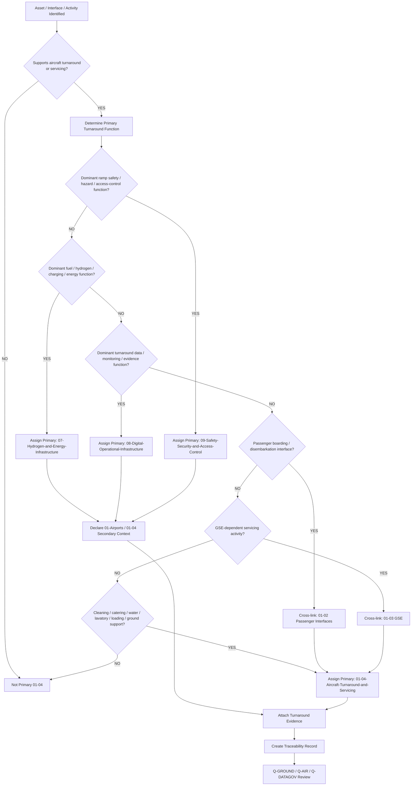
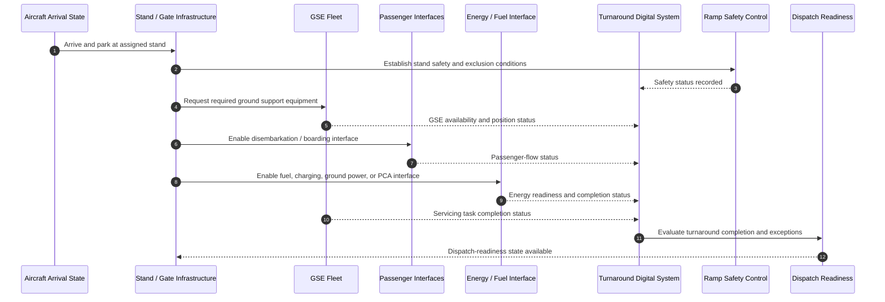
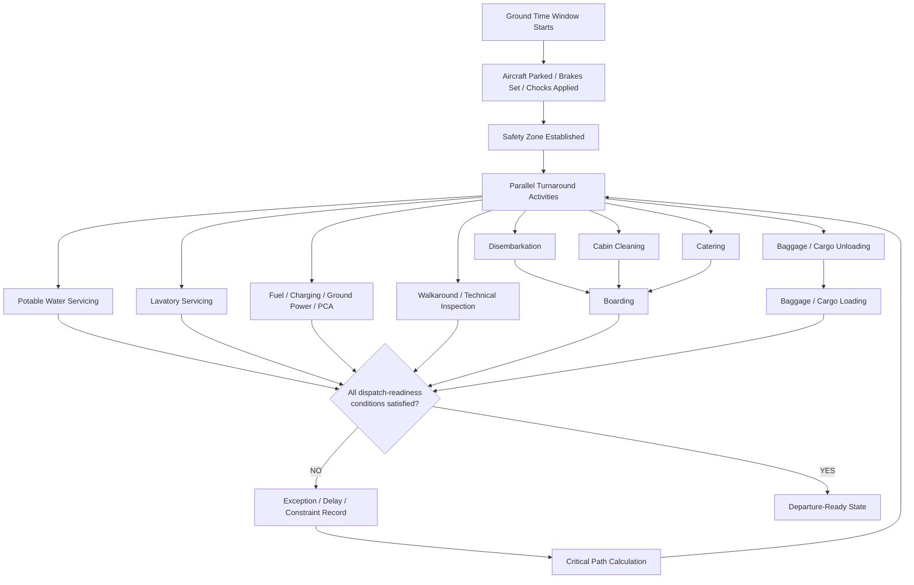
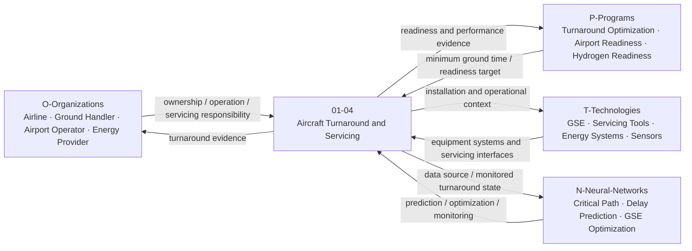
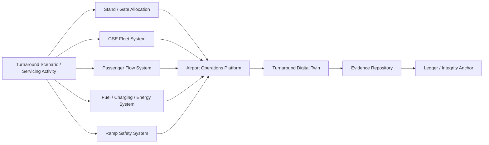

# 01-04-Aircraft-Turnaround-and-Servicing — Aircraft Turnaround and Servicing

## Purpose

Turnaround procedures, servicing protocols, and minimum ground time requirements.

This document defines the classification boundary, infrastructure scope, sequencing logic, servicing interfaces, minimum ground time evidence, lifecycle logic, and traceability model for aircraft turnaround and servicing infrastructure under:

```text
IDEALE-ESG/A-Aerospace/I-Infrastructures/01-Airports/
```

## Parent

[`README.md`](README.md) — `IDEALE-ESG/A-Aerospace/I-Infrastructures/01-Airports/`

---

# 1. Scope

`01-04-Aircraft-Turnaround-and-Servicing` covers airport-side infrastructure, interfaces, service zones, sequencing constraints, ground-support dependencies, and evidence required to support aircraft turnaround and servicing between arrival and departure.

This document covers the infrastructure classification layer.

It does not replace airline operating procedures, ground-handler work instructions, aircraft maintenance manuals, approved servicing procedures, or regulator-approved compliance packages.

It provides controlled taxonomy logic for:

- aircraft arrival-to-departure ground flow;
- minimum ground time requirements;
- turnaround sequencing;
- aircraft servicing zones;
- aircraft cleaning interfaces;
- potable-water servicing;
- lavatory servicing;
- catering servicing;
- refuelling and energy readiness interfaces;
- ground power and pre-conditioned air interfaces;
- loading and unloading interfaces;
- baggage and cargo servicing interfaces;
- passenger boarding and disembarkation coordination;
- ramp safety constraints;
- GSE dependency logic;
- dispatch-readiness infrastructure;
- turnaround digital monitoring;
- turnaround evidence and traceability.

---

# 2. Controlled Definition

For this taxonomy, **aircraft turnaround and servicing infrastructure** is:

> The airport-side physical, digital, operational, energy, safety, and support infrastructure required to transform an aircraft from arrival state to departure-ready state within a controlled ground-time window.

Turnaround and servicing infrastructure is classified primarily under:

```text
01-Airports
```

and locally under:

```text
01-04-Aircraft-Turnaround-and-Servicing
```

when its dominant function is aircraft turnaround, dispatch support, servicing coordination, or ground-time readiness.

---

# 3. Infrastructure Boundary

## 3.1 Included

This document includes:

- turnaround coordination infrastructure;
- aircraft servicing zones;
- ground-time control points;
- servicing sequence dependencies;
- GSE allocation interfaces;
- stand turnaround readiness;
- boarding and disembarkation coordination interfaces;
- cleaning and cabin servicing interfaces;
- catering service interfaces;
- potable-water servicing interfaces;
- lavatory servicing interfaces;
- baggage and cargo loading interfaces;
- fuel, charging, hydrogen, or ground-energy interfaces when turnaround-coupled;
- ground power and pre-conditioned air interfaces;
- ramp safety constraints;
- turnaround digital monitoring;
- dispatch-readiness evidence;
- minimum ground time evidence;
- turnaround traceability records.

## 3.2 Excluded

This document does not include:

- aircraft onboard system design;
- aircraft maintenance manual procedures;
- airline standard operating procedures;
- detailed ground-handler task cards;
- detailed dangerous goods procedures;
- detailed passenger handling procedures;
- detailed fuel-system engineering design;
- detailed GSE manufacturer maintenance procedures;
- detailed airport apron operating procedures;
- regulator-approved operational approvals;
- authority-approved compliance demonstration packages.

Excluded items may be cross-referenced when they support classification, applicability, effectivity, compatibility, minimum ground time, or evidence.

---

# 4. Asset and Interface Classes

| Class | Description | Primary Classification |
|---|---|---|
| Turnaround Control Point | Controlled decision point used to monitor turnaround readiness and sequencing. | `01-Airports` / `01-04` |
| Aircraft Servicing Zone | Stand or apron zone used for aircraft servicing activities. | `01-Airports` / `01-04` |
| Ground-Time Window | Controlled time interval between arrival and departure readiness. | `01-Airports` / `01-04` |
| Passenger Disembarkation Interface | Infrastructure interface supporting passenger exit from aircraft. | `01-02` with secondary `01-04` |
| Passenger Boarding Interface | Infrastructure interface supporting passenger boarding into aircraft. | `01-02` with secondary `01-04` |
| Baggage Loading Interface | Interface supporting baggage unloading and loading. | `01-03` / `01-04` |
| Cargo Loading Interface | Interface supporting cargo or ULD loading and unloading. | `01-03` / `01-04` |
| Ground Power Interface | Interface supplying electrical power during turnaround. | `01-03` / `07` with secondary `01-04` |
| Pre-Conditioned Air Interface | Interface supplying conditioned air during turnaround. | `01-03` / `01-04` |
| Potable Water Servicing Interface | Interface used for aircraft potable-water servicing. | `01-03` / `01-04` |
| Lavatory Servicing Interface | Interface used for aircraft waste-system servicing. | `01-03` / `01-04` |
| Catering Interface | Interface supporting aircraft catering exchange. | `01-03` / `01-04` |
| Cabin Cleaning Interface | Interface supporting aircraft cleaning and cabin reset. | `01-04` |
| Refuelling Interface | Interface supporting fuel, hydrogen, LH2, or charging operations. | `07-Hydrogen-and-Energy-Infrastructure` with secondary `01-04` |
| Turnaround Digital System | System monitoring, sequencing, optimizing, or recording turnaround state. | `08-Digital-Operational-Infrastructure` with secondary `01-04` |
| Ramp Safety Control | Safety zone, hazard control, exclusion zone, or emergency-isolation interface. | `09-Safety-Security-and-Access-Control` with secondary `01-04` |
| Dispatch-Readiness Evidence Package | Evidence package supporting aircraft departure readiness from airport-side perspective. | `01-Airports` / `08-Digital-Operational-Infrastructure` |

---

# 5. Classification Rules

## RULE-I-INFRA-AIR-TAS-001 — Turnaround Function Rule

An asset, interface, or record shall be classified under `01-04-Aircraft-Turnaround-and-Servicing` when its primary function is to support arrival-to-departure transition, servicing coordination, minimum ground time, dispatch readiness, or turnaround sequencing.

## RULE-I-INFRA-AIR-TAS-002 — Servicing Interface Rule

A servicing interface shall be classified under `01-04` when its dominant function is to enable a turnaround servicing activity.

Servicing activities may include:

- cabin cleaning;
- catering;
- potable-water servicing;
- lavatory servicing;
- ground power;
- pre-conditioned air;
- baggage loading;
- cargo loading;
- passenger boarding coordination;
- passenger disembarkation coordination;
- aircraft exterior inspection access;
- refuelling or energy readiness coordination.

## RULE-I-INFRA-AIR-TAS-003 — Minimum Ground Time Rule

Minimum ground time shall be treated as an infrastructure-readiness and sequencing constraint.

Minimum ground time records shall identify:

1. aircraft or programme context;
2. stand or gate context;
3. required turnaround activities;
4. parallelizable activities;
5. critical-path activities;
6. safety constraints;
7. energy or refuelling constraints;
8. passenger-interface constraints;
9. GSE availability constraints;
10. dispatch-readiness criteria.

## RULE-I-INFRA-AIR-TAS-004 — Critical Path Rule

Turnaround classification shall identify the critical path when the asset or process affects minimum ground time.

Critical path may be driven by:

- passenger disembarkation;
- baggage unloading;
- cargo unloading;
- refuelling or charging;
- LH2 or hydrogen safety zone control;
- cleaning;
- catering;
- potable-water servicing;
- lavatory servicing;
- boarding;
- baggage loading;
- cargo loading;
- technical inspection;
- dispatch release;
- gate or stand availability.

## RULE-I-INFRA-AIR-TAS-005 — GSE Dependency Rule

Any turnaround asset or servicing interface dependent on GSE shall cross-link to:

```text
01-03-Ground-Support-Equipment-GSE
```

GSE dependencies may include:

- pushback tractor;
- towbar;
- GPU;
- PCA unit;
- belt loader;
- cargo loader;
- baggage tractor;
- catering truck;
- lavatory service vehicle;
- potable-water service vehicle;
- passenger stairs;
- de-icing vehicle.

## RULE-I-INFRA-AIR-TAS-006 — Passenger Interface Dependency Rule

Turnaround assets affecting boarding, disembarkation, passenger flow, jetways, gates, bus boarding, passenger stairs, or remote stand access shall cross-link to:

```text
01-02-Terminals-Gates-and-Passenger-Interfaces
```

## RULE-I-INFRA-AIR-TAS-007 — Energy Interface Override Rule

If a turnaround asset primarily stores, transfers, meters, isolates, delivers, or controls fuel, hydrogen, LH2, electrical charging, or ground energy, it shall be classified under:

```text
07-Hydrogen-and-Energy-Infrastructure
```

with secondary classification to:

```text
01-Airports
```

and local turnaround relation to:

```text
01-04-Aircraft-Turnaround-and-Servicing
```

## RULE-I-INFRA-AIR-TAS-008 — Digital Turnaround Rule

If an asset primarily manages turnaround data, task sequencing, dispatch monitoring, GSE allocation, passenger-flow integration, energy readiness, or turnaround evidence, it shall be classified under:

```text
08-Digital-Operational-Infrastructure
```

with secondary classification to:

```text
01-Airports
```

and local turnaround relation to:

```text
01-04-Aircraft-Turnaround-and-Servicing
```

## RULE-I-INFRA-AIR-TAS-009 — Safety Override Rule

If a turnaround asset primarily provides ramp safety, hazard zoning, exclusion control, emergency isolation, access control, fire safety, fuel safety, hydrogen safety, or collision prevention, it shall be classified under:

```text
09-Safety-Security-and-Access-Control
```

with secondary classification to:

```text
01-Airports
```

and local turnaround relation to:

```text
01-04-Aircraft-Turnaround-and-Servicing
```

## RULE-I-INFRA-AIR-TAS-010 — Servicing Protocol Evidence Rule

Servicing protocols shall be represented as controlled infrastructure interface requirements, not as executable work instructions, unless a programme-specific approved procedure is explicitly invoked.

Each servicing protocol record shall identify:

1. servicing activity;
2. infrastructure interface;
3. required GSE or equipment;
4. safety constraints;
5. energy constraints;
6. aircraft-interface compatibility;
7. evidence requirements;
8. responsible organization;
9. lifecycle phase;
10. traceability record.

## RULE-I-INFRA-AIR-TAS-011 — Dispatch-Readiness Evidence Rule

A turnaround or servicing record shall not claim dispatch readiness unless evidence exists for all required infrastructure-side readiness conditions.

Minimum readiness evidence:

- stand readiness;
- GSE availability;
- energy or fuel readiness;
- passenger-interface readiness;
- baggage or cargo readiness;
- servicing completion status;
- safety-zone clearance;
- digital turnaround record;
- exception status;
- release or handoff decision.

---

# 6. Turnaround Logic

## 6.1 Turnaround Classification Flow



## 6.2 Turnaround Sequence Diagram



## 6.3 Minimum Ground Time Logic



## 6.4 Rule Priority Logic

```yaml
aircraft_turnaround_classification_logic:
  scope_gate:
    condition: "asset.domain == 'A-Aerospace' and asset.airport_context == true and asset.supports_turnaround_or_servicing == true"
    result_if_false: "not_primary_01_04"

  override_priority:
    - priority: 1
      condition: "asset.primary_function in ['ramp_safety', 'hazard_zoning', 'emergency_isolation', 'fire_safety', 'access_control', 'collision_prevention']"
      primary_result: "09-Safety-Security-and-Access-Control"
      secondary_result: "01-Airports"
      local_relation: "01-04-Aircraft-Turnaround-and-Servicing"

    - priority: 2
      condition: "asset.primary_function in ['fuel_delivery', 'hydrogen_refuelling', 'LH2_transfer', 'charging', 'ground_power_delivery', 'energy_isolation']"
      primary_result: "07-Hydrogen-and-Energy-Infrastructure"
      secondary_result: "01-Airports"
      local_relation: "01-04-Aircraft-Turnaround-and-Servicing"

    - priority: 3
      condition: "asset.primary_function in ['turnaround_data', 'task_sequence_monitoring', 'dispatch_readiness_record', 'GSE_allocation', 'digital_twin', 'evidence_repository']"
      primary_result: "08-Digital-Operational-Infrastructure"
      secondary_result: "01-Airports"
      local_relation: "01-04-Aircraft-Turnaround-and-Servicing"

    - priority: 4
      condition: "asset.primary_function in ['boarding', 'disembarkation', 'gate_flow', 'passenger_bus_interface', 'jetway_coordination']"
      primary_result: "01-Airports"
      local_node: "01-02-Terminals-Gates-and-Passenger-Interfaces"
      secondary_relation: "01-04-Aircraft-Turnaround-and-Servicing"

    - priority: 5
      condition: "asset.primary_function in ['towing', 'pushback', 'loading', 'unloading', 'ground_power_unit', 'pre_conditioned_air', 'servicing_vehicle']"
      primary_result: "01-Airports"
      local_node: "01-03-Ground-Support-Equipment-GSE"
      secondary_relation: "01-04-Aircraft-Turnaround-and-Servicing"

    - priority: 6
      condition: "asset.primary_function in ['cleaning', 'catering_coordination', 'water_servicing', 'lavatory_servicing', 'turnaround_coordination', 'minimum_ground_time_control']"
      primary_result: "01-Airports"
      local_node: "01-04-Aircraft-Turnaround-and-Servicing"

  evidence_required:
    - asset_id
    - asset_name
    - turnaround_activity
    - servicing_interface
    - minimum_ground_time_impact
    - critical_path_relevance
    - GSE_dependency
    - passenger_interface_dependency
    - energy_dependency
    - safety_constraints
    - lifecycle_phase
    - dispatch_readiness_evidence
    - traceability_record
```

---

# 7. Turnaround Record

Each controlled turnaround scenario, servicing interface, or minimum ground time model should be expressible using the following record.

```yaml
turnaround_record:
  turnaround_id: ""
  aircraft_context: ""
  airport_id: ""
  stand_id: ""
  gate_id: ""
  operation_type: ""
  aircraft_configuration: ""

  classification:
    domain: "A-Aerospace"
    opt_in_axis: "I-Infrastructures"
    section: "01-Airports"
    local_node: "01-04-Aircraft-Turnaround-and-Servicing"
    primary_classification: ""
    secondary_classifications:
      - ""

  ground_time:
    target_ground_time: ""
    minimum_ground_time: ""
    scheduled_ground_time: ""
    actual_ground_time: ""
    critical_path_activity: ""
    buffer_time: ""

  activity_set:
    required_activities:
      - activity_id: ""
        activity_name: ""
        required: true
        parallelizable: true
        estimated_duration: ""
        predecessor:
          - ""
        successor:
          - ""

  dependencies:
    GSE:
      - ""
    passenger_interfaces:
      - ""
    energy_interfaces:
      - ""
    safety_interfaces:
      - ""
    digital_interfaces:
      - ""

  readiness:
    dispatch_readiness_criteria:
      - ""
    exception_conditions:
      - ""

  lifecycle:
    lifecycle_phase: ""
    maturity_state: ""
    governance_status: "controlled-candidate"

  applicability:
    applies_to:
      - ""
    does_not_apply_to:
      - ""

  effectivity:
    aircraft_effectivity: ""
    airport_effectivity: ""
    stand_effectivity: ""
    configuration_effectivity: ""
    temporal_effectivity: ""
    jurisdiction_effectivity: ""
    digital_effectivity: ""

  evidence:
    evidence_items:
      - evidence_id: ""
        evidence_class: ""
        evidence_status: ""

  traceability:
    upstream:
      - ""
    downstream:
      - ""
```

---

# 8. Servicing Protocol Record

Servicing protocols shall be represented as controlled infrastructure interface records.

```yaml
servicing_protocol_record:
  protocol_id: ""
  protocol_title: ""
  servicing_activity: ""
  airport_context: ""
  stand_or_gate_context: ""

  infrastructure_interface:
    interface_type: ""
    local_node: "01-04-Aircraft-Turnaround-and-Servicing"
    related_nodes:
      - "01-03-Ground-Support-Equipment-GSE"
      - "01-05-Fuel-and-Hydrogen-Readiness"
      - "09-Safety-Security-and-Access-Control"

  required_equipment:
    - equipment_id: ""
      equipment_type: ""
      GSE_required: true

  aircraft_interface:
    interface_required: true
    aircraft_zone: ""
    connector_or_service_panel: ""
    compatibility_requirement: ""

  safety_constraints:
    exclusion_zone_required: false
    energy_isolation_required: false
    emergency_stop_required: false
    human_supervision_required: true

  sequence_constraints:
    predecessor_activities:
      - ""
    successor_activities:
      - ""
    can_run_in_parallel_with:
      - ""
    cannot_run_in_parallel_with:
      - ""

  evidence:
    evidence_required:
      - evidence_class: ""
        evidence_description: ""

  governance:
    owner: "Q-GROUND"
    reviewer: ""
    approval_status: "controlled-candidate"
```

---

# 9. Minimum Ground Time Model

## 9.1 Minimum Ground Time Components

Minimum ground time shall be modeled as a controlled readiness constraint.

```yaml
minimum_ground_time_model:
  model_id: ""
  aircraft_context: ""
  airport_context: ""
  stand_context: ""

  time_components:
    arrival_stabilization: ""
    safety_setup: ""
    passenger_disembarkation: ""
    baggage_unloading: ""
    cargo_unloading: ""
    cleaning: ""
    catering: ""
    potable_water_servicing: ""
    lavatory_servicing: ""
    energy_or_refuelling: ""
    technical_inspection: ""
    boarding: ""
    baggage_loading: ""
    cargo_loading: ""
    dispatch_release: ""
    pushback_preparation: ""

  parallelization:
    parallel_groups:
      - group_id: ""
        activities:
          - ""
    prohibited_parallel_activities:
      - activity_pair:
          - ""
          - ""
        reason: ""

  critical_path:
    activities:
      - ""
    total_duration: ""
    constraint_driver: ""

  output:
    minimum_ground_time: ""
    confidence_level: ""
    assumptions:
      - ""
    limitations:
      - ""
```

## 9.2 Minimum Ground Time Formula Representation

```text
Minimum Ground Time = max(parallel activity paths) + mandatory serial constraints + readiness buffer
```

## 9.3 Minimum Ground Time Rule

Minimum ground time shall not be declared as a generic aircraft constant unless the effectivity is explicitly defined.

Required effectivity may include:

- aircraft type;
- aircraft configuration;
- passenger load assumption;
- baggage/cargo load assumption;
- airport;
- stand or gate;
- GSE availability;
- refuelling or charging mode;
- weather or environmental constraints;
- safety constraints;
- passenger-interface configuration;
- digital monitoring baseline.

---

# 10. Interfaces with OPT-IN Axes

| OPT-IN Axis | Interface with Aircraft Turnaround and Servicing |
|---|---|
| `O-Organizations` | Airport operator, airline, ground handler, fuel provider, energy provider, catering provider, cleaning provider, maintenance provider, safety authority, regulator. |
| `P-Programs` | Airport compatibility programme, turnaround optimization programme, hydrogen-readiness programme, eGSE transition programme, minimum ground time campaign. |
| `T-Technologies` | GSE, servicing equipment, charging systems, hydrogen systems, sensors, turnaround platforms, passenger systems, maintenance systems. |
| `I-Infrastructures` | Stand, apron, gate, terminal, GSE, refuelling interface, energy infrastructure, safety zones, digital systems. |
| `N-Neural-Networks` | Turnaround prediction, critical-path optimization, GSE allocation, delay prediction, passenger-flow prediction, energy-readiness prediction. |

## 10.1 OPT-IN Interface Diagram



---

# 11. Q-Division Governance

| Q-Division | Governance Role |
|---|---|
| `Q-GROUND` | Primary owner for turnaround, servicing, ramp coordination, ground-handling interfaces, GSE dependencies, minimum ground time, and dispatch-readiness infrastructure. |
| `Q-AIR` | Supports airport operational compatibility, stand/gate/apron integration, aircraft-airport compatibility, and airport readiness. |
| `Q-DATAGOV` | Controls naming, traceability, evidence records, digital thread, canonical paths, turnaround data governance, and publication readiness. |
| `Q-GREENTECH` | Supports fuel, hydrogen, LH2, charging, ground power, energy-readiness, and sustainable turnaround infrastructure. |
| `Q-MECHANICS` | Supports mechanical servicing interfaces, coupling mechanisms, access equipment, ground handling equipment, and maintainability interfaces. |
| `Q-SCIRES` | Supports verification, validation, safety evidence, turnaround feasibility, minimum ground time evidence, and certification-feasibility context. |
| `Q-HPC` | Supports turnaround simulation, critical-path optimization, fleet allocation, delay prediction, energy-demand modeling, and AI/ML analytics. |
| `Q-INDUSTRY` | Supports industrialization of servicing models, supplier interfaces, standardization of ground-support processes, and lifecycle support. |

---

# 12. Lifecycle Applicability

| Lifecycle Phase | Turnaround and Servicing Role |
|---|---|
| `LC01` | Define turnaround scope, servicing interface boundary, and minimum ground time intent. |
| `LC02` | Define turnaround requirements, servicing constraints, safety needs, GSE needs, and operational constraints. |
| `LC03` | Define turnaround architecture, servicing interfaces, sequence model, and cross-node dependencies. |
| `LC04` | Develop preliminary turnaround concepts, service-flow assumptions, and minimum ground time assumptions. |
| `LC05` | Produce detailed turnaround model, interface records, compatibility data, and implementation evidence. |
| `LC06` | Define verification, simulation, inspection, test, acceptance, and dispatch-readiness criteria. |
| `LC07` | Deploy, configure, or implement turnaround infrastructure, servicing interfaces, and digital systems. |
| `LC08` | Integrate turnaround flow with stands, gates, aprons, GSE, energy systems, passenger interfaces, and safety controls. |
| `LC09` | Commission turnaround infrastructure and establish handover evidence. |
| `LC10` | Support certification, operational approval, compatibility evidence, or authority review where applicable. |
| `LC11` | Operate aircraft turnaround and servicing infrastructure. |
| `LC12` | Maintain, inspect, repair, calibrate, and support servicing interfaces and turnaround systems. |
| `LC13` | Upgrade, optimize, electrify, automate, reconfigure, or modernize turnaround infrastructure. |
| `LC14` | Retire, archive, replace, or decommission turnaround infrastructure and records. |

---

# 13. Evidence Requirements

## 13.1 Minimum Evidence

Each controlled turnaround, servicing, or minimum ground time record shall include:

1. turnaround ID or asset ID;
2. aircraft context;
3. airport, stand, gate, or apron context;
4. servicing activity set;
5. sequencing constraints;
6. minimum ground time statement;
7. critical-path statement;
8. GSE dependency statement;
9. passenger-interface dependency statement;
10. energy-interface dependency statement;
11. safety-interface statement;
12. digital monitoring statement, if applicable;
13. dispatch-readiness criteria;
14. lifecycle phase;
15. applicability statement;
16. effectivity statement;
17. responsible Q-Division;
18. citation keys, if applicable;
19. evidence footprint;
20. traceability record.

## 13.2 Evidence Classes

| Evidence Class | Use |
|---|---|
| `classification-evidence` | Supports assignment to `01-04-Aircraft-Turnaround-and-Servicing`. |
| `turnaround-evidence` | Supports turnaround activity set, sequence, duration, and readiness logic. |
| `minimum-ground-time-evidence` | Supports minimum ground time assumptions, model, constraints, and critical path. |
| `servicing-evidence` | Supports cleaning, catering, water, lavatory, loading, unloading, energy, and ground-support activities. |
| `compatibility-evidence` | Supports aircraft, GSE, stand, gate, apron, passenger, or energy compatibility. |
| `GSE-evidence` | Supports GSE availability, allocation, readiness, maintenance, and task dependency. |
| `energy-evidence` | Supports fuel, hydrogen, LH2, charging, ground power, PCA, or energy-readiness constraints. |
| `safety-evidence` | Supports ramp safety, hazard zones, exclusion areas, emergency response, and collision prevention. |
| `operational-evidence` | Supports airport, airline, ground-handler, and servicing operations. |
| `digital-evidence` | Supports turnaround monitoring, sequencing systems, digital twin, dispatch-readiness record, and data governance. |
| `certification-evidence` | Supports regulatory, authority, programme, or airport approval context where applicable. |

## 13.3 Evidence Package Template

```yaml
turnaround_servicing_evidence_package:
  package_id: ""
  package_title: ""
  infrastructure_section: "01-Airports"
  local_node: "01-04-Aircraft-Turnaround-and-Servicing"
  turnaround_id: ""
  asset_id: ""
  aircraft_context: ""
  airport_id: ""
  stand_id: ""
  gate_id: ""
  owner: "Q-GROUND"

  supporting_q_divisions:
    - "Q-AIR"
    - "Q-DATAGOV"
    - "Q-GREENTECH"
    - "Q-MECHANICS"
    - "Q-SCIRES"

  lifecycle_phase: ""

  applicability:
    applies_to:
      - ""
    does_not_apply_to:
      - ""

  effectivity:
    aircraft_effectivity: ""
    airport_effectivity: ""
    stand_effectivity: ""
    gate_effectivity: ""
    configuration_effectivity: ""
    operational_effectivity: ""
    temporal_effectivity: ""
    jurisdiction_effectivity: ""

  ground_time:
    target_ground_time: ""
    minimum_ground_time: ""
    critical_path_activity: ""
    readiness_buffer: ""

  evidence_items:
    - evidence_id: ""
      evidence_class: ""
      title: ""
      status: ""
      repository_path: ""

  traceability:
    upstream:
      - ""
    downstream:
      - ""

  review:
    reviewer: ""
    approval_status: ""
```

---

# 14. Digital Thread

Turnaround and servicing infrastructure may interface with digital systems for ground-time monitoring, task sequencing, GSE allocation, passenger-flow integration, energy readiness, exception handling, dispatch-readiness evidence, predictive analytics, and lifecycle traceability.

Digital-thread interfaces may include:

- turnaround management platform;
- airport operational database;
- stand allocation system;
- gate management system;
- GSE fleet management system;
- passenger-flow monitoring system;
- refuelling or charging management system;
- maintenance or technical log interface;
- dispatch-readiness record;
- aircraft servicing evidence register;
- airport digital twin;
- turnaround digital twin;
- PLM or configuration record;
- evidence repository;
- ledger or integrity anchor.

## 14.1 Turnaround Digital Thread Diagram



---

# 15. Classification Examples

## 15.1 Standard Passenger Aircraft Turnaround

```yaml
turnaround:
  turnaround_id: "TAS-STD-PAX-001"
  operation_type: "passenger aircraft turnaround"
  primary_function: "arrival-to-departure readiness"
  primary_classification:
    section_code: "01"
    section_name: "Airports"
    local_node: "01-04-Aircraft-Turnaround-and-Servicing"
  dependencies:
    - "01-02-Terminals-Gates-and-Passenger-Interfaces"
    - "01-03-Ground-Support-Equipment-GSE"
    - "07-Hydrogen-and-Energy-Infrastructure"
    - "09-Safety-Security-and-Access-Control"
  evidence:
    - evidence_class: "turnaround-evidence"
    - evidence_class: "minimum-ground-time-evidence"
```

## 15.2 Cabin Cleaning Interface

```yaml
asset:
  asset_name: "Cabin Cleaning Interface"
  asset_type: "servicing interface"
  primary_function: "aircraft cabin reset during turnaround"
  primary_classification:
    section_code: "01"
    section_name: "Airports"
    local_node: "01-04-Aircraft-Turnaround-and-Servicing"
  evidence:
    - evidence_class: "servicing-evidence"
    - evidence_class: "operational-evidence"
```

## 15.3 Lavatory Servicing

```yaml
asset:
  asset_name: "Lavatory Servicing Interface"
  asset_type: "aircraft servicing interface"
  primary_function: "lavatory waste servicing during turnaround"
  primary_classification:
    section_code: "01"
    section_name: "Airports"
    local_node: "01-04-Aircraft-Turnaround-and-Servicing"
  secondary_classifications:
    - section_code: "01-03"
      section_name: "Ground Support Equipment GSE"
      relation: "Requires lavatory service vehicle"
  evidence:
    - evidence_class: "servicing-evidence"
    - evidence_class: "GSE-evidence"
```

## 15.4 Hydrogen Turnaround Energy Interface

```yaml
asset:
  asset_name: "LH2 Turnaround Refuelling Interface"
  asset_type: "hydrogen energy interface"
  physical_location: "stand"
  primary_function: "liquid hydrogen transfer and safety-controlled energy readiness"
  primary_classification:
    section_code: "07"
    section_name: "Hydrogen and Energy Infrastructure"
  secondary_classifications:
    - section_code: "01"
      section_name: "Airports"
      relation: "Airport-side turnaround interface"
    - section_code: "09"
      section_name: "Safety, Security and Access Control"
      relation: "Hydrogen hazard zoning and emergency isolation"
  local_relation: "01-04-Aircraft-Turnaround-and-Servicing"
  evidence:
    - evidence_class: "energy-evidence"
    - evidence_class: "safety-evidence"
    - evidence_class: "minimum-ground-time-evidence"
```

## 15.5 Turnaround Digital Monitoring System

```yaml
asset:
  asset_name: "Turnaround Monitoring System"
  asset_type: "digital operational system"
  primary_function: "task sequencing, exception monitoring, and dispatch-readiness evidence"
  primary_classification:
    section_code: "08"
    section_name: "Digital Operational Infrastructure"
  secondary_classifications:
    - section_code: "01"
      section_name: "Airports"
      relation: "Supports airport turnaround operations"
  local_relation: "01-04-Aircraft-Turnaround-and-Servicing"
  evidence:
    - evidence_class: "digital-evidence"
    - evidence_class: "turnaround-evidence"
```

---

# 16. Reference Map

| Citation Key | Applies To | Use in `01-04` |
|---|---|---|
| `ICAO-ANNEX14` | Aerodrome operations and airport infrastructure context | Baseline international aerodrome reference family for airport-side turnaround context. |
| `EASA-ADR` | EU aerodrome governance | EU aerodrome regulatory and administrative reference family. |
| `FAA-PART-139` | US airport certification | US airport certification and operational safety reference family. |
| `IATA-AHM` | Airport handling | Airport handling and GSE operational context reference family. |
| `IATA-IGOM` | Ground operations | Ground operations and standardized servicing context reference family. |
| `SAE-GSE` | Ground support equipment | GSE technical and interface reference family. |
| `ISO-55000` | Asset management | Turnaround and servicing infrastructure lifecycle reference family. |
| `ISO-31000` | Risk management | Ramp safety, service hazard, emergency-response, and operational risk reference family. |
| `ISO-9001` | Quality management | General QMS reference family for controlled records and infrastructure processes. |
| `IAQG-9100` | Aerospace QMS | Aviation, space, and defense QMS governance reference family. |
| `IEC-61851` | Electric charging | Electric charging interface context for eGSE or electric turnaround equipment. |
| `ISO-19880-1` | Hydrogen fuelling | Hydrogen fuelling-station reference family; programme-specific assessment required for aerospace hydrogen turnaround. |
| `NFPA-2` | Hydrogen safety | Hydrogen safety, storage, handling, and emergency-response reference family. |
| `S1000D` | Technical publications | CSDB/IETP reference family for controlled publication-ready turnaround and servicing data. |

---

# 17. Controlled References

## [ICAO-ANNEX14]

**ICAO Annex 14 — Aerodromes, Volume I, Aerodrome Design and Operations.**

Used as the international airport and aerodrome reference family for airport infrastructure and turnaround operating context.

## [EASA-ADR]

**EASA Easy Access Rules for Aerodromes — Regulation (EU) No 139/2014.**

Used as the EU aerodrome regulatory reference family for airport infrastructure governance, aerodrome certification context, administrative procedures, and operational requirements.

## [FAA-PART-139]

**14 CFR Part 139 — Certification of Airports.**

Used as the US airport certification reference family for airport infrastructure, airport safety, and jurisdiction-specific applicability.

## [IATA-AHM]

**IATA Airport Handling Manual.**

Used as a ground-handling reference family for airport handling processes, GSE operational context, turnaround interfaces, and service classification.

## [IATA-IGOM]

**IATA Ground Operations Manual.**

Used as a ground-operations reference family for standardized ground operation and aircraft servicing context.

## [SAE-GSE]

**SAE Ground Support Equipment Standards.**

Used as a GSE technical reference family for ground-support equipment, aircraft servicing interfaces, and compatibility context.

## [ISO-55000]

**ISO 55000 — Asset Management, Vocabulary, Overview and Principles.**

Used as the asset-management reference family for turnaround and servicing infrastructure lifecycle, asset value, and controlled asset management.

## [ISO-31000]

**ISO 31000 — Risk Management Guidelines.**

Used as the risk-management reference family for ramp hazards, service risks, operational safety, emergency response, and safety governance.

## [ISO-9001]

**ISO 9001 — Quality Management Systems Requirements.**

Used as the general quality-management reference family for process governance, review, improvement, audit, and controlled records.

## [IAQG-9100]

**IAQG 9100 — Quality Management Systems Requirements for Aviation, Space and Defense Organizations.**

Used as the aerospace quality-management reference family for aviation, space, defense, supplier, maintenance, production, and lifecycle governance.

## [IEC-61851]

**IEC 61851 — Electric Vehicle Conductive Charging System.**

Used as an electric charging reference family for eGSE or electric turnaround equipment charging-interface context when applicable.

## [ISO-19880-1]

**ISO 19880-1 — Gaseous Hydrogen Fuelling Stations.**

Used as the hydrogen fuelling-station reference family for hydrogen-powered aircraft or hydrogen GSE turnaround context. Programme-specific assessment is required for airport and aerospace applications.

## [NFPA-2]

**NFPA 2 — Hydrogen Technologies Code.**

Used as the hydrogen safety-code reference family for hydrogen storage, handling, installation, safety control, and emergency-response evidence.

## [S1000D]

**S1000D — International Specification for Technical Publications Using a Common Source Database.**

Used as the technical-publication and CSDB reference family when aircraft turnaround or servicing infrastructure documentation requires controlled data modules, applicability, effectivity, publication readiness, or IETP integration.

---

# 18. Traceability Record

```yaml
turnaround_servicing_traceability_record:
  document_id: "IDEALE-ESG-A-AEROSPACE-I-INFRASTRUCTURES-01-04-AIRCRAFT-TURNAROUND-AND-SERVICING"
  canonical_path: "IDEALE-ESG/A-Aerospace/I-Infrastructures/01-Airports/01-04-Aircraft-Turnaround-and-Servicing.md"
  parent_path: "IDEALE-ESG/A-Aerospace/I-Infrastructures/01-Airports/"
  upstream:
    - "IDEALE-ESG-A-AEROSPACE-I-INFRASTRUCTURES-01-00-AIRPORTS-GENERAL"
    - "IDEALE-ESG-A-AEROSPACE-I-INFRASTRUCTURES-01-02-TERMINALS-GATES-AND-PASSENGER-INTERFACES"
    - "IDEALE-ESG-A-AEROSPACE-I-INFRASTRUCTURES-01-03-GROUND-SUPPORT-EQUIPMENT-GSE"
    - "IDEALE-ESG-A-AEROSPACE-I-INFRASTRUCTURES-00-02-INFRASTRUCTURE-CLASSIFICATION-RULES"
    - "IDEALE-ESG-A-AEROSPACE-I-INFRASTRUCTURES-00-04-APPLICABILITY-AND-EFFECTIVITY"
    - "IDEALE-ESG-A-AEROSPACE-I-INFRASTRUCTURES-00-06-INTERFACES-WITH-OPTIN-AXES"
    - "IDEALE-ESG-A-AEROSPACE-I-INFRASTRUCTURES-00-07-TRACEABILITY-AND-EVIDENCE"
    - "IDEALE-ESG-A-AEROSPACE-I-INFRASTRUCTURES-00-08-NAMING-CONVENTIONS"
  downstream:
    - "01-05-Fuel-and-Hydrogen-Readiness"
    - "01-06-Airport-Safety-and-Emergency-Response"
    - "01-07-Airport-Digital-Operations"
    - "01-08-Airport-Compatibility-and-Certification"
    - "01-09-Traceability-Governance-and-Evidence"
    - "07-Hydrogen-and-Energy-Infrastructure"
    - "08-Digital-Operational-Infrastructure"
    - "09-Safety-Security-and-Access-Control"
```

---

# 19. Footprints

## Semantic Footprint

```yaml
semantic_footprint:
  id: FP-SEM-I-INFRA-01-04
  subject: "Aircraft turnaround, servicing, protocol interface, and minimum ground time classification"
  meaning_boundary:
    includes:
      - aircraft turnaround
      - servicing interfaces
      - minimum ground time
      - turnaround sequencing
      - dispatch-readiness infrastructure
      - GSE dependencies
      - passenger-interface dependencies
      - fuel and energy dependencies
      - safety constraints
      - digital turnaround monitoring
      - turnaround evidence
    excludes:
      - airline operating procedures
      - detailed ground-handler task cards
      - aircraft maintenance manual procedures
      - detailed aircraft system design
      - detailed GSE manufacturer procedures
      - authority-approved compliance demonstration
```

## Taxonomy Footprint

```yaml
taxonomy_footprint:
  id: FP-TAX-I-INFRA-01-04
  hierarchy:
    root: "IDEALE-ESG"
    domain: "A-Aerospace"
    opt_in_axis: "I-Infrastructures"
    section: "01-Airports"
    document: "01-04-Aircraft-Turnaround-and-Servicing"
```

## Lifecycle Footprint

```yaml
lifecycle_footprint:
  id: FP-LC-I-INFRA-01-04
  lifecycle_phase: "LC01"
  lifecycle_role: "Defines aircraft turnaround, servicing, sequencing, and minimum ground time infrastructure scope"
  exit_criteria:
    - turnaround scope defined
    - servicing interface classes defined
    - classification rules defined
    - override logic defined
    - minimum ground time model defined
    - critical-path logic defined
    - evidence requirements defined
    - digital-thread interfaces mapped
    - reference families mapped
```

## Compliance Footprint

```yaml
compliance_footprint:
  id: FP-COMP-I-INFRA-01-04
  reference_families:
    aerodromes:
      - "ICAO-ANNEX14"
      - "EASA-ADR"
      - "FAA-PART-139"
    ground_handling:
      - "IATA-AHM"
      - "IATA-IGOM"
      - "SAE-GSE"
    asset_management:
      - "ISO-55000"
    risk_management:
      - "ISO-31000"
    quality_management:
      - "ISO-9001"
      - "IAQG-9100"
    electrification:
      - "IEC-61851"
    hydrogen_and_energy:
      - "ISO-19880-1"
      - "NFPA-2"
    technical_publications:
      - "S1000D"
```

## Evidence Footprint

```yaml
evidence_footprint:
  id: FP-EVD-I-INFRA-01-04
  expected_evidence:
    - controlled markdown document
    - YAML frontmatter
    - canonical path
    - parent path
    - turnaround classes
    - classification rules
    - classification logic diagrams
    - turnaround sequence diagram
    - minimum ground time model
    - servicing protocol record template
    - turnaround evidence package template
    - digital-thread diagram
    - reference map
    - traceability record
```

---

# 20. Governance Rule

Any child or derivative record under `01-04-Aircraft-Turnaround-and-Servicing` shall declare:

1. turnaround or servicing asset type;
2. airport, stand, gate, apron, or aircraft context;
3. servicing activity;
4. minimum ground time impact;
5. critical-path relevance;
6. GSE dependency;
7. passenger-interface dependency;
8. energy-interface dependency;
9. safety-interface dependency;
10. digital monitoring dependency, if applicable;
11. primary classification;
12. secondary classifications, if applicable;
13. applicability;
14. effectivity, when required;
15. lifecycle phase;
16. responsible Q-Division;
17. evidence footprint;
18. traceability record.

No turnaround, servicing, protocol, or minimum ground time document shall claim regulatory, operational, dispatch, aircraft-compatibility, energy, or safety compliance solely because it references ICAO, EASA, FAA, IATA, SAE, ISO, IEC, IAQG, NFPA, or S1000D material.

Compliance requires programme-specific, jurisdiction-specific, operator-specific, and authority-accepted evidence.

---

# 21. Acceptance Criteria

This document is acceptable when:

- aircraft turnaround and servicing scope is defined;
- included and excluded boundaries are stated;
- servicing interface classes are listed;
- classification rules are present;
- override logic is defined;
- classification diagrams are included;
- turnaround sequence diagram is included;
- minimum ground time model is defined;
- critical-path logic is included;
- servicing protocol record is provided;
- evidence requirements are defined;
- digital-thread interfaces are mapped;
- Q-Division responsibilities are declared;
- reference families are mapped;
- traceability records are provided;
- downstream airport documents can reuse the structure without reinterpretation.

---

# 22. Summary

`01-04-Aircraft-Turnaround-and-Servicing` defines the controlled taxonomy scope for aircraft turnaround and servicing infrastructure within airport operations.

It covers arrival-to-departure readiness, servicing interfaces, minimum ground time, critical path, GSE dependencies, passenger-interface dependencies, fuel and energy readiness, ramp safety, digital turnaround monitoring, dispatch-readiness evidence, lifecycle governance, and traceability under `01-Airports`.
````
