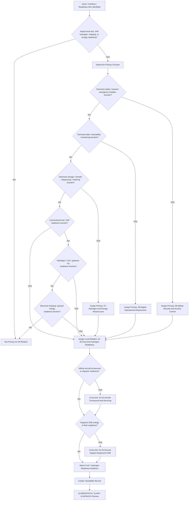
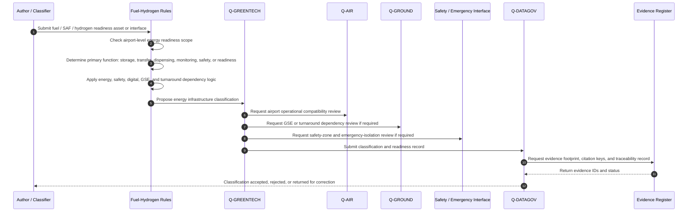
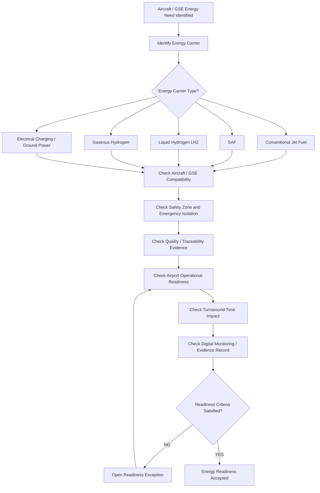
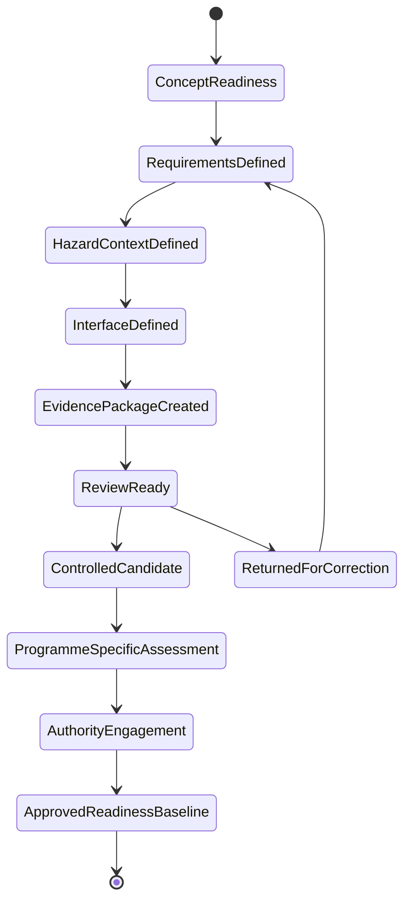
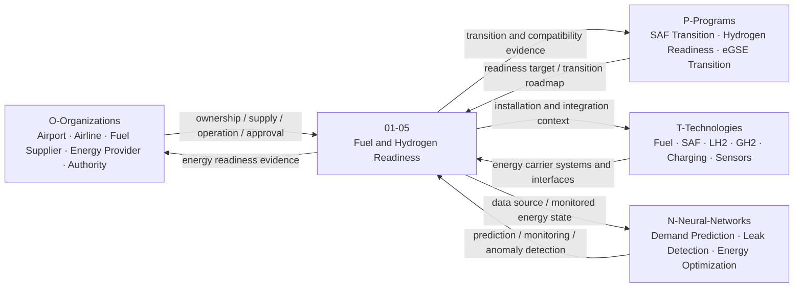
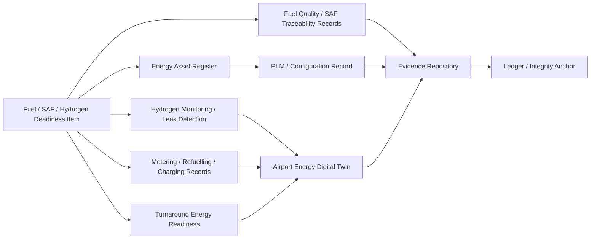

# 01-05-Fuel-and-Hydrogen-Readiness — Fuel and Hydrogen Readiness

## Purpose

Conventional fuel, SAF, and hydrogen dispensing infrastructure at airport level.

This document defines the classification boundary, airport-level readiness logic, infrastructure scope, fuel and hydrogen interfaces, safety dependencies, lifecycle evidence, and traceability model for conventional fuel, SAF, and hydrogen dispensing infrastructure under:

```text
IDEALE-ESG/A-Aerospace/I-Infrastructures/01-Airports/
```

## Parent

[`README.md`](README.md) — `IDEALE-ESG/A-Aerospace/I-Infrastructures/01-Airports/`

---

# 1. Scope

`01-05-Fuel-and-Hydrogen-Readiness` covers airport-level infrastructure, interfaces, readiness requirements, safety dependencies, compatibility constraints, and evidence needed to support conventional aviation fuel, SAF, hydrogen, LH2, gaseous hydrogen, electrical charging, and future energy-carrier dispensing operations in airport environments.

This document covers the infrastructure classification layer.

It does not replace fuel-system engineering design, fuel-quality manuals, aircraft refuelling procedures, airport fuel-farm operating procedures, hydrogen safety case approvals, or authority-approved compliance packages.

It provides controlled taxonomy logic for:

- conventional aviation fuel readiness;
- SAF readiness;
- airport fuel storage interfaces;
- airport fuel hydrant interface context;
- refuelling truck interface context;
- aircraft stand refuelling interfaces;
- hydrogen airport-readiness infrastructure;
- LH2 storage and conditioning interface context;
- gaseous hydrogen interface context;
- hydrogen dispensing and transfer readiness;
- fuel-cell and hydrogen-powered GSE support;
- electric charging interfaces when airport-energy coupled;
- ground energy readiness;
- fuel quality and traceability evidence;
- hydrogen safety zones;
- emergency isolation interfaces;
- airport operational compatibility;
- turnaround energy-readiness evidence;
- digital energy monitoring;
- sustainability and transition-readiness evidence.

---

# 2. Controlled Definition

For this taxonomy, **fuel and hydrogen readiness** is:

> The airport-level capability to safely receive, store, manage, condition, transfer, dispense, monitor, isolate, and evidence aviation energy carriers required for aircraft and airport ground operations.

This includes conventional fuel, SAF, hydrogen, LH2, gaseous hydrogen, electrical charging, and related future airport-energy interfaces when they support aircraft operation, aircraft turnaround, GSE operation, airport compatibility, or infrastructure readiness.

---

# 3. Infrastructure Boundary

## 3.1 Included

This document includes:

- conventional aviation fuel readiness;
- SAF readiness;
- airport fuel storage interface context;
- fuel distribution and dispensing interface context;
- fuel hydrant and refuelling-truck interface context;
- aircraft stand refuelling compatibility;
- hydrogen dispensing infrastructure at airport level;
- LH2 storage, transfer, conditioning, venting, and dispensing readiness;
- gaseous hydrogen refuelling context;
- hydrogen safety-zone and emergency-response interfaces;
- electric charging interfaces when connected to airport energy readiness;
- eGSE charging readiness when operationally linked to airport energy transition;
- energy-readiness support for aircraft turnaround;
- fuel and hydrogen quality evidence;
- fuel and hydrogen traceability records;
- airport compatibility records;
- energy safety evidence;
- digital monitoring and energy data interfaces.

## 3.2 Excluded

This document does not include:

- aircraft onboard fuel-system design;
- aircraft hydrogen tank design;
- aircraft propulsion system design;
- detailed fuel-farm civil engineering design;
- detailed fuel-quality laboratory procedures;
- detailed fuel-distribution operating procedures;
- detailed hazardous-area engineering design;
- detailed cryogenic equipment manufacturer design;
- detailed hydrogen safety case approval;
- detailed energy-market procurement;
- regulator-approved compliance demonstration packages.

Excluded items may be cross-referenced when they support classification, applicability, effectivity, safety, compatibility, or evidence.

---

# 4. Asset and Interface Classes

| Class | Description | Primary Classification |
|---|---|---|
| Conventional Fuel Readiness Interface | Airport-side capability to support conventional aviation fuel receipt, storage, transfer, and dispensing. | `07-Hydrogen-and-Energy-Infrastructure` with secondary `01-Airports` |
| SAF Readiness Interface | Airport-side capability to receive, store, trace, blend, segregate, or dispense SAF-compatible fuel streams. | `07-Hydrogen-and-Energy-Infrastructure` with secondary `01-Airports` |
| Fuel Farm Interface | Storage and distribution interface supporting airport fuel supply. | `07-Hydrogen-and-Energy-Infrastructure` |
| Hydrant Refuelling Interface | Fixed airport refuelling interface at apron, stand, or hydrant system level. | `07-Hydrogen-and-Energy-Infrastructure` with secondary `01-Airports` |
| Refuelling Vehicle Interface | Mobile refuelling-truck or bowser interface supporting aircraft fuelling. | `01-03-Ground-Support-Equipment-GSE` / `07` depending on dominant function |
| Aircraft Stand Refuelling Interface | Stand-level infrastructure enabling aircraft fuel or hydrogen readiness during turnaround. | `01-Airports` with local relation `01-05`; `07` when energy dominant |
| LH2 Storage Interface | Liquid hydrogen storage, conditioning, isolation, venting, or transfer interface. | `07-Hydrogen-and-Energy-Infrastructure` |
| LH2 Dispensing Interface | Interface enabling controlled LH2 delivery to aircraft or ground systems. | `07-Hydrogen-and-Energy-Infrastructure` with secondary `01-Airports` |
| Gaseous Hydrogen Interface | Compressed hydrogen storage, transfer, or dispensing interface. | `07-Hydrogen-and-Energy-Infrastructure` |
| Hydrogen Safety Zone | Hazard zone, exclusion area, emergency isolation area, or controlled hydrogen safety perimeter. | `09-Safety-Security-and-Access-Control` with secondary `07` and `01` |
| eGSE Charging Interface | Electrical charging interface for electric GSE fleets. | `07-Hydrogen-and-Energy-Infrastructure` with secondary `01-03` |
| Energy Monitoring System | Digital system monitoring fuel, SAF, hydrogen, charging, or ground energy readiness. | `08-Digital-Operational-Infrastructure` with secondary `07` and `01` |
| Fuel Quality Evidence Record | Controlled evidence supporting fuel quality, traceability, source, blend, or release status. | `08-Digital-Operational-Infrastructure` / `07` |
| Energy Readiness Package | Evidence package supporting airport energy readiness for aircraft operation or turnaround. | `07-Hydrogen-and-Energy-Infrastructure` / `01-Airports` |

---

# 5. Classification Rules

## RULE-I-INFRA-AIR-FHR-001 — Airport Energy Readiness Rule

An asset, interface, record, or readiness package shall be linked to `01-05-Fuel-and-Hydrogen-Readiness` when it supports airport-level conventional fuel, SAF, hydrogen, LH2, gaseous hydrogen, electrical charging, ground energy, or future aircraft-energy readiness.

## RULE-I-INFRA-AIR-FHR-002 — Energy Primary Classification Rule

If an asset primarily stores, transfers, conditions, meters, isolates, dispenses, or controls fuel, SAF, hydrogen, LH2, gaseous hydrogen, electricity, or ground energy, its primary classification shall be:

```text
07-Hydrogen-and-Energy-Infrastructure
```

with secondary relation to:

```text
01-Airports
```

and local relation to:

```text
01-05-Fuel-and-Hydrogen-Readiness
```

## RULE-I-INFRA-AIR-FHR-003 — Airport Context Rule

If the asset primarily supports airport operational readiness, stand readiness, aircraft turnaround readiness, refuelling coordination, airport compatibility, or aircraft ground servicing, it may remain under:

```text
01-Airports
```

with local node:

```text
01-05-Fuel-and-Hydrogen-Readiness
```

when energy delivery is not the dominant technical function.

## RULE-I-INFRA-AIR-FHR-004 — Conventional Fuel Readiness Rule

Conventional aviation fuel readiness shall identify:

1. airport supply interface;
2. storage or receiving context;
3. dispensing context;
4. aircraft interface;
5. quality evidence;
6. contamination-control evidence;
7. traceability evidence;
8. emergency response context;
9. applicable jurisdiction;
10. operational limitations.

## RULE-I-INFRA-AIR-FHR-005 — SAF Readiness Rule

SAF readiness shall identify:

1. accepted fuel pathway or reference family;
2. fuel specification context;
3. blend or segregation logic, if applicable;
4. chain-of-custody evidence;
5. sustainability evidence, if applicable;
6. storage compatibility context;
7. dispensing compatibility context;
8. aircraft or operator applicability;
9. airport operational limitations;
10. traceability evidence.

## RULE-I-INFRA-AIR-FHR-006 — Hydrogen Readiness Rule

Hydrogen readiness shall identify:

1. hydrogen form;
2. storage condition;
3. transfer condition;
4. dispensing interface;
5. cryogenic or compressed-gas hazard context;
6. venting or boil-off management context;
7. safety zone;
8. emergency isolation;
9. leak detection;
10. training and operational readiness evidence;
11. airport compatibility evidence;
12. programme-specific limitations.

## RULE-I-INFRA-AIR-FHR-007 — LH2 Readiness Rule

LH2 readiness shall be treated as a high-control infrastructure context.

LH2 readiness records shall include:

- cryogenic storage context;
- transfer line context;
- conditioning context;
- venting or boil-off context;
- emergency isolation context;
- safety exclusion zone;
- hydrogen detection context;
- thermal and materials compatibility context;
- aircraft turnaround impact;
- authority-engagement status;
- evidence package status.

## RULE-I-INFRA-AIR-FHR-008 — Refuelling Interface Rule

Aircraft refuelling interfaces shall declare compatibility evidence when they affect:

- aircraft fuel type;
- fuel flow;
- hydrogen transfer;
- aircraft turnaround time;
- stand configuration;
- apron operation;
- GSE interaction;
- safety-zone layout;
- emergency response;
- digital monitoring;
- dispatch readiness.

## RULE-I-INFRA-AIR-FHR-009 — Energy Safety Override Rule

If an energy asset primarily provides hazard zoning, emergency response, safety isolation, restricted-area control, fire safety, hydrogen detection, leak detection, blast protection, or emergency venting, it shall be classified under:

```text
09-Safety-Security-and-Access-Control
```

with secondary classifications to:

```text
07-Hydrogen-and-Energy-Infrastructure
01-Airports
```

## RULE-I-INFRA-AIR-FHR-010 — Digital Energy Rule

If an asset primarily manages fuel data, SAF traceability, hydrogen monitoring, energy metering, dispatch-readiness evidence, quality records, digital twin data, or energy lifecycle evidence, it shall be classified under:

```text
08-Digital-Operational-Infrastructure
```

with secondary classifications to:

```text
07-Hydrogen-and-Energy-Infrastructure
01-Airports
```

## RULE-I-INFRA-AIR-FHR-011 — GSE Energy Dependency Rule

Fuel, hydrogen, or electric infrastructure supporting GSE fleets shall cross-link to:

```text
01-03-Ground-Support-Equipment-GSE
```

when the interface affects GSE operation, charging, refuelling, dispatch, maintenance, or fleet availability.

## RULE-I-INFRA-AIR-FHR-012 — Turnaround Energy Dependency Rule

Energy infrastructure affecting aircraft arrival-to-departure readiness shall cross-link to:

```text
01-04-Aircraft-Turnaround-and-Servicing
```

when the interface affects minimum ground time, critical path, servicing sequencing, or dispatch readiness.

## RULE-I-INFRA-AIR-FHR-013 — No Generic Hydrogen Compliance Rule

Hydrogen readiness shall not imply hydrogen-aircraft operational approval, airport certification approval, or refuelling authorization.

Hydrogen readiness is a taxonomy and infrastructure-governance state until programme-specific, jurisdiction-specific, operator-specific, and authority-accepted evidence exists.

## RULE-I-INFRA-AIR-FHR-014 — Fuel and Hydrogen Evidence Rule

Each controlled fuel, SAF, or hydrogen readiness record shall include evidence supporting its classification, compatibility, safety context, energy mode, lifecycle phase, and operational role.

Minimum evidence:

1. asset name;
2. energy carrier;
3. airport context;
4. infrastructure function;
5. primary classification;
6. secondary classifications;
7. aircraft or GSE interface compatibility;
8. safety interface;
9. quality or traceability evidence;
10. lifecycle phase;
11. applicability;
12. effectivity;
13. traceability footprint.

---

# 6. Classification Logic

## 6.1 Fuel and Hydrogen Readiness Classification Flow



## 6.2 Fuel and Hydrogen Readiness Sequence Diagram



## 6.3 Energy Readiness Critical Path Diagram



## 6.4 Rule Priority Logic

```yaml
fuel_hydrogen_readiness_classification_logic:
  scope_gate:
    condition: "asset.domain == 'A-Aerospace' and asset.airport_context == true and asset.supports_fuel_or_energy_readiness == true"
    result_if_false: "not_primary_01_05_relation"

  override_priority:
    - priority: 1
      condition: "asset.primary_function in ['hazard_zoning', 'hydrogen_detection', 'emergency_isolation', 'fire_safety', 'restricted_area_control', 'safety_monitoring']"
      primary_result: "09-Safety-Security-and-Access-Control"
      secondary_results:
        - "07-Hydrogen-and-Energy-Infrastructure"
        - "01-Airports"
      local_relation: "01-05-Fuel-and-Hydrogen-Readiness"

    - priority: 2
      condition: "asset.primary_function in ['fuel_data', 'SAF_traceability', 'hydrogen_monitoring', 'energy_metering', 'quality_records', 'digital_twin', 'evidence_repository']"
      primary_result: "08-Digital-Operational-Infrastructure"
      secondary_results:
        - "07-Hydrogen-and-Energy-Infrastructure"
        - "01-Airports"
      local_relation: "01-05-Fuel-and-Hydrogen-Readiness"

    - priority: 3
      condition: "asset.primary_function in ['fuel_storage', 'SAF_storage', 'hydrogen_storage', 'LH2_transfer', 'refuelling', 'charging', 'ground_energy_delivery', 'metering', 'energy_isolation']"
      primary_result: "07-Hydrogen-and-Energy-Infrastructure"
      secondary_result: "01-Airports"
      local_relation: "01-05-Fuel-and-Hydrogen-Readiness"

    - priority: 4
      condition: "asset.primary_function in ['airport_energy_readiness', 'stand_energy_readiness', 'turnaround_energy_coordination', 'fuel_readiness_planning']"
      primary_result: "01-Airports"
      local_node: "01-05-Fuel-and-Hydrogen-Readiness"

  dependency_links:
    turnaround_dependency: "01-04-Aircraft-Turnaround-and-Servicing"
    GSE_dependency: "01-03-Ground-Support-Equipment-GSE"
    safety_dependency: "09-Safety-Security-and-Access-Control"
    digital_dependency: "08-Digital-Operational-Infrastructure"

  evidence_required:
    - asset_id
    - asset_name
    - energy_carrier
    - infrastructure_function
    - airport_context
    - aircraft_or_GSE_interface
    - safety_interface
    - quality_or_traceability_evidence
    - lifecycle_phase
    - applicability
    - effectivity
    - traceability_record
```

---

# 7. Fuel and Hydrogen Readiness Record

Each controlled fuel, SAF, hydrogen, or charging readiness item should be expressible using the following record.

```yaml
fuel_hydrogen_readiness_record:
  readiness_id: ""
  asset_id: ""
  asset_name: ""
  airport_id: ""
  stand_id: ""
  apron_id: ""
  operation_context: ""

  classification:
    domain: "A-Aerospace"
    opt_in_axis: "I-Infrastructures"
    section: "01-Airports"
    local_node: "01-05-Fuel-and-Hydrogen-Readiness"
    primary_classification: ""
    secondary_classifications:
      - ""

  energy_carrier:
    carrier_type: ""
    accepted_values:
      - "Jet-A"
      - "Jet-A1"
      - "SAF"
      - "SAF-blend"
      - "LH2"
      - "GH2"
      - "electricity"
      - "future-energy-carrier"
    carrier_form: ""
    storage_condition: ""
    dispensing_condition: ""

  infrastructure_function:
    primary_function: ""
    readiness_role: ""
    aircraft_interface_required: false
    GSE_interface_required: false
    turnaround_dependency: false

  compatibility:
    aircraft_classes:
      - ""
    GSE_classes:
      - ""
    connector_or_coupling_context: ""
    stand_or_apron_context: ""
    operational_limitations: ""

  safety:
    safety_zone_required: false
    emergency_isolation_required: false
    leak_detection_required: false
    fire_response_required: false
    restricted_access_required: false
    safety_case_required: false

  quality_and_traceability:
    quality_evidence_required: true
    chain_of_custody_required: false
    sustainability_evidence_required: false
    digital_record_required: true

  lifecycle:
    lifecycle_phase: ""
    maturity_state: ""
    governance_status: "controlled-candidate"

  applicability:
    applies_to:
      - ""
    does_not_apply_to:
      - ""

  effectivity:
    aircraft_effectivity: ""
    airport_effectivity: ""
    stand_effectivity: ""
    energy_configuration_effectivity: ""
    temporal_effectivity: ""
    jurisdiction_effectivity: ""
    digital_effectivity: ""

  evidence:
    evidence_items:
      - evidence_id: ""
        evidence_class: ""
        evidence_status: ""

  traceability:
    upstream:
      - ""
    downstream:
      - ""
```

---

# 8. Conventional Fuel and SAF Readiness

## 8.1 Conventional Fuel Readiness Fields

```yaml
conventional_fuel_readiness:
  readiness_id: ""
  fuel_type: ""
  airport_fuel_interface: ""
  storage_context: ""
  dispensing_context: ""
  aircraft_interface_context: ""
  quality_evidence:
    required: true
    evidence_ids:
      - ""
  contamination_control_context: ""
  emergency_response_context: ""
  operational_limitations:
    - ""
```

## 8.2 SAF Readiness Fields

```yaml
saf_readiness:
  readiness_id: ""
  SAF_type: ""
  blend_context: ""
  segregation_required: false
  storage_compatibility_context: ""
  dispensing_compatibility_context: ""
  aircraft_or_operator_applicability: ""
  chain_of_custody:
    required: true
    evidence_ids:
      - ""
  sustainability_evidence:
    required: false
    evidence_ids:
      - ""
  quality_evidence:
    required: true
    evidence_ids:
      - ""
  operational_limitations:
    - ""
```

## 8.3 Fuel Readiness Rule

Fuel and SAF readiness shall be treated as a controlled airport compatibility and evidence topic.

No airport-level fuel readiness statement shall imply universal aircraft applicability unless aircraft, operator, fuel specification, and jurisdiction effectivity are declared.

---

# 9. Hydrogen and LH2 Readiness

## 9.1 Hydrogen Readiness Fields

```yaml
hydrogen_readiness:
  readiness_id: ""
  hydrogen_form:
    - "LH2"
    - "GH2"
  storage_context: ""
  transfer_context: ""
  dispensing_context: ""
  aircraft_or_GSE_interface_context: ""
  safety_zone_context: ""
  leak_detection_context: ""
  venting_or_boiloff_context: ""
  emergency_isolation_context: ""
  fire_response_context: ""
  personnel_training_context: ""
  operational_limitations:
    - ""
  authority_engagement_status: ""
  evidence_package_status: ""
```

## 9.2 LH2 Readiness Fields

```yaml
lh2_readiness:
  readiness_id: ""
  cryogenic_storage_context: ""
  transfer_line_context: ""
  conditioning_context: ""
  boiloff_management_context: ""
  venting_context: ""
  thermal_compatibility_context: ""
  materials_compatibility_context: ""
  dispensing_interface_context: ""
  turnaround_time_impact: ""
  safety_exclusion_zone: ""
  emergency_shutdown_context: ""
  evidence:
    - evidence_id: ""
      evidence_class: "hydrogen-readiness-evidence"
```

## 9.3 Hydrogen Readiness State Machine



---

# 10. Interfaces with OPT-IN Axes

| OPT-IN Axis | Interface with Fuel and Hydrogen Readiness |
|---|---|
| `O-Organizations` | Airport operator, fuel supplier, SAF provider, hydrogen supplier, energy provider, airline, ground handler, emergency services, safety authority, regulator. |
| `P-Programs` | Airport energy-readiness programme, hydrogen aircraft readiness programme, SAF transition programme, eGSE transition programme, aircraft turnaround readiness campaign. |
| `T-Technologies` | Fuel systems, SAF logistics, hydrogen storage, LH2 transfer, hydrogen detection, charging systems, ground power, metering, digital monitoring. |
| `I-Infrastructures` | Fuel farms, hydrants, bowsers, stands, apron interfaces, GSE charging areas, hydrogen zones, energy monitoring systems. |
| `N-Neural-Networks` | Energy demand prediction, refuelling scheduling, hydrogen leak anomaly detection, boil-off prediction, fuel quality anomaly detection, turnaround energy optimization. |

## 10.1 OPT-IN Interface Diagram



---

# 11. Q-Division Governance

| Q-Division | Governance Role |
|---|---|
| `Q-GREENTECH` | Primary owner for conventional fuel readiness, SAF readiness, hydrogen readiness, LH2 interfaces, charging, airport energy transition, and sustainability-linked energy infrastructure. |
| `Q-AIR` | Supports airport operational compatibility, stand/apron integration, aircraft-airport compatibility, airport readiness, and turnaround integration. |
| `Q-DATAGOV` | Controls naming, traceability, fuel and hydrogen evidence records, digital thread, canonical paths, provenance, and publication readiness. |
| `Q-GROUND` | Supports GSE energy dependencies, ramp operations, refuelling vehicle interfaces, turnaround coordination, and ground-handling impacts. |
| `Q-MECHANICS` | Supports mechanical coupling, transfer interfaces, valves, connectors, metering hardware, isolation mechanisms, and maintainability interfaces. |
| `Q-SCIRES` | Supports verification, validation, safety evidence, fuel/hydrogen readiness evidence, test planning, and certification-feasibility context. |
| `Q-HPC` | Supports energy demand modeling, hydrogen boil-off prediction, leak anomaly detection, digital twin computation, and AI/ML analytics. |
| `Q-SPACE` | Supports cross-domain lessons for cryogenic handling, launch-site hydrogen interfaces, and spaceport energy safety analogues when applicable. |

---

# 12. Lifecycle Applicability

| Lifecycle Phase | Fuel and Hydrogen Readiness Role |
|---|---|
| `LC01` | Define fuel, SAF, hydrogen, LH2, charging, and airport energy-readiness scope. |
| `LC02` | Define energy requirements, safety constraints, airport compatibility needs, fuel quality needs, and operational constraints. |
| `LC03` | Define airport energy architecture, interface boundaries, safety zones, digital monitoring, and cross-node dependencies. |
| `LC04` | Develop preliminary fuel/SAF/hydrogen concepts, trade studies, and airport-readiness assumptions. |
| `LC05` | Produce detailed readiness records, interface definitions, compatibility data, and implementation evidence. |
| `LC06` | Define verification, inspection, test, commissioning, quality, and acceptance criteria. |
| `LC07` | Procure, construct, configure, install, or deploy fuel, SAF, hydrogen, charging, or energy infrastructure. |
| `LC08` | Integrate energy infrastructure with stands, aprons, GSE, aircraft interfaces, digital systems, emergency response, and turnaround. |
| `LC09` | Commission energy infrastructure and establish handover evidence. |
| `LC10` | Support certification, operational approval, safety approval, environmental evidence, or authority review where applicable. |
| `LC11` | Operate fuel, SAF, hydrogen, charging, and airport energy-readiness infrastructure. |
| `LC12` | Maintain, inspect, test, calibrate, repair, and support fuel/hydrogen/energy infrastructure. |
| `LC13` | Upgrade, retrofit, expand, electrify, hydrogen-enable, SAF-enable, automate, or reconfigure energy infrastructure. |
| `LC14` | Retire, isolate, decommission, archive, or replace fuel, hydrogen, or energy infrastructure and records. |

---

# 13. Evidence Requirements

## 13.1 Minimum Evidence

Each controlled fuel, SAF, hydrogen, charging, or airport energy-readiness record shall include:

1. readiness ID or asset ID;
2. energy carrier;
3. airport, stand, apron, or facility context;
4. infrastructure function;
5. primary classification;
6. secondary classifications, if applicable;
7. aircraft or GSE compatibility statement;
8. fuel quality or hydrogen readiness statement;
9. safety-zone statement;
10. emergency isolation statement;
11. digital monitoring statement, if applicable;
12. sustainability or chain-of-custody statement, if applicable;
13. lifecycle phase;
14. applicability statement;
15. effectivity statement;
16. responsible Q-Division;
17. citation keys, if applicable;
18. evidence footprint;
19. traceability record.

## 13.2 Evidence Classes

| Evidence Class | Use |
|---|---|
| `classification-evidence` | Supports assignment or relation to `01-05-Fuel-and-Hydrogen-Readiness`. |
| `fuel-readiness-evidence` | Supports conventional aviation fuel infrastructure readiness. |
| `SAF-readiness-evidence` | Supports SAF supply, storage, dispensing, chain-of-custody, and compatibility readiness. |
| `hydrogen-readiness-evidence` | Supports hydrogen, LH2, GH2, transfer, dispensing, and airport-readiness evidence. |
| `quality-evidence` | Supports fuel quality, contamination control, sampling, release, and traceability. |
| `safety-evidence` | Supports hazard zones, hydrogen detection, emergency isolation, fire safety, and emergency response. |
| `energy-evidence` | Supports energy delivery, metering, charging, refuelling, storage, and operational readiness. |
| `compatibility-evidence` | Supports aircraft, GSE, stand, apron, refuelling, hydrogen, or charging compatibility. |
| `turnaround-evidence` | Supports minimum ground time and dispatch-readiness impact. |
| `digital-evidence` | Supports fuel records, SAF traceability, hydrogen monitoring, metering, digital twin, and evidence repositories. |
| `sustainability-evidence` | Supports SAF chain-of-custody, emissions-reduction claims, or sustainability declarations when programme-specific. |
| `certification-evidence` | Supports regulatory, authority, programme, or airport approval context where applicable. |

## 13.3 Evidence Package Template

```yaml
fuel_hydrogen_readiness_evidence_package:
  package_id: ""
  package_title: ""
  infrastructure_section: "01-Airports"
  local_node: "01-05-Fuel-and-Hydrogen-Readiness"
  readiness_id: ""
  asset_id: ""
  energy_carrier: ""
  airport_id: ""
  stand_id: ""
  apron_id: ""
  owner: "Q-GREENTECH"

  supporting_q_divisions:
    - "Q-AIR"
    - "Q-DATAGOV"
    - "Q-GROUND"
    - "Q-MECHANICS"
    - "Q-SCIRES"

  lifecycle_phase: ""

  applicability:
    applies_to:
      - ""
    does_not_apply_to:
      - ""

  effectivity:
    aircraft_effectivity: ""
    GSE_effectivity: ""
    airport_effectivity: ""
    stand_effectivity: ""
    energy_configuration_effectivity: ""
    operational_effectivity: ""
    temporal_effectivity: ""
    jurisdiction_effectivity: ""

  energy_readiness:
    carrier_type: ""
    readiness_status: ""
    safety_zone_status: ""
    quality_status: ""
    traceability_status: ""
    operational_limitations:
      - ""

  evidence_items:
    - evidence_id: ""
      evidence_class: ""
      title: ""
      status: ""
      repository_path: ""

  traceability:
    upstream:
      - ""
    downstream:
      - ""

  review:
    reviewer: ""
    approval_status: ""
```

---

# 14. Digital Thread

Fuel and hydrogen readiness infrastructure may interface with digital systems for fuel quality, SAF traceability, hydrogen monitoring, energy metering, safety monitoring, readiness state, turnaround impact, and lifecycle evidence.

Digital-thread interfaces may include:

- airport fuel asset register;
- SAF chain-of-custody register;
- hydrogen infrastructure register;
- energy metering system;
- fuel quality records;
- hydrogen leak detection records;
- LH2 boil-off monitoring records;
- refuelling event records;
- charging event records;
- GSE energy records;
- aircraft turnaround readiness records;
- airport energy digital twin;
- PLM or configuration record;
- evidence repository;
- ledger or integrity anchor.

## 14.1 Fuel and Hydrogen Digital Thread Diagram



---

# 15. Classification Examples

## 15.1 SAF Airport Readiness

```yaml
readiness:
  readiness_id: "FHR-SAF-001"
  energy_carrier: "SAF-blend"
  primary_function: "SAF receipt, storage, traceability, and dispensing readiness"
  primary_classification:
    section_code: "07"
    section_name: "Hydrogen and Energy Infrastructure"
  secondary_classifications:
    - section_code: "01"
      section_name: "Airports"
      relation: "Airport-level fuel readiness context"
  local_relation: "01-05-Fuel-and-Hydrogen-Readiness"
  evidence:
    - evidence_class: "SAF-readiness-evidence"
    - evidence_class: "quality-evidence"
    - evidence_class: "sustainability-evidence"
```

## 15.2 Conventional Refuelling Truck Interface

```yaml
asset:
  asset_name: "Aviation Fuel Refuelling Truck"
  asset_type: "refuelling GSE"
  primary_function: "mobile aircraft fuel dispensing"
  primary_classification:
    section_code: "01"
    section_name: "Airports"
    local_node: "01-03-Ground-Support-Equipment-GSE"
  secondary_classifications:
    - section_code: "07"
      section_name: "Hydrogen and Energy Infrastructure"
      relation: "Fuel delivery and energy interface"
    - section_code: "01-05"
      section_name: "Fuel and Hydrogen Readiness"
      relation: "Airport fuel readiness interface"
  evidence:
    - evidence_class: "fuel-readiness-evidence"
    - evidence_class: "compatibility-evidence"
```

## 15.3 LH2 Airport Refuelling Interface

```yaml
asset:
  asset_name: "LH2 Airport Refuelling Interface"
  asset_type: "liquid hydrogen dispensing infrastructure"
  physical_location: "airport stand or apron"
  primary_function: "cryogenic hydrogen transfer and aircraft refuelling readiness"
  primary_classification:
    section_code: "07"
    section_name: "Hydrogen and Energy Infrastructure"
  secondary_classifications:
    - section_code: "01"
      section_name: "Airports"
      relation: "Airport-side aircraft energy-readiness interface"
    - section_code: "09"
      section_name: "Safety, Security and Access Control"
      relation: "Hydrogen safety zone and emergency isolation"
  local_relation: "01-05-Fuel-and-Hydrogen-Readiness"
  evidence:
    - evidence_class: "hydrogen-readiness-evidence"
    - evidence_class: "safety-evidence"
    - evidence_class: "turnaround-evidence"
```

## 15.4 eGSE Charging Interface

```yaml
asset:
  asset_name: "eGSE Charging Island"
  asset_type: "electric charging infrastructure"
  physical_location: "apron support area"
  primary_function: "charging and energy delivery for electric GSE"
  primary_classification:
    section_code: "07"
    section_name: "Hydrogen and Energy Infrastructure"
  secondary_classifications:
    - section_code: "01"
      section_name: "Airports"
      relation: "Airport-side GSE energy-readiness context"
    - section_code: "01-03"
      section_name: "Ground Support Equipment GSE"
      relation: "Supports electric GSE fleet operation"
  local_relation: "01-05-Fuel-and-Hydrogen-Readiness"
  evidence:
    - evidence_class: "energy-evidence"
    - evidence_class: "GSE-evidence"
```

## 15.5 Fuel and Hydrogen Monitoring System

```yaml
asset:
  asset_name: "Airport Fuel and Hydrogen Monitoring System"
  asset_type: "digital energy monitoring system"
  primary_function: "fuel, SAF, hydrogen, and energy readiness monitoring"
  primary_classification:
    section_code: "08"
    section_name: "Digital Operational Infrastructure"
  secondary_classifications:
    - section_code: "07"
      section_name: "Hydrogen and Energy Infrastructure"
      relation: "Energy infrastructure monitoring"
    - section_code: "01"
      section_name: "Airports"
      relation: "Airport energy-readiness context"
  local_relation: "01-05-Fuel-and-Hydrogen-Readiness"
  evidence:
    - evidence_class: "digital-evidence"
    - evidence_class: "quality-evidence"
    - evidence_class: "hydrogen-readiness-evidence"
```

---

# 16. Reference Map

| Citation Key | Applies To | Use in `01-05` |
|---|---|---|
| `ICAO-ANNEX14` | Aerodrome infrastructure and operations context | Baseline international airport and aerodrome reference family. |
| `EASA-ADR` | EU aerodrome governance | EU aerodrome regulatory and administrative reference family. |
| `FAA-PART-139` | US airport certification | US airport certification and operational safety reference family. |
| `IATA-AHM` | Airport handling | Airport handling and refuelling interface context. |
| `IATA-IGOM` | Ground operations | Ground operations and standardized servicing context. |
| `JIG` | Aviation fuel handling | Joint inspection and aviation fuel handling reference family. |
| `EI-1530` | Aviation fuel quality | Aviation fuel quality control and operating standard reference family. |
| `ASTM-D1655` | Aviation turbine fuel | Conventional aviation turbine fuel specification reference family. |
| `ASTM-D7566` | Synthetic aviation turbine fuel | SAF and synthesized hydrocarbon aviation turbine fuel reference family. |
| `DEF-STAN-91-091` | Aviation turbine fuel | Aviation turbine fuel specification reference family. |
| `ISO-19880-1` | Hydrogen fuelling | Hydrogen fuelling-station reference family. |
| `NFPA-2` | Hydrogen safety | Hydrogen safety, storage, handling, and emergency-response reference family. |
| `IEC-61851` | Electric charging | Electric charging interface context for eGSE or airport charging infrastructure. |
| `ISO-55000` | Asset management | Fuel, hydrogen, and airport energy infrastructure lifecycle reference family. |
| `ISO-31000` | Risk management | Fuel, hydrogen, SAF, cryogenic, charging, and operational risk reference family. |
| `ISO-9001` | Quality management | General QMS reference family for controlled records and infrastructure processes. |
| `IAQG-9100` | Aerospace QMS | Aviation, space, and defense QMS governance reference family. |
| `S1000D` | Technical publications | CSDB/IETP reference family for controlled publication-ready fuel and hydrogen infrastructure data. |

---

# 17. Controlled References

## [ICAO-ANNEX14]

**ICAO Annex 14 — Aerodromes, Volume I, Aerodrome Design and Operations.**

Used as the international airport and aerodrome reference family for airport infrastructure and energy-readiness operating context.

## [EASA-ADR]

**EASA Easy Access Rules for Aerodromes — Regulation (EU) No 139/2014.**

Used as the EU aerodrome regulatory reference family for airport infrastructure governance, aerodrome certification context, administrative procedures, and operational requirements.

## [FAA-PART-139]

**14 CFR Part 139 — Certification of Airports.**

Used as the US airport certification reference family for airport infrastructure, airport safety, and jurisdiction-specific applicability.

## [IATA-AHM]

**IATA Airport Handling Manual.**

Used as a ground-handling reference family for airport handling processes, GSE operational context, refuelling interfaces, and service classification.

## [IATA-IGOM]

**IATA Ground Operations Manual.**

Used as a ground-operations reference family for standardized ground operation and aircraft servicing context.

## [JIG]

**Joint Inspection Group — Aviation Fuel Quality and Handling Standards.**

Used as the aviation fuel handling reference family for fuel storage, dispensing, inspection, and operational fuel quality context.

## [EI-1530]

**Energy Institute EI 1530 — Quality Assurance Requirements for the Manufacture, Storage and Distribution of Aviation Fuels to Airports.**

Used as the aviation fuel quality-assurance reference family for airport fuel supply, storage, distribution, and traceability context.

## [ASTM-D1655]

**ASTM D1655 — Standard Specification for Aviation Turbine Fuels.**

Used as the conventional aviation turbine fuel specification reference family.

## [ASTM-D7566]

**ASTM D7566 — Standard Specification for Aviation Turbine Fuel Containing Synthesized Hydrocarbons.**

Used as the SAF and synthesized hydrocarbon aviation turbine fuel specification reference family.

## [DEF-STAN-91-091]

**Defence Standard 91-091 — Turbine Fuel, Aviation Kerosene Type.**

Used as an aviation turbine fuel specification reference family.

## [ISO-19880-1]

**ISO 19880-1 — Gaseous Hydrogen Fuelling Stations.**

Used as the hydrogen fuelling-station reference family. Programme-specific assessment is required for airport and aerospace hydrogen applications, especially LH2 aircraft contexts.

## [NFPA-2]

**NFPA 2 — Hydrogen Technologies Code.**

Used as the hydrogen safety-code reference family for hydrogen storage, handling, installation, safety control, and emergency-response evidence.

## [IEC-61851]

**IEC 61851 — Electric Vehicle Conductive Charging System.**

Used as an electric charging reference family for eGSE or airport electric charging-interface context when applicable.

## [ISO-55000]

**ISO 55000 — Asset Management, Vocabulary, Overview and Principles.**

Used as the asset-management reference family for fuel, SAF, hydrogen, charging, and airport energy infrastructure lifecycle governance.

## [ISO-31000]

**ISO 31000 — Risk Management Guidelines.**

Used as the risk-management reference family for fuel hazards, hydrogen hazards, cryogenic hazards, SAF traceability risks, energy safety, and emergency-response governance.

## [ISO-9001]

**ISO 9001 — Quality Management Systems Requirements.**

Used as the general quality-management reference family for process governance, review, improvement, audit, and controlled records.

## [IAQG-9100]

**IAQG 9100 — Quality Management Systems Requirements for Aviation, Space and Defense Organizations.**

Used as the aerospace quality-management reference family for aviation, space, defense, supplier, maintenance, production, and lifecycle governance.

## [S1000D]

**S1000D — International Specification for Technical Publications Using a Common Source Database.**

Used as the technical-publication and CSDB reference family when fuel, SAF, hydrogen, charging, or airport energy-readiness infrastructure documentation requires controlled data modules, applicability, effectivity, publication readiness, or IETP integration.

---

# 18. Traceability Record

```yaml
fuel_hydrogen_readiness_traceability_record:
  document_id: "IDEALE-ESG-A-AEROSPACE-I-INFRASTRUCTURES-01-05-FUEL-AND-HYDROGEN-READINESS"
  canonical_path: "IDEALE-ESG/A-Aerospace/I-Infrastructures/01-Airports/01-05-Fuel-and-Hydrogen-Readiness.md"
  parent_path: "IDEALE-ESG/A-Aerospace/I-Infrastructures/01-Airports/"
  upstream:
    - "IDEALE-ESG-A-AEROSPACE-I-INFRASTRUCTURES-01-00-AIRPORTS-GENERAL"
    - "IDEALE-ESG-A-AEROSPACE-I-INFRASTRUCTURES-01-03-GROUND-SUPPORT-EQUIPMENT-GSE"
    - "IDEALE-ESG-A-AEROSPACE-I-INFRASTRUCTURES-01-04-AIRCRAFT-TURNAROUND-AND-SERVICING"
    - "IDEALE-ESG-A-AEROSPACE-I-INFRASTRUCTURES-00-02-INFRASTRUCTURE-CLASSIFICATION-RULES"
    - "IDEALE-ESG-A-AEROSPACE-I-INFRASTRUCTURES-00-04-APPLICABILITY-AND-EFFECTIVITY"
    - "IDEALE-ESG-A-AEROSPACE-I-INFRASTRUCTURES-00-06-INTERFACES-WITH-OPTIN-AXES"
    - "IDEALE-ESG-A-AEROSPACE-I-INFRASTRUCTURES-00-07-TRACEABILITY-AND-EVIDENCE"
    - "IDEALE-ESG-A-AEROSPACE-I-INFRASTRUCTURES-00-08-NAMING-CONVENTIONS"
  downstream:
    - "01-06-Airport-Safety-and-Emergency-Response"
    - "01-07-Airport-Digital-Operations"
    - "01-08-Airport-Compatibility-and-Certification"
    - "01-09-Traceability-Governance-and-Evidence"
    - "07-Hydrogen-and-Energy-Infrastructure"
    - "08-Digital-Operational-Infrastructure"
    - "09-Safety-Security-and-Access-Control"
```

---

# 19. Footprints

## Semantic Footprint

```yaml
semantic_footprint:
  id: FP-SEM-I-INFRA-01-05
  subject: "Conventional fuel, SAF, hydrogen, LH2, charging, and airport energy-readiness infrastructure classification"
  meaning_boundary:
    includes:
      - conventional fuel readiness
      - SAF readiness
      - airport fuel infrastructure interfaces
      - hydrogen readiness
      - LH2 readiness
      - gaseous hydrogen readiness
      - airport charging readiness
      - fuel quality and traceability evidence
      - hydrogen safety zones
      - emergency isolation
      - airport energy digital thread
      - turnaround energy readiness
    excludes:
      - aircraft onboard fuel-system design
      - aircraft hydrogen tank design
      - detailed fuel-farm engineering design
      - detailed hydrogen safety case approval
      - detailed fuel-quality laboratory procedures
      - detailed operating procedures
      - authority-approved compliance demonstration
```

## Taxonomy Footprint

```yaml
taxonomy_footprint:
  id: FP-TAX-I-INFRA-01-05
  hierarchy:
    root: "IDEALE-ESG"
    domain: "A-Aerospace"
    opt_in_axis: "I-Infrastructures"
    section: "01-Airports"
    document: "01-05-Fuel-and-Hydrogen-Readiness"
```

## Lifecycle Footprint

```yaml
lifecycle_footprint:
  id: FP-LC-I-INFRA-01-05
  lifecycle_phase: "LC01"
  lifecycle_role: "Defines airport-level conventional fuel, SAF, hydrogen, LH2, charging, and energy-readiness infrastructure scope"
  exit_criteria:
    - fuel readiness scope defined
    - SAF readiness scope defined
    - hydrogen readiness scope defined
    - LH2 readiness fields defined
    - classification rules defined
    - override logic defined
    - energy readiness logic defined
    - safety and digital dependencies defined
    - evidence requirements defined
    - digital-thread interfaces mapped
    - reference families mapped
```

## Compliance Footprint

```yaml
compliance_footprint:
  id: FP-COMP-I-INFRA-01-05
  reference_families:
    aerodromes:
      - "ICAO-ANNEX14"
      - "EASA-ADR"
      - "FAA-PART-139"
    ground_handling:
      - "IATA-AHM"
      - "IATA-IGOM"
    aviation_fuel:
      - "JIG"
      - "EI-1530"
      - "ASTM-D1655"
      - "ASTM-D7566"
      - "DEF-STAN-91-091"
    hydrogen_and_energy:
      - "ISO-19880-1"
      - "NFPA-2"
    electrification:
      - "IEC-61851"
    asset_management:
      - "ISO-55000"
    risk_management:
      - "ISO-31000"
    quality_management:
      - "ISO-9001"
      - "IAQG-9100"
    technical_publications:
      - "S1000D"
```

## Evidence Footprint

```yaml
evidence_footprint:
  id: FP-EVD-I-INFRA-01-05
  expected_evidence:
    - controlled markdown document
    - YAML frontmatter
    - canonical path
    - parent path
    - fuel readiness classes
    - SAF readiness fields
    - hydrogen readiness fields
    - LH2 readiness fields
    - classification rules
    - classification logic diagrams
    - fuel and hydrogen readiness sequence diagram
    - energy readiness critical path diagram
    - evidence package template
    - digital-thread diagram
    - reference map
    - traceability record
```

---

# 20. Governance Rule

Any child or derivative record under `01-05-Fuel-and-Hydrogen-Readiness` shall declare:

1. fuel, SAF, hydrogen, charging, or energy-readiness asset type;
2. airport, stand, apron, GSE, or aircraft context;
3. energy carrier;
4. infrastructure function;
5. primary classification;
6. secondary classifications, if applicable;
7. aircraft or GSE compatibility statement;
8. fuel quality, SAF traceability, or hydrogen readiness statement;
9. safety-zone and emergency-isolation statement;
10. digital monitoring dependency, if applicable;
11. turnaround dependency, if applicable;
12. applicability;
13. effectivity, when required;
14. lifecycle phase;
15. responsible Q-Division;
16. evidence footprint;
17. traceability record.

No fuel, SAF, hydrogen, LH2, charging, or energy-readiness document shall claim regulatory, operational, aircraft-compatibility, hydrogen, safety, sustainability, or fuel-quality compliance solely because it references ICAO, EASA, FAA, IATA, JIG, EI, ASTM, ISO, IEC, NFPA, IAQG, or S1000D material.

Compliance requires programme-specific, jurisdiction-specific, operator-specific, supplier-specific, and authority-accepted evidence.

---

# 21. Acceptance Criteria

This document is acceptable when:

- conventional fuel readiness scope is defined;
- SAF readiness scope is defined;
- hydrogen and LH2 readiness scope is defined;
- included and excluded boundaries are stated;
- asset and interface classes are listed;
- classification rules are present;
- override logic is defined;
- classification diagrams are included;
- fuel, SAF, hydrogen, and LH2 readiness fields are defined;
- safety and emergency-isolation logic is included;
- evidence requirements are defined;
- digital-thread interfaces are mapped;
- Q-Division responsibilities are declared;
- reference families are mapped;
- traceability records are provided;
- downstream airport and energy documents can reuse the structure without reinterpretation.

---

# 22. Summary

`01-05-Fuel-and-Hydrogen-Readiness` defines the controlled taxonomy scope for airport-level conventional fuel, SAF, hydrogen, LH2, gaseous hydrogen, charging, and energy-readiness infrastructure.

It covers airport fuel readiness, SAF transition, hydrogen readiness, cryogenic LH2 interfaces, ground energy systems, eGSE charging dependencies, turnaround energy readiness, fuel quality evidence, hydrogen safety, digital energy monitoring, lifecycle governance, and traceability under `01-Airports`.
````
