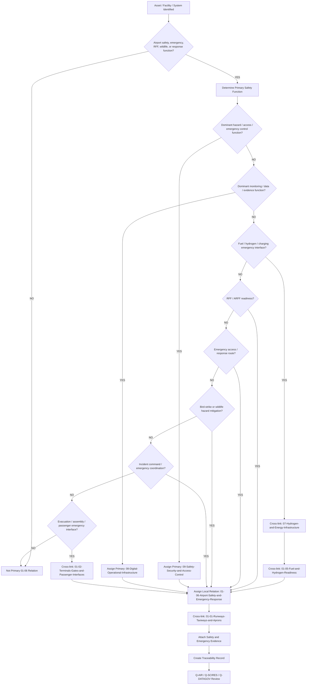
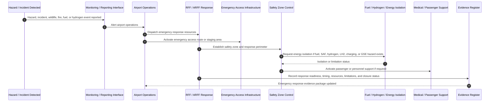
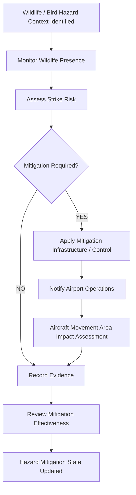
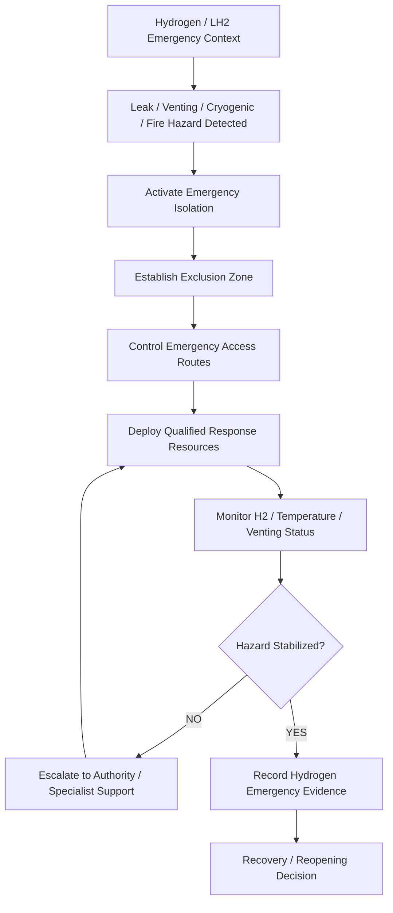
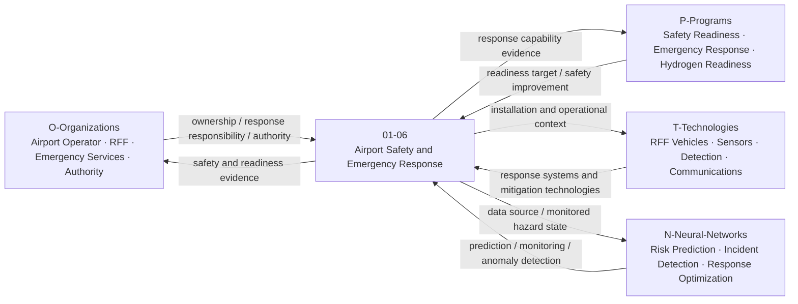
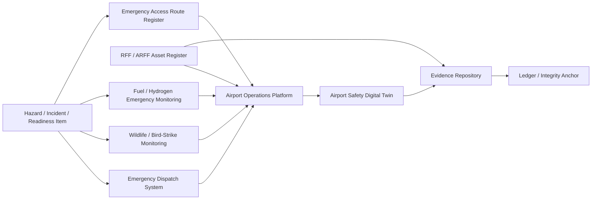

# 01-06-Airport-Safety-and-Emergency-Response — Airport Safety and Emergency Response

## Purpose

Rescue and fire-fighting (RFF), bird strike mitigation, and emergency response infrastructure.

This document defines the classification boundary, infrastructure scope, safety interfaces, emergency-response logic, wildlife and bird-strike mitigation context, evidence requirements, lifecycle governance, and traceability model for airport safety and emergency-response infrastructure under:

```text
IDEALE-ESG/A-Aerospace/I-Infrastructures/01-Airports/
```

## Parent

[`README.md`](README.md) — `IDEALE-ESG/A-Aerospace/I-Infrastructures/01-Airports/`

---

# 1. Scope

`01-06-Airport-Safety-and-Emergency-Response` covers airport-level infrastructure, systems, zones, access routes, facilities, equipment interfaces, emergency-response assets, wildlife-hazard mitigation infrastructure, and evidence used to protect aircraft, passengers, personnel, responders, infrastructure, and airport operations.

This document covers the infrastructure classification layer.

It does not replace airport emergency plans, authority-approved aerodrome manuals, fire service operating procedures, airline emergency procedures, security plans, or regulator-approved compliance packages.

It provides controlled taxonomy logic for:

- rescue and fire-fighting infrastructure;
- ARFF/RFF stations;
- emergency-response routes;
- emergency access roads;
- fire-water and extinguishing-agent support infrastructure;
- incident command infrastructure;
- emergency communication points;
- runway and apron emergency access;
- aircraft accident response zones;
- bird-strike mitigation infrastructure;
- wildlife-hazard management infrastructure;
- perimeter and hazard-control interfaces;
- evacuation and assembly-area infrastructure;
- medical response interfaces;
- hazardous-material response interfaces;
- hydrogen and fuel emergency-response interfaces;
- emergency isolation interfaces;
- emergency drills and readiness evidence;
- safety evidence and traceability records.

---

# 2. Controlled Definition

For this taxonomy, **airport safety and emergency-response infrastructure** is:

> The physical, digital, operational, emergency, safety, access, communication, mitigation, and response infrastructure used to prevent, detect, contain, respond to, and recover from airport-side hazards affecting aircraft operation, passengers, personnel, ground assets, energy systems, wildlife interaction, and airport continuity.

This infrastructure is locally classified under:

```text
01-06-Airport-Safety-and-Emergency-Response
```

when its dominant function is airport safety or emergency response.

If the dominant function is general safety, access control, emergency isolation, restricted-zone management, or security across multiple infrastructure sections, the primary classification may be:

```text
09-Safety-Security-and-Access-Control
```

with secondary relation to:

```text
01-Airports
```

and local relation to:

```text
01-06-Airport-Safety-and-Emergency-Response
```

---

# 3. Infrastructure Boundary

## 3.1 Included

This document includes:

- RFF / ARFF station infrastructure;
- emergency vehicle access routes;
- emergency response staging areas;
- aircraft accident response zones;
- fire-water supply points;
- foam-agent or extinguishing-agent support infrastructure;
- emergency command and coordination infrastructure;
- emergency communication infrastructure;
- runway, taxiway, apron, and stand emergency access interfaces;
- bird-strike mitigation infrastructure;
- wildlife-hazard management infrastructure;
- emergency medical response interfaces;
- hazardous-material response interfaces;
- fuel, SAF, hydrogen, LH2, and charging emergency interfaces;
- emergency isolation and shutdown interfaces;
- evacuation and assembly infrastructure;
- emergency readiness evidence;
- emergency drill evidence;
- airport safety traceability records.

## 3.2 Excluded

This document does not include:

- detailed RFF operating procedures;
- detailed fire service tactical procedures;
- detailed airport emergency plan content;
- detailed wildlife management operating procedures;
- detailed security response procedures;
- detailed medical protocols;
- detailed aircraft emergency procedures;
- aircraft onboard fire-protection system design;
- aircraft evacuation system design;
- detailed hydrogen safety case approval;
- detailed hazardous-material response manuals;
- authority-approved compliance demonstration packages.

Excluded items may be cross-referenced when they support classification, applicability, effectivity, readiness, or evidence.

---

# 4. Asset and Interface Classes

| Class | Description | Primary Classification |
|---|---|---|
| RFF / ARFF Station | Facility housing airport rescue and fire-fighting personnel, vehicles, equipment, agents, and response readiness assets. | `01-Airports` / `01-06`; `09` when emergency-response control is dominant |
| Emergency Access Road | Road enabling emergency vehicles to reach movement areas, stands, terminals, fuel areas, or accident sites. | `01-Airports` / `01-06` |
| Emergency Response Staging Area | Area used to position responders, vehicles, command units, or support equipment during incidents. | `01-Airports` / `01-06` |
| Incident Command Point | Physical or digital coordination point for airport incident management. | `09-Safety-Security-and-Access-Control` with secondary `01-Airports` |
| Fire-Water Supply Point | Hydrant, water source, tank, or replenishment interface supporting fire response. | `01-Airports` / `01-06`; `07` if energy/water-utility infrastructure dominant |
| Extinguishing-Agent Support Area | Infrastructure supporting storage or replenishment of foam, dry agents, or other response agents. | `01-Airports` / `01-06` |
| Runway Emergency Access Interface | Interface enabling emergency access to runway or runway strip areas. | `01-Airports` / `01-06` |
| Apron Emergency Access Interface | Interface enabling emergency access to stands, apron areas, GSE zones, or servicing zones. | `01-Airports` / `01-06` |
| Evacuation Assembly Area | Area used for passenger, crew, or personnel assembly during emergency evacuation. | `09-Safety-Security-and-Access-Control` with secondary `01-Airports` |
| Bird-Strike Mitigation Infrastructure | Infrastructure used to detect, deter, manage, or reduce wildlife and bird-strike hazard. | `01-Airports` / `01-06` |
| Wildlife-Hazard Monitoring System | Digital or sensor system used to monitor wildlife presence or strike risk. | `08-Digital-Operational-Infrastructure` with secondary `01-Airports` |
| Fuel Emergency Isolation Interface | Safety interface used to isolate fuel, SAF, hydrogen, LH2, charging, or energy infrastructure. | `09-Safety-Security-and-Access-Control` / `07-Hydrogen-and-Energy-Infrastructure` |
| Hydrogen Emergency Response Interface | Emergency response interface for hydrogen, LH2, leak detection, venting, isolation, or evacuation. | `09` and `07` with secondary `01-Airports` |
| Emergency Communication Interface | Communication point or system supporting emergency coordination. | `08-Digital-Operational-Infrastructure` when digital dominant; secondary `01-Airports` |
| Emergency Readiness Evidence Package | Evidence package supporting response readiness, drills, access, resources, and safety controls. | `01-Airports` / `09-Safety-Security-and-Access-Control` |

---

# 5. Classification Rules

## RULE-I-INFRA-AIR-SER-001 — Airport Safety Function Rule

An asset, interface, facility, system, or record shall be linked to `01-06-Airport-Safety-and-Emergency-Response` when it supports airport-side safety, emergency response, rescue, fire-fighting, hazard mitigation, emergency access, incident coordination, evacuation, wildlife-hazard mitigation, or operational continuity.

## RULE-I-INFRA-AIR-SER-002 — RFF / ARFF Infrastructure Rule

RFF or ARFF infrastructure shall be classified under `01-06` when its dominant function is airport rescue and fire-fighting readiness.

Minimum classification fields:

```yaml
rff_arff_classification:
  asset_type: "RFF/ARFF infrastructure"
  primary_function:
    - "rescue and fire-fighting readiness"
    - "emergency response"
    - "aircraft incident response"
  primary_section: "01-Airports"
  local_node: "01-06-Airport-Safety-and-Emergency-Response"
```

## RULE-I-INFRA-AIR-SER-003 — Emergency Access Rule

Emergency access infrastructure shall be classified under `01-06` when its dominant function is to enable emergency vehicle, responder, medical, fire-fighting, evacuation, or recovery access to airport operational areas.

Emergency access may include:

- emergency access roads;
- runway access points;
- apron access points;
- stand access corridors;
- fire service access points;
- perimeter emergency gates;
- emergency staging areas;
- response vehicle routing points.

## RULE-I-INFRA-AIR-SER-004 — Bird-Strike Mitigation Rule

Bird-strike mitigation infrastructure shall be classified under `01-06` when its dominant function is wildlife hazard detection, deterrence, monitoring, habitat control, airfield safety, or aircraft strike-risk reduction.

Bird-strike mitigation evidence shall identify:

1. hazard context;
2. monitored area;
3. mitigation method;
4. operational interface;
5. responsible organization;
6. evidence item;
7. lifecycle phase;
8. traceability record.

## RULE-I-INFRA-AIR-SER-005 — Wildlife-Hazard Digital Rule

If an asset primarily manages wildlife detection data, bird movement analytics, strike-risk prediction, sensor data, evidence records, or digital monitoring, it shall be classified under:

```text
08-Digital-Operational-Infrastructure
```

with secondary classification to:

```text
01-Airports
```

and local relation to:

```text
01-06-Airport-Safety-and-Emergency-Response
```

## RULE-I-INFRA-AIR-SER-006 — Safety Override Rule

If an asset primarily provides hazard zoning, restricted-area control, emergency isolation, incident command, fire safety, rescue readiness, evacuation control, access control, or emergency response, it may be classified under:

```text
09-Safety-Security-and-Access-Control
```

with secondary relation to:

```text
01-Airports
```

and local relation to:

```text
01-06-Airport-Safety-and-Emergency-Response
```

## RULE-I-INFRA-AIR-SER-007 — Energy Emergency Interface Rule

If an emergency-response asset primarily supports fuel, SAF, hydrogen, LH2, charging, ground power, battery, or energy isolation response, it shall cross-link to:

```text
07-Hydrogen-and-Energy-Infrastructure
```

and:

```text
01-05-Fuel-and-Hydrogen-Readiness
```

when the emergency-response function affects airport energy readiness.

## RULE-I-INFRA-AIR-SER-008 — Hydrogen Emergency Response Rule

Hydrogen or LH2 emergency-response infrastructure shall declare:

1. hydrogen form;
2. leak detection context;
3. venting or boil-off context;
4. isolation method;
5. exclusion-zone context;
6. emergency access requirements;
7. response equipment context;
8. responder readiness evidence;
9. authority-engagement status;
10. evidence package status.

## RULE-I-INFRA-AIR-SER-009 — Terminal and Passenger Emergency Interface Rule

If an emergency-response asset affects passenger evacuation, terminal egress, assembly areas, gate evacuation, remote-stand passenger movement, or accessibility during emergency response, it shall cross-link to:

```text
01-02-Terminals-Gates-and-Passenger-Interfaces
```

## RULE-I-INFRA-AIR-SER-010 — Movement-Area Emergency Interface Rule

If an emergency-response asset affects runways, taxiways, aprons, holding areas, aircraft stands, or movement-area recovery, it shall cross-link to:

```text
01-01-Runways-Taxiways-and-Aprons
```

## RULE-I-INFRA-AIR-SER-011 — GSE Emergency Interface Rule

If an emergency-response asset affects GSE movement, eGSE charging, refuelling vehicles, ground power units, servicing vehicles, or apron support equipment, it shall cross-link to:

```text
01-03-Ground-Support-Equipment-GSE
```

## RULE-I-INFRA-AIR-SER-012 — Emergency Readiness Evidence Rule

Emergency readiness shall not be declared unless evidence exists for the applicable emergency-response context.

Minimum readiness evidence:

- asset or facility ID;
- emergency function;
- response area;
- response access route;
- responsible organization;
- equipment availability context;
- safety zone or exclusion zone;
- communication interface;
- training or drill evidence, if applicable;
- operational limitations;
- lifecycle phase;
- traceability record.

## RULE-I-INFRA-AIR-SER-013 — No Generic Emergency Compliance Rule

Airport emergency readiness shall not imply regulatory approval, operational compliance, or response adequacy unless programme-specific, airport-specific, jurisdiction-specific, and authority-accepted evidence exists.

---

# 6. Classification Logic

## 6.1 Airport Safety and Emergency Response Classification Flow



## 6.2 Emergency Response Sequence Diagram



## 6.3 Bird-Strike Mitigation Logic



## 6.4 Hydrogen Emergency Response Logic



## 6.5 Rule Priority Logic

```yaml
airport_safety_emergency_response_classification_logic:
  scope_gate:
    condition: "asset.domain == 'A-Aerospace' and asset.airport_context == true and asset.supports_safety_or_emergency_response == true"
    result_if_false: "not_primary_01_06_relation"

  override_priority:
    - priority: 1
      condition: "asset.primary_function in ['emergency_response', 'hazard_zoning', 'incident_command', 'emergency_isolation', 'access_control', 'fire_safety', 'evacuation_control']"
      primary_result: "09-Safety-Security-and-Access-Control"
      secondary_result: "01-Airports"
      local_relation: "01-06-Airport-Safety-and-Emergency-Response"

    - priority: 2
      condition: "asset.primary_function in ['wildlife_monitoring_data', 'bird_strike_prediction', 'emergency_response_record', 'incident_data', 'digital_twin', 'safety_evidence_repository']"
      primary_result: "08-Digital-Operational-Infrastructure"
      secondary_result: "01-Airports"
      local_relation: "01-06-Airport-Safety-and-Emergency-Response"

    - priority: 3
      condition: "asset.primary_function in ['fuel_emergency_isolation', 'hydrogen_emergency_response', 'LH2_venting_response', 'charging_emergency_isolation', 'energy_hazard_control']"
      primary_result: "09-Safety-Security-and-Access-Control"
      secondary_results:
        - "07-Hydrogen-and-Energy-Infrastructure"
        - "01-Airports"
      local_relation: "01-06-Airport-Safety-and-Emergency-Response"

    - priority: 4
      condition: "asset.primary_function in ['RFF_readiness', 'ARFF_readiness', 'emergency_access', 'bird_strike_mitigation', 'wildlife_hazard_mitigation', 'medical_response_interface']"
      primary_result: "01-Airports"
      local_node: "01-06-Airport-Safety-and-Emergency-Response"

  dependency_links:
    movement_area_dependency: "01-01-Runways-Taxiways-and-Aprons"
    passenger_dependency: "01-02-Terminals-Gates-and-Passenger-Interfaces"
    GSE_dependency: "01-03-Ground-Support-Equipment-GSE"
    fuel_hydrogen_dependency: "01-05-Fuel-and-Hydrogen-Readiness"
    safety_security_dependency: "09-Safety-Security-and-Access-Control"
    digital_dependency: "08-Digital-Operational-Infrastructure"

  evidence_required:
    - asset_id
    - asset_name
    - emergency_function
    - response_area
    - safety_zone_context
    - access_route_context
    - responsible_organization
    - response_equipment_context
    - lifecycle_phase
    - applicability
    - effectivity
    - traceability_record
```

---

# 7. Airport Safety and Emergency Response Record

Each controlled safety or emergency-response asset should be expressible using the following record.

```yaml
airport_safety_emergency_response_record:
  response_asset_id: ""
  asset_name: ""
  asset_type: ""
  airport_id: ""
  response_area: ""
  physical_location: ""

  classification:
    domain: "A-Aerospace"
    opt_in_axis: "I-Infrastructures"
    section: "01-Airports"
    local_node: "01-06-Airport-Safety-and-Emergency-Response"
    primary_classification: ""
    secondary_classifications:
      - ""

  emergency_function:
    primary_function: ""
    response_role: ""
    hazard_context:
      - ""
    affected_airport_areas:
      - ""

  response_capability:
    RFF_ARFF_required: false
    emergency_access_required: false
    fire_response_required: false
    medical_response_required: false
    hazardous_material_response_required: false
    wildlife_mitigation_required: false
    hydrogen_response_required: false
    energy_isolation_required: false

  interfaces:
    movement_area_interface: ""
    passenger_interface: ""
    GSE_interface: ""
    fuel_hydrogen_interface: ""
    digital_interface: ""
    communication_interface: ""

  lifecycle:
    lifecycle_phase: ""
    maturity_state: ""
    governance_status: "controlled-candidate"

  applicability:
    applies_to:
      - ""
    does_not_apply_to:
      - ""

  effectivity:
    airport_effectivity: ""
    facility_effectivity: ""
    asset_effectivity: ""
    operational_effectivity: ""
    temporal_effectivity: ""
    jurisdiction_effectivity: ""
    digital_effectivity: ""

  evidence:
    evidence_items:
      - evidence_id: ""
        evidence_class: ""
        evidence_status: ""

  traceability:
    upstream:
      - ""
    downstream:
      - ""
```

---

# 8. RFF / ARFF Readiness Fields

```yaml
rff_arff_readiness:
  readiness_id: ""
  airport_id: ""
  response_category_context: ""
  RFF_station_context: ""
  response_vehicle_context:
    - ""
  extinguishing_agent_context:
    - ""
  water_supply_context: ""
  access_route_context:
    - ""
  response_time_context: ""
  staffing_or_resource_context: ""
  communication_context: ""
  training_or_drill_evidence:
    required: true
    evidence_ids:
      - ""
  operational_limitations:
    - ""
  evidence_package_status: ""
```

---

# 9. Bird-Strike and Wildlife-Hazard Mitigation Fields

```yaml
wildlife_hazard_mitigation:
  mitigation_id: ""
  airport_id: ""
  monitored_area:
    - "runway"
    - "taxiway"
    - "apron"
    - "approach_path_context"
    - "perimeter_context"
  hazard_type:
    - "bird"
    - "wildlife"
    - "habitat_attractant"
  monitoring_method:
    - ""
  mitigation_method:
    - ""
  operational_interface:
    affected_operations:
      - ""
    notification_required: true
  evidence:
    hazard_record_required: true
    mitigation_record_required: true
    trend_monitoring_required: false
  responsible_organization: ""
  lifecycle_phase: ""
```

---

# 10. Emergency Access and Response Zone Fields

```yaml
emergency_access_response_zone:
  zone_id: ""
  airport_id: ""
  zone_type: ""
  affected_area:
    - ""
  access_route:
    route_id: ""
    route_status: ""
    response_vehicle_access: true
  safety_controls:
    exclusion_zone_required: false
    restricted_access_required: false
    emergency_lighting_required: false
    communication_required: true
  linked_assets:
    runways:
      - ""
    taxiways:
      - ""
    aprons:
      - ""
    terminals:
      - ""
    fuel_or_hydrogen_assets:
      - ""
  evidence:
    - evidence_id: ""
      evidence_class: "safety-evidence"
```

---

# 11. Hydrogen and Energy Emergency Interface Fields

```yaml
hydrogen_energy_emergency_interface:
  interface_id: ""
  energy_carrier:
    - "Jet-A"
    - "SAF"
    - "LH2"
    - "GH2"
    - "electricity"
    - "battery"
  asset_context: ""
  emergency_function:
    - "isolation"
    - "leak_detection"
    - "venting_control"
    - "fire_response"
    - "exclusion_zone"
    - "emergency_shutdown"
  linked_nodes:
    - "01-05-Fuel-and-Hydrogen-Readiness"
    - "07-Hydrogen-and-Energy-Infrastructure"
    - "09-Safety-Security-and-Access-Control"
  response_constraints:
    cryogenic_hazard: false
    flammable_gas_hazard: false
    high_voltage_hazard: false
    fire_hazard: false
  evidence:
    - evidence_id: ""
      evidence_class: "safety-evidence"
```

---

# 12. Interfaces with OPT-IN Axes

| OPT-IN Axis | Interface with Airport Safety and Emergency Response |
|---|---|
| `O-Organizations` | Airport operator, emergency services, RFF/ARFF unit, wildlife management authority, airline, ground handler, fuel provider, hydrogen provider, regulator. |
| `P-Programs` | Airport safety-readiness programme, emergency-response improvement programme, hydrogen-readiness programme, airport compatibility programme, wildlife-hazard mitigation programme. |
| `T-Technologies` | RFF vehicles, communication systems, detection systems, wildlife monitoring systems, fire suppression systems, hydrogen detection, emergency isolation, access-control systems. |
| `I-Infrastructures` | RFF stations, emergency access roads, staging areas, runways, taxiways, aprons, terminals, fuel zones, hydrogen zones, safety zones. |
| `N-Neural-Networks` | Bird-strike risk prediction, emergency-response optimization, incident detection, hydrogen leak anomaly detection, movement-area hazard prediction. |

## 12.1 OPT-IN Interface Diagram



---

# 13. Q-Division Governance

| Q-Division | Governance Role |
|---|---|
| `Q-AIR` | Primary owner for airport safety context, RFF/ARFF airport interface, wildlife-hazard mitigation, emergency response integration, and airport operational safety classification. |
| `Q-DATAGOV` | Controls naming, traceability, safety evidence records, digital thread, canonical paths, response evidence governance, and publication readiness. |
| `Q-GROUND` | Supports emergency access, ramp response, GSE emergency interfaces, apron operations, emergency vehicle routing, and ground operational continuity. |
| `Q-GREENTECH` | Supports fuel, SAF, hydrogen, LH2, charging, battery, and energy emergency-response interfaces. |
| `Q-SCIRES` | Supports verification, validation, safety evidence, emergency readiness evidence, drill evidence, hazard analysis, and certification-feasibility context. |
| `Q-MECHANICS` | Supports emergency equipment, mechanical isolation interfaces, response vehicles, fire-fighting equipment interfaces, and maintainability. |
| `Q-HPC` | Supports emergency-response simulation, bird-strike risk prediction, hydrogen hazard modeling, incident detection, and AI/ML analytics. |

---

# 14. Lifecycle Applicability

| Lifecycle Phase | Airport Safety and Emergency Response Role |
|---|---|
| `LC01` | Define airport safety, RFF, emergency response, bird-strike, wildlife, and emergency-access scope. |
| `LC02` | Define response requirements, safety constraints, hazard contexts, emergency-access needs, and readiness criteria. |
| `LC03` | Define safety architecture, response-zone model, access routes, communication interfaces, and cross-node dependencies. |
| `LC04` | Develop preliminary emergency-response concepts, safety-zone assumptions, wildlife mitigation concepts, and hydrogen emergency assumptions. |
| `LC05` | Produce detailed readiness records, asset records, interface definitions, and implementation evidence. |
| `LC06` | Define verification, inspection, drill, simulation, acceptance, and emergency-readiness criteria. |
| `LC07` | Construct, configure, install, procure, or deploy safety and emergency-response infrastructure. |
| `LC08` | Integrate response infrastructure with movement areas, terminals, GSE, fuel/hydrogen systems, digital systems, and emergency services. |
| `LC09` | Commission safety and emergency-response infrastructure and establish handover evidence. |
| `LC10` | Support certification, operational approval, emergency-readiness review, safety approval, or authority review where applicable. |
| `LC11` | Operate safety and emergency-response infrastructure. |
| `LC12` | Maintain, inspect, test, calibrate, drill, repair, and support emergency-response assets. |
| `LC13` | Upgrade, expand, modify, automate, hydrogen-enable, digitize, or reconfigure safety and emergency-response infrastructure. |
| `LC14` | Retire, isolate, decommission, archive, or replace safety and emergency-response infrastructure and records. |

---

# 15. Evidence Requirements

## 15.1 Minimum Evidence

Each controlled airport safety, RFF/ARFF, emergency-response, bird-strike mitigation, wildlife-hazard, or emergency-access record shall include:

1. asset ID or response record ID;
2. airport, runway, taxiway, apron, terminal, stand, fuel, or hydrogen context;
3. emergency function;
4. hazard context;
5. response area;
6. access route context;
7. response equipment context;
8. responsible organization;
9. safety-zone statement;
10. emergency-readiness statement;
11. digital monitoring dependency, if applicable;
12. energy or hydrogen dependency, if applicable;
13. lifecycle phase;
14. applicability statement;
15. effectivity statement;
16. responsible Q-Division;
17. citation keys, if applicable;
18. evidence footprint;
19. traceability record.

## 15.2 Evidence Classes

| Evidence Class | Use |
|---|---|
| `classification-evidence` | Supports assignment or relation to `01-06-Airport-Safety-and-Emergency-Response`. |
| `RFF-evidence` | Supports rescue and fire-fighting readiness, equipment, response access, and station context. |
| `ARFF-evidence` | Supports aircraft rescue and fire-fighting readiness and response context. |
| `emergency-response-evidence` | Supports response zones, access routes, incident command, communication, and readiness. |
| `bird-strike-evidence` | Supports bird-strike hazard mitigation, monitoring, and trend records. |
| `wildlife-hazard-evidence` | Supports wildlife monitoring, mitigation, and operational risk context. |
| `safety-evidence` | Supports hazard zones, exclusion areas, emergency isolation, fire safety, and evacuation. |
| `energy-emergency-evidence` | Supports fuel, SAF, hydrogen, LH2, charging, battery, and energy emergency response. |
| `operational-evidence` | Supports airport operations, movement-area safety, response readiness, and continuity. |
| `digital-evidence` | Supports monitoring, detection, reporting, digital twin, evidence repository, and response analytics. |
| `training-drill-evidence` | Supports emergency exercise, readiness, responder training, and response capability evidence. |
| `certification-evidence` | Supports regulatory, authority, programme, or airport approval context where applicable. |

## 15.3 Evidence Package Template

```yaml
airport_safety_emergency_response_evidence_package:
  package_id: ""
  package_title: ""
  infrastructure_section: "01-Airports"
  local_node: "01-06-Airport-Safety-and-Emergency-Response"
  response_asset_id: ""
  airport_id: ""
  response_area: ""
  owner: "Q-AIR"

  supporting_q_divisions:
    - "Q-DATAGOV"
    - "Q-GROUND"
    - "Q-GREENTECH"
    - "Q-SCIRES"
    - "Q-MECHANICS"

  lifecycle_phase: ""

  applicability:
    applies_to:
      - ""
    does_not_apply_to:
      - ""

  effectivity:
    airport_effectivity: ""
    facility_effectivity: ""
    response_area_effectivity: ""
    operational_effectivity: ""
    energy_configuration_effectivity: ""
    temporal_effectivity: ""
    jurisdiction_effectivity: ""

  readiness:
    emergency_function: ""
    response_status: ""
    access_route_status: ""
    equipment_status: ""
    communication_status: ""
    training_or_drill_status: ""
    operational_limitations:
      - ""

  evidence_items:
    - evidence_id: ""
      evidence_class: ""
      title: ""
      status: ""
      repository_path: ""

  traceability:
    upstream:
      - ""
    downstream:
      - ""

  review:
    reviewer: ""
    approval_status: ""
```

---

# 16. Digital Thread

Airport safety and emergency-response infrastructure may interface with digital systems for incident reporting, wildlife monitoring, RFF readiness, response dispatch, emergency communication, hydrogen detection, safety-zone monitoring, evidence recording, and post-incident review.

Digital-thread interfaces may include:

- emergency response register;
- RFF/ARFF asset register;
- incident reporting system;
- emergency dispatch system;
- wildlife monitoring system;
- bird-strike reporting database;
- fuel and hydrogen monitoring system;
- emergency access route register;
- airport operational database;
- safety digital twin;
- PLM or configuration record;
- evidence repository;
- ledger or integrity anchor.

## 16.1 Safety and Emergency Response Digital Thread Diagram



---

# 17. Classification Examples

## 17.1 RFF Station

```yaml
asset:
  asset_name: "Airport RFF Station"
  asset_type: "rescue and fire-fighting facility"
  primary_function: "airport emergency response readiness"
  primary_classification:
    section_code: "01"
    section_name: "Airports"
    local_node: "01-06-Airport-Safety-and-Emergency-Response"
  secondary_classifications:
    - section_code: "09"
      section_name: "Safety, Security and Access Control"
      relation: "Emergency response and safety-control function"
  evidence:
    - evidence_class: "RFF-evidence"
    - evidence_class: "emergency-response-evidence"
```

## 17.2 Emergency Access Road

```yaml
asset:
  asset_name: "Runway Emergency Access Road"
  asset_type: "emergency access infrastructure"
  primary_function: "emergency vehicle access to runway and movement area"
  primary_classification:
    section_code: "01"
    section_name: "Airports"
    local_node: "01-06-Airport-Safety-and-Emergency-Response"
  secondary_classifications:
    - section_code: "01-01"
      section_name: "Runways Taxiways and Aprons"
      relation: "Movement-area emergency access"
  evidence:
    - evidence_class: "emergency-response-evidence"
    - evidence_class: "safety-evidence"
```

## 17.3 Bird-Strike Mitigation System

```yaml
asset:
  asset_name: "Bird-Strike Mitigation System"
  asset_type: "wildlife hazard mitigation infrastructure"
  primary_function: "bird-strike risk reduction and wildlife hazard management"
  primary_classification:
    section_code: "01"
    section_name: "Airports"
    local_node: "01-06-Airport-Safety-and-Emergency-Response"
  evidence:
    - evidence_class: "bird-strike-evidence"
    - evidence_class: "wildlife-hazard-evidence"
```

## 17.4 Hydrogen Emergency Isolation Zone

```yaml
asset:
  asset_name: "LH2 Stand Emergency Isolation Zone"
  asset_type: "hydrogen emergency response interface"
  physical_location: "aircraft stand"
  primary_function: "hydrogen emergency isolation and exclusion-zone control"
  primary_classification:
    section_code: "09"
    section_name: "Safety, Security and Access Control"
  secondary_classifications:
    - section_code: "07"
      section_name: "Hydrogen and Energy Infrastructure"
      relation: "LH2 energy safety interface"
    - section_code: "01"
      section_name: "Airports"
      relation: "Airport-side emergency-response context"
  local_relation: "01-06-Airport-Safety-and-Emergency-Response"
  evidence:
    - evidence_class: "energy-emergency-evidence"
    - evidence_class: "safety-evidence"
```

## 17.5 Wildlife Monitoring Digital System

```yaml
asset:
  asset_name: "Wildlife Hazard Monitoring System"
  asset_type: "digital monitoring system"
  primary_function: "wildlife detection, risk trend monitoring, and evidence recording"
  primary_classification:
    section_code: "08"
    section_name: "Digital Operational Infrastructure"
  secondary_classifications:
    - section_code: "01"
      section_name: "Airports"
      relation: "Airport wildlife hazard mitigation context"
  local_relation: "01-06-Airport-Safety-and-Emergency-Response"
  evidence:
    - evidence_class: "digital-evidence"
    - evidence_class: "wildlife-hazard-evidence"
```

---

# 18. Reference Map

| Citation Key | Applies To | Use in `01-06` |
|---|---|---|
| `ICAO-ANNEX14` | Aerodrome emergency planning, RFF context, physical infrastructure context | Baseline international aerodrome reference family. |
| `ICAO-ANNEX19` | Safety management | Safety management reference family for risk and safety governance context. |
| `EASA-ADR` | EU aerodrome governance | EU aerodrome regulatory and administrative reference family. |
| `EASA-CS-ADR-DSN` | Aerodrome design context | Aerodrome design reference family when emergency access or safety zones affect physical design. |
| `FAA-PART-139` | US airport certification and ARFF context | US airport certification, ARFF, safety, and emergency-response reference family. |
| `NFPA-403` | Aircraft rescue and fire-fighting | Aircraft rescue and fire-fighting services reference family. |
| `NFPA-2` | Hydrogen safety | Hydrogen safety, storage, handling, and emergency-response reference family. |
| `ISO-31000` | Risk management | Safety risk, hazard mitigation, and emergency-response governance reference family. |
| `ISO-55000` | Asset management | Emergency-response asset lifecycle reference family. |
| `ISO-9001` | Quality management | General QMS reference family for controlled records and infrastructure processes. |
| `IAQG-9100` | Aerospace QMS | Aviation, space, and defense QMS governance reference family. |
| `IATA-AHM` | Airport handling and ground operations context | Ground handling and ramp emergency interface context. |
| `S1000D` | Technical publications | CSDB/IETP reference family for controlled publication-ready safety and emergency-response data. |

---

# 19. Controlled References

## [ICAO-ANNEX14]

**ICAO Annex 14 — Aerodromes, Volume I, Aerodrome Design and Operations.**

Used as the international airport and aerodrome reference family for airport safety, RFF, emergency access, and physical airport infrastructure context.

## [ICAO-ANNEX19]

**ICAO Annex 19 — Safety Management.**

Used as the international aviation safety-management reference family for safety risk, safety governance, and emergency-response management context.

## [EASA-ADR]

**EASA Easy Access Rules for Aerodromes — Regulation (EU) No 139/2014.**

Used as the EU aerodrome regulatory reference family for airport safety, emergency-response governance, aerodrome certification context, administrative procedures, and operational requirements.

## [EASA-CS-ADR-DSN]

**EASA Certification Specifications and Guidance Material for Aerodrome Design.**

Used as the aerodrome design reference family when safety areas, emergency access, movement-area interfaces, or emergency-response assets affect physical aerodrome design context.

## [FAA-PART-139]

**14 CFR Part 139 — Certification of Airports.**

Used as the US airport certification reference family for airport safety, ARFF context, emergency response, and jurisdiction-specific applicability.

## [NFPA-403]

**NFPA 403 — Standard for Aircraft Rescue and Fire-Fighting Services at Airports.**

Used as the aircraft rescue and fire-fighting reference family for ARFF/RFF service and response infrastructure context.

## [NFPA-2]

**NFPA 2 — Hydrogen Technologies Code.**

Used as the hydrogen safety-code reference family for hydrogen storage, handling, installation, safety control, emergency isolation, and emergency-response evidence.

## [ISO-31000]

**ISO 31000 — Risk Management Guidelines.**

Used as the risk-management reference family for airport hazards, wildlife risks, RFF readiness, emergency-response risk, hydrogen risk, and operational safety governance.

## [ISO-55000]

**ISO 55000 — Asset Management, Vocabulary, Overview and Principles.**

Used as the asset-management reference family for emergency-response assets, RFF facilities, safety infrastructure, and lifecycle governance.

## [ISO-9001]

**ISO 9001 — Quality Management Systems Requirements.**

Used as the general quality-management reference family for process governance, review, improvement, audit, and controlled records.

## [IAQG-9100]

**IAQG 9100 — Quality Management Systems Requirements for Aviation, Space and Defense Organizations.**

Used as the aerospace quality-management reference family for aviation, space, defense, supplier, maintenance, production, and lifecycle governance.

## [IATA-AHM]

**IATA Airport Handling Manual.**

Used as a ground-handling reference family for ramp operations, GSE context, and airport handling interfaces relevant to emergency response.

## [S1000D]

**S1000D — International Specification for Technical Publications Using a Common Source Database.**

Used as the technical-publication and CSDB reference family when airport safety or emergency-response infrastructure documentation requires controlled data modules, applicability, effectivity, publication readiness, or IETP integration.

---

# 20. Traceability Record

```yaml
airport_safety_emergency_response_traceability_record:
  document_id: "IDEALE-ESG-A-AEROSPACE-I-INFRASTRUCTURES-01-06-AIRPORT-SAFETY-AND-EMERGENCY-RESPONSE"
  canonical_path: "IDEALE-ESG/A-Aerospace/I-Infrastructures/01-Airports/01-06-Airport-Safety-and-Emergency-Response.md"
  parent_path: "IDEALE-ESG/A-Aerospace/I-Infrastructures/01-Airports/"
  upstream:
    - "IDEALE-ESG-A-AEROSPACE-I-INFRASTRUCTURES-01-00-AIRPORTS-GENERAL"
    - "IDEALE-ESG-A-AEROSPACE-I-INFRASTRUCTURES-01-01-RUNWAYS-TAXIWAYS-AND-APRONS"
    - "IDEALE-ESG-A-AEROSPACE-I-INFRASTRUCTURES-01-02-TERMINALS-GATES-AND-PASSENGER-INTERFACES"
    - "IDEALE-ESG-A-AEROSPACE-I-INFRASTRUCTURES-01-03-GROUND-SUPPORT-EQUIPMENT-GSE"
    - "IDEALE-ESG-A-AEROSPACE-I-INFRASTRUCTURES-01-05-FUEL-AND-HYDROGEN-READINESS"
    - "IDEALE-ESG-A-AEROSPACE-I-INFRASTRUCTURES-00-02-INFRASTRUCTURE-CLASSIFICATION-RULES"
    - "IDEALE-ESG-A-AEROSPACE-I-INFRASTRUCTURES-00-04-APPLICABILITY-AND-EFFECTIVITY"
    - "IDEALE-ESG-A-AEROSPACE-I-INFRASTRUCTURES-00-06-INTERFACES-WITH-OPTIN-AXES"
    - "IDEALE-ESG-A-AEROSPACE-I-INFRASTRUCTURES-00-07-TRACEABILITY-AND-EVIDENCE"
    - "IDEALE-ESG-A-AEROSPACE-I-INFRASTRUCTURES-00-08-NAMING-CONVENTIONS"
  downstream:
    - "01-07-Airport-Digital-Operations"
    - "01-08-Airport-Compatibility-and-Certification"
    - "01-09-Traceability-Governance-and-Evidence"
    - "07-Hydrogen-and-Energy-Infrastructure"
    - "08-Digital-Operational-Infrastructure"
    - "09-Safety-Security-and-Access-Control"
```

---

# 21. Footprints

## Semantic Footprint

```yaml
semantic_footprint:
  id: FP-SEM-I-INFRA-01-06
  subject: "Airport safety, RFF/ARFF, bird-strike mitigation, wildlife hazard, and emergency-response infrastructure classification"
  meaning_boundary:
    includes:
      - RFF infrastructure
      - ARFF infrastructure
      - emergency access roads
      - emergency staging areas
      - incident command interfaces
      - fire-water and extinguishing-agent support
      - bird-strike mitigation infrastructure
      - wildlife-hazard mitigation infrastructure
      - emergency communication interfaces
      - fuel and hydrogen emergency response
      - evacuation and assembly interfaces
      - emergency readiness evidence
    excludes:
      - detailed emergency operating procedures
      - detailed RFF tactical procedures
      - detailed airport emergency plan content
      - detailed medical protocols
      - aircraft onboard emergency systems
      - authority-approved compliance demonstration
```

## Taxonomy Footprint

```yaml
taxonomy_footprint:
  id: FP-TAX-I-INFRA-01-06
  hierarchy:
    root: "IDEALE-ESG"
    domain: "A-Aerospace"
    opt_in_axis: "I-Infrastructures"
    section: "01-Airports"
    document: "01-06-Airport-Safety-and-Emergency-Response"
```

## Lifecycle Footprint

```yaml
lifecycle_footprint:
  id: FP-LC-I-INFRA-01-06
  lifecycle_phase: "LC01"
  lifecycle_role: "Defines airport safety, RFF/ARFF, bird-strike mitigation, wildlife-hazard, and emergency-response infrastructure scope"
  exit_criteria:
    - safety and emergency-response scope defined
    - RFF/ARFF readiness fields defined
    - bird-strike and wildlife-hazard mitigation fields defined
    - emergency access fields defined
    - hydrogen and energy emergency interfaces defined
    - classification rules defined
    - classification logic diagrams included
    - emergency response sequence diagram included
    - evidence requirements defined
    - digital-thread interfaces mapped
    - reference families mapped
```

## Compliance Footprint

```yaml
compliance_footprint:
  id: FP-COMP-I-INFRA-01-06
  reference_families:
    aerodromes:
      - "ICAO-ANNEX14"
      - "EASA-ADR"
      - "EASA-CS-ADR-DSN"
      - "FAA-PART-139"
    safety_management:
      - "ICAO-ANNEX19"
      - "ISO-31000"
    rescue_fire_fighting:
      - "NFPA-403"
    hydrogen_and_energy:
      - "NFPA-2"
    ground_handling:
      - "IATA-AHM"
    asset_management:
      - "ISO-55000"
    quality_management:
      - "ISO-9001"
      - "IAQG-9100"
    technical_publications:
      - "S1000D"
```

## Evidence Footprint

```yaml
evidence_footprint:
  id: FP-EVD-I-INFRA-01-06
  expected_evidence:
    - controlled markdown document
    - YAML frontmatter
    - canonical path
    - parent path
    - RFF/ARFF readiness fields
    - emergency-response asset classes
    - bird-strike mitigation logic
    - wildlife-hazard mitigation fields
    - hydrogen emergency response logic
    - classification rules
    - classification logic diagrams
    - emergency-response sequence diagram
    - evidence package template
    - digital-thread diagram
    - reference map
    - traceability record
```

---

# 22. Governance Rule

Any child or derivative record under `01-06-Airport-Safety-and-Emergency-Response` shall declare:

1. safety or emergency-response asset type;
2. airport, runway, taxiway, apron, stand, terminal, fuel, hydrogen, or GSE context;
3. emergency function;
4. hazard context;
5. response area;
6. emergency access route, if applicable;
7. responsible organization;
8. equipment or response capability context;
9. safety-zone or exclusion-zone statement;
10. digital monitoring dependency, if applicable;
11. fuel, hydrogen, or energy dependency, if applicable;
12. primary classification;
13. secondary classifications, if applicable;
14. applicability;
15. effectivity, when required;
16. lifecycle phase;
17. responsible Q-Division;
18. evidence footprint;
19. traceability record.

No airport safety, RFF, ARFF, bird-strike mitigation, wildlife-hazard, or emergency-response document shall claim regulatory, operational, safety, emergency-readiness, fuel, hydrogen, or response adequacy compliance solely because it references ICAO, EASA, FAA, NFPA, ISO, IAQG, IATA, or S1000D material.

Compliance requires programme-specific, jurisdiction-specific, airport-specific, operator-specific, responder-specific, and authority-accepted evidence.

---

# 23. Acceptance Criteria

This document is acceptable when:

- airport safety and emergency-response scope is defined;
- RFF/ARFF infrastructure scope is defined;
- bird-strike and wildlife-hazard mitigation scope is defined;
- included and excluded boundaries are stated;
- asset and interface classes are listed;
- classification rules are present;
- override logic is defined;
- classification diagrams are included;
- emergency-response sequence diagram is included;
- hydrogen emergency-response logic is included;
- evidence requirements are defined;
- digital-thread interfaces are mapped;
- Q-Division responsibilities are declared;
- reference families are mapped;
- traceability records are provided;
- downstream airport, safety, energy, and digital documents can reuse the structure without reinterpretation.

---

# 24. Summary

`01-06-Airport-Safety-and-Emergency-Response` defines the controlled taxonomy scope for airport safety and emergency-response infrastructure.

It covers RFF/ARFF stations, emergency access routes, incident command points, staging areas, fire-response interfaces, bird-strike mitigation, wildlife-hazard management, hydrogen and fuel emergency response, evacuation interfaces, safety evidence, emergency readiness, lifecycle governance, digital-thread interfaces, and traceability under `01-Airports`.
````
