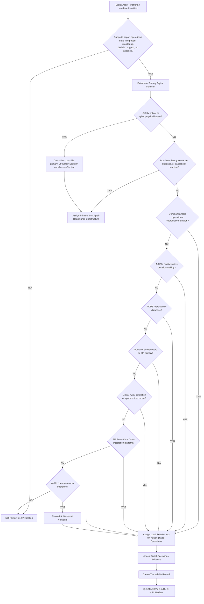
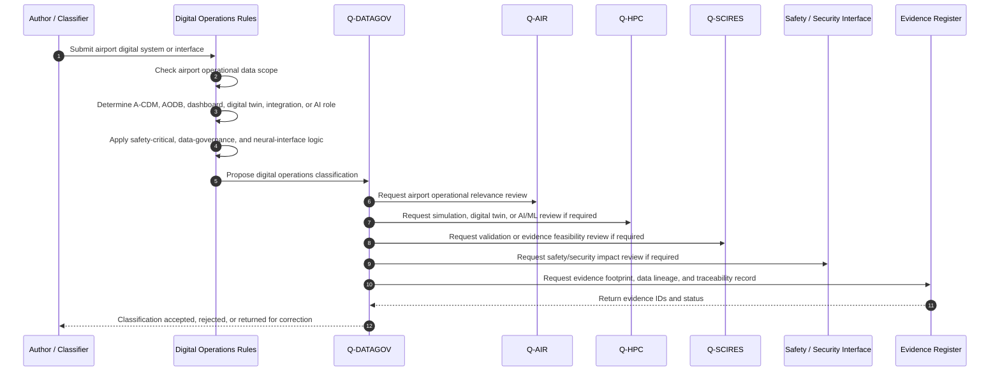
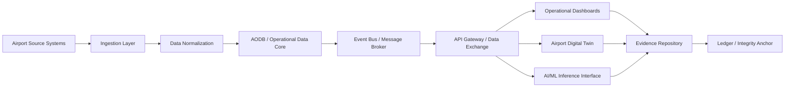
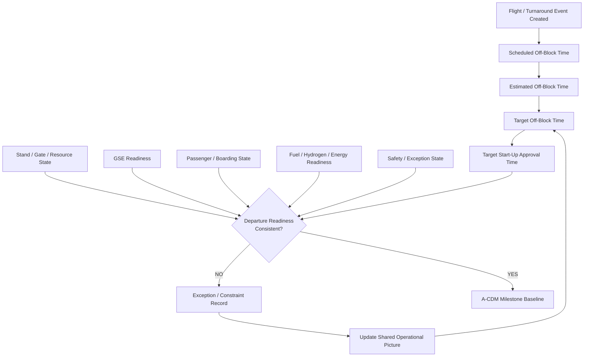
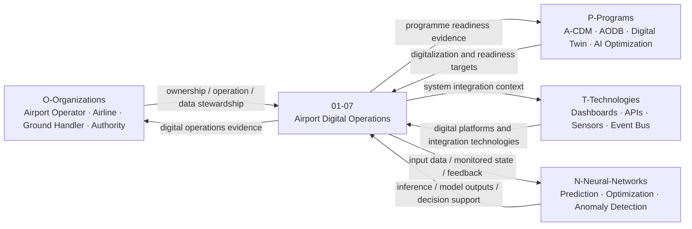
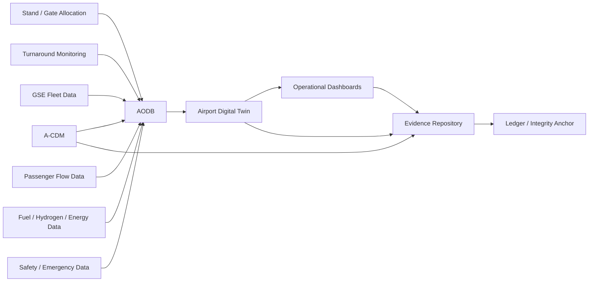

# 01-07-Airport-Digital-Operations — Airport Digital Operations

## Purpose

A-CDM, AODB, operational dashboards, and airport digital integration systems.

This document defines the classification boundary, infrastructure scope, data-interface logic, digital-thread model, evidence requirements, lifecycle governance, and traceability model for airport digital operations under:

```text
IDEALE-ESG/A-Aerospace/I-Infrastructures/01-Airports/
```

## Parent

[`README.md`](README.md) — `IDEALE-ESG/A-Aerospace/I-Infrastructures/01-Airports/`

---

# 1. Scope

`01-07-Airport-Digital-Operations` covers airport digital infrastructure, operational data systems, integration platforms, decision-support dashboards, collaborative decision-making systems, operational databases, digital twins, evidence repositories, and data exchange interfaces used to support airport operations.

This document covers the infrastructure classification layer.

It does not replace airport IT architecture documents, cybersecurity plans, operational system specifications, software requirements, airline systems, ANSP systems, or regulator-approved digital compliance packages.

It provides controlled taxonomy logic for:

- A-CDM systems;
- Airport Operational Database systems;
- airport operational dashboards;
- airport operations control systems;
- airport data integration platforms;
- airport digital twins;
- turnaround monitoring systems;
- stand and gate allocation systems;
- resource allocation systems;
- GSE fleet integration systems;
- passenger-flow monitoring systems;
- runway and taxiway occupancy monitoring interfaces;
- fuel and hydrogen readiness monitoring;
- emergency-response digital interfaces;
- safety monitoring systems;
- operational data lakes;
- evidence repositories;
- airport API gateways;
- event streaming systems;
- airport digital-thread records;
- airport operational ledgers;
- airport AI/ML monitoring and inference interfaces.

---

# 2. Controlled Definition

For this taxonomy, **airport digital operations infrastructure** is:

> The digital, data, integration, monitoring, decision-support, evidence, dashboard, model, and lifecycle infrastructure used to collect, process, exchange, govern, display, optimize, and preserve airport operational information.

Airport digital operations infrastructure may be classified primarily under:

```text
08-Digital-Operational-Infrastructure
```

when the dominant function is data governance, operational data integration, digital-thread control, evidence management, model governance, or digital platform operation.

It may remain locally related to:

```text
01-07-Airport-Digital-Operations
```

when the digital system directly supports airport operational infrastructure, airport compatibility, turnaround, resource allocation, safety monitoring, or airport readiness.

---

# 3. Infrastructure Boundary

## 3.1 Included

This document includes:

- A-CDM infrastructure;
- AODB infrastructure;
- airport operational dashboards;
- airport operations control platforms;
- airport data integration middleware;
- airport API gateways;
- airport event-bus or message-broker systems;
- airport operational data lakes;
- airport digital twin systems;
- stand and gate allocation systems;
- turnaround monitoring systems;
- resource allocation systems;
- GSE fleet data interfaces;
- passenger-flow monitoring systems;
- runway, taxiway, and apron monitoring interfaces;
- emergency-response digital interfaces;
- fuel, SAF, hydrogen, charging, and energy monitoring interfaces;
- safety and incident reporting interfaces;
- airport evidence repositories;
- airport operational ledgers;
- operational KPI and readiness dashboards;
- airport AI/ML inference interfaces;
- digital traceability records.

## 3.2 Excluded

This document does not include:

- aircraft onboard avionics;
- airline reservation systems;
- passenger personal-data processing rules outside infrastructure taxonomy scope;
- detailed airport cybersecurity architecture;
- detailed software design;
- detailed database schema design unless used as evidence;
- ANSP operational systems unless interfaced through airport operations;
- regulator-approved compliance demonstration packages;
- detailed vendor system manuals;
- uncontrolled analytics prototypes.

Excluded items may be cross-referenced when they support classification, applicability, effectivity, digital-thread continuity, operational readiness, or evidence.

---

# 4. Asset and Interface Classes

| Class | Description | Primary Classification |
|---|---|---|
| A-CDM System | Collaborative decision-making infrastructure supporting shared airport operational milestones and stakeholder coordination. | `08-Digital-Operational-Infrastructure` with secondary `01-Airports` |
| AODB | Airport Operational Database supporting flight, resource, stand, gate, schedule, and operational event records. | `08-Digital-Operational-Infrastructure` with secondary `01-Airports` |
| Airport Operations Dashboard | Dashboard displaying operational status, readiness, exceptions, KPIs, constraints, and performance state. | `08-Digital-Operational-Infrastructure` / `01-Airports` |
| Airport Operations Control System | Digital system supporting operational coordination, event monitoring, and airport-control-room workflows. | `08-Digital-Operational-Infrastructure` with secondary `01-Airports` |
| Stand Allocation System | Digital system assigning, monitoring, or optimizing aircraft stand use. | `08-Digital-Operational-Infrastructure` with secondary `01-Airports` |
| Gate Allocation System | Digital system assigning, monitoring, or optimizing gate use. | `08-Digital-Operational-Infrastructure` with secondary `01-02` |
| Turnaround Monitoring System | Digital system monitoring aircraft arrival-to-departure readiness and ground-time progress. | `08-Digital-Operational-Infrastructure` with secondary `01-04` |
| GSE Fleet Integration Interface | Digital interface linking GSE fleet status, dispatch, telemetry, and readiness to airport operations. | `08-Digital-Operational-Infrastructure` with secondary `01-03` |
| Passenger-Flow Monitoring System | Digital system monitoring passenger movement, queue states, boarding flow, and terminal congestion. | `08-Digital-Operational-Infrastructure` with secondary `01-02` |
| Movement-Area Monitoring Interface | Digital interface monitoring runway, taxiway, apron, or stand operational state. | `08-Digital-Operational-Infrastructure` with secondary `01-01` |
| Fuel and Energy Monitoring System | Digital system monitoring fuel, SAF, hydrogen, LH2, charging, or energy-readiness state. | `08-Digital-Operational-Infrastructure` with secondary `01-05` and `07` |
| Emergency Response Digital Interface | Digital system supporting incident reporting, emergency dispatch, safety-zone monitoring, or response evidence. | `08-Digital-Operational-Infrastructure` with secondary `01-06` and `09` |
| Airport Digital Twin | Digital representation of airport assets, operations, flows, constraints, states, and lifecycle evidence. | `08-Digital-Operational-Infrastructure` with secondary `01-Airports` |
| Airport Evidence Repository | Controlled repository preserving operational, compliance, traceability, readiness, and lifecycle evidence. | `08-Digital-Operational-Infrastructure` |
| Airport Operational Ledger | Integrity or traceability ledger for airport operational events, evidence, exceptions, and readiness baselines. | `08-Digital-Operational-Infrastructure` |
| AI/ML Airport Operations Interface | Model, inference service, or prediction interface supporting airport operations. | `N-Neural-Networks` linked to `08` and `01-Airports` |

---

# 5. Classification Rules

## RULE-I-INFRA-AIR-DIG-001 — Airport Digital Operations Rule

An asset, interface, platform, dashboard, model, record, or repository shall be linked to `01-07-Airport-Digital-Operations` when it supports airport operational data, airport coordination, airport readiness, airport monitoring, resource allocation, operational dashboards, A-CDM, AODB, digital twin, or evidence traceability.

## RULE-I-INFRA-AIR-DIG-002 — Digital Primary Classification Rule

If an asset primarily governs data, integration, models, dashboards, operational records, evidence, digital twin state, data exchange, event streams, or lifecycle traceability, its primary classification shall be:

```text
08-Digital-Operational-Infrastructure
```

with secondary relation to:

```text
01-Airports
```

and local relation to:

```text
01-07-Airport-Digital-Operations
```

## RULE-I-INFRA-AIR-DIG-003 — Airport Operational Context Rule

If a digital asset is embedded in a specific airport operational context, it shall cross-link to the relevant airport infrastructure node.

Examples:

| Digital Function | Required Cross-Link |
|---|---|
| runway, taxiway, apron monitoring | `01-01-Runways-Taxiways-and-Aprons` |
| gate, passenger flow, boarding | `01-02-Terminals-Gates-and-Passenger-Interfaces` |
| GSE fleet telemetry or dispatch | `01-03-Ground-Support-Equipment-GSE` |
| turnaround monitoring | `01-04-Aircraft-Turnaround-and-Servicing` |
| fuel, SAF, hydrogen, energy monitoring | `01-05-Fuel-and-Hydrogen-Readiness` |
| emergency response or safety monitoring | `01-06-Airport-Safety-and-Emergency-Response` |
| compatibility or certification evidence | `01-08-Airport-Compatibility-and-Certification` |
| traceability and evidence governance | `01-09-Traceability-Governance-and-Evidence` |

## RULE-I-INFRA-AIR-DIG-004 — A-CDM Rule

A-CDM infrastructure shall be classified as airport digital operations when its dominant function is stakeholder coordination, milestone sharing, operational predictability, turnaround coordination, or airport network decision support.

A-CDM records shall identify:

1. participating stakeholders;
2. operational milestones;
3. data sources;
4. data consumers;
5. shared event model;
6. operational decision points;
7. evidence records;
8. exception logic;
9. lifecycle phase;
10. traceability record.

## RULE-I-INFRA-AIR-DIG-005 — AODB Rule

AODB infrastructure shall be classified as airport digital operations when its dominant function is to store, synchronize, distribute, or govern operational airport data.

AODB records shall identify:

- flight data context;
- stand data context;
- gate data context;
- resource data context;
- schedule data context;
- operational event context;
- data ownership;
- system interfaces;
- data quality constraints;
- evidence requirements.

## RULE-I-INFRA-AIR-DIG-006 — Dashboard Rule

Operational dashboards shall be classified under airport digital operations when they display airport status, readiness, exceptions, constraints, or performance information used by operational stakeholders.

Dashboard records shall identify:

1. dashboard purpose;
2. operational audience;
3. source systems;
4. displayed KPIs;
5. update frequency;
6. exception logic;
7. decision-support role;
8. data quality constraints;
9. evidence linkage.

## RULE-I-INFRA-AIR-DIG-007 — Digital Twin Rule

Airport digital twin infrastructure shall be classified under airport digital operations when it models airport assets, operational flows, resource states, safety zones, passenger flows, GSE fleets, energy systems, or lifecycle evidence.

Digital twin records shall identify:

- physical asset scope;
- digital asset scope;
- synchronization method;
- data sources;
- model assumptions;
- inference or simulation function;
- validation status;
- lifecycle phase;
- evidence package.

## RULE-I-INFRA-AIR-DIG-008 — Integration System Rule

Airport digital integration systems shall declare their interface role.

Integration roles may include:

- data ingestion;
- data transformation;
- event exchange;
- API exposure;
- message routing;
- schema mapping;
- operational data synchronization;
- evidence packaging;
- ledger anchoring;
- external stakeholder exchange.

## RULE-I-INFRA-AIR-DIG-009 — Neural-Network Interface Rule

If an airport digital operation uses AI, ML, neural-network inference, prediction, optimization, anomaly detection, or autonomous recommendation, it shall link to:

```text
N-Neural-Networks
```

and declare deterministic control, validation status, human override, monitoring evidence, and model effectivity.

## RULE-I-INFRA-AIR-DIG-010 — Safety-Critical Digital Interface Rule

If a digital system affects safety, emergency response, runway state, aircraft movement, fuel/hydrogen readiness, access control, or operational release, it shall declare safety relevance and cross-link to:

```text
09-Safety-Security-and-Access-Control
```

when safety or security impact is dominant.

## RULE-I-INFRA-AIR-DIG-011 — Cyber-Physical Dependency Rule

Any airport digital system controlling, monitoring, or influencing physical infrastructure shall declare cyber-physical dependency.

Cyber-physical dependencies may include:

- movement-area status;
- stand/gate status;
- GSE dispatch;
- energy isolation;
- emergency access;
- fuel/hydrogen monitoring;
- passenger-flow controls;
- access control;
- resource allocation;
- operational release.

## RULE-I-INFRA-AIR-DIG-012 — Data Quality Rule

Airport digital operation records shall declare data quality constraints when the digital asset supports operational decisions.

Minimum data quality fields:

1. source system;
2. data owner;
3. timestamp logic;
4. update frequency;
5. completeness requirement;
6. accuracy requirement;
7. latency constraint;
8. validation method;
9. exception handling.

## RULE-I-INFRA-AIR-DIG-013 — Evidence and Auditability Rule

Airport digital operation systems shall preserve evidence for operational decisions when they support:

- turnaround readiness;
- stand or gate allocation;
- fuel or hydrogen readiness;
- emergency response;
- airport compatibility;
- operational dashboards;
- safety monitoring;
- digital twin outputs;
- AI/ML recommendations;
- compliance support.

## RULE-I-INFRA-AIR-DIG-014 — No Generic Digital Compliance Rule

Airport digital operations shall not imply cybersecurity compliance, operational approval, safety approval, AI governance approval, or authority acceptance solely because system references, dashboards, data models, or standards are present.

Compliance requires programme-specific, jurisdiction-specific, operator-specific, system-specific, and authority-accepted evidence.

---

# 6. Classification Logic

## 6.1 Airport Digital Operations Classification Flow



## 6.2 Airport Digital Operations Sequence Diagram



## 6.3 Digital Integration Logic



## 6.4 A-CDM Milestone Logic



## 6.5 Rule Priority Logic

```yaml
airport_digital_operations_classification_logic:
  scope_gate:
    condition: "asset.domain == 'A-Aerospace' and asset.airport_context == true and asset.supports_digital_operations == true"
    result_if_false: "not_primary_01_07_relation"

  primary_digital_rule:
    condition: "asset.primary_function in ['data_governance', 'system_integration', 'operational_database', 'digital_twin', 'dashboard', 'evidence_repository', 'event_stream', 'API_gateway', 'data_exchange']"
    primary_result: "08-Digital-Operational-Infrastructure"
    secondary_result: "01-Airports"
    local_relation: "01-07-Airport-Digital-Operations"

  airport_operations_rule:
    condition: "asset.primary_function in ['airport_coordination', 'resource_allocation', 'stand_status', 'gate_status', 'turnaround_monitoring', 'A_CDM', 'AODB']"
    primary_result: "08-Digital-Operational-Infrastructure"
    secondary_result: "01-Airports"
    local_relation: "01-07-Airport-Digital-Operations"

  safety_critical_rule:
    condition: "asset.affects_safety == true or asset.affects_aircraft_movement == true or asset.affects_energy_isolation == true or asset.affects_emergency_response == true"
    required_cross_link: "09-Safety-Security-and-Access-Control"
    additional_review_required: true

  neural_interface_rule:
    condition: "asset.uses_AI_ML_or_neural_inference == true"
    required_cross_link: "N-Neural-Networks"
    deterministic_control_required: true
    validation_evidence_required: true
    human_override_required: true

  dependency_links:
    movement_area_dependency: "01-01-Runways-Taxiways-and-Aprons"
    passenger_dependency: "01-02-Terminals-Gates-and-Passenger-Interfaces"
    GSE_dependency: "01-03-Ground-Support-Equipment-GSE"
    turnaround_dependency: "01-04-Aircraft-Turnaround-and-Servicing"
    fuel_hydrogen_dependency: "01-05-Fuel-and-Hydrogen-Readiness"
    safety_emergency_dependency: "01-06-Airport-Safety-and-Emergency-Response"
    compatibility_dependency: "01-08-Airport-Compatibility-and-Certification"
    evidence_dependency: "01-09-Traceability-Governance-and-Evidence"

  evidence_required:
    - asset_id
    - asset_name
    - digital_system_type
    - operational_function
    - source_systems
    - data_owner
    - data_quality_constraints
    - interface_map
    - safety_relevance
    - lifecycle_phase
    - applicability
    - effectivity
    - traceability_record
```

---

# 7. Airport Digital Operations Record

Each controlled A-CDM, AODB, dashboard, digital twin, data platform, or integration system should be expressible using the following record.

```yaml
airport_digital_operations_record:
  digital_asset_id: ""
  asset_name: ""
  digital_system_type: ""
  airport_id: ""
  operating_context: ""

  classification:
    domain: "A-Aerospace"
    opt_in_axis: "I-Infrastructures"
    section: "01-Airports"
    local_node: "01-07-Airport-Digital-Operations"
    primary_classification: "08-Digital-Operational-Infrastructure"
    secondary_classifications:
      - "01-Airports"

  operational_role:
    primary_function: ""
    airport_process_supported:
      - ""
    decision_support_role: ""
    operational_criticality: ""

  data_governance:
    data_owner: ""
    data_steward: ""
    source_systems:
      - ""
    data_consumers:
      - ""
    data_quality_constraints:
      completeness: ""
      accuracy: ""
      latency: ""
      timestamp_logic: ""
      validation_method: ""
    data_retention_context: ""

  interface_model:
    inbound_interfaces:
      - interface_id: ""
        source_system: ""
        data_type: ""
    outbound_interfaces:
      - interface_id: ""
        target_system: ""
        data_type: ""
    external_interfaces:
      - stakeholder: ""
        exchange_context: ""

  safety_and_security:
    safety_relevant: false
    cyber_physical_dependency: false
    safety_security_cross_link_required: false
    access_control_required: false
    audit_logging_required: true

  neural_network_interface:
    uses_AI_ML_or_neural_inference: false
    linked_neural_axis: ""
    model_id: ""
    validation_status: ""
    human_override_required: true

  lifecycle:
    lifecycle_phase: ""
    maturity_state: ""
    governance_status: "controlled-candidate"

  applicability:
    applies_to:
      - ""
    does_not_apply_to:
      - ""

  effectivity:
    airport_effectivity: ""
    facility_effectivity: ""
    system_effectivity: ""
    schema_effectivity: ""
    software_version_effectivity: ""
    data_baseline_effectivity: ""
    temporal_effectivity: ""
    jurisdiction_effectivity: ""

  evidence:
    evidence_items:
      - evidence_id: ""
        evidence_class: ""
        evidence_status: ""

  traceability:
    upstream:
      - ""
    downstream:
      - ""
```

---

# 8. A-CDM Record Template

```yaml
a_cdm_record:
  acdm_id: ""
  airport_id: ""
  operational_scope: ""
  participating_stakeholders:
    - stakeholder_id: ""
      role: ""
  milestone_model:
    milestones:
      - milestone_id: ""
        name: ""
        source_system: ""
        owner: ""
        update_rule: ""
  operational_data:
    flight_data_required: true
    stand_data_required: true
    gate_data_required: true
    turnaround_data_required: true
    GSE_data_required: false
    passenger_flow_data_required: false
    fuel_energy_data_required: false
  decision_points:
    - decision_id: ""
      decision_name: ""
      responsible_actor: ""
      evidence_required: true
  exception_logic:
    exceptions_tracked:
      - ""
    escalation_required: false
  evidence:
    - evidence_id: ""
      evidence_class: "A-CDM-evidence"
```

---

# 9. AODB Record Template

```yaml
aodb_record:
  aodb_id: ""
  airport_id: ""
  system_name: ""
  operational_scope: ""

  data_domains:
    flight_data: true
    stand_data: true
    gate_data: true
    resource_data: true
    schedule_data: true
    passenger_flow_data: false
    GSE_data: false
    fuel_energy_data: false
    safety_event_data: false

  data_ownership:
    owner: ""
    steward: ""
    source_systems:
      - ""
    consuming_systems:
      - ""

  data_quality:
    completeness_requirement: ""
    accuracy_requirement: ""
    latency_requirement: ""
    synchronization_requirement: ""
    validation_method: ""

  interface_protocols:
    inbound:
      - ""
    outbound:
      - ""

  evidence:
    - evidence_id: ""
      evidence_class: "digital-evidence"
```

---

# 10. Airport Dashboard Record Template

```yaml
airport_dashboard_record:
  dashboard_id: ""
  dashboard_name: ""
  airport_id: ""
  operational_audience:
    - ""
  dashboard_purpose: ""

  displayed_context:
    flight_operations: false
    stand_status: false
    gate_status: false
    turnaround_status: false
    GSE_status: false
    passenger_flow: false
    fuel_energy_readiness: false
    emergency_response: false
    safety_exceptions: false
    weather_or_environmental_context: false

  source_systems:
    - system_id: ""
      data_type: ""

  kpis:
    - kpi_id: ""
      kpi_name: ""
      calculation_basis: ""
      refresh_rate: ""

  exception_logic:
    exception_types:
      - ""
    alerting_required: false
    escalation_path: ""

  evidence:
    - evidence_id: ""
      evidence_class: "dashboard-evidence"
```

---

# 11. Airport Digital Twin Record Template

```yaml
airport_digital_twin_record:
  digital_twin_id: ""
  twin_name: ""
  airport_id: ""
  twin_scope: ""

  physical_scope:
    assets:
      - ""
    infrastructure_sections:
      - ""
  digital_scope:
    data_sources:
      - ""
    models:
      - ""
    simulation_functions:
      - ""
    inference_functions:
      - ""

  synchronization:
    synchronization_method: ""
    update_frequency: ""
    latency_context: ""
    data_quality_constraints:
      - ""

  model_governance:
    assumptions:
      - ""
    limitations:
      - ""
    validation_status: ""
    verification_status: ""
    human_override_required: true

  lifecycle:
    lifecycle_phase: ""
    version: ""
    baseline_id: ""

  evidence:
    - evidence_id: ""
      evidence_class: "digital-twin-evidence"
```

---

# 12. Neural-Network Interface Fields

```yaml
airport_neural_network_interface:
  interface_id: ""
  airport_digital_asset_id: ""
  linked_neural_axis: "N-Neural-Networks"
  model_id: ""
  model_name: ""
  model_function:
    - "prediction"
    - "optimization"
    - "anomaly_detection"
    - "classification"
    - "decision_support"

  operational_context:
    - "turnaround"
    - "stand_allocation"
    - "gate_allocation"
    - "passenger_flow"
    - "GSE_dispatch"
    - "energy_readiness"
    - "emergency_response"
    - "movement_area_monitoring"

  input_data:
    - source_system: ""
      data_type: ""
      data_quality_status: ""

  output_data:
    - output_type: ""
      consuming_system: ""
      decision_support_role: ""

  deterministic_control:
    required: true
    control_method: ""
    human_override_required: true
    override_point: ""

  validation:
    validation_status: ""
    validation_evidence_id: ""
    monitoring_required: true

  effectivity:
    model_version: ""
    dataset_version: ""
    airport_effectivity: ""
    temporal_effectivity: ""

  evidence:
    - evidence_id: ""
      evidence_class: "neural-evidence"
```

---

# 13. Interfaces with OPT-IN Axes

| OPT-IN Axis | Interface with Airport Digital Operations |
|---|---|
| `O-Organizations` | Airport operator, airline, ground handler, ANSP interface stakeholder, regulator, emergency services, fuel provider, data owner, system operator. |
| `P-Programs` | Airport digitalization programme, A-CDM deployment, AODB modernization, digital twin programme, AI/ML airport optimization programme, hydrogen-readiness digital programme. |
| `T-Technologies` | A-CDM platform, AODB, dashboards, APIs, event-bus systems, sensors, digital twin platforms, AI/ML tooling, cybersecurity tooling. |
| `I-Infrastructures` | Airport digital platforms, operational systems, data repositories, integration systems, dashboards, airport digital twins, evidence systems. |
| `N-Neural-Networks` | Prediction, optimization, anomaly detection, decision support, passenger-flow inference, GSE allocation, energy-readiness prediction, safety monitoring. |

## 13.1 OPT-IN Interface Diagram



---

# 14. Q-Division Governance

| Q-Division | Governance Role |
|---|---|
| `Q-DATAGOV` | Primary owner for airport digital operations taxonomy, data governance, evidence, digital thread, interface records, naming, provenance, schemas, and publication readiness. |
| `Q-AIR` | Supports airport operational relevance, airport compatibility, A-CDM operational context, runway/taxiway/apron interfaces, terminal/gate interfaces, and airport readiness. |
| `Q-GROUND` | Supports turnaround, GSE fleet, ground handling, stand operations, ramp operations, and airport resource allocation interfaces. |
| `Q-HPC` | Supports digital twin computation, simulation, AI/ML analytics, optimization, anomaly detection, and computational evidence. |
| `Q-SCIRES` | Supports validation, verification, model evidence, safety evidence, test planning, and certification-feasibility context. |
| `Q-GREENTECH` | Supports fuel, SAF, hydrogen, LH2, charging, and energy-readiness monitoring interfaces. |
| `Q-HUESCORT-SCIRES-OPEN` | Supports research-intake routing for OPEN digital frameworks, Horizon digital airport concepts, and SCIRES evidence-feasibility handoff. |

---

# 15. Lifecycle Applicability

| Lifecycle Phase | Airport Digital Operations Role |
|---|---|
| `LC01` | Define airport digital operations scope, A-CDM/AODB boundary, dashboard scope, and digital-thread intent. |
| `LC02` | Define data requirements, stakeholder needs, interface requirements, safety relevance, cybersecurity constraints, and evidence requirements. |
| `LC03` | Define digital architecture, data model, interface map, source systems, consuming systems, and cross-node dependencies. |
| `LC04` | Develop preliminary digital operations concepts, integration assumptions, dashboard prototypes, and digital twin assumptions. |
| `LC05` | Produce detailed digital system records, interface definitions, schema references, validation logic, and implementation evidence. |
| `LC06` | Define verification, validation, data quality checks, system integration tests, model validation, and acceptance criteria. |
| `LC07` | Configure, deploy, integrate, or release airport digital systems and operational dashboards. |
| `LC08` | Integrate digital systems with airport assets, operations, GSE, passenger systems, fuel/hydrogen systems, safety systems, and evidence repositories. |
| `LC09` | Commission digital operations infrastructure and establish handover evidence. |
| `LC10` | Support operational approval, safety review, cybersecurity review, data-governance review, or authority review where applicable. |
| `LC11` | Operate airport digital systems, dashboards, A-CDM, AODB, and integration platforms. |
| `LC12` | Maintain, monitor, patch, validate, audit, and support digital operations infrastructure. |
| `LC13` | Upgrade, reconfigure, automate, extend, AI-enable, or integrate new digital airport capabilities. |
| `LC14` | Retire, archive, migrate, replace, or decommission digital systems and records. |

---

# 16. Evidence Requirements

## 16.1 Minimum Evidence

Each controlled airport digital operations record shall include:

1. digital asset ID;
2. system name;
3. digital system type;
4. operational function;
5. airport context;
6. source systems;
7. consuming systems;
8. data owner;
9. interface map;
10. data quality constraints;
11. safety relevance statement;
12. cyber-physical dependency statement, if applicable;
13. neural-network interface statement, if applicable;
14. lifecycle phase;
15. applicability statement;
16. effectivity statement;
17. responsible Q-Division;
18. citation keys, if applicable;
19. evidence footprint;
20. traceability record.

## 16.2 Evidence Classes

| Evidence Class | Use |
|---|---|
| `classification-evidence` | Supports assignment or relation to `01-07-Airport-Digital-Operations`. |
| `A-CDM-evidence` | Supports collaborative decision-making milestones, stakeholders, shared events, and decision records. |
| `AODB-evidence` | Supports operational database scope, source systems, data ownership, and data quality. |
| `dashboard-evidence` | Supports dashboard purpose, KPI definitions, source data, update frequency, and operational use. |
| `integration-evidence` | Supports API, event bus, schema, data exchange, and system-interface evidence. |
| `digital-twin-evidence` | Supports digital twin scope, synchronization, model assumptions, validation, and lifecycle baseline. |
| `data-quality-evidence` | Supports completeness, accuracy, latency, timestamp logic, and data validation. |
| `cyber-physical-evidence` | Supports digital-to-physical dependency, safety relevance, control boundary, and operational impact. |
| `neural-evidence` | Supports AI/ML model validation, monitoring, effectivity, deterministic control, and human override. |
| `operational-evidence` | Supports airport operational use, resource allocation, readiness, exception records, and decision support. |
| `safety-evidence` | Supports safety-relevant digital systems, emergency-response systems, and safety monitoring. |
| `traceability-evidence` | Supports data lineage, provenance, system effectivity, digital baseline, and auditability. |
| `certification-evidence` | Supports regulatory, authority, programme, or airport approval context where applicable. |

## 16.3 Evidence Package Template

```yaml
airport_digital_operations_evidence_package:
  package_id: ""
  package_title: ""
  infrastructure_section: "01-Airports"
  local_node: "01-07-Airport-Digital-Operations"
  digital_asset_id: ""
  system_name: ""
  digital_system_type: ""
  airport_id: ""
  owner: "Q-DATAGOV"

  supporting_q_divisions:
    - "Q-AIR"
    - "Q-GROUND"
    - "Q-HPC"
    - "Q-SCIRES"

  lifecycle_phase: ""

  applicability:
    applies_to:
      - ""
    does_not_apply_to:
      - ""

  effectivity:
    airport_effectivity: ""
    system_effectivity: ""
    software_version_effectivity: ""
    schema_effectivity: ""
    data_baseline_effectivity: ""
    model_effectivity: ""
    temporal_effectivity: ""
    jurisdiction_effectivity: ""

  digital_governance:
    source_systems:
      - ""
    consuming_systems:
      - ""
    data_owner: ""
    data_quality_status: ""
    safety_relevance: ""
    neural_interface_present: false

  evidence_items:
    - evidence_id: ""
      evidence_class: ""
      title: ""
      status: ""
      repository_path: ""

  traceability:
    upstream:
      - ""
    downstream:
      - ""

  review:
    reviewer: ""
    approval_status: ""
```

---

# 17. Digital Thread

Airport digital operations infrastructure is itself part of the airport digital thread.

It also acts as an enabling layer for the digital thread of all other airport infrastructure sections.

Digital-thread interfaces may include:

- A-CDM milestone records;
- AODB operational records;
- flight event records;
- stand allocation records;
- gate allocation records;
- turnaround readiness records;
- passenger-flow records;
- GSE telemetry records;
- fuel, SAF, hydrogen, and energy monitoring records;
- emergency-response records;
- safety event records;
- airport digital twin baselines;
- AI/ML inference records;
- operational dashboard records;
- evidence repositories;
- ledger or integrity anchors.

## 17.1 Airport Digital Operations Thread Diagram



---

# 18. Classification Examples

## 18.1 A-CDM Platform

```yaml
asset:
  asset_name: "Airport Collaborative Decision-Making Platform"
  asset_type: "A-CDM system"
  primary_function: "shared operational milestone coordination"
  primary_classification:
    section_code: "08"
    section_name: "Digital Operational Infrastructure"
  secondary_classifications:
    - section_code: "01"
      section_name: "Airports"
      relation: "Airport digital operations context"
  local_relation: "01-07-Airport-Digital-Operations"
  evidence:
    - evidence_class: "A-CDM-evidence"
    - evidence_class: "operational-evidence"
```

## 18.2 AODB

```yaml
asset:
  asset_name: "Airport Operational Database"
  asset_type: "operational database"
  primary_function: "airport operational data storage, synchronization, and distribution"
  primary_classification:
    section_code: "08"
    section_name: "Digital Operational Infrastructure"
  secondary_classifications:
    - section_code: "01"
      section_name: "Airports"
      relation: "Airport operations data core"
  local_relation: "01-07-Airport-Digital-Operations"
  evidence:
    - evidence_class: "AODB-evidence"
    - evidence_class: "data-quality-evidence"
```

## 18.3 Operational Dashboard

```yaml
asset:
  asset_name: "Airport Operations Dashboard"
  asset_type: "operational dashboard"
  primary_function: "display airport operational readiness, exceptions, and KPIs"
  primary_classification:
    section_code: "08"
    section_name: "Digital Operational Infrastructure"
  secondary_classifications:
    - section_code: "01"
      section_name: "Airports"
      relation: "Airport operations control context"
  local_relation: "01-07-Airport-Digital-Operations"
  evidence:
    - evidence_class: "dashboard-evidence"
    - evidence_class: "operational-evidence"
```

## 18.4 Turnaround Monitoring System

```yaml
asset:
  asset_name: "Turnaround Monitoring System"
  asset_type: "digital monitoring system"
  primary_function: "turnaround task sequencing, delay detection, and readiness evidence"
  primary_classification:
    section_code: "08"
    section_name: "Digital Operational Infrastructure"
  secondary_classifications:
    - section_code: "01"
      section_name: "Airports"
      relation: "Airport turnaround operations context"
    - section_code: "01-04"
      section_name: "Aircraft Turnaround and Servicing"
      relation: "Turnaround readiness monitoring"
  local_relation: "01-07-Airport-Digital-Operations"
  evidence:
    - evidence_class: "digital-evidence"
    - evidence_class: "turnaround-evidence"
```

## 18.5 Airport Digital Twin

```yaml
asset:
  asset_name: "Airport Operations Digital Twin"
  asset_type: "airport digital twin"
  primary_function: "synchronized representation of airport assets, flows, constraints, and operational state"
  primary_classification:
    section_code: "08"
    section_name: "Digital Operational Infrastructure"
  secondary_classifications:
    - section_code: "01"
      section_name: "Airports"
      relation: "Airport operational infrastructure model"
  local_relation: "01-07-Airport-Digital-Operations"
  evidence:
    - evidence_class: "digital-twin-evidence"
    - evidence_class: "data-quality-evidence"
```

## 18.6 AI-Based Passenger Flow Prediction

```yaml
asset:
  asset_name: "Passenger Flow Prediction Interface"
  asset_type: "AI/ML inference interface"
  primary_function: "prediction of terminal congestion and passenger-flow constraints"
  primary_classification:
    section_code: "N"
    section_name: "Neural Networks"
  secondary_classifications:
    - section_code: "08"
      section_name: "Digital Operational Infrastructure"
      relation: "AI-enabled airport digital operations system"
    - section_code: "01"
      section_name: "Airports"
      relation: "Airport passenger-flow operational context"
  local_relation: "01-07-Airport-Digital-Operations"
  evidence:
    - evidence_class: "neural-evidence"
    - evidence_class: "digital-evidence"
```

---

# 19. Reference Map

| Citation Key | Applies To | Use in `01-07` |
|---|---|---|
| `EUROCONTROL-A-CDM` | Airport collaborative decision-making | A-CDM concept, milestone coordination, and airport stakeholder integration reference family. |
| `ACI-AODB` | Airport operational database context | AODB and airport operational data reference family. |
| `IATA-AIDX` | Airline and airport data exchange | Airport and airline operational data exchange reference family. |
| `IATA-AHM` | Airport handling and operational context | Ground-handling and operational airport interface reference family. |
| `ICAO-ANNEX14` | Aerodrome operations and infrastructure context | Baseline airport and aerodrome infrastructure reference family. |
| `ICAO-ANNEX19` | Safety management | Safety management and safety-data context reference family. |
| `EASA-ADR` | EU aerodrome governance | EU aerodrome regulatory and administrative reference family. |
| `FAA-PART-139` | US airport certification | US airport certification and operational safety reference family. |
| `ISO-IEC-27001` | Information security management | Information security management reference family for airport digital systems. |
| `ISO-IEC-27002` | Information security controls | Security controls reference family for airport digital operations. |
| `ISO-IEC-42001` | AI management systems | AI governance reference family when AI/ML is used in airport digital operations. |
| `ISO-IEC-IEEE-15288` | System lifecycle processes | Lifecycle process reference family for airport digital systems. |
| `ISO-55000` | Asset management | Digital asset lifecycle and infrastructure asset reference family. |
| `ISO-31000` | Risk management | Digital, operational, safety, and cyber-physical risk reference family. |
| `ISO-9001` | Quality management | General QMS reference family for controlled records and infrastructure processes. |
| `IAQG-9100` | Aerospace QMS | Aviation, space, and defense QMS governance reference family. |
| `S1000D` | Technical publications | CSDB/IETP reference family for controlled publication-ready airport digital infrastructure data. |

---

# 20. Controlled References

## [EUROCONTROL-A-CDM]

**EUROCONTROL Airport Collaborative Decision Making.**

Used as the airport collaborative decision-making reference family for shared operational milestones, airport stakeholder coordination, turnaround predictability, and operational decision support.

## [ACI-AODB]

**Airport Council International / Airport Operational Database Reference Family.**

Used as the airport operational database reference family for AODB concepts, airport operational data, and digital operations context.

## [IATA-AIDX]

**IATA Airline Industry Data Exchange.**

Used as an airport and airline operational data exchange reference family when airport digital systems exchange operational data with airline or stakeholder systems.

## [IATA-AHM]

**IATA Airport Handling Manual.**

Used as a ground-handling and airport operations reference family for GSE, turnaround, passenger, and operational interfaces.

## [ICAO-ANNEX14]

**ICAO Annex 14 — Aerodromes, Volume I, Aerodrome Design and Operations.**

Used as the international airport and aerodrome reference family for airport infrastructure and digital operations context.

## [ICAO-ANNEX19]

**ICAO Annex 19 — Safety Management.**

Used as the international aviation safety-management reference family for safety-data context, safety risk, and safety governance.

## [EASA-ADR]

**EASA Easy Access Rules for Aerodromes — Regulation (EU) No 139/2014.**

Used as the EU aerodrome regulatory reference family for airport infrastructure governance, aerodrome certification context, administrative procedures, and operational requirements.

## [FAA-PART-139]

**14 CFR Part 139 — Certification of Airports.**

Used as the US airport certification reference family for airport infrastructure, airport safety, and jurisdiction-specific applicability.

## [ISO-IEC-27001]

**ISO/IEC 27001 — Information Security Management Systems.**

Used as the information-security management reference family for airport digital systems, operational data, and controlled digital infrastructure.

## [ISO-IEC-27002]

**ISO/IEC 27002 — Information Security Controls.**

Used as the information-security controls reference family for airport digital operations, access control, operational data, and cyber-physical interfaces.

## [ISO-IEC-42001]

**ISO/IEC 42001 — Artificial Intelligence Management System.**

Used as the AI governance reference family when AI/ML, neural-network inference, optimization, or anomaly detection is used in airport digital operations.

## [ISO-IEC-IEEE-15288]

**ISO/IEC/IEEE 15288 — Systems and Software Engineering, System Life Cycle Processes.**

Used as the system lifecycle-process reference family for digital system definition, interface governance, verification, validation, operation, maintenance, and retirement.

## [ISO-55000]

**ISO 55000 — Asset Management, Vocabulary, Overview and Principles.**

Used as the asset-management reference family for digital asset lifecycle, airport infrastructure asset data, and operational asset governance.

## [ISO-31000]

**ISO 31000 — Risk Management Guidelines.**

Used as the risk-management reference family for airport digital risk, operational risk, safety-data risk, cyber-physical dependency, and digital governance.

## [ISO-9001]

**ISO 9001 — Quality Management Systems Requirements.**

Used as the general quality-management reference family for process governance, review, improvement, audit, and controlled records.

## [IAQG-9100]

**IAQG 9100 — Quality Management Systems Requirements for Aviation, Space and Defense Organizations.**

Used as the aerospace quality-management reference family for aviation, space, defense, supplier, maintenance, production, and lifecycle governance.

## [S1000D]

**S1000D — International Specification for Technical Publications Using a Common Source Database.**

Used as the technical-publication and CSDB reference family when airport digital operations infrastructure documentation requires controlled data modules, applicability, effectivity, publication readiness, or IETP integration.

---

# 21. Traceability Record

```yaml
airport_digital_operations_traceability_record:
  document_id: "IDEALE-ESG-A-AEROSPACE-I-INFRASTRUCTURES-01-07-AIRPORT-DIGITAL-OPERATIONS"
  canonical_path: "IDEALE-ESG/A-Aerospace/I-Infrastructures/01-Airports/01-07-Airport-Digital-Operations.md"
  parent_path: "IDEALE-ESG/A-Aerospace/I-Infrastructures/01-Airports/"
  upstream:
    - "IDEALE-ESG-A-AEROSPACE-I-INFRASTRUCTURES-01-00-AIRPORTS-GENERAL"
    - "IDEALE-ESG-A-AEROSPACE-I-INFRASTRUCTURES-01-01-RUNWAYS-TAXIWAYS-AND-APRONS"
    - "IDEALE-ESG-A-AEROSPACE-I-INFRASTRUCTURES-01-02-TERMINALS-GATES-AND-PASSENGER-INTERFACES"
    - "IDEALE-ESG-A-AEROSPACE-I-INFRASTRUCTURES-01-03-GROUND-SUPPORT-EQUIPMENT-GSE"
    - "IDEALE-ESG-A-AEROSPACE-I-INFRASTRUCTURES-01-04-AIRCRAFT-TURNAROUND-AND-SERVICING"
    - "IDEALE-ESG-A-AEROSPACE-I-INFRASTRUCTURES-01-05-FUEL-AND-HYDROGEN-READINESS"
    - "IDEALE-ESG-A-AEROSPACE-I-INFRASTRUCTURES-01-06-AIRPORT-SAFETY-AND-EMERGENCY-RESPONSE"
    - "IDEALE-ESG-A-AEROSPACE-I-INFRASTRUCTURES-00-02-INFRASTRUCTURE-CLASSIFICATION-RULES"
    - "IDEALE-ESG-A-AEROSPACE-I-INFRASTRUCTURES-00-04-APPLICABILITY-AND-EFFECTIVITY"
    - "IDEALE-ESG-A-AEROSPACE-I-INFRASTRUCTURES-00-06-INTERFACES-WITH-OPTIN-AXES"
    - "IDEALE-ESG-A-AEROSPACE-I-INFRASTRUCTURES-00-07-TRACEABILITY-AND-EVIDENCE"
    - "IDEALE-ESG-A-AEROSPACE-I-INFRASTRUCTURES-00-08-NAMING-CONVENTIONS"
  downstream:
    - "01-08-Airport-Compatibility-and-Certification"
    - "01-09-Traceability-Governance-and-Evidence"
    - "08-Digital-Operational-Infrastructure"
    - "09-Safety-Security-and-Access-Control"
    - "N-Neural-Networks"
```

---

# 22. Footprints

## Semantic Footprint

```yaml
semantic_footprint:
  id: FP-SEM-I-INFRA-01-07
  subject: "Airport digital operations, A-CDM, AODB, dashboards, integration systems, digital twins, and operational data infrastructure"
  meaning_boundary:
    includes:
      - A-CDM
      - AODB
      - airport operational dashboards
      - airport operations control systems
      - airport data integration systems
      - airport API gateways
      - airport event streams
      - airport digital twins
      - airport evidence repositories
      - operational data lakes
      - AI/ML airport operations interfaces
      - airport digital thread
      - airport operational ledgers
    excludes:
      - aircraft onboard avionics
      - airline reservation systems
      - detailed cybersecurity architecture
      - detailed software design
      - uncontrolled analytics prototypes
      - authority-approved compliance demonstration
```

## Taxonomy Footprint

```yaml
taxonomy_footprint:
  id: FP-TAX-I-INFRA-01-07
  hierarchy:
    root: "IDEALE-ESG"
    domain: "A-Aerospace"
    opt_in_axis: "I-Infrastructures"
    section: "01-Airports"
    document: "01-07-Airport-Digital-Operations"
```

## Lifecycle Footprint

```yaml
lifecycle_footprint:
  id: FP-LC-I-INFRA-01-07
  lifecycle_phase: "LC01"
  lifecycle_role: "Defines airport digital operations, A-CDM, AODB, dashboard, integration, data governance, and digital-thread infrastructure scope"
  exit_criteria:
    - airport digital operations scope defined
    - A-CDM record structure defined
    - AODB record structure defined
    - dashboard record structure defined
    - digital twin record structure defined
    - neural-network interface fields defined
    - classification rules defined
    - classification logic diagrams included
    - digital integration logic included
    - evidence requirements defined
    - digital-thread interfaces mapped
    - reference families mapped
```

## Compliance Footprint

```yaml
compliance_footprint:
  id: FP-COMP-I-INFRA-01-07
  reference_families:
    airport_digital_operations:
      - "EUROCONTROL-A-CDM"
      - "ACI-AODB"
      - "IATA-AIDX"
      - "IATA-AHM"
    aerodromes:
      - "ICAO-ANNEX14"
      - "EASA-ADR"
      - "FAA-PART-139"
    safety_management:
      - "ICAO-ANNEX19"
      - "ISO-31000"
    information_security:
      - "ISO-IEC-27001"
      - "ISO-IEC-27002"
    ai_management:
      - "ISO-IEC-42001"
    system_lifecycle:
      - "ISO-IEC-IEEE-15288"
    asset_management:
      - "ISO-55000"
    quality_management:
      - "ISO-9001"
      - "IAQG-9100"
    technical_publications:
      - "S1000D"
```

## Evidence Footprint

```yaml
evidence_footprint:
  id: FP-EVD-I-INFRA-01-07
  expected_evidence:
    - controlled markdown document
    - YAML frontmatter
    - canonical path
    - parent path
    - digital operations asset classes
    - classification rules
    - classification logic diagrams
    - airport digital operations sequence diagram
    - digital integration logic diagram
    - A-CDM milestone logic diagram
    - A-CDM record template
    - AODB record template
    - dashboard record template
    - digital twin record template
    - neural-network interface fields
    - evidence package template
    - digital-thread diagram
    - reference map
    - traceability record
```

---

# 23. Governance Rule

Any child or derivative record under `01-07-Airport-Digital-Operations` shall declare:

1. digital asset type;
2. airport operational context;
3. primary digital function;
4. source systems;
5. consuming systems;
6. data owner;
7. data quality constraints;
8. interface map;
9. safety relevance statement;
10. cyber-physical dependency statement, if applicable;
11. AI/ML or neural-network interface statement, if applicable;
12. primary classification;
13. secondary classifications, if applicable;
14. applicability;
15. effectivity, when required;
16. lifecycle phase;
17. responsible Q-Division;
18. evidence footprint;
19. traceability record.

No airport digital operations document shall claim cybersecurity, safety, AI governance, operational, regulatory, or authority compliance solely because it references EUROCONTROL, ACI, IATA, ICAO, EASA, FAA, ISO, IAQG, or S1000D material.

Compliance requires programme-specific, jurisdiction-specific, operator-specific, system-specific, data-specific, and authority-accepted evidence.

---

# 24. Acceptance Criteria

This document is acceptable when:

- airport digital operations scope is defined;
- A-CDM scope is defined;
- AODB scope is defined;
- dashboard scope is defined;
- digital twin scope is defined;
- integration system scope is defined;
- included and excluded boundaries are stated;
- asset and interface classes are listed;
- classification rules are present;
- safety-critical and cyber-physical dependency logic is defined;
- neural-network interface logic is defined;
- classification diagrams are included;
- digital integration logic is included;
- evidence requirements are defined;
- digital-thread interfaces are mapped;
- Q-Division responsibilities are declared;
- reference families are mapped;
- traceability records are provided;
- downstream airport, digital, safety, and neural-network documents can reuse the structure without reinterpretation.

---

# 25. Summary

`01-07-Airport-Digital-Operations` defines the controlled taxonomy scope for A-CDM, AODB, airport operational dashboards, airport data integration systems, airport digital twins, airport evidence repositories, operational ledgers, and AI/ML-enabled airport decision-support interfaces.

It governs airport operational data, source-system integration, digital-thread continuity, dashboard evidence, A-CDM milestone coordination, AODB data quality, cyber-physical dependencies, neural-network interfaces, lifecycle governance, and traceability under `01-Airports`.
````
