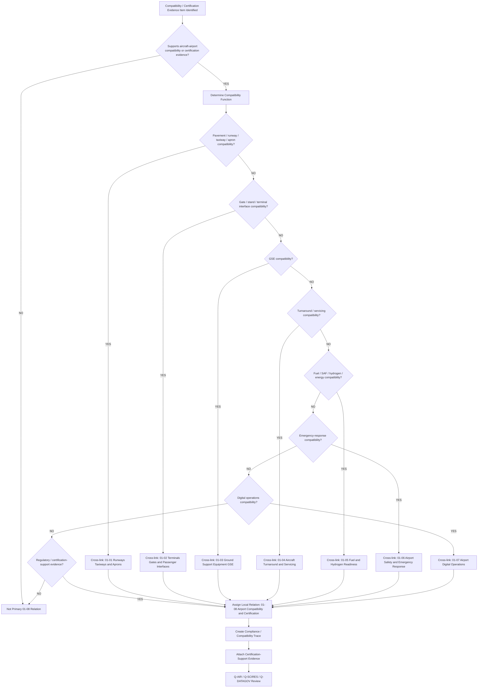
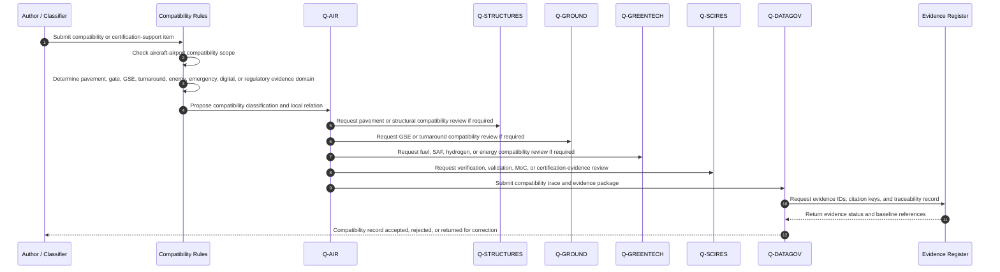
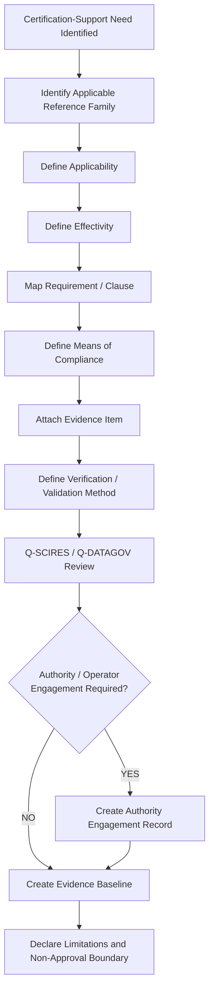
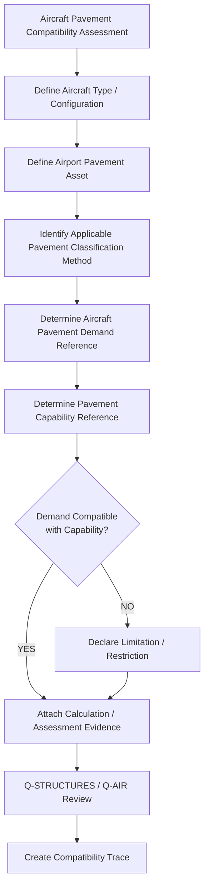
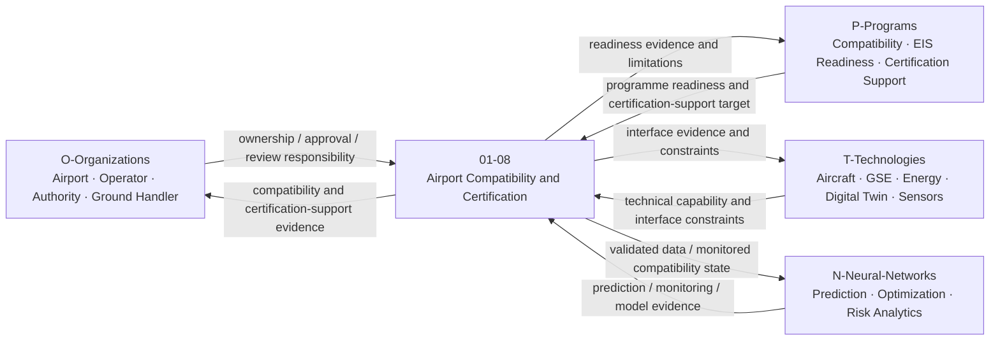
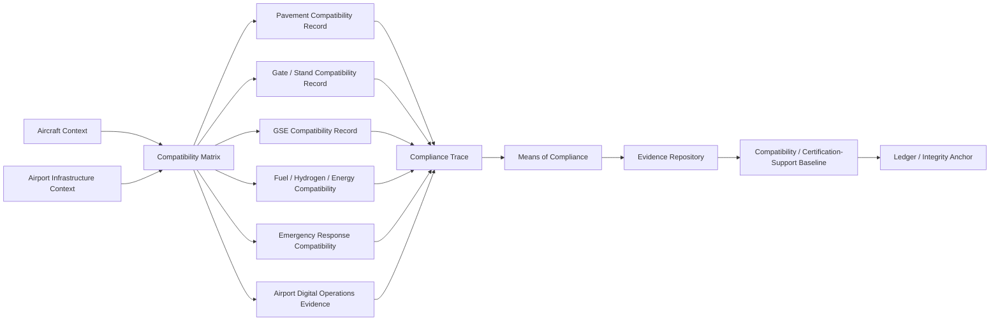

# 01-08-Airport-Compatibility-and-Certification — Airport Compatibility and Certification

## Purpose

Aircraft pavement classification, gate compatibility, and regulatory certification evidence.

This document defines the classification boundary, infrastructure scope, compatibility logic, certification-evidence model, lifecycle governance, and traceability model for aircraft-airport compatibility and airport certification-support evidence under:

```text
IDEALE-ESG/A-Aerospace/I-Infrastructures/01-Airports/
```

## Parent

[`README.md`](README.md) — `IDEALE-ESG/A-Aerospace/I-Infrastructures/01-Airports/`

---

# 1. Scope

`01-08-Airport-Compatibility-and-Certification` covers airport-side compatibility and certification-support evidence required to assess whether an aircraft, aircraft configuration, airport asset, operational mode, energy interface, gate interface, or ground-support configuration can be safely and traceably accommodated at airport level.

This document covers the infrastructure classification and evidence-governance layer.

It does not replace formal airport certification, aircraft certification, authority approval, aerodrome manual approval, flight operations approval, airport operating procedures, or aircraft type-design documentation.

It provides controlled taxonomy logic for:

- aircraft pavement compatibility;
- pavement classification records;
- runway compatibility;
- taxiway compatibility;
- apron compatibility;
- stand compatibility;
- gate compatibility;
- passenger boarding bridge compatibility;
- terminal-aircraft interface compatibility;
- GSE compatibility;
- turnaround compatibility;
- fuel, SAF, hydrogen, LH2, charging, or energy-readiness compatibility;
- emergency-response compatibility;
- airport digital operations compatibility;
- aircraft-airport compatibility matrices;
- regulatory reference mapping;
- means-of-compliance evidence;
- compliance trace records;
- authority-engagement records;
- certification-support packages;
- operational-readiness evidence;
- compatibility and certification traceability.

---

# 2. Controlled Definition

For this taxonomy, **airport compatibility and certification evidence** is:

> The controlled evidence set used to demonstrate, support, or assess whether airport infrastructure, airport operations, airport assets, airport digital systems, and airport emergency-response capabilities are compatible with a defined aircraft, aircraft configuration, operational scenario, energy carrier, lifecycle phase, jurisdiction, and regulatory reference family.

Compatibility evidence is not equivalent to approval.

Certification-support evidence is not equivalent to certification.

A controlled compatibility record shall state:

```text
compatibility assessed ≠ compliance approved
certification-support evidence ≠ authority certification
readiness evidence ≠ operational authorization
```

---

# 3. Infrastructure Boundary

## 3.1 Included

This document includes:

- aircraft-airport compatibility records;
- runway compatibility evidence;
- taxiway compatibility evidence;
- apron and stand compatibility evidence;
- pavement classification evidence;
- aircraft reference code context;
- gate compatibility records;
- boarding bridge compatibility records;
- terminal-aircraft interface compatibility;
- GSE compatibility evidence;
- turnaround and minimum ground time compatibility evidence;
- fuel and hydrogen readiness compatibility evidence;
- emergency-response compatibility evidence;
- digital operations compatibility evidence;
- airport certification-support evidence packages;
- regulatory reference mapping;
- compliance trace records;
- means-of-compliance records;
- authority-engagement records;
- evidence baselines;
- traceability records.

## 3.2 Excluded

This document does not include:

- aircraft type-certification approval;
- airport certification approval;
- authority-approved compliance findings;
- detailed aircraft performance calculations;
- detailed pavement structural calculations;
- detailed gate planning drawings;
- detailed airport master planning;
- detailed airport operating procedures;
- airline operational approvals;
- detailed safety case approvals;
- detailed hydrogen approval packages;
- regulator-issued certificates.

Excluded items may be referenced when they support compatibility classification, applicability, effectivity, evidence packaging, or regulatory traceability.

---

# 4. Compatibility and Certification Asset Classes

| Class | Description | Primary Classification |
|---|---|---|
| Aircraft-Airport Compatibility Matrix | Matrix linking aircraft configuration to airport infrastructure constraints and evidence. | `01-Airports` / `01-08` |
| Pavement Classification Record | Record linking aircraft pavement demand to runway, taxiway, apron, or stand pavement capability. | `01-Airports` / `01-08`; cross-link `01-01` |
| Runway Compatibility Record | Evidence record for runway length, width, surface, obstacle, lighting, markings, and operational compatibility. | `01-Airports` / `01-08`; cross-link `01-01` |
| Taxiway Compatibility Record | Evidence record for taxi route, clearance, turning, width, shoulder, bridge, and pavement compatibility. | `01-Airports` / `01-08`; cross-link `01-01` |
| Apron and Stand Compatibility Record | Evidence record for parking, servicing, clearance, GSE access, safety zones, and stand operation. | `01-Airports` / `01-08`; cross-link `01-01` |
| Gate Compatibility Record | Evidence record for gate geometry, boarding, passenger flow, aircraft-door interface, and turnaround support. | `01-Airports` / `01-08`; cross-link `01-02` |
| Boarding Bridge Compatibility Record | Evidence record for bridge reach, door interface, slope, clearance, and operational constraints. | `01-Airports` / `01-08`; cross-link `01-02` |
| GSE Compatibility Record | Evidence record for aircraft-to-GSE physical, electrical, pneumatic, thermal, digital, or operational interfaces. | `01-Airports` / `01-08`; cross-link `01-03` |
| Turnaround Compatibility Record | Evidence record for ground-time, service sequence, critical path, GSE allocation, passenger flow, and dispatch readiness. | `01-Airports` / `01-08`; cross-link `01-04` |
| Fuel and Hydrogen Compatibility Record | Evidence record for fuel, SAF, hydrogen, LH2, charging, or airport energy interface compatibility. | `01-Airports` / `01-08`; cross-link `01-05` and `07` |
| Emergency Response Compatibility Record | Evidence record for RFF, emergency access, response category, safety zones, and incident-readiness context. | `01-Airports` / `01-08`; cross-link `01-06` and `09` |
| Digital Operations Compatibility Record | Evidence record for A-CDM, AODB, dashboard, digital twin, data exchange, cyber-physical, or AI-enabled airport operations. | `01-Airports` / `01-08`; cross-link `01-07` and `08` |
| Compliance Trace Record | Record linking reference family, clause, requirement, means of compliance, evidence item, and review status. | `01-Airports` / `01-08` |
| Certification-Support Evidence Package | Controlled package supporting certification, authority engagement, operational approval, or programme review. | `01-Airports` / `01-08` |
| Authority Engagement Record | Record of engagement with authority, regulator, airport operator, or certification stakeholder. | `01-Airports` / `01-08` |

---

# 5. Classification Rules

## RULE-I-INFRA-AIR-ACC-001 — Compatibility Function Rule

An asset, matrix, record, or evidence package shall be linked to `01-08-Airport-Compatibility-and-Certification` when its primary function is to assess, support, document, or govern compatibility between aircraft and airport infrastructure.

## RULE-I-INFRA-AIR-ACC-002 — Certification-Support Rule

A record shall be linked to `01-08` when its purpose is to support regulatory mapping, certification evidence, operational approval evidence, authority engagement, compliance traceability, or means-of-compliance organization.

## RULE-I-INFRA-AIR-ACC-003 — Pavement Classification Rule

Pavement compatibility records shall identify the applicable pavement classification method required by the governing reference family, jurisdiction, and programme baseline.

The record shall preserve:

1. aircraft pavement demand reference;
2. pavement classification reference;
3. runway, taxiway, apron, or stand asset ID;
4. applicability;
5. effectivity;
6. calculation or assessment evidence;
7. assumptions;
8. limitations;
9. authority or reviewer status.

The method may include current or legacy pavement rating schemes according to jurisdiction and applicability.

## RULE-I-INFRA-AIR-ACC-004 — Runway Compatibility Rule

Runway compatibility records shall assess whether the airport runway context can support the defined aircraft or operational scenario.

Minimum compatibility domains:

- runway physical characteristics;
- pavement capability;
- approach and departure context;
- declared distances context;
- markings and lighting context;
- obstacle or limitation context;
- operational restrictions;
- emergency response implications;
- evidence and traceability.

## RULE-I-INFRA-AIR-ACC-005 — Taxiway Compatibility Rule

Taxiway compatibility records shall assess whether aircraft ground movement between runway, apron, stand, terminal, hangar, or service area is supported.

Minimum compatibility domains:

- taxiway width context;
- shoulder context;
- turning geometry;
- clearance envelope;
- pavement capability;
- bridge or culvert limitation, if applicable;
- routing constraints;
- operational restrictions;
- evidence and traceability.

## RULE-I-INFRA-AIR-ACC-006 — Apron and Stand Compatibility Rule

Apron and stand compatibility records shall assess whether the aircraft can be parked, serviced, turned around, boarded, refuelled, powered, loaded, unloaded, inspected, and dispatched in the assigned airport context.

Minimum compatibility domains:

- stand geometry;
- aircraft clearance envelope;
- pavement capability;
- docking or stand guidance;
- GSE access;
- passenger boarding interface;
- fuel or energy interface;
- safety-zone constraints;
- turnaround compatibility;
- emergency access;
- evidence and traceability.

## RULE-I-INFRA-AIR-ACC-007 — Gate Compatibility Rule

Gate compatibility records shall assess the interface between aircraft, gate, passenger boarding bridge, terminal, passenger flow, stand geometry, turnaround flow, and safety constraints.

Minimum compatibility domains:

- aircraft door interface;
- boarding bridge reach;
- bridge slope and clearance context;
- gate holding capacity;
- passenger flow;
- PRM/accessibility support;
- stand and apron geometry;
- GSE and servicing access;
- safety and emergency egress;
- evidence and traceability.

## RULE-I-INFRA-AIR-ACC-008 — GSE Compatibility Rule

GSE compatibility shall be declared when aircraft-airport compatibility depends on aircraft-to-equipment interfaces.

Required GSE compatibility evidence may include:

- pushback interface;
- towing interface;
- GPU interface;
- PCA interface;
- air-start interface;
- cargo loader interface;
- baggage loader interface;
- passenger stairs interface;
- catering interface;
- lavatory service interface;
- potable-water service interface;
- de-icing interface;
- clearance and maneuvering envelope;
- energy mode;
- maintenance or servicing evidence.

## RULE-I-INFRA-AIR-ACC-009 — Turnaround Compatibility Rule

Turnaround compatibility records shall identify whether the airport infrastructure can support the target turnaround concept, servicing sequence, minimum ground time, and dispatch-readiness criteria.

Minimum domains:

- required activities;
- parallelization constraints;
- critical-path activities;
- GSE availability;
- passenger-flow constraints;
- energy or refuelling constraints;
- safety-zone constraints;
- digital monitoring availability;
- exception logic;
- evidence and traceability.

## RULE-I-INFRA-AIR-ACC-010 — Fuel, SAF, Hydrogen, and Energy Compatibility Rule

Energy compatibility records shall identify whether the airport can support the energy carrier and interface required by the aircraft, GSE, or turnaround scenario.

Energy compatibility may include:

- conventional fuel;
- SAF;
- LH2;
- gaseous hydrogen;
- electrical charging;
- ground power;
- future energy carriers.

Hydrogen or LH2 compatibility shall include safety-zone, emergency-isolation, leak-detection, venting, cryogenic, authority-engagement, and evidence status.

## RULE-I-INFRA-AIR-ACC-011 — Emergency Response Compatibility Rule

Airport compatibility records shall identify whether emergency response capability is compatible with the defined aircraft, operational scenario, energy carrier, passenger load, stand configuration, or airport area.

Emergency response compatibility may include:

- RFF/ARFF readiness;
- response access routes;
- fire-water or extinguishing-agent support;
- incident command interface;
- medical response interface;
- evacuation and assembly areas;
- fuel or hydrogen emergency response;
- wildlife or bird-strike mitigation;
- evidence and traceability.

## RULE-I-INFRA-AIR-ACC-012 — Digital Compatibility Rule

Digital compatibility records shall identify whether airport digital operations can support the defined aircraft, operational scenario, turnaround concept, energy-readiness concept, safety monitoring, or evidence process.

Digital compatibility may include:

- A-CDM milestones;
- AODB data availability;
- dashboard visibility;
- resource allocation data;
- turnaround monitoring;
- GSE telemetry;
- fuel and hydrogen monitoring;
- emergency-response data;
- digital twin model;
- AI/ML inference;
- evidence repository;
- data-quality evidence.

## RULE-I-INFRA-AIR-ACC-013 — Applicability and Effectivity Rule

No compatibility statement shall be accepted without applicability and effectivity.

Required effectivity may include:

- aircraft type;
- aircraft configuration;
- airport;
- runway;
- taxiway;
- apron;
- stand;
- gate;
- GSE configuration;
- fuel or energy configuration;
- passenger configuration;
- operational scenario;
- jurisdiction;
- temporal validity;
- digital baseline.

## RULE-I-INFRA-AIR-ACC-014 — Compliance Trace Rule

A certification-support record shall include a compliance trace when it invokes a regulatory, standards, authority, or programme requirement.

Minimum compliance trace:

1. reference family;
2. clause or requirement identifier;
3. applicability statement;
4. means of compliance;
5. evidence item;
6. verification method;
7. review state;
8. approval or authority-engagement state.

## RULE-I-INFRA-AIR-ACC-015 — No Approval-by-Reference Rule

No compatibility or certification-support document shall claim compliance, certification, operational approval, or authority acceptance solely by referencing standards or regulations.

Approval requires jurisdiction-specific, programme-specific, authority-accepted evidence.

---

# 6. Compatibility Classification Logic

## 6.1 Airport Compatibility Classification Flow



## 6.2 Compatibility Evidence Sequence Diagram



## 6.3 Certification-Support Logic



## 6.4 Pavement Compatibility Logic



## 6.5 Rule Priority Logic

```yaml
airport_compatibility_certification_logic:
  scope_gate:
    condition: "item.domain == 'A-Aerospace' and item.airport_context == true and item.supports_compatibility_or_certification_evidence == true"
    result_if_false: "not_primary_01_08_relation"

  compatibility_domains:
    pavement:
      condition: "item.compatibility_domain in ['runway', 'taxiway', 'apron', 'stand', 'pavement']"
      required_cross_link: "01-01-Runways-Taxiways-and-Aprons"

    gate_terminal:
      condition: "item.compatibility_domain in ['gate', 'terminal', 'boarding_bridge', 'passenger_interface']"
      required_cross_link: "01-02-Terminals-Gates-and-Passenger-Interfaces"

    GSE:
      condition: "item.compatibility_domain in ['GSE', 'pushback', 'GPU', 'PCA', 'loader', 'servicing_equipment']"
      required_cross_link: "01-03-Ground-Support-Equipment-GSE"

    turnaround:
      condition: "item.compatibility_domain in ['turnaround', 'minimum_ground_time', 'servicing_sequence', 'dispatch_readiness']"
      required_cross_link: "01-04-Aircraft-Turnaround-and-Servicing"

    energy:
      condition: "item.compatibility_domain in ['fuel', 'SAF', 'hydrogen', 'LH2', 'GH2', 'charging', 'ground_power']"
      required_cross_link: "01-05-Fuel-and-Hydrogen-Readiness"

    emergency:
      condition: "item.compatibility_domain in ['RFF', 'ARFF', 'emergency_access', 'safety_zone', 'bird_strike', 'wildlife_hazard']"
      required_cross_link: "01-06-Airport-Safety-and-Emergency-Response"

    digital:
      condition: "item.compatibility_domain in ['A-CDM', 'AODB', 'dashboard', 'digital_twin', 'operational_data', 'AI_ML']"
      required_cross_link: "01-07-Airport-Digital-Operations"

  certification_support:
    condition: "item.invokes_regulatory_or_certification_reference == true"
    required_outputs:
      - "compliance_trace"
      - "means_of_compliance"
      - "evidence_item"
      - "verification_method"
      - "review_status"
      - "approval_boundary_statement"

  evidence_required:
    - compatibility_record_id
    - aircraft_context
    - airport_context
    - compatibility_domain
    - applicability
    - effectivity
    - reference_family
    - evidence_items
    - reviewer
    - approval_boundary_statement
    - traceability_record
```

---

# 7. Aircraft-Airport Compatibility Record

```yaml
aircraft_airport_compatibility_record:
  compatibility_record_id: ""
  aircraft_context:
    aircraft_type: ""
    aircraft_configuration: ""
    aircraft_variant: ""
    operational_scenario: ""
  airport_context:
    airport_id: ""
    runway_id: ""
    taxiway_id: ""
    apron_id: ""
    stand_id: ""
    gate_id: ""

  classification:
    domain: "A-Aerospace"
    opt_in_axis: "I-Infrastructures"
    section: "01-Airports"
    local_node: "01-08-Airport-Compatibility-and-Certification"
    primary_classification: "01-Airports"
    secondary_classifications:
      - ""

  compatibility_domains:
    pavement: false
    runway: false
    taxiway: false
    apron: false
    stand: false
    gate: false
    GSE: false
    turnaround: false
    fuel_energy: false
    emergency_response: false
    digital_operations: false

  compatibility_status:
    status: "controlled-candidate"
    result: ""
    limitations:
      - ""
    restrictions:
      - ""
    assumptions:
      - ""

  applicability:
    applies_to:
      - ""
    does_not_apply_to:
      - ""

  effectivity:
    aircraft_effectivity: ""
    airport_effectivity: ""
    runway_effectivity: ""
    stand_effectivity: ""
    gate_effectivity: ""
    GSE_effectivity: ""
    energy_configuration_effectivity: ""
    operational_effectivity: ""
    temporal_effectivity: ""
    jurisdiction_effectivity: ""
    digital_effectivity: ""

  evidence:
    evidence_items:
      - evidence_id: ""
        evidence_class: ""
        evidence_status: ""

  review:
    responsible_q_division: "Q-AIR"
    supporting_q_divisions:
      - "Q-DATAGOV"
      - "Q-SCIRES"
    reviewer: ""
    review_status: ""
    authority_engagement_required: false

  traceability:
    upstream:
      - ""
    downstream:
      - ""
```

---

# 8. Pavement Compatibility Record

```yaml
pavement_compatibility_record:
  pavement_record_id: ""
  aircraft_context:
    aircraft_type: ""
    aircraft_configuration: ""
    mass_or_loading_context: ""
    landing_gear_context: ""
  pavement_asset:
    airport_id: ""
    asset_id: ""
    asset_type:
      - "runway"
      - "taxiway"
      - "apron"
      - "stand"
    asset_name: ""

  classification_method:
    method_name: ""
    method_version_or_reference: ""
    jurisdiction_context: ""
    legacy_method_applicable: false

  compatibility_assessment:
    aircraft_pavement_demand_reference: ""
    pavement_capability_reference: ""
    comparison_result: ""
    limitations:
      - ""
    restrictions:
      - ""
    assumptions:
      - ""

  evidence:
    calculation_evidence_id: ""
    inspection_evidence_id: ""
    pavement_condition_evidence_id: ""
    review_evidence_id: ""

  effectivity:
    aircraft_effectivity: ""
    pavement_asset_effectivity: ""
    configuration_effectivity: ""
    temporal_effectivity: ""
    jurisdiction_effectivity: ""

  review:
    Q_STRUCTURES_review_required: true
    Q_AIR_review_required: true
    Q_SCIRES_review_required: false
    approval_status: "controlled-candidate"
```

---

# 9. Gate and Stand Compatibility Record

```yaml
gate_stand_compatibility_record:
  compatibility_record_id: ""
  aircraft_context:
    aircraft_type: ""
    aircraft_configuration: ""
    door_configuration: ""
    passenger_capacity_context: ""
  airport_context:
    airport_id: ""
    terminal_id: ""
    gate_id: ""
    stand_id: ""
    apron_id: ""

  geometry:
    stand_geometry_context: ""
    clearance_envelope_context: ""
    jet_bridge_reach_context: ""
    door_interface_context: ""
    ground_marking_context: ""

  operations:
    passenger_boarding_method: ""
    remote_stand_operation: false
    GSE_access_required: true
    turnaround_dependency: true
    emergency_access_required: true

  compatibility_status:
    result: ""
    limitations:
      - ""
    restrictions:
      - ""

  evidence:
    - evidence_id: ""
      evidence_class: "compatibility-evidence"
```

---

# 10. Certification-Support Record

```yaml
certification_support_record:
  certification_support_id: ""
  title: ""
  purpose: ""
  airport_context: ""
  aircraft_context: ""
  operational_context: ""

  reference_mapping:
    - citation_key: ""
      reference_title: ""
      clause_or_requirement: ""
      applicability_basis: ""

  means_of_compliance:
    moc_id: ""
    moc_type:
      - "inspection"
      - "analysis"
      - "test"
      - "demonstration"
      - "simulation"
      - "document-review"
      - "data-review"
      - "model-validation"
    description: ""

  evidence:
    evidence_items:
      - evidence_id: ""
        evidence_class: ""
        evidence_status: ""
        repository_path: ""

  verification:
    verification_method: ""
    verification_result: ""
    verification_status: ""

  validation:
    validation_required: false
    validation_context: ""
    validation_status: ""

  authority_engagement:
    required: false
    authority_or_stakeholder: ""
    engagement_status: ""
    engagement_record_id: ""

  approval_boundary:
    compliance_claimed: false
    approval_claimed: false
    boundary_statement: "Certification-support evidence only. Authority approval not implied."

  traceability:
    upstream:
      - ""
    downstream:
      - ""
```

---

# 11. Compliance Trace Template

```yaml
airport_compliance_trace:
  compliance_trace_id: ""
  compatibility_record_id: ""
  certification_support_id: ""

  source_reference:
    citation_key: ""
    issuing_body: ""
    reference_title: ""
    clause_or_requirement: ""
    jurisdiction_context: ""

  applicability:
    aircraft_context: ""
    airport_context: ""
    operational_context: ""
    applicability_basis: ""

  effectivity:
    aircraft_effectivity: ""
    airport_effectivity: ""
    infrastructure_effectivity: ""
    configuration_effectivity: ""
    temporal_effectivity: ""
    jurisdiction_effectivity: ""

  means_of_compliance:
    moc_id: ""
    moc_type: ""
    moc_description: ""

  evidence:
    evidence_id: ""
    evidence_class: ""
    evidence_status: ""

  review:
    reviewer: ""
    review_status: ""
    findings:
      - finding_id: ""
        severity: ""
        description: ""
        disposition: ""

  approval_boundary:
    status: "not-authority-approved"
    statement: "This trace supports evidence organization and does not constitute approval."

  downstream_use:
    - ""
```

---

# 12. Compatibility Matrix Template

```yaml
airport_compatibility_matrix:
  matrix_id: ""
  matrix_title: ""
  aircraft_context: ""
  airport_context: ""
  version: "0.1.0"
  status: "controlled-candidate"

  rows:
    - compatibility_domain: "pavement"
      infrastructure_asset_id: ""
      requirement_or_constraint: ""
      evidence_id: ""
      result: ""
      limitation: ""
      responsible_q_division: "Q-STRUCTURES"

    - compatibility_domain: "gate"
      infrastructure_asset_id: ""
      requirement_or_constraint: ""
      evidence_id: ""
      result: ""
      limitation: ""
      responsible_q_division: "Q-AIR"

    - compatibility_domain: "GSE"
      infrastructure_asset_id: ""
      requirement_or_constraint: ""
      evidence_id: ""
      result: ""
      limitation: ""
      responsible_q_division: "Q-GROUND"

    - compatibility_domain: "energy"
      infrastructure_asset_id: ""
      requirement_or_constraint: ""
      evidence_id: ""
      result: ""
      limitation: ""
      responsible_q_division: "Q-GREENTECH"

    - compatibility_domain: "emergency_response"
      infrastructure_asset_id: ""
      requirement_or_constraint: ""
      evidence_id: ""
      result: ""
      limitation: ""
      responsible_q_division: "Q-AIR"

    - compatibility_domain: "digital_operations"
      infrastructure_asset_id: ""
      requirement_or_constraint: ""
      evidence_id: ""
      result: ""
      limitation: ""
      responsible_q_division: "Q-DATAGOV"
```

---

# 13. Interfaces with OPT-IN Axes

| OPT-IN Axis | Interface with Airport Compatibility and Certification |
|---|---|
| `O-Organizations` | Airport operator, aircraft operator, airline, regulator, authority, ground handler, fuel provider, hydrogen provider, emergency services, certification team. |
| `P-Programs` | Airport compatibility campaign, aircraft entry-into-service readiness, certification-support campaign, hydrogen-readiness programme, airport modernization programme. |
| `T-Technologies` | Aircraft systems, GSE, pavement assessment methods, hydrogen systems, SAF systems, digital twins, monitoring systems, emergency-response technologies. |
| `I-Infrastructures` | Runways, taxiways, aprons, stands, terminals, gates, GSE, fuel/hydrogen infrastructure, safety systems, digital systems. |
| `N-Neural-Networks` | Compatibility prediction, pavement degradation inference, turnaround optimization, gate allocation, energy-readiness prediction, safety-risk analytics. |

## 13.1 OPT-IN Interface Diagram



---

# 14. Q-Division Governance

| Q-Division | Governance Role |
|---|---|
| `Q-AIR` | Primary owner for airport compatibility, aircraft-airport operational compatibility, runway/taxiway/apron/gate/stand readiness, and airport certification-support classification. |
| `Q-DATAGOV` | Controls naming, traceability, evidence records, compliance traces, digital thread, canonical paths, certification-support packages, and publication readiness. |
| `Q-SCIRES` | Supports verification, validation, means of compliance, certification-feasibility review, evidence adequacy, and authority-engagement context. |
| `Q-STRUCTURES` | Supports pavement compatibility, pavement classification, load-bearing infrastructure, structural asset evidence, and movement-area physical compatibility. |
| `Q-GROUND` | Supports GSE, turnaround, servicing, ground-handling, stand operations, and dispatch-readiness compatibility. |
| `Q-GREENTECH` | Supports fuel, SAF, hydrogen, LH2, charging, energy-readiness, and hydrogen safety compatibility. |
| `Q-HPC` | Supports compatibility simulation, digital twin analysis, optimization, prediction, and computational evidence. |
| `Q-MECHANICS` | Supports mechanical interfaces, boarding bridge mechanisms, servicing interfaces, couplings, tooling, and maintainability constraints. |

---

# 15. Lifecycle Applicability

| Lifecycle Phase | Airport Compatibility and Certification Role |
|---|---|
| `LC01` | Define airport compatibility and certification-support scope, aircraft-airport boundary, and evidence intent. |
| `LC02` | Define compatibility requirements, regulatory reference families, authority expectations, and evidence needs. |
| `LC03` | Define compatibility architecture, compliance trace model, means-of-compliance map, and cross-node dependencies. |
| `LC04` | Develop preliminary compatibility assessments, assumptions, constraints, and readiness studies. |
| `LC05` | Produce detailed compatibility matrices, certification-support records, evidence packages, and limitation records. |
| `LC06` | Define verification, validation, inspection, analysis, simulation, test, and acceptance criteria. |
| `LC07` | Implement infrastructure modifications, compatibility updates, readiness packages, or evidence-gathering activities. |
| `LC08` | Integrate compatibility evidence across runway, taxiway, apron, gate, GSE, energy, emergency, and digital systems. |
| `LC09` | Commission compatibility baselines and establish handover evidence. |
| `LC10` | Support certification, operational approval, regulatory review, airport acceptance, or authority engagement. |
| `LC11` | Operate under defined compatibility limitations, restrictions, monitoring, and evidence controls. |
| `LC12` | Maintain compatibility evidence, inspect assets, update records, and preserve operational validity. |
| `LC13` | Upgrade, modify, expand, recertify, revalidate, or revise compatibility baselines. |
| `LC14` | Retire, archive, supersede, or decommission compatibility records and certification-support packages. |

---

# 16. Evidence Requirements

## 16.1 Minimum Evidence

Each controlled compatibility or certification-support record shall include:

1. compatibility record ID;
2. aircraft context;
3. airport context;
4. infrastructure asset context;
5. compatibility domain;
6. reference family;
7. applicability statement;
8. effectivity statement;
9. compatibility basis;
10. assumptions;
11. limitations;
12. evidence item list;
13. verification or validation method;
14. review status;
15. authority-engagement status, if required;
16. responsible Q-Division;
17. evidence footprint;
18. traceability record;
19. approval-boundary statement.

## 16.2 Evidence Classes

| Evidence Class | Use |
|---|---|
| `classification-evidence` | Supports assignment or relation to `01-08-Airport-Compatibility-and-Certification`. |
| `compatibility-evidence` | Supports aircraft-airport compatibility assessment. |
| `pavement-evidence` | Supports pavement classification, pavement capability, condition, and aircraft demand assessment. |
| `gate-compatibility-evidence` | Supports gate, stand, boarding bridge, terminal interface, and passenger flow compatibility. |
| `GSE-compatibility-evidence` | Supports GSE-to-aircraft and GSE-to-airport interface compatibility. |
| `turnaround-compatibility-evidence` | Supports minimum ground time, critical path, dispatch readiness, and servicing compatibility. |
| `energy-compatibility-evidence` | Supports fuel, SAF, hydrogen, LH2, charging, or ground-power compatibility. |
| `emergency-response-evidence` | Supports RFF/ARFF, emergency access, safety-zone, and incident-response compatibility. |
| `digital-compatibility-evidence` | Supports A-CDM, AODB, dashboard, digital twin, evidence repository, and data-quality compatibility. |
| `certification-evidence` | Supports regulatory, authority, programme, or airport certification-support context. |
| `means-of-compliance-evidence` | Supports MoC mapping and verification evidence. |
| `authority-engagement-evidence` | Supports engagement with regulator, authority, airport operator, or certification stakeholder. |
| `limitation-evidence` | Supports limitations, restrictions, deviations, or unresolved findings. |
| `baseline-evidence` | Supports approved compatibility baseline or evidence package release. |

## 16.3 Evidence Package Template

```yaml
airport_compatibility_certification_evidence_package:
  package_id: ""
  package_title: ""
  infrastructure_section: "01-Airports"
  local_node: "01-08-Airport-Compatibility-and-Certification"
  compatibility_record_id: ""
  certification_support_id: ""
  aircraft_context: ""
  airport_id: ""
  owner: "Q-AIR"

  supporting_q_divisions:
    - "Q-DATAGOV"
    - "Q-SCIRES"
    - "Q-STRUCTURES"
    - "Q-GROUND"
    - "Q-GREENTECH"

  lifecycle_phase: ""

  applicability:
    applies_to:
      - ""
    does_not_apply_to:
      - ""

  effectivity:
    aircraft_effectivity: ""
    airport_effectivity: ""
    infrastructure_effectivity: ""
    operational_effectivity: ""
    energy_configuration_effectivity: ""
    digital_baseline_effectivity: ""
    temporal_effectivity: ""
    jurisdiction_effectivity: ""

  compatibility_scope:
    pavement: false
    runway: false
    taxiway: false
    apron: false
    stand: false
    gate: false
    GSE: false
    turnaround: false
    fuel_energy: false
    emergency_response: false
    digital_operations: false

  evidence_items:
    - evidence_id: ""
      evidence_class: ""
      title: ""
      status: ""
      repository_path: ""

  compliance_traces:
    - compliance_trace_id: ""
      citation_key: ""
      clause_or_requirement: ""
      evidence_id: ""
      review_status: ""

  approval_boundary:
    compliance_claimed: false
    authority_approval_claimed: false
    statement: "Certification-support evidence only. Authority approval not implied."

  traceability:
    upstream:
      - ""
    downstream:
      - ""

  review:
    reviewer: ""
    approval_status: ""
```

---

# 17. Digital Thread

Airport compatibility and certification-support evidence shall be maintained through a controlled digital thread linking infrastructure assets, aircraft contexts, evidence packages, compliance traces, means of compliance, review findings, limitations, and baselines.

Digital-thread interfaces may include:

- airport compatibility matrix;
- pavement classification record;
- gate compatibility record;
- stand compatibility record;
- GSE compatibility record;
- energy compatibility record;
- emergency-response compatibility record;
- A-CDM or AODB evidence;
- airport digital twin;
- compliance trace register;
- authority-engagement register;
- certification-support evidence repository;
- limitation and deviation register;
- evidence baseline;
- ledger or integrity anchor.

## 17.1 Compatibility and Certification Digital Thread Diagram



---

# 18. Classification Examples

## 18.1 Pavement Compatibility Record

```yaml
asset:
  asset_name: "Runway Pavement Compatibility Record"
  asset_type: "pavement compatibility evidence"
  primary_function: "assess aircraft pavement demand against runway pavement capability"
  primary_classification:
    section_code: "01"
    section_name: "Airports"
    local_node: "01-08-Airport-Compatibility-and-Certification"
  secondary_classifications:
    - section_code: "01-01"
      section_name: "Runways Taxiways and Aprons"
      relation: "Runway pavement asset context"
  evidence:
    - evidence_class: "pavement-evidence"
    - evidence_class: "compatibility-evidence"
```

## 18.2 Gate Compatibility Record

```yaml
asset:
  asset_name: "Gate A12 Compatibility Record"
  asset_type: "gate compatibility evidence"
  primary_function: "assess aircraft gate, boarding bridge, passenger flow, and stand interface compatibility"
  primary_classification:
    section_code: "01"
    section_name: "Airports"
    local_node: "01-08-Airport-Compatibility-and-Certification"
  secondary_classifications:
    - section_code: "01-02"
      section_name: "Terminals Gates and Passenger Interfaces"
      relation: "Gate and passenger-interface context"
  evidence:
    - evidence_class: "gate-compatibility-evidence"
    - evidence_class: "compatibility-evidence"
```

## 18.3 GSE Compatibility Record

```yaml
asset:
  asset_name: "Ground Power Unit Compatibility Record"
  asset_type: "GSE compatibility evidence"
  primary_function: "assess aircraft ground power interface compatibility"
  primary_classification:
    section_code: "01"
    section_name: "Airports"
    local_node: "01-08-Airport-Compatibility-and-Certification"
  secondary_classifications:
    - section_code: "01-03"
      section_name: "Ground Support Equipment GSE"
      relation: "GSE interface context"
  evidence:
    - evidence_class: "GSE-compatibility-evidence"
    - evidence_class: "compatibility-evidence"
```

## 18.4 Hydrogen Airport Compatibility Record

```yaml
asset:
  asset_name: "LH2 Airport Compatibility Record"
  asset_type: "hydrogen energy compatibility evidence"
  primary_function: "assess LH2 airport readiness, safety zones, emergency response, turnaround impact, and aircraft interface compatibility"
  primary_classification:
    section_code: "01"
    section_name: "Airports"
    local_node: "01-08-Airport-Compatibility-and-Certification"
  secondary_classifications:
    - section_code: "01-05"
      section_name: "Fuel and Hydrogen Readiness"
      relation: "Airport energy-readiness context"
    - section_code: "07"
      section_name: "Hydrogen and Energy Infrastructure"
      relation: "Hydrogen infrastructure context"
    - section_code: "09"
      section_name: "Safety, Security and Access Control"
      relation: "Hydrogen safety and emergency-response context"
  evidence:
    - evidence_class: "energy-compatibility-evidence"
    - evidence_class: "emergency-response-evidence"
    - evidence_class: "certification-evidence"
```

## 18.5 Certification-Support Evidence Package

```yaml
asset:
  asset_name: "Airport Certification-Support Evidence Package"
  asset_type: "certification-support package"
  primary_function: "organize compatibility evidence, compliance traces, means of compliance, limitations, and authority engagement state"
  primary_classification:
    section_code: "01"
    section_name: "Airports"
    local_node: "01-08-Airport-Compatibility-and-Certification"
  evidence:
    - evidence_class: "certification-evidence"
    - evidence_class: "means-of-compliance-evidence"
    - evidence_class: "authority-engagement-evidence"
```

---

# 19. Reference Map

| Citation Key | Applies To | Use in `01-08` |
|---|---|---|
| `ICAO-ANNEX14` | Aerodrome design and operations | Baseline international reference family for airport physical characteristics, compatibility, and aerodrome infrastructure context. |
| `ICAO-ANNEX19` | Safety management | Safety-management reference family for safety evidence and risk-based compatibility context. |
| `EASA-ADR` | EU aerodrome governance | EU aerodrome regulatory and administrative reference family. |
| `EASA-CS-ADR-DSN` | Aerodrome design specifications | Aerodrome design reference family for runway, taxiway, apron, stand, and physical compatibility context. |
| `FAA-PART-139` | US airport certification | US airport certification and operational safety reference family. |
| `FAA-AC-150-5335` | Pavement strength / aircraft operations on pavements | Pavement classification and aircraft-airport pavement compatibility reference family. |
| `EUROCONTROL-A-CDM` | Airport collaborative decision-making | Digital operational compatibility and milestone coordination context. |
| `IATA-AHM` | Airport handling | Ground-handling and GSE compatibility context. |
| `IATA-IGOM` | Ground operations | Standardized ground operations and servicing compatibility context. |
| `ISO-55000` | Asset management | Airport compatibility asset and lifecycle evidence reference family. |
| `ISO-31000` | Risk management | Compatibility risk, safety-risk, and limitation-management reference family. |
| `ISO-9001` | Quality management | General QMS reference family for controlled evidence, review, and traceability. |
| `IAQG-9100` | Aerospace QMS | Aviation, space, and defense QMS governance reference family. |
| `S1000D` | Technical publications | CSDB/IETP reference family for controlled publication-ready compatibility and certification-support data. |

---

# 20. Controlled References

## [ICAO-ANNEX14]

**ICAO Annex 14 — Aerodromes, Volume I, Aerodrome Design and Operations.**

Used as the international airport and aerodrome reference family for physical airport characteristics, pavement context, runway/taxiway/apron compatibility, and aerodrome infrastructure.

## [ICAO-ANNEX19]

**ICAO Annex 19 — Safety Management.**

Used as the international aviation safety-management reference family for risk-based compatibility evidence, safety governance, and safety-data context.

## [EASA-ADR]

**EASA Easy Access Rules for Aerodromes — Regulation (EU) No 139/2014.**

Used as the EU aerodrome regulatory reference family for airport governance, aerodrome certification context, administrative procedures, and operational requirements.

## [EASA-CS-ADR-DSN]

**EASA Certification Specifications and Guidance Material for Aerodrome Design.**

Used as the aerodrome design reference family for runway, taxiway, apron, stand, surface, marking, geometry, and compatibility context.

## [FAA-PART-139]

**14 CFR Part 139 — Certification of Airports.**

Used as the US airport certification reference family for airport certification, airport safety, operational readiness, and jurisdiction-specific applicability.

## [FAA-AC-150-5335]

**FAA Advisory Circular 150/5335 Series — Airport Pavement Design and Evaluation / Aircraft Data for Airport Pavement Design and Evaluation.**

Used as the US pavement compatibility reference family for pavement strength, aircraft pavement demand, and aircraft-airport pavement assessment context.

## [EUROCONTROL-A-CDM]

**EUROCONTROL Airport Collaborative Decision Making.**

Used as the airport collaborative decision-making reference family for operational compatibility, milestone coordination, turnaround predictability, and airport stakeholder integration.

## [IATA-AHM]

**IATA Airport Handling Manual.**

Used as the airport handling reference family for GSE, servicing, turnaround, and operational interface compatibility.

## [IATA-IGOM]

**IATA Ground Operations Manual.**

Used as the ground-operations reference family for standardized servicing, turnaround, and ramp operation compatibility context.

## [ISO-55000]

**ISO 55000 — Asset Management, Vocabulary, Overview and Principles.**

Used as the asset-management reference family for compatibility assets, infrastructure lifecycle, asset evidence, and controlled asset governance.

## [ISO-31000]

**ISO 31000 — Risk Management Guidelines.**

Used as the risk-management reference family for compatibility risks, safety constraints, limitations, restrictions, and operational risk governance.

## [ISO-9001]

**ISO 9001 — Quality Management Systems Requirements.**

Used as the general quality-management reference family for controlled evidence, review, audit, process governance, and traceability.

## [IAQG-9100]

**IAQG 9100 — Quality Management Systems Requirements for Aviation, Space and Defense Organizations.**

Used as the aerospace quality-management reference family for aviation, space, defense, supplier, maintenance, production, evidence, and lifecycle governance.

## [S1000D]

**S1000D — International Specification for Technical Publications Using a Common Source Database.**

Used as the technical-publication and CSDB reference family when compatibility or certification-support data requires controlled data modules, applicability, effectivity, publication readiness, or IETP integration.

---

# 21. Traceability Record

```yaml
airport_compatibility_certification_traceability_record:
  document_id: "IDEALE-ESG-A-AEROSPACE-I-INFRASTRUCTURES-01-08-AIRPORT-COMPATIBILITY-AND-CERTIFICATION"
  canonical_path: "IDEALE-ESG/A-Aerospace/I-Infrastructures/01-Airports/01-08-Airport-Compatibility-and-Certification.md"
  parent_path: "IDEALE-ESG/A-Aerospace/I-Infrastructures/01-Airports/"
  upstream:
    - "IDEALE-ESG-A-AEROSPACE-I-INFRASTRUCTURES-01-00-AIRPORTS-GENERAL"
    - "IDEALE-ESG-A-AEROSPACE-I-INFRASTRUCTURES-01-01-RUNWAYS-TAXIWAYS-AND-APRONS"
    - "IDEALE-ESG-A-AEROSPACE-I-INFRASTRUCTURES-01-02-TERMINALS-GATES-AND-PASSENGER-INTERFACES"
    - "IDEALE-ESG-A-AEROSPACE-I-INFRASTRUCTURES-01-03-GROUND-SUPPORT-EQUIPMENT-GSE"
    - "IDEALE-ESG-A-AEROSPACE-I-INFRASTRUCTURES-01-04-AIRCRAFT-TURNAROUND-AND-SERVICING"
    - "IDEALE-ESG-A-AEROSPACE-I-INFRASTRUCTURES-01-05-FUEL-AND-HYDROGEN-READINESS"
    - "IDEALE-ESG-A-AEROSPACE-I-INFRASTRUCTURES-01-06-AIRPORT-SAFETY-AND-EMERGENCY-RESPONSE"
    - "IDEALE-ESG-A-AEROSPACE-I-INFRASTRUCTURES-01-07-AIRPORT-DIGITAL-OPERATIONS"
    - "IDEALE-ESG-A-AEROSPACE-I-INFRASTRUCTURES-00-02-INFRASTRUCTURE-CLASSIFICATION-RULES"
    - "IDEALE-ESG-A-AEROSPACE-I-INFRASTRUCTURES-00-03-STANDARDS-AND-REGULATORY-REFERENCES"
    - "IDEALE-ESG-A-AEROSPACE-I-INFRASTRUCTURES-00-04-APPLICABILITY-AND-EFFECTIVITY"
    - "IDEALE-ESG-A-AEROSPACE-I-INFRASTRUCTURES-00-06-INTERFACES-WITH-OPTIN-AXES"
    - "IDEALE-ESG-A-AEROSPACE-I-INFRASTRUCTURES-00-07-TRACEABILITY-AND-EVIDENCE"
    - "IDEALE-ESG-A-AEROSPACE-I-INFRASTRUCTURES-00-08-NAMING-CONVENTIONS"
  downstream:
    - "01-09-Traceability-Governance-and-Evidence"
    - "06-Test-and-Certification-Infrastructure"
    - "07-Hydrogen-and-Energy-Infrastructure"
    - "08-Digital-Operational-Infrastructure"
    - "09-Safety-Security-and-Access-Control"
```

---

# 22. Footprints

## Semantic Footprint

```yaml
semantic_footprint:
  id: FP-SEM-I-INFRA-01-08
  subject: "Airport compatibility, aircraft-airport interface evidence, pavement classification, gate compatibility, and certification-support evidence"
  meaning_boundary:
    includes:
      - aircraft-airport compatibility
      - pavement compatibility
      - runway compatibility
      - taxiway compatibility
      - apron and stand compatibility
      - gate compatibility
      - boarding bridge compatibility
      - GSE compatibility
      - turnaround compatibility
      - fuel and hydrogen compatibility
      - emergency-response compatibility
      - digital operations compatibility
      - certification-support evidence
      - compliance traces
      - means of compliance
      - authority-engagement records
    excludes:
      - aircraft type-certification approval
      - airport certification approval
      - authority-issued compliance findings
      - detailed pavement structural calculations
      - detailed airport master planning
      - detailed operating procedures
      - regulator-issued certificates
```

## Taxonomy Footprint

```yaml
taxonomy_footprint:
  id: FP-TAX-I-INFRA-01-08
  hierarchy:
    root: "IDEALE-ESG"
    domain: "A-Aerospace"
    opt_in_axis: "I-Infrastructures"
    section: "01-Airports"
    document: "01-08-Airport-Compatibility-and-Certification"
```

## Lifecycle Footprint

```yaml
lifecycle_footprint:
  id: FP-LC-I-INFRA-01-08
  lifecycle_phase: "LC01"
  lifecycle_role: "Defines airport compatibility and certification-support evidence scope"
  exit_criteria:
    - compatibility scope defined
    - certification-support boundary defined
    - pavement compatibility logic defined
    - gate and stand compatibility records defined
    - compliance trace template provided
    - means-of-compliance model defined
    - compatibility matrix template provided
    - evidence requirements defined
    - digital-thread interfaces mapped
    - reference families mapped
```

## Compliance Footprint

```yaml
compliance_footprint:
  id: FP-COMP-I-INFRA-01-08
  reference_families:
    aerodromes:
      - "ICAO-ANNEX14"
      - "EASA-ADR"
      - "EASA-CS-ADR-DSN"
      - "FAA-PART-139"
    safety_management:
      - "ICAO-ANNEX19"
      - "ISO-31000"
    pavement_compatibility:
      - "FAA-AC-150-5335"
    airport_digital_operations:
      - "EUROCONTROL-A-CDM"
    ground_handling:
      - "IATA-AHM"
      - "IATA-IGOM"
    asset_management:
      - "ISO-55000"
    quality_management:
      - "ISO-9001"
      - "IAQG-9100"
    technical_publications:
      - "S1000D"
```

## Evidence Footprint

```yaml
evidence_footprint:
  id: FP-EVD-I-INFRA-01-08
  expected_evidence:
    - controlled markdown document
    - YAML frontmatter
    - canonical path
    - parent path
    - compatibility asset classes
    - classification rules
    - classification logic diagrams
    - compatibility evidence sequence diagram
    - certification-support logic diagram
    - pavement compatibility logic diagram
    - compatibility record template
    - pavement compatibility record template
    - gate and stand compatibility record template
    - certification-support record template
    - compliance trace template
    - compatibility matrix template
    - evidence package template
    - digital-thread diagram
    - reference map
    - traceability record
```

---

# 23. Governance Rule

Any child or derivative record under `01-08-Airport-Compatibility-and-Certification` shall declare:

1. compatibility domain;
2. aircraft context;
3. airport context;
4. infrastructure asset context;
5. applicability;
6. effectivity;
7. reference family;
8. compatibility basis;
9. assumptions;
10. limitations;
11. evidence item list;
12. verification or validation method;
13. review status;
14. authority-engagement status, if required;
15. primary Q-Division;
16. supporting Q-Divisions;
17. evidence footprint;
18. traceability record;
19. approval-boundary statement.

No airport compatibility or certification-support record shall claim regulatory, operational, airport-certification, aircraft-certification, safety, hydrogen, pavement, gate, GSE, digital, or authority compliance solely because it references ICAO, EASA, FAA, EUROCONTROL, IATA, ISO, IAQG, or S1000D material.

Compliance requires programme-specific, jurisdiction-specific, operator-specific, airport-specific, aircraft-specific, configuration-specific, and authority-accepted evidence.

---

# 24. Acceptance Criteria

This document is acceptable when:

- airport compatibility scope is defined;
- certification-support boundary is defined;
- included and excluded boundaries are stated;
- compatibility and certification asset classes are listed;
- classification rules are present;
- pavement compatibility logic is defined;
- gate and stand compatibility logic is defined;
- GSE, turnaround, energy, emergency, and digital compatibility links are defined;
- compliance trace template is included;
- certification-support record template is included;
- compatibility matrix template is included;
- approval-by-reference is prohibited;
- evidence requirements are defined;
- digital-thread interfaces are mapped;
- Q-Division responsibilities are declared;
- reference families are mapped;
- traceability records are provided;
- downstream airport, certification, energy, digital, safety, and evidence documents can reuse the structure without reinterpretation.

---

# 25. Summary

`01-08-Airport-Compatibility-and-Certification` defines the controlled taxonomy scope for aircraft-airport compatibility and certification-support evidence.

It covers pavement classification, runway compatibility, taxiway compatibility, apron and stand compatibility, gate compatibility, GSE compatibility, turnaround compatibility, fuel and hydrogen compatibility, emergency-response compatibility, airport digital compatibility, compliance traces, means of compliance, evidence packages, authority-engagement records, lifecycle governance, and traceability under `01-Airports`.
````
