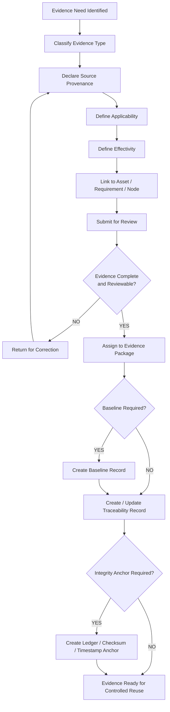
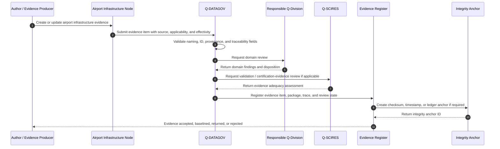
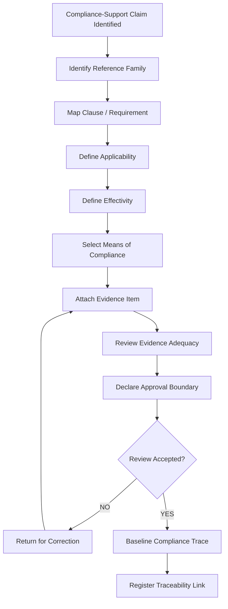
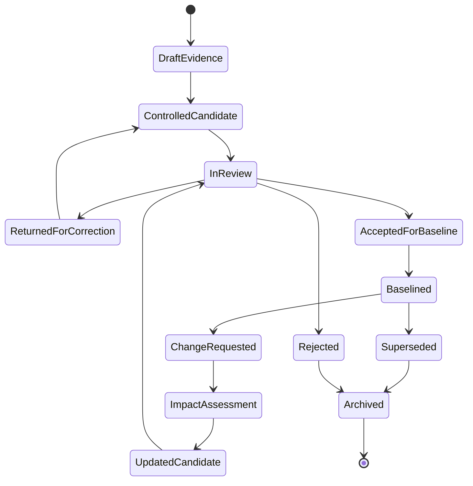
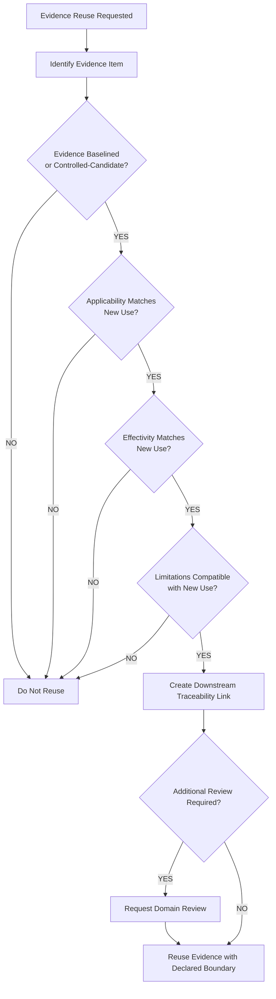
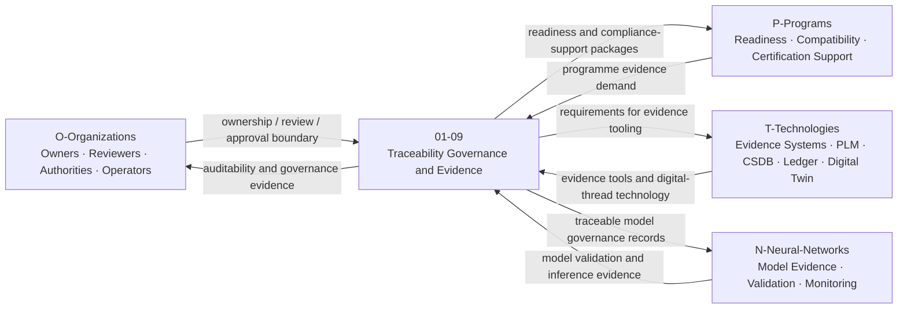
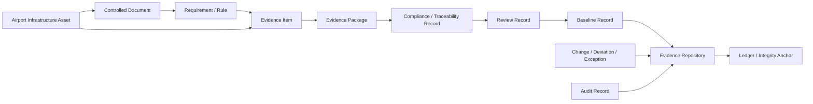

# 01-09-Traceability-Governance-and-Evidence — Traceability Governance and Evidence

## Purpose

Traceability and evidence management for airport infrastructure assets.

This document defines the traceability, governance, evidence packaging, review, auditability, lifecycle control, and digital-thread model for airport infrastructure assets under:

```text
IDEALE-ESG/A-Aerospace/I-Infrastructures/01-Airports/
```

## Parent

[`README.md`](README.md) — `IDEALE-ESG/A-Aerospace/I-Infrastructures/01-Airports/`

---

# 1. Scope

`01-09-Traceability-Governance-and-Evidence` covers the controlled records, evidence structures, traceability links, governance rules, review states, baselines, audit records, exception records, and digital-thread artefacts required to manage airport infrastructure documentation and evidence.

This document covers the infrastructure evidence-governance layer.

It does not replace authority-approved compliance packages, airport certification records, legal records, operational manuals, cybersecurity accreditation packages, or aircraft type-certification evidence.

It provides controlled taxonomy logic for:

- airport infrastructure traceability;
- evidence package structures;
- evidence item records;
- source provenance;
- applicability and effectivity traceability;
- lifecycle traceability;
- requirement-to-evidence links;
- asset-to-evidence links;
- compliance trace records;
- compatibility evidence links;
- review and approval records;
- baselines;
- change records;
- deviation records;
- exception records;
- audit records;
- evidence quality checks;
- digital-thread continuity;
- ledger or integrity-anchor interfaces;
- downstream reuse of evidence across airport infrastructure nodes.

---

# 2. Controlled Definition

For this taxonomy, **traceability governance and evidence management** is:

> The controlled process and data structure used to link airport infrastructure assets, requirements, applicability, effectivity, lifecycle phase, references, assumptions, limitations, reviews, evidence items, compliance traces, baselines, changes, and downstream reuse into an auditable digital thread.

Traceability evidence is not equivalent to compliance approval.

Evidence packaging is not equivalent to certification.

A controlled evidence record shall state:

```text
evidence organized ≠ compliance approved
traceability established ≠ authority acceptance
review complete ≠ certification granted
```

---

# 3. Infrastructure Boundary

## 3.1 Included

This document includes:

- airport infrastructure evidence records;
- traceability records;
- evidence package templates;
- compliance trace templates;
- applicability and effectivity links;
- source provenance records;
- auditability records;
- lifecycle governance records;
- configuration and baseline records;
- review and approval-state records;
- deviation and exception records;
- evidence quality records;
- digital-thread links;
- evidence register structures;
- cross-node evidence reuse;
- airport evidence repository interfaces;
- integrity-anchor and ledger interfaces.

## 3.2 Excluded

This document does not include:

- regulator-issued certificates;
- authority-approved compliance findings;
- airport operator legal records;
- aircraft type-certification evidence;
- detailed security accreditation files;
- detailed cybersecurity architecture;
- detailed operational procedures;
- detailed legal compliance opinions;
- uncontrolled working drafts;
- evidence without provenance.

Excluded items may be referenced when they support evidence traceability, baseline control, applicability, effectivity, or auditability.

---

# 4. Evidence and Traceability Classes

| Class | Description | Primary Classification |
|---|---|---|
| Airport Evidence Item | Atomic evidence record supporting an airport infrastructure claim, requirement, decision, or classification. | `01-Airports` / `01-09` |
| Airport Evidence Package | Controlled package grouping evidence items for a defined asset, requirement, compatibility record, or lifecycle gate. | `01-Airports` / `01-09` |
| Traceability Record | Record linking asset, requirement, evidence, reference, applicability, effectivity, and review state. | `01-Airports` / `01-09` |
| Compliance Trace Record | Record linking reference family, clause, means of compliance, evidence item, review state, and approval boundary. | `01-Airports` / `01-09`; cross-link `01-08` |
| Applicability Trace Record | Record defining where evidence applies and where it does not apply. | `01-Airports` / `01-09` |
| Effectivity Trace Record | Record defining aircraft, airport, asset, configuration, jurisdiction, temporal, or digital baseline effectivity. | `01-Airports` / `01-09` |
| Source Provenance Record | Record identifying source, owner, date, origin, license, authority, or evidence lineage. | `01-Airports` / `01-09` |
| Review Record | Record capturing review state, reviewer, findings, disposition, limitations, and approval boundary. | `01-Airports` / `01-09` |
| Baseline Record | Controlled evidence or document state approved for reuse or downstream reference. | `01-Airports` / `01-09` |
| Change Record | Record describing controlled modifications to evidence, traceability, or governance artefacts. | `01-Airports` / `01-09` |
| Deviation Record | Record describing an accepted deviation from naming, evidence, applicability, or governance rule. | `01-Airports` / `01-09` |
| Exception Record | Record describing unresolved, time-bound, or risk-bearing evidence limitation. | `01-Airports` / `01-09` |
| Audit Record | Record supporting auditability, evidence review, trace completeness, or governance verification. | `01-Airports` / `01-09` |
| Integrity Anchor Record | Record linking evidence to ledger, checksum, signature, immutable archive, or timestamp. | `08-Digital-Operational-Infrastructure` with secondary `01-Airports` |

---

# 5. Governance Rules

## RULE-I-INFRA-AIR-TGE-001 — Evidence Atomicity Rule

Each evidence item shall be independently identifiable, reviewable, and traceable.

Minimum fields:

```yaml
evidence_item_minimum:
  evidence_id: ""
  title: ""
  evidence_class: ""
  source: ""
  owner: ""
  status: ""
  related_asset_id: ""
  related_requirement_id: ""
  applicability: ""
  effectivity: ""
  review_status: ""
```

## RULE-I-INFRA-AIR-TGE-002 — Traceability Completeness Rule

Every controlled airport infrastructure document shall include traceability to:

1. parent document;
2. upstream general rules;
3. applicable child or sibling nodes;
4. responsible Q-Division;
5. lifecycle phase;
6. citation keys;
7. evidence footprint;
8. governance rule;
9. review status.

## RULE-I-INFRA-AIR-TGE-003 — Evidence Package Rule

Evidence items shall be grouped into evidence packages when they support:

- compatibility assessment;
- certification-support record;
- lifecycle gate;
- infrastructure classification;
- operational readiness;
- safety readiness;
- energy readiness;
- digital operations baseline;
- audit event;
- authority engagement;
- baseline release.

## RULE-I-INFRA-AIR-TGE-004 — Applicability Rule

No evidence item shall be reused without an applicability statement.

Applicability shall identify:

- airport;
- asset;
- infrastructure node;
- operational context;
- aircraft context, if applicable;
- programme context, if applicable;
- jurisdiction context, if applicable;
- digital baseline, if applicable.

## RULE-I-INFRA-AIR-TGE-005 — Effectivity Rule

No evidence item shall be treated as valid unless its effectivity is declared.

Effectivity may include:

- aircraft effectivity;
- airport effectivity;
- runway effectivity;
- stand effectivity;
- gate effectivity;
- GSE effectivity;
- energy configuration effectivity;
- software version effectivity;
- data baseline effectivity;
- temporal effectivity;
- jurisdiction effectivity.

## RULE-I-INFRA-AIR-TGE-006 — Source Provenance Rule

Every evidence item shall declare source provenance.

Source provenance shall identify:

1. source origin;
2. source owner;
3. date or version;
4. document or system reference;
5. access classification;
6. licensing or usage constraint, if applicable;
7. transformation history, if applicable;
8. verification state.

## RULE-I-INFRA-AIR-TGE-007 — Compliance Trace Rule

If an evidence item supports a regulatory, standards, authority, or certification-support claim, a compliance trace shall be created.

The compliance trace shall link:

```text
reference → requirement/clause → applicability → means of compliance → evidence → review → approval boundary
```

## RULE-I-INFRA-AIR-TGE-008 — Review State Rule

Each evidence item and evidence package shall declare review state.

Accepted review states:

```yaml
review_states:
  - draft
  - controlled-candidate
  - in-review
  - returned-for-correction
  - accepted-for-baseline
  - baselined
  - superseded
  - rejected
  - archived
```

## RULE-I-INFRA-AIR-TGE-009 — Baseline Control Rule

Evidence shall not be reused downstream as controlled evidence unless it is baselined or explicitly marked as controlled-candidate with limitations.

Baseline records shall include:

- baseline ID;
- evidence package ID;
- version;
- revision;
- date;
- owner;
- reviewer;
- scope;
- limitations;
- supersession state;
- downstream-use permission.

## RULE-I-INFRA-AIR-TGE-010 — Change Control Rule

Any change to controlled evidence shall create or update a change record.

Change records shall identify:

1. changed item;
2. reason for change;
3. affected evidence;
4. affected traceability;
5. affected applicability;
6. affected effectivity;
7. review decision;
8. downstream impact.

## RULE-I-INFRA-AIR-TGE-011 — Deviation Rule

Any deviation from naming, classification, applicability, evidence, review, or governance rules shall be documented.

A deviation shall not erase the original rule.

It shall declare:

- deviated rule;
- reason;
- scope;
- risk;
- mitigation;
- reviewer;
- validity period;
- closure condition.

## RULE-I-INFRA-AIR-TGE-012 — Exception Rule

An unresolved evidence gap, limitation, missing review, uncertain applicability, or incomplete effectivity shall be recorded as an exception.

Exceptions shall not be hidden inside narrative text.

They shall be represented as controlled records.

## RULE-I-INFRA-AIR-TGE-013 — Digital Thread Rule

Evidence shall preserve upstream and downstream digital-thread links.

Digital-thread links may include:

- asset ID;
- document ID;
- requirement ID;
- evidence ID;
- compliance trace ID;
- baseline ID;
- change ID;
- review ID;
- source record ID;
- ledger anchor ID.

## RULE-I-INFRA-AIR-TGE-014 — Integrity Anchor Rule

Critical evidence packages may declare checksum, signature, timestamp, immutable archive, or ledger anchor.

Integrity anchoring shall support auditability.

It shall not be represented as authority approval.

## RULE-I-INFRA-AIR-TGE-015 — No Approval-by-Evidence Rule

Evidence management shall not claim regulatory, operational, cybersecurity, safety, airport-certification, aircraft-certification, or authority approval solely because traceability records exist.

Approval requires programme-specific, airport-specific, jurisdiction-specific, operator-specific, and authority-accepted evidence.

---

# 6. Traceability Governance Logic

## 6.1 Evidence Governance Flow



## 6.2 Evidence Traceability Sequence Diagram



## 6.3 Compliance Trace Logic



## 6.4 Change and Baseline Logic



## 6.5 Evidence Reuse Logic



## 6.6 Rule Priority Logic

```yaml
traceability_governance_evidence_logic:
  scope_gate:
    condition: "item.domain == 'A-Aerospace' and item.airport_context == true and item.supports_traceability_or_evidence_management == true"
    result_if_false: "not_primary_01_09_relation"

  evidence_acceptance_rules:
    - rule: "source_provenance_required"
      condition: "evidence.source_provenance == null"
      result: "reject_or_return_for_correction"

    - rule: "applicability_required"
      condition: "evidence.applicability == null"
      result: "reject_or_return_for_correction"

    - rule: "effectivity_required"
      condition: "evidence.effectivity == null"
      result: "reject_or_return_for_correction"

    - rule: "review_state_required"
      condition: "evidence.review_status == null"
      result: "reject_or_return_for_correction"

    - rule: "traceability_required"
      condition: "evidence.upstream == [] or evidence.downstream_context_unknown == true"
      result: "open_exception_record"

  compliance_trace_required_when:
    - "evidence.invokes_regulatory_reference == true"
    - "evidence.supports_certification_claim == true"
    - "evidence.supports_operational_approval == true"
    - "evidence.supports_safety_readiness == true"
    - "evidence.supports_airport_compatibility == true"

  integrity_anchor_required_when:
    - "evidence.status == 'baselined'"
    - "evidence.supports_authority_engagement == true"
    - "evidence.supports_certification_support == true"
    - "evidence.is_critical_lifecycle_evidence == true"

  approval_boundary:
    default_statement: "Evidence and traceability support governance only. Authority approval not implied."
```

---

# 7. Airport Traceability Governance Record

```yaml
airport_traceability_governance_record:
  governance_record_id: ""
  title: ""
  airport_id: ""
  infrastructure_node: "01-09-Traceability-Governance-and-Evidence"

  classification:
    domain: "A-Aerospace"
    opt_in_axis: "I-Infrastructures"
    section: "01-Airports"
    local_node: "01-09-Traceability-Governance-and-Evidence"
    primary_classification: "01-Airports"
    secondary_classifications:
      - "08-Digital-Operational-Infrastructure"

  governance_scope:
    asset_scope:
      - ""
    document_scope:
      - ""
    evidence_scope:
      - ""
    lifecycle_phase: ""

  traceability_model:
    upstream:
      - document_id: ""
        relation: ""
    downstream:
      - document_id: ""
        relation: ""
    cross_links:
      - node: ""
        relation: ""

  evidence_control:
    evidence_register_id: ""
    evidence_package_ids:
      - ""
    compliance_trace_ids:
      - ""
    baseline_ids:
      - ""
    change_record_ids:
      - ""

  review:
    owner: "Q-DATAGOV"
    domain_reviewers:
      - ""
    review_status: "controlled-candidate"
    findings:
      - finding_id: ""
        severity: ""
        description: ""
        disposition: ""

  approval_boundary:
    compliance_claimed: false
    authority_approval_claimed: false
    statement: "Traceability governance and evidence management only. Authority approval not implied."
```

---

# 8. Evidence Item Record

```yaml
airport_evidence_item:
  evidence_id: ""
  title: ""
  evidence_class: ""
  description: ""

  source_provenance:
    source_type: ""
    source_owner: ""
    source_reference: ""
    source_version: ""
    source_date: ""
    access_classification: ""
    license_or_usage_constraint: ""
    transformation_history:
      - transformation_id: ""
        description: ""

  classification:
    domain: "A-Aerospace"
    opt_in_axis: "I-Infrastructures"
    airport_section: "01-Airports"
    related_node: ""
    related_asset_id: ""
    related_requirement_id: ""

  applicability:
    applies_to:
      - ""
    does_not_apply_to:
      - ""

  effectivity:
    aircraft_effectivity: ""
    airport_effectivity: ""
    infrastructure_effectivity: ""
    configuration_effectivity: ""
    software_version_effectivity: ""
    data_baseline_effectivity: ""
    temporal_effectivity: ""
    jurisdiction_effectivity: ""

  evidence_status:
    maturity: ""
    review_status: "controlled-candidate"
    baseline_status: ""
    supersession_status: ""

  quality_controls:
    completeness_checked: false
    consistency_checked: false
    provenance_checked: false
    effectivity_checked: false
    applicability_checked: false
    traceability_checked: false

  traceability:
    upstream:
      - ""
    downstream:
      - ""

  integrity_anchor:
    required: false
    anchor_id: ""
    checksum: ""
    timestamp: ""
    ledger_reference: ""

  review:
    owner: ""
    reviewer: ""
    review_date: ""
    findings:
      - finding_id: ""
        severity: ""
        description: ""
        disposition: ""
```

---

# 9. Evidence Package Record

```yaml
airport_evidence_package:
  package_id: ""
  package_title: ""
  package_type: ""
  airport_id: ""
  infrastructure_section: "01-Airports"
  related_node: ""
  related_asset_id: ""
  owner: "Q-DATAGOV"

  package_scope:
    purpose: ""
    lifecycle_phase: ""
    compatibility_scope: ""
    certification_support_scope: ""
    operational_readiness_scope: ""

  applicability:
    applies_to:
      - ""
    does_not_apply_to:
      - ""

  effectivity:
    aircraft_effectivity: ""
    airport_effectivity: ""
    infrastructure_effectivity: ""
    operational_effectivity: ""
    digital_baseline_effectivity: ""
    temporal_effectivity: ""
    jurisdiction_effectivity: ""

  evidence_items:
    - evidence_id: ""
      evidence_class: ""
      title: ""
      status: ""
      repository_path: ""

  compliance_traces:
    - compliance_trace_id: ""
      citation_key: ""
      clause_or_requirement: ""
      evidence_id: ""
      review_status: ""

  baselines:
    - baseline_id: ""
      version: ""
      revision: ""
      status: ""

  limitations:
    - limitation_id: ""
      description: ""
      impact: ""

  exceptions:
    - exception_id: ""
      description: ""
      closure_condition: ""

  review:
    reviewers:
      - reviewer: ""
        q_division: ""
        status: ""
    approval_status: "controlled-candidate"

  approval_boundary:
    compliance_claimed: false
    authority_approval_claimed: false
    statement: "Evidence package supports governance and review only. Authority approval not implied."

  traceability:
    upstream:
      - ""
    downstream:
      - ""
```

---

# 10. Compliance Trace Record

```yaml
airport_compliance_trace_record:
  compliance_trace_id: ""
  title: ""
  related_evidence_package_id: ""
  related_asset_id: ""
  related_node: ""

  reference_mapping:
    citation_key: ""
    issuing_body: ""
    reference_title: ""
    clause_or_requirement: ""
    jurisdiction_context: ""

  applicability:
    aircraft_context: ""
    airport_context: ""
    infrastructure_context: ""
    operational_context: ""
    applicability_basis: ""

  effectivity:
    aircraft_effectivity: ""
    airport_effectivity: ""
    infrastructure_effectivity: ""
    configuration_effectivity: ""
    temporal_effectivity: ""
    jurisdiction_effectivity: ""

  means_of_compliance:
    moc_id: ""
    moc_type: ""
    moc_description: ""
    verification_method: ""
    validation_required: false

  evidence:
    evidence_id: ""
    evidence_class: ""
    evidence_status: ""

  review:
    responsible_q_division: ""
    reviewer: ""
    review_status: ""
    findings:
      - finding_id: ""
        severity: ""
        description: ""
        disposition: ""

  approval_boundary:
    compliance_claimed: false
    authority_approval_claimed: false
    status: "not-authority-approved"
    statement: "This compliance trace supports evidence organization and does not constitute approval."

  downstream_use:
    - ""
```

---

# 11. Baseline Record

```yaml
airport_evidence_baseline_record:
  baseline_id: ""
  baseline_title: ""
  baseline_type: ""
  evidence_package_id: ""
  version: ""
  revision: ""
  date: ""
  status: "controlled-candidate"

  scope:
    airport_id: ""
    related_node: ""
    related_asset_id: ""
    lifecycle_phase: ""
    baseline_purpose: ""

  included_evidence:
    - evidence_id: ""
      status: ""

  included_traces:
    - compliance_trace_id: ""
      status: ""

  applicability:
    applies_to:
      - ""
    does_not_apply_to:
      - ""

  effectivity:
    aircraft_effectivity: ""
    airport_effectivity: ""
    configuration_effectivity: ""
    digital_baseline_effectivity: ""
    temporal_effectivity: ""
    jurisdiction_effectivity: ""

  limitations:
    - limitation_id: ""
      description: ""

  supersession:
    supersedes: ""
    superseded_by: ""
    supersession_reason: ""

  integrity_anchor:
    required: true
    anchor_id: ""
    checksum: ""
    timestamp: ""
    ledger_reference: ""

  review:
    owner: "Q-DATAGOV"
    reviewers:
      - q_division: ""
        reviewer: ""
        status: ""
    approval_status: ""
```

---

# 12. Change Record

```yaml
airport_evidence_change_record:
  change_id: ""
  change_title: ""
  change_type:
    - "evidence-update"
    - "traceability-update"
    - "applicability-update"
    - "effectivity-update"
    - "baseline-update"
    - "correction"
    - "supersession"
  related_item_id: ""
  related_package_id: ""
  related_baseline_id: ""

  change_reason: ""
  change_description: ""

  impact_assessment:
    affected_documents:
      - ""
    affected_evidence:
      - ""
    affected_traces:
      - ""
    affected_baselines:
      - ""
    downstream_impact: ""
    compliance_impact: ""
    operational_impact: ""

  review:
    owner: ""
    reviewers:
      - ""
    review_status: ""
    disposition: ""

  closure:
    closure_status: ""
    closure_date: ""
    closure_evidence_id: ""
```

---

# 13. Deviation and Exception Records

## 13.1 Deviation Record

```yaml
airport_governance_deviation_record:
  deviation_id: ""
  deviated_rule: ""
  related_node: ""
  related_asset_id: ""
  related_evidence_id: ""

  deviation_reason: ""
  deviation_scope: ""
  risk_statement: ""
  mitigation:
    - ""

  validity:
    start_date: ""
    end_date: ""
    closure_condition: ""

  review:
    owner: "Q-DATAGOV"
    domain_reviewer: ""
    approval_status: ""
```

## 13.2 Exception Record

```yaml
airport_evidence_exception_record:
  exception_id: ""
  exception_type:
    - "missing-evidence"
    - "uncertain-applicability"
    - "uncertain-effectivity"
    - "missing-review"
    - "incomplete-provenance"
    - "open-limitation"
    - "unresolved-finding"
  related_node: ""
  related_asset_id: ""
  related_evidence_id: ""

  description: ""
  impact: ""
  severity: ""
  temporary_disposition: ""

  closure_condition: ""
  target_closure_date: ""

  review:
    owner: ""
    reviewer: ""
    status: "open"
```

---

# 14. Audit Record

```yaml
airport_evidence_audit_record:
  audit_id: ""
  audit_title: ""
  audit_scope: ""
  airport_id: ""
  related_node: ""
  audit_date: ""

  audit_checks:
    traceability_complete: false
    source_provenance_complete: false
    applicability_complete: false
    effectivity_complete: false
    review_status_valid: false
    evidence_package_complete: false
    baseline_control_valid: false
    downstream_links_valid: false
    approval_boundary_present: false

  findings:
    - finding_id: ""
      severity: ""
      description: ""
      affected_item: ""
      required_action: ""
      disposition: ""

  result:
    audit_status: ""
    limitations:
      - ""

  closure:
    closure_status: ""
    closure_evidence_id: ""
```

---

# 15. Interfaces with Airport Infrastructure Nodes

| Airport Node | Traceability and Evidence Interface |
|---|---|
| `01-00-Airports-General` | General airport scope, boundary, section governance, and reference context. |
| `01-01-Runways-Taxiways-and-Aprons` | Pavement, movement-area, condition, compatibility, and inspection evidence. |
| `01-02-Terminals-Gates-and-Passenger-Interfaces` | Passenger-interface, gate, boarding bridge, accessibility, and passenger-flow evidence. |
| `01-03-Ground-Support-Equipment-GSE` | GSE fleet, compatibility, electrification, maintenance, and telemetry evidence. |
| `01-04-Aircraft-Turnaround-and-Servicing` | Turnaround, servicing, minimum ground time, critical path, and dispatch-readiness evidence. |
| `01-05-Fuel-and-Hydrogen-Readiness` | Fuel, SAF, hydrogen, LH2, charging, safety, quality, and energy-readiness evidence. |
| `01-06-Airport-Safety-and-Emergency-Response` | RFF/ARFF, emergency access, bird-strike, wildlife, hydrogen emergency, and safety evidence. |
| `01-07-Airport-Digital-Operations` | A-CDM, AODB, dashboard, digital twin, data-quality, integration, and AI/ML evidence. |
| `01-08-Airport-Compatibility-and-Certification` | Compatibility matrices, compliance traces, MoC records, authority-engagement, and certification-support evidence. |
| `01-09-Traceability-Governance-and-Evidence` | Evidence register, auditability, baselines, review states, exceptions, and digital-thread governance. |

---

# 16. Interfaces with OPT-IN Axes

| OPT-IN Axis | Interface with Traceability Governance and Evidence |
|---|---|
| `O-Organizations` | Evidence owners, reviewers, airport operator, authority, regulator, airline, ground handler, emergency services, fuel provider, data owner. |
| `P-Programs` | Airport readiness programme, compatibility campaign, certification-support programme, hydrogen-readiness programme, digitalization programme. |
| `T-Technologies` | Evidence systems, ledgers, sensors, digital twins, PLM, CSDB, A-CDM, AODB, monitoring systems, validation tools. |
| `I-Infrastructures` | Airport infrastructure assets, evidence packages, traceability records, baseline records, audit records. |
| `N-Neural-Networks` | Model evidence, validation records, inference traceability, dataset effectivity, monitoring evidence, human-override evidence. |

## 16.1 OPT-IN Interface Diagram



---

# 17. Q-Division Governance

| Q-Division | Governance Role |
|---|---|
| `Q-DATAGOV` | Primary owner for traceability governance, evidence records, provenance, naming, baselines, compliance traces, review states, digital-thread continuity, and publication readiness. |
| `Q-AIR` | Supports airport operational evidence, airport compatibility evidence, runway/taxiway/apron evidence, gate evidence, and airport-readiness review. |
| `Q-GROUND` | Supports GSE, turnaround, servicing, ground operations, dispatch-readiness, and ramp evidence. |
| `Q-GREENTECH` | Supports fuel, SAF, hydrogen, LH2, charging, sustainability, energy-readiness, and hydrogen safety evidence. |
| `Q-STRUCTURES` | Supports pavement, load-bearing, structural infrastructure, inspection, condition, and physical asset evidence. |
| `Q-SCIRES` | Supports verification, validation, means of compliance, certification-support evidence, review adequacy, and authority-engagement readiness. |
| `Q-HPC` | Supports simulation evidence, digital twin evidence, computational evidence, AI/ML analytics evidence, and model validation context. |
| `Q-MECHANICS` | Supports mechanical interface evidence, GSE coupling, boarding bridge mechanisms, servicing tools, and maintainability evidence. |
| `Q-HUESCORT-SCIRES-OPEN` | Supports OPEN research provenance, Horizon / SCIRES intake routing, research-evidence feasibility, and interface-control evidence handoff. |

---

# 18. Lifecycle Applicability

| Lifecycle Phase | Traceability Governance and Evidence Role |
|---|---|
| `LC01` | Define evidence governance scope, traceability model, record types, and baseline intent. |
| `LC02` | Define evidence requirements, data ownership, review needs, applicability, effectivity, and compliance trace needs. |
| `LC03` | Define evidence architecture, register structure, digital-thread links, and cross-node dependencies. |
| `LC04` | Develop preliminary evidence packages, trace templates, and governance assumptions. |
| `LC05` | Produce detailed evidence records, compliance traces, baselines, change records, and audit records. |
| `LC06` | Define verification, validation, review, audit, and acceptance criteria for evidence. |
| `LC07` | Collect, register, package, and configure evidence during implementation or deployment. |
| `LC08` | Integrate evidence across airport assets, digital systems, safety systems, energy systems, and compatibility records. |
| `LC09` | Commission evidence baselines and establish handover records. |
| `LC10` | Support certification, operational approval, authority review, compatibility assessment, or readiness review. |
| `LC11` | Maintain in-service evidence and operational traceability. |
| `LC12` | Audit, inspect, update, correct, and preserve evidence validity during operation. |
| `LC13` | Update, supersede, rebaseline, or extend evidence after modification or upgrade. |
| `LC14` | Archive, retire, supersede, or decommission evidence records and traceability links. |

---

# 19. Evidence Requirements

## 19.1 Minimum Evidence

Each controlled airport infrastructure evidence package shall include:

1. package ID;
2. package title;
3. related airport node;
4. related asset ID;
5. evidence purpose;
6. evidence class;
7. source provenance;
8. applicability statement;
9. effectivity statement;
10. lifecycle phase;
11. citation keys, if applicable;
12. evidence item list;
13. compliance trace list, if applicable;
14. review state;
15. baseline state;
16. limitations;
17. exceptions, if applicable;
18. approval-boundary statement;
19. integrity anchor, if required;
20. upstream and downstream traceability.

## 19.2 Evidence Classes

| Evidence Class | Use |
|---|---|
| `classification-evidence` | Supports airport infrastructure classification. |
| `traceability-evidence` | Supports upstream/downstream links and digital-thread continuity. |
| `provenance-evidence` | Supports source origin, ownership, version, and transformation history. |
| `applicability-evidence` | Supports scope of validity and exclusion boundary. |
| `effectivity-evidence` | Supports configuration, time, jurisdiction, asset, software, or digital baseline validity. |
| `compatibility-evidence` | Supports aircraft-airport compatibility assessments. |
| `certification-evidence` | Supports certification-support package organization. |
| `means-of-compliance-evidence` | Supports MoC mapping and verification method. |
| `review-evidence` | Supports reviewer findings, disposition, and acceptance state. |
| `baseline-evidence` | Supports controlled evidence release and reuse. |
| `change-evidence` | Supports modifications and impact assessment. |
| `deviation-evidence` | Supports accepted deviations from controlled rules. |
| `exception-evidence` | Supports open gaps, limitations, unresolved findings, or closure conditions. |
| `audit-evidence` | Supports audit readiness, evidence completeness, and governance verification. |
| `integrity-anchor-evidence` | Supports checksum, timestamp, signature, ledger, or immutable archive links. |
| `digital-thread-evidence` | Supports linked lifecycle records across documents, systems, and assets. |
| `neural-evidence` | Supports AI/ML model validation, dataset effectivity, inference monitoring, and human override. |

## 19.3 Evidence Package Template

```yaml
airport_traceability_governance_evidence_package:
  package_id: ""
  package_title: ""
  infrastructure_section: "01-Airports"
  local_node: "01-09-Traceability-Governance-and-Evidence"
  related_asset_id: ""
  related_document_id: ""
  owner: "Q-DATAGOV"

  supporting_q_divisions:
    - "Q-AIR"
    - "Q-SCIRES"
    - "Q-HPC"

  lifecycle_phase: ""

  applicability:
    applies_to:
      - ""
    does_not_apply_to:
      - ""

  effectivity:
    aircraft_effectivity: ""
    airport_effectivity: ""
    infrastructure_effectivity: ""
    configuration_effectivity: ""
    software_version_effectivity: ""
    data_baseline_effectivity: ""
    temporal_effectivity: ""
    jurisdiction_effectivity: ""

  evidence_items:
    - evidence_id: ""
      evidence_class: ""
      title: ""
      status: ""
      repository_path: ""

  compliance_traces:
    - compliance_trace_id: ""
      citation_key: ""
      clause_or_requirement: ""
      evidence_id: ""
      review_status: ""

  governance_records:
    baselines:
      - ""
    changes:
      - ""
    deviations:
      - ""
    exceptions:
      - ""
    audits:
      - ""

  integrity_anchor:
    required: false
    anchor_id: ""
    checksum: ""
    timestamp: ""
    ledger_reference: ""

  approval_boundary:
    compliance_claimed: false
    authority_approval_claimed: false
    statement: "Evidence package supports traceability governance only. Authority approval not implied."

  traceability:
    upstream:
      - ""
    downstream:
      - ""

  review:
    reviewer: ""
    approval_status: ""
```

---

# 20. Digital Thread

Traceability governance and evidence management shall preserve a controlled digital thread across all airport infrastructure nodes.

Digital-thread interfaces may include:

- airport asset register;
- document register;
- evidence register;
- compliance trace register;
- applicability register;
- effectivity register;
- source provenance register;
- review register;
- baseline register;
- change register;
- deviation register;
- exception register;
- audit register;
- compatibility matrix;
- certification-support package;
- digital twin;
- CSDB/IETP interface;
- PLM or configuration record;
- ledger or integrity anchor.

## 20.1 Airport Evidence Digital Thread Diagram



---

# 21. Classification Examples

## 21.1 Evidence Item

```yaml
asset:
  asset_name: "Runway Pavement Inspection Evidence"
  asset_type: "evidence item"
  primary_function: "support runway pavement compatibility and condition traceability"
  primary_classification:
    section_code: "01"
    section_name: "Airports"
    local_node: "01-09-Traceability-Governance-and-Evidence"
  secondary_classifications:
    - section_code: "01-01"
      section_name: "Runways Taxiways and Aprons"
      relation: "Pavement asset evidence"
    - section_code: "01-08"
      section_name: "Airport Compatibility and Certification"
      relation: "Pavement compatibility evidence"
  evidence:
    - evidence_class: "traceability-evidence"
    - evidence_class: "pavement-evidence"
```

## 21.2 Compliance Trace

```yaml
asset:
  asset_name: "Gate Compatibility Compliance Trace"
  asset_type: "compliance trace record"
  primary_function: "link gate compatibility evidence to applicable reference family and review state"
  primary_classification:
    section_code: "01"
    section_name: "Airports"
    local_node: "01-09-Traceability-Governance-and-Evidence"
  secondary_classifications:
    - section_code: "01-02"
      section_name: "Terminals Gates and Passenger Interfaces"
      relation: "Gate asset context"
    - section_code: "01-08"
      section_name: "Airport Compatibility and Certification"
      relation: "Certification-support evidence context"
  evidence:
    - evidence_class: "means-of-compliance-evidence"
    - evidence_class: "certification-evidence"
```

## 21.3 Evidence Baseline

```yaml
asset:
  asset_name: "Airport Compatibility Evidence Baseline"
  asset_type: "baseline record"
  primary_function: "freeze controlled evidence package for downstream airport compatibility reuse"
  primary_classification:
    section_code: "01"
    section_name: "Airports"
    local_node: "01-09-Traceability-Governance-and-Evidence"
  evidence:
    - evidence_class: "baseline-evidence"
    - evidence_class: "traceability-evidence"
```

## 21.4 Evidence Exception

```yaml
asset:
  asset_name: "Hydrogen Readiness Evidence Exception"
  asset_type: "exception record"
  primary_function: "document unresolved hydrogen evidence limitation before baseline closure"
  primary_classification:
    section_code: "01"
    section_name: "Airports"
    local_node: "01-09-Traceability-Governance-and-Evidence"
  secondary_classifications:
    - section_code: "01-05"
      section_name: "Fuel and Hydrogen Readiness"
      relation: "Hydrogen readiness evidence context"
    - section_code: "09"
      section_name: "Safety, Security and Access Control"
      relation: "Hydrogen safety evidence context"
  evidence:
    - evidence_class: "exception-evidence"
    - evidence_class: "safety-evidence"
```

## 21.5 Integrity Anchor

```yaml
asset:
  asset_name: "Airport Evidence Package Ledger Anchor"
  asset_type: "integrity anchor record"
  primary_function: "preserve checksum, timestamp, and integrity reference for evidence package"
  primary_classification:
    section_code: "08"
    section_name: "Digital Operational Infrastructure"
  secondary_classifications:
    - section_code: "01"
      section_name: "Airports"
      relation: "Airport evidence governance context"
    - section_code: "01-09"
      section_name: "Traceability Governance and Evidence"
      relation: "Evidence integrity anchor"
  evidence:
    - evidence_class: "integrity-anchor-evidence"
    - evidence_class: "digital-thread-evidence"
```

---

# 22. Reference Map

| Citation Key | Applies To | Use in `01-09` |
|---|---|---|
| `ICAO-ANNEX14` | Aerodrome infrastructure evidence | Reference family for airport infrastructure evidence and aerodrome context. |
| `ICAO-ANNEX19` | Safety management evidence | Reference family for safety evidence, safety data, and safety governance. |
| `EASA-ADR` | EU aerodrome governance | EU aerodrome regulatory and administrative reference family. |
| `EASA-CS-ADR-DSN` | Aerodrome design evidence | Design evidence reference family for physical airport infrastructure. |
| `FAA-PART-139` | US airport certification context | Airport certification and safety evidence reference family. |
| `EUROCONTROL-A-CDM` | Airport digital operational evidence | A-CDM milestone and operational coordination evidence reference family. |
| `IATA-AHM` | Airport handling evidence | Ground-handling, GSE, and turnaround evidence reference family. |
| `IATA-IGOM` | Ground operations evidence | Standardized ground operations and servicing evidence reference family. |
| `ISO-IEC-IEEE-15288` | System lifecycle evidence | Lifecycle process and system evidence reference family. |
| `ISO-IEC-27001` | Information security governance | Digital evidence security management reference family. |
| `ISO-IEC-27002` | Information security controls | Digital evidence control reference family. |
| `ISO-IEC-42001` | AI management systems | AI/ML evidence governance reference family. |
| `ISO-55000` | Asset management | Infrastructure asset evidence and lifecycle governance reference family. |
| `ISO-31000` | Risk management | Risk, limitation, exception, and hazard evidence reference family. |
| `ISO-9001` | Quality management | Controlled records, evidence review, audit, and quality governance reference family. |
| `IAQG-9100` | Aerospace QMS | Aviation, space, and defense evidence governance reference family. |
| `S1000D` | Technical publications | CSDB/IETP reference family for controlled source data and publication-ready evidence. |

---

# 23. Controlled References

## [ICAO-ANNEX14]

**ICAO Annex 14 — Aerodromes, Volume I, Aerodrome Design and Operations.**

Used as the international airport and aerodrome reference family for airport infrastructure evidence and aerodrome context.

## [ICAO-ANNEX19]

**ICAO Annex 19 — Safety Management.**

Used as the international aviation safety-management reference family for safety evidence, safety data, risk governance, and emergency-response traceability.

## [EASA-ADR]

**EASA Easy Access Rules for Aerodromes — Regulation (EU) No 139/2014.**

Used as the EU aerodrome regulatory reference family for airport infrastructure governance, aerodrome certification context, administrative procedures, and operational requirements.

## [EASA-CS-ADR-DSN]

**EASA Certification Specifications and Guidance Material for Aerodrome Design.**

Used as the aerodrome design reference family for physical airport infrastructure evidence, design context, and compatibility traceability.

## [FAA-PART-139]

**14 CFR Part 139 — Certification of Airports.**

Used as the US airport certification reference family for airport certification, airport safety, operational readiness, and jurisdiction-specific evidence context.

## [EUROCONTROL-A-CDM]

**EUROCONTROL Airport Collaborative Decision Making.**

Used as the airport collaborative decision-making reference family for A-CDM milestones, operational decision evidence, and shared airport event traceability.

## [IATA-AHM]

**IATA Airport Handling Manual.**

Used as the airport handling reference family for GSE, servicing, turnaround, and ground-handling evidence context.

## [IATA-IGOM]

**IATA Ground Operations Manual.**

Used as the ground-operations reference family for standardized ground operations, servicing evidence, and operational traceability.

## [ISO-IEC-IEEE-15288]

**ISO/IEC/IEEE 15288 — Systems and Software Engineering, System Life Cycle Processes.**

Used as the system lifecycle-process reference family for evidence lifecycle, verification, validation, operation, maintenance, and retirement traceability.

## [ISO-IEC-27001]

**ISO/IEC 27001 — Information Security Management Systems.**

Used as the information-security management reference family for digital evidence systems, evidence repositories, and operational data governance.

## [ISO-IEC-27002]

**ISO/IEC 27002 — Information Security Controls.**

Used as the information-security controls reference family for access control, auditability, evidence protection, and digital evidence governance.

## [ISO-IEC-42001]

**ISO/IEC 42001 — Artificial Intelligence Management System.**

Used as the AI governance reference family when AI/ML, neural-network inference, model evidence, or decision-support evidence is used.

## [ISO-55000]

**ISO 55000 — Asset Management, Vocabulary, Overview and Principles.**

Used as the asset-management reference family for infrastructure asset evidence, lifecycle records, and asset governance.

## [ISO-31000]

**ISO 31000 — Risk Management Guidelines.**

Used as the risk-management reference family for evidence limitations, exceptions, deviations, risk records, safety evidence, and governance decisions.

## [ISO-9001]

**ISO 9001 — Quality Management Systems Requirements.**

Used as the general quality-management reference family for controlled records, review, audit, improvement, evidence quality, and traceability.

## [IAQG-9100]

**IAQG 9100 — Quality Management Systems Requirements for Aviation, Space and Defense Organizations.**

Used as the aerospace quality-management reference family for aviation, space, defense, controlled evidence, lifecycle records, and auditability.

## [S1000D]

**S1000D — International Specification for Technical Publications Using a Common Source Database.**

Used as the technical-publication and CSDB reference family when airport infrastructure evidence requires controlled source data, applicability, effectivity, publication readiness, or IETP integration.

---

# 24. Traceability Record

```yaml
traceability_governance_evidence_traceability_record:
  document_id: "IDEALE-ESG-A-AEROSPACE-I-INFRASTRUCTURES-01-09-TRACEABILITY-GOVERNANCE-AND-EVIDENCE"
  canonical_path: "IDEALE-ESG/A-Aerospace/I-Infrastructures/01-Airports/01-09-Traceability-Governance-and-Evidence.md"
  parent_path: "IDEALE-ESG/A-Aerospace/I-Infrastructures/01-Airports/"
  upstream:
    - "IDEALE-ESG-A-AEROSPACE-I-INFRASTRUCTURES-01-00-AIRPORTS-GENERAL"
    - "IDEALE-ESG-A-AEROSPACE-I-INFRASTRUCTURES-01-01-RUNWAYS-TAXIWAYS-AND-APRONS"
    - "IDEALE-ESG-A-AEROSPACE-I-INFRASTRUCTURES-01-02-TERMINALS-GATES-AND-PASSENGER-INTERFACES"
    - "IDEALE-ESG-A-AEROSPACE-I-INFRASTRUCTURES-01-03-GROUND-SUPPORT-EQUIPMENT-GSE"
    - "IDEALE-ESG-A-AEROSPACE-I-INFRASTRUCTURES-01-04-AIRCRAFT-TURNAROUND-AND-SERVICING"
    - "IDEALE-ESG-A-AEROSPACE-I-INFRASTRUCTURES-01-05-FUEL-AND-HYDROGEN-READINESS"
    - "IDEALE-ESG-A-AEROSPACE-I-INFRASTRUCTURES-01-06-AIRPORT-SAFETY-AND-EMERGENCY-RESPONSE"
    - "IDEALE-ESG-A-AEROSPACE-I-INFRASTRUCTURES-01-07-AIRPORT-DIGITAL-OPERATIONS"
    - "IDEALE-ESG-A-AEROSPACE-I-INFRASTRUCTURES-01-08-AIRPORT-COMPATIBILITY-AND-CERTIFICATION"
    - "IDEALE-ESG-A-AEROSPACE-I-INFRASTRUCTURES-00-02-INFRASTRUCTURE-CLASSIFICATION-RULES"
    - "IDEALE-ESG-A-AEROSPACE-I-INFRASTRUCTURES-00-03-STANDARDS-AND-REGULATORY-REFERENCES"
    - "IDEALE-ESG-A-AEROSPACE-I-INFRASTRUCTURES-00-04-APPLICABILITY-AND-EFFECTIVITY"
    - "IDEALE-ESG-A-AEROSPACE-I-INFRASTRUCTURES-00-05-LIFECYCLE-AND-GOVERNANCE"
    - "IDEALE-ESG-A-AEROSPACE-I-INFRASTRUCTURES-00-06-INTERFACES-WITH-OPTIN-AXES"
    - "IDEALE-ESG-A-AEROSPACE-I-INFRASTRUCTURES-00-07-TRACEABILITY-AND-EVIDENCE"
    - "IDEALE-ESG-A-AEROSPACE-I-INFRASTRUCTURES-00-08-NAMING-CONVENTIONS"
  downstream:
    - "06-Test-and-Certification-Infrastructure"
    - "07-Hydrogen-and-Energy-Infrastructure"
    - "08-Digital-Operational-Infrastructure"
    - "09-Safety-Security-and-Access-Control"
    - "N-Neural-Networks"
```

---

# 25. Footprints

## Semantic Footprint

```yaml
semantic_footprint:
  id: FP-SEM-I-INFRA-01-09
  subject: "Traceability governance, evidence management, evidence packaging, baselines, auditability, and digital-thread control for airport infrastructure"
  meaning_boundary:
    includes:
      - airport evidence records
      - evidence packages
      - compliance traces
      - source provenance
      - applicability traces
      - effectivity traces
      - review records
      - baseline records
      - change records
      - deviation records
      - exception records
      - audit records
      - integrity anchors
      - digital-thread governance
    excludes:
      - regulator-issued certificates
      - authority-approved compliance findings
      - legal approvals
      - detailed operational procedures
      - uncontrolled working drafts
      - evidence without provenance
```

## Taxonomy Footprint

```yaml
taxonomy_footprint:
  id: FP-TAX-I-INFRA-01-09
  hierarchy:
    root: "IDEALE-ESG"
    domain: "A-Aerospace"
    opt_in_axis: "I-Infrastructures"
    section: "01-Airports"
    document: "01-09-Traceability-Governance-and-Evidence"
```

## Lifecycle Footprint

```yaml
lifecycle_footprint:
  id: FP-LC-I-INFRA-01-09
  lifecycle_phase: "LC01"
  lifecycle_role: "Defines airport infrastructure traceability, governance, evidence packaging, review, baseline, audit, and digital-thread control"
  exit_criteria:
    - evidence governance scope defined
    - evidence item record defined
    - evidence package record defined
    - compliance trace record defined
    - baseline record defined
    - change record defined
    - deviation and exception records defined
    - audit record defined
    - classification rules defined
    - traceability logic diagrams included
    - evidence reuse logic included
    - digital-thread interfaces mapped
    - reference families mapped
```

## Compliance Footprint

```yaml
compliance_footprint:
  id: FP-COMP-I-INFRA-01-09
  reference_families:
    aerodromes:
      - "ICAO-ANNEX14"
      - "EASA-ADR"
      - "EASA-CS-ADR-DSN"
      - "FAA-PART-139"
    safety_management:
      - "ICAO-ANNEX19"
      - "ISO-31000"
    airport_digital_operations:
      - "EUROCONTROL-A-CDM"
    ground_handling:
      - "IATA-AHM"
      - "IATA-IGOM"
    system_lifecycle:
      - "ISO-IEC-IEEE-15288"
    information_security:
      - "ISO-IEC-27001"
      - "ISO-IEC-27002"
    ai_management:
      - "ISO-IEC-42001"
    asset_management:
      - "ISO-55000"
    quality_management:
      - "ISO-9001"
      - "IAQG-9100"
    technical_publications:
      - "S1000D"
```

## Evidence Footprint

```yaml
evidence_footprint:
  id: FP-EVD-I-INFRA-01-09
  expected_evidence:
    - controlled markdown document
    - YAML frontmatter
    - canonical path
    - parent path
    - evidence and traceability classes
    - governance rules
    - evidence governance flow diagram
    - evidence traceability sequence diagram
    - compliance trace logic diagram
    - change and baseline state machine
    - evidence reuse logic diagram
    - evidence item record template
    - evidence package record template
    - compliance trace record template
    - baseline record template
    - change record template
    - deviation record template
    - exception record template
    - audit record template
    - digital-thread diagram
    - reference map
    - traceability record
```

---

# 26. Governance Rule

Any child or derivative record under `01-09-Traceability-Governance-and-Evidence` shall declare:

1. evidence or traceability record type;
2. related airport infrastructure node;
3. related asset ID, document ID, or requirement ID;
4. source provenance;
5. applicability;
6. effectivity;
7. lifecycle phase;
8. evidence class;
9. review state;
10. baseline state, if applicable;
11. compliance trace, if applicable;
12. change, deviation, or exception state, if applicable;
13. upstream traceability;
14. downstream traceability;
15. integrity anchor, if required;
16. responsible Q-Division;
17. approval-boundary statement.

No traceability, governance, evidence, baseline, audit, or compliance trace document shall claim regulatory, operational, airport-certification, aircraft-certification, cybersecurity, safety, AI governance, hydrogen, pavement, gate, GSE, digital, or authority compliance solely because records exist.

Compliance requires programme-specific, jurisdiction-specific, operator-specific, airport-specific, system-specific, configuration-specific, and authority-accepted evidence.

---

# 27. Acceptance Criteria

This document is acceptable when:

- traceability governance scope is defined;
- evidence management boundary is stated;
- evidence and traceability classes are listed;
- governance rules are present;
- evidence item record is provided;
- evidence package record is provided;
- compliance trace record is provided;
- baseline record is provided;
- change record is provided;
- deviation and exception records are provided;
- audit record is provided;
- evidence governance diagrams are included;
- evidence reuse logic is included;
- approval-by-evidence is prohibited;
- evidence requirements are defined;
- digital-thread interfaces are mapped;
- Q-Division responsibilities are declared;
- reference families are mapped;
- traceability records are provided;
- downstream airport, digital, certification, safety, energy, and neural-network documents can reuse the structure without reinterpretation.

---

# 28. Summary

`01-09-Traceability-Governance-and-Evidence` defines the controlled taxonomy scope for traceability governance and evidence management across airport infrastructure.

It covers evidence items, evidence packages, compliance traces, source provenance, applicability, effectivity, baselines, changes, deviations, exceptions, audits, integrity anchors, digital-thread governance, lifecycle control, review states, approval boundaries, and downstream evidence reuse under `01-Airports`.
````
