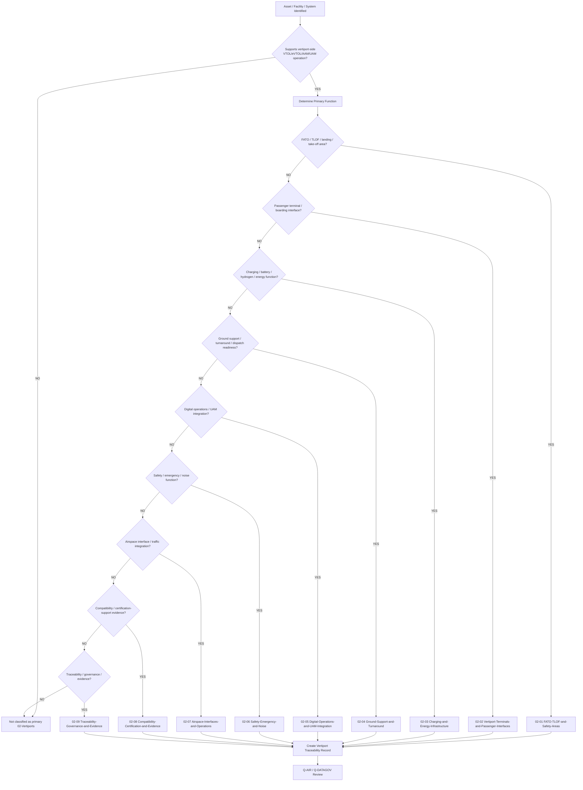
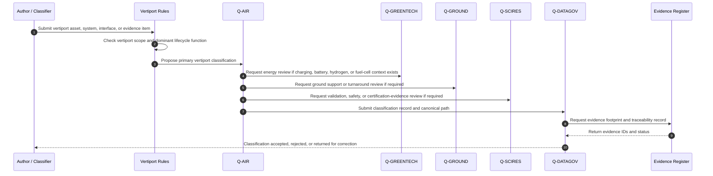
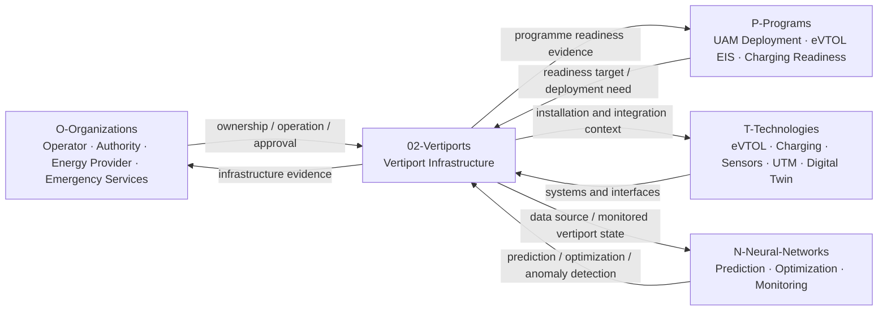
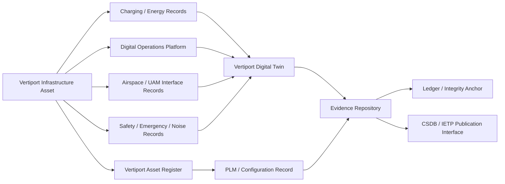

# 02-00-Vertiports-General — Vertiports General

## Purpose

Overview of vertiport infrastructure scope within `I-Infrastructures`.

This document defines the general classification boundary, scope, interfaces, governance logic, evidence expectations, lifecycle applicability, and reference families for vertiport infrastructure under:

```text
IDEALE-ESG/A-Aerospace/I-Infrastructures/02-Vertiports/
```

## Parent

[`README.md`](README.md) — `IDEALE-ESG/A-Aerospace/I-Infrastructures/02-Vertiports/`

---

# 1. Vertiport Infrastructure Scope

`02-Vertiports` covers infrastructure that enables VTOL, eVTOL, AAM, UAM, hybrid-electric, hydrogen-electric, and future vertical-lift aircraft operation at dedicated, integrated, or distributed vertiport facilities.

Vertiport infrastructure includes physical, digital, operational, passenger-facing, energy, safety, airspace-interface, and lifecycle-support assets.

It covers the infrastructure environment required to support vertical take-off, vertical landing, charging, energy readiness, passenger processing, ground handling, safety management, emergency response, digital operations, and aircraft-vertiport compatibility.

It does not replace aircraft type-design data, operator manuals, vertiport operator procedures, airspace approval packages, local planning approvals, authority-issued certification, or regulator-approved compliance documentation.

---

# 2. Controlled Definition

For this taxonomy, a **vertiport infrastructure asset** is:

> A physical, digital, energy, operational, safety, passenger-facing, or airspace-interface asset used to enable VTOL/eVTOL/AAM/UAM aircraft arrival, departure, landing, take-off, charging, parking, turnaround, passenger access, emergency response, digital integration, or lifecycle evidence.

Vertiport infrastructure may include:

- FATO areas;
- TLOF areas;
- safety areas;
- stand and parking positions;
- passenger waiting and boarding interfaces;
- charging interfaces;
- battery-swapping interfaces, if applicable;
- hydrogen or alternative-energy readiness interfaces;
- eVTOL ground-support equipment;
- vertiport digital operations systems;
- UAM network integration systems;
- airspace interface systems;
- noise and community-compatibility evidence;
- emergency-response assets;
- fire-safety assets;
- access-control assets;
- traceability and certification-support evidence.

---

# 3. Vertiport Infrastructure Boundary

## 3.1 Included

This section includes:

- vertiport-side physical infrastructure;
- VTOL/eVTOL landing and take-off areas;
- FATO, TLOF, safety-area, stand, and parking infrastructure;
- passenger-facing vertiport interfaces;
- ground support and turnaround infrastructure;
- charging and energy infrastructure;
- hydrogen or future energy readiness when vertiport-coupled;
- vertiport safety and emergency-response infrastructure;
- vertiport digital operations infrastructure;
- UAM/AAM network integration interfaces;
- airspace and traffic-management interface records;
- noise and environmental compatibility evidence;
- vertiport compatibility and certification-support evidence;
- vertiport lifecycle records;
- traceability and governance records.

## 3.2 Excluded

This section does not include:

- aircraft type-design data;
- onboard aircraft systems;
- flight operations manuals;
- operator-specific procedures;
- detailed airspace procedure design;
- detailed urban planning approvals;
- detailed architectural design;
- detailed electrical grid engineering;
- detailed cybersecurity implementation;
- local legal approvals;
- regulator-issued certificates;
- authority-approved compliance demonstration packages.

Excluded items may be cross-referenced when they support vertiport infrastructure classification, applicability, effectivity, compatibility, or evidence.

---

# 4. Vertiport Infrastructure Subsections

The `02-Vertiports` section uses the following controlled subsection structure:

```text
02-Vertiports/
├── README.md
├── 02-00-Vertiports-General.md
├── 02-01-Landing-and-Takeoff-Areas.md
├── 02-02-Pads-Stands-and-Structural-Interfaces.md
├── 02-03-Charging-and-Energy-Infrastructure.md
├── 02-04-Passenger-Flow-and-Access-Control.md
├── 02-05-Urban-Integration-and-Noise.md
├── 02-06-Safety-Zones-and-Emergency-Response.md
├── 02-07-Digital-Traffic-and-UAM-Interfaces.md
├── 02-08-Aircraft-Compatibility-and-Certification.md
└── 02-09-Traceability-Governance-and-Evidence.md
```

---

# 5. Vertiport Infrastructure Classes

| Code | Infrastructure Class | Scope |
|---:|---|---|
| `02-00` | Vertiports General | General scope, boundary, governance, classification, and reference map for vertiport infrastructure. |
| `02-01` | Landing and Takeoff Areas | VTOL/eVTOL final approach, landing, takeoff, touchdown, lift-off, approach/departure geometry, and operational landing-area context. |
| `02-02` | Pads, Stands and Structural Interfaces | Pads, stands, decks, elevated structures, rooftop interfaces, load-bearing surfaces, parking positions, and structural integration. |
| `02-03` | Charging and Energy Infrastructure | Charging, battery readiness, ground power, energy storage, electrical grid interfaces, hydrogen or future energy readiness. |
| `02-04` | Passenger Flow and Access Control | Passenger access, boarding, disembarkation, PRM/accessibility, controlled entry, exit, screening, and passenger-flow management. |
| `02-05` | Urban Integration and Noise | Urban siting, multimodal access, community interface, acoustic impact, noise monitoring, environmental compatibility, and city integration. |
| `02-06` | Safety Zones and Emergency Response | Safety areas, emergency response, fire safety, evacuation, rescue access, battery-event response, hydrogen-event response, and hazard zones. |
| `02-07` | Digital Traffic and UAM Interfaces | UAM/AAM digital operations, traffic integration, scheduling, fleet coordination, vertiport dashboards, data exchange, and UTM/ATM interfaces. |
| `02-08` | Aircraft Compatibility and Certification | Aircraft-vertiport compatibility, aircraft class applicability, charging compatibility, regulatory mapping, MoC, and certification-support evidence. |
| `02-09` | Traceability Governance and Evidence | Evidence records, applicability, effectivity, baselines, compliance traces, auditability, lifecycle governance, and digital-thread control. |

---

# 6. Vertiport Classification Rules

## RULE-I-INFRA-VERT-GEN-001 — Vertiport Function Rule

An infrastructure asset shall be classified under `02-Vertiports` when its primary function is to support VTOL/eVTOL/AAM/UAM aircraft landing, take-off, parking, charging, passenger handling, ground turnaround, digital integration, safety management, or airspace-interface operation.

## RULE-I-INFRA-VERT-GEN-002 — FATO and TLOF Rule

Assets primarily supporting final approach, take-off, touchdown, lift-off, aircraft positioning, landing clearance, departure clearance, or safety-area geometry shall be classified under:

```text
02-01-FATO-TLOF-and-Safety-Areas
```

## RULE-I-INFRA-VERT-GEN-003 — Passenger Interface Rule

Assets primarily supporting passenger access, waiting, boarding, disembarkation, accessibility, passenger information, or passenger-flow control shall be classified under:

```text
02-02-Vertiport-Terminals-and-Passenger-Interfaces
```

## RULE-I-INFRA-VERT-GEN-004 — Charging and Energy Rule

Assets primarily storing, transferring, converting, metering, delivering, controlling, or isolating electrical energy, battery energy, hydrogen, or future vertiport energy carriers shall be classified under:

```text
02-03-Charging-and-Energy-Infrastructure
```

or under the wider infrastructure section:

```text
07-Hydrogen-and-Energy-Infrastructure
```

when the dominant function is energy infrastructure rather than vertiport operation.

## RULE-I-INFRA-VERT-GEN-005 — Turnaround and Ground Support Rule

Assets primarily supporting eVTOL turnaround, aircraft ground handling, inspection, ground servicing, dispatch readiness, GSE, cleaning, charging coordination, or minimum ground time shall be classified under:

```text
02-04-Ground-Support-and-Turnaround
```

## RULE-I-INFRA-VERT-GEN-006 — Digital Operations Rule

Assets primarily governing vertiport operational data, fleet scheduling, UAM integration, dashboards, digital twins, evidence repositories, traffic-management exchange, or AI/ML decision support shall be classified under:

```text
02-05-Digital-Operations-and-UAM-Integration
```

or under:

```text
08-Digital-Operational-Infrastructure
```

when the dominant function is cross-infrastructure digital governance.

## RULE-I-INFRA-VERT-GEN-007 — Safety, Emergency and Noise Rule

Assets primarily supporting emergency response, fire safety, rescue access, battery-event response, hydrogen emergency response, hazard zones, evacuation, noise monitoring, or community-impact evidence shall be classified under:

```text
02-06-Safety-Emergency-and-Noise
```

or under:

```text
09-Safety-Security-and-Access-Control
```

when the dominant function is cross-domain safety, security, or access control.

## RULE-I-INFRA-VERT-GEN-008 — Airspace Interface Rule

Assets primarily supporting arrival/departure routes, airspace interfaces, vertiport traffic integration, procedural constraints, UAM corridor interface, ATM/UTM exchange, or operational flight-interface evidence shall be classified under:

```text
02-07-Airspace-Interfaces-and-Operations
```

## RULE-I-INFRA-VERT-GEN-009 — Compatibility and Certification Rule

Records primarily supporting aircraft-vertiport compatibility, regulatory mapping, means of compliance, certification-support evidence, authority engagement, or operational-readiness assessment shall be classified under:

```text
02-08-Compatibility-Certification-and-Evidence
```

## RULE-I-INFRA-VERT-GEN-010 — Evidence Governance Rule

Records primarily supporting evidence packaging, traceability, applicability, effectivity, compliance traces, baselines, auditability, or controlled reuse shall be classified under:

```text
02-09-Traceability-Governance-and-Evidence
```

## RULE-I-INFRA-VERT-GEN-011 — Physical Location Rule

An asset located at a vertiport shall not automatically be classified under `02-Vertiports`.

The dominant lifecycle function remains decisive.

Example:

```yaml
asset:
  name: "High-power eVTOL Charging Substation"
  physical_location: "Vertiport"
  primary_classification: "07-Hydrogen-and-Energy-Infrastructure"
  secondary_classification:
    - "02-Vertiports"
    - "09-Safety-Security-and-Access-Control"
  rationale: "Primary function is electrical energy conversion, metering, isolation, and delivery."
```

## RULE-I-INFRA-VERT-GEN-012 — Aircraft-Vertiport Compatibility Rule

Vertiport records shall declare compatibility evidence when the asset affects:

- aircraft landing;
- aircraft take-off;
- FATO/TLOF use;
- stand use;
- parking;
- charging;
- battery replacement;
- passenger boarding;
- emergency response;
- noise exposure;
- airspace interface;
- digital operations;
- turnaround timing;
- dispatch readiness.

---

# 7. Vertiport Classification Logic

## 7.1 Vertiport Classification Flow



## 7.2 Vertiport Governance Sequence Diagram



## 7.3 Vertiport Rule Priority Logic

```yaml
vertiport_classification_logic:
  scope_gate:
    condition: "asset.domain == 'A-Aerospace' and asset.supports_vertiport_operations == true"
    result_if_false: "not_primary_02_vertiports"

  primary_function_assignment:
    - priority: 1
      condition: "asset.primary_function in ['FATO', 'TLOF', 'landing_area', 'takeoff_area', 'safety_area', 'stand_position']"
      result: "02-01-FATO-TLOF-and-Safety-Areas"

    - priority: 2
      condition: "asset.primary_function in ['passenger_access', 'boarding', 'disembarkation', 'waiting_area', 'PRM_accessibility', 'passenger_information']"
      result: "02-02-Vertiport-Terminals-and-Passenger-Interfaces"

    - priority: 3
      condition: "asset.primary_function in ['charging', 'battery_readiness', 'energy_delivery', 'ground_power', 'hydrogen_readiness', 'energy_isolation']"
      result: "02-03-Charging-and-Energy-Infrastructure"

    - priority: 4
      condition: "asset.primary_function in ['ground_support', 'turnaround', 'inspection', 'servicing', 'dispatch_readiness', 'minimum_ground_time']"
      result: "02-04-Ground-Support-and-Turnaround"

    - priority: 5
      condition: "asset.primary_function in ['digital_operations', 'UAM_integration', 'AAM_network_integration', 'dashboard', 'digital_twin', 'data_exchange']"
      result: "02-05-Digital-Operations-and-UAM-Integration"

    - priority: 6
      condition: "asset.primary_function in ['emergency_response', 'fire_safety', 'hazard_zone', 'evacuation', 'noise_monitoring', 'community_compatibility']"
      result: "02-06-Safety-Emergency-and-Noise"

    - priority: 7
      condition: "asset.primary_function in ['airspace_interface', 'arrival_route', 'departure_route', 'traffic_management', 'UTM_ATM_exchange']"
      result: "02-07-Airspace-Interfaces-and-Operations"

    - priority: 8
      condition: "asset.primary_function in ['compatibility_assessment', 'certification_support', 'means_of_compliance', 'authority_engagement']"
      result: "02-08-Compatibility-Certification-and-Evidence"

    - priority: 9
      condition: "asset.primary_function in ['traceability', 'evidence_management', 'baseline_control', 'auditability', 'compliance_trace']"
      result: "02-09-Traceability-Governance-and-Evidence"

  cross_domain_overrides:
    energy_primary: "07-Hydrogen-and-Energy-Infrastructure"
    digital_primary: "08-Digital-Operational-Infrastructure"
    safety_security_primary: "09-Safety-Security-and-Access-Control"
    neural_axis_link: "N-Neural-Networks"

  evidence_required:
    - asset_id
    - asset_name
    - vertiport_function
    - primary_classification
    - secondary_classifications_if_applicable
    - compatibility_statement
    - lifecycle_phase
    - applicability
    - effectivity
    - traceability_record
```

---

# 8. Vertiport Interfaces with OPT-IN Axes

## 8.1 Interface Summary

| OPT-IN Axis | Vertiport Interface |
|---|---|
| `O-Organizations` | Vertiport operator, aircraft operator, UAM/AAM service provider, city authority, energy provider, emergency services, regulator, maintenance provider. |
| `P-Programs` | UAM deployment programme, AAM readiness programme, vertiport certification-support programme, eVTOL entry-into-service programme, charging-readiness programme. |
| `T-Technologies` | eVTOL systems, charging systems, battery systems, hydrogen systems, sensors, digital twins, UTM/ATM exchange systems, emergency-response systems. |
| `I-Infrastructures` | FATO, TLOF, stands, passenger interfaces, charging areas, safety zones, emergency access, digital systems, airspace interfaces. |
| `N-Neural-Networks` | Fleet scheduling, passenger-flow prediction, charging-demand prediction, noise prediction, safety anomaly detection, UAM traffic optimization. |

## 8.2 Vertiport OPT-IN Interface Diagram



## 8.3 Vertiport Interface Record Template

```yaml
vertiport_interface_record:
  infrastructure_section: "02-Vertiports"
  asset_id: ""
  asset_name: ""
  interfaces:
    O-Organizations:
      - organization_id: ""
        role: ""
        relation: ""
    P-Programs:
      - programme_id: ""
        role: ""
        relation: ""
    T-Technologies:
      - technology_id: ""
        role: ""
        relation: ""
    N-Neural-Networks:
      - model_id: ""
        role: ""
        relation: ""
  primary_q_division: "Q-AIR"
  supporting_q_divisions:
    - "Q-DATAGOV"
    - "Q-GROUND"
    - "Q-GREENTECH"
    - "Q-SCIRES"
    - "Q-HPC"
  evidence:
    - evidence_id: ""
      evidence_type: ""
      evidence_status: ""
```

---

# 9. Vertiport Q-Division Governance

| Q-Division | Vertiport Governance Role |
|---|---|
| `Q-AIR` | Primary owner for vertiport infrastructure, VTOL/eVTOL operations, aircraft-vertiport compatibility, FATO/TLOF context, airside operations, and airspace interface classification. |
| `Q-DATAGOV` | Owns vertiport taxonomy control, traceability, evidence architecture, naming, digital-thread governance, CSDB/PLM/IETP interfaces, and publication readiness. |
| `Q-GROUND` | Supports vertiport ground operations, ground support equipment, turnaround, passenger exchange, servicing, access routes, and dispatch readiness. |
| `Q-GREENTECH` | Supports charging, battery readiness, hydrogen-readiness, ground power, energy storage, energy metering, emergency isolation, and sustainable infrastructure transition. |
| `Q-MECHANICS` | Supports mechanical interfaces, charging-coupling hardware, access systems, support equipment, docking systems, and maintainability interfaces. |
| `Q-SCIRES` | Supports verification, validation, safety evidence, certification-support evidence, test planning, means of compliance, and authority-engagement feasibility. |
| `Q-HPC` | Supports vertiport digital twin computation, AAM/UAM traffic simulation, charging-demand prediction, noise modeling, safety analytics, and AI/ML infrastructure analytics. |
| `Q-STRUCTURES` | Supports structural infrastructure, load-bearing surfaces, rooftop or elevated vertiport structures, pavement/deck condition, and physical asset integrity. |

---

# 10. Vertiport Lifecycle Applicability

| Lifecycle Phase | Vertiport Infrastructure Role |
|---|---|
| `LC01` | Define vertiport infrastructure scope, operational concept, classification boundary, and compatibility intent. |
| `LC02` | Define requirements, stakeholder needs, energy needs, safety needs, airspace constraints, and evidence needs. |
| `LC03` | Define vertiport architecture, asset breakdown, interface model, digital-thread model, and cross-node dependencies. |
| `LC04` | Develop preliminary layouts, charging concepts, safety-zone concepts, airspace assumptions, and readiness studies. |
| `LC05` | Produce detailed vertiport infrastructure design records, interface records, compatibility data, and implementation evidence. |
| `LC06` | Define verification, validation, inspection, simulation, test, commissioning, and acceptance criteria. |
| `LC07` | Construct, configure, procure, install, deploy, or implement vertiport infrastructure assets. |
| `LC08` | Integrate vertiport infrastructure with aircraft, charging systems, digital systems, emergency response, passenger interfaces, and airspace systems. |
| `LC09` | Commission vertiport infrastructure and establish handover evidence. |
| `LC10` | Support certification, operational approval, authority engagement, compatibility evidence, or readiness review where applicable. |
| `LC11` | Operate vertiport infrastructure in service. |
| `LC12` | Maintain, inspect, repair, monitor, calibrate, and support vertiport infrastructure assets. |
| `LC13` | Upgrade, modify, retrofit, expand, automate, energy-enable, or reconfigure vertiport infrastructure. |
| `LC14` | Retire, archive, remove, replace, or decommission vertiport infrastructure and records. |

---

# 11. Vertiport Evidence Requirements

## 11.1 Minimum Evidence

Vertiport infrastructure records shall include:

1. asset ID;
2. asset name;
3. asset type;
4. vertiport function;
5. physical, digital, energy, or airspace context;
6. primary classification;
7. secondary classifications, if applicable;
8. aircraft-vertiport compatibility statement;
9. energy-readiness statement, if applicable;
10. safety and emergency-response statement, if applicable;
11. airspace-interface statement, if applicable;
12. lifecycle phase;
13. applicability statement;
14. effectivity statement, if applicable;
15. governing references;
16. responsible Q-Division;
17. evidence footprint;
18. traceability record.

## 11.2 Vertiport Evidence Classes

| Evidence Class | Vertiport Use |
|---|---|
| `classification-evidence` | Supports assignment to `02-Vertiports`. |
| `applicability-evidence` | Defines which vertiport assets, programmes, facilities, aircraft, or jurisdictions are in scope. |
| `effectivity-evidence` | Defines exact facility, asset, configuration, timeframe, jurisdiction, software, or digital baseline. |
| `FATO-TLOF-evidence` | Supports landing, take-off, safety-area, and physical vertiport infrastructure evidence. |
| `passenger-interface-evidence` | Supports passenger access, boarding, disembarkation, accessibility, and passenger-flow evidence. |
| `energy-evidence` | Supports charging, battery, hydrogen, ground power, and energy-readiness evidence. |
| `turnaround-evidence` | Supports ground support, minimum ground time, inspection, servicing, and dispatch-readiness evidence. |
| `digital-evidence` | Supports vertiport digital operations, UAM integration, dashboards, digital twin, and data exchange. |
| `airspace-interface-evidence` | Supports arrival/departure interface, traffic management, airspace integration, and operational constraint evidence. |
| `safety-evidence` | Supports emergency response, fire safety, hazard zones, evacuation, and safety management evidence. |
| `noise-evidence` | Supports acoustic impact, community compatibility, noise monitoring, and environmental constraint evidence. |
| `compatibility-evidence` | Supports aircraft-vertiport compatibility, aircraft class, charging compatibility, gate/stand compatibility, and operational readiness. |
| `certification-evidence` | Supports regulatory, authority, programme, or vertiport certification-support context. |
| `traceability-evidence` | Supports upstream/downstream links, compliance traces, review status, and digital-thread continuity. |

## 11.3 Vertiport Evidence Package Template

```yaml
vertiport_evidence_package:
  package_id: ""
  package_title: ""
  infrastructure_section: "02-Vertiports"
  asset_id: ""
  asset_name: ""
  owner: "Q-AIR"
  supporting_q_divisions:
    - "Q-DATAGOV"
    - "Q-GROUND"
    - "Q-GREENTECH"
    - "Q-SCIRES"
    - "Q-HPC"
  lifecycle_phase: ""
  applicability:
    applies_to:
      - ""
    does_not_apply_to:
      - ""
  effectivity:
    vertiport_id: ""
    facility_id: ""
    asset_configuration: ""
    aircraft_effectivity: ""
    energy_configuration_effectivity: ""
    software_version_effectivity: ""
    temporal_effectivity: ""
    jurisdiction_effectivity: ""
  evidence_items:
    - evidence_id: ""
      evidence_class: ""
      title: ""
      status: ""
      repository_path: ""
  traceability:
    upstream:
      - ""
    downstream:
      - ""
  review:
    reviewer: ""
    approval_status: ""
```

---

# 12. Vertiport Digital Thread

Vertiport infrastructure may interface with digital systems when lifecycle evidence, compatibility data, charging data, traffic data, operational status, safety data, noise data, or configuration records must be governed.

Digital-thread interfaces may include:

- vertiport asset register;
- FATO/TLOF inspection records;
- charging and energy records;
- battery health records;
- passenger-flow records;
- ground-turnaround records;
- UAM/AAM network records;
- traffic-management exchange records;
- emergency-response evidence;
- noise monitoring records;
- vertiport digital twin;
- PLM or configuration records;
- CSDB publication packages;
- IETP references;
- evidence repository;
- infrastructure ledger.

## 12.1 Vertiport Digital Thread Diagram



---

# 13. Vertiport Applicability and Effectivity

## 13.1 Applicability Fields

```yaml
vertiport_applicability:
  applies_to:
    vertiport_types:
      - "ground-level vertiport"
      - "elevated vertiport"
      - "rooftop vertiport"
      - "airport-integrated vertiport"
      - "urban vertiport"
      - "regional vertiport"
      - "temporary vertiport"
      - "network vertiport"
    aircraft_categories:
      - "VTOL"
      - "eVTOL"
      - "hybrid-electric VTOL"
      - "hydrogen-electric VTOL"
      - "future-AAM-aircraft"
    operation_types:
      - "passenger"
      - "cargo"
      - "emergency"
      - "medical"
      - "inspection"
      - "mixed-use"
  does_not_apply_to:
    - "aircraft type-design approval"
    - "operator-specific flight procedures"
    - "authority-issued vertiport certification"
```

## 13.2 Effectivity Fields

```yaml
vertiport_effectivity:
  vertiport_effectivity: ""
  aircraft_effectivity: ""
  FATO_effectivity: ""
  TLOF_effectivity: ""
  stand_effectivity: ""
  charging_system_effectivity: ""
  energy_configuration_effectivity: ""
  digital_system_effectivity: ""
  airspace_interface_effectivity: ""
  emergency_response_effectivity: ""
  temporal_effectivity: ""
  jurisdiction_effectivity: ""
```

---

# 14. Vertiport Reference Map

| Citation Key | Applies To | Use in `02-Vertiports` |
|---|---|---|
| `EASA-VERTIPORT` | Vertiport design and operations context | Reference family for vertiport prototype technical design specifications and European vertiport readiness context. |
| `EASA-ADR` | EU aerodrome governance | Reference family when vertiport infrastructure interfaces with aerodrome governance or airport-integrated facilities. |
| `ICAO-ANNEX14` | Aerodrome physical and operational context | Baseline aerodrome reference family where vertiport infrastructure interfaces with aerodrome infrastructure. |
| `ICAO-ANNEX19` | Safety management | Safety-management reference family for vertiport safety governance and risk context. |
| `FAA-VERTIPORT` | Vertiport design and planning context | US vertiport reference family for planning, design, and infrastructure compatibility. |
| `EUROCAE-UAM` | UAM/AAM systems context | UAM/AAM digital, operational, and integration reference family. |
| `ASTM-F44` | General aviation and aircraft standards context | Reference family for aircraft and operational standards relevant to eVTOL/AAM interfaces where applicable. |
| `IEC-61851` | Electric charging | Electric charging reference family for eVTOL or eGSE charging-interface context. |
| `ISO-19880-1` | Hydrogen fuelling | Hydrogen fuelling reference family for hydrogen-readiness context where applicable. |
| `NFPA-2` | Hydrogen safety | Hydrogen safety, storage, handling, and emergency-response reference family. |
| `ISO-55000` | Asset management | Vertiport infrastructure lifecycle and asset-management reference family. |
| `ISO-31000` | Risk management | Vertiport risk, safety, operational, energy, and emergency-response reference family. |
| `ISO-9001` | Quality management | General QMS reference family for controlled records and infrastructure processes. |
| `IAQG-9100` | Aerospace QMS | Aviation, space, and defense QMS governance reference family. |
| `ISO-IEC-IEEE-15288` | System lifecycle processes | System lifecycle-process reference family for vertiport digital, energy, and infrastructure systems. |
| `ISO-IEC-27001` | Information security management | Digital security management reference family for vertiport digital operations. |
| `S1000D` | Technical publications | CSDB/IETP reference family for controlled publication-ready vertiport infrastructure data. |

---

# 15. Controlled References

## [EASA-VERTIPORT]

**EASA vertiport technical design specification reference family.**

Used as a European vertiport design, infrastructure, and readiness reference family for VTOL/eVTOL/AAM operations.

## [EASA-ADR]

**EASA Easy Access Rules for Aerodromes — Regulation (EU) No 139/2014.**

Used as the EU aerodrome regulatory reference family where vertiport infrastructure interfaces with airport, aerodrome, or airport-integrated infrastructure governance.

## [ICAO-ANNEX14]

**ICAO Annex 14 — Aerodromes, Volume I, Aerodrome Design and Operations.**

Used as the international aerodrome reference family where vertiport infrastructure interfaces with aerodrome physical infrastructure, safety, and operational context.

## [ICAO-ANNEX19]

**ICAO Annex 19 — Safety Management.**

Used as the international aviation safety-management reference family for vertiport safety, emergency response, hazard management, and safety evidence.

## [FAA-VERTIPORT]

**FAA vertiport design and planning reference family.**

Used as the US vertiport planning and design reference family for vertiport infrastructure, compatibility, and operational context.

## [EUROCAE-UAM]

**EUROCAE UAM/AAM reference family.**

Used as a UAM/AAM operational, communication, digital integration, and systems reference family where applicable.

## [ASTM-F44]

**ASTM Committee F44 — General Aviation Aircraft Standards.**

Used as an aircraft and operational standards reference family where eVTOL/AAM aircraft interface assumptions require controlled standards context.

## [IEC-61851]

**IEC 61851 — Electric Vehicle Conductive Charging System.**

Used as an electric charging reference family for vertiport charging-interface context where applicable.

## [ISO-19880-1]

**ISO 19880-1 — Gaseous Hydrogen Fuelling Stations.**

Used as the hydrogen fuelling-station reference family for hydrogen-readiness context. Programme-specific assessment is required for aerospace hydrogen applications.

## [NFPA-2]

**NFPA 2 — Hydrogen Technologies Code.**

Used as the hydrogen safety-code reference family for hydrogen storage, handling, installation, emergency isolation, and emergency-response evidence.

## [ISO-55000]

**ISO 55000 — Asset Management, Vocabulary, Overview and Principles.**

Used as the asset-management reference family for vertiport infrastructure lifecycle, asset value, asset governance, and controlled asset management.

## [ISO-31000]

**ISO 31000 — Risk Management Guidelines.**

Used as the risk-management reference family for vertiport hazards, operational risk, emergency response, energy risk, safety zones, and governance decisions.

## [ISO-9001]

**ISO 9001 — Quality Management Systems Requirements.**

Used as the general quality-management reference family for process governance, review, improvement, audit, and controlled records.

## [IAQG-9100]

**IAQG 9100 — Quality Management Systems Requirements for Aviation, Space and Defense Organizations.**

Used as the aerospace quality-management reference family for aviation, space, defense, supplier, maintenance, production, and lifecycle governance.

## [ISO-IEC-IEEE-15288]

**ISO/IEC/IEEE 15288 — Systems and Software Engineering, System Life Cycle Processes.**

Used as the system lifecycle-process reference family for vertiport infrastructure, energy systems, digital systems, operation, maintenance, and retirement.

## [ISO-IEC-27001]

**ISO/IEC 27001 — Information Security Management Systems.**

Used as the information-security management reference family for vertiport digital operations, data exchange, UAM integration, and evidence repositories.

## [S1000D]

**S1000D — International Specification for Technical Publications Using a Common Source Database.**

Used as the technical-publication and CSDB reference family when vertiport infrastructure documentation requires controlled data modules, applicability, effectivity, publication readiness, or IETP integration.

---


# 16. Vertiport Traceability Record

```yaml
vertiport_traceability_record:
  document_id: "IDEALE-ESG-A-AEROSPACE-I-INFRASTRUCTURES-02-00-VERTIPORTS-GENERAL"
  canonical_path: "IDEALE-ESG/A-Aerospace/I-Infrastructures/02-Vertiports/02-00-Vertiports-General.md"
  parent_path: "IDEALE-ESG/A-Aerospace/I-Infrastructures/02-Vertiports/"
  upstream:
    - "IDEALE-ESG-A-AEROSPACE-I-INFRASTRUCTURES-00-00-SCOPE-PURPOSE"
    - "IDEALE-ESG-A-AEROSPACE-I-INFRASTRUCTURES-00-01-DEFINITIONS"
    - "IDEALE-ESG-A-AEROSPACE-I-INFRASTRUCTURES-00-02-INFRASTRUCTURE-CLASSIFICATION-RULES"
    - "IDEALE-ESG-A-AEROSPACE-I-INFRASTRUCTURES-00-03-STANDARDS-AND-REGULATORY-REFERENCES"
    - "IDEALE-ESG-A-AEROSPACE-I-INFRASTRUCTURES-00-04-APPLICABILITY-AND-EFFECTIVITY"
    - "IDEALE-ESG-A-AEROSPACE-I-INFRASTRUCTURES-00-05-LIFECYCLE-AND-GOVERNANCE"
    - "IDEALE-ESG-A-AEROSPACE-I-INFRASTRUCTURES-00-06-INTERFACES-WITH-OPTIN-AXES"
    - "IDEALE-ESG-A-AEROSPACE-I-INFRASTRUCTURES-00-07-TRACEABILITY-AND-EVIDENCE"
    - "IDEALE-ESG-A-AEROSPACE-I-INFRASTRUCTURES-00-08-NAMING-CONVENTIONS"
  downstream:
    - "02-01-Landing-and-Takeoff-Areas"
    - "02-02-Pads-Stands-and-Structural-Interfaces"
    - "02-03-Charging-and-Energy-Infrastructure"
    - "02-04-Passenger-Flow-and-Access-Control"
    - "02-05-Urban-Integration-and-Noise"
    - "02-06-Safety-Zones-and-Emergency-Response"
    - "02-07-Digital-Traffic-and-UAM-Interfaces"
    - "02-08-Aircraft-Compatibility-and-Certification"
    - "02-09-Traceability-Governance-and-Evidence"
    - "07-Hydrogen-and-Energy-Infrastructure"
    - "08-Digital-Operational-Infrastructure"
    - "09-Safety-Security-and-Access-Control"
    - "N-Neural-Networks"
```

---

# 17. Footprints

## Semantic Footprint

```yaml
semantic_footprint:
  id: FP-SEM-I-INFRA-02-00
  subject: "General scope and governance for vertiport infrastructure"
  meaning_boundary:
    includes:
      - vertiport infrastructure scope
      - VTOL and eVTOL infrastructure context
      - AAM and UAM infrastructure context
      - FATO and TLOF infrastructure
      - passenger interfaces
      - charging and energy infrastructure
      - ground support and turnaround
      - digital operations and UAM integration
      - safety, emergency response, and noise
      - airspace interfaces
      - compatibility and certification-support evidence
      - traceability governance
    excludes:
      - aircraft type-design data
      - flight operations manuals
      - authority-issued certification
      - detailed airspace procedure design
      - detailed city planning approval
      - detailed operator procedures
      - regulator-approved compliance demonstration
```

## Taxonomy Footprint

```yaml
taxonomy_footprint:
  id: FP-TAX-I-INFRA-02-00
  hierarchy:
    root: "IDEALE-ESG"
    domain: "A-Aerospace"
    opt_in_axis: "I-Infrastructures"
    section: "02-Vertiports"
    document: "02-00-Vertiports-General"
```

## Lifecycle Footprint

```yaml
lifecycle_footprint:
  id: FP-LC-I-INFRA-02-00
  lifecycle_phase: "LC01"
  lifecycle_role: "Defines general vertiport infrastructure scope and classification boundary"
  exit_criteria:
    - vertiport scope defined
    - vertiport boundary established
    - vertiport subsections listed
    - vertiport classification rules defined
    - vertiport interfaces mapped
    - vertiport evidence requirements defined
    - reference families mapped
```

## Compliance Footprint

```yaml
compliance_footprint:
  id: FP-COMP-I-INFRA-02-00
  reference_families:
    vertiports:
      - "EASA-VERTIPORT"
      - "FAA-VERTIPORT"
    aerodromes:
      - "ICAO-ANNEX14"
      - "EASA-ADR"
    safety_management:
      - "ICAO-ANNEX19"
      - "ISO-31000"
    UAM_AAM:
      - "EUROCAE-UAM"
      - "ASTM-F44"
    energy_and_charging:
      - "IEC-61851"
      - "ISO-19880-1"
      - "NFPA-2"
    asset_management:
      - "ISO-55000"
    quality_management:
      - "ISO-9001"
      - "IAQG-9100"
    system_lifecycle:
      - "ISO-IEC-IEEE-15288"
    information_security:
      - "ISO-IEC-27001"
    technical_publications:
      - "S1000D"
```

## Evidence Footprint

```yaml
evidence_footprint:
  id: FP-EVD-I-INFRA-02-00
  expected_evidence:
    - controlled markdown document
    - YAML frontmatter
    - canonical path
    - parent path
    - vertiport scope statement
    - vertiport boundary definition
    - vertiport subsection structure
    - vertiport classification rules
    - vertiport interface diagram
    - vertiport digital-thread diagram
    - vertiport evidence template
    - vertiport reference map
    - traceability record
```

---

# 18. Governance Rule

Any child document under `02-Vertiports` shall declare:

1. vertiport infrastructure asset or topic;
2. primary function;
3. primary classification;
4. secondary classifications, if applicable;
5. vertiport operational context;
6. aircraft-vertiport compatibility context;
7. energy-readiness context, if applicable;
8. safety and emergency-response context, if applicable;
9. airspace-interface context, if applicable;
10. applicability;
11. effectivity, when required;
12. lifecycle phase;
13. responsible Q-Division;
14. references and citation keys;
15. evidence footprint;
16. traceability record.

No vertiport infrastructure document shall claim regulatory compliance, operational authorization, aircraft compatibility, charging approval, airspace approval, safety approval, or authority acceptance solely because it references EASA, FAA, ICAO, EUROCAE, ASTM, IEC, ISO, NFPA, IAQG, or S1000D material.

Compliance requires programme-specific, jurisdiction-specific, operator-specific, aircraft-specific, infrastructure-specific, and authority-accepted evidence.

---

# 19. Acceptance Criteria

This document is acceptable when:

- vertiport infrastructure scope is defined;
- vertiport infrastructure boundary is stated;
- vertiport subsections are listed;
- vertiport classification rules are present;
- energy, digital, safety, airspace, and evidence interfaces are mapped;
- OPT-IN interfaces are mapped;
- Q-Division responsibilities are declared;
- lifecycle applicability is included;
- evidence requirements are defined;
- reference families are mapped;
- traceability records are provided;
- child vertiport documents can reuse the structure without reinterpretation.

---

# 20. Summary

`02-00-Vertiports-General` defines the general scope, boundary, classification logic, governance model, interfaces, lifecycle applicability, evidence requirements, and reference map for vertiport infrastructure under `I-Infrastructures`.

It provides the controlled entry point for all vertiport infrastructure child documents, including FATO/TLOF areas, safety areas, passenger interfaces, charging and energy infrastructure, ground support, turnaround, digital operations, UAM integration, emergency response, noise, airspace interfaces, compatibility, certification-support evidence, traceability, governance, and evidence.
````
