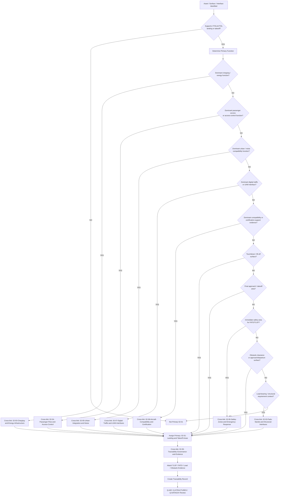
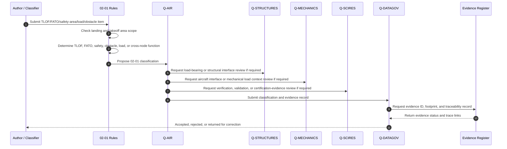
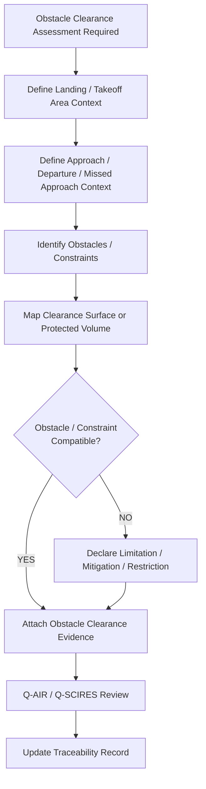
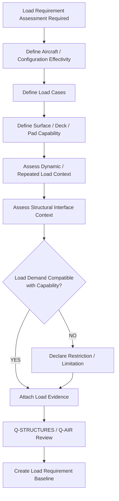
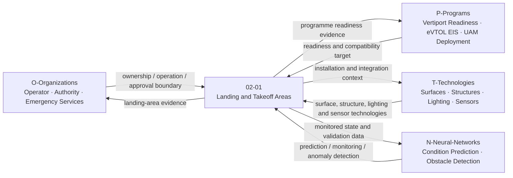
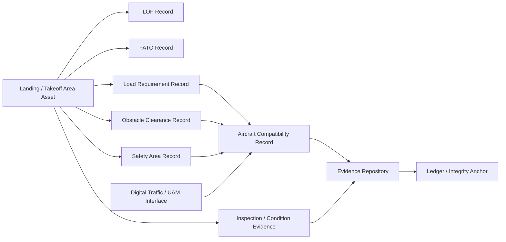

# 02-01-Landing-and-Takeoff-Areas — Landing and Takeoff Areas

## Purpose

TLOF and FATO pad layout, dimensions, obstacle clearance, and load requirements.

This document defines the classification boundary, infrastructure scope, design-reference context, evidence requirements, load-context logic, obstacle-clearance logic, lifecycle governance, and traceability model for vertiport landing and takeoff areas under:

```text
IDEALE-ESG/A-Aerospace/I-Infrastructures/02-Vertiports/
```

## Parent

[`README.md`](README.md) — `IDEALE-ESG/A-Aerospace/I-Infrastructures/02-Vertiports/`

---

# 1. Scope

`02-01-Landing-and-Takeoff-Areas` covers vertiport infrastructure used for vertical or near-vertical aircraft arrival, approach, landing, touchdown, lift-off, takeoff, departure, rejected takeoff, missed approach, and associated safety-area functions.

This document covers the infrastructure classification and evidence-governance layer.

It does not replace detailed engineering drawings, authority-approved vertiport design packages, aircraft type-design data, operator procedures, airspace procedure approval, local planning approval, or regulator-issued certification.

It provides controlled taxonomy logic for:

- TLOF areas;
- FATO areas;
- landing pads;
- takeoff pads;
- approach and departure surface interface context;
- safety areas;
- rejected takeoff and missed approach interface context;
- obstacle-clearance evidence;
- dimensional layout evidence;
- pad marking and visual-reference context;
- load-bearing requirements;
- deck or surface load context;
- elevated or rooftop vertiport landing-area context;
- ground-level vertiport landing-area context;
- aircraft-vertiport compatibility evidence;
- operational limitation evidence;
- lifecycle and inspection evidence;
- traceability records.

---

# 2. Controlled Definition

For this taxonomy, **landing and takeoff areas** are:

> Vertiport physical surfaces, protected areas, spatial envelopes, load-bearing interfaces, and associated operational zones that support VTOL/eVTOL/AAM/UAM aircraft final approach, touchdown, lift-off, takeoff, departure, rejected takeoff, missed approach, and immediate safety-area protection.

The core controlled elements are:

| Term | Controlled Meaning |
|---|---|
| `TLOF` | Touchdown and Lift-Off area used for aircraft touchdown or lift-off. |
| `FATO` | Final Approach and Take-Off area used for final approach, hover, takeoff, and departure transition. |
| `Safety Area` | Protected area around the FATO/TLOF intended to reduce risk from deviations, rejected takeoff, or landing excursions. |
| `Landing Pad` | Physical surface or deck supporting aircraft landing and touchdown. |
| `Takeoff Pad` | Physical surface or deck supporting lift-off and initial takeoff. |
| `Obstacle Clearance Context` | Controlled evidence describing surfaces, zones, objects, or limitations affecting safe approach, takeoff, departure, or missed approach. |
| `Load Requirement Context` | Controlled evidence describing the structural, pavement, deck, fatigue, dynamic, and aircraft-load assumptions applicable to the landing/takeoff area. |

---

# 3. Infrastructure Boundary

## 3.1 Included

This document includes:

- TLOF physical areas;
- FATO physical areas;
- landing pad geometry;
- takeoff pad geometry;
- safety areas;
- elevated landing decks;
- rooftop vertiport landing areas;
- ground-level vertiport landing areas;
- surface markings and visual-reference context when tied to landing-area classification;
- lighting interface context when tied to landing/takeoff area classification;
- obstacle-clearance interface context;
- approach and departure surface interface context;
- load-bearing surface requirements;
- structural load context for elevated pads or decks;
- pavement or deck condition evidence;
- aircraft contact-load and landing-load compatibility context;
- rotor/propulsor downwash context when relevant to surface or safety-area classification;
- rejected takeoff and missed approach interface evidence;
- inspection and maintenance evidence;
- aircraft-vertiport compatibility evidence;
- traceability and evidence packaging.

## 3.2 Excluded

This document does not include:

- aircraft type-design approval;
- aircraft flight-control design;
- detailed airspace procedure design;
- detailed obstacle survey approval;
- detailed structural design calculations;
- detailed civil engineering construction method statements;
- detailed electrical lighting design;
- detailed emergency-response procedures;
- local planning permission;
- authority-issued vertiport certification;
- operational authorization.

Excluded items may be referenced when they support classification, compatibility, applicability, effectivity, evidence packaging, or authority-engagement records.

---

# 4. Asset and Interface Classes

| Class | Description | Primary Classification |
|---|---|---|
| TLOF Area | Surface used for touchdown and lift-off. | `02-Vertiports` / `02-01` |
| FATO Area | Area used for final approach and takeoff. | `02-Vertiports` / `02-01` |
| Landing Pad | Physical pad supporting aircraft landing, contact, touchdown, or vertical load transfer. | `02-Vertiports` / `02-01` |
| Takeoff Pad | Physical pad supporting lift-off, departure initiation, and aircraft load transfer. | `02-Vertiports` / `02-01` |
| Safety Area | Protected area surrounding FATO/TLOF used to reduce risk from operational deviations. | `02-Vertiports` / `02-01`; cross-link `02-06` |
| Elevated Landing Deck | Load-bearing elevated or rooftop deck supporting VTOL/eVTOL landing and takeoff. | `02-01`; cross-link `02-02` |
| Rooftop Vertiport Landing Area | Landing/takeoff area installed on building structure or rooftop platform. | `02-01`; cross-link `02-02` |
| Ground-Level Landing Area | Landing/takeoff area installed at ground level. | `02-01` |
| Obstacle Clearance Interface | Controlled spatial and evidence interface for obstacle-free approach, departure, and safety surfaces. | `02-01`; cross-link `02-07` |
| Load Requirement Record | Evidence record describing aircraft load, pad load, dynamic load, deck load, and structural capability context. | `02-01`; cross-link `02-02` |
| Landing Area Marking Context | Marking and visual-reference context linked to TLOF/FATO identification and operational use. | `02-01` |
| Landing Area Lighting Context | Lighting or visual aid context linked to landing/takeoff area use. | `02-01`; cross-link `02-07` when operational-interface dominant |
| Aircraft Compatibility Record | Evidence record linking aircraft geometry, mass, loads, performance, and interface assumptions to landing/takeoff area capability. | `02-08`; secondary `02-01` |
| Inspection Evidence Record | Evidence record supporting landing-area condition, surface state, marking state, lighting state, or structural state. | `02-09`; secondary `02-01` |

---

# 5. Classification Rules

## RULE-I-INFRA-VERT-LTA-001 — Landing and Takeoff Area Function Rule

An asset shall be classified under `02-01-Landing-and-Takeoff-Areas` when its primary function is to support VTOL/eVTOL final approach, landing, touchdown, lift-off, takeoff, departure, rejected takeoff, missed approach, or immediate safety-area protection.

## RULE-I-INFRA-VERT-LTA-002 — TLOF Rule

A surface shall be classified as a TLOF-related asset when its dominant function is aircraft touchdown, lift-off, vertical load transfer, or immediate aircraft contact-area support.

Minimum classification fields:

```yaml
tlof_classification:
  asset_type: "TLOF"
  primary_function:
    - "touchdown"
    - "lift-off"
    - "vertical load transfer"
  primary_section: "02-Vertiports"
  local_node: "02-01-Landing-and-Takeoff-Areas"
```

## RULE-I-INFRA-VERT-LTA-003 — FATO Rule

An area shall be classified as a FATO-related asset when its dominant function is final approach, takeoff, hover transition, departure initiation, or protected aircraft operation around the TLOF.

Minimum classification fields:

```yaml
fato_classification:
  asset_type: "FATO"
  primary_function:
    - "final approach"
    - "takeoff"
    - "departure transition"
    - "protected aircraft operation"
  primary_section: "02-Vertiports"
  local_node: "02-01-Landing-and-Takeoff-Areas"
```

## RULE-I-INFRA-VERT-LTA-004 — Safety Area Rule

A safety area shall be locally related to `02-01` when it directly protects TLOF/FATO operations.

If the dominant function is emergency response, hazard zoning, access control, fire safety, or rescue readiness, the primary classification shall be:

```text
02-06-Safety-Zones-and-Emergency-Response
```

or:

```text
09-Safety-Security-and-Access-Control
```

with secondary classification to:

```text
02-01-Landing-and-Takeoff-Areas
```

## RULE-I-INFRA-VERT-LTA-005 — Obstacle Clearance Rule

Obstacle-clearance records shall be linked to `02-01` when they support safe approach, departure, missed approach, rejected takeoff, or protected landing-area operation.

If the dominant function is airspace operation, traffic management, route definition, or UTM/ATM interface, the record shall cross-link to:

```text
02-07-Digital-Traffic-and-UAM-Interfaces
```

## RULE-I-INFRA-VERT-LTA-006 — Load Requirement Rule

Landing and takeoff area records shall declare load requirement context when the asset supports aircraft touchdown, lift-off, parking transition, emergency load, dynamic load, deck load, or structural load transfer.

Minimum load evidence shall include:

1. aircraft class or aircraft effectivity;
2. maximum load context;
3. landing-load context;
4. dynamic-load context, if applicable;
5. surface or deck capability reference;
6. fatigue or repeated-load context, if applicable;
7. structural interface context;
8. inspection or condition evidence;
9. limitations;
10. review status.

## RULE-I-INFRA-VERT-LTA-007 — Elevated or Rooftop Interface Rule

Elevated or rooftop landing areas shall cross-link to:

```text
02-02-Pads-Stands-and-Structural-Interfaces
```

when structural load transfer, deck integration, building interface, support structure, vibration, fatigue, or structural compatibility is relevant.

## RULE-I-INFRA-VERT-LTA-008 — Charging Proximity Rule

If a landing or takeoff area includes charging, battery, ground power, or energy interface constraints, it shall cross-link to:

```text
02-03-Charging-and-Energy-Infrastructure
```

The charging system itself shall not be classified under `02-01` unless its dominant function is landing-area compatibility.

## RULE-I-INFRA-VERT-LTA-009 — Passenger Access Proximity Rule

If the landing/takeoff area affects passenger access, controlled movement, boarding route, disembarkation route, or restricted pedestrian interface, it shall cross-link to:

```text
02-04-Passenger-Flow-and-Access-Control
```

## RULE-I-INFRA-VERT-LTA-010 — Urban and Noise Context Rule

If landing/takeoff area geometry, location, operational mode, approach path, departure path, downwash, or aircraft operation affects urban integration or noise evidence, it shall cross-link to:

```text
02-05-Urban-Integration-and-Noise
```

## RULE-I-INFRA-VERT-LTA-011 — Digital Traffic Interface Rule

If the landing/takeoff area is integrated with scheduling, digital traffic management, UAM route coordination, airspace interface, arrival/departure slotting, or real-time operational monitoring, it shall cross-link to:

```text
02-07-Digital-Traffic-and-UAM-Interfaces
```

## RULE-I-INFRA-VERT-LTA-012 — Compatibility and Certification Rule

If a landing/takeoff area record supports aircraft compatibility, regulatory mapping, means of compliance, authority engagement, or certification-support evidence, it shall cross-link to:

```text
02-08-Aircraft-Compatibility-and-Certification
```

## RULE-I-INFRA-VERT-LTA-013 — Evidence Governance Rule

All TLOF, FATO, safety-area, obstacle-clearance, and load-requirement records shall include traceability and evidence governance links to:

```text
02-09-Traceability-Governance-and-Evidence
```

## RULE-I-INFRA-VERT-LTA-014 — No Approval-by-Reference Rule

No landing/takeoff area record shall claim regulatory compliance, vertiport certification, operational approval, airspace approval, or aircraft compatibility solely because it references EASA, FAA, ICAO, ASTM, ISO, IAQG, or S1000D material.

Compliance requires programme-specific, aircraft-specific, infrastructure-specific, jurisdiction-specific, operator-specific, and authority-accepted evidence.

---

# 6. Classification Logic

## 6.1 Landing and Takeoff Area Classification Flow



## 6.2 Landing Area Evidence Sequence Diagram



## 6.3 Obstacle Clearance Logic



## 6.4 Load Requirement Logic



## 6.5 Rule Priority Logic

```yaml
landing_takeoff_area_classification_logic:
  scope_gate:
    condition: "asset.domain == 'A-Aerospace' and asset.section == '02-Vertiports' and asset.supports_landing_or_takeoff == true"
    result_if_false: "not_primary_02_01"

  primary_assignment:
    - priority: 1
      condition: "asset.primary_function in ['touchdown', 'lift_off', 'TLOF', 'aircraft_contact_surface', 'vertical_load_transfer']"
      result: "02-01-Landing-and-Takeoff-Areas"

    - priority: 2
      condition: "asset.primary_function in ['final_approach', 'takeoff', 'FATO', 'departure_transition', 'protected_landing_area_operation']"
      result: "02-01-Landing-and-Takeoff-Areas"

    - priority: 3
      condition: "asset.primary_function in ['safety_area', 'landing_area_protection', 'takeoff_area_protection']"
      result: "02-01-Landing-and-Takeoff-Areas"
      required_cross_link: "02-06-Safety-Zones-and-Emergency-Response"

    - priority: 4
      condition: "asset.primary_function in ['load_requirement', 'load_bearing_surface', 'structural_deck_load', 'repeated_load_context']"
      result: "02-01-Landing-and-Takeoff-Areas"
      required_cross_link: "02-02-Pads-Stands-and-Structural-Interfaces"

    - priority: 5
      condition: "asset.primary_function in ['obstacle_clearance', 'approach_surface', 'departure_surface', 'missed_approach_context']"
      result: "02-01-Landing-and-Takeoff-Areas"
      required_cross_link: "02-07-Digital-Traffic-and-UAM-Interfaces"

  cross_links:
    pads_and_structures: "02-02-Pads-Stands-and-Structural-Interfaces"
    charging_energy: "02-03-Charging-and-Energy-Infrastructure"
    passenger_access: "02-04-Passenger-Flow-and-Access-Control"
    urban_noise: "02-05-Urban-Integration-and-Noise"
    safety_emergency: "02-06-Safety-Zones-and-Emergency-Response"
    digital_traffic_uam: "02-07-Digital-Traffic-and-UAM-Interfaces"
    compatibility_certification: "02-08-Aircraft-Compatibility-and-Certification"
    traceability_governance: "02-09-Traceability-Governance-and-Evidence"

  evidence_required:
    - asset_id
    - asset_name
    - TLOF_or_FATO_context
    - dimensional_context
    - obstacle_clearance_context
    - load_requirement_context
    - aircraft_effectivity
    - vertiport_effectivity
    - safety_area_context
    - lifecycle_phase
    - applicability
    - effectivity
    - traceability_record
```

---

# 7. Landing and Takeoff Area Record

```yaml
landing_takeoff_area_record:
  asset_id: ""
  asset_name: ""
  asset_type: ""
  vertiport_id: ""
  physical_location: ""

  classification:
    domain: "A-Aerospace"
    opt_in_axis: "I-Infrastructures"
    section: "02-Vertiports"
    local_node: "02-01-Landing-and-Takeoff-Areas"
    primary_classification: ""
    secondary_classifications:
      - ""

  landing_takeoff_role:
    TLOF: false
    FATO: false
    safety_area: false
    landing_pad: false
    takeoff_pad: false
    elevated_or_rooftop: false
    ground_level: false

  dimensional_context:
    layout_reference: ""
    length_context: ""
    width_context: ""
    diameter_context: ""
    slope_context: ""
    marking_context: ""
    lighting_context: ""

  obstacle_clearance:
    obstacle_clearance_required: true
    approach_surface_context: ""
    departure_surface_context: ""
    missed_approach_context: ""
    known_limitations:
      - ""

  load_requirements:
    load_assessment_required: true
    aircraft_effectivity: ""
    maximum_load_context: ""
    dynamic_load_context: ""
    surface_or_deck_capability_context: ""
    structural_interface_context: ""
    fatigue_or_repeated_load_context: ""
    limitations:
      - ""

  lifecycle:
    lifecycle_phase: ""
    maturity_state: ""
    governance_status: "controlled-candidate"

  applicability:
    applies_to:
      - ""
    does_not_apply_to:
      - ""

  effectivity:
    vertiport_effectivity: ""
    FATO_effectivity: ""
    TLOF_effectivity: ""
    aircraft_effectivity: ""
    surface_configuration_effectivity: ""
    structural_configuration_effectivity: ""
    operational_effectivity: ""
    temporal_effectivity: ""
    jurisdiction_effectivity: ""

  evidence:
    evidence_items:
      - evidence_id: ""
        evidence_class: ""
        evidence_status: ""

  traceability:
    upstream:
      - ""
    downstream:
      - ""
```

---

# 8. TLOF Record Template

```yaml
tlof_record:
  tlof_id: ""
  vertiport_id: ""
  asset_name: ""
  location_context: ""

  classification:
    primary_section: "02-Vertiports"
    local_node: "02-01-Landing-and-Takeoff-Areas"
    asset_type: "TLOF"

  function:
    touchdown: true
    lift_off: true
    vertical_load_transfer: true

  geometry:
    shape: ""
    dimensions: ""
    slope_context: ""
    surface_context: ""
    marking_context: ""
    lighting_context: ""

  load_context:
    aircraft_effectivity: ""
    landing_load_context: ""
    dynamic_load_context: ""
    repeated_load_context: ""
    deck_or_surface_capability: ""

  compatibility:
    aircraft_classes:
      - ""
    operational_limitations:
      - ""

  evidence:
    - evidence_id: ""
      evidence_class: "TLOF-evidence"
```

---

# 9. FATO Record Template

```yaml
fato_record:
  fato_id: ""
  vertiport_id: ""
  asset_name: ""
  location_context: ""

  classification:
    primary_section: "02-Vertiports"
    local_node: "02-01-Landing-and-Takeoff-Areas"
    asset_type: "FATO"

  function:
    final_approach: true
    takeoff: true
    departure_transition: true
    protected_operation: true

  geometry:
    shape: ""
    dimensions: ""
    relationship_to_TLOF: ""
    safety_area_context: ""
    markings_context: ""
    lighting_context: ""

  obstacle_clearance:
    approach_context: ""
    departure_context: ""
    missed_approach_context: ""
    obstacle_limitations:
      - ""

  compatibility:
    aircraft_classes:
      - ""
    operational_limitations:
      - ""

  evidence:
    - evidence_id: ""
      evidence_class: "FATO-evidence"
```

---

# 10. Obstacle Clearance Record Template

```yaml
obstacle_clearance_record:
  obstacle_clearance_id: ""
  vertiport_id: ""
  related_asset_id: ""
  related_area:
    - "TLOF"
    - "FATO"
    - "safety_area"
    - "approach_surface"
    - "departure_surface"

  assessment_context:
    aircraft_effectivity: ""
    operation_type: ""
    approach_context: ""
    departure_context: ""
    missed_approach_context: ""

  obstacle_data:
    known_obstacles:
      - obstacle_id: ""
        description: ""
        location_context: ""
        limitation_context: ""
    survey_reference: ""
    data_source: ""

  result:
    compatibility_status: ""
    limitations:
      - ""
    mitigations:
      - ""

  evidence:
    - evidence_id: ""
      evidence_class: "obstacle-clearance-evidence"

  review:
    owner: "Q-AIR"
    supporting_q_divisions:
      - "Q-SCIRES"
      - "Q-DATAGOV"
    review_status: "controlled-candidate"
```

---

# 11. Load Requirement Record Template

```yaml
landing_takeoff_load_requirement_record:
  load_record_id: ""
  vertiport_id: ""
  related_asset_id: ""
  related_area:
    - "TLOF"
    - "FATO"
    - "landing_pad"
    - "takeoff_pad"
    - "elevated_deck"

  aircraft_effectivity:
    aircraft_class: ""
    aircraft_type: ""
    aircraft_configuration: ""
    mass_or_loading_context: ""

  load_cases:
    static_load_context: ""
    landing_load_context: ""
    dynamic_load_context: ""
    emergency_load_context: ""
    repeated_load_or_fatigue_context: ""

  surface_or_structure:
    surface_type: ""
    deck_type: ""
    support_structure_context: ""
    load_bearing_capability_context: ""
    inspection_status: ""

  compatibility_assessment:
    demand_reference: ""
    capability_reference: ""
    result: ""
    limitations:
      - ""
    assumptions:
      - ""

  evidence:
    - evidence_id: ""
      evidence_class: "load-requirement-evidence"

  review:
    owner: "Q-STRUCTURES"
    supporting_q_divisions:
      - "Q-AIR"
      - "Q-SCIRES"
      - "Q-DATAGOV"
    review_status: "controlled-candidate"
```

---

# 12. Interfaces with Vertiport Nodes

| Vertiport Node | Interface with `02-01` |
|---|---|
| `02-00-Vertiports-General` | Parent scope, general vertiport classification, reference map, and governance model. |
| `02-02-Pads-Stands-and-Structural-Interfaces` | Structural pad design, deck loads, rooftop interface, stand geometry, support structure, and load transfer. |
| `02-03-Charging-and-Energy-Infrastructure` | Charging position proximity, energy isolation, charging safety areas, and aircraft energy-readiness constraints. |
| `02-04-Passenger-Flow-and-Access-Control` | Passenger route separation, controlled access near landing/takeoff areas, boarding safety, and restricted zones. |
| `02-05-Urban-Integration-and-Noise` | Noise footprint, downwash context, community impact, urban siting constraints, and environmental compatibility. |
| `02-06-Safety-Zones-and-Emergency-Response` | Safety areas, emergency access, fire response, rescue routes, exclusion zones, and incident response. |
| `02-07-Digital-Traffic-and-UAM-Interfaces` | Arrival/departure sequencing, UAM traffic coordination, digital slotting, approach/departure interface, and monitoring. |
| `02-08-Aircraft-Compatibility-and-Certification` | Aircraft-vertiport compatibility, regulatory mapping, MoC, limitations, and certification-support evidence. |
| `02-09-Traceability-Governance-and-Evidence` | Evidence records, applicability, effectivity, traceability, baselines, exceptions, and auditability. |

---

# 13. Interfaces with OPT-IN Axes

| OPT-IN Axis | Interface with Landing and Takeoff Areas |
|---|---|
| `O-Organizations` | Vertiport operator, aircraft operator, infrastructure owner, city authority, safety authority, emergency services, regulator. |
| `P-Programs` | eVTOL EIS programme, vertiport readiness programme, UAM deployment programme, certification-support programme, safety-readiness campaign. |
| `T-Technologies` | Landing-area materials, structural deck systems, lighting systems, marking systems, sensors, obstacle monitoring, load monitoring. |
| `I-Infrastructures` | TLOF, FATO, safety areas, landing pads, takeoff pads, elevated decks, obstacle-clearance zones, load-bearing surfaces. |
| `N-Neural-Networks` | Landing-area condition prediction, obstacle-risk detection, downwash-risk prediction, traffic sequencing support, anomaly detection. |

## 13.1 OPT-IN Interface Diagram



---

# 14. Q-Division Governance

| Q-Division | Governance Role |
|---|---|
| `Q-AIR` | Primary owner for landing/takeoff area classification, FATO/TLOF operational context, obstacle-clearance interface, aircraft-vertiport operational compatibility, and landing-area readiness. |
| `Q-DATAGOV` | Controls naming, traceability, evidence records, digital-thread continuity, canonical paths, data provenance, and publication readiness. |
| `Q-STRUCTURES` | Supports load-bearing surfaces, elevated decks, rooftop structures, pad structural capability, repeated-load context, and structural condition evidence. |
| `Q-GROUND` | Supports ground operations, restricted-area access, turnaround interface, movement around pads, and operational coordination. |
| `Q-GREENTECH` | Supports energy proximity constraints, charging isolation, battery-event context, and hydrogen or future-energy safety interactions. |
| `Q-MECHANICS` | Supports mechanical interface assumptions, aircraft contact-load context, landing gear/skid interface context, and maintainability constraints. |
| `Q-SCIRES` | Supports verification, validation, safety evidence, MoC readiness, certification-support evidence, and authority-engagement feasibility. |
| `Q-HPC` | Supports simulation, digital twin analysis, obstacle-risk modeling, landing-area condition analytics, downwash modeling, and AI/ML support. |

---

# 15. Lifecycle Applicability

| Lifecycle Phase | Landing and Takeoff Area Role |
|---|---|
| `LC01` | Define TLOF/FATO scope, landing/takeoff area classification boundary, and aircraft-vertiport compatibility intent. |
| `LC02` | Define dimensional requirements, load requirements, obstacle-clearance needs, safety constraints, and evidence needs. |
| `LC03` | Define landing-area architecture, TLOF/FATO interfaces, safety-area model, structural links, and digital-thread dependencies. |
| `LC04` | Develop preliminary landing-area layouts, obstacle assumptions, load assumptions, and readiness studies. |
| `LC05` | Produce detailed landing-area records, layout records, load records, obstacle records, and compatibility evidence. |
| `LC06` | Define verification, validation, inspection, survey, load assessment, simulation, and acceptance criteria. |
| `LC07` | Construct, configure, install, or deploy landing/takeoff area infrastructure. |
| `LC08` | Integrate landing/takeoff areas with pads, stands, charging systems, passenger access, safety systems, and traffic interfaces. |
| `LC09` | Commission landing/takeoff areas and establish handover evidence. |
| `LC10` | Support certification, operational approval, authority engagement, compatibility evidence, or readiness review where applicable. |
| `LC11` | Operate landing/takeoff areas in service. |
| `LC12` | Inspect, maintain, monitor, repair, and preserve surface, marking, lighting, load, and obstacle-clearance validity. |
| `LC13` | Upgrade, expand, modify, revalidate, structurally reinforce, or rebaseline landing/takeoff areas. |
| `LC14` | Retire, close, archive, replace, or decommission landing/takeoff area assets and records. |

---

# 16. Evidence Requirements

## 16.1 Minimum Evidence

Each controlled landing/takeoff area record shall include:

1. asset ID;
2. asset name;
3. asset type;
4. vertiport ID;
5. TLOF/FATO/safety-area role;
6. dimensional context;
7. load requirement context;
8. obstacle-clearance context;
9. aircraft effectivity;
10. vertiport effectivity;
11. safety-area statement;
12. operational limitation statement;
13. inspection or condition evidence;
14. lifecycle phase;
15. applicability statement;
16. effectivity statement;
17. responsible Q-Division;
18. citation keys, if applicable;
19. evidence footprint;
20. traceability record.

## 16.2 Evidence Classes

| Evidence Class | Use |
|---|---|
| `classification-evidence` | Supports assignment to `02-01-Landing-and-Takeoff-Areas`. |
| `TLOF-evidence` | Supports touchdown and lift-off surface definition, geometry, condition, and load context. |
| `FATO-evidence` | Supports final approach and takeoff area definition, geometry, safety-area relationship, and operational context. |
| `dimensional-evidence` | Supports layout, dimensions, markings, physical boundaries, and configuration records. |
| `obstacle-clearance-evidence` | Supports obstacle assessment, protected surface context, approach/departure constraints, and limitations. |
| `load-requirement-evidence` | Supports aircraft load, dynamic load, deck load, repeated load, and structural capability context. |
| `safety-area-evidence` | Supports landing/takeoff protected areas, deviation tolerance, emergency access, and hazard mitigation. |
| `surface-condition-evidence` | Supports inspection, condition, surface state, degradation, maintenance, and operational restrictions. |
| `lighting-marking-evidence` | Supports visual-reference context, markings, lighting status, and operational identification. |
| `compatibility-evidence` | Supports aircraft-vertiport compatibility and operational readiness. |
| `certification-evidence` | Supports regulatory, authority, programme, or vertiport certification-support context. |
| `traceability-evidence` | Supports upstream/downstream links, applicability, effectivity, review status, and digital-thread continuity. |

## 16.3 Evidence Package Template

```yaml
landing_takeoff_area_evidence_package:
  package_id: ""
  package_title: ""
  infrastructure_section: "02-Vertiports"
  local_node: "02-01-Landing-and-Takeoff-Areas"
  asset_id: ""
  asset_name: ""
  owner: "Q-AIR"

  supporting_q_divisions:
    - "Q-DATAGOV"
    - "Q-STRUCTURES"
    - "Q-GROUND"
    - "Q-SCIRES"

  lifecycle_phase: ""

  applicability:
    applies_to:
      - ""
    does_not_apply_to:
      - ""

  effectivity:
    vertiport_effectivity: ""
    TLOF_effectivity: ""
    FATO_effectivity: ""
    aircraft_effectivity: ""
    surface_configuration_effectivity: ""
    structural_configuration_effectivity: ""
    operational_effectivity: ""
    temporal_effectivity: ""
    jurisdiction_effectivity: ""

  evidence_items:
    - evidence_id: ""
      evidence_class: ""
      title: ""
      status: ""
      repository_path: ""

  limitations:
    - limitation_id: ""
      description: ""
      affected_operation: ""

  traceability:
    upstream:
      - ""
    downstream:
      - ""

  review:
    reviewer: ""
    approval_status: ""
```

---

# 17. Digital Thread

Landing and takeoff areas shall preserve a controlled digital thread linking the physical surface, aircraft compatibility, load requirements, obstacle-clearance records, inspection evidence, operational limitations, safety-area evidence, and certification-support records.

Digital-thread interfaces may include:

- vertiport asset register;
- TLOF records;
- FATO records;
- safety-area records;
- obstacle-clearance records;
- surface inspection records;
- structural load records;
- aircraft compatibility records;
- digital traffic and UAM interface records;
- safety and emergency response records;
- evidence repository;
- PLM or configuration record;
- CSDB/IETP publication interface;
- ledger or integrity anchor.

## 17.1 Landing and Takeoff Area Digital Thread Diagram



---

# 18. Classification Examples

## 18.1 TLOF Area

```yaml
asset:
  asset_name: "Vertiport TLOF Area A"
  asset_type: "TLOF"
  primary_function: "touchdown and lift-off"
  primary_classification:
    section_code: "02"
    section_name: "Vertiports"
    local_node: "02-01-Landing-and-Takeoff-Areas"
  evidence:
    - evidence_class: "TLOF-evidence"
    - evidence_class: "load-requirement-evidence"
```

## 18.2 FATO Area

```yaml
asset:
  asset_name: "Vertiport FATO Area A"
  asset_type: "FATO"
  primary_function: "final approach and takeoff"
  primary_classification:
    section_code: "02"
    section_name: "Vertiports"
    local_node: "02-01-Landing-and-Takeoff-Areas"
  evidence:
    - evidence_class: "FATO-evidence"
    - evidence_class: "obstacle-clearance-evidence"
```

## 18.3 Elevated Landing Deck

```yaml
asset:
  asset_name: "Elevated Vertiport Landing Deck"
  asset_type: "elevated landing and takeoff area"
  primary_function: "support aircraft landing and lift-off on elevated structural deck"
  primary_classification:
    section_code: "02"
    section_name: "Vertiports"
    local_node: "02-01-Landing-and-Takeoff-Areas"
  secondary_classifications:
    - section_code: "02-02"
      section_name: "Pads Stands and Structural Interfaces"
      relation: "Structural load transfer and deck interface"
  evidence:
    - evidence_class: "load-requirement-evidence"
    - evidence_class: "structural-evidence"
```

## 18.4 Obstacle Clearance Record

```yaml
asset:
  asset_name: "FATO Approach Obstacle Clearance Record"
  asset_type: "obstacle clearance evidence"
  primary_function: "document obstacle context affecting approach and departure paths"
  primary_classification:
    section_code: "02"
    section_name: "Vertiports"
    local_node: "02-01-Landing-and-Takeoff-Areas"
  secondary_classifications:
    - section_code: "02-07"
      section_name: "Digital Traffic and UAM Interfaces"
      relation: "Approach/departure and UAM interface context"
  evidence:
    - evidence_class: "obstacle-clearance-evidence"
    - evidence_class: "compatibility-evidence"
```

## 18.5 Landing Area Load Requirement

```yaml
asset:
  asset_name: "TLOF Load Requirement Record"
  asset_type: "load requirement evidence"
  primary_function: "define aircraft load demand and surface/deck capability context"
  primary_classification:
    section_code: "02"
    section_name: "Vertiports"
    local_node: "02-01-Landing-and-Takeoff-Areas"
  secondary_classifications:
    - section_code: "02-02"
      section_name: "Pads Stands and Structural Interfaces"
      relation: "Structural capability and load-bearing interface"
  evidence:
    - evidence_class: "load-requirement-evidence"
    - evidence_class: "compatibility-evidence"
```

---

# 19. Reference Map

| Citation Key | Applies To | Use in `02-01` |
|---|---|---|
| `EASA-VERTIPORT` | Vertiport design and technical specifications | Reference family for TLOF, FATO, safety-area, obstacle, and vertiport layout context. |
| `FAA-VERTIPORT` | Vertiport design and planning | Reference family for US vertiport planning, layout, and infrastructure compatibility context. |
| `ICAO-ANNEX14` | Aerodrome physical and operational context | Reference family where vertiport landing/takeoff areas interface with aerodrome principles or airport-integrated infrastructure. |
| `ICAO-ANNEX19` | Safety management | Reference family for safety-risk, hazard, and safety-management context. |
| `EASA-ADR` | EU aerodrome governance | Reference family where vertiports interface with aerodrome governance or airport-integrated facilities. |
| `ASTM-F44` | Aircraft standards context | Reference family for aircraft interface assumptions where applicable to eVTOL/AAM aircraft compatibility. |
| `ISO-55000` | Asset management | Landing/takeoff area lifecycle and asset-management reference family. |
| `ISO-31000` | Risk management | Obstacle, safety-area, load, operation, and infrastructure-risk reference family. |
| `ISO-9001` | Quality management | Controlled records and infrastructure-process governance reference family. |
| `IAQG-9100` | Aerospace QMS | Aviation, space, and defense quality-management reference family. |
| `ISO-IEC-IEEE-15288` | System lifecycle processes | Lifecycle-process reference family for landing/takeoff infrastructure systems. |
| `S1000D` | Technical publications | CSDB/IETP reference family for controlled publication-ready vertiport infrastructure data. |

---

# 20. Controlled References

## [EASA-VERTIPORT]

**EASA vertiport technical design specification reference family.**

Used as a European vertiport design and readiness reference family for TLOF, FATO, safety areas, obstacle context, and vertiport physical infrastructure.

## [FAA-VERTIPORT]

**FAA vertiport design and planning reference family.**

Used as a US vertiport planning and design reference family for landing-area layout, safety area, load context, and infrastructure compatibility.

## [ICAO-ANNEX14]

**ICAO Annex 14 — Aerodromes, Volume I, Aerodrome Design and Operations.**

Used as the international aerodrome reference family when vertiport landing and takeoff areas interface with aerodrome infrastructure, physical design, and operational context.

## [ICAO-ANNEX19]

**ICAO Annex 19 — Safety Management.**

Used as the international aviation safety-management reference family for safety risk, hazard management, and safety evidence.

## [EASA-ADR]

**EASA Easy Access Rules for Aerodromes — Regulation (EU) No 139/2014.**

Used as the EU aerodrome regulatory reference family where vertiport landing/takeoff infrastructure interfaces with airport or aerodrome governance.

## [ASTM-F44]

**ASTM Committee F44 — General Aviation Aircraft Standards.**

Used as an aircraft and operational standards reference family where eVTOL/AAM aircraft interface assumptions require controlled standards context.

## [ISO-55000]

**ISO 55000 — Asset Management, Vocabulary, Overview and Principles.**

Used as the asset-management reference family for landing/takeoff area lifecycle, asset value, asset condition, and controlled asset governance.

## [ISO-31000]

**ISO 31000 — Risk Management Guidelines.**

Used as the risk-management reference family for obstacle, surface, load, safety-area, operational, and lifecycle risk governance.

## [ISO-9001]

**ISO 9001 — Quality Management Systems Requirements.**

Used as the general quality-management reference family for process governance, review, improvement, audit, and controlled records.

## [IAQG-9100]

**IAQG 9100 — Quality Management Systems Requirements for Aviation, Space and Defense Organizations.**

Used as the aerospace quality-management reference family for aviation, space, defense, supplier, maintenance, production, and lifecycle governance.

## [ISO-IEC-IEEE-15288]

**ISO/IEC/IEEE 15288 — Systems and Software Engineering, System Life Cycle Processes.**

Used as the system lifecycle-process reference family for infrastructure system definition, verification, validation, operation, maintenance, and retirement.

## [S1000D]

**S1000D — International Specification for Technical Publications Using a Common Source Database.**

Used as the technical-publication and CSDB reference family when landing/takeoff area documentation requires controlled data modules, applicability, effectivity, publication readiness, or IETP integration.

---

# 21. Traceability Record

```yaml
landing_takeoff_areas_traceability_record:
  document_id: "IDEALE-ESG-A-AEROSPACE-I-INFRASTRUCTURES-02-01-LANDING-AND-TAKEOFF-AREAS"
  canonical_path: "IDEALE-ESG/A-Aerospace/I-Infrastructures/02-Vertiports/02-01-Landing-and-Takeoff-Areas.md"
  parent_path: "IDEALE-ESG/A-Aerospace/I-Infrastructures/02-Vertiports/"
  upstream:
    - "IDEALE-ESG-A-AEROSPACE-I-INFRASTRUCTURES-02-00-VERTIPORTS-GENERAL"
    - "IDEALE-ESG-A-AEROSPACE-I-INFRASTRUCTURES-00-02-INFRASTRUCTURE-CLASSIFICATION-RULES"
    - "IDEALE-ESG-A-AEROSPACE-I-INFRASTRUCTURES-00-03-STANDARDS-AND-REGULATORY-REFERENCES"
    - "IDEALE-ESG-A-AEROSPACE-I-INFRASTRUCTURES-00-04-APPLICABILITY-AND-EFFECTIVITY"
    - "IDEALE-ESG-A-AEROSPACE-I-INFRASTRUCTURES-00-05-LIFECYCLE-AND-GOVERNANCE"
    - "IDEALE-ESG-A-AEROSPACE-I-INFRASTRUCTURES-00-06-INTERFACES-WITH-OPTIN-AXES"
    - "IDEALE-ESG-A-AEROSPACE-I-INFRASTRUCTURES-00-07-TRACEABILITY-AND-EVIDENCE"
    - "IDEALE-ESG-A-AEROSPACE-I-INFRASTRUCTURES-00-08-NAMING-CONVENTIONS"
  downstream:
    - "02-02-Pads-Stands-and-Structural-Interfaces"
    - "02-03-Charging-and-Energy-Infrastructure"
    - "02-04-Passenger-Flow-and-Access-Control"
    - "02-05-Urban-Integration-and-Noise"
    - "02-06-Safety-Zones-and-Emergency-Response"
    - "02-07-Digital-Traffic-and-UAM-Interfaces"
    - "02-08-Aircraft-Compatibility-and-Certification"
    - "02-09-Traceability-Governance-and-Evidence"
```

---

# 22. Footprints

## Semantic Footprint

```yaml
semantic_footprint:
  id: FP-SEM-I-INFRA-02-01
  subject: "Vertiport landing and takeoff areas, including TLOF, FATO, obstacle clearance, and load requirements"
  meaning_boundary:
    includes:
      - TLOF areas
      - FATO areas
      - landing pads
      - takeoff pads
      - safety areas
      - obstacle-clearance context
      - approach and departure surface context
      - load requirements
      - elevated and rooftop landing area context
      - aircraft-vertiport compatibility evidence
      - landing-area inspection evidence
    excludes:
      - aircraft type-design approval
      - detailed airspace procedure approval
      - detailed structural calculations
      - local planning approval
      - authority-issued vertiport certification
      - operational authorization
```

## Taxonomy Footprint

```yaml
taxonomy_footprint:
  id: FP-TAX-I-INFRA-02-01
  hierarchy:
    root: "IDEALE-ESG"
    domain: "A-Aerospace"
    opt_in_axis: "I-Infrastructures"
    section: "02-Vertiports"
    document: "02-01-Landing-and-Takeoff-Areas"
```

## Lifecycle Footprint

```yaml
lifecycle_footprint:
  id: FP-LC-I-INFRA-02-01
  lifecycle_phase: "LC01"
  lifecycle_role: "Defines TLOF, FATO, landing pad, takeoff pad, safety-area, obstacle-clearance, and load-requirement infrastructure scope"
  exit_criteria:
    - TLOF scope defined
    - FATO scope defined
    - landing and takeoff area boundary defined
    - obstacle-clearance logic defined
    - load requirement logic defined
    - classification rules defined
    - cross-node interfaces mapped
    - evidence requirements defined
    - reference families mapped
```

## Compliance Footprint

```yaml
compliance_footprint:
  id: FP-COMP-I-INFRA-02-01
  reference_families:
    vertiports:
      - "EASA-VERTIPORT"
      - "FAA-VERTIPORT"
    aerodromes:
      - "ICAO-ANNEX14"
      - "EASA-ADR"
    safety_management:
      - "ICAO-ANNEX19"
      - "ISO-31000"
    aircraft_interface:
      - "ASTM-F44"
    asset_management:
      - "ISO-55000"
    quality_management:
      - "ISO-9001"
      - "IAQG-9100"
    system_lifecycle:
      - "ISO-IEC-IEEE-15288"
    technical_publications:
      - "S1000D"
```

## Evidence Footprint

```yaml
evidence_footprint:
  id: FP-EVD-I-INFRA-02-01
  expected_evidence:
    - controlled markdown document
    - YAML frontmatter
    - canonical path
    - parent path
    - TLOF definition and record template
    - FATO definition and record template
    - obstacle-clearance record template
    - load-requirement record template
    - classification rules
    - classification logic diagrams
    - evidence sequence diagram
    - obstacle-clearance logic diagram
    - load-requirement logic diagram
    - cross-node interface map
    - digital-thread diagram
    - reference map
    - traceability record
```

---

# 23. Governance Rule

Any child or derivative record under `02-01-Landing-and-Takeoff-Areas` shall declare:

1. landing/takeoff asset type;
2. TLOF, FATO, safety-area, obstacle, or load role;
3. vertiport context;
4. aircraft effectivity;
5. dimensional context;
6. obstacle-clearance context;
7. load requirement context;
8. operational limitations;
9. primary classification;
10. secondary classifications, if applicable;
11. applicability;
12. effectivity;
13. lifecycle phase;
14. responsible Q-Division;
15. evidence footprint;
16. traceability record.

No TLOF, FATO, landing pad, takeoff pad, safety-area, obstacle-clearance, or load-requirement document shall claim regulatory, operational, structural, aircraft-compatibility, vertiport-certification, airspace, or authority compliance solely because it references EASA, FAA, ICAO, ASTM, ISO, IAQG, or S1000D material.

Compliance requires programme-specific, aircraft-specific, infrastructure-specific, jurisdiction-specific, operator-specific, and authority-accepted evidence.

---

# 24. Acceptance Criteria

This document is acceptable when:

- TLOF and FATO scope is defined;
- landing and takeoff area boundary is stated;
- included and excluded boundaries are declared;
- asset and interface classes are listed;
- classification rules are present;
- obstacle-clearance logic is included;
- load-requirement logic is included;
- TLOF, FATO, obstacle, and load record templates are provided;
- cross-node interfaces are mapped;
- lifecycle applicability is included;
- evidence requirements are defined;
- digital-thread interfaces are mapped;
- Q-Division responsibilities are declared;
- reference families are mapped;
- traceability records are provided;
- downstream vertiport documents can reuse the structure without reinterpretation.

---

# 25. Summary

`02-01-Landing-and-Takeoff-Areas` defines the controlled taxonomy scope for vertiport TLOF, FATO, landing pads, takeoff pads, safety areas, obstacle-clearance context, and load requirements.

It covers dimensional layout, obstacle clearance, aircraft-vertiport compatibility, load-bearing context, elevated or rooftop landing-area interfaces, inspection evidence, lifecycle governance, digital-thread interfaces, and traceability under `02-Vertiports`.
````
