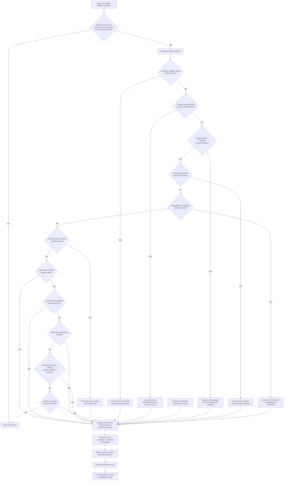
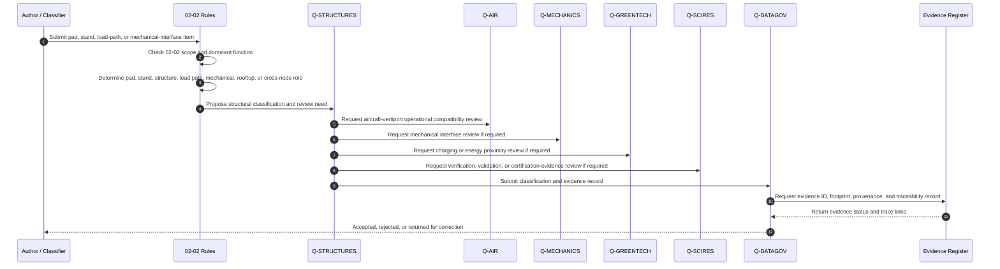
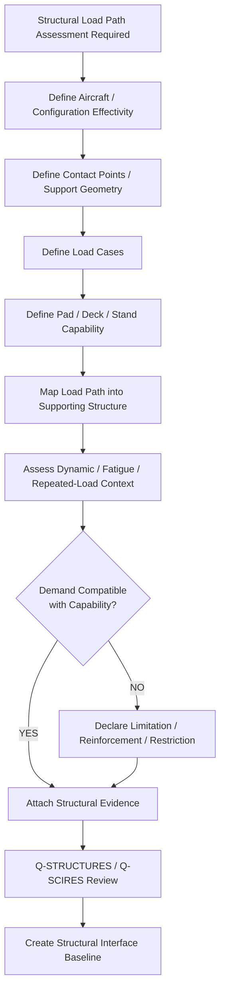
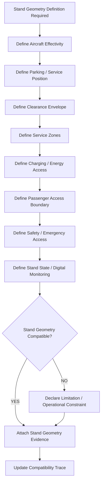
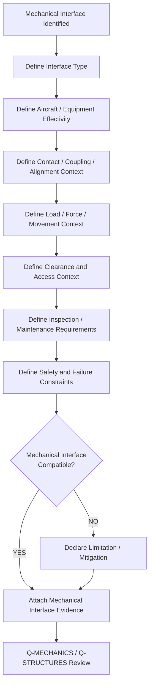
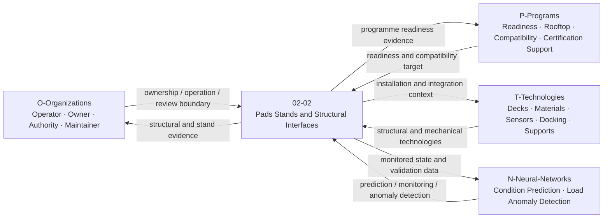
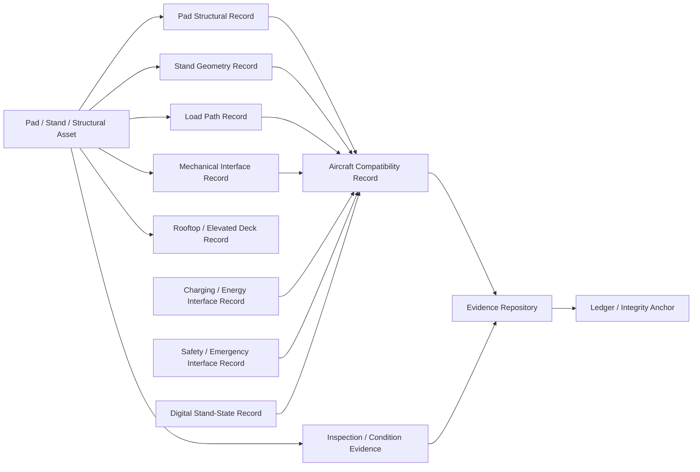

# 02-02-Pads-Stands-and-Structural-Interfaces — Pads Stands and Structural Interfaces

## Purpose

Pad structure, aircraft stand geometry, and mechanical interface specifications.

This document defines the classification boundary, infrastructure scope, structural load-transfer logic, stand-geometry model, mechanical interface records, evidence requirements, lifecycle governance, and traceability model for vertiport pads, stands, and structural interfaces under:

```text
IDEALE-ESG/A-Aerospace/I-Infrastructures/02-Vertiports/
```

## Parent

[`README.md`](README.md) — `IDEALE-ESG/A-Aerospace/I-Infrastructures/02-Vertiports/`

---

# 1. Scope

`02-02-Pads-Stands-and-Structural-Interfaces` covers vertiport infrastructure assets that provide structural support, pad/deck capability, stand geometry, load transfer, mechanical interfaces, aircraft support interfaces, surface/deck integration, rooftop/elevated vertiport structure, and structural evidence for VTOL/eVTOL/AAM/UAM operations.

This document covers the infrastructure classification and evidence-governance layer.

It does not replace detailed structural design calculations, construction drawings, material qualification reports, authority-approved structural certification, building-code approval, aircraft type-design data, or regulator-issued vertiport approval.

It provides controlled taxonomy logic for:

- landing pad structural capability;
- takeoff pad structural capability;
- elevated deck interfaces;
- rooftop vertiport structural interfaces;
- stand and parking position geometry;
- aircraft stand load envelopes;
- wheel, skid, landing-gear, or support-contact interface context;
- tie-down or restraint interface context, if applicable;
- docking or positioning interface context;
- surface/deck load transfer;
- fatigue and repeated-load context;
- vibration and dynamic load context;
- thermal, electrical, and energy proximity interfaces when structurally relevant;
- pad-to-building structural interface evidence;
- pad inspection evidence;
- structural condition monitoring;
- aircraft-vertiport compatibility evidence;
- mechanical interface specifications;
- lifecycle traceability and evidence packaging.

---

# 2. Controlled Definition

For this taxonomy, **pads, stands, and structural interfaces** are:

> Vertiport physical and mechanical infrastructure elements that support aircraft weight, landing loads, parking loads, repeated operational loads, deck loads, stand geometry, aircraft positioning, structural integration, and mechanical interface compatibility between VTOL/eVTOL/AAM/UAM aircraft and the vertiport facility.

The core controlled elements are:

| Term | Controlled Meaning |
|---|---|
| `Pad` | A load-bearing surface, deck, slab, platform, or structural area supporting aircraft contact, parking, landing, lift-off, or ground operation. |
| `Stand` | A defined aircraft parking or service position supporting occupancy, passenger exchange, charging, inspection, servicing, or dispatch readiness. |
| `Structural Interface` | A controlled boundary where loads, vibrations, thermal effects, attachments, deck supports, or mechanical constraints transfer between vertiport assets and supporting structures. |
| `Mechanical Interface` | A physical aircraft-to-infrastructure or equipment-to-infrastructure interface involving contact, coupling, alignment, support, docking, restraint, guide, or positioning function. |
| `Load Path` | The controlled route through which aircraft loads, deck loads, emergency loads, dynamic loads, or repeated loads are transferred into the vertiport structure. |
| `Stand Geometry` | The controlled spatial definition of aircraft position, clearance, service zones, charging access, passenger access, and emergency access around a stand. |

---

# 3. Infrastructure Boundary

## 3.1 Included

This document includes:

- vertiport pads;
- structural landing pads;
- structural takeoff pads;
- aircraft parking stands;
- eVTOL stand geometry;
- elevated stand platforms;
- rooftop pad structural interfaces;
- deck slabs and support structures when vertiport-specific;
- load-bearing pad structures;
- mechanical contact interfaces;
- aircraft wheel/skid/contact support context;
- aircraft alignment and positioning interfaces;
- stand markings when tied to structural or positioning evidence;
- service-zone geometry around stands;
- pad-to-building structural connection context;
- vibration and dynamic-load context;
- repeated-load and fatigue context;
- structural inspection evidence;
- structural health monitoring evidence;
- mechanical interface specifications;
- aircraft compatibility evidence;
- traceability and evidence packaging.

## 3.2 Excluded

This document does not include:

- aircraft type-design approval;
- detailed aircraft landing-gear design;
- detailed building structural design calculations;
- detailed civil construction method statements;
- local building-code approval;
- authority-issued vertiport certification;
- detailed charging-system design unless structurally integrated;
- detailed passenger-processing design;
- detailed emergency-response procedures;
- detailed airspace design;
- regulator-approved compliance demonstration packages.

Excluded items may be cross-referenced when they support classification, applicability, effectivity, compatibility, structural evidence, or authority-engagement records.

---

# 4. Asset and Interface Classes

| Class | Description | Primary Classification |
|---|---|---|
| Structural Landing Pad | Load-bearing pad supporting aircraft landing and touchdown loads. | `02-Vertiports` / `02-02`; cross-link `02-01` |
| Structural Takeoff Pad | Load-bearing pad supporting lift-off and takeoff load conditions. | `02-Vertiports` / `02-02`; cross-link `02-01` |
| Aircraft Stand | Defined aircraft parking or servicing position at a vertiport. | `02-Vertiports` / `02-02` |
| eVTOL Parking Position | Stand or parking location for eVTOL occupancy, servicing, charging proximity, or passenger exchange. | `02-Vertiports` / `02-02` |
| Elevated Vertiport Deck | Elevated or rooftop load-bearing deck supporting aircraft operations. | `02-Vertiports` / `02-02` |
| Rooftop Structural Interface | Structural boundary between vertiport pad/deck and host building or support structure. | `02-Vertiports` / `02-02` |
| Load Path Record | Evidence record describing transfer of aircraft and operational loads into the structure. | `02-Vertiports` / `02-02` |
| Mechanical Contact Interface | Aircraft-to-pad or aircraft-to-stand physical interface involving wheel, skid, support, or contact geometry. | `02-Vertiports` / `02-02` |
| Docking or Positioning Interface | Interface used to align, guide, position, or constrain aircraft at a pad or stand. | `02-Vertiports` / `02-02` |
| Tie-Down or Restraint Interface | Mechanical interface used to restrain aircraft when applicable to operational or environmental conditions. | `02-Vertiports` / `02-02` |
| Stand Clearance Envelope | Controlled geometry for aircraft, passengers, GSE, charging, safety, and emergency access around the stand. | `02-Vertiports` / `02-02` |
| Charging Structural Interface | Structural or mechanical interface supporting charging equipment, cable routing, pantograph, robotic charging, or energy coupling near a stand. | `02-02`; cross-link `02-03` |
| Passenger Stand Interface | Stand geometry affecting passenger boarding, protected walkways, access control, and passenger separation. | `02-02`; cross-link `02-04` |
| Safety Zone Structural Interface | Stand or pad boundary affecting hazard zones, emergency access, rescue routes, or fire response. | `02-02`; cross-link `02-06` |
| Aircraft Compatibility Record | Evidence record linking aircraft mass, geometry, contact points, loads, and clearance envelope to pad/stand capability. | `02-08`; secondary `02-02` |
| Structural Evidence Package | Controlled package supporting structural capability, load transfer, inspection, and lifecycle evidence. | `02-09`; secondary `02-02` |

---

# 5. Classification Rules

## RULE-I-INFRA-VERT-PSSI-001 — Pad and Stand Function Rule

An asset shall be classified under `02-02-Pads-Stands-and-Structural-Interfaces` when its primary function is to support aircraft pad structure, aircraft stand geometry, parking position, load transfer, mechanical interface, structural interface, or aircraft-to-vertiport physical compatibility.

## RULE-I-INFRA-VERT-PSSI-002 — Pad Structural Rule

A pad shall be classified under `02-02` when its dominant function is load-bearing support, structural transfer, surface/deck capability, repeated-load tolerance, fatigue resistance, or aircraft contact-load management.

If the pad is being classified only as a landing or takeoff operational area, it shall cross-link to:

```text
02-01-Landing-and-Takeoff-Areas
```

## RULE-I-INFRA-VERT-PSSI-003 — Stand Geometry Rule

A stand shall be classified under `02-02` when its dominant function is to define aircraft parking, service-position geometry, clearance envelope, equipment access, charging access, passenger access boundary, or dispatch-readiness position.

Minimum stand geometry evidence shall include:

1. stand ID;
2. aircraft effectivity;
3. aircraft parking position;
4. clearance envelope;
5. service-zone geometry;
6. passenger access relation;
7. charging or energy relation, if applicable;
8. safety-zone relation;
9. emergency-access relation;
10. operational limitations.

## RULE-I-INFRA-VERT-PSSI-004 — Structural Load Path Rule

Any pad, deck, stand, or support interface that transfers aircraft load into a surface, slab, deck, building, foundation, or support frame shall declare a load path record.

Minimum load path evidence shall include:

- aircraft load context;
- landing or parking load context;
- dynamic load context, if applicable;
- repeated-load or fatigue context;
- structural interface context;
- support structure context;
- inspection and condition evidence;
- assumptions;
- limitations;
- review status.

## RULE-I-INFRA-VERT-PSSI-005 — Elevated and Rooftop Interface Rule

Elevated and rooftop vertiport pads or stands shall be classified under `02-02` when structural integration with the host building, deck, platform, support frame, or rooftop structure is relevant.

The record shall cross-link to:

```text
02-01-Landing-and-Takeoff-Areas
```

when it supports TLOF, FATO, landing, or takeoff area functions.

## RULE-I-INFRA-VERT-PSSI-006 — Mechanical Interface Rule

Mechanical interface records shall be classified under `02-02` when they define aircraft-to-pad, aircraft-to-stand, equipment-to-stand, docking, support, alignment, tie-down, restraint, or contact interface specifications.

Mechanical interface records shall declare:

1. interface type;
2. aircraft or equipment effectivity;
3. contact or coupling context;
4. load or force context;
5. clearance context;
6. allowable movement context;
7. inspection requirement;
8. maintenance requirement;
9. evidence status.

## RULE-I-INFRA-VERT-PSSI-007 — Charging Structural Interface Rule

Charging equipment foundations, cable-management supports, pantograph structures, robotic charging arms, battery swap support frames, or charging mechanical couplings shall cross-link to:

```text
02-03-Charging-and-Energy-Infrastructure
```

If the dominant function is energy delivery, classify primarily under `02-03`.

If the dominant function is structural support or mechanical interface, classify primarily under `02-02`.

## RULE-I-INFRA-VERT-PSSI-008 — Passenger Access Interface Rule

If stand geometry affects boarding routes, controlled pedestrian access, passenger separation, PRM/accessibility, boarding safety, or passenger interface geometry, the record shall cross-link to:

```text
02-04-Passenger-Flow-and-Access-Control
```

## RULE-I-INFRA-VERT-PSSI-009 — Urban Integration and Noise Interface Rule

If pad or stand structure affects urban siting, vibration, community noise, downwash interaction, rooftop integration, or environmental compatibility, the record shall cross-link to:

```text
02-05-Urban-Integration-and-Noise
```

## RULE-I-INFRA-VERT-PSSI-010 — Safety and Emergency Interface Rule

If pad or stand geometry affects safety zones, emergency access, fire response, evacuation routes, battery-event management, hydrogen-event management, or hazard isolation, the record shall cross-link to:

```text
02-06-Safety-Zones-and-Emergency-Response
```

## RULE-I-INFRA-VERT-PSSI-011 — Digital Traffic Interface Rule

If pad or stand occupancy, availability, digital monitoring, scheduling, slotting, UAM traffic management, or aircraft positioning state is digitally governed, the record shall cross-link to:

```text
02-07-Digital-Traffic-and-UAM-Interfaces
```

## RULE-I-INFRA-VERT-PSSI-012 — Aircraft Compatibility Rule

If the record supports aircraft-vertiport compatibility, aircraft class applicability, contact geometry, parking envelope, load compatibility, stand clearance, or certification-support evidence, it shall cross-link to:

```text
02-08-Aircraft-Compatibility-and-Certification
```

## RULE-I-INFRA-VERT-PSSI-013 — Evidence Governance Rule

All pad, stand, structural-interface, load-path, mechanical-interface, and stand-geometry records shall include traceability and evidence governance links to:

```text
02-09-Traceability-Governance-and-Evidence
```

## RULE-I-INFRA-VERT-PSSI-014 — No Approval-by-Reference Rule

No pad, stand, load-path, mechanical-interface, or structural-interface record shall claim structural compliance, vertiport certification, aircraft compatibility, operational approval, building approval, or authority acceptance solely because it references EASA, FAA, ICAO, ASTM, ISO, IAQG, or S1000D material.

Compliance requires programme-specific, aircraft-specific, infrastructure-specific, structural-specific, jurisdiction-specific, operator-specific, and authority-accepted evidence.

---

# 6. Classification Logic

## 6.1 Pads, Stands and Structural Interfaces Classification Flow



## 6.2 Structural Interface Evidence Sequence Diagram



## 6.3 Structural Load Path Logic



## 6.4 Stand Geometry Logic



## 6.5 Mechanical Interface Logic



## 6.6 Rule Priority Logic

```yaml
pads_stands_structural_interfaces_classification_logic:
  scope_gate:
    condition: "asset.domain == 'A-Aerospace' and asset.section == '02-Vertiports' and asset.supports_pad_stand_or_structural_interface == true"
    result_if_false: "not_primary_02_02"

  primary_assignment:
    - priority: 1
      condition: "asset.primary_function in ['pad_structure', 'deck_structure', 'load_bearing_surface', 'support_structure', 'rooftop_interface']"
      result: "02-02-Pads-Stands-and-Structural-Interfaces"

    - priority: 2
      condition: "asset.primary_function in ['aircraft_stand', 'parking_position', 'stand_geometry', 'clearance_envelope', 'service_position']"
      result: "02-02-Pads-Stands-and-Structural-Interfaces"

    - priority: 3
      condition: "asset.primary_function in ['load_path', 'load_transfer', 'dynamic_load', 'fatigue_context', 'repeated_load_context']"
      result: "02-02-Pads-Stands-and-Structural-Interfaces"

    - priority: 4
      condition: "asset.primary_function in ['mechanical_interface', 'contact_interface', 'docking', 'alignment', 'tie_down', 'restraint']"
      result: "02-02-Pads-Stands-and-Structural-Interfaces"

    - priority: 5
      condition: "asset.primary_function in ['landing_area_operation', 'TLOF', 'FATO', 'approach_takeoff_surface']"
      result: "02-01-Landing-and-Takeoff-Areas"
      required_cross_link: "02-02-Pads-Stands-and-Structural-Interfaces"

  cross_links:
    landing_takeoff: "02-01-Landing-and-Takeoff-Areas"
    charging_energy: "02-03-Charging-and-Energy-Infrastructure"
    passenger_access: "02-04-Passenger-Flow-and-Access-Control"
    urban_noise: "02-05-Urban-Integration-and-Noise"
    safety_emergency: "02-06-Safety-Zones-and-Emergency-Response"
    digital_traffic_uam: "02-07-Digital-Traffic-and-UAM-Interfaces"
    compatibility_certification: "02-08-Aircraft-Compatibility-and-Certification"
    traceability_governance: "02-09-Traceability-Governance-and-Evidence"

  evidence_required:
    - asset_id
    - asset_name
    - pad_or_stand_context
    - aircraft_effectivity
    - structural_load_context
    - load_path_context
    - stand_geometry_context
    - mechanical_interface_context
    - clearance_envelope_context
    - lifecycle_phase
    - applicability
    - effectivity
    - traceability_record
```

---

# 7. Pads, Stands and Structural Interface Record

```yaml
pads_stands_structural_interface_record:
  asset_id: ""
  asset_name: ""
  asset_type: ""
  vertiport_id: ""
  physical_location: ""

  classification:
    domain: "A-Aerospace"
    opt_in_axis: "I-Infrastructures"
    section: "02-Vertiports"
    local_node: "02-02-Pads-Stands-and-Structural-Interfaces"
    primary_classification: ""
    secondary_classifications:
      - ""

  structural_role:
    landing_pad: false
    takeoff_pad: false
    aircraft_stand: false
    parking_position: false
    elevated_deck: false
    rooftop_interface: false
    load_path_interface: false
    mechanical_interface: false

  aircraft_interface:
    aircraft_effectivity: ""
    aircraft_class: ""
    contact_point_context: ""
    landing_gear_or_skid_context: ""
    support_geometry_context: ""
    clearance_envelope_context: ""

  structural_context:
    structure_type: ""
    load_bearing_surface_context: ""
    support_structure_context: ""
    load_path_context: ""
    dynamic_load_context: ""
    fatigue_or_repeated_load_context: ""
    vibration_context: ""
    structural_condition_context: ""

  stand_geometry:
    stand_id: ""
    parking_position_context: ""
    service_zone_context: ""
    passenger_access_relation: ""
    charging_access_relation: ""
    emergency_access_relation: ""
    GSE_or_support_equipment_relation: ""

  mechanical_interfaces:
    - interface_id: ""
      interface_type: ""
      contact_or_coupling_context: ""
      load_or_force_context: ""
      inspection_requirement: ""

  lifecycle:
    lifecycle_phase: ""
    maturity_state: ""
    governance_status: "controlled-candidate"

  applicability:
    applies_to:
      - ""
    does_not_apply_to:
      - ""

  effectivity:
    vertiport_effectivity: ""
    pad_effectivity: ""
    stand_effectivity: ""
    aircraft_effectivity: ""
    structural_configuration_effectivity: ""
    mechanical_interface_effectivity: ""
    operational_effectivity: ""
    temporal_effectivity: ""
    jurisdiction_effectivity: ""

  evidence:
    evidence_items:
      - evidence_id: ""
        evidence_class: ""
        evidence_status: ""

  traceability:
    upstream:
      - ""
    downstream:
      - ""
```

---

# 8. Pad Structural Record Template

```yaml
pad_structural_record:
  pad_id: ""
  vertiport_id: ""
  asset_name: ""
  pad_type:
    - "landing_pad"
    - "takeoff_pad"
    - "parking_pad"
    - "service_pad"
    - "elevated_deck"
    - "rooftop_pad"

  classification:
    primary_section: "02-Vertiports"
    local_node: "02-02-Pads-Stands-and-Structural-Interfaces"

  geometry:
    shape: ""
    dimensions: ""
    slope_context: ""
    surface_context: ""
    edge_or_boundary_context: ""

  structural_context:
    support_structure: ""
    load_bearing_capability_context: ""
    load_path_context: ""
    deck_or_slab_context: ""
    foundation_or_building_interface: ""
    vibration_context: ""
    repeated_load_context: ""

  aircraft_effectivity:
    aircraft_classes:
      - ""
    aircraft_type_or_configuration: ""
    mass_or_loading_context: ""

  inspection_and_condition:
    inspection_required: true
    inspection_interval_context: ""
    condition_monitoring_required: false
    known_limitations:
      - ""

  evidence:
    - evidence_id: ""
      evidence_class: "pad-structural-evidence"
```

---

# 9. Aircraft Stand Geometry Record Template

```yaml
aircraft_stand_geometry_record:
  stand_id: ""
  vertiport_id: ""
  stand_name: ""
  stand_type:
    - "arrival_stand"
    - "departure_stand"
    - "charging_stand"
    - "parking_stand"
    - "maintenance_access_stand"
    - "mixed_use_stand"

  classification:
    primary_section: "02-Vertiports"
    local_node: "02-02-Pads-Stands-and-Structural-Interfaces"

  aircraft_effectivity:
    aircraft_classes:
      - ""
    aircraft_type_or_configuration: ""
    dimensional_reference: ""

  geometry:
    aircraft_position_reference: ""
    stand_clearance_envelope: ""
    stand_marking_context: ""
    taxi_or_hover_entry_exit_context: ""
    service_zone_context: ""
    adjacent_stand_clearance_context: ""

  interfaces:
    passenger_access:
      required: false
      relation: "02-04-Passenger-Flow-and-Access-Control"
    charging_access:
      required: false
      relation: "02-03-Charging-and-Energy-Infrastructure"
    emergency_access:
      required: true
      relation: "02-06-Safety-Zones-and-Emergency-Response"
    digital_stand_state:
      required: false
      relation: "02-07-Digital-Traffic-and-UAM-Interfaces"

  limitations:
    - ""

  evidence:
    - evidence_id: ""
      evidence_class: "stand-geometry-evidence"
```

---

# 10. Structural Load Path Record Template

```yaml
structural_load_path_record:
  load_path_id: ""
  vertiport_id: ""
  related_asset_id: ""
  related_asset_type:
    - "pad"
    - "stand"
    - "deck"
    - "rooftop_interface"
    - "support_structure"

  aircraft_effectivity:
    aircraft_class: ""
    aircraft_type: ""
    aircraft_configuration: ""
    mass_or_loading_context: ""

  load_cases:
    static_load_context: ""
    landing_load_context: ""
    parking_load_context: ""
    emergency_load_context: ""
    dynamic_load_context: ""
    repeated_load_or_fatigue_context: ""
    vibration_context: ""

  load_path:
    contact_point_context: ""
    pad_or_deck_transfer_context: ""
    support_structure_context: ""
    foundation_or_building_context: ""
    load_path_limitations:
      - ""

  compatibility_assessment:
    demand_reference: ""
    capability_reference: ""
    result: ""
    assumptions:
      - ""
    limitations:
      - ""

  evidence:
    - evidence_id: ""
      evidence_class: "load-path-evidence"

  review:
    owner: "Q-STRUCTURES"
    supporting_q_divisions:
      - "Q-AIR"
      - "Q-SCIRES"
      - "Q-DATAGOV"
    review_status: "controlled-candidate"
```

---

# 11. Mechanical Interface Record Template

```yaml
mechanical_interface_record:
  interface_id: ""
  vertiport_id: ""
  related_asset_id: ""
  interface_name: ""

  classification:
    primary_section: "02-Vertiports"
    local_node: "02-02-Pads-Stands-and-Structural-Interfaces"

  interface_type:
    - "contact_interface"
    - "docking_interface"
    - "alignment_interface"
    - "tie_down_interface"
    - "restraint_interface"
    - "charging_coupling_support"
    - "maintenance_support_interface"

  effectivity:
    aircraft_effectivity: ""
    equipment_effectivity: ""
    stand_effectivity: ""
    pad_effectivity: ""
    configuration_effectivity: ""

  mechanical_context:
    contact_geometry: ""
    coupling_context: ""
    load_or_force_context: ""
    allowable_movement_context: ""
    clearance_context: ""
    tolerance_context: ""
    failure_mode_context: ""

  inspection_and_maintenance:
    inspection_required: true
    maintenance_required: false
    inspection_context: ""
    acceptance_context: ""

  safety:
    safety_relevant: false
    emergency_release_required: false
    hazard_context:
      - ""

  evidence:
    - evidence_id: ""
      evidence_class: "mechanical-interface-evidence"

  review:
    owner: "Q-MECHANICS"
    supporting_q_divisions:
      - "Q-STRUCTURES"
      - "Q-AIR"
      - "Q-SCIRES"
      - "Q-DATAGOV"
    review_status: "controlled-candidate"
```

---

# 12. Structural Inspection and Condition Record Template

```yaml
structural_inspection_condition_record:
  inspection_record_id: ""
  vertiport_id: ""
  related_asset_id: ""
  asset_type:
    - "pad"
    - "stand"
    - "deck"
    - "rooftop_interface"
    - "mechanical_interface"

  inspection_scope:
    surface_condition: false
    structural_condition: false
    load_path_condition: false
    mechanical_interface_condition: false
    marking_condition: false
    drainage_or_surface_contamination: false

  inspection_context:
    inspection_method: ""
    inspection_interval_context: ""
    inspection_date: ""
    inspector_or_owner: ""
    acceptance_context: ""

  findings:
    - finding_id: ""
      severity: ""
      description: ""
      disposition: ""

  operational_status:
    status: ""
    restrictions:
      - ""
    limitations:
      - ""

  evidence:
    - evidence_id: ""
      evidence_class: "structural-condition-evidence"

  traceability:
    upstream:
      - ""
    downstream:
      - ""
```

---

# 13. Interfaces with Vertiport Nodes

| Vertiport Node | Interface with `02-02` |
|---|---|
| `02-00-Vertiports-General` | Parent scope, general vertiport classification, reference map, and governance model. |
| `02-01-Landing-and-Takeoff-Areas` | TLOF, FATO, landing/takeoff area operational context, dimensional context, and load-requirement relation. |
| `02-03-Charging-and-Energy-Infrastructure` | Charging position structure, cable supports, energy equipment foundations, battery-swap support, and energy proximity. |
| `02-04-Passenger-Flow-and-Access-Control` | Stand access, passenger boundary, boarding access route, controlled pedestrian movement, and PRM/accessibility interface. |
| `02-05-Urban-Integration-and-Noise` | Rooftop integration, building interface, vibration, downwash effects, urban fit, and community impact. |
| `02-06-Safety-Zones-and-Emergency-Response` | Safety zones, emergency access, evacuation routes, fire response, structural emergency limitations, and hazard isolation. |
| `02-07-Digital-Traffic-and-UAM-Interfaces` | Stand occupancy, stand availability, pad state monitoring, aircraft positioning state, and UAM operational scheduling. |
| `02-08-Aircraft-Compatibility-and-Certification` | Aircraft-vertiport compatibility, load compatibility, stand compatibility, mechanical interface evidence, and MoC context. |
| `02-09-Traceability-Governance-and-Evidence` | Evidence records, applicability, effectivity, traceability, baselines, exceptions, and auditability. |

---

# 14. Interfaces with OPT-IN Axes

| OPT-IN Axis | Interface with Pads, Stands and Structural Interfaces |
|---|---|
| `O-Organizations` | Vertiport operator, infrastructure owner, aircraft operator, building owner, maintenance provider, safety authority, regulator. |
| `P-Programs` | eVTOL EIS programme, vertiport readiness programme, rooftop vertiport programme, structural compatibility campaign, certification-support campaign. |
| `T-Technologies` | Structural deck systems, pad materials, load monitoring sensors, mechanical docking systems, restraint systems, charging support structures. |
| `I-Infrastructures` | Pads, stands, decks, parking positions, support structures, rooftop interfaces, mechanical interfaces, load-transfer paths. |
| `N-Neural-Networks` | Structural condition prediction, load monitoring anomaly detection, stand occupancy prediction, fatigue trend detection, inspection prioritization. |

## 14.1 OPT-IN Interface Diagram



---

# 15. Q-Division Governance

| Q-Division | Governance Role |
|---|---|
| `Q-STRUCTURES` | Primary owner for pad structures, elevated decks, rooftop interfaces, load paths, structural capability, fatigue context, structural condition evidence, and structural compatibility classification. |
| `Q-AIR` | Supports aircraft-vertiport operational compatibility, stand geometry, aircraft clearance, pad/stand use, and operational limitations. |
| `Q-DATAGOV` | Controls naming, traceability, evidence records, digital-thread continuity, canonical paths, provenance, and publication readiness. |
| `Q-GROUND` | Supports stand operation, ground movement, passenger exchange boundary, inspection access, support equipment access, and dispatch-readiness context. |
| `Q-GREENTECH` | Supports charging equipment structural interfaces, energy proximity, battery-event constraints, hydrogen-event context, and energy isolation implications. |
| `Q-MECHANICS` | Supports mechanical contact interfaces, docking interfaces, alignment systems, tie-downs, restraints, coupling supports, and maintainability. |
| `Q-SCIRES` | Supports verification, validation, structural evidence adequacy, MoC readiness, certification-support evidence, and authority-engagement feasibility. |
| `Q-HPC` | Supports structural simulation, load-path modeling, fatigue analytics, digital twin analysis, condition prediction, and AI/ML infrastructure analytics. |

---

# 16. Lifecycle Applicability

| Lifecycle Phase | Pads, Stands and Structural Interfaces Role |
|---|---|
| `LC01` | Define pad, stand, structural-interface, and mechanical-interface scope and classification boundary. |
| `LC02` | Define structural requirements, aircraft contact requirements, stand geometry needs, load cases, and evidence requirements. |
| `LC03` | Define pad/stand architecture, load-path model, structural interface model, mechanical interface model, and cross-node dependencies. |
| `LC04` | Develop preliminary structural layouts, stand concepts, load assumptions, rooftop assumptions, and interface studies. |
| `LC05` | Produce detailed pad, stand, structural, mechanical, load-path, and compatibility records. |
| `LC06` | Define verification, validation, inspection, structural assessment, load assessment, simulation, and acceptance criteria. |
| `LC07` | Construct, configure, install, or deploy pad, stand, deck, and mechanical interface infrastructure. |
| `LC08` | Integrate pads and stands with landing areas, charging systems, passenger access, safety zones, digital traffic systems, and compatibility evidence. |
| `LC09` | Commission pad, stand, structural, and mechanical interface assets and establish handover evidence. |
| `LC10` | Support certification, operational approval, authority engagement, compatibility evidence, or structural readiness review where applicable. |
| `LC11` | Operate pads, stands, and structural interfaces in service. |
| `LC12` | Inspect, maintain, monitor, repair, reinforce, and preserve pad, stand, load-path, and mechanical-interface validity. |
| `LC13` | Upgrade, modify, reinforce, revalidate, expand, retrofit, or rebaseline structural interfaces and stand geometry. |
| `LC14` | Retire, close, archive, replace, remove, or decommission pad, stand, and structural-interface assets and records. |

---

# 17. Evidence Requirements

## 17.1 Minimum Evidence

Each controlled pad, stand, structural-interface, or mechanical-interface record shall include:

1. asset ID;
2. asset name;
3. asset type;
4. vertiport ID;
5. pad, stand, deck, structural-interface, or mechanical-interface role;
6. aircraft effectivity;
7. structural load context;
8. load path context;
9. stand geometry context;
10. mechanical interface context, if applicable;
11. clearance envelope context;
12. operational limitation statement;
13. inspection or condition evidence;
14. lifecycle phase;
15. applicability statement;
16. effectivity statement;
17. responsible Q-Division;
18. citation keys, if applicable;
19. evidence footprint;
20. traceability record.

## 17.2 Evidence Classes

| Evidence Class | Use |
|---|---|
| `classification-evidence` | Supports assignment to `02-02-Pads-Stands-and-Structural-Interfaces`. |
| `pad-structural-evidence` | Supports pad structure, surface, deck, slab, and load-bearing capability. |
| `stand-geometry-evidence` | Supports aircraft stand geometry, clearance envelope, access zones, and service zones. |
| `load-path-evidence` | Supports aircraft load transfer, deck load, support structure, and repeated-load context. |
| `mechanical-interface-evidence` | Supports contact, docking, alignment, tie-down, restraint, or mechanical coupling interfaces. |
| `rooftop-interface-evidence` | Supports elevated or rooftop structural integration with host structure. |
| `fatigue-evidence` | Supports repeated-load, fatigue, vibration, and lifecycle structural durability context. |
| `surface-condition-evidence` | Supports inspection, condition, degradation, repair, and operational restriction evidence. |
| `clearance-evidence` | Supports aircraft, equipment, passenger, charging, safety, and emergency access clearance. |
| `compatibility-evidence` | Supports aircraft-vertiport compatibility and operational readiness. |
| `certification-evidence` | Supports regulatory, authority, programme, or vertiport certification-support context. |
| `traceability-evidence` | Supports upstream/downstream links, applicability, effectivity, review status, and digital-thread continuity. |

## 17.3 Evidence Package Template

```yaml
pads_stands_structural_interfaces_evidence_package:
  package_id: ""
  package_title: ""
  infrastructure_section: "02-Vertiports"
  local_node: "02-02-Pads-Stands-and-Structural-Interfaces"
  asset_id: ""
  asset_name: ""
  owner: "Q-STRUCTURES"

  supporting_q_divisions:
    - "Q-AIR"
    - "Q-DATAGOV"
    - "Q-MECHANICS"
    - "Q-SCIRES"

  lifecycle_phase: ""

  applicability:
    applies_to:
      - ""
    does_not_apply_to:
      - ""

  effectivity:
    vertiport_effectivity: ""
    pad_effectivity: ""
    stand_effectivity: ""
    aircraft_effectivity: ""
    structural_configuration_effectivity: ""
    mechanical_interface_effectivity: ""
    operational_effectivity: ""
    temporal_effectivity: ""
    jurisdiction_effectivity: ""

  evidence_items:
    - evidence_id: ""
      evidence_class: ""
      title: ""
      status: ""
      repository_path: ""

  limitations:
    - limitation_id: ""
      description: ""
      affected_operation: ""

  traceability:
    upstream:
      - ""
    downstream:
      - ""

  review:
    reviewer: ""
    approval_status: ""
```

---

# 18. Digital Thread

Pads, stands, and structural interfaces shall preserve a controlled digital thread linking physical assets, structural load records, stand geometry, mechanical interfaces, inspection evidence, aircraft compatibility, operational limitations, and certification-support records.

Digital-thread interfaces may include:

- vertiport asset register;
- pad structural records;
- stand geometry records;
- structural load path records;
- mechanical interface records;
- rooftop or elevated deck records;
- surface inspection records;
- structural condition monitoring records;
- aircraft compatibility records;
- charging infrastructure records;
- safety-zone records;
- digital traffic and stand-state records;
- evidence repository;
- PLM or configuration record;
- CSDB/IETP publication interface;
- ledger or integrity anchor.

## 18.1 Pads, Stands and Structural Interfaces Digital Thread Diagram



---

# 19. Classification Examples

## 19.1 Structural Landing Pad

```yaml
asset:
  asset_name: "Vertiport Structural Landing Pad A"
  asset_type: "structural landing pad"
  primary_function: "load-bearing support for aircraft touchdown and lift-off"
  primary_classification:
    section_code: "02"
    section_name: "Vertiports"
    local_node: "02-02-Pads-Stands-and-Structural-Interfaces"
  secondary_classifications:
    - section_code: "02-01"
      section_name: "Landing and Takeoff Areas"
      relation: "TLOF/FATO operational landing-area context"
  evidence:
    - evidence_class: "pad-structural-evidence"
    - evidence_class: "load-path-evidence"
```

## 19.2 Aircraft Stand

```yaml
asset:
  asset_name: "eVTOL Stand S-01"
  asset_type: "aircraft stand"
  primary_function: "aircraft parking, service-zone geometry, and operational access"
  primary_classification:
    section_code: "02"
    section_name: "Vertiports"
    local_node: "02-02-Pads-Stands-and-Structural-Interfaces"
  secondary_classifications:
    - section_code: "02-04"
      section_name: "Passenger Flow and Access Control"
      relation: "Passenger boarding and controlled-access boundary"
    - section_code: "02-03"
      section_name: "Charging and Energy Infrastructure"
      relation: "Charging access and energy proximity"
  evidence:
    - evidence_class: "stand-geometry-evidence"
    - evidence_class: "clearance-evidence"
```

## 19.3 Rooftop Structural Interface

```yaml
asset:
  asset_name: "Rooftop Vertiport Structural Interface"
  asset_type: "rooftop structural interface"
  primary_function: "transfer aircraft and operational loads into host building structure"
  primary_classification:
    section_code: "02"
    section_name: "Vertiports"
    local_node: "02-02-Pads-Stands-and-Structural-Interfaces"
  secondary_classifications:
    - section_code: "02-05"
      section_name: "Urban Integration and Noise"
      relation: "Urban building integration, vibration, and community context"
  evidence:
    - evidence_class: "rooftop-interface-evidence"
    - evidence_class: "load-path-evidence"
```

## 19.4 Mechanical Docking Interface

```yaml
asset:
  asset_name: "eVTOL Stand Docking Alignment Interface"
  asset_type: "mechanical docking interface"
  primary_function: "position and align aircraft at stand for servicing and charging"
  primary_classification:
    section_code: "02"
    section_name: "Vertiports"
    local_node: "02-02-Pads-Stands-and-Structural-Interfaces"
  secondary_classifications:
    - section_code: "02-03"
      section_name: "Charging and Energy Infrastructure"
      relation: "Charging alignment and coupling support"
  evidence:
    - evidence_class: "mechanical-interface-evidence"
    - evidence_class: "compatibility-evidence"
```

## 19.5 Structural Inspection Record

```yaml
asset:
  asset_name: "Pad Surface and Load Path Inspection Record"
  asset_type: "structural condition evidence"
  primary_function: "document structural condition and operational validity of pad and load path"
  primary_classification:
    section_code: "02"
    section_name: "Vertiports"
    local_node: "02-02-Pads-Stands-and-Structural-Interfaces"
  secondary_classifications:
    - section_code: "02-09"
      section_name: "Traceability Governance and Evidence"
      relation: "Evidence governance and lifecycle traceability"
  evidence:
    - evidence_class: "surface-condition-evidence"
    - evidence_class: "traceability-evidence"
```

---

# 20. Reference Map

| Citation Key | Applies To | Use in `02-02` |
|---|---|---|
| `EASA-VERTIPORT` | Vertiport design and technical specifications | Reference family for vertiport pad, stand, structural, safety, and compatibility context. |
| `FAA-VERTIPORT` | Vertiport design and planning | Reference family for US vertiport planning, layout, pad, stand, and structural compatibility context. |
| `ICAO-ANNEX14` | Aerodrome physical and operational context | Reference family where vertiport pad or stand infrastructure interfaces with aerodrome principles or airport-integrated infrastructure. |
| `ICAO-ANNEX19` | Safety management | Reference family for safety-risk, hazard, and safety-management context. |
| `EASA-ADR` | EU aerodrome governance | Reference family where vertiports interface with aerodrome governance or airport-integrated facilities. |
| `ASTM-F44` | Aircraft standards context | Reference family for aircraft interface assumptions where applicable to eVTOL/AAM aircraft compatibility. |
| `ISO-55000` | Asset management | Pad, stand, deck, structural interface, and lifecycle asset-management reference family. |
| `ISO-31000` | Risk management | Structural risk, operational risk, load-path risk, stand safety, and infrastructure-risk reference family. |
| `ISO-9001` | Quality management | Controlled records and infrastructure-process governance reference family. |
| `IAQG-9100` | Aerospace QMS | Aviation, space, and defense quality-management reference family. |
| `ISO-IEC-IEEE-15288` | System lifecycle processes | Lifecycle-process reference family for pad, stand, mechanical, and structural systems. |
| `S1000D` | Technical publications | CSDB/IETP reference family for controlled publication-ready vertiport infrastructure data. |

---

# 21. Controlled References

## [EASA-VERTIPORT]

**EASA vertiport technical design specification reference family.**

Used as a European vertiport design and readiness reference family for pad, stand, structural interface, and aircraft-vertiport compatibility context.

## [FAA-VERTIPORT]

**FAA vertiport design and planning reference family.**

Used as a US vertiport planning and design reference family for pad layout, stand geometry, structural interfaces, and infrastructure compatibility.

## [ICAO-ANNEX14]

**ICAO Annex 14 — Aerodromes, Volume I, Aerodrome Design and Operations.**

Used as the international aerodrome reference family when vertiport pad or stand infrastructure interfaces with aerodrome physical infrastructure, safety, and operational context.

## [ICAO-ANNEX19]

**ICAO Annex 19 — Safety Management.**

Used as the international aviation safety-management reference family for safety risk, hazard management, and safety evidence.

## [EASA-ADR]

**EASA Easy Access Rules for Aerodromes — Regulation (EU) No 139/2014.**

Used as the EU aerodrome regulatory reference family where vertiport pad, stand, or structural infrastructure interfaces with airport or aerodrome governance.

## [ASTM-F44]

**ASTM Committee F44 — General Aviation Aircraft Standards.**

Used as an aircraft and operational standards reference family where eVTOL/AAM aircraft interface assumptions require controlled standards context.

## [ISO-55000]

**ISO 55000 — Asset Management, Vocabulary, Overview and Principles.**

Used as the asset-management reference family for pad, stand, structural interface, mechanical interface, lifecycle, condition, and controlled asset governance.

## [ISO-31000]

**ISO 31000 — Risk Management Guidelines.**

Used as the risk-management reference family for structural risk, load-path risk, stand safety, operational limitations, and lifecycle risk governance.

## [ISO-9001]

**ISO 9001 — Quality Management Systems Requirements.**

Used as the general quality-management reference family for process governance, review, improvement, audit, and controlled records.

## [IAQG-9100]

**IAQG 9100 — Quality Management Systems Requirements for Aviation, Space and Defense Organizations.**

Used as the aerospace quality-management reference family for aviation, space, defense, supplier, maintenance, production, and lifecycle governance.

## [ISO-IEC-IEEE-15288]

**ISO/IEC/IEEE 15288 — Systems and Software Engineering, System Life Cycle Processes.**

Used as the system lifecycle-process reference family for infrastructure system definition, verification, validation, operation, maintenance, and retirement.

## [S1000D]

**S1000D — International Specification for Technical Publications Using a Common Source Database.**

Used as the technical-publication and CSDB reference family when pad, stand, structural, or mechanical-interface documentation requires controlled data modules, applicability, effectivity, publication readiness, or IETP integration.

---

# 22. Traceability Record

```yaml
pads_stands_structural_interfaces_traceability_record:
  document_id: "IDEALE-ESG-A-AEROSPACE-I-INFRASTRUCTURES-02-02-PADS-STANDS-AND-STRUCTURAL-INTERFACES"
  canonical_path: "IDEALE-ESG/A-Aerospace/I-Infrastructures/02-Vertiports/02-02-Pads-Stands-and-Structural-Interfaces.md"
  parent_path: "IDEALE-ESG/A-Aerospace/I-Infrastructures/02-Vertiports/"
  upstream:
    - "IDEALE-ESG-A-AEROSPACE-I-INFRASTRUCTURES-02-00-VERTIPORTS-GENERAL"
    - "IDEALE-ESG-A-AEROSPACE-I-INFRASTRUCTURES-02-01-LANDING-AND-TAKEOFF-AREAS"
    - "IDEALE-ESG-A-AEROSPACE-I-INFRASTRUCTURES-00-02-INFRASTRUCTURE-CLASSIFICATION-RULES"
    - "IDEALE-ESG-A-AEROSPACE-I-INFRASTRUCTURES-00-03-STANDARDS-AND-REGULATORY-REFERENCES"
    - "IDEALE-ESG-A-AEROSPACE-I-INFRASTRUCTURES-00-04-APPLICABILITY-AND-EFFECTIVITY"
    - "IDEALE-ESG-A-AEROSPACE-I-INFRASTRUCTURES-00-05-LIFECYCLE-AND-GOVERNANCE"
    - "IDEALE-ESG-A-AEROSPACE-I-INFRASTRUCTURES-00-06-INTERFACES-WITH-OPTIN-AXES"
    - "IDEALE-ESG-A-AEROSPACE-I-INFRASTRUCTURES-00-07-TRACEABILITY-AND-EVIDENCE"
    - "IDEALE-ESG-A-AEROSPACE-I-INFRASTRUCTURES-00-08-NAMING-CONVENTIONS"
  downstream:
    - "02-03-Charging-and-Energy-Infrastructure"
    - "02-04-Passenger-Flow-and-Access-Control"
    - "02-05-Urban-Integration-and-Noise"
    - "02-06-Safety-Zones-and-Emergency-Response"
    - "02-07-Digital-Traffic-and-UAM-Interfaces"
    - "02-08-Aircraft-Compatibility-and-Certification"
    - "02-09-Traceability-Governance-and-Evidence"
```

---

# 23. Footprints

## Semantic Footprint

```yaml
semantic_footprint:
  id: FP-SEM-I-INFRA-02-02
  subject: "Vertiport pads, stands, structural interfaces, mechanical interfaces, load paths, and aircraft stand geometry"
  meaning_boundary:
    includes:
      - structural landing pads
      - structural takeoff pads
      - aircraft stands
      - eVTOL parking positions
      - elevated decks
      - rooftop structural interfaces
      - load paths
      - mechanical contact interfaces
      - docking and alignment interfaces
      - tie-down and restraint interfaces
      - stand clearance envelopes
      - structural inspection evidence
      - aircraft-vertiport compatibility evidence
    excludes:
      - aircraft type-design approval
      - detailed building structural calculations
      - construction method statements
      - local building-code approval
      - authority-issued vertiport certification
      - regulator-approved compliance demonstration
```

## Taxonomy Footprint

```yaml
taxonomy_footprint:
  id: FP-TAX-I-INFRA-02-02
  hierarchy:
    root: "IDEALE-ESG"
    domain: "A-Aerospace"
    opt_in_axis: "I-Infrastructures"
    section: "02-Vertiports"
    document: "02-02-Pads-Stands-and-Structural-Interfaces"
```

## Lifecycle Footprint

```yaml
lifecycle_footprint:
  id: FP-LC-I-INFRA-02-02
  lifecycle_phase: "LC01"
  lifecycle_role: "Defines vertiport pad, stand, structural-interface, mechanical-interface, and load-path infrastructure scope"
  exit_criteria:
    - pad structural scope defined
    - stand geometry scope defined
    - structural interface scope defined
    - mechanical interface scope defined
    - load path logic defined
    - classification rules defined
    - cross-node interfaces mapped
    - evidence requirements defined
    - reference families mapped
```

## Compliance Footprint

```yaml
compliance_footprint:
  id: FP-COMP-I-INFRA-02-02
  reference_families:
    vertiports:
      - "EASA-VERTIPORT"
      - "FAA-VERTIPORT"
    aerodromes:
      - "ICAO-ANNEX14"
      - "EASA-ADR"
    safety_management:
      - "ICAO-ANNEX19"
      - "ISO-31000"
    aircraft_interface:
      - "ASTM-F44"
    asset_management:
      - "ISO-55000"
    quality_management:
      - "ISO-9001"
      - "IAQG-9100"
    system_lifecycle:
      - "ISO-IEC-IEEE-15288"
    technical_publications:
      - "S1000D"
```

## Evidence Footprint

```yaml
evidence_footprint:
  id: FP-EVD-I-INFRA-02-02
  expected_evidence:
    - controlled markdown document
    - YAML frontmatter
    - canonical path
    - parent path
    - pad structural record template
    - aircraft stand geometry record template
    - structural load path record template
    - mechanical interface record template
    - structural inspection and condition record template
    - classification rules
    - classification logic diagram
    - evidence sequence diagram
    - structural load path logic diagram
    - stand geometry logic diagram
    - mechanical interface logic diagram
    - cross-node interface map
    - digital-thread diagram
    - reference map
    - traceability record
```

---

# 24. Governance Rule

Any child or derivative record under `02-02-Pads-Stands-and-Structural-Interfaces` shall declare:

1. pad, stand, structural-interface, or mechanical-interface asset type;
2. vertiport context;
3. aircraft effectivity;
4. structural load context;
5. load path context;
6. stand geometry context, if applicable;
7. mechanical interface context, if applicable;
8. clearance envelope context;
9. operational limitations;
10. inspection or condition evidence;
11. primary classification;
12. secondary classifications, if applicable;
13. applicability;
14. effectivity;
15. lifecycle phase;
16. responsible Q-Division;
17. evidence footprint;
18. traceability record.

No pad, stand, load-path, structural-interface, rooftop-interface, or mechanical-interface document shall claim structural compliance, aircraft compatibility, vertiport certification, building approval, operational approval, or authority acceptance solely because it references EASA, FAA, ICAO, ASTM, ISO, IAQG, or S1000D material.

Compliance requires programme-specific, aircraft-specific, infrastructure-specific, structural-specific, jurisdiction-specific, operator-specific, and authority-accepted evidence.

---

# 25. Acceptance Criteria

This document is acceptable when:

- pad structural scope is defined;
- aircraft stand geometry scope is defined;
- structural-interface boundary is stated;
- mechanical-interface boundary is stated;
- included and excluded boundaries are declared;
- asset and interface classes are listed;
- classification rules are present;
- structural load path logic is included;
- stand geometry logic is included;
- mechanical interface logic is included;
- pad, stand, load-path, mechanical-interface, and inspection templates are provided;
- cross-node interfaces are mapped;
- lifecycle applicability is included;
- evidence requirements are defined;
- digital-thread interfaces are mapped;
- Q-Division responsibilities are declared;
- reference families are mapped;
- traceability records are provided;
- downstream vertiport documents can reuse the structure without reinterpretation.

---

# 26. Summary

`02-02-Pads-Stands-and-Structural-Interfaces` defines the controlled taxonomy scope for vertiport pads, stands, structural interfaces, mechanical interfaces, load paths, elevated decks, rooftop interfaces, and aircraft stand geometry.

It covers pad structural capability, aircraft stand geometry, clearance envelopes, aircraft contact interfaces, mechanical docking and alignment, load transfer, fatigue context, inspection evidence, aircraft-vertiport compatibility, lifecycle governance, digital-thread interfaces, and traceability under `02-Vertiports`.
````
