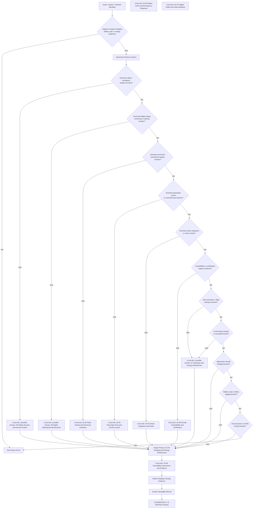
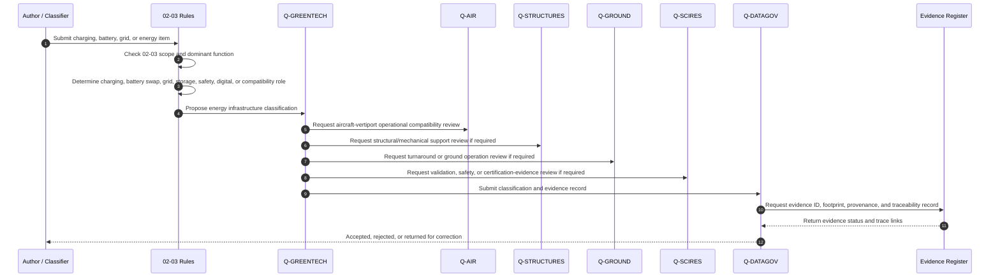
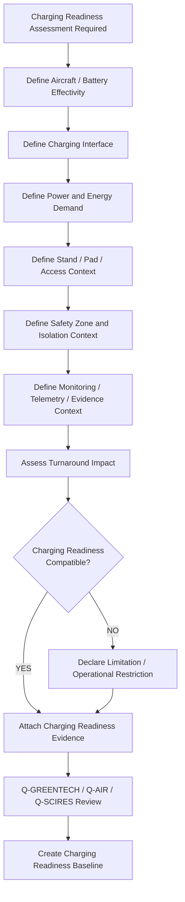
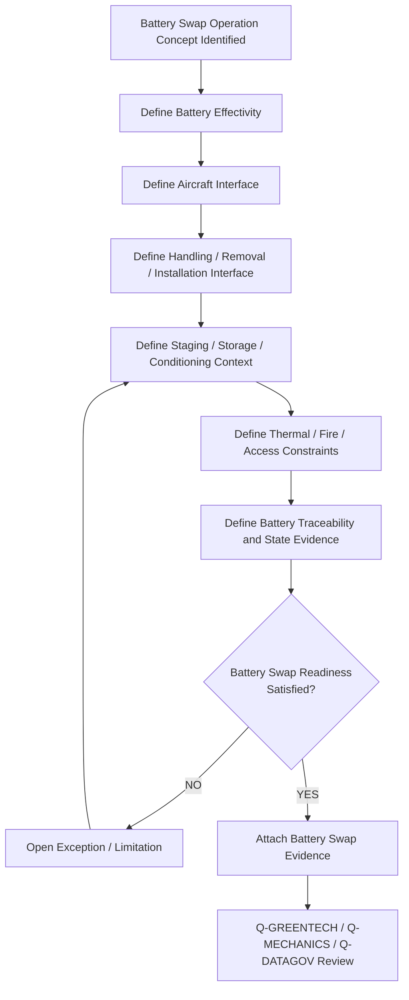
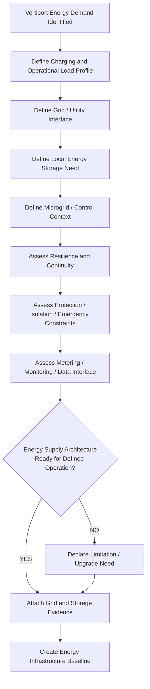
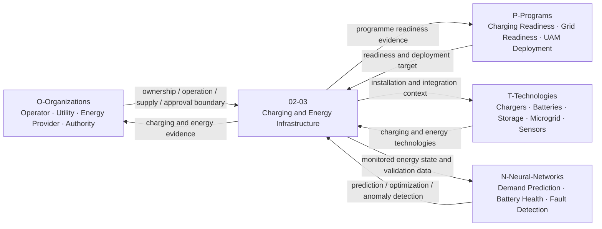
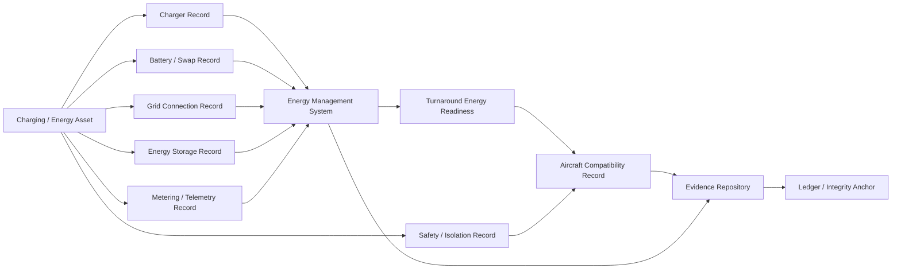

# 02-03-Charging-and-Energy-Infrastructure — Charging and Energy Infrastructure

## Purpose

High-power EV charging, battery swap systems, and grid connection at vertiports.

This document defines the classification boundary, infrastructure scope, charging and energy readiness logic, battery-swap interfaces, grid-connection context, energy safety constraints, evidence requirements, lifecycle governance, and traceability model for vertiport charging and energy infrastructure under:

```text
IDEALE-ESG/A-Aerospace/I-Infrastructures/02-Vertiports/
```

## Parent

[`README.md`](README.md) — `IDEALE-ESG/A-Aerospace/I-Infrastructures/02-Vertiports/`

---

# 1. Scope

`02-03-Charging-and-Energy-Infrastructure` covers vertiport infrastructure assets that provide high-power charging, battery readiness, battery swap support, ground power, grid connection, local energy storage, energy metering, energy isolation, charging safety, and energy-readiness evidence for VTOL/eVTOL/AAM/UAM operations.

This document covers the infrastructure classification and evidence-governance layer.

It does not replace detailed electrical design, utility interconnection studies, aircraft battery certification, charger manufacturer manuals, power-system protection studies, local electrical permits, operator procedures, or authority-issued vertiport approval.

It provides controlled taxonomy logic for:

- high-power eVTOL charging;
- conductive charging;
- automated or robotic charging interfaces;
- battery swap infrastructure;
- battery staging and readiness zones;
- ground power supply;
- grid connection and utility interface;
- transformer and switchgear interface context;
- local energy storage systems;
- microgrid interface context;
- renewable energy interface context;
- energy metering and billing interface context;
- emergency isolation and lockout context;
- charging safety zones;
- thermal and fire-risk context;
- hydrogen or future energy carrier readiness, if vertiport-coupled;
- aircraft charging compatibility evidence;
- turnaround energy readiness;
- digital energy monitoring;
- lifecycle and maintenance evidence;
- traceability records.

---

# 2. Controlled Definition

For this taxonomy, **vertiport charging and energy infrastructure** is:

> The physical, electrical, digital, safety, metering, storage, isolation, and operational infrastructure used to supply, control, monitor, exchange, store, condition, or evidence energy required for vertiport aircraft, ground support equipment, passenger operations, digital systems, and emergency readiness.

The core controlled elements are:

| Term | Controlled Meaning |
|---|---|
| `High-Power Charging` | Vertiport charging infrastructure capable of delivering high electrical power to aircraft or support systems within operational turnaround constraints. |
| `Charging Interface` | The physical, electrical, digital, and safety boundary between the energy infrastructure and the aircraft, battery system, GSE, or charging equipment. |
| `Battery Swap System` | Infrastructure used to remove, exchange, stage, inspect, charge, cool, store, or track aircraft batteries when battery exchange is part of the operating concept. |
| `Grid Connection` | Utility, microgrid, or local power-system interface supplying the vertiport energy infrastructure. |
| `Energy Storage System` | Battery, hydrogen, thermal, or other energy storage asset supporting charging, peak shaving, resilience, or emergency energy continuity. |
| `Energy Isolation Interface` | Controlled interface used to isolate electrical, battery, hydrogen, or stored-energy hazards during maintenance, emergency response, or abnormal operations. |
| `Energy Readiness` | Evidence-backed state indicating that required energy infrastructure is available, compatible, safe, monitored, and operationally ready for the defined aircraft or vertiport operation. |

---

# 3. Infrastructure Boundary

## 3.1 Included

This document includes:

- eVTOL high-power charging equipment;
- charging points and charging stands;
- conductive charging interfaces;
- robotic or automated charging interfaces;
- battery swap stations;
- battery staging areas;
- battery storage and conditioning rooms;
- charging cable management systems;
- charger foundations and support interfaces when energy-dominant;
- grid connection context;
- utility interface context;
- transformer, switchgear, and power distribution context;
- local energy storage;
- microgrid interfaces;
- renewable energy integration interfaces;
- ground power interfaces;
- eGSE charging when vertiport-coupled;
- energy metering and monitoring;
- charging digital control systems;
- emergency energy isolation;
- energy safety zones;
- thermal and fire-risk context;
- energy-readiness evidence;
- aircraft-charging compatibility evidence;
- traceability and evidence packaging.

## 3.2 Excluded

This document does not include:

- detailed aircraft battery design;
- aircraft type-certification approval;
- detailed charger internal design;
- detailed electrical protection coordination studies;
- detailed utility interconnection approval;
- local electrical permit approval;
- detailed battery maintenance procedure;
- detailed emergency-response procedure;
- detailed cybersecurity implementation;
- detailed building electrical design;
- regulator-approved compliance demonstration packages.

Excluded items may be cross-referenced when they support classification, applicability, effectivity, compatibility, energy-readiness evidence, or authority-engagement records.

---

# 4. Asset and Interface Classes

| Class | Description | Primary Classification |
|---|---|---|
| High-Power eVTOL Charger | Charging equipment supplying aircraft energy during vertiport operation. | `02-Vertiports` / `02-03`; cross-link `07` |
| Aircraft Charging Interface | Physical, electrical, data, and safety interface between aircraft and charger. | `02-03`; cross-link `02-08` |
| Conductive Charging Point | Conductive aircraft or GSE charging interface. | `02-03` |
| Robotic Charging Interface | Automated charging arm, coupling, or guided charging interface. | `02-03`; cross-link `02-02` if structural/mechanical dominant |
| Charging Stand | Stand or service position with integrated charging capability. | `02-03`; cross-link `02-02` |
| Battery Swap Station | Infrastructure used to exchange aircraft batteries. | `02-03` |
| Battery Staging Area | Controlled area for battery staging, inspection, conditioning, or readiness. | `02-03`; cross-link `02-06` when safety dominant |
| Battery Storage Room | Facility or enclosure used for battery storage and conditioning. | `02-03`; cross-link `09` if safety/security dominant |
| Ground Power Interface | Interface supplying power to aircraft or GSE at vertiport level. | `02-03` |
| Grid Connection Interface | Utility, substation, transformer, or distribution interface supplying vertiport energy demand. | `07-Hydrogen-and-Energy-Infrastructure`; secondary `02-03` |
| Local Energy Storage System | Storage system supporting charging, resilience, peak shaving, or energy continuity. | `07`; secondary `02-03` |
| Microgrid Interface | Local energy-management interface coordinating grid, storage, renewable, and charging loads. | `07` / `08`; secondary `02-03` |
| Energy Metering System | Metering, measurement, or billing interface for charging and energy use. | `08-Digital-Operational-Infrastructure`; secondary `02-03` |
| Energy Isolation Interface | Emergency or maintenance isolation interface for electrical or stored-energy systems. | `09-Safety-Security-and-Access-Control`; secondary `02-03` |
| Charging Safety Zone | Safety area around charging, battery swap, energy storage, or high-voltage equipment. | `02-06`; secondary `02-03` |
| Charging Digital Monitoring System | Digital system monitoring energy state, charger status, aircraft readiness, battery state, or energy events. | `08`; secondary `02-03` |
| Energy Readiness Evidence Package | Controlled package supporting vertiport charging, energy compatibility, safety, and operational readiness. | `02-03`; cross-link `02-09` |

---

# 5. Classification Rules

## RULE-I-INFRA-VERT-CEI-001 — Charging and Energy Function Rule

An asset shall be classified under `02-03-Charging-and-Energy-Infrastructure` when its primary function is to support vertiport charging, energy delivery, battery readiness, battery swapping, ground power, grid connection, local energy storage, energy monitoring, metering, or energy isolation.

## RULE-I-INFRA-VERT-CEI-002 — High-Power Charging Rule

High-power charging assets shall be classified under `02-03` when they support eVTOL aircraft energy replenishment, turnaround energy readiness, charging compatibility, dispatch readiness, or vertiport operational energy flow.

Minimum charging evidence shall include:

1. charger ID;
2. aircraft effectivity;
3. charging mode;
4. energy delivery context;
5. connector or coupling context;
6. power level context;
7. safety zone context;
8. digital monitoring context;
9. turnaround impact;
10. operational limitations.

## RULE-I-INFRA-VERT-CEI-003 — Battery Swap Rule

Battery swap systems shall be classified under `02-03` when their dominant function is battery removal, installation, staging, readiness, inspection, charging, thermal conditioning, traceability, or energy replenishment.

Battery swap records shall declare:

- battery effectivity;
- aircraft effectivity;
- handling interface;
- mechanical interface;
- energy state;
- thermal state;
- inspection state;
- safety constraints;
- digital traceability;
- operational limitations.

## RULE-I-INFRA-VERT-CEI-004 — Grid Connection Rule

Grid connection assets shall be related to `02-03` when they supply or condition energy for vertiport charging or energy readiness.

If the dominant function is cross-infrastructure energy conversion, distribution, storage, metering, or utility interface, primary classification shall be:

```text
07-Hydrogen-and-Energy-Infrastructure
```

with secondary relation to:

```text
02-03-Charging-and-Energy-Infrastructure
```

## RULE-I-INFRA-VERT-CEI-005 — Local Energy Storage Rule

Local energy storage systems shall cross-link to `02-03` when they support vertiport charging, peak shaving, resilience, emergency power, microgrid operation, or charging continuity.

If the dominant function is energy storage rather than vertiport-local operation, primary classification shall be:

```text
07-Hydrogen-and-Energy-Infrastructure
```

## RULE-I-INFRA-VERT-CEI-006 — Mechanical Charging Interface Rule

Charging equipment foundations, cable supports, charging arms, robotic couplings, pantographs, rails, alignment devices, or battery-swap mechanical supports shall cross-link to:

```text
02-02-Pads-Stands-and-Structural-Interfaces
```

If the dominant function is structural support or mechanical coupling, primary classification shall be `02-02`.

If the dominant function is energy transfer, primary classification shall be `02-03`.

## RULE-I-INFRA-VERT-CEI-007 — Stand Energy Integration Rule

Charging or ground-power infrastructure located at an aircraft stand shall cross-link to:

```text
02-02-Pads-Stands-and-Structural-Interfaces
```

when stand geometry, clearance, service zones, or aircraft position affect charging access.

## RULE-I-INFRA-VERT-CEI-008 — Passenger Access Energy Safety Rule

If charging, battery swap, or energy infrastructure affects passenger access, controlled movement, boarding separation, restricted areas, or public access control, it shall cross-link to:

```text
02-04-Passenger-Flow-and-Access-Control
```

## RULE-I-INFRA-VERT-CEI-009 — Urban Energy Integration Rule

If grid connection, battery storage, charging load, transformer location, acoustic profile, thermal rejection, visual impact, or utility interface affects city integration or community compatibility, it shall cross-link to:

```text
02-05-Urban-Integration-and-Noise
```

## RULE-I-INFRA-VERT-CEI-010 — Safety and Emergency Override Rule

If an asset primarily provides high-voltage safety, battery fire response, thermal runaway containment, emergency isolation, restricted access, rescue access, or hazard zoning, it shall be classified under:

```text
02-06-Safety-Zones-and-Emergency-Response
```

or:

```text
09-Safety-Security-and-Access-Control
```

with secondary relation to:

```text
02-03-Charging-and-Energy-Infrastructure
```

## RULE-I-INFRA-VERT-CEI-011 — Digital Energy Rule

If an asset primarily manages charger telemetry, battery state, energy metering, energy optimization, microgrid control, billing, battery traceability, predictive maintenance, or energy evidence, it shall cross-link to:

```text
02-07-Digital-Traffic-and-UAM-Interfaces
```

and may be primarily classified under:

```text
08-Digital-Operational-Infrastructure
```

when the dominant function is digital operations.

## RULE-I-INFRA-VERT-CEI-012 — Aircraft Compatibility Rule

If the charging or energy record supports aircraft compatibility, aircraft energy-interface applicability, charging protocol compatibility, battery swap compatibility, means of compliance, or certification-support evidence, it shall cross-link to:

```text
02-08-Aircraft-Compatibility-and-Certification
```

## RULE-I-INFRA-VERT-CEI-013 — Evidence Governance Rule

All charger, battery swap, grid connection, local storage, energy isolation, and energy-readiness records shall include traceability and evidence governance links to:

```text
02-09-Traceability-Governance-and-Evidence
```

## RULE-I-INFRA-VERT-CEI-014 — No Approval-by-Reference Rule

No charging, battery swap, grid connection, energy storage, or energy-readiness record shall claim electrical compliance, aircraft compatibility, vertiport certification, operational approval, utility approval, safety approval, or authority acceptance solely because it references EASA, FAA, ICAO, IEC, ISO, IEEE, NFPA, IAQG, or S1000D material.

Compliance requires programme-specific, aircraft-specific, energy-system-specific, infrastructure-specific, jurisdiction-specific, utility-specific, operator-specific, and authority-accepted evidence.

---

# 6. Classification Logic

## 6.1 Charging and Energy Infrastructure Classification Flow



## 6.2 Charging and Energy Evidence Sequence Diagram



## 6.3 Charging Readiness Logic



## 6.4 Battery Swap Logic



## 6.5 Grid Connection and Energy Storage Logic



## 6.6 Rule Priority Logic

```yaml
charging_energy_infrastructure_classification_logic:
  scope_gate:
    condition: "asset.domain == 'A-Aerospace' and asset.section == '02-Vertiports' and asset.supports_charging_or_energy_readiness == true"
    result_if_false: "not_primary_02_03"

  primary_assignment:
    - priority: 1
      condition: "asset.primary_function in ['high_power_charging', 'aircraft_charging', 'charging_interface', 'charging_stand', 'ground_power']"
      result: "02-03-Charging-and-Energy-Infrastructure"

    - priority: 2
      condition: "asset.primary_function in ['battery_swap', 'battery_staging', 'battery_conditioning', 'battery_readiness', 'battery_traceability']"
      result: "02-03-Charging-and-Energy-Infrastructure"

    - priority: 3
      condition: "asset.primary_function in ['grid_connection', 'utility_interface', 'transformer', 'switchgear', 'energy_distribution']"
      result: "07-Hydrogen-and-Energy-Infrastructure"
      required_cross_link: "02-03-Charging-and-Energy-Infrastructure"

    - priority: 4
      condition: "asset.primary_function in ['local_energy_storage', 'microgrid', 'peak_shaving', 'resilience_power', 'renewable_integration']"
      result: "07-Hydrogen-and-Energy-Infrastructure"
      required_cross_link: "02-03-Charging-and-Energy-Infrastructure"

    - priority: 5
      condition: "asset.primary_function in ['energy_metering', 'charger_telemetry', 'battery_state_monitoring', 'energy_optimization', 'billing_data']"
      result: "08-Digital-Operational-Infrastructure"
      required_cross_link: "02-03-Charging-and-Energy-Infrastructure"

    - priority: 6
      condition: "asset.primary_function in ['emergency_isolation', 'high_voltage_safety', 'battery_fire_response', 'hazard_zone', 'restricted_access']"
      result: "09-Safety-Security-and-Access-Control"
      required_cross_link: "02-03-Charging-and-Energy-Infrastructure"

  cross_links:
    pads_stands_structures: "02-02-Pads-Stands-and-Structural-Interfaces"
    passenger_access: "02-04-Passenger-Flow-and-Access-Control"
    urban_noise: "02-05-Urban-Integration-and-Noise"
    safety_emergency: "02-06-Safety-Zones-and-Emergency-Response"
    digital_traffic_uam: "02-07-Digital-Traffic-and-UAM-Interfaces"
    compatibility_certification: "02-08-Aircraft-Compatibility-and-Certification"
    traceability_governance: "02-09-Traceability-Governance-and-Evidence"
    energy_infrastructure: "07-Hydrogen-and-Energy-Infrastructure"
    digital_infrastructure: "08-Digital-Operational-Infrastructure"
    safety_security: "09-Safety-Security-and-Access-Control"

  evidence_required:
    - asset_id
    - asset_name
    - energy_function
    - aircraft_effectivity
    - charger_or_battery_effectivity
    - power_or_energy_context
    - grid_connection_context
    - safety_isolation_context
    - digital_monitoring_context
    - turnaround_impact_context
    - lifecycle_phase
    - applicability
    - effectivity
    - traceability_record
```

---

# 7. Charging and Energy Infrastructure Record

```yaml
charging_energy_infrastructure_record:
  asset_id: ""
  asset_name: ""
  asset_type: ""
  vertiport_id: ""
  physical_location: ""

  classification:
    domain: "A-Aerospace"
    opt_in_axis: "I-Infrastructures"
    section: "02-Vertiports"
    local_node: "02-03-Charging-and-Energy-Infrastructure"
    primary_classification: ""
    secondary_classifications:
      - ""

  energy_role:
    high_power_charging: false
    battery_swap: false
    battery_staging: false
    ground_power: false
    grid_connection: false
    local_energy_storage: false
    microgrid_interface: false
    energy_isolation: false
    energy_monitoring: false

  aircraft_interface:
    aircraft_effectivity: ""
    aircraft_class: ""
    charging_interface_context: ""
    connector_or_coupling_context: ""
    battery_interface_context: ""
    compatibility_limitations:
      - ""

  electrical_context:
    power_level_context: ""
    voltage_context: ""
    current_context: ""
    charging_mode_context: ""
    grid_connection_context: ""
    transformer_or_switchgear_context: ""
    protection_or_isolation_context: ""

  battery_context:
    battery_effectivity: ""
    battery_state_context: ""
    swap_required: false
    storage_or_conditioning_context: ""
    thermal_context: ""
    fire_risk_context: ""

  operational_context:
    stand_relation: ""
    pad_relation: ""
    turnaround_dependency: true
    minimum_ground_time_impact: ""
    passenger_access_relation: ""
    emergency_access_relation: ""

  digital_context:
    monitoring_required: true
    metering_required: false
    charger_telemetry_required: true
    battery_traceability_required: false
    data_interface_context: ""

  lifecycle:
    lifecycle_phase: ""
    maturity_state: ""
    governance_status: "controlled-candidate"

  applicability:
    applies_to:
      - ""
    does_not_apply_to:
      - ""

  effectivity:
    vertiport_effectivity: ""
    aircraft_effectivity: ""
    charger_effectivity: ""
    battery_effectivity: ""
    grid_connection_effectivity: ""
    energy_storage_effectivity: ""
    software_version_effectivity: ""
    operational_effectivity: ""
    temporal_effectivity: ""
    jurisdiction_effectivity: ""

  evidence:
    evidence_items:
      - evidence_id: ""
        evidence_class: ""
        evidence_status: ""

  traceability:
    upstream:
      - ""
    downstream:
      - ""
```

---

# 8. High-Power Charging Record Template

```yaml
high_power_charging_record:
  charger_id: ""
  vertiport_id: ""
  asset_name: ""
  charger_type:
    - "conductive_charger"
    - "robotic_charger"
    - "pantograph_charger"
    - "automated_charging_interface"
    - "ground_power_charger"

  classification:
    primary_section: "02-Vertiports"
    local_node: "02-03-Charging-and-Energy-Infrastructure"

  aircraft_effectivity:
    aircraft_classes:
      - ""
    aircraft_type_or_configuration: ""
    charging_interface_effectivity: ""

  charging_context:
    power_level_context: ""
    charging_mode: ""
    connector_or_coupling_context: ""
    communication_interface_context: ""
    expected_charging_duration_context: ""
    turnaround_dependency: true

  installation_context:
    stand_id: ""
    pad_id: ""
    cable_management_context: ""
    structural_support_context: ""
    clearance_context: ""

  safety:
    high_voltage_safety_required: true
    emergency_isolation_required: true
    thermal_monitoring_required: false
    restricted_access_required: true
    safety_zone_context: ""

  digital_monitoring:
    charger_telemetry_required: true
    energy_metering_required: true
    evidence_record_required: true
    data_interface_context: ""

  evidence:
    - evidence_id: ""
      evidence_class: "charging-readiness-evidence"
```

---

# 9. Battery Swap Record Template

```yaml
battery_swap_record:
  battery_swap_id: ""
  vertiport_id: ""
  asset_name: ""
  operation_context: ""

  classification:
    primary_section: "02-Vertiports"
    local_node: "02-03-Charging-and-Energy-Infrastructure"

  battery_effectivity:
    battery_type: ""
    battery_configuration: ""
    aircraft_effectivity: ""
    battery_serial_traceability_required: true

  swap_process_context:
    removal_interface: ""
    installation_interface: ""
    handling_equipment_context: ""
    human_or_automated_handling: ""
    inspection_context: ""
    acceptance_context: ""

  storage_and_conditioning:
    staging_area_id: ""
    storage_context: ""
    thermal_conditioning_required: false
    fire_protection_context: ""
    state_of_charge_context: ""
    quarantine_or_rejection_context: ""

  interfaces:
    mechanical_interface_relation: "02-02-Pads-Stands-and-Structural-Interfaces"
    passenger_access_relation: "02-04-Passenger-Flow-and-Access-Control"
    safety_relation: "02-06-Safety-Zones-and-Emergency-Response"
    digital_traceability_relation: "02-07-Digital-Traffic-and-UAM-Interfaces"

  evidence:
    - evidence_id: ""
      evidence_class: "battery-swap-evidence"

  review:
    owner: "Q-GREENTECH"
    supporting_q_divisions:
      - "Q-MECHANICS"
      - "Q-GROUND"
      - "Q-SCIRES"
      - "Q-DATAGOV"
    review_status: "controlled-candidate"
```

---

# 10. Grid Connection Record Template

```yaml
grid_connection_record:
  grid_connection_id: ""
  vertiport_id: ""
  asset_name: ""
  utility_or_microgrid_context: ""

  classification:
    primary_section: "07-Hydrogen-and-Energy-Infrastructure"
    secondary_relation: "02-03-Charging-and-Energy-Infrastructure"

  energy_demand_context:
    peak_load_context: ""
    average_load_context: ""
    charging_load_profile: ""
    operational_load_profile: ""
    emergency_load_context: ""

  infrastructure_context:
    point_of_connection: ""
    transformer_context: ""
    switchgear_context: ""
    distribution_context: ""
    protection_context: ""
    metering_context: ""

  resilience:
    redundancy_context: ""
    backup_power_context: ""
    energy_storage_relation: ""
    microgrid_operation_required: false
    continuity_limitations:
      - ""

  interfaces:
    charging_assets:
      - ""
    local_storage_assets:
      - ""
    digital_energy_management_system: ""
    emergency_isolation_system: ""

  evidence:
    - evidence_id: ""
      evidence_class: "grid-connection-evidence"

  review:
    owner: "Q-GREENTECH"
    supporting_q_divisions:
      - "Q-DATAGOV"
      - "Q-SCIRES"
      - "Q-HPC"
    review_status: "controlled-candidate"
```

---

# 11. Local Energy Storage Record Template

```yaml
local_energy_storage_record:
  storage_id: ""
  vertiport_id: ""
  asset_name: ""
  storage_type:
    - "battery_energy_storage"
    - "hydrogen_storage"
    - "thermal_storage"
    - "future_energy_storage"

  classification:
    primary_section: "07-Hydrogen-and-Energy-Infrastructure"
    secondary_relation: "02-03-Charging-and-Energy-Infrastructure"

  energy_role:
    peak_shaving: false
    resilience: false
    backup_power: false
    charging_support: false
    renewable_integration: false
    emergency_power: false

  technical_context:
    capacity_context: ""
    power_context: ""
    state_of_charge_context: ""
    thermal_context: ""
    degradation_context: ""
    lifecycle_context: ""

  safety:
    safety_zone_required: true
    emergency_isolation_required: true
    fire_response_context: ""
    restricted_access_required: true

  digital_monitoring:
    monitoring_required: true
    metering_required: true
    energy_management_interface: ""
    evidence_record_required: true

  evidence:
    - evidence_id: ""
      evidence_class: "energy-storage-evidence"

  review:
    owner: "Q-GREENTECH"
    supporting_q_divisions:
      - "Q-SCIRES"
      - "Q-DATAGOV"
      - "Q-HPC"
    review_status: "controlled-candidate"
```

---

# 12. Energy Safety and Isolation Record Template

```yaml
energy_safety_isolation_record:
  isolation_record_id: ""
  vertiport_id: ""
  related_asset_id: ""
  asset_type:
    - "charger"
    - "battery_swap_station"
    - "battery_storage"
    - "grid_connection"
    - "energy_storage"
    - "ground_power"
    - "hydrogen_energy_interface"

  classification:
    primary_section: "09-Safety-Security-and-Access-Control"
    secondary_relation: "02-03-Charging-and-Energy-Infrastructure"

  hazard_context:
    high_voltage: false
    battery_fire: false
    thermal_runaway: false
    arc_flash: false
    hydrogen: false
    stored_energy: false
    restricted_access: false

  isolation_context:
    isolation_method: ""
    emergency_stop_required: true
    lockout_tagout_required: false
    remote_isolation_required: false
    manual_isolation_required: false
    reset_or_recovery_context: ""

  emergency_response:
    emergency_access_required: true
    response_interface: "02-06-Safety-Zones-and-Emergency-Response"
    responder_information_required: true
    signage_or_marking_context: ""

  evidence:
    - evidence_id: ""
      evidence_class: "energy-safety-evidence"

  review:
    owner: "Q-GREENTECH"
    supporting_q_divisions:
      - "Q-SCIRES"
      - "Q-DATAGOV"
      - "Q-GROUND"
    review_status: "controlled-candidate"
```

---

# 13. Interfaces with Vertiport Nodes

| Vertiport Node | Interface with `02-03` |
|---|---|
| `02-00-Vertiports-General` | Parent scope, general vertiport classification, reference map, and governance model. |
| `02-01-Landing-and-Takeoff-Areas` | Charging proximity to landing/takeoff areas, safety offsets, operational energy readiness, and pad-adjacent constraints. |
| `02-02-Pads-Stands-and-Structural-Interfaces` | Charging stand structure, charger foundations, cable supports, robotic charging support, battery swap mechanical interfaces, and stand geometry. |
| `02-04-Passenger-Flow-and-Access-Control` | Passenger separation from high-voltage equipment, access-controlled charging zones, boarding route constraints, and public interface protection. |
| `02-05-Urban-Integration-and-Noise` | Grid connection, transformer siting, thermal rejection, acoustic footprint, visual impact, community interface, and utility integration. |
| `02-06-Safety-Zones-and-Emergency-Response` | High-voltage safety, battery fire, thermal runaway, emergency isolation, restricted zones, rescue access, and responder information. |
| `02-07-Digital-Traffic-and-UAM-Interfaces` | Charging scheduling, charger telemetry, energy-state monitoring, fleet energy optimization, digital slotting, and battery traceability. |
| `02-08-Aircraft-Compatibility-and-Certification` | Aircraft charging compatibility, battery compatibility, energy-interface MoC, operational limitations, and certification-support evidence. |
| `02-09-Traceability-Governance-and-Evidence` | Evidence records, applicability, effectivity, traceability, baselines, exceptions, and auditability. |

---

# 14. Interfaces with OPT-IN Axes

| OPT-IN Axis | Interface with Charging and Energy Infrastructure |
|---|---|
| `O-Organizations` | Vertiport operator, aircraft operator, charging operator, utility provider, energy provider, emergency services, regulator, maintenance provider. |
| `P-Programs` | eVTOL EIS programme, charging-readiness programme, grid-readiness programme, UAM deployment programme, energy-transition programme. |
| `T-Technologies` | High-power chargers, battery systems, battery swap equipment, energy storage, microgrids, meters, sensors, energy management systems. |
| `I-Infrastructures` | Charging points, stands, grid interfaces, battery rooms, storage systems, substations, safety zones, digital energy systems. |
| `N-Neural-Networks` | Charging demand prediction, battery health prediction, charger fault detection, grid load forecasting, energy optimization, anomaly detection. |

## 14.1 OPT-IN Interface Diagram



---

# 15. Q-Division Governance

| Q-Division | Governance Role |
|---|---|
| `Q-GREENTECH` | Primary owner for charging infrastructure, battery readiness, grid connection, energy storage, ground power, energy safety, sustainability, and vertiport energy-transition classification. |
| `Q-AIR` | Supports aircraft-vertiport operational compatibility, aircraft charging interface relevance, turnaround energy readiness, and operational limitations. |
| `Q-DATAGOV` | Controls naming, traceability, evidence records, digital-thread continuity, canonical paths, provenance, data interfaces, and publication readiness. |
| `Q-GROUND` | Supports charging operations, ground support, turnaround integration, battery handling, service-zone operation, and dispatch-readiness context. |
| `Q-STRUCTURES` | Supports charger foundations, battery room structural context, equipment supports, stand integration, and structural proximity constraints. |
| `Q-MECHANICS` | Supports charging couplings, robotic arms, battery-swap mechanical interfaces, cable handling, docking supports, and maintainability. |
| `Q-SCIRES` | Supports verification, validation, safety evidence, MoC readiness, certification-support evidence, and authority-engagement feasibility. |
| `Q-HPC` | Supports grid-load simulation, charging optimization, battery health analytics, digital twin computation, and AI/ML infrastructure analytics. |

---

# 16. Lifecycle Applicability

| Lifecycle Phase | Charging and Energy Infrastructure Role |
|---|---|
| `LC01` | Define charging, battery, grid, and energy-readiness scope and classification boundary. |
| `LC02` | Define energy requirements, charging requirements, grid needs, safety constraints, digital monitoring needs, and evidence requirements. |
| `LC03` | Define energy architecture, charging interfaces, battery swap model, grid interface model, safety zones, and digital-thread dependencies. |
| `LC04` | Develop preliminary charging concepts, energy-demand assumptions, grid-readiness studies, storage concepts, and battery-swap assumptions. |
| `LC05` | Produce detailed charger, battery, grid, storage, energy-isolation, and compatibility records. |
| `LC06` | Define verification, validation, inspection, commissioning, electrical safety, charging performance, and acceptance criteria. |
| `LC07` | Construct, configure, install, or deploy charging, battery, grid, storage, and monitoring infrastructure. |
| `LC08` | Integrate energy infrastructure with pads, stands, passenger access, safety systems, digital traffic systems, and aircraft compatibility records. |
| `LC09` | Commission charging and energy infrastructure and establish handover evidence. |
| `LC10` | Support certification, operational approval, authority engagement, utility acceptance, compatibility evidence, or readiness review where applicable. |
| `LC11` | Operate charging and energy infrastructure in service. |
| `LC12` | Inspect, maintain, monitor, repair, calibrate, test, and preserve charging and energy infrastructure validity. |
| `LC13` | Upgrade, expand, reconfigure, automate, grid-reinforce, add storage, revalidate, or rebaseline charging and energy systems. |
| `LC14` | Retire, isolate, archive, replace, remove, or decommission charging and energy assets and records. |

---

# 17. Evidence Requirements

## 17.1 Minimum Evidence

Each controlled charging or energy infrastructure record shall include:

1. asset ID;
2. asset name;
3. asset type;
4. vertiport ID;
5. charging or energy role;
6. aircraft effectivity;
7. charger, battery, or grid effectivity;
8. power or energy context;
9. grid connection context, if applicable;
10. battery swap or storage context, if applicable;
11. safety and isolation context;
12. digital monitoring context;
13. turnaround impact statement;
14. operational limitation statement;
15. lifecycle phase;
16. applicability statement;
17. effectivity statement;
18. responsible Q-Division;
19. citation keys, if applicable;
20. evidence footprint;
21. traceability record.

## 17.2 Evidence Classes

| Evidence Class | Use |
|---|---|
| `classification-evidence` | Supports assignment to `02-03-Charging-and-Energy-Infrastructure`. |
| `charging-readiness-evidence` | Supports charger availability, interface, power level, operational readiness, and aircraft charging context. |
| `aircraft-charging-compatibility-evidence` | Supports aircraft-to-charger compatibility and charging interface applicability. |
| `battery-swap-evidence` | Supports battery removal, installation, staging, inspection, conditioning, and exchange readiness. |
| `battery-traceability-evidence` | Supports battery identity, state, history, health, effectivity, and chain-of-custody. |
| `grid-connection-evidence` | Supports utility, point-of-connection, transformer, switchgear, distribution, and supply capability context. |
| `energy-storage-evidence` | Supports local storage, microgrid support, resilience, peak shaving, and emergency power context. |
| `energy-safety-evidence` | Supports high-voltage safety, fire risk, thermal runaway, isolation, restricted access, and emergency response. |
| `metering-evidence` | Supports energy measurement, billing, performance, data quality, and operational reporting. |
| `digital-energy-evidence` | Supports monitoring, telemetry, energy management, digital twin, optimization, and evidence records. |
| `turnaround-evidence` | Supports charging duration, dispatch readiness, minimum ground time, and operational sequencing. |
| `compatibility-evidence` | Supports aircraft-vertiport and aircraft-energy interface compatibility. |
| `certification-evidence` | Supports regulatory, authority, programme, or vertiport certification-support context. |
| `traceability-evidence` | Supports upstream/downstream links, applicability, effectivity, review status, and digital-thread continuity. |

## 17.3 Evidence Package Template

```yaml
charging_energy_infrastructure_evidence_package:
  package_id: ""
  package_title: ""
  infrastructure_section: "02-Vertiports"
  local_node: "02-03-Charging-and-Energy-Infrastructure"
  asset_id: ""
  asset_name: ""
  owner: "Q-GREENTECH"

  supporting_q_divisions:
    - "Q-AIR"
    - "Q-DATAGOV"
    - "Q-GROUND"
    - "Q-MECHANICS"
    - "Q-SCIRES"

  lifecycle_phase: ""

  applicability:
    applies_to:
      - ""
    does_not_apply_to:
      - ""

  effectivity:
    vertiport_effectivity: ""
    aircraft_effectivity: ""
    charger_effectivity: ""
    battery_effectivity: ""
    grid_connection_effectivity: ""
    energy_storage_effectivity: ""
    software_version_effectivity: ""
    operational_effectivity: ""
    temporal_effectivity: ""
    jurisdiction_effectivity: ""

  evidence_items:
    - evidence_id: ""
      evidence_class: ""
      title: ""
      status: ""
      repository_path: ""

  limitations:
    - limitation_id: ""
      description: ""
      affected_operation: ""

  safety:
    safety_zone_status: ""
    isolation_status: ""
    emergency_response_link: ""

  traceability:
    upstream:
      - ""
    downstream:
      - ""

  review:
    reviewer: ""
    approval_status: ""
```

---

# 18. Digital Thread

Charging and energy infrastructure shall preserve a controlled digital thread linking physical assets, charger records, grid connection records, battery records, energy storage records, safety isolation records, operational energy events, aircraft compatibility, turnaround readiness, and certification-support evidence.

Digital-thread interfaces may include:

- vertiport energy asset register;
- charger register;
- battery register;
- battery health records;
- battery swap records;
- grid connection records;
- energy storage records;
- metering records;
- energy management system;
- charger telemetry;
- aircraft charging compatibility records;
- charging event records;
- safety isolation records;
- emergency response records;
- digital traffic and slotting records;
- evidence repository;
- PLM or configuration record;
- CSDB/IETP publication interface;
- ledger or integrity anchor.

## 18.1 Charging and Energy Digital Thread Diagram



---

# 19. Classification Examples

## 19.1 High-Power eVTOL Charger

```yaml
asset:
  asset_name: "High-Power eVTOL Charger C-01"
  asset_type: "high-power aircraft charger"
  primary_function: "aircraft charging and turnaround energy readiness"
  primary_classification:
    section_code: "02"
    section_name: "Vertiports"
    local_node: "02-03-Charging-and-Energy-Infrastructure"
  secondary_classifications:
    - section_code: "07"
      section_name: "Hydrogen and Energy Infrastructure"
      relation: "Energy delivery and charging infrastructure context"
    - section_code: "02-08"
      section_name: "Aircraft Compatibility and Certification"
      relation: "Aircraft charging compatibility evidence"
  evidence:
    - evidence_class: "charging-readiness-evidence"
    - evidence_class: "aircraft-charging-compatibility-evidence"
```

## 19.2 Battery Swap Station

```yaml
asset:
  asset_name: "eVTOL Battery Swap Station BSS-01"
  asset_type: "battery swap infrastructure"
  primary_function: "battery exchange, staging, readiness, and traceability"
  primary_classification:
    section_code: "02"
    section_name: "Vertiports"
    local_node: "02-03-Charging-and-Energy-Infrastructure"
  secondary_classifications:
    - section_code: "02-02"
      section_name: "Pads Stands and Structural Interfaces"
      relation: "Mechanical handling and support interface"
    - section_code: "02-06"
      section_name: "Safety Zones and Emergency Response"
      relation: "Battery safety and emergency response context"
  evidence:
    - evidence_class: "battery-swap-evidence"
    - evidence_class: "battery-traceability-evidence"
```

## 19.3 Grid Connection Interface

```yaml
asset:
  asset_name: "Vertiport Grid Connection Interface"
  asset_type: "utility and grid interface"
  primary_function: "supply and condition electrical energy for vertiport charging load"
  primary_classification:
    section_code: "07"
    section_name: "Hydrogen and Energy Infrastructure"
  secondary_classifications:
    - section_code: "02"
      section_name: "Vertiports"
      relation: "Vertiport charging-readiness context"
    - section_code: "02-03"
      section_name: "Charging and Energy Infrastructure"
      relation: "Local vertiport energy interface"
  evidence:
    - evidence_class: "grid-connection-evidence"
    - evidence_class: "energy-readiness-evidence"
```

## 19.4 Local Energy Storage System

```yaml
asset:
  asset_name: "Vertiport Battery Energy Storage System"
  asset_type: "local energy storage system"
  primary_function: "support charging peak load, resilience, and energy continuity"
  primary_classification:
    section_code: "07"
    section_name: "Hydrogen and Energy Infrastructure"
  secondary_classifications:
    - section_code: "02-03"
      section_name: "Charging and Energy Infrastructure"
      relation: "Charging support and vertiport resilience"
    - section_code: "02-06"
      section_name: "Safety Zones and Emergency Response"
      relation: "Stored-energy safety and fire response"
  evidence:
    - evidence_class: "energy-storage-evidence"
    - evidence_class: "energy-safety-evidence"
```

## 19.5 Charging Digital Monitoring System

```yaml
asset:
  asset_name: "Vertiport Charging Monitoring System"
  asset_type: "digital energy monitoring system"
  primary_function: "monitor charger state, battery state, energy use, and charging readiness"
  primary_classification:
    section_code: "08"
    section_name: "Digital Operational Infrastructure"
  secondary_classifications:
    - section_code: "02-03"
      section_name: "Charging and Energy Infrastructure"
      relation: "Charging telemetry and energy-readiness evidence"
    - section_code: "02-07"
      section_name: "Digital Traffic and UAM Interfaces"
      relation: "Operational scheduling and energy-state integration"
  evidence:
    - evidence_class: "digital-energy-evidence"
    - evidence_class: "metering-evidence"
```

---

# 20. Reference Map

| Citation Key | Applies To | Use in `02-03` |
|---|---|---|
| `EASA-VERTIPORT` | Vertiport design and operational readiness | Reference family for vertiport charging, safety, and infrastructure-readiness context. |
| `FAA-VERTIPORT` | Vertiport design and planning | Reference family for US vertiport planning, charging layout, and energy infrastructure context. |
| `ICAO-ANNEX14` | Aerodrome physical and operational context | Reference family where vertiport energy infrastructure interfaces with airport-integrated infrastructure. |
| `ICAO-ANNEX19` | Safety management | Reference family for safety-risk, hazard, and safety-management context. |
| `IEC-61851` | Conductive charging systems | Charging-system reference family for conductive charging infrastructure context. |
| `IEC-62196` | Plugs, socket-outlets, vehicle connectors and inlets | Connector and coupling reference family for electric charging interfaces where applicable. |
| `ISO-15118` | Vehicle-to-grid communication interface | Communication and charging interface reference family where applicable to energy data exchange. |
| `ISO-19880-1` | Hydrogen fuelling | Hydrogen fuelling reference family where hydrogen energy readiness is in scope. |
| `NFPA-2` | Hydrogen safety | Hydrogen safety, storage, handling, and emergency-response reference family. |
| `NFPA-70` | Electrical installation safety | Electrical installation reference family where applicable to vertiport energy infrastructure. |
| `IEEE-2030-5` | Smart energy profile and grid interaction | Smart grid and energy management reference family where applicable. |
| `ISO-55000` | Asset management | Charging and energy infrastructure lifecycle and asset-management reference family. |
| `ISO-31000` | Risk management | Electrical, battery, grid, operational, and safety-risk reference family. |
| `ISO-9001` | Quality management | Controlled records and infrastructure-process governance reference family. |
| `IAQG-9100` | Aerospace QMS | Aviation, space, and defense quality-management reference family. |
| `ISO-IEC-IEEE-15288` | System lifecycle processes | Lifecycle-process reference family for energy infrastructure systems. |
| `ISO-IEC-27001` | Information security management | Digital energy management and charging-data security reference family. |
| `S1000D` | Technical publications | CSDB/IETP reference family for controlled publication-ready vertiport infrastructure data. |

---

# 21. Controlled References

## [EASA-VERTIPORT]

**EASA vertiport technical design specification reference family.**

Used as a European vertiport design and readiness reference family for charging, energy infrastructure, safety constraints, and operational integration.

## [FAA-VERTIPORT]

**FAA vertiport design and planning reference family.**

Used as a US vertiport planning and design reference family for charging layout, utility interface, energy infrastructure, and operational readiness.

## [ICAO-ANNEX14]

**ICAO Annex 14 — Aerodromes, Volume I, Aerodrome Design and Operations.**

Used as the international aerodrome reference family when vertiport charging and energy infrastructure interfaces with airport or aerodrome infrastructure.

## [ICAO-ANNEX19]

**ICAO Annex 19 — Safety Management.**

Used as the international aviation safety-management reference family for safety risk, hazard management, and safety evidence.

## [IEC-61851]

**IEC 61851 — Electric Vehicle Conductive Charging System.**

Used as the conductive charging reference family where vertiport charging interfaces use applicable electric charging infrastructure concepts.

## [IEC-62196]

**IEC 62196 — Plugs, Socket-Outlets, Vehicle Connectors and Vehicle Inlets.**

Used as the connector, inlet, and coupling reference family where applicable to charging interface classification.

## [ISO-15118]

**ISO 15118 — Road Vehicles, Vehicle-to-Grid Communication Interface.**

Used as a charging communication reference family where energy exchange, charging control, identification, or data exchange concepts are applicable.

## [ISO-19880-1]

**ISO 19880-1 — Gaseous Hydrogen Fuelling Stations.**

Used as the hydrogen fuelling-station reference family where hydrogen-readiness context applies. Programme-specific assessment is required for aerospace hydrogen applications.

## [NFPA-2]

**NFPA 2 — Hydrogen Technologies Code.**

Used as the hydrogen safety-code reference family for hydrogen storage, handling, installation, emergency isolation, and emergency-response evidence.

## [NFPA-70]

**NFPA 70 — National Electrical Code.**

Used as an electrical installation safety reference family where jurisdictionally applicable to charging and energy infrastructure.

## [IEEE-2030-5]

**IEEE 2030.5 — Smart Energy Profile Application Protocol.**

Used as a smart energy and grid-interaction reference family where digital energy management or grid coordination is applicable.

## [ISO-55000]

**ISO 55000 — Asset Management, Vocabulary, Overview and Principles.**

Used as the asset-management reference family for charging assets, grid interfaces, energy storage, battery systems, and lifecycle governance.

## [ISO-31000]

**ISO 31000 — Risk Management Guidelines.**

Used as the risk-management reference family for electrical risk, battery risk, grid risk, operational risk, emergency isolation, and safety governance.

## [ISO-9001]

**ISO 9001 — Quality Management Systems Requirements.**

Used as the general quality-management reference family for process governance, review, improvement, audit, and controlled records.

## [IAQG-9100]

**IAQG 9100 — Quality Management Systems Requirements for Aviation, Space and Defense Organizations.**

Used as the aerospace quality-management reference family for aviation, space, defense, supplier, maintenance, production, and lifecycle governance.

## [ISO-IEC-IEEE-15288]

**ISO/IEC/IEEE 15288 — Systems and Software Engineering, System Life Cycle Processes.**

Used as the system lifecycle-process reference family for energy infrastructure system definition, verification, validation, operation, maintenance, and retirement.

## [ISO-IEC-27001]

**ISO/IEC 27001 — Information Security Management Systems.**

Used as the information-security management reference family for charging data, energy management systems, digital monitoring, and evidence repositories.

## [S1000D]

**S1000D — International Specification for Technical Publications Using a Common Source Database.**

Used as the technical-publication and CSDB reference family when charging and energy infrastructure documentation requires controlled data modules, applicability, effectivity, publication readiness, or IETP integration.

---

# 22. Traceability Record

```yaml
charging_energy_infrastructure_traceability_record:
  document_id: "IDEALE-ESG-A-AEROSPACE-I-INFRASTRUCTURES-02-03-CHARGING-AND-ENERGY-INFRASTRUCTURE"
  canonical_path: "IDEALE-ESG/A-Aerospace/I-Infrastructures/02-Vertiports/02-03-Charging-and-Energy-Infrastructure.md"
  parent_path: "IDEALE-ESG/A-Aerospace/I-Infrastructures/02-Vertiports/"
  upstream:
    - "IDEALE-ESG-A-AEROSPACE-I-INFRASTRUCTURES-02-00-VERTIPORTS-GENERAL"
    - "IDEALE-ESG-A-AEROSPACE-I-INFRASTRUCTURES-02-01-LANDING-AND-TAKEOFF-AREAS"
    - "IDEALE-ESG-A-AEROSPACE-I-INFRASTRUCTURES-02-02-PADS-STANDS-AND-STRUCTURAL-INTERFACES"
    - "IDEALE-ESG-A-AEROSPACE-I-INFRASTRUCTURES-00-02-INFRASTRUCTURE-CLASSIFICATION-RULES"
    - "IDEALE-ESG-A-AEROSPACE-I-INFRASTRUCTURES-00-03-STANDARDS-AND-REGULATORY-REFERENCES"
    - "IDEALE-ESG-A-AEROSPACE-I-INFRASTRUCTURES-00-04-APPLICABILITY-AND-EFFECTIVITY"
    - "IDEALE-ESG-A-AEROSPACE-I-INFRASTRUCTURES-00-05-LIFECYCLE-AND-GOVERNANCE"
    - "IDEALE-ESG-A-AEROSPACE-I-INFRASTRUCTURES-00-06-INTERFACES-WITH-OPTIN-AXES"
    - "IDEALE-ESG-A-AEROSPACE-I-INFRASTRUCTURES-00-07-TRACEABILITY-AND-EVIDENCE"
    - "IDEALE-ESG-A-AEROSPACE-I-INFRASTRUCTURES-00-08-NAMING-CONVENTIONS"
  downstream:
    - "02-04-Passenger-Flow-and-Access-Control"
    - "02-05-Urban-Integration-and-Noise"
    - "02-06-Safety-Zones-and-Emergency-Response"
    - "02-07-Digital-Traffic-and-UAM-Interfaces"
    - "02-08-Aircraft-Compatibility-and-Certification"
    - "02-09-Traceability-Governance-and-Evidence"
    - "07-Hydrogen-and-Energy-Infrastructure"
    - "08-Digital-Operational-Infrastructure"
    - "09-Safety-Security-and-Access-Control"
```

---

# 23. Footprints

## Semantic Footprint

```yaml
semantic_footprint:
  id: FP-SEM-I-INFRA-02-03
  subject: "Vertiport charging and energy infrastructure, including high-power charging, battery swap, grid connection, energy storage, and energy readiness"
  meaning_boundary:
    includes:
      - high-power eVTOL charging
      - aircraft charging interfaces
      - conductive charging
      - robotic charging
      - battery swap systems
      - battery staging and storage
      - grid connection
      - transformer and switchgear context
      - local energy storage
      - microgrid interfaces
      - ground power
      - energy metering
      - emergency isolation
      - charging safety zones
      - aircraft charging compatibility evidence
    excludes:
      - aircraft battery type-design approval
      - detailed charger internal design
      - detailed electrical protection studies
      - utility interconnection approval
      - local electrical permits
      - regulator-approved compliance demonstration
```

## Taxonomy Footprint

```yaml
taxonomy_footprint:
  id: FP-TAX-I-INFRA-02-03
  hierarchy:
    root: "IDEALE-ESG"
    domain: "A-Aerospace"
    opt_in_axis: "I-Infrastructures"
    section: "02-Vertiports"
    document: "02-03-Charging-and-Energy-Infrastructure"
```

## Lifecycle Footprint

```yaml
lifecycle_footprint:
  id: FP-LC-I-INFRA-02-03
  lifecycle_phase: "LC01"
  lifecycle_role: "Defines vertiport charging, battery, grid, storage, energy-safety, and energy-readiness infrastructure scope"
  exit_criteria:
    - high-power charging scope defined
    - battery swap scope defined
    - grid connection scope defined
    - energy storage scope defined
    - energy safety and isolation scope defined
    - classification rules defined
    - cross-node interfaces mapped
    - evidence requirements defined
    - reference families mapped
```

## Compliance Footprint

```yaml
compliance_footprint:
  id: FP-COMP-I-INFRA-02-03
  reference_families:
    vertiports:
      - "EASA-VERTIPORT"
      - "FAA-VERTIPORT"
    aerodromes:
      - "ICAO-ANNEX14"
    safety_management:
      - "ICAO-ANNEX19"
      - "ISO-31000"
    electric_charging:
      - "IEC-61851"
      - "IEC-62196"
      - "ISO-15118"
    hydrogen_and_energy:
      - "ISO-19880-1"
      - "NFPA-2"
    electrical_installation:
      - "NFPA-70"
    smart_grid:
      - "IEEE-2030-5"
    asset_management:
      - "ISO-55000"
    quality_management:
      - "ISO-9001"
      - "IAQG-9100"
    system_lifecycle:
      - "ISO-IEC-IEEE-15288"
    information_security:
      - "ISO-IEC-27001"
    technical_publications:
      - "S1000D"
```

## Evidence Footprint

```yaml
evidence_footprint:
  id: FP-EVD-I-INFRA-02-03
  expected_evidence:
    - controlled markdown document
    - YAML frontmatter
    - canonical path
    - parent path
    - charging and energy infrastructure record template
    - high-power charging record template
    - battery swap record template
    - grid connection record template
    - local energy storage record template
    - energy safety and isolation record template
    - classification rules
    - classification logic diagram
    - evidence sequence diagram
    - charging readiness logic diagram
    - battery swap logic diagram
    - grid connection and energy storage logic diagram
    - cross-node interface map
    - digital-thread diagram
    - reference map
    - traceability record
```

---

# 24. Governance Rule

Any child or derivative record under `02-03-Charging-and-Energy-Infrastructure` shall declare:

1. charging, battery, grid, storage, ground-power, or energy asset type;
2. vertiport context;
3. aircraft effectivity;
4. charger, battery, grid, or energy-system effectivity;
5. power or energy context;
6. charging interface context;
7. battery swap context, if applicable;
8. grid connection context, if applicable;
9. safety and isolation context;
10. digital monitoring context;
11. turnaround impact;
12. operational limitations;
13. primary classification;
14. secondary classifications, if applicable;
15. applicability;
16. effectivity;
17. lifecycle phase;
18. responsible Q-Division;
19. evidence footprint;
20. traceability record.

No charger, battery swap, battery storage, grid connection, energy storage, ground power, microgrid, metering, or energy-isolation document shall claim electrical compliance, aircraft compatibility, vertiport certification, operational approval, utility approval, safety approval, cybersecurity approval, or authority acceptance solely because it references EASA, FAA, ICAO, IEC, ISO, IEEE, NFPA, IAQG, or S1000D material.

Compliance requires programme-specific, aircraft-specific, energy-system-specific, infrastructure-specific, utility-specific, jurisdiction-specific, operator-specific, and authority-accepted evidence.

---

# 25. Acceptance Criteria

This document is acceptable when:

- charging and energy infrastructure scope is defined;
- high-power charging boundary is stated;
- battery swap boundary is stated;
- grid connection and energy storage boundary is stated;
- included and excluded boundaries are declared;
- asset and interface classes are listed;
- classification rules are present;
- charging readiness logic is included;
- battery swap logic is included;
- grid connection and storage logic is included;
- charging, battery swap, grid, storage, and isolation templates are provided;
- cross-node interfaces are mapped;
- lifecycle applicability is included;
- evidence requirements are defined;
- digital-thread interfaces are mapped;
- Q-Division responsibilities are declared;
- reference families are mapped;
- traceability records are provided;
- downstream vertiport, energy, digital, safety, and compatibility documents can reuse the structure without reinterpretation.

---

# 26. Summary

`02-03-Charging-and-Energy-Infrastructure` defines the controlled taxonomy scope for vertiport high-power charging, battery swap systems, grid connection, local energy storage, ground power, energy monitoring, and energy safety interfaces.

It covers aircraft charging interfaces, battery readiness, battery traceability, utility and microgrid context, charging safety, emergency isolation, turnaround energy readiness, digital energy monitoring, aircraft-vertiport compatibility, lifecycle governance, evidence packaging, and traceability under `02-Vertiports`.
````
