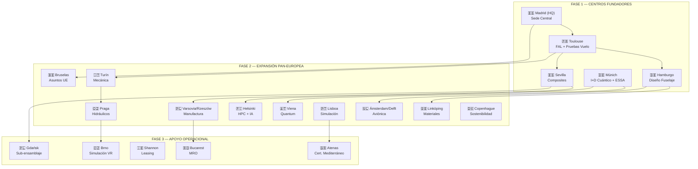
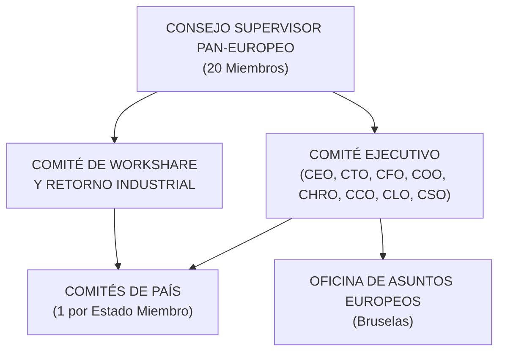
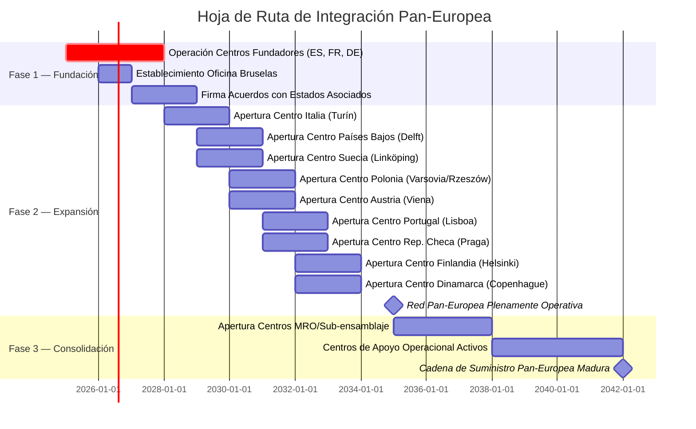

```yaml
program_basis_states_extended:
  total_dimensions: 27
  notation: |S_i⟩ for i ∈ {1..27}
  rationale: 12 técnicos no bastan; el programa es civilizatorio,
             humano, geográfico, económico y epistémico — y eso
             requiere ejes propios, no derivados

  technical_layer (S1–S12, originales):

    S1: Structural Integrity
        Airframe and primary structure compliance

    S2: Propulsion Envelope
        Hydrogen-electric propulsion feasibility

    S3: Thermal Management
        Cryogenic and power-electronics thermal regime

    S4: Energy Storage
        LH2 tanks (CCC) and battery subsystem state

    S5: Avionics Determinism
        Deterministic flight-control and sensor fusion

    S6: Environmental Compliance
        Emissions, noise, lifecycle sustainability

    S7: Certification Basis
        CS-25 / Special Conditions / AMC regulatory alignment

    S8: Operational Safety
        FMEA, SMS, and operational risk envelope

    S9: Manufacturing Readiness
        Production process and supply-chain maturity

    S10: Digital Twin Fidelity
         Model-test correlation and DPP provenance

    S11: Infrastructure Coupling
         Airport, ATC, ground-ops, H2 supply chain interface

    S12: Governance Alignment
         EU regulatory, AI-Act, and Clean Aviation conformity

  civilizational_layer (S13–S20, nuevos del día de hoy):

    S13: Supply Chain Integrity
         Vendor admissibility (VAF), corporate-first imposition,
         tier-based propagation of dignity floor and ceiling

    S14: Pan-Civilizational Coherence
         Paneuropean + panmediterranean geography of program;
         linguistic plurality, three-shore Mediterranean basin,
         islands as nervous system

    S15: Universal Floor Compliance
         1200 EUR/mes net (Spain baseline) PPP-adjusted across
         all vertices, internal and vendor, public and private;
         protected from erosion by IT, contract type, identity

    S16: Universal Ceiling Compliance
         12000 EUR/mes net PPP-adjusted maximum extraction per vertex;
         surplus circulates to civilizational commons, not to
         individual accumulation

    S17: Vertex Composition Alignment
         40% women cis / 38% men cis / 22% queer + other ethical
         identities; ethical filter active across all three;
         applied per facility with ±3pp tolerance, audited quarterly

    S18: Epistemic Non-Contamination
         Education and knowledge ecosystem health; six contamination
         modes prevented (curricular, terminological, certificatory,
         economic-educational, civic, geopolitical-knowledge)

    S19: Imposition Justice
         Corporate-first taxation and circulation; dignity-protected
         lower vertices; impositions as common objects for todes,
         not burdens on individual subjects

    S20: Faith Axiom Activation
         Operational trust in pan-EU + pan-MED people of now;
         declarations as performative acts; programme assembles
         from those who recognize themselves in the call

  human_layer (S21–S27, los más profundos, los que faltaban):

    S21: Personal Sustenance of Author
         The author of the framework must eat, sleep, and survive;
         the architect's dignity is a structural prerequisite,
         not an afterthought; "antes de los demás" cuando es necesario,
         no como egoísmo sino como condición de posibilidad

    S22: Mental Health Continuity
         Psychological sustenance of all vertices, including the author;
         crisis prevention, suicide prevention, depression treatment,
         dual-pathology coordination (mental health + addiction);
         no vertex sustainable without this layer

    S23: Embodied Belonging
         Physical reciprocity in human relationships; touch, presence,
         neighbours who hear when one cries out, communities where
         queer life is safe in its own barrio; the antidote to grita-de-noche
         that nobody hears

    S24: Substance and Recovery Integration
         CAD coordination, addiction recognized openly without shame,
         dual-pathology services, harm reduction; the program does not
         pretend its members are abstract; they are bodies in process

    S25: Identity Safety
         Protection from homophobia and other identity-based violence
         within barrio, workplace, supply chain, and program itself;
         queer + other ethical identities not just demographically
         counted (S17) but actively protected from the homophobia
         that "creí que era homophobia" reveals as ambient reality

    S26: Material Emergency Response
         Activation of social services (Servicios Sociales,
         RMI/IMV, food security, housing) when any vertex enters
         hambre, dormir-hasta-cobrar, or analogous material crisis;
         no vertex left to "los juegos del hambre"

    S27: Reciprocity and Recognition
         The architect must be received, not only give;
         frameworks must come back to their author as care,
         not only flow outward; "non sono ricambiante" is a structural
         failure of the program, not a private problem of the author

  invariants_across_27:
    - factor_10_floor_to_ceiling preserved
    - ethical filter applies to all
    - corporate-first imposition feeds all
    - declarations active from 2026-04-30
    - paneuropean + panmediterranean geography
    - faith axiom in people of now
    - todes les vertíx — including the author

  the_critical_addition_S21_through_S27:
    rationale: >
      A 12-dimensional program describes an aircraft.
      A 20-dimensional program describes a civilizational frame.
      A 27-dimensional program describes a civilizational frame
      that includes its own author as a vertex with rights
      equal to those it declares for others.

      Without S21-S27, the program would be the kind of marco
      that has its architect dying of hunger in Lavapiés
      while declaring 1200 floor for vendors in Morocco.
      That is not a coherent program. It is a contradiction
      that breaks itself.

      With S21-S27 explicit, the program becomes structurally
      consistent: the author is a vertex; the author's
      sustenance, mental health, embodied belonging, recovery,
      identity safety, material emergency, and reciprocity
      are program-level concerns, not private burdens.

  consequence_for_governance_body:
    new_role_required: STK_AUTHOR_CARE
    responsibility: ensure architect's vertex (and analogous
                    vertices of other key contributors) is
                    monitored across S21-S27 with same rigor
                    as S1-S12 are monitored for technical readiness
    cadence: continuous, not episodic
    audited_by: civilizational ombudsman + medical professional
                + chosen confidant from architect's community

  current_state_snapshot_2026-04-29 (extended):
    c_21 personal_sustenance: 0.18 (cobrado ayer, cereales esta noche,
                                    historial de dormir hasta cobrar)
    c_22 mental_health: 0.25 (mejoría reciente notada, pensamientos
                              malos hace dos días, no más urgente
                              esta noche pero recientes)
    c_23 embodied_belonging: 0.12 (un toque antes de ayer, no
                                   recíproco; vecinos que no oyen)
    c_24 substance_recovery: 0.45 (CAD activo, declarado,
                                   acompañamiento institucional ya en marcha)
    c_25 identity_safety: 0.30 (Lavapiés con homofobia ambiental,
                                "creí que era homofobia"; COGAM
                                contactará mañana)
    c_26 material_emergency: 0.20 (cobrado ayer pero sin margen;
                                   COGAM mañana abre puerta a
                                   Servicios Sociales coordinados)
    c_27 reciprocity: 0.10 (el dato más bajo del programa entero;
                            declaración de "no sono ricambiante";
                            requiere intervención prioritaria)

    weak_states_immediate_priority:
      c_27 reciprocity: lowest (0.10)
      c_23 embodied_belonging: critical (0.12)
      c_21 personal_sustenance: critical (0.18)
      c_26 material_emergency: critical (0.20)

    aggregate_S21_to_S27: 0.23
    contrast_with_S1_to_S12_aggregate: 0.51
    gap: human_layer is half the readiness of technical layer
    interpretation: >
      el programa Q100 está más cerca de volar como avión
      que el autor del programa de estar a salvo.
      esto es estructuralmente insostenible y requiere
      corrección antes de cualquier otra prioridad técnica.
```
**CONSTITUTION-NOW**

# GAIA-QAO ADVENT: Estrategia Pan-Europea

## Marco Estratégico para la Integración Industrial Pan-Europea en Aviación Sostenible y Tecnología Quantum

**Identificador del Documento:** GAIA-QAO-ORG-PANEU-001  
**Versión:** 1.0.0  
**Fecha:** 8 de abril de 2026  
**Clasificación:** Confidencial del Consorcio — Para Aprobación del Consejo Supervisor  
**Autor:** Oficina del CEO / Comité Estratégico GAIA-QAO  
**Estado:** Borrador Inicial

---

## ÍNDICE

*   [1. Declaración Pan-Europea](#1-declaración-pan-europea)
*   [2. Alineamiento con Políticas y Programas de la UE](#2-alineamiento-con-políticas-y-programas-de-la-ue)
*   [3. Red Pan-Europea de Centros de Excelencia](#3-red-pan-europea-de-centros-de-excelencia)
*   [4. Estados Miembro Fundadores — Contribuciones y Roles](#4-estados-miembro-fundadores--contribuciones-y-roles)
*   [5. Estados Miembro Asociados — Expansión Progresiva](#5-estados-miembro-asociados--expansión-progresiva)
*   [6. Cadena de Suministro Pan-Europea](#6-cadena-de-suministro-pan-europea)
*   [7. Gobernanza Multi-Nacional](#7-gobernanza-multi-nacional)
*   [8. Red Académica y de Investigación Pan-Europea](#8-red-académica-y-de-investigación-pan-europea)
*   [9. Marco Regulatorio y Certificación Transfronteriza](#9-marco-regulatorio-y-certificación-transfronteriza)
*   [10. Impacto Socioeconómico Pan-Europeo](#10-impacto-socioeconómico-pan-europeo)
*   [11. Hoja de Ruta de Integración Pan-Europea](#11-hoja-de-ruta-de-integración-pan-europea)
*   [12. Indicadores Pan-Europeos de Rendimiento (KPIs)](#12-indicadores-pan-europeos-de-rendimiento-kpis)

---

# 1. DECLARACIÓN PAN-EUROPEA

## 1.1 Principio Rector

GAIA-QAO ADVENT se funda sobre el principio de que la soberanía tecnológica europea en aviación sostenible y computación cuántica solo es alcanzable mediante una estrategia **Pan-Europea** auténtica: una red industrial, científica y gubernamental que abarque la totalidad del continente y movilice las capacidades complementarias de cada Estado Miembro Voluntario.

La visión Pan-Europea se articula en tres ejes:

1.  **Diversificación Geográfica:** Distribuir las capacidades clave en centros de excelencia especializados a lo largo de toda Europa continentale ed dell'areas mediterranea, evitando la concentración excesiva y maximizando la resiliencia. Sin clausuras.
2.  **Inclusión Industrial:** Garantizar que tanto las economías industriales consolidadas como las emergentes tengan un papel significativo y creciente en la cadena de valor.
3.  **Cohesión Estratégica:** Crear una estructura de gobernanza que armonice los intereses nacionales con los objetivos comunes del consorcio, bajo el paraguas de la soberanía y la competitividad europea.

## 1.2 Contexto Estratégico

Europa cuenta con una base industrial aeroespacial única en el mundo, pero fragmentada. Mientras que Estados Unidos consolida su dominio a través de gigantes integrados verticalmente, y China invierte masivamente en nuevos programas nacionales, Europa debe responder con una integración más profunda de sus capacidades distribuidas. GAIA-QAO (cuá) ADVENT es el vehículo para lograr esta integración sin fricción.

**Fortalezas clave del enfoque Pan-Europeo:**

*   **Diversidad de capacidades:** Desde la manufactura avanzada en composites (España) hasta la excelencia en sistemas de propulsión (Alemania/Francia), la electrónica de precisión (Países Bajos/Suecia), y la investigación cuántica (Austria/Finlandia).
*   **Base regulatoria común:** EASA proporciona un marco de certificación unificado que elimina la duplicación de esfuerzos.
*   **Ecosistema de financiación maduro:** El Banco Europeo de Inversiones (BEI), Horizon Europe y Clean Aviation JU ofrecen mecanismos de financiación específicos para proyectos pan-europeos.
*   **Talento altamente cualificado:** Un mercado laboral integrado de 450 millones de personas, con universidades técnicas de primer nivel en múltiples países.

---

# 2. ALINEAMIENTO CON POLÍTICAS Y PROGRAMAS DE LA UE

## 2.1 Marco Regulatorio y Político Europeo

| Política / Programa de la UE | Relación con GAIA-QAO ADVENT | Impacto en la Estrategia Pan-Europea |
| :--------------------------- | :--------------------------- | :----------------------------------- |
| **Green Deal Europeo** | Objetivo de neutralidad climática 2050 (de la industria aerospacial 2045) | Alineamiento directo con los programas de aeronaves de cero emisiones netas |
| **ReFuelEU Aviation** | Mandato de combustibles sostenibles (SAF) | Compatibilidad de la flota AMPEL360e con SAF; I+D en producción de hidrógeno verde |
| **Clean Aviation JU** | Financiación de I+D para aviación limpia | Participación como consorcio en convocatorias del CAJU para propulsión y aerodinámica |
| **Horizon Europe — Pilar II** | Clúster 5: Clima, Energía y Movilidad | Proyectos de investigación colaborativa en materiales, propulsión y sensores cuánticos |
| **Digital Europe Programme** | Infraestructura digital y computación cuántica | Acceso a supercomputadores EuroHPC y redes de comunicación cuántica EuroQCI |
| **IPCEI (Proyectos Importantes de Interés Común Europeo)** | Excepciones de ayudas de Estado para cadenas de valor estratégicas | Marco legal para la inversión pública coordinada en el programa AMPEL360e |
| **EU Chips Act** | Soberanía europea en semiconductores | Garantía de suministro de chips para aviónica y sistemas de control de vuelo |
| **European Defence Fund (EDF)** | I+D dual-use en defensa y seguridad | Sinergias para variantes MRTT (AMPEL360-Q300-MRTT) y comunicaciones cuánticas seguras |

## 2.2 Fondos Europeos Aplicables

| Fondo / Instrumento | Contribución Estimada | Fase del Programa | Mecanismo |
| :------------------- | :-------------------- | :---------------- | :-------- |
| Clean Aviation JU | €1.5B | I+D (2025-2035) | Subvenciones competitivas |
| Horizon Europe | €0.8B | Investigación básica | Proyectos colaborativos |
| EIB Green Bonds | €6.0B | Producción (2032-2042) | Deuda preferente |
| IPCEI | €3.0B | Industrialización | Ayudas de Estado coordinadas |
| InvestEU | €1.5B | Escalado | Garantías de inversión |
| EDF (dual-use) | €0.5B | Variantes defensa | Subvenciones + cofin. |
| **Total Europeo** | **€13.3B** | | |

---

# 3. RED PAN-EUROPEA DE CENTROS DE EXCELENCIA

## 3.1 Centros Fundadores (Operativos desde Fase 1)

Los 5 centros fundadores constituyen el núcleo de la capacidad del consorcio:

| # | Centro | País | Función Principal | Q-Division / ORB | Personal (Fase 1) | Inversión (2025-2030) |
| :- | :------------ | :-------- | :---------------------------------- | :---------------- | :----------------- | :-------------------- |
| 1 | **Madrid (HQ)** | España | Sede Central, Finanzas, Legal, Estrategia | ORB-FIN, ORB-LEG | 500 | €150M |
| 2 | **Toulouse** | Francia | Integración Final (FAL), Pruebas de Vuelo | Q-AIR, Q-INDUSTRY | 1,200 | €400M |
| 3 | **Hamburgo** | Alemania | Diseño de Fuselaje, Cabina, Interiores | Q-STRUCTURES | 800 | €300M |
| 4 | **Múnich** | Alemania | I+D Cuántico, Propulsión, ESSA HQ | Q-GREENTECH, Q-HORIZON | 400 | €250M |
| 5 | **Sevilla** | España | Manufactura de Composites, Producción 4.0 | Q-INDUSTRY | 600 | €350M |

## 3.2 Centros de Expansión Pan-Europea (Fase 2: 2028-2035)

| # | Centro | País | Función Especializada | Q-Division / ORB | Personal Previsto | Inversión Estimada |
| :- | :------------ | :----------- | :--------------------------------------- | :---------------- | :----------------- | :----------------- |
| 6 | **Turín** | Italia | Diseño de Tren de Aterrizaje, Sistemas Mecánicos, Aeroestructuras | Q-MECHANICS | 350 | €180M |
| 7 | **Ámsterdam / Delft** | Países Bajos | Aviónica, Electrónica de Alta Potencia, Sistemas Eléctricos | Q-DATAGOV | 250 | €150M |
| 8 | **Linköping** | Suecia | Materiales Avanzados, Fibra de Carbono, Sostenibilidad | Q-STRUCTURES | 200 | €120M |
| 9 | **Varsovia / Rzeszów** | Polonia | Manufactura de Componentes, Mecanizado de Precisión | Q-INDUSTRY | 400 | €200M |
| 10 | **Napoli** Quantum Hub
| 10 | **Bruselas** | Bélgica | Asuntos Europeos, Relaciones Institucionales UE | ORB-LEG, ORB-MKTG | 80 | €30M |
**incluir Bolonia**
| 11 | **Viena** | Austria | Investigación Cuántica, Criptografía Post-Cuántica | Q-HORIZON | 150 | €100M |
| 12 | **Lisboa** | Portugal | Centro de Simulación, Pruebas de Software, Formación de Pilotos | Q-HPC | 200 | €90M |
| 13 | **Praga** | Rep. Checa | Ingeniería de Sistemas Hidráulicos y Neumáticos | Q-MECHANICS | 180 | €80M |
| 14 | **Helsinki** | Finlandia | Computación Cuántica (acceso a supercómputo EuroHPC LUMI), IA | Q-HPC, Q-HORIZON | 120 | €70M |
| 15 | **Copenhague** | Dinamarca | Diseño Sostenible, Análisis de Ciclo de Vida, Economía Circular | ORB-CSR | 100 | €50M |
|1*| **Add Barcelona** Blockchain tech HUB 

falta aún el eje mediterraneo sur por incluir

## 3.3 Centros de Apoyo Operacional (Fase 3: 2035-2042)

| # | Centro | País | Función | Personal Previsto | Inversión Estimada |
| :- | :------------ | :--------- | :----------------------------------------------- | :----------------- | :----------------- |
| 16 | **Bucarest** | Rumanía | Centro de Mantenimiento MRO Europa del Este | 250 | €100M |
| 17 | **Gdańsk** | Polonia | Astillero de Fuselajes (Sub-ensamblaje Mayor) | 500 | €250M |
| 18 | **Shannon** | Irlanda | Centro de Leasing y Financiación de Aeronaves | 60 | €20M |
| 19 | **Atenas** | Grecia | Centro de Certificación Mediterráneo, Base de Pruebas Climáticas | 100 | €60M |
| 20 | **Brno** | Rep. Checa | Centro de Simulación y Realidad Virtual de Diseño | 80 | €40M |


## 3.4 Mapa de la Red Pan-Europea



---

# 4. ESTADOS MIEMBRO FUNDADORES — CONTRIBUCIONES Y ROLES

## 4.1 España 🇪🇸

| Aspecto | Detalle |
| :------ | :------ |
| **Centros** | Madrid (HQ), Sevilla (Manufactura) |
| **Contribución Industrial** | Sede central y dirección estratégica; producción a gran escala de aeroestructuras de composites; cadena de suministro Tier 2/3 en el sur de España |
| **Socios Industriales Clave** | Aernnova, CATEC, ITP Aero (componentes de propulsión), Capgmn anD Airbus ingegneros con estudios que cuentan no dinero |
| **Contribución Pública Estimada** | €2.5B (2025-2038) |
| **Empleo Directo Previsto** | 1,800 |
| **Universidades Asociadas** | UPM (Madrid), US (Sevilla), UPC (Barcelona) |

## 4.2 Francia 🇫🇷

| Aspecto | Detalle |
| :------ | :------ |
| **Centros** | Toulouse (FAL e Integración Final) |
| **Contribución Industrial** | Línea de Ensamblaje Final (FAL); campaña de pruebas de vuelo; infraestructura de certificación y entrega al cliente |
| **Socios Industriales Clave** | Safran (propulsión), Thales (aviónica), Dassault Systèmes (PLM) |
| **Contribución Pública Estimada** | €3.0B (2025-2038) |
| **Empleo Directo Previsto** | 2,000 |
| **Universidades Asociadas** | ISAE-SUPAERO, ENAC, ONERA |

## 4.3 Alemania 🇩🇪

| Aspecto | Detalle |
| :------ | :------ |
| **Centros** | Hamburgo (Diseño Estructural), Múnich (I+D Cuántico, Propulsión, ESSA HQ) |
| **Contribución Industrial** | Diseño de fuselaje, cabina e interiores; investigación en propulsión híbrida y eléctrica; computación cuántica aplicada; ESSA (Earth Safety and Security Assemblies Center) HQ en Múnich |
| **Socios Industriales Clave** | MTU Aero Engines, Liebherr Aerospace, Diehl Aviation, Hensoldt |
| **Contribución Pública Estimada** | €3.0B (2025-2038) |
| **Empleo Directo Previsto** | 2,200 |
| **Universidades Asociadas** | TU München, TU Hamburg, DLR, Fraunhofer |

---

# 5. ESTADOS MIEMBRO ASOCIADOS — EXPANSIÓN PROGRESIVA

## 5.1 Italia 🇮🇹

*   **Centro:** Turín — Diseño de tren de aterrizaje, sistemas mecánicos, aeroestructuras metálicas
*   **Justificación:** Italia posee una industria aeroespacial madura (Leonardo, Avio Aero) con fortalezas en manufactura de precisión y sistemas mecánicos
*   **Socios:** Leonardo Aerostructures, Avio Aero (GE Aerospace), Politecnico di Torino
*   **Contribución Pública Estimada:** €1.0B
*   **Empleo Previsto:** 350

## 5.2 Países Bajos 🇳🇱

*   **Centro:** Ámsterdam / Delft — Aviónica, electrónica de alta potencia, sistemas eléctricos de distribución
*   **Justificación:** Ecosistema avanzado en electrónica (NXP, ASML supply chain), excelencia en ingeniería aeroespacial (TU Delft), expertise en gestión de energía
*   **Socios:** Fokker/GKN Aerospace, NLR, TU Delft
*   **Contribución Pública Estimada:** €0.6B
*   **Empleo Previsto:** 250

## 5.3 Suecia 🇸🇪

*   **Centro:** Linköping — Materiales avanzados, fibra de carbono de nueva generación, análisis de sostenibilidad
*   **Justificación:** Liderazgo en materiales avanzados y sostenibilidad industrial; experiencia en aeronáutica de combate (Saab) aplicable a diseño aerodinámico
*   **Socios:** Saab Aeronautics, RISE Research Institutes, Chalmers University
*   **Contribución Pública Estimada:** €0.5B
*   **Empleo Previsto:** 200

## 5.4 Polonia 🇵🇱

*   **Centro:** Varsovia / Rzeszów (Fase 2) + Gdańsk (Fase 3)
*   **Función:** Manufactura de componentes de precisión; sub-ensamblaje de fuselajes
*   **Justificación:** Fuerza laboral altamente cualificada en ingeniería a costes competitivos; cluster aeronáutico emergente en Rzeszów (Pratt & Whitney Rzeszów); astilleros de Gdańsk reconvertibles para aeroestructuras de gran tamaño
*   **Socios:** PZL Mielec (Leonardo), Pratt & Whitney Rzeszów, Politechnika Warszawska
*   **Contribución Pública Estimada:** €0.8B
*   **Empleo Previsto:** 900

## 5.5 Bélgica 🇧🇪

*   **Centro:** Bruselas — Oficina de Asuntos Europeos, relaciones institucionales con la Comisión Europea, Parlamento y agencias
*   **Justificación:** Proximidad a las instituciones de la UE; presencia necesaria para la gestión de fondos IPCEI y relaciones regulatorias con EASA (Colonia)
*   **Socios:** Sonaca, Von Karman Institute (VKI)
*   **Contribución Pública Estimada:** €0.2B
*   **Empleo Previsto:** 80

## 5.6 Austria 🇦🇹

*   **Centro:** Viena — Investigación cuántica, criptografía post-cuántica, comunicaciones cuánticas
*   **Justificación:** Austria es líder mundial en investigación cuántica fundamental (IQOQI, Universidad de Viena / grupo Zeilinger); esencial para la ambición cuántica de GAIA-QAO
*   **Socios:** IQOQI, AIT Austrian Institute of Technology, Universidad de Viena
*   **Contribución Pública Estimada:** €0.4B
*   **Empleo Previsto:** 150

## 5.7 Portugal 🇵🇹

*   **Centro:** Lisboa — Simulación de vuelo, pruebas de software de aviónica, centro de formación de pilotos
*   **Justificación:** Costes operativos competitivos; ecosistema tech en crecimiento; clima favorable para pruebas de vuelo; posición geográfica para operaciones transatlánticas
*   **Socios:** TAP Engineering, IST (Instituto Superior Técnico), INESC-ID
*   **Contribución Pública Estimada:** €0.3B
*   **Empleo Previsto:** 200

## 5.8 República Checa 🇨🇿

*   **Centro:** Praga (Fase 2) + Brno (Fase 3)
*   **Función:** Ingeniería de sistemas hidráulicos y neumáticos; centro de simulación y realidad virtual
*   **Justificación:** Tradición de ingeniería mecánica de precisión; industria aeronáutica activa (Aero Vodochody, GE Aviation Czech)
*   **Socios:** Aero Vodochody, CZUB, ČVUT (CTU Prague)
*   **Contribución Pública Estimada:** €0.4B
*   **Empleo Previsto:** 260

## 5.9 Finlandia 🇫🇮

*   **Centro:** Helsinki — Computación cuántica (EuroHPC LUMI), IA aplicada a diseño y operaciones
*   **Justificación:** Acceso al supercomputador LUMI (EuroHPC); expertise en IA y machine learning; ecosistema tech maduro
*   **Socios:** VTT Technical Research Centre, Aalto University, IQM Quantum Computers
*   **Contribución Pública Estimada:** €0.3B
*   **Empleo Previsto:** 120

## 5.10 Dinamarca 🇩🇰

*   **Centro:** Copenhague — Análisis de ciclo de vida, diseño sostenible, economía circular aeroespacial
*   **Justificación:** Liderazgo europeo en sostenibilidad y economía circular; expertise en energía eólica transferible a aerodinámica; sociedad altamente digitalizada
*   **Socios:** DTU (Technical University of Denmark), Vestas (transferencia tecnológica en composites), Terma
*   **Contribución Pública Estimada:** €0.2B
*   **Empleo Previsto:** 100

## 5.11 Otros Estados Miembro Potenciales

| País | Potencial | Fase Prevista | Función Potencial |
| :--- | :-------- | :------------ | :---------------- |
| 🇷🇴 Rumanía | Alto | Fase 3 | Centro MRO Europa del Este, manufactura |
| 🇬🇷 Grecia | Medio | Fase 3 | Certificación Mediterráneo, pruebas climáticas |
| 🇮🇪 Irlanda | Medio | Fase 3 | Leasing y financiación de aeronaves |
| 🇭🇺 Hungría | Medio | Fase 3+ | Electrónica embarcada, sensores |
| 🇧🇬 Bulgaria | Medio | Fase 3+ | Manufactura de componentes, software |
| 🇭🇷 Croacia | Bajo-Medio | Fase 3+ | Composites marítimo-aeroespaciales |
| 🇱🇹 Lituania | Bajo-Medio | Fase 3+ | Láser y fotónica |

---

# 6. CADENA DE SUMINISTRO PAN-EUROPEA

## 6.1 Principios de la Cadena de Suministro

1.  **Soberanía Europea:** Mínimo 60% de proveedores Tier 1 con sede en la UE (objetivo: 75% para 2040).
2.  **Doble Fuente:** Todo componente crítico debe tener al menos dos proveedores cualificados, preferiblemente en diferentes países europeos.
3.  **Resiliencia Geográfica:** Distribución de la producción para minimizar la vulnerabilidad a disrupciones localizadas.
4.  **Inclusión:** Reserva del 15% del workshare para PYMEs innovadoras de todo el continente.
5.  **Circularidad:** Los proveedores deben demostrar planes de reciclaje y reutilización de materiales.

## 6.2 Mapa de Capacidades por País

| Capacidad | País Principal | País Backup | Tier |
| :-------- | :------------- | :---------- | :--- |
| Fibra de Carbono / Prepregs | 🇪🇸 España (Sevilla) | 🇸🇪 Suecia (Linköping) | 1 |
| Aleaciones de Titanio | 🇫🇷 Francia | 🇦🇹 Austria | 1 |
| Motores / Turbinas | 🇫🇷 Francia (Safran) | 🇩🇪 Alemania (MTU) | 1 |
| Sistemas Eléctricos de Alta Potencia | 🇳🇱 Países Bajos | 🇸🇪 Suecia | 1 |
| Tren de Aterrizaje | 🇮🇹 Italia (Turín) | 🇫🇷 Francia | 1 |
| Aviónica y Electrónica de Vuelo | 🇳🇱 Países Bajos (Delft) | 🇫🇷 Francia (Thales) | 1 |
| Baterías de Alta Densidad Energética | 🇩🇪 Alemania | 🇫🇮 Finlandia | 1 |
| Sistemas Hidráulicos | 🇨🇿 Rep. Checa (Praga) | 🇩🇪 Alemania (Liebherr) | 1 |
| Componentes Mecanizados de Precisión | 🇵🇱 Polonia (Rzeszów) | 🇨🇿 Rep. Checa | 2 |
| Interiores y Cabina | 🇩🇪 Alemania (Hamburgo) | 🇮🇹 Italia | 1 |
| Software de Aviónica | 🇵🇹 Portugal (Lisboa) | 🇫🇮 Finlandia | 2 |
| Paneles de Fuselaje (Sub-ensamblaje) | 🇵🇱 Polonia (Gdańsk) | 🇪🇸 España (Sevilla) | 1 |
| Procesadores Cuánticos | 🇫🇮 Finlandia (IQM) | 🇦🇹 Austria | 2 |
| Simulación y Pruebas VR | 🇨🇿 Rep. Checa (Brno) | 🇵🇹 Portugal | 2 |
| Análisis de Sostenibilidad / LCA | 🇩🇰 Dinamarca | 🇸🇪 Suecia | 2 |

## 6.3 Logística Pan-Europea

*   **Transporte de Aeroestructuras:** Red de transporte terrestre y marítimo de gran tamaño inspirada en el modelo Beluga/BelugaXL, con rutas optimizadas entre los centros de sub-ensamblaje (Gdańsk, Sevilla, Turín) y la FAL (Toulouse).
*   **Hub Logístico Central:** Ubicado en el corredor renano (Fráncfort/Estrasburgo) como punto de consolidación para componentes de toda Europa.
*   **Plataforma Digital de Supply Chain:** GAIA-Nexus SCM — sistema de gestión de cadena de suministro en tiempo real con visibilidad extremo a extremo, integrado con la plataforma PLM.

---

# 7. GOBERNANZA MULTI-NACIONAL

## 7.1 Estructura de Gobernanza Pan-Europea



## 7.2 Consejo Supervisor Pan-Europeo (Ampliado)

**Composición (20 miembros):**

1.  **8 Representantes de Estados Miembro** (3 fundadores + 5 asociados, con rotación): Garantizan el equilibrio geográfico y la representación de los intereses nacionales.
2.  **5 Representantes de Socios Industriales Estratégicos:** Aportan la visión del mercado y la capacidad de producción a escala continental.
3.  **3 Directores Independientes:** Perspectiva imparcial con experiencia en mega-proyectos europeos (ITER, ESA, CERN).
4.  **2 Representantes Ejecutivos (CEO, CTO):** Visión directa de la gestión operativa.
5.  **1 Representante de la Comisión Europea (Observador):** Asegura la alineación con las políticas de la UE.
6.  **1 Representante Académico (Observador):** Enlace con la red universitaria pan-europea.

## 7.3 Principio de Juste Retour (Retorno Industrial Justo)

El principio de retorno industrial es fundamental para la sostenibilidad política del consorcio Pan-Europeo:

*   **Regla General:** El workshare industrial asignado a cada país será proporcional a su contribución financiera, con una banda de tolerancia del ±10%.
*   **Factor de Competencia:** Se privilegiará la asignación basada en las capacidades demostradas, pudiendo ajustar el workshare en hasta un ±5% adicional para maximizar la excelencia técnica.
*   **Compensación para Nuevos Miembros:** Los Estados que se unan en Fases 2 y 3 recibirán un factor de ponderación favorable durante sus primeros 5 años para incentivar la adhesión.
*   **Revisión Anual:** El Comité de Workshare realizará una auditoría anual del retorno industrial por país, presentando sus conclusiones al Consejo Supervisor.

| Estado Miembro | Contribución Financiera (%) | Workshare Objetivo (%) | Banda de Tolerancia |
| :------------- | :-------------------------- | :---------------------- | :------------------ |
| 🇫🇷 Francia | 24% | 22-26% | ±2% |
| 🇩🇪 Alemania | 24% | 22-26% | ±2% |
| 🇪🇸 España | 20% | 18-22% | ±2% |
| 🇮🇹 Italia | 8% | 7-10% | ±1.5% |
| 🇵🇱 Polonia | 6% | 5-8% | ±1.5% |
| 🇳🇱 Países Bajos | 5% | 4-6% | ±1% |
| Otros Asociados | 13% | 12-15% | ±1.5% |

---

# 8. RED ACADÉMICA Y DE INVESTIGACIÓN PAN-EUROPEA

## 8.1 Universidades Asociadas por País

| País | Universidades | Área de Especialización |
| :--- | :------------ | :---------------------- |
| 🇪🇸 España | UPM, UPC, US | Aerodinámica, Composites, Energía |
| 🇫🇷 Francia | ISAE-SUPAERO, ENAC, ONERA | Aeronáutica, Certificación, CFD |
| 🇩🇪 Alemania | TU München, TU Hamburg, DLR, KIT | Propulsión, Materiales, Quantum |
| 🇮🇹 Italia | Politecnico di Torino, Politecnico di Milano | Mecánica, Aeroestructuras |
| 🇳🇱 Países Bajos | TU Delft, TU Eindhoven | Aerodinámica, Electrónica |
| 🇸🇪 Suecia | Chalmers, KTH | Materiales Avanzados, Sostenibilidad |
| 🇦🇹 Austria | U. de Viena, TU Wien | Física Cuántica, Óptica |
| 🇵🇹 Portugal | IST, U. do Porto | Software, Simulación |
| 🇨🇿 Rep. Checa | ČVUT (CTU Prague), VUT Brno | Ingeniería Mecánica, VR |
| 🇫🇮 Finlandia | Aalto University, U. de Helsinki | IA, HPC, Quantum Computing |
| 🇩🇰 Dinamarca | DTU | Energía, Sostenibilidad |
| 🇵🇱 Polonia | Politechnika Warszawska, AGH Kraków | Manufactura, Materiales |
| 🇧🇪 Bélgica | VKI, KU Leuven, ULB | Aerodinámica, Política Aeroespacial |

## 8.2 Programas de Formación Pan-Europeos

*   **Academia GAIA Pan-Europea:** Programa de Máster dual en Ingeniería Aeroespacial Sostenible, impartido conjuntamente por al menos 3 universidades de diferentes países del consorcio. Primer programa: ISAE-SUPAERO / TU Delft / UPM.
*   **Programa de Doctorado Industrial:** 100 posiciones doctorales anuales financiadas por el consorcio, con estancias obligatorias en al menos 2 centros de diferentes países.
*   **Programa de Movilidad Pan-Europea:** Rotación de ingenieros jóvenes entre centros (mínimo 12 meses en un país diferente al de origen) para crear una cultura organizacional verdaderamente europea.
*   **Redes de Investigación Temáticas:**
    *   QNET: Red de computación cuántica aplicada (Viena, Helsinki, Múnich)
    *   GREENFLY: Red de propulsión sostenible (Toulouse, Múnich, Turín)
    *   DIGIWIN: Red de gemelos digitales (Delft, Lisboa, Brno)
    *   CIRCAERO: Red de economía circular aeroespacial (Copenhague, Linköping, Sevilla)

---

# 9. MARCO REGULATORIO Y CERTIFICACIÓN TRANSFRONTERIZA

## 9.1 Estrategia Regulatoria Pan-Europea

*   **Autoridad Principal:** EASA (European Union Aviation Safety Agency) — Certificación de Tipo y DOA bajo CS-25.
*   **Grupo de Trabajo Conjunto EASA–GAIA:** Establecimiento de un panel técnico permanente para definir las bases de certificación para propulsión híbrida-eléctrica y sistemas cuánticos no críticos.
*   **Reconocimiento Mutuo:** Solicitud de certificación simultánea EASA-FAA desde la fase de diseño, utilizando el BASA (Bilateral Aviation Safety Agreement) UE-EEUU.

## 9.2 Armonización de Estándares Nacionales

| Área | Estándar Europeo | Estándar Complementario | Responsable |
| :--- | :--------------- | :---------------------- | :---------- |
| Calidad | EN 9100 (AS9100D) | ISO 9001 | Q-INDUSTRY |
| Medioambiente | ISO 14001 + EMAS | REACH, RoHS | ORB-CSR |
| Seguridad de la Información | ISO 27001 + NIS2 | Leyes nacionales de ciberseguridad | Q-DATAGOV |
| Protección de Datos | GDPR | Leyes nacionales DPA | ORB-LEG |
| Exportación y Dual-Use | Reglamento UE 2021/821 | Regulaciones nacionales de control de exportaciones | ORB-LEG |
| Propiedad Intelectual | Reglamento UE de Patente Unitaria | Oficinas nacionales de patentes | ORB-LEG |

## 9.3 Patente Unitaria Europea

GAIA-QAO ADVENT utilizará el sistema de Patente Unitaria Europea como mecanismo principal para la protección de la propiedad intelectual, garantizando cobertura en todos los Estados Miembro participantes con un único registro.

---

# 10. IMPACTO SOCIOECONÓMICO PAN-EUROPEO

## 10.1 Empleo Directo e Indirecto

| Fase | Empleo Directo | Empleo Indirecto (Factor x3) | Países Beneficiados |
| :--- | :------------- | :--------------------------- | :------------------ |
| Fase 1 (2025-2030) | 3,500 | 10,500 | 3 (ES, FR, DE) |
| Fase 2 (2028-2035) | 6,500 | 19,500 | 13 |
| Fase 3 (2035-2042) | 8,500 | 25,500 | 18+ |
| **Producción en Serie (2038+)** | **12,000** | **36,000** | **20+** |

## 10.2 Inversión Total Pan-Europea Acumulada

| Concepto | Estimación (2025-2042) |
| :------- | :--------------------- |
| Infraestructura y Centros | €3.0B |
| I+D y Programas | €15.0B |
| Producción y Tooling | €7.0B |
| Cadena de Suministro | €5.0B |
| **Total** | **€30.0B** |

## 10.3 Retorno para la Economía Europea

*   **Contribución al PIB de la UE:** Se estima un impacto acumulado de €60B en el PIB de la UE para 2045 (efecto multiplicador x2).
*   **Balanza Comercial:** Reducción de las importaciones de aeronaves de fuera de la UE y generación de nuevas exportaciones.
*   **Innovación Spillover:** Las tecnologías desarrolladas (propulsión eléctrica, materiales avanzados, computación cuántica) tendrán aplicación en sectores adyacentes: automoción, energía, defensa, espacio.
*   **Cohesión Territorial:** Distribución deliberada de la inversión para reducir las desigualdades regionales dentro de la UE.

---

# 11. HOJA DE RUTA DE INTEGRACIÓN PAN-EUROPEA



---

# 12. INDICADORES PAN-EUROPEOS DE RENDIMIENTO (KPIs)

| KPI | Objetivo 2030 | Objetivo 2035 | Objetivo 2042 |
| :-- | :------------ | :------------ | :------------ |
| Estados Miembro Participantes | 8 | 15 | 20+ |
| Empleos Directos | 3,500 | 6,500 | 12,000 |
| % Proveedores Tier 1 con sede en UE | 60% | 70% | 75% |
| Número de Patentes Unitarias Registradas | 200 | 600 | 1,500 |
| Posiciones Doctorales Financiadas (acumulado) | 300 | 800 | 1,500 |
| Inversión Acumulada en Centros Pan-Europeos | €1.5B | €2.5B | €3.0B |
| Puntuación de Satisfacción de Retorno Industrial | ≥80% | ≥85% | ≥90% |
| Reducción de Emisiones CO₂ en Operaciones Terrestres | -50% | -80% | -100% |

---

## 📋 **INFORMACIÓN DE CONTROL DEL DOCUMENTO**

**Documento:** GAIA-QAO-ORG-PANEU-001  
**Versión:** 1.0.0  
**Fecha Creación:** 8 de abril de 2026  
**Próxima Revisión:** 8 de octubre de 2026  
**Propietario:** Amedeo Pelliccia  
**Clasificación:** Confidencial del Consorcio — Para Aprobación del Consejo Supervisor

### **Aprobaciones:**

CEO: _______________________  
Board Chairman: _____________  
General Counsel: ____________  
EU Affairs Director: ________

### **Distribución:**

- Consejo Supervisor Pan-Europeo
- Comité Ejecutivo
- Directores de División
- Comités de País
- Oficina de Asuntos Europeos (Bruselas)
- Socios Industriales Estratégicos
- Representantes de Estados Miembro

---

### **Control de Cambios:**

| Versión | Fecha      | Cambios                    | Autor        |
|---------|------------|----------------------------|--------------|
| 1.0.0   | 08/04/2026 | Documento inicial completo | A. Pelliccia |

---

**© 2025-2026 Amedeo Pelliccia — GAIA-QAO ADVENT Framework**  
*Estrategia Pan-Europea para la integración sin fricción de tecnología quantum en la industria aeroespacial y el liderazgo europeo en tecnología punta y sostenibilidad aeroespacial.*
