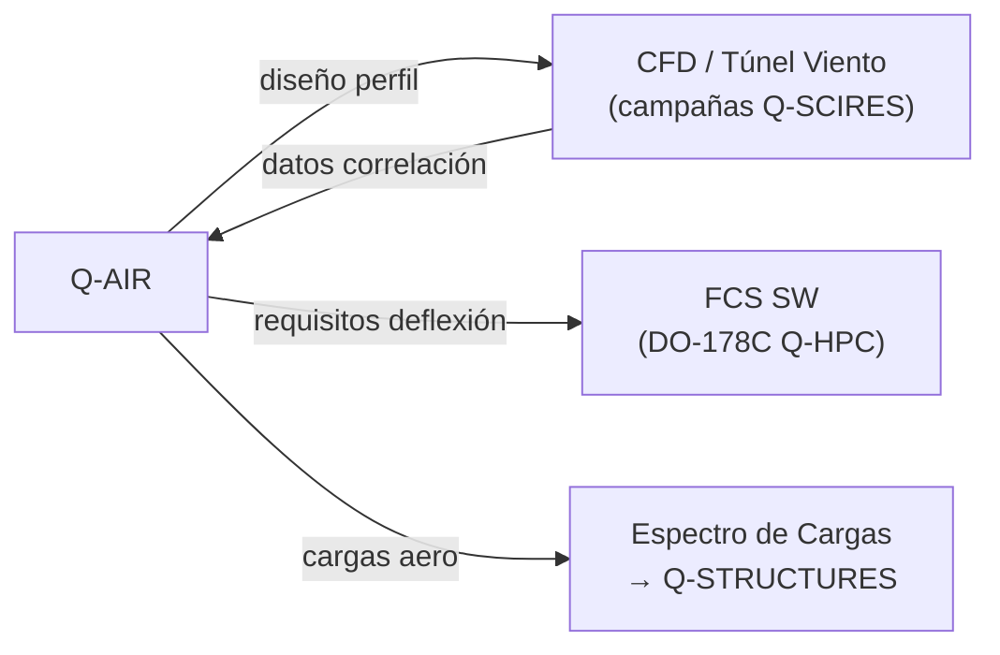

# Q-AIR — Aerodinámica y Control de Vuelo
> *El dominio que da forma al aire: perfiles, cargas y sistemas de vuelo inteligentes para la aeronave del futuro.*

**Identificador:** GQAOA-ORG-QDIV-Q-AIR-001
**Versión:** 1.0.0 · **Fecha:** 25 de abril de 2026 · **Estado:** α

---
## Glosario de Términos y Acrónimos

| Acrónimo / Término | Definición completa | Referencia externa |
|--------------------|--------------------|--------------------|
| **ADS-B** | *Automatic Dependent Surveillance–Broadcast* — sistema de vigilancia aeronáutica que difunde posición GNSS | [ICAO Doc 9684](https://www.icao.int/safety/acp/ACPWGF/ACP-WG-F_28/WGF28_WP06.pdf) |
| **Aeroelasticidad** | Fenómeno de interacción entre fuerzas aerodinámicas, inercia y elasticidad estructural; incluye flutter, divergencia y respuesta en ráfagas | [AIAA Aeroelasticity](https://arc.aiaa.org/) |
| **BWB** | *Blended Wing Body* — configuración que integra cuerpo y ala para reducir resistencia y aumentar sustentación | [NASA BWB](https://www.nasa.gov/centers-and-facilities/armstrong/blended-wing-body/) |
| **CFD** | *Computational Fluid Dynamics* — disciplina que aplica métodos numéricos para simular el comportamiento de fluidos | [OpenFOAM](https://www.openfoam.com/) |
| **Cl/Cd** | Coeficientes adimensionales de sustentación (Cl) y resistencia (Cd); la relación Cl/Cd = eficiencia aerodinámica | *(fundamento aerodinámica)* |
| **CS-25** | *Certification Specifications for Large Aeroplanes* (EASA) — requisitos de aeronavegabilidad para aviones de transporte | [EASA CS-25](https://www.easa.europa.eu/en/document-library/certification-specifications/cs-25-amendment-28) |
| **DAL** | *Design Assurance Level* — niveles A–E de criticidad de diseño (DO-178C/DO-254/ARP4754A) | [SAE ARP4754A](https://www.sae.org/standards/content/arp4754a/) |
| **DER** | *Designated Engineering Representative* — ingeniero designado por la FAA para aprobar datos técnicos de certificación | [FAA DER](https://www.faa.gov/aircraft/air_cert/design_approvals/der) |
| **DO-178C** | *Software Considerations in Airborne Systems* — estándar RTCA para certificación de software aviónco | [RTCA DO-178C](https://www.rtca.org/products/do-178c/) |
| **EASA** | *European Union Aviation Safety Agency* — autoridad reguladora de aviación de la UE | [EASA](https://www.easa.europa.eu/) |
| **FAR-25** | *Federal Aviation Regulations Part 25* (FAA) — requisitos de aeronavegabilidad para aviones de transporte | [FAR Part 25](https://www.ecfr.gov/current/title-14/chapter-I/subchapter-C/part-25) |
| **FBW** | *Fly-By-Wire* — sistema de control de vuelo en que las señales del piloto se transmiten eléctricamente, sin conexiones mecánicas directas | *(Airbus/Boeing engineering)* |
| **FCS** | *Flight Control System* — sistema que ejecuta las leyes de control y actúa sobre superficies de vuelo | *(interno GQAOA)* |
| **Flutter** | Inestabilidad aeroelástica autoexcitada que puede llevar a la destrucción estructural; debe evitarse en toda la envolvente de vuelo | [AIAA Flutter](https://arc.aiaa.org/) |
| **FMS** | *Flight Management System* — sistema de navegación y gestión de vuelo integrado | *(ARINC 702A)* |
| **GQAOA** | *GAIA QUANTUM AMPEL OPT-INS ARCHITECTURE, INC.* — programa conceptual ficticio de Amedeo Pelliccia | *(programa ficticio)* |
| **GVT** | *Ground Vibration Test* — ensayo de vibración en tierra para caracterizar los modos propios estructurales antes del primer vuelo | *(aerospace SE practice)* |
| **HPC** | *High-Performance Computing* — clústeres de cómputo paralelo para CFD LES de alta fidelidad | [TOP500](https://www.top500.org/) |
| **ICAO Annex 16** | Anexo 16 al Convenio de Chicago — estándares de ruido y emisiones de aeronaves (Capítulos 3/4/14) | [ICAO Annex 16](https://www.icao.int/environmental-protection/Pages/noise.aspx) |
| **LES** | *Large Eddy Simulation* — método CFD de alta fidelidad para resolver turbulencia a gran escala | *(fundamento CFD)* |
| **MC/DC** | *Modified Condition/Decision Coverage* — criterio de cobertura de prueba estructural exigido por DO-178C nivel A | [RTCA DO-178C](https://www.rtca.org/products/do-178c/) |
| **MDO** | *Multidisciplinary Design Optimization* — optimización simultánea de múltiples disciplinas de ingeniería | [AIAA MDO](https://arc.aiaa.org/doi/10.2514/1.J058993) |
| **QAOA** | *Quantum Approximate Optimization Algorithm* — algoritmo cuántico de optimización combinatoria | [arXiv QAOA](https://arxiv.org/abs/1411.4028) |
| **RNP** | *Required Navigation Performance* — especificación PBN que define la precisión de navegación requerida | [ICAO Doc 9613](https://www.icao.int/NACC/Documents/Meetings/2014/RNPARSM/RT-PBN-i2.pdf) |
| **TRL** | *Technology Readiness Level* — madurez tecnológica 1–9 | [NASA TRL](https://www.nasa.gov/directorates/somd/space-communications-navigation-program/technology-readiness-levels/) |
| **V-n diagram** | Diagrama velocidad-factor de carga que define la envolvente de maniobra certificable | [CS-25 §25.333](https://www.easa.europa.eu/en/document-library/certification-specifications/cs-25-amendment-28) |

---

## 1. Misión y Alcance

Q-AIR es la división técnica responsable del diseño, análisis y validación de todos los sistemas aerodinámicos y de control de vuelo (FCS[^1]) del programa GQAOA. Su alcance abarca desde la definición conceptual de la envolvente de vuelo hasta la certificación de los perfiles de sustentación conforme a CS-25/FAR-25[^2], los sistemas fly-by-wire y los algoritmos de control adaptativo asistidos por IA.

La división lidera la integración multidisciplinar entre la aerodinámica exterior (CFD[^3], túnel de viento), la dinámica de vuelo (estabilidad y control) y los sistemas embarcados de gestión de vuelo (FMS/FCS), coordinando activamente con Q-STRUCTURES (cargas y aeroelasticidad[^4]), Q-HPC (optimización cuántica QAOA[^5]) y Q-MECHANICS (actuadores FCS).

---

## 2. Responsabilidades Clave

- **Diseño aerodinámico (Aero Shaping):** Definición de la geometría externa de la aeronave, optimización de perfiles alar y configuraciones BWB/convencionales.
- **Análisis CFD y validación experimental:** Simulaciones de fluidos computacionales de alta fidelidad y coordinación de campañas en túnel de viento.
- **Dinámica de vuelo y envolvente de operación:** Determinación de límites de velocidad, altitud, maniobra y cargas de vuelo; documentación de la Flight Envelope.
- **Sistemas de Control de Vuelo (FCS):** Diseño, integración y verificación del sistema fly-by-wire, leyes de control, y funciones de protección de envolvente.
- **Gestión del sistema FMS/FGCS:** Integración del Flight Management System con los módulos de optimización de ruta asistidos por Q-HPC.
- **Aeroelasticidad y cargas estructurales:** Generación del espectro de cargas de diseño para Q-STRUCTURES, incluyendo análisis flutter y divergencia.
- **Reducción de ruido aerodinámico:** Diseño de configuraciones de bajo ruido (high-lift devices, trailing edge treatment) en cumplimiento con ICAO Annex 16.
- **Interfaces con sistemas de propulsión:** Análisis de efectos de instalación del sistema propulsivo (nacelle, inlet) sobre el campo aerodinámico global.

---

## 3. Entregables Clave

| ID | Descripción | Tipo | Estado |
|----|-------------|------|--------|
| Q-AIR-01-AERO-DESIGN-SPEC.md | Especificación de diseño aerodinámico — perfiles, polar, Cl/Cd objetivos | MD | α |
| Q-AIR-02-CFD-BASELINE-REPORT.pdf | Informe de simulación CFD — configuración de referencia BWB-Q100 | PDF | α |
| Q-AIR-03-FLIGHT-ENVELOPE.xlsx | Envolvente de vuelo certificable: límites V-n, altitud, temperatura | XLSX | α |
| Q-AIR-04-FCS-ARCHITECTURE.md | Arquitectura del sistema de control de vuelo (FBW, leyes de control) | MD | β |
| Q-AIR-05-LOADS-SPECTRUM.hdf5 | Espectro de cargas de diseño para Q-STRUCTURES (fatiga + estático) | HDF5 | β |
| Q-AIR-06-FLUTTER-ANALYSIS.md | Análisis de aeroelasticidad y flutter — márgenes de estabilidad | MD | β |
| Q-AIR-07-WIND-TUNNEL-REPORT.pdf | Informe de ensayos en túnel de viento (campaña α) | PDF | β |

---

## 4. RACI de Dominio

| Actividad | Q-AIR Lead | Co-Q-Divisions (R/C/I) | ORB Support (C/I) |
|-----------|-----------|-------------------|-------------------|
| Diseño perfil aerodinámico BWB | **A**/R | Q-STRUCTURES (C), Q-HPC (C) | ORB-PMO (I) |
| CFD analysis — alta fidelidad | **A**/R | Q-HPC (R), Q-SCIRES (C) | ORB-PMO (I) |
| Definición de cargas de diseño | **A**/R | Q-STRUCTURES (R), Q-MECHANICS (C) | ORB-PMO (I) |
| Diseño leyes de control FCS | **A**/R | Q-HPC (C), Q-MECHANICS (R) | ORB-IT (C) |
| Análisis flutter y aeroelasticidad | **A**/R | Q-STRUCTURES (R), Q-SCIRES (C) | ORB-PMO (I) |
| Ensayos en túnel de viento | **A**/R | Q-SCIRES (R), Q-HPC (C) | ORB-PMO (I) |
| Integración FMS/FGCS | **A**/R | Q-HPC (R), Q-DATAGOV (C) | ORB-IT (C) |
| Reducción de ruido aerodinámico | **A**/R | Q-SCIRES (C), Q-STRUCTURES (C) | ORB-CSR (I) |

---

## 5. Interfaces Clave

### Con otras Q-Divisions

| Q-Division | Qué se intercambia | Dirección |
|------------|-------------------|-----------|
| Q-STRUCTURES | Espectro de cargas aero (Q-AIR → Q-STR); datos de peso/rigidez (Q-STR → Q-AIR) | Bidireccional |
| Q-HPC | Resultados CFD de alta fidelidad; optimización cuántica de perfiles | Bidireccional |
| Q-MECHANICS | Requisitos de deflexión y fuerza de actuadores FCS | Q-AIR → Q-MECH |
| Q-GREENTECH | Efectos aerodinámicos de instalación de celdas de combustible/baterías | Bidireccional |
| Q-SCIRES | Datos de ensayo en túnel de viento; correlación CFD-experimento | Bidireccional |
| Q-DATAGOV | Publicación de ICDs y DMs aerodinámicos en CSDB | Q-AIR → Q-DATAGOV |

### Con unidades ORB

| ORB Unit | Naturaleza de la interacción |
|----------|------------------------------|
| ORB-PMO | Planificación de hitos, gestión de cambios técnicos, seguimiento del cronograma |
| ORB-LEG | Cumplimiento EASA CS-25, FAR 25, ICAO Annex 16; propiedad intelectual de perfiles |
| ORB-FIN | Estimación de costes de campañas CFD y túnel de viento; ROI de herramientas HPC |
| ORB-IT | Infraestructura HPC para CFD; licencias software (ANSYS, OpenFOAM) |

---

## 6. KPIs del Dominio

| KPI | Objetivo | Fuente |
|-----|----------|--------|
| Relación L/D máxima (crucero) | ≥ 23 (BWB-Q100) | CFD + Túnel de viento |
| Reducción consumo combustible vs. gen. 2020 | ≥ 50% por asiento-km | Q-AIR-02-CFD-BASELINE-REPORT |
| Nivel de ruido acumulado ICAO (Chapter 14) | ≤ −10 dB margen acumulado | Q-SCIRES datos de ensayo |
| Tiempo de cierre de ciclo CFD (alta fidelidad) | ≤ 72 h por configuración | Q-HPC infraestructura |
| Margen de flutter (VD) | ≥ 15% sobre velocidad de diseño | Q-AIR-06-FLUTTER-ANALYSIS |
| Cobertura de verificación FCS (DO-178C) | 100% MC/DC coverage | Q-HPC V&V reports |

---

## 7. Riesgos Específicos

| Riesgo | Impacto | Probabilidad | Mitigación |
|--------|---------|--------------|------------|
| Desviación L/D por interacciones motor-célula BWB | Alto | Media | Iteraciones CFD-Q-STRUCTURES; campaña túnel viento incremental |
| Retraso en certificación DO-178C del FCS | Alto | Baja | Plan de V&V temprano; contratación de DER (Designated Engineering Representative) |
| Inestabilidad aeroelástica imprevista (flutter) | Crítico | Baja | Análisis flutter en cada baseline congelado; ensayo GVT temprano |
| Insuficiencia de recursos HPC para CFD LES | Medio | Media | Acuerdo de capacidad HPC con Q-HPC; uso de cloud burst |

---

## 8. Hoja de Ruta Tecnológica

| Tecnología / Capacidad | TRL Actual | TRL Objetivo | Año Objetivo | Hito Clave |
|------------------------|-----------|-------------|-------------|------------|
| CFD LES a alta fidelidad | TRL 6 | TRL 8 | 2030 | First Flight CFD-validated |
| Optimización cuántica QAOA de perfiles | TRL 3 | TRL 6 | 2032 | Demo en túnel de viento |
| FCS adaptativo con IA embarcada | TRL 4 | TRL 7 | 2034 | Certificación DO-178C nivel A |
| Reducción activa de ruido aerodinámico | TRL 4 | TRL 7 | 2033 | Validación Chapter 14 ICAO |
| Diseño aerodinámico BWB certificable | TRL 5 | TRL 9 | 2038 | Type Certificate EIS |

---

## 9. Referencias

### Internas
- [Matriz RACI Maestra Q-Divisions](../Readme.md)
- [Documento Organizacional Maestro GQAOA](../../README.md)
- [AMPEL360-BWB-Q100 Docs](../../../programs/AMPEL360/AMPEL360-BWB-Q100/Docs/readme.md)
- [CSDB S1000D Validator](../../../CSDB/s1000d_validator.py)

### Externas — Normativa y Estándares
| Referencia | Descripción | Enlace |
|-----------|-------------|--------|
| EASA CS-25 Amdt. 28 | Certification Specifications for Large Aeroplanes | [easa.europa.eu](https://www.easa.europa.eu/en/document-library/certification-specifications/cs-25-amendment-28) |
| FAR Part 25 | Federal Aviation Regulations Part 25 (FAA) | [ecfr.gov](https://www.ecfr.gov/current/title-14/chapter-I/subchapter-C/part-25) |
| RTCA DO-178C | Software Considerations in Airborne Systems | [rtca.org](https://www.rtca.org/products/do-178c/) |
| SAE ARP4754A | Development of Civil Aircraft and Systems | [sae.org](https://www.sae.org/standards/content/arp4754a/) |
| SAE ARP4761 | Safety Assessment Process Guidelines | [sae.org](https://www.sae.org/standards/content/arp4761/) |
| ICAO Annex 16 Vol. I | Aircraft Noise Standards | [icao.int](https://www.icao.int/environmental-protection/Pages/noise.aspx) |
| NASA BWB Research | Blended Wing Body program overview | [nasa.gov](https://www.nasa.gov/centers-and-facilities/armstrong/blended-wing-body/) |
| OpenFOAM | Open-source CFD toolbox | [openfoam.com](https://www.openfoam.com/) |

## Notas

[^1]: **FCS** (Flight Control System): sistema de control de vuelo fly-by-wire que transmite las órdenes del piloto a las superficies de control mediante señales eléctricas en lugar de conexiones mecánicas directas.
[^2]: **CS-25 / FAR-25**: Certification Specifications for Large Aeroplanes (EASA) / Federal Aviation Regulations Part 25 (FAA) — requisitos de aeronavegabilidad para aviones de transporte de gran tamaño.
[^3]: **CFD** (Computational Fluid Dynamics): disciplina que aplica métodos numéricos para simular el comportamiento de fluidos; en aeronáutica se usa para predecir la aerodinámica sin necesidad exclusiva de ensayos físicos.
[^4]: **Aeroelasticidad**: fenómeno de interacción entre las fuerzas aerodinámicas, la inercia y la elasticidad de la estructura; incluye flutter, divergencia y respuesta en ráfagas.
[^5]: **QAOA** (Quantum Approximate Optimization Algorithm): algoritmo cuántico variacional que busca soluciones aproximadas a problemas de optimización combinatoria, desarrollado por Q-HPC en el programa GQAOA.

**[FIN DEL DOCUMENTO]**
