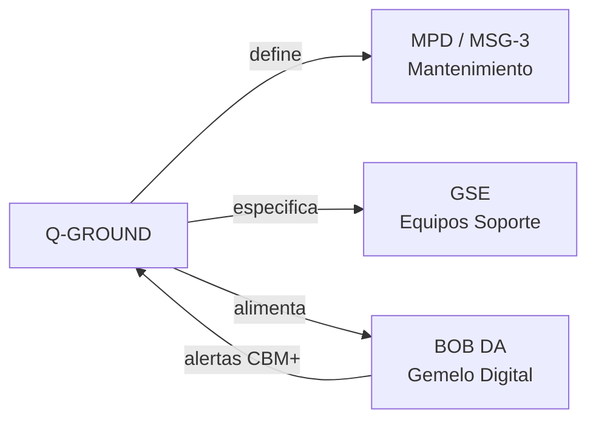

# Q-GROUND — Soporte Terrestre, Mantenimiento y GSE
> *La red de apoyo que mantiene la aeronave en el aire: mantenimiento, infraestructura terrestre y excelencia operacional.*

**Identificador:** GQAOA-ORG-QDIV-Q-GROUND-001
**Versión:** 1.0.0 · **Fecha:** 25 de abril de 2026 · **Estado:** α

---
## Glosario de Términos y Acrónimos

| Acrónimo / Término | Definición completa | Referencia externa |
|--------------------|--------------------|--------------------|
| **AMM** | *Aircraft Maintenance Manual* — manual de mantenimiento de aeronave; nivel ATA 100 / S1000D | [S1000D.net](https://www.s1000d.net/) |
| **BITE** | *Built-In Test Equipment* — sistema embarcado de autodiagnóstico para detectar y aislar fallos | *(aviónica estándar)* |
| **CBM+** | *Condition-Based Maintenance Plus* — mantenimiento predictivo basado en datos de condición en tiempo real | [SAE JA1012](https://www.sae.org/standards/content/ja1012/) |
| **EASA Part 66** | Licencias de personal de mantenimiento aeronáutico (Categorías A, B1, B2, C) | [EASA Part 66](https://www.easa.europa.eu/en/document-library/regulations/regulation-eu-no-11492011) |
| **EASA Part 145** | Reglamento de organizaciones de mantenimiento aprobadas | [EASA Part 145](https://www.easa.europa.eu/en/document-library/regulations/regulation-eu-no-13212014) |
| **EASA Part M** | Reglamento de aeronavegabilidad continuada — responsabilidades del operador | [EASA Part M](https://www.easa.europa.eu/en/document-library/regulations/regulation-eu-no-13212014) |
| **FMECA** | *Failure Modes, Effects and Criticality Analysis* — análisis de modos de fallo con evaluación de criticidad | [MIL-STD-1629A](https://www.everyspec.com/MIL-STD/MIL-STD-1600-1699/MIL-STD-1629A_14167/) |
| **GSE** | *Ground Support Equipment* — equipos de apoyo en tierra para mantenimiento y operaciones | *(industria aeroespacial)* |
| **HUMS** | *Health and Usage Monitoring System* — sistema embarcado de monitorización de salud y uso de componentes | *(CAA UK HUMS guidance)* |
| **IETP** | *Interactive Electronic Technical Publication* — publicación técnica interactiva S1000D | [S1000D.net](https://www.s1000d.net/) |
| **ILS** | *Integrated Logistic Support* — disciplina de ingeniería que asegura mantenibilidad y soporte durante toda la vida operativa | [MIL-STD-1388](https://www.everyspec.com/) |
| **IPA** | *Initial Provisioning Analysis* — análisis de aprovisionamiento inicial de repuestos para el EIS | *(IATA provisioning practice)* |
| **IPC** | *Illustrated Parts Catalog* — catálogo ilustrado de piezas con referencias de repuesto | [S1000D.net](https://www.s1000d.net/) |
| **LSAP** | *Logistic Support Analysis Plan* — plan de análisis de soporte logístico; establece actividades ILS | [MIL-STD-1388](https://www.everyspec.com/) |
| **MFOP** | *Maintenance Free Operating Period* — período de operación sin intervención de mantenimiento programado | *(Rolls-Royce / UK MoD concept)* |
| **MPD** | *Maintenance Planning Document* — documento de planificación de mantenimiento derivado del MSG-3 | *(IATA MSG-3)* |
| **MRO** | *Maintenance, Repair and Overhaul* — actividades de mantenimiento aeronáutico | [IATA MRO](https://www.iata.org/en/programs/ops-infra/maintenance/) |
| **MSG-3** | *Maintenance Steering Group — 3ª revisión* — metodología lógica para determinar requisitos de mantenimiento | [IATA MSG-3](https://www.iata.org/en/programs/ops-infra/maintenance/msg-3/) |
| **QRH** | *Quick Reference Handbook* — manual de referencia rápida de procedimientos de emergencia y anormales | *(FCOM/QRH standard)* |
| **RAM** | *Reliability, Availability, Maintainability* — análisis de fiabilidad, disponibilidad y mantenibilidad del sistema | [IEC 60300-3-1](https://webstore.iec.ch/publication/1255) |
| **S1000D** | Especificación internacional para documentación técnica modular XML | [S1000D.net](https://www.s1000d.net/) |
| **SRM** | *Structural Repair Manual* — manual de reparaciones estructurales aprobadas | [S1000D.net](https://www.s1000d.net/) |
| **TSM** | *Troubleshooting Manual* — manual de diagnóstico y resolución de fallos | [S1000D.net](https://www.s1000d.net/) |

---

## 1. Misión y Alcance

Q-GROUND es la división técnica responsable del diseño, especificación y soporte de todos los sistemas de apoyo en tierra (GSE[^1] — Ground Support Equipment), los programas de mantenimiento (MRO[^2] — Maintenance, Repair and Overhaul), las publicaciones técnicas para operadores y los sistemas de soporte integrado logístico (ILS[^3]). Su alcance cubre la vida en servicio completa de la aeronave desde la primera entrega hasta el retiro.

Q-GROUND actúa como el principal cliente interno de Q-STRUCTURES, Q-MECHANICS y Q-DATAGOV durante las fases de diseño, garantizando que la mantenibilidad (MFOP[^4]) y la testabilidad se incorporen desde el primer día. Es la división propietaria del programa de mantenimiento certificado (conforme a EASA Part 145/Part M y MSG-3[^5]) y del conjunto de publicaciones técnicas (AMM, SRM, IPC) en el CSDB.

---

## 2. Responsabilidades Clave

- **Programa de mantenimiento:** Desarrollo y certificación del Maintenance Planning Document (MPD) y del programa de mantenimiento conforme a MSG-3 y EASA Part M.
- **Ground Support Equipment (GSE):** Especificación, diseño y provisión de todos los equipos de apoyo en tierra para mantenimiento de línea y base.
- **Publicaciones técnicas operacionales:** Coordinación de la elaboración y publicación del AMM, SRM, IPC, TSM y QRH conforme a S1000D/iSpec 2200.
- **Gestión de repuestos (Spares):** Definición del modelo de aprovisionamiento de repuestos iniciales (Initial Provisioning), gestión del catálogo ilustrado de piezas (IPC).
- **Formación de personal de mantenimiento:** Diseño del programa de entrenamiento de mecánicos y técnicos, en coordinación con ORB-HR.
- **Soporte integrado logístico (ILS):** Análisis de Mantenibilidad (RAM — Reliability, Availability, Maintainability), FMECA aplicada a mantenimiento, LSAP.
- **Monitorización en servicio:** Coordinación con Q-HPC para la operación del BOB DA (gemelo digital) y la integración de datos de salud estructural (HUMS).
- **Infraestructura aeroportuaria:** Coordinación con operadores y aeropuertos para los requisitos de infraestructura de recarga eléctrica/H₂ y GSE eléctrico.

---

## 3. Entregables Clave

| ID | Descripción | Tipo | Estado |
|----|-------------|------|--------|
| Q-GROUND-01-MPD-MASTER.xlsx | Maintenance Planning Document maestro (MSG-3) | XLSX | α |
| Q-GROUND-02-GSE-SPEC-CATALOG.md | Catálogo de especificaciones de GSE (eléctrico + convencional) | MD | α |
| Q-GROUND-03-AMM-DRAFT.xml | Borrador del Aircraft Maintenance Manual (S1000D XML) | XML | β |
| Q-GROUND-04-IPC-CATALOG.xml | Illustrated Parts Catalog — catálogo ilustrado de piezas | XML | β |
| Q-GROUND-05-RAM-ANALYSIS.md | Análisis RAM (Reliability, Availability, Maintainability) | MD | β |
| Q-GROUND-06-TRAINING-PROGRAM.md | Programa de formación de personal de mantenimiento | MD | α |
| Q-GROUND-07-INITIAL-PROVISIONING.xlsx | Plan de aprovisionamiento inicial de repuestos | XLSX | β |

---

## 4. RACI de Dominio

| Actividad | Q-GROUND Lead | Co-Q-Divisions (C) | ORB Support (C/I) |
|-----------|--------------|-------------------|-------------------|
| Programa de mantenimiento (MPD/MSG-3) | **A**/R | Q-STRUCTURES (C), Q-MECHANICS (C) | ORB-LEG (C), ORB-PMO (I) |
| Especificación GSE | **A**/R | Q-MECHANICS (C), Q-GREENTECH (C) | ORB-PROC (C) |
| AMM — Aircraft Maintenance Manual | **A**/R | Q-DATAGOV (R), Q-STRUCTURES (C) | ORB-PMO (I) |
| Catálogo de piezas (IPC) | **A**/R | Q-DATAGOV (R), Q-INDUSTRY (C) | ORB-PROC (I) |
| Análisis RAM / FMECA | **A**/R | Q-SCIRES (R), Q-HPC (C) | ORB-PMO (I) |
| Formación personal mantenimiento | **A**/R | Q-DATAGOV (C), Q-SCIRES (C) | ORB-HR (C) |
| Monitorización BOB DA en servicio | **A**/R | Q-HPC (R), Q-DATAGOV (C) | ORB-IT (C), ORB-PMO (I) |
| Integración infraestructura H₂/eléctrica | **A**/R | Q-GREENTECH (R), Q-SPACE (C) | ORB-PROC (C) |

---

## 5. Interfaces Clave

### Con otras Q-Divisions

| Q-Division | Qué se intercambia | Dirección |
|------------|-------------------|-----------|
| Q-MECHANICS | Procedimientos de mantenimiento de sistemas mecánicos; GSE especializado | Q-MECH → Q-GROUND |
| Q-STRUCTURES | Datos del SRM; requisitos de acceso estructural para mantenimiento | Bidireccional |
| Q-HPC | Integración BOB DA; modelos predictivos de fallos (CBM+) | Bidireccional |
| Q-DATAGOV | Publicación AMM/IPC/SRM en CSDB; exportación IETP | Bidireccional |
| Q-GREENTECH | Procedimientos de mantenimiento de sistemas de energía; GSE de recarga H₂/eléctrico | Bidireccional |
| Q-INDUSTRY | Retroalimentación de mantenimiento para mejora de diseño DFM | Q-GROUND → Q-IND |

### Con unidades ORB

| ORB Unit | Naturaleza de la interacción |
|----------|------------------------------|
| ORB-LEG | Aprobación Part 145; cumplimiento Part M; normativa de formación de mantenimiento |
| ORB-HR | Programas de formación de técnicos; certificación EASA Part 66 del personal |
| ORB-PROC | Contratos de aprovisionamiento de repuestos; acuerdos MRO con operadores |
| ORB-FIN | Costes del programa ILS; modelo de negocio de soporte (PBH — Power By the Hour) |

---

## 6. KPIs del Dominio

| KPI | Objetivo | Fuente |
|-----|----------|--------|
| MFOP (Maintenance Free Operating Period) | ≥ 1,000 FH sin intervención de mantenimiento mayor | Q-GROUND-01-MPD-MASTER |
| Disponibilidad de la aeronave (Dispatch Reliability) | ≥ 99.5% | Q-GROUND-05-RAM-ANALYSIS |
| Cobertura de publicaciones técnicas en CSDB (AMM/IPC) | ≥ 98% DMs planificados publicados en EIS | Q-GROUND-03-AMM-DRAFT |
| Tiempo medio de resolución de AOG (Ground Time) | ≤ 4 horas para AOG de línea | Q-GROUND-05-RAM-ANALYSIS |
| Cobertura de formación inicial (personal MRO) | 100% del personal certificado antes del primer vuelo comercial | Q-GROUND-06-TRAINING-PROGRAM |

---

## 7. Riesgos Específicos

| Riesgo | Impacto | Probabilidad | Mitigación |
|--------|---------|--------------|------------|
| Publicaciones técnicas incompletas en EIS (falta de AMM/IPC) | Alto | Media | Programa de redacción paralelo al diseño; revisiones intermedias de completitud |
| Complejidad del GSE de recarga H₂ criogénico | Alto | Media | Coordinación temprana con aeropuertos piloto; diseño modular de GSE |
| Baja disponibilidad de repuestos iniciales por largo lead time | Medio | Alta | Initial Provisioning Analysis (IPA) iniciada 24 meses antes de EIS |
| Falta de personal técnico certificado EASA Part 66 Cat. B2 | Medio | Media | Programa de formación con ORB-HR; escuelas de mantenimiento propias |

---

## 8. Referencias

### Internas
- [Matriz RACI Maestra Q-Divisions](../Readme.md)
- [Documento Organizacional Maestro GQAOA](../../README.md)
- [AMPEL360-BWB-Q100 Docs](../../../programs/AMPEL360/AMPEL360-BWB-Q100/Docs/readme.md)
- [CSDB S1000D Validator](../../../CSDB/s1000d_validator.py)

### Externas — Normativa y Estándares
| Referencia | Descripción | Enlace |
|-----------|-------------|--------|
| EASA Part 145 (EU) 1321/2014 | Approved Maintenance Organisations | [easa.europa.eu](https://www.easa.europa.eu/en/document-library/regulations/regulation-eu-no-13212014) |
| EASA Part M (EU) 1321/2014 | Continuing Airworthiness Requirements | [easa.europa.eu](https://www.easa.europa.eu/en/document-library/regulations/regulation-eu-no-13212014) |
| EASA Part 66 (EU) 1149/2011 | Aircraft Maintenance Licence | [easa.europa.eu](https://www.easa.europa.eu/en/document-library/regulations/regulation-eu-no-11492011) |
| IATA MSG-3 | Maintenance Steering Group methodology | [iata.org](https://www.iata.org/en/programs/ops-infra/maintenance/msg-3/) |
| S1000D Issue 5.0 | Technical publications (AMM, IPC, SRM) | [s1000d.net](https://www.s1000d.net/) |
| IEC 60300-3-1 | Dependability management — RAM techniques | [iec.ch](https://webstore.iec.ch/publication/1255) |
| SAE JA1012 | A Guide to the Reliability-Centered Maintenance | [sae.org](https://www.sae.org/standards/content/ja1012/) |
| MIL-STD-1388-2B | Logistics Support Analysis Record | [everyspec.com](https://www.everyspec.com/) |

## Notas

[^1]: **GSE** (Ground Support Equipment): conjunto de equipos, vehículos y herramientas utilizados en tierra para el mantenimiento, servicio, remolque, avituallamiento y apoyo operacional de la aeronave.
[^2]: **MRO** (Maintenance, Repair and Overhaul): conjunto de actividades de mantenimiento aeronáutico que incluye mantenimiento de línea (line), base (base/heavy) y revisión general de componentes.
[^3]: **ILS** (Integrated Logistic Support): disciplina de ingeniería y gestión que asegura que el sistema sea mantenible y supportable durante toda su vida operativa; integra análisis RAM, aprovisionamiento, formación y publicaciones técnicas.
[^4]: **MFOP** (Maintenance Free Operating Period): objetivo de diseño que define el período de operación continua durante el cual la aeronave no requiere ninguna intervención de mantenimiento programado.
[^5]: **MSG-3** (Maintenance Steering Group — 3ª revisión): metodología de análisis lógico, desarrollada por ATA/IATA, que determina los requisitos de mantenimiento de una aeronave a partir del análisis de consecuencias de fallo.

**[FIN DEL DOCUMENTO]**
