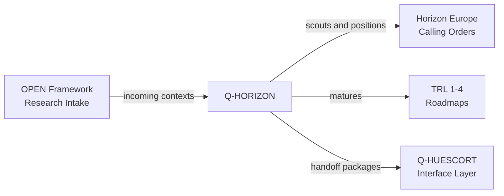

# Q-HORIZON — Horizon Research and Future Concepts
> *The division that scans the far horizon: Horizon Europe positioning, low-TRL research and future aerospace concepts.*

**Identifier:** GQAOA-ORG-QDIV-Q-HORIZON-001
**Version:** 1.0.0 · **Date:** 26 April 2026 · **Status:** α

---
## Glossary of Terms and Acronyms

| Acronym / Term | Full definition | External reference |
|----------------|-----------------|--------------------|
| **CORDIS** | *Community Research and Development Information Service* — European Commission public repository for EU-funded R&D projects | [CORDIS](https://cordis.europa.eu/) |
| **EIC** | *European Innovation Council* — EU instrument for high-risk, high-impact innovation funding | [EIC](https://eic.ec.europa.eu/) |
| **ESA** | *European Space Agency* — intergovernmental agency for European space research and missions | [ESA](https://www.esa.int/) |
| **EUROCAE** | European organization developing aviation standards and guidance material | [EUROCAE](https://www.eurocae.net/) |
| **Horizon Europe** | EU framework programme for research and innovation, supporting collaborative research and technology maturation | [Horizon Europe](https://research-and-innovation.ec.europa.eu/funding/funding-opportunities/funding-programmes-and-open-calls/horizon-europe_en) |
| **ICD** | *Interface Control Document* — document defining controlled technical interfaces between systems or divisions | *(systems engineering)* |
| **KMR** | *Key Market Requirement* — strategic market need translated into early research and proposal positioning | *(internal GQAOA)* |
| **LUTNDR** | Central technology register for in-use, new-projection, disuse and rearranged technologies | *(GQAOA-UTA-LUTNDR-001)* |
| **OPEN Frameworks** | Open research frameworks, standards or public scientific inputs admitted into governed GQAOA intake workflows | *(internal GQAOA)* |
| **RIA / IA** | *Research and Innovation Action / Innovation Action* — Horizon Europe funding action types | [EU Funding & Tenders](https://ec.europa.eu/info/funding-tenders/opportunities/portal/screen/home) |
| **RTO** | *Research and Technology Organization* — institutional partner performing advanced research and validation activities | *(research ecosystem)* |
| **SRIA** | *Strategic Research and Innovation Agenda* — roadmap used by partnerships to define research priorities | *(EU partnerships)* |
| **TRL** | *Technology Readiness Level* — maturity scale from 1 to 9 used by NASA, ESA and the European Commission | [NASA TRL](https://www.nasa.gov/directorates/somd/space-communications-navigation-program/technology-readiness-levels/) |

---

## 1. Mission and Scope

Q-HORIZON is the technical division responsible for strategic horizon scanning, low-TRL[^1] research positioning, Horizon Europe calling-order alignment and disruptive aerospace concept framing for the GQAOA programme. Its scope spans research opportunity scouting, proposal positioning, future-concept roadmaps and TRL 1–4 maturation before transfer into accountable Q-Division technical baselines.

Q-HORIZON is embedded in **[Q-HUESCORT-SCIRES-OPEN](../Q-HUESCORT-SCIRES-OPEN/)** together with the retained **[Q-SCIRES](../Q-SCIRES/)** scientific and certification-evidence capability. This pairing provides integrated interface control between horizon positioning, scientific research, incoming OPEN-framework[^2] inputs and downstream certification feasibility.

---

## 2. Key Responsibilities

- **Horizon Europe / UE calling-order scouting:** Monitor calls, partnerships, work programmes and CORDIS signals relevant to GQAOA research domains.
- **Research positioning and proposal framing:** Translate strategic research opportunities into consortium-ready positioning packages, concept notes and bid/no-bid inputs.
- **TRL 1–4 roadmapping:** Consolidate early maturity paths, entry/exit criteria and handoff gates before transfer to design or certification owners.
- **Future-concept incubation:** Frame disruptive aerospace concepts, scenario assumptions, operational concepts and preliminary KMR[^3] traces.
- **OPEN-framework intake:** Classify incoming open research, standards and public scientific inputs before routing through governed review workflows.
- **Interface control with Q-SCIRES:** Coordinate testability, evidence feasibility, validation strategy and certification-risk signals for low-TRL concepts.
- **Traceability with Q-DATAGOV:** Maintain naming, provenance, CSDB readiness and publication control for research-positioning artifacts.
- **Technology-register integration:** Feed candidate technologies, maturity deltas and discontinuity signals into LUTNDR[^4] governance.

---

## 3. Key Deliverables

| ID | Description | Type | Status |
|----|-------------|------|--------|
| Q-HORIZON-01-CALLING-ORDERS.md | Horizon Europe / UE calling-order positioning register | MD | α |
| Q-HORIZON-02-TRL-ROADMAP.md | TRL 1–4 technology maturation roadmap and handoff gates | MD | α |
| Q-HORIZON-03-OPEN-FRAMEWORKS.md | Incoming OPEN-framework research context map | MD | α |
| Q-HORIZON-04-FUTURE-CONCEPTS.md | Disruptive future-concept backlog and scenario framing | MD | α |
| Q-HORIZON-05-PROPOSAL-POSITIONING.md | Proposal positioning matrix for RIA/IA/EIC opportunities | MD | β |
| Q-HORIZON-06-RESEARCH-HANDOFF-ICD.md | Interface-control handoff pack to accountable Q-Divisions | MD | β |
| Q-HORIZON-07-LUTNDR-CANDIDATES.yaml | Candidate technology entries for LUTNDR review | YAML | β |

---

## 4. Domain RACI

| Activity | Q-HORIZON Lead | Co-Q-Divisions (C) | ORB Support (C/I) |
|----------|----------------|--------------------|-------------------|
| Horizon Europe calling-order scouting | **A**/R | Q-DATAGOV (C), Q-SCIRES (C) | ORB-PMO (C), ORB-LEG (I) |
| TRL 1–4 roadmap consolidation | **A**/R | Q-SCIRES (R), Q-HPC (C), Q-GREENTECH (C) | ORB-PMO (I) |
| OPEN-framework research intake | **A**/R | Q-DATAGOV (R), Q-SCIRES (C) | ORB-IT (C), ORB-LEG (C) |
| Future-concept scenario framing | **A**/R | Q-AIR (C), Q-SPACE (C), Q-STRUCTURES (C) | ORB-MKTG (C), ORB-PMO (I) |
| Proposal positioning package | **A**/R | Q-HUESCORT-SCIRES-OPEN (C), Q-DATAGOV (C) | ORB-FIN (C), ORB-PMO (R) |
| Research-to-baseline handoff | **A**/R | Accountable receiving Q-Division (R), Q-SCIRES (C) | ORB-PMO (C) |
| LUTNDR candidate technology update | **A**/R | Q-DATAGOV (R), Q-GREENTECH (C) | ORB-CSR (I) |

---

## 5. Key Interfaces

### With other Q-Divisions

| Q-Division | What is exchanged | Direction |
|------------|-------------------|-----------|
| Q-HUESCORT-SCIRES-OPEN | Umbrella positioning layer, resilient-touch routing and integrated Horizon + SCIRES + OPEN interface control | Bidirectional |
| Q-SCIRES | Scientific context framing, test feasibility, validation evidence and certification risk signals | Bidirectional |
| Q-DATAGOV | Naming control, provenance, CSDB/S1000D readiness and publication governance | Bidirectional |
| Q-HPC | Quantum, AI/ML and simulation feasibility for disruptive concepts | Bidirectional |
| Q-GREENTECH | Sustainability-oriented research opportunities and emerging clean-energy technologies | Bidirectional |
| Q-AIR | Aerodynamic concepts, operational scenarios and early validation needs | Bidirectional |
| Q-STRUCTURES | Materials, structural concepts and maturity evidence for low-TRL candidates | Bidirectional |

### With ORB units

| ORB Unit | Nature of interaction |
|----------|------------------------|
| ORB-PMO | Proposal calendar, work-package planning, milestone control and handoff scheduling |
| ORB-LEG | Funding eligibility, IP constraints, consortium agreements and publication-risk checks |
| ORB-FIN | Grant-budget assumptions, co-funding analysis and return-on-research tracking |
| ORB-MKTG | Strategic positioning narratives and public research communication alignment |
| ORB-IT | Collaboration tooling, intake portals and research repository access controls |

---

## 6. Domain KPIs

| KPI | Target | Source |
|-----|--------|--------|
| Horizon calling-order screening latency | ≤ 10 business days from call publication to initial triage | Q-HORIZON-01-CALLING-ORDERS |
| TRL 1–4 roadmap coverage for accepted concepts | 100% before handoff | Q-HORIZON-02-TRL-ROADMAP |
| OPEN-framework intake traceability | 100% entries with source, owner and disposition | Q-HORIZON-03-OPEN-FRAMEWORKS |
| Proposal positioning completeness | ≥ 90% of eligible calls with bid/no-bid rationale | Q-HORIZON-05-PROPOSAL-POSITIONING |
| SCIRES feasibility review coverage | 100% of concepts before baseline transfer | Q-HUESCORT-SCIRES-OPEN interface log |
| LUTNDR candidate update cadence | Quarterly candidate review | Q-HORIZON-07-LUTNDR-CANDIDATES |

---

## 7. Specific Risks

| Risk | Impact | Probability | Mitigation |
|------|--------|-------------|------------|
| Misalignment between Horizon Europe calls and GQAOA technical baselines | High | Medium | Maintain rolling calling-order register and Q-Division capability map |
| Low-TRL concepts transferred without evidence feasibility | High | Medium | Mandatory Q-SCIRES feasibility review before handoff |
| OPEN-framework inputs lack provenance or IP clearance | High | Medium | Q-DATAGOV provenance checks and ORB-LEG publication/IP review |
| Excessive research backlog without accountable owners | Medium | High | Gate intake through Q-HUESCORT-SCIRES-OPEN and assign receiving Q-Division owners |
| Proposal timing misses funding windows | Medium | Medium | ORB-PMO calendar integration and early bid/no-bid triage |

---

## 8. Technology Roadmap

| Technology / Capability | Current TRL | Target TRL | Target Year | Key Milestone |
|-------------------------|-------------|------------|-------------|---------------|
| Horizon Europe calling-order intelligence workflow | TRL 5 | TRL 8 | 2028 | Live portfolio dashboard |
| OPEN-framework research intake governance | TRL 4 | TRL 7 | 2029 | Auditable source-to-owner traceability |
| Future-concept TRL 1–4 maturation model | TRL 4 | TRL 7 | 2030 | First complete concept handoff pack |
| AI-assisted research landscape scanning | TRL 3 | TRL 6 | 2031 | Validated semantic scouting workflow |
| LUTNDR candidate technology feedback loop | TRL 4 | TRL 7 | 2030 | Quarterly integrated technology-register review |

---

## 9. References

### Internal
- [Master Q-Divisions RACI Matrix](../Readme.md)
- [Q-HUESCORT-SCIRES-OPEN Interface Layer](../Q-HUESCORT-SCIRES-OPEN/)
- [Q-SCIRES — Scientific Research, Tests and Certification](../Q-SCIRES/)
- [Q-DATAGOV — Data Governance and CSDB](../Q-DATAGOV/)
- [GQAOA Organizational Master Document](../../README.md)
- [LUTNDR — Technology Register](../../../OPT-INS_FRAMEWORK/GQAOA-UTA-LUTNDR-001.md)

### External — Programmes and Standards
| Reference | Description | Link |
|-----------|-------------|------|
| Horizon Europe | EU research and innovation framework programme | [research-and-innovation.ec.europa.eu](https://research-and-innovation.ec.europa.eu/funding/funding-opportunities/funding-programmes-and-open-calls/horizon-europe_en) |
| EU Funding & Tenders Portal | Official portal for EU calls, topics and proposals | [ec.europa.eu](https://ec.europa.eu/info/funding-tenders/opportunities/portal/screen/home) |
| CORDIS | Repository of EU-funded research projects and results | [cordis.europa.eu](https://cordis.europa.eu/) |
| European Innovation Council | EU high-risk innovation support instrument | [eic.ec.europa.eu](https://eic.ec.europa.eu/) |
| NASA TRL Scale | Technology Readiness Level definitions | [nasa.gov](https://www.nasa.gov/directorates/somd/space-communications-navigation-program/technology-readiness-levels/) |
| ESA Technology Readiness Levels | European space technology maturity references | [esa.int](https://www.esa.int/) |

## Notes

[^1]: **TRL** (Technology Readiness Level): nine-level maturity scale used to classify research and technology readiness; Q-HORIZON primarily owns TRL 1–4 maturation before accountable baseline transfer.
[^2]: **OPEN Frameworks**: open research inputs, standards, public scientific repositories and framework artifacts admitted into governed GQAOA intake and traceability workflows.
[^3]: **KMR** (Key Market Requirement): strategic market requirement translated into early research positioning, concept framing and proposal rationale.
[^4]: **LUTNDR**: Libro Unico delle Tecnologie: in uso, Nuova progettazione, Disuso, Riassetti — centralized programme technology register; canonical files include `LUT_REGISTER.yaml` and `LUT_CIRCULARITY.yaml`.

**[END OF DOCUMENT]**
