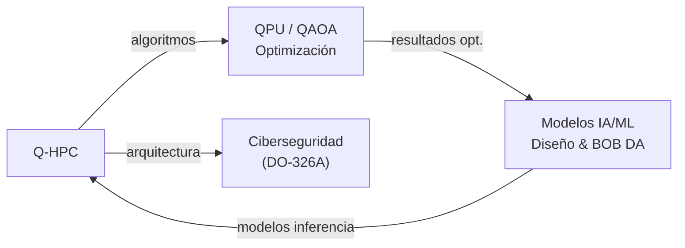

# Q-HPC — Computación de Alto Rendimiento, Cuántica e IA/ML
> *El cerebro cuántico del programa: simulación, optimización y aprendizaje automático al servicio de la ingeniería.*

**Identificador:** GQAOA-ORG-QDIV-Q-HPC-001
**Versión:** 1.0.0 · **Fecha:** 25 de abril de 2026 · **Estado:** α

---
## Glosario de Términos y Acrónimos

| Acrónimo / Término | Definición completa | Referencia externa |
|--------------------|--------------------|--------------------|
| **ARINC 811** | Estándar aeronáutico para la seguridad cibernética de sistemas de información de aerolíneas y aeronaves | [ARINC](https://www.aviation-ia.com/arinc) |
| **ASIC** | *Application-Specific Integrated Circuit* — circuito integrado diseñado para una aplicación específica; crítico en aviónica | *(microelectronics)* |
| **BOB DA** | *Contextual Digital Agent* — gemelo digital de monitorización en servicio del programa GQAOA | *(interno GQAOA)* |
| **CBM+** | *Condition-Based Maintenance Plus* — mantenimiento predictivo basado en datos de condición en tiempo real | [SAE JA1012](https://www.sae.org/standards/content/ja1012/) |
| **DAL** | *Design Assurance Level* — niveles A–E de criticidad de diseño (DO-178C/ARP4754A) | [SAE ARP4754A](https://www.sae.org/standards/content/arp4754a/) |
| **DO-178C** | *Software Considerations in Airborne Systems* — certificación de software aeronáutico | [RTCA DO-178C](https://www.rtca.org/products/do-178c/) |
| **DO-254** | *Design Assurance for Airborne Electronic Hardware* — certificación de hardware electrónico complejo | [RTCA DO-254](https://www.rtca.org/products/do-254/) |
| **DO-326A / ED-202A** | *Airworthiness Security Process Specification* — ciberseguridad de sistemas aeronáuticos | [EUROCAE ED-202A](https://www.eurocae.net/) |
| **DSE** | *Design Space Exploration* — búsqueda sistemática del espacio de diseño multidimensional asistida por IA | *(aerospace SE practice)* |
| **EUROCAE WG-114** | Grupo de trabajo EUROCAE sobre IA aplicada a la aviación | [EUROCAE](https://www.eurocae.net/news/posts/2019/october/eurocae-establishes-new-working-group-on-artificial-intelligence/) |
| **FPGA** | *Field-Programmable Gate Array* — circuito integrado reprogramable; usado en prototipado de hardware aviónico | *(Xilinx/Intel Altera)* |
| **HPC** | *High-Performance Computing* — clústeres de computación paralela masiva | [TOP500](https://www.top500.org/) |
| **IBM Quantum** | Plataforma de acceso a QPU superconductores vía cloud de IBM | [IBM Quantum](https://www.ibm.com/quantum) |
| **MC/DC** | *Modified Condition/Decision Coverage* — cobertura estructural exigida para software DAL A por DO-178C | [RTCA DO-178C](https://www.rtca.org/products/do-178c/) |
| **QAOA** | *Quantum Approximate Optimization Algorithm* — algoritmo cuántico variacional para optimización combinatoria | [arXiv:1411.4028](https://arxiv.org/abs/1411.4028) |
| **QPU** | *Quantum Processing Unit* — procesador cuántico basado en qubits superconductores o fotónicos | [IBM Quantum](https://www.ibm.com/quantum) |
| **qubit** | Unidad básica de información cuántica; puede estar en superposición de |0⟩ y |1⟩ simultáneamente | [Nielsen & Chuang](https://www.cambridge.org/highereducation/books/quantum-computation-and-quantum-information/) |
| **ROM** | *Reduced Order Model* — modelo de baja dimensión derivado de simulaciones de alta fidelidad para uso en optimización | *(aerospace SE practice)* |
| **TRL** | *Technology Readiness Level* — madurez tecnológica 1–9 | [NASA TRL](https://www.nasa.gov/directorates/somd/space-communications-navigation-program/technology-readiness-levels/) |
| **V&V** | *Verification & Validation* — proceso dual que confirma que el producto fue construido correctamente y cumple necesidades del usuario | [IEEE 1012](https://standards.ieee.org/ieee/1012/5609/) |

---

## 1. Misión y Alcance

Q-HPC es la división técnica responsable del desarrollo, integración y operación de todos los sistemas de computación de alto rendimiento (HPC[^1]), computación cuántica (QPU[^2]) e inteligencia artificial/aprendizaje automático (IA/ML) del programa GQAOA. Su alcance cubre desde la infraestructura de cómputo hasta los algoritmos especializados de optimización cuántica (QAOA[^3]), modelos de IA para diseño y operaciones, y el gemelo digital (BOB DA) para monitorización en servicio.

Q-HPC es el habilitador tecnológico transversal del programa, proveyendo capacidades de simulación de alta fidelidad a todas las demás Q-Divisions y actuando como propietaria de la arquitectura de software de misión crítica conforme a DO-178C[^4]/DO-254[^5].

---

## 2. Responsabilidades Clave

- **Infraestructura HPC:** Diseño, despliegue y operación de clusters HPC para CFD (Q-AIR), FEM (Q-STRUCTURES) y simulaciones de sistemas complejos.
- **Computación cuántica (QPU):** Desarrollo e integración de algoritmos QAOA para optimización de diseño aerodinámico, planificación de rutas y diagnóstico predictivo.
- **IA/ML para ingeniería:** Desarrollo de modelos de IA para design space exploration (DSE), reducción de modelos (ROM), y predicción de fallos.
- **Gemelo digital (BOB DA):** Mantenimiento y operación del gemelo digital en servicio, integrando datos de sensores, modelos físicos y IA para predicción de estado.
- **Software de misión crítica (FCS SW):** Desarrollo y verificación del software de sistemas de control de vuelo conforme a DO-178C (nivel A/B).
- **Ciberseguridad embarcada:** Diseño de la arquitectura de ciberseguridad aviónica conforme a DO-326A/ED-202A y ARINC 811.
- **Gestión de datos de simulación:** Coordinación con Q-DATAGOV para la integración de datasets de simulación en el CSDB y trazabilidad de modelos.
- **Validación de algoritmos cuánticos:** Diseño y ejecución del plan de verificación y validación (V&V) de algoritmos cuánticos y de IA en entornos seguros.

---

## 3. Entregables Clave

| ID | Descripción | Tipo | Estado |
|----|-------------|------|--------|
| Q-HPC-01-QPU-ARCH-SPEC.md | Especificación de arquitectura de sistema QPU integrado | MD | α |
| Q-HPC-02-QPU-PERFORMANCE-DASHBOARD.dashboard | Panel de rendimiento QPU — benchmarking cuántico vs. clásico | Dashboard | β |
| Q-HPC-03-AI-DSE-MODEL.hdf5 | Modelo IA de exploración del espacio de diseño (DSE) | HDF5 | β |
| Q-HPC-04-FCS-SW-REQUIREMENTS.md | Especificación de requisitos SW FCS (DO-178C nivel A) | MD | α |
| Q-HPC-05-CYBERSEC-ARCH.md | Arquitectura de ciberseguridad aviónica (DO-326A) | MD | β |
| Q-HPC-06-BOB-DA-INTEGRATION-SPEC.md | Especificación de integración del gemelo digital BOB DA | MD | β |
| Q-HPC-07-VV-QUANTUM-PLAN.md | Plan de V&V de algoritmos cuánticos y modelos IA | MD | β |

---

## 4. RACI de Dominio

| Actividad | Q-HPC Lead | Co-Q-Divisions (C) | ORB Support (C/I) |
|-----------|-----------|-------------------|-------------------|
| Infraestructura HPC para CFD/FEM | **A**/R | Q-AIR (C), Q-STRUCTURES (C) | ORB-IT (R) |
| Desarrollo algoritmos QAOA | **A**/R | Q-SCIRES (C), Q-DATAGOV (C) | ORB-IT (C) |
| Modelos IA/ML para diseño | **A**/R | Q-AIR (C), Q-STRUCTURES (C) | ORB-IT (C) |
| Gemelo digital BOB DA | **A**/R | Q-DATAGOV (R), Q-GROUND (C) | ORB-IT (C), ORB-PMO (I) |
| SW misión crítica FCS (DO-178C) | **A**/R | Q-AIR (R), Q-SCIRES (C) | ORB-LEG (C), ORB-IT (C) |
| Arquitectura ciberseguridad aviónica | **A**/R | Q-SPACE (C), Q-DATAGOV (C) | ORB-IT (C), ORB-LEG (C) |
| V&V algoritmos cuánticos | **A**/R | Q-SCIRES (R), Q-DATAGOV (C) | ORB-LEG (I) |
| Integración QPU en aviónica | **A**/R | Q-AIR (C), Q-SPACE (C) | ORB-IT (C) |

---

## 5. Interfaces Clave

### Con otras Q-Divisions

| Q-Division | Qué se intercambia | Dirección |
|------------|-------------------|-----------|
| Q-AIR | Modelos CFD de alta fidelidad; optimización cuántica de perfiles; leyes FCS | Bidireccional |
| Q-STRUCTURES | Ejecución FEM a gran escala en HPC; modelos ROM para optimización | Bidireccional |
| Q-DATAGOV | Gestión de datasets de simulación en CSDB; metadatos de modelos IA | Bidireccional |
| Q-SPACE | Integración de comunicaciones cuánticas (QKD) con arquitectura QPU | Bidireccional |
| Q-SCIRES | Plan de V&V de software y algoritmos cuánticos; correlación datos ensayo-modelo | Bidireccional |
| Q-GROUND | Datos operacionales para entrenamiento de modelos predictivos BOB DA | Q-GROUND → Q-HPC |

### Con unidades ORB

| ORB Unit | Naturaleza de la interacción |
|----------|------------------------------|
| ORB-IT | Infraestructura de red, centros de datos, cloud HPC, licencias software |
| ORB-LEG | Cumplimiento DO-178C, DO-254, DO-326A; patentes de algoritmos cuánticos |
| ORB-FIN | CAPEX de QPU y clusters HPC; ROI de inversiones en IA |
| ORB-PMO | Hitos de TRL QPU; cronograma de certificación de software |
| ORB-HR | Captación de talento en QC, IA/ML, ingeniería de software embarcado |

---

## 6. KPIs del Dominio

| KPI | Objetivo | Fuente |
|-----|----------|--------|
| Mejora de optimización QAOA vs. clásico (L/D, routing) | ≥ 5% sobre métodos clásicos | Q-HPC-02-QPU-PERFORMANCE-DASHBOARD |
| Cobertura DO-178C nivel A (MC/DC) | 100% | Q-HPC-04-FCS-SW-REQUIREMENTS |
| Tiempo de ejecución CFD LES completa | ≤ 72 h por configuración | Benchmark HPC interno |
| TRL integración QPU en aviónica | TRL ≥ 5 en 2034 | Q-HPC-01-QPU-ARCH-SPEC |
| Disponibilidad del gemelo digital BOB DA | ≥ 99.5% uptime | Q-HPC-06-BOB-DA-INTEGRATION-SPEC |
| Vulnerabilidades críticas de ciberseguridad abiertas | 0 en baseline certificado | Q-HPC-05-CYBERSEC-ARCH |

---

## 7. Riesgos Específicos

| Riesgo | Impacto | Probabilidad | Mitigación |
|--------|---------|--------------|------------|
| Madurez insuficiente de QPU para aplicaciones aeroespaciales certificables | Alto | Media | Plan de integración por fases; QPU no crítico primero; DO-178C para software cuántico |
| Ciberataque a infraestructura aviónica embarcada | Crítico | Baja | DO-326A/ED-202A desde fase de diseño; penetration testing periódico |
| Sobrecarga de HPC durante picos de CFD multifidelidad | Medio | Media | Capacidad cloud burst negociada con ORB-IT; scheduling inteligente de trabajos |
| Obsolescencia de modelos IA ante cambios de configuración | Medio | Alta | Reentrenamiento periódico y versionado en CSDB (Q-DATAGOV) |

---

## 8. Hoja de Ruta Tecnológica

| Tecnología / Capacidad | TRL Actual | TRL Objetivo | Año Objetivo | Hito Clave |
|------------------------|-----------|-------------|-------------|------------|
| QPU integrado en aviónica (5+ qubits útiles) | TRL 3 | TRL 6 | 2034 | Demo QPU en banco aviónica |
| IA DO-178C nivel A embarcada | TRL 4 | TRL 7 | 2035 | Certificación primera IA de vuelo |
| Gemelo digital BOB DA en tiempo real | TRL 5 | TRL 8 | 2032 | Despliegue en primer operador |
| QKD aeronáutico (canal cuántico seguro) | TRL 2 | TRL 5 | 2036 | Demostrador en tierra |
| Computación neuromórfica embarcada | TRL 2 | TRL 4 | 2036 | Evaluación de chip neuromórfico |

---

## 9. Referencias

### Internas
- [Matriz RACI Maestra Q-Divisions](../Readme.md)
- [Documento Organizacional Maestro GQAOA](../../README.md)
- [AMPEL360-BWB-Q100 Docs](../../../programs/AMPEL360/AMPEL360-BWB-Q100/Docs/readme.md)
- [CSDB S1000D Validator](../../../CSDB/s1000d_validator.py)
- [SUPIA v1.0 — Sistema Unico di Progettazione Industriale Avanzata](../../../OPT-INS_FRAMEWORK/GQAOA-UTA-SUPIA-001.md)

### Externas — Normativa y Estándares
| Referencia | Descripción | Enlace |
|-----------|-------------|--------|
| RTCA DO-178C | Software Considerations in Airborne Systems | [rtca.org](https://www.rtca.org/products/do-178c/) |
| RTCA DO-254 | Design Assurance for Airborne Electronic Hardware | [rtca.org](https://www.rtca.org/products/do-254/) |
| EUROCAE ED-202A | Airworthiness Security Process Specification | [eurocae.net](https://www.eurocae.net/) |
| EUROCAE WG-114 | Artificial Intelligence in Aviation | [eurocae.net](https://www.eurocae.net/news/posts/2019/october/eurocae-establishes-new-working-group-on-artificial-intelligence/) |
| SAE ARP4754A | Development of Civil Aircraft and Systems | [sae.org](https://www.sae.org/standards/content/arp4754a/) |
| arXiv:1411.4028 | QAOA original paper (Farhi et al.) | [arxiv.org](https://arxiv.org/abs/1411.4028) |
| IBM Quantum | Quantum computing cloud platform | [ibm.com/quantum](https://www.ibm.com/quantum) |
| IEEE 1012-2016 | Standard for System, Software and Hardware V&V | [ieee.org](https://standards.ieee.org/ieee/1012/5609/) |

## Notas

[^1]: **HPC** (High-Performance Computing): infraestructura de computación paralela masiva utilizada para simulaciones de alta fidelidad (CFD, FEM, optimización MDO) que superan la capacidad de estaciones de trabajo convencionales.
[^2]: **QPU** (Quantum Processing Unit): procesador cuántico basado en qubits que aprovecha la superposición y el entrelazamiento para resolver ciertos problemas de optimización exponencialmente más rápido que procesadores clásicos.
[^3]: **QAOA** (Quantum Approximate Optimization Algorithm): algoritmo cuántico variacional para optimización combinatoria; en GQAOA se aplica a diseño aerodinámico, planificación de rutas y diagnóstico predictivo.
[^4]: **DO-178C**: Software Considerations in Airborne Systems and Equipment Certification — estándar RTCA/EUROCAE que establece los criterios para desarrollar y verificar software aeronáutico según niveles de criticidad (DAL A–E).
[^5]: **DO-254**: Design Assurance Guidance for Airborne Electronic Hardware — estándar equivalente a DO-178C para hardware electrónico complejo (FPGAs, ASICs) en sistemas aviónicos.

**[FIN DEL DOCUMENTO]**
