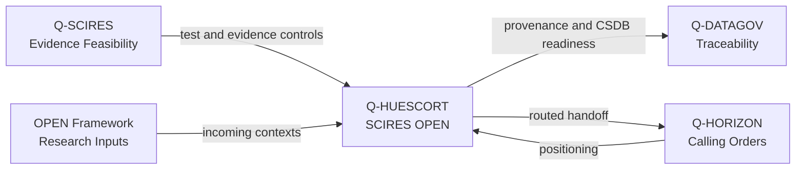

# Q-HUESCORT-SCIRES-OPEN — Horizon / SCIRES / OPEN Interface Layer
> *The resilient-touch interface layer that connects Horizon positioning, scientific evidence and OPEN-framework research intake.*

**Identifier:** GQAOA-ORG-QDIV-Q-HUESCORT-SCIRES-OPEN-001
**Version:** 1.0.0 · **Date:** 26 April 2026 · **Status:** α

---
## Glossary of Terms and Acronyms

| Acronym / Term | Full definition | External reference |
|----------------|-----------------|--------------------|
| **Calling Order** | Horizon Europe / UE call, topic or funding opportunity translated into a governed positioning item | *(EU Funding & Tenders)* |
| **CSDB** | *Common Source DataBase* — controlled source repository for S1000D technical documentation | [S1000D](https://www.s1000d.org/) |
| **Horizon Europe** | EU framework programme for research and innovation | [Horizon Europe](https://research-and-innovation.ec.europa.eu/funding/funding-opportunities/funding-programmes-and-open-calls/horizon-europe_en) |
| **HUESCORT** | Horizon UE Calling Orders in Resilient Touch — integrated positioning and interface-control layer | *(internal GQAOA)* |
| **ICD** | *Interface Control Document* — controlled artifact defining technical or organizational interfaces | *(systems engineering)* |
| **MoC** | *Means of Compliance* — evidence method used to demonstrate satisfaction of regulatory requirements | [EASA AMC/GM](https://www.easa.europa.eu/) |
| **OPEN Frameworks** | Open research frameworks, standards or public scientific inputs routed into governed review and publication workflows | *(internal GQAOA)* |
| **Q-HORIZON** | Q-Division responsible for horizon scanning, Horizon Europe positioning and low-TRL research roadmaps | [../Q-HORIZON/](../Q-HORIZON/) |
| **Q-SCIRES** | Q-Division responsible for scientific research, test planning, validation and certification evidence | [../Q-SCIRES/](../Q-SCIRES/) |
| **Resilient Touch** | Stable human-in-the-loop interface mode that preserves accountability across research intake, routing and evidence control | *(internal GQAOA)* |
| **TRL** | *Technology Readiness Level* — maturity scale from 1 to 9 used by NASA, ESA and European programmes | [NASA TRL](https://www.nasa.gov/directorates/somd/space-communications-navigation-program/technology-readiness-levels/) |
| **V&V** | *Verification and Validation* — process that verifies implementation correctness and validates fitness for intended use | [IEEE 1012](https://standards.ieee.org/ieee/1012/5609/) |

---

## 1. Mission and Scope

Q-HUESCORT-SCIRES-OPEN is the interface and positioning layer for **Horizon UE Calling Orders in Resilient Touch**. It embeds **[Q-HORIZON](../Q-HORIZON/)** with the retained **[Q-SCIRES](../Q-SCIRES/)** scientific and certification-evidence capability to coordinate Horizon Europe positioning, resilient-touch[^1] interface routing, advanced scientific context intake and incoming research from OPEN frameworks[^2].

This layer does not reverse the current Q-HORIZON naming baseline or replace the retained Q-SCIRES certification-evidence accountability. It provides the shared positioning and interface-control surface between both units, Q-DATAGOV traceability, downstream technical Q-Divisions and ORB governance support.

---

## 2. Key Responsibilities

- **Horizon + SCIRES interface control:** Maintain the shared operating surface between Q-HORIZON positioning and Q-SCIRES evidence feasibility.
- **Resilient-touch routing:** Preserve stable human-in-the-loop decisions for intake, triage, ownership assignment and downstream handoff.
- **Scientific contexts incoming research:** Classify advanced scientific contexts, determine maturity and route them to accountable technical owners.
- **OPEN-framework governance:** Trace open-framework research into governed, reviewable and publication-ready artifacts.
- **Calling-order alignment:** Connect Horizon Europe / UE call positioning to Q+ATLANTIDE1000 architecture bands and Q-Division capabilities.
- **Evidence feasibility bridge:** Ensure low-TRL[^3] opportunities include testability, validation and certification-risk signals before baseline transfer.
- **Publication readiness:** Coordinate with Q-DATAGOV for naming, provenance, CSDB[^4] alignment and controlled external communication.
- **Council reporting:** Report cross-division research-positioning decisions and interface exceptions to the Q-Divisions Council.

---

## 3. Key Deliverables

| ID | Description | Type | Status |
|----|-------------|------|--------|
| Q-HUESCORT-01-INTERFACE-MAP.md | Interface map linking Horizon positioning, SCIRES evidence and OPEN-framework intake | MD | α |
| Q-HUESCORT-02-CALLING-ORDER-REGISTER.md | Horizon UE calling-order positioning register | MD | α |
| Q-HUESCORT-03-SCIENTIFIC-CONTEXT-INTAKE.md | Advanced scientific context intake and routing log | MD | α |
| Q-HUESCORT-04-RESILIENT-TOUCH-ICD.md | Interface-control document for resilient-touch routing and decision points | MD | α |
| Q-HUESCORT-05-EVIDENCE-FEASIBILITY-MATRIX.xlsx | Matrix linking incoming research to SCIRES evidence and validation feasibility | XLSX | β |
| Q-HUESCORT-06-OPEN-PROVENANCE-REGISTER.yaml | Source, provenance and disposition register for OPEN-framework inputs | YAML | β |
| Q-HUESCORT-07-COUNCIL-EXCEPTION-LOG.md | Q-Divisions Council exception and escalation log | MD | β |

---

## 4. Domain RACI

| Activity | Q-HUESCORT Lead | Embedded Units (R/C) | ORB Support (C/I) |
|----------|-----------------|----------------------|-------------------|
| Interface map maintenance | **A**/R | Q-HORIZON (R), Q-SCIRES (C), Q-DATAGOV (C) | ORB-PMO (I) |
| Horizon UE calling-order routing | **A**/R | Q-HORIZON (R), Q-DATAGOV (C) | ORB-PMO (C), ORB-FIN (C) |
| Scientific context intake | **A**/R | Q-SCIRES (R), Q-HORIZON (C) | ORB-LEG (I) |
| OPEN-framework provenance control | **A**/R | Q-DATAGOV (R), Q-HORIZON (C), Q-SCIRES (C) | ORB-IT (C), ORB-LEG (C) |
| Evidence feasibility bridging | **A**/R | Q-SCIRES (R), receiving Q-Division (C) | ORB-LEG (C), ORB-PMO (I) |
| Resilient-touch escalation | **A**/R | Q-HORIZON (C), Q-SCIRES (C), Q-DATAGOV (C) | Q-Divisions Council (A), ORB-PMO (C) |
| Publication readiness gate | **A**/R | Q-DATAGOV (R), Q-SCIRES (C) | ORB-MKTG (C), ORB-LEG (C) |

---

## 5. Key Interfaces

### With embedded and adjacent Q-Divisions

| Q-Division | What is exchanged | Direction |
|------------|-------------------|-----------|
| Q-HORIZON | Horizon Europe / UE calling-order positioning, low-TRL roadmaps and future-concept packages | Bidirectional |
| Q-SCIRES | Scientific research context, testability, validation planning and certification evidence feasibility | Bidirectional |
| Q-DATAGOV | Naming control, provenance, CSDB publication readiness and open-framework traceability | Bidirectional |
| Q-HPC | AI/ML, quantum, simulation and semantic-scanning support for incoming research contexts | Bidirectional |
| Q-STRUCTURES | Materials, structures and advanced scientific-context routing for structural owners | Q-HUESCORT → Q-STRUCTURES |
| Q-AIR | Aerodynamic concepts, flight-science research and early experimental context routing | Q-HUESCORT → Q-AIR |
| Q-GREENTECH | Sustainable energy, batteries, hydrogen and circularity research routing | Q-HUESCORT → Q-GREENTECH |

### With ORB units

| ORB Unit | Nature of interaction |
|----------|------------------------|
| ORB-PMO | Escalation cadence, integrated research-positioning calendar and cross-division handoff planning |
| ORB-LEG | IP, funding eligibility, publication clearance and certification-risk interpretation |
| ORB-FIN | Grant-budget assumptions, funding-window triage and financial feasibility of proposals |
| ORB-IT | Intake tooling, repository access, collaboration controls and audit log support |
| ORB-MKTG | Public research positioning, dissemination narratives and communication-readiness checks |

---

## 6. Domain KPIs

| KPI | Target | Source |
|-----|--------|--------|
| Interface-map coverage | 100% of active Horizon + SCIRES + OPEN streams represented | Q-HUESCORT-01-INTERFACE-MAP |
| Calling-order routing latency | ≤ 5 business days from Q-HORIZON triage to interface disposition | Q-HUESCORT-02-CALLING-ORDER-REGISTER |
| Scientific-context owner assignment | 100% assigned to accountable owner or rejected with rationale | Q-HUESCORT-03-SCIENTIFIC-CONTEXT-INTAKE |
| OPEN provenance completeness | 100% entries with source, license/IP status and disposition | Q-HUESCORT-06-OPEN-PROVENANCE-REGISTER |
| Evidence feasibility review coverage | 100% of handoff candidates reviewed by Q-SCIRES | Q-HUESCORT-05-EVIDENCE-FEASIBILITY-MATRIX |
| Council escalation closure | ≥ 95% closed within agreed governance cycle | Q-HUESCORT-07-COUNCIL-EXCEPTION-LOG |

---

## 7. Specific Risks

| Risk | Impact | Probability | Mitigation |
|------|--------|-------------|------------|
| Interface layer duplicates Q-HORIZON or Q-SCIRES accountability | High | Medium | Preserve embedded-unit ownership and use Q-HUESCORT only as routing/control layer |
| OPEN-framework inputs enter without provenance or licensing clarity | High | Medium | Mandatory Q-DATAGOV provenance and ORB-LEG review before publication |
| Scientific contexts are routed without evidence feasibility | High | Medium | Q-SCIRES review gate before downstream technical handoff |
| Calling-order opportunities miss funding or proposal windows | Medium | Medium | ORB-PMO calendar integration and routing latency KPI |
| Resilient-touch decisions become informal or unauditable | Medium | Medium | Controlled ICD, exception log and Council escalation path |

---

## 8. Technology Roadmap

| Technology / Capability | Current TRL | Target TRL | Target Year | Key Milestone |
|-------------------------|-------------|------------|-------------|---------------|
| Resilient-touch interface-control workflow | TRL 4 | TRL 7 | 2029 | Controlled interface ICD in active governance use |
| Integrated Horizon + SCIRES routing matrix | TRL 5 | TRL 8 | 2029 | Full coverage across active calling-order streams |
| OPEN-framework provenance register | TRL 4 | TRL 7 | 2030 | Auditable source-to-publication traceability |
| Evidence feasibility bridge for low-TRL research | TRL 4 | TRL 7 | 2030 | SCIRES-reviewed handoff packages for accepted concepts |
| Council exception and escalation dashboard | TRL 3 | TRL 6 | 2031 | Quarterly governance reporting with closure metrics |

---

## 9. References

### Internal
- [Master Q-Divisions RACI Matrix](../Readme.md)
- [Q-HORIZON — Horizon Research and Future Concepts](../Q-HORIZON/)
- [Q-SCIRES — Scientific Research, Tests and Certification](../Q-SCIRES/)
- [Q-DATAGOV — Data Governance and CSDB](../Q-DATAGOV/)
- [GQAOA Organizational Master Document](../../README.md)
- [LUTNDR — Technology Register](../../../OPT-INS_FRAMEWORK/GQAOA-UTA-LUTNDR-001.md)

### External — Programmes and Standards
| Reference | Description | Link |
|-----------|-------------|------|
| Horizon Europe | EU research and innovation framework programme | [research-and-innovation.ec.europa.eu](https://research-and-innovation.ec.europa.eu/funding/funding-opportunities/funding-programmes-and-open-calls/horizon-europe_en) |
| EU Funding & Tenders Portal | Official EU calls and proposal portal | [ec.europa.eu](https://ec.europa.eu/info/funding-tenders/opportunities/portal/screen/home) |
| S1000D | International specification for technical publications using a CSDB | [s1000d.org](https://www.s1000d.org/) |
| IEEE 1012 | Verification and Validation standard | [ieee.org](https://standards.ieee.org/ieee/1012/5609/) |
| NASA TRL Scale | Technology Readiness Level definitions | [nasa.gov](https://www.nasa.gov/directorates/somd/space-communications-navigation-program/technology-readiness-levels/) |
| EASA | European Union Aviation Safety Agency | [easa.europa.eu](https://www.easa.europa.eu/) |

## Notes

[^1]: **Resilient Touch**: stable human-in-the-loop operating mode for intake, routing and interface decisions, designed to keep accountability and auditability explicit.
[^2]: **OPEN Frameworks**: open research inputs, standards, public scientific repositories and framework artifacts admitted into governed GQAOA intake and traceability workflows.
[^3]: **TRL** (Technology Readiness Level): nine-level maturity scale used to classify technology readiness; Q-HUESCORT focuses on low-TRL intake and controlled handoff.
[^4]: **CSDB** (Common Source DataBase): controlled source repository for S1000D-style technical documentation and publication-ready artifacts.

**[END OF DOCUMENT]**
