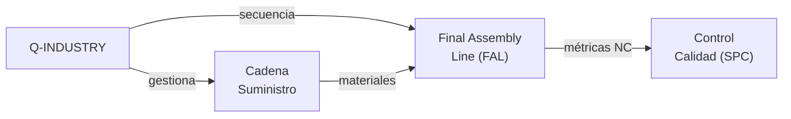

# Q-INDUSTRY — Fabricación, Ensamblaje y Producción
> *De la materia prima al avión certificado: excelencia en manufactura avanzada y cadena de valor europea.*

**Identificador:** GQAOA-ORG-QDIV-Q-INDUSTRY-001
**Versión:** 1.0.0 · **Fecha:** 25 de abril de 2026 · **Estado:** α

---
## Glosario de Términos y Acrónimos

| Acrónimo / Término | Definición completa | Referencia externa |
|--------------------|--------------------|--------------------|
| **6-Sigma** | Metodología de mejora de calidad que busca reducir defectos a ≤ 3,4 por millón de oportunidades | [ASQ Six Sigma](https://asq.org/quality-resources/six-sigma) |
| **AOG** | *Aircraft on Ground* — situación en que una aeronave no puede operar por falta de pieza o intervención de mantenimiento | *(industria MRO)* |
| **BOM** | *Bill of Materials* — lista estructurada de materiales y componentes de un ensamblaje | *(PLM/ERP best practice)* |
| **CAPEX** | *Capital Expenditure* — inversión en activos fijos (maquinaria, robotización FAL) | *(finanzas corporativas)* |
| **DFA** | *Design for Assembly* — metodología para reducir el tiempo y complejidad de ensamblaje desde el diseño | *(Boothroyd Dewhurst DFA)* |
| **DFM** | *Design for Manufacturability* — metodología para incorporar requisitos de fabricabilidad desde las fases tempranas de diseño | *(Boothroyd Dewhurst DFM)* |
| **EASA Part 21G** | Subparte G del Reglamento EASA Part 21 — aprobación de organización de producción | [EASA Part 21](https://www.easa.europa.eu/en/document-library/regulations/regulation-eu-no-7482012) |
| **EASA Part 145** | Reglamento EASA de requisitos para organizaciones de mantenimiento aprobadas | [EASA Part 145](https://www.easa.europa.eu/en/document-library/regulations/regulation-eu-no-13212014) |
| **FAL** | *Final Assembly Line* — línea de ensamblaje final de la aeronave completa | *(industria aeroespacial)* |
| **Lean** | Filosofía de producción orientada a eliminar desperdicios (muda) y maximizar valor; derivada del Toyota Production System | [Lean Enterprise Institute](https://www.lean.org/) |
| **MPI** | *Manufacturing Process Instruction* — instrucción de trabajo que describe paso a paso un proceso de fabricación | [S1000D.net](https://www.s1000d.net/) |
| **MPS** | *Master Production Schedule* — plan maestro de producción que establece volúmenes y fechas de entrega | *(APICS/ASCM)* |
| **MRP** | *Material Requirements Planning* — sistema de planificación de necesidades de materiales basado en BOM y MPS | *(APICS/ASCM)* |
| **NC** | *Non-Conformance* — desviación respecto a un requisito especificado; gestionada con un registro NC y acción correctiva | *(AS9100D)* |
| **OGATA** | Código de dominio UTA 600–699 para robótica industrial; ver UTCS 600-10-10 para robots de ensamblaje | *(GQAOA UTA taxonomy)* |
| **REACH** | *Registration, Evaluation, Authorisation and Restriction of Chemicals* — reglamento UE nº 1907/2006 | [ECHA REACH](https://echa.europa.eu/regulations/reach/understanding-reach) |
| **ROI** | *Return on Investment* — indicador financiero de rentabilidad de una inversión | *(finanzas corporativas)* |
| **SPC** | *Statistical Process Control* — control estadístico de proceso mediante cartas de control (Shewhart, CUSUM) | [ASQ SPC](https://asq.org/quality-resources/statistical-process-control) |

---

## 1. Misión y Alcance

Q-INDUSTRY es la división técnica responsable de la planificación, ejecución y control de todos los procesos de fabricación, ensamblaje y producción del programa GQAOA. Su alcance cubre desde la ingeniería de producción (DFM/DFA[^1]) hasta la aprobación de la organización de producción conforme a EASA Part 21G[^2] y Part 145, incluyendo la gestión de la cadena de suministro de nivel 1 y 2.

La división es propietaria de la Final Assembly Line (FAL[^3]), del Manufacturing Process Instructions (MPIs[^4]), del sistema de control de calidad (SPC[^5]/NC) y de la cualificación de proveedores estratégicos. Q-INDUSTRY trabaja en estrecha colaboración con Q-STRUCTURES (especificaciones de materiales y tolerancias), Q-GREENTECH (procesos de sistemas de energía) y Q-GROUND (integración con GSE de producción).

---

## 2. Responsabilidades Clave

- **Ingeniería de producción (DFM/DFA):** Asegurar la fabricabilidad y la montabilidad del diseño; generación de Manufacturing Process Instructions (MPIs).
- **Final Assembly Line (FAL):** Planificación, secuenciación y control de la línea de ensamblaje final, incluyendo la integración de sistemas.
- **Control de calidad (QA/QC):** Implementación del sistema de control estadístico de proceso (SPC), gestión de no conformidades y AOG (Aircraft on Ground) decisions.
- **Aprobación Part 21G / Part 145:** Obtención y mantenimiento de la aprobación EASA de organización de producción y de mantenimiento en base.
- **Gestión de la cadena de suministro:** Cualificación, seguimiento y auditoría de proveedores de nivel 1 y 2; gestión de riesgos de suministro.
- **Planificación MPS/MRP:** Desarrollo y mantenimiento del Master Production Schedule y Material Requirements Planning.
- **Automatización y robótica:** Integración de sistemas de fabricación automatizada (robots de ensamblaje, células automatizadas) conforme a OGATA 600-609.
- **Lean Manufacturing y eficiencia:** Implementación de metodologías lean, six-sigma y mejora continua en todos los procesos de producción.

---

## 3. Entregables Clave

| ID | Descripción | Tipo | Estado |
|----|-------------|------|--------|
| Q-INDUSTRY-01-MPS-MASTER.xlsx | Master Production Schedule — planificación de producción a 5 años | XLSX | α |
| Q-INDUSTRY-02-FAL-SEQUENCE-PLAN.md | Plan de secuenciación de la Final Assembly Line (FAL) | MD | α |
| Q-INDUSTRY-03-MPI-SET.xml | Set de Manufacturing Process Instructions (S1000D XML) | XML | β |
| Q-INDUSTRY-04-QUALITY-PLAN.md | Plan de Calidad de Producción (QAP) — SPC, inspección, NC | MD | α |
| Q-INDUSTRY-05-SUPPLIER-QUAL-MATRIX.xlsx | Matriz de cualificación de proveedores nivel 1 y 2 | XLSX | α |
| Q-INDUSTRY-06-PART21G-APPROVAL-DOSSIER.md | Dossier de aprobación organización de producción (Part 21G) | MD | β |
| Q-INDUSTRY-07-AUTOMATION-SPEC.md | Especificación de sistemas de fabricación automatizada (robots) | MD | β |

---

## 4. RACI de Dominio

| Actividad | Q-INDUSTRY Lead | Co-Q-Divisions (C) | ORB Support (C/I) |
|-----------|----------------|-------------------|-------------------|
| Master Production Schedule (MPS) | **A**/R | Q-STRUCTURES (C), Q-GREENTECH (C) | ORB-PROC (C), ORB-FIN (C) |
| Ingeniería de producción (DFM/DFA) | **A**/R | Q-STRUCTURES (R), Q-MECHANICS (C) | ORB-PMO (I) |
| Final Assembly Line (FAL) | **A**/R | Q-MECHANICS (R), Q-GROUND (R) | ORB-PROC (C) |
| Control de calidad (SPC/NC) | **A**/R | Q-STRUCTURES (C), Q-SCIRES (C) | ORB-LEG (C) |
| Cualificación de proveedores | **A**/R | Q-GREENTECH (C), Q-STRUCTURES (C) | ORB-PROC (C), ORB-LEG (C) |
| Aprobación Part 21G/Part 145 | **A**/R | Q-DATAGOV (R), Q-SCIRES (C) | ORB-LEG (C) |
| Automatización FAL (robots OGATA 600) | **A**/R | Q-HPC (C), Q-MECHANICS (C) | ORB-IT (C) |
| Gestión de no conformidades (NC) | **A**/R | Q-STRUCTURES (C), Q-SCIRES (C) | ORB-LEG (C), ORB-PMO (I) |

---

## 5. Interfaces Clave

### Con otras Q-Divisions

| Q-Division | Qué se intercambia | Dirección |
|------------|-------------------|-----------|
| Q-STRUCTURES | Especificaciones de materiales, tolerancias de fabricación, DFM feedback | Bidireccional |
| Q-MECHANICS | Procedimientos de instalación de actuadores, tuberías, sistemas mecánicos | Q-MECH → Q-IND |
| Q-GREENTECH | Procesos de fabricación de packs de baterías y sistemas H₂ | Bidireccional |
| Q-GROUND | Integración FAL con GSE de producción; entrega de aeronave al cliente | Q-IND → Q-GROUND |
| Q-SCIRES | Inspección de componentes; ensayos de aceptación de producción | Bidireccional |
| Q-DATAGOV | Publicación de MPIs y work instructions en CSDB | Q-IND → Q-DATAGOV |

### Con unidades ORB

| ORB Unit | Naturaleza de la interacción |
|----------|------------------------------|
| ORB-PROC | Gestión de contratos con proveedores; cualificación y auditoría de proveedores |
| ORB-FIN | Presupuesto de producción; control de CAPEX en equipos de FAL; ROI robótica |
| ORB-LEG | Cumplimiento Part 21G/145, REACH, normativa laboral de fabricación |
| ORB-HR | Formación en fabricación avanzada, certificación de operarios |
| ORB-PMO | Seguimiento de cadencia de producción vs. cronograma maestro |

---

## 6. KPIs del Dominio

| KPI | Objetivo | Fuente |
|-----|----------|--------|
| Takt time FAL (tiempo entre aviones entregados) | ≤ 4 aviones/mes en producción pico | Q-INDUSTRY-01-MPS-MASTER |
| Tasa de no conformidades en FAL (NCs/aeronave) | ≤ 5 NCs mayor por aeronave | Q-INDUSTRY-04-QUALITY-PLAN |
| On-time delivery de proveedores nivel 1 | ≥ 95% | Q-INDUSTRY-05-SUPPLIER-QUAL-MATRIX |
| Cobertura de automatización en operaciones FAL | ≥ 60% de operaciones por robot | Q-INDUSTRY-07-AUTOMATION-SPEC |
| Primer vuelo sin AOG por causa de producción | 0 AOGs post-entrega año 1 | Q-INDUSTRY-04-QUALITY-PLAN |

---

## 7. Riesgos Específicos

| Riesgo | Impacto | Probabilidad | Mitigación |
|--------|---------|--------------|------------|
| Retraso en obtención de aprobación Part 21G por EASA | Alto | Media | Engagement temprano con EASA; auditorías de preparación (mock audit) con ORB-LEG |
| Ruptura de cadena de suministro de materiales compuestos | Alto | Media | Inventario de seguridad; dual-sourcing para materiales críticos |
| Defectos de fabricación en packs de baterías HV | Crítico | Baja | Celdas de prueba destructiva por lote; inspección 100% por rayos X |
| Insuficiencia de personal cualificado para compuestos CFRP | Medio | Alta | Programa de formación con ORB-HR; partnerships con escuelas de FP aeroespacial |

---

## 8. Referencias

### Internas
- [Matriz RACI Maestra Q-Divisions](../Readme.md)
- [Documento Organizacional Maestro GQAOA](../../README.md)
- [AMPEL360-BWB-Q100 Docs](../../../programs/AMPEL360/AMPEL360-BWB-Q100/Docs/readme.md)
- [Robbbo-T Robotics PRD (OGATA 600)](../../../programs/Robbbo-T_Robotics_PRD/Readme.md)

### Externas — Normativa y Estándares
| Referencia | Descripción | Enlace |
|-----------|-------------|--------|
| EASA Part 21 (EU) 748/2012 | Airworthiness and Environmental Certification | [easa.europa.eu](https://www.easa.europa.eu/en/document-library/regulations/regulation-eu-no-7482012) |
| EASA Part 145 (EU) 1321/2014 | Approved Maintenance Organisations | [easa.europa.eu](https://www.easa.europa.eu/en/document-library/regulations/regulation-eu-no-13212014) |
| AS9100D | Quality Management Systems — Aviation, Space | [sae.org](https://www.sae.org/standards/content/as9100d/) |
| ECHA REACH | Regulation (EC) No 1907/2006 | [echa.europa.eu](https://echa.europa.eu/regulations/reach/understanding-reach) |
| Lean Enterprise Institute | Lean manufacturing resources | [lean.org](https://www.lean.org/) |
| ASQ Six Sigma | Six Sigma methodology | [asq.org](https://asq.org/quality-resources/six-sigma) |
| S1000D | Technical documentation for MPI/WI | [s1000d.net](https://www.s1000d.net/) |

## Notas

[^1]: **DFM/DFA** (Design for Manufacturability / Design for Assembly): metodología que incorpora requisitos de fabricabilidad y ensamblaje desde las primeras fases de diseño para reducir costes y defectos de producción.
[^2]: **Part 21G** (EASA): reglamento europeo que define los requisitos para la aprobación de organizaciones de producción de aeronaves y componentes aeronáuticos; equivalente a FAA Production Approval Holder (PAH).
[^3]: **FAL** (Final Assembly Line): instalación y proceso de integración final de todos los componentes y sistemas de la aeronave hasta obtener el avión completo listo para los vuelos de aceptación.
[^4]: **MPI** (Manufacturing Process Instruction): instrucción detallada de trabajo que describe paso a paso un proceso de fabricación específico; en GQAOA se publica conforme a S1000D.
[^5]: **SPC** (Statistical Process Control): metodología de control de calidad que usa técnicas estadísticas (cartas de control, capacidad de proceso Cp/Cpk) para monitorizar y controlar procesos de fabricación.

**[FIN DEL DOCUMENTO]**
