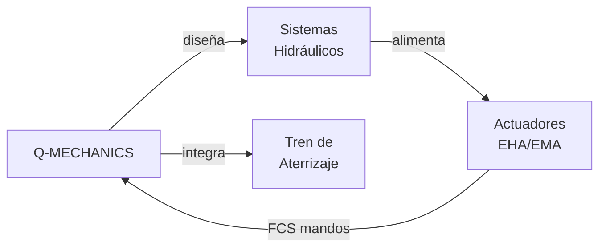

# Q-MECHANICS — Hidráulica, Actuadores y Sistemas Mecánicos
> *El músculo de la aeronave: actuadores de alta precisión, sistemas hidráulicos y mecánica de misión crítica.*

**Identificador:** GQAOA-ORG-QDIV-Q-MECHANICS-001
**Versión:** 1.0.0 · **Fecha:** 25 de abril de 2026 · **Estado:** α

---
## Glosario de Términos y Acrónimos

| Acrónimo / Término | Definición completa | Referencia externa |
|--------------------|--------------------|--------------------|
| **ARP4754A** | *Guidelines for Development of Civil Aircraft and Systems* — guía SAE para el desarrollo de sistemas aeronáuticos complejos | [SAE ARP4754A](https://www.sae.org/standards/content/arp4754a/) |
| **ARP4761** | *Guidelines and Methods for Conducting the Safety Assessment Process* — metodología SAE para evaluación de seguridad (FHA, PSSA, SSA, FTA, FMECA) | [SAE ARP4761](https://www.sae.org/standards/content/arp4761/) |
| **CS-25 Subpart C** | Sección de CS-25 relativa a estructura; requisitos de cargas, fatiga y damage tolerance | [EASA CS-25](https://www.easa.europa.eu/en/document-library/certification-specifications/cs-25-amendment-28) |
| **CS-25 Subpart F** | Sección de CS-25 relativa a equipos y sistemas; incluye requisitos del tren de aterrizaje | [EASA CS-25](https://www.easa.europa.eu/en/document-library/certification-specifications/cs-25-amendment-28) |
| **CS-25 Subpart G** | Sección de CS-25 relativa a mandos de vuelo; incluye requisitos de FCS y actuadores | [EASA CS-25](https://www.easa.europa.eu/en/document-library/certification-specifications/cs-25-amendment-28) |
| **DAL** | *Design Assurance Level* — niveles A–E de criticidad de diseño según DO-178C/DO-254/ARP4754A | [SAE ARP4754A](https://www.sae.org/standards/content/arp4754a/) |
| **EHA** | *Electro-Hydrostatic Actuator* — actuador autocontenido motor eléctrico + bomba hidráulica + cilindro | *(Parker / Moog EHA technology)* |
| **EMA** | *Electro-Mechanical Actuator* — actuador de accionamiento directo por motor eléctrico y tornillo de bolas | *(Parker / Moog EMA technology)* |
| **FCS** | *Flight Control System* — sistema de control de vuelo, incluyendo actuadores de superficies primarias y secundarias | *(interno GQAOA)* |
| **FH** | *Flight Hours* — horas de vuelo; unidad para tasas de fallo (p.ej., ≤ 10⁻⁹ eventos catastrófico/FH) | *(CS-25 §25.1309)* |
| **FMECA** | *Failure Modes, Effects and Criticality Analysis* — extensión del FMEA con evaluación de criticidad | [MIL-STD-1629A](https://www.everyspec.com/MIL-STD/MIL-STD-1600-1699/MIL-STD-1629A_14167/) |
| **FTA** | *Fault Tree Analysis* — análisis de árbol de fallos para determinar la probabilidad de un evento top | [IEC 61025](https://webstore.iec.ch/publication/4311) |
| **HAZOP** | *Hazard and Operability Study* — técnica sistemática de identificación de riesgos en sistemas de proceso | [IEC 61882](https://webstore.iec.ch/publication/6047) |
| **MDO** | *Multidisciplinary Design Optimization* — optimización simultánea de tren, estructura, peso y aerodinámica | [AIAA MDO](https://arc.aiaa.org/doi/10.2514/1.J058993) |
| **NWS** | *Nose Wheel Steering* — sistema de dirección de la rueda de nariz para maniobras en tierra | *(CS-25 §25.745)* |
| **TPIS** | *Tyre Pressure Indication System* — sistema de indicación de presión de neumáticos del tren de aterrizaje | *(CS-25 AMC 25.729)* |

---

## 1. Misión y Alcance

Q-MECHANICS es la división técnica responsable del diseño, integración y certificación de todos los sistemas mecánicos y de actuación de la aeronave GQAOA, incluyendo los sistemas hidráulicos, los actuadores electromecánicos (EMA[^1]) y electrohidrostáticos (EHA[^2]) del FCS, los sistemas del tren de aterrizaje, el sistema de puertas y el sistema de escape de emergencia. Su alcance cubre también los sistemas de frenado, dirección y maniobra en tierra.

La división actúa como el nexo entre las necesidades aerodinámicas (Q-AIR) y la ejecución física de los mandos de vuelo, garantizando que los actuadores del FCS cumplan con los requisitos de fuerza, deflexión, velocidad y redundancia establecidos conforme a CS-25 y al nivel de aseguramiento de diseño DAL[^3]. La arquitectura de redundancia de los sistemas hidráulicos debe alcanzar una probabilidad de pérdida total ≤ 10⁻⁹/FH[^4] según FMECA[^5].

---

## 2. Responsabilidades Clave

- **Sistemas hidráulicos:** Diseño, análisis y certificación de los sistemas hidráulicos de la aeronave (3,000/5,000 psi), incluyendo generación, distribución, acumuladores y sistemas de emergencia.
- **Actuadores FCS:** Diseño y cualificación de los Electro-Hydrostatic Actuators (EHA) y Electro-Mechanical Actuators (EMA) para superficies de control primarias y secundarias.
- **Tren de aterrizaje:** Diseño e integración del sistema de tren de aterrizaje principal y de nariz, incluyendo extensión/retracción, amortiguadores, frenos y sistema TPIS.
- **Sistemas de puertas y escotillas:** Diseño mecánico de puertas de pasajeros, emergencia, cargo y escotillas de acceso, incluyendo mecanismos de bloqueo y sistemas de apertura de emergencia.
- **Sistemas de frenado y dirección:** Especificación e integración del sistema de frenos de carbono/electromecánico y del sistema de dirección de nariz (NWS).
- **Gestión de fluidos y sellados:** Definición de especificaciones de fluidos hidráulicos, sellados, tuberías y accesorios para las condiciones ambientales del ciclo de vida.
- **Redundancia y seguridad (DAL):** Garantizar la arquitectura redundante requerida por CS-25 para todos los sistemas de control de vuelo y críticos de seguridad.
- **Integración en estructura:** Coordinación con Q-STRUCTURES para el paso de tuberías, instalación de actuadores y gestión de las cargas de reacción.

---

## 3. Entregables Clave

| ID | Descripción | Tipo | Estado |
|----|-------------|------|--------|
| Q-MECHANICS-01-HYD-SYS-SPEC.md | Especificación del sistema hidráulico (generación, distribución, emergencia) | MD | α |
| Q-MECHANICS-02-FCS-ACTUATOR-SPEC.xlsx | Especificación de actuadores FCS (EHA/EMA) — fuerza, velocidad, redundancia | XLSX | α |
| Q-MECHANICS-03-LANDING-GEAR-SPEC.md | Especificación del sistema de tren de aterrizaje (principal y nariz) | MD | β |
| Q-MECHANICS-04-DOORS-SPEC.md | Especificación de sistemas de puertas y escotillas | MD | β |
| Q-MECHANICS-05-BRAKE-NWS-SPEC.md | Especificación de sistema de frenos y dirección de nariz | MD | β |
| Q-MECHANICS-06-FMECA-MECHANICAL.xlsx | FMECA de sistemas mecánicos críticos (DAL A/B) | XLSX | β |
| Q-MECHANICS-07-HYDRAULIC-TEST-PLAN.md | Plan de ensayos de sistemas hidráulicos (rig test + integración) | MD | β |

---

## 4. RACI de Dominio

| Actividad | Q-MECHANICS Lead | Co-Q-Divisions (C) | ORB Support (C/I) |
|-----------|-----------------|-------------------|-------------------|
| Diseño sistema hidráulico | **A**/R | Q-GREENTECH (C), Q-AIR (C) | ORB-PMO (I) |
| Especificación actuadores FCS | **A**/R | Q-AIR (R), Q-STRUCTURES (C) | ORB-LEG (I) |
| Sistema tren de aterrizaje | **A**/R | Q-STRUCTURES (C), Q-SCIRES (C) | ORB-LEG (C) |
| FMECA sistemas mecánicos | **A**/R | Q-SCIRES (R), Q-AIR (C) | ORB-LEG (C) |
| Ensayos rig de sistemas mecánicos | **A**/R | Q-SCIRES (R), Q-INDUSTRY (C) | ORB-PMO (I) |
| Integración actuadores en estructura | **A**/R | Q-STRUCTURES (R), Q-INDUSTRY (C) | ORB-PMO (I) |
| Sistemas de puertas y emergencia | **A**/R | Q-STRUCTURES (C), Q-SCIRES (C) | ORB-LEG (C) |
| Electrificación de sistemas (EMA/EHA) | **A**/R | Q-GREENTECH (R), Q-AIR (C) | ORB-PMO (I) |

---

## 5. Interfaces Clave

### Con otras Q-Divisions

| Q-Division | Qué se intercambia | Dirección |
|------------|-------------------|-----------|
| Q-AIR | Requisitos de fuerza/velocidad/deflexión de actuadores FCS; cargas de reacción | Q-AIR → Q-MECH |
| Q-GREENTECH | Especificaciones eléctricas de alimentación de actuadores EHA/EMA; gestión térmica | Bidireccional |
| Q-STRUCTURES | Instalación de actuadores; cargas de reacción en estructura; paso de tuberías | Bidireccional |
| Q-INDUSTRY | Procesos de fabricación e instalación de sistemas mecánicos en FAL | Q-MECH → Q-IND |
| Q-GROUND | Procedimientos de mantenimiento de sistemas mecánicos; GSE especializado (jacks, rigs) | Q-MECH → Q-GROUND |
| Q-SCIRES | Ensayos de cualificación de actuadores; FMECA y FTA de sistemas mecánicos | Bidireccional |

### Con unidades ORB

| ORB Unit | Naturaleza de la interacción |
|----------|------------------------------|
| ORB-LEG | Cumplimiento CS-25 Subpart F/G (tren de aterrizaje, mandos de vuelo); DAL requirements |
| ORB-PROC | Cualificación de proveedores de actuadores, tuberías hidráulicas y fluidos |
| ORB-PMO | Hitos de congelado de baseline mecánico; cronograma de ensayos de rig |
| ORB-FIN | Presupuesto de ensayos mecánicos; CAPEX en instalaciones de rig de actuadores |

---

## 6. KPIs del Dominio

| KPI | Objetivo | Fuente |
|-----|----------|--------|
| Pérdida de potencia hidráulica total (FMECA) | Probabilidad ≤ 10⁻⁹ /FH | Q-MECHANICS-06-FMECA-MECHANICAL |
| Tiempo de extensión del tren de aterrizaje (gravedad libre) | ≤ 10 segundos | Q-MECHANICS-03-LANDING-GEAR-SPEC |
| Eficiencia energética EHA vs. sistema hidráulico convencional | ≥ 20% de ahorro energético | Q-MECHANICS-02-FCS-ACTUATOR-SPEC |
| Cobertura FMECA sistemas mecánicos DAL A/B | 100% | Q-MECHANICS-06-FMECA-MECHANICAL |
| Presión operativa del sistema hidráulico principal | 5,000 psi (345 bar) ±2% | Q-MECHANICS-01-HYD-SYS-SPEC |

---

## 7. Riesgos Específicos

| Riesgo | Impacto | Probabilidad | Mitigación |
|--------|---------|--------------|------------|
| Fallo de actuador EHA durante fase de pruebas en vuelo | Crítico | Baja | Redundancia triple (3× EHA por superficie); FTA riguroso desde diseño conceptual |
| Incompatibilidad de fluido hidráulico nuevo con materiales de sellado | Medio | Media | Ensayos de compatibilidad de materiales por Q-SCIRES antes de congelado de baseline |
| Peso excesivo del sistema de tren de aterrizaje en arquitectura BWB | Alto | Media | MDO temprano de integración tren-estructura con Q-STRUCTURES |
| Retraso en cualificación de actuadores EMA de alta potencia | Alto | Media | Proveedores alternativos pre-cualificados; desarrollo paralelo de prototipos |

---

## 8. Referencias

### Internas
- [Matriz RACI Maestra Q-Divisions](../Readme.md)
- [Documento Organizacional Maestro GQAOA](../../README.md)
- [AMPEL360-BWB-Q100 Docs](../../../programs/AMPEL360/AMPEL360-BWB-Q100/Docs/readme.md)
- [CSDB S1000D Validator](../../../CSDB/s1000d_validator.py)

### Externas — Normativa y Estándares
| Referencia | Descripción | Enlace |
|-----------|-------------|--------|
| EASA CS-25 Amdt. 28 | Subparts F & G — Systems & FCS requirements | [easa.europa.eu](https://www.easa.europa.eu/en/document-library/certification-specifications/cs-25-amendment-28) |
| SAE ARP4761 | Safety Assessment Process — FTA/FMECA | [sae.org](https://www.sae.org/standards/content/arp4761/) |
| SAE ARP4754A | Development of Civil Aircraft and Systems | [sae.org](https://www.sae.org/standards/content/arp4754a/) |
| MIL-STD-1629A | Failure Mode, Effects and Criticality Analysis | [everyspec.com](https://www.everyspec.com/MIL-STD/MIL-STD-1600-1699/MIL-STD-1629A_14167/) |
| IEC 61025 | Fault Tree Analysis | [iec.ch](https://webstore.iec.ch/publication/4311) |
| IEC 61882 | Hazard and Operability Studies (HAZOP) | [iec.ch](https://webstore.iec.ch/publication/6047) |

## Notas

[^1]: **EMA** (Electro-Mechanical Actuator): actuador en el que un motor eléctrico acciona directamente la superficie de control a través de un mecanismo de tornillo de bolas o similar, eliminando la necesidad de circuito hidráulico local.
[^2]: **EHA** (Electro-Hydrostatic Actuator): actuador que integra motor eléctrico, bomba hidráulica reversible y cilindro hidráulico en una unidad compacta autocontenida, combinando la potencia de la hidráulica con el control eléctrico.
[^3]: **DAL** (Design Assurance Level): niveles A–E que determinan el rigor del proceso de diseño y verificación en función de la severidad del efecto de fallo del sistema; definido en ARP4761/ARP4754A y DO-178C/DO-254.
[^4]: **FH** (Flight Hours): horas de vuelo; unidad de medida estándar para expresar tasas de fallo en sistemas aeronáuticos (p. ej., probabilidad de fallo catastrófico ≤ 10⁻⁹ eventos por hora de vuelo).
[^5]: **FMECA** (Failure Modes, Effects and Criticality Analysis): extensión del FMEA que añade el análisis de criticidad para priorizar los modos de fallo según su probabilidad e impacto en la seguridad.

**[FIN DEL DOCUMENTO]**
