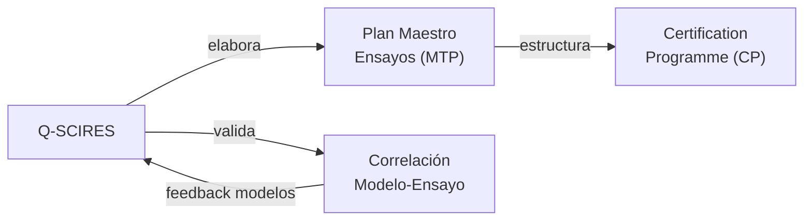

# Q-SCIRES — Investigación Científica, Ensayos y Certificación
> *La conciencia técnica del programa: de la investigación fundamental a la certificación regulatoria.*

**Identificador:** GQAOA-ORG-QDIV-Q-SCIRES-001
**Versión:** 1.0.0 · **Fecha:** 25 de abril de 2026 · **Estado:** α

---
## Glosario de Términos y Acrónimos

| Acrónimo / Término | Definición completa | Referencia externa |
|--------------------|--------------------|--------------------|
| **CIRA** | *Centro Italiano di Ricerche Aerospaziali* — centro de investigación aeroespacial italiano con túnel de viento y laboratorios de certificación | [CIRA](https://www.cira.it/) |
| **CRI** | *Certification Review Item* — ítem de revisión de certificación acordado con EASA/FAA para aspectos no convencionales | [EASA Certification](https://www.easa.europa.eu/en/document-library/type-certificates) |
| **CS-25** | *Certification Specifications for Large Aeroplanes* (EASA) — base de certificación para aviones de transporte | [EASA CS-25](https://www.easa.europa.eu/en/document-library/certification-specifications/cs-25-amendment-28) |
| **DLR** | *Deutsches Zentrum für Luft- und Raumfahrt* — centro alemán de investigación aeroespacial; socio clave en ensayos | [DLR](https://www.dlr.de/) |
| **EASA Part 21J** | Subparte J del Part 21 — requisitos para el titular del certificado de tipo (*TC Holder*) | [EASA Part 21](https://www.easa.europa.eu/en/document-library/regulations/regulation-eu-no-7482012) |
| **EUROCAE WG-114** | Grupo de trabajo EUROCAE sobre IA aplicada a la aviación; desarrolla guidance para V&V de IA aeronáutica | [EUROCAE WG-114](https://www.eurocae.net/news/posts/2019/october/eurocae-establishes-new-working-group-on-artificial-intelligence/) |
| **FAR-25** | *Federal Aviation Regulations Part 25* (FAA) | [FAR Part 25](https://www.ecfr.gov/current/title-14/chapter-I/subchapter-C/part-25) |
| **FHA** | *Functional Hazard Assessment* — evaluación funcional de peligros que clasifica fallos según severidad y probabilidad | [SAE ARP4761](https://www.sae.org/standards/content/arp4761/) |
| **FTP** | *Flight Test Programme* — programa de ensayos en vuelo con hitos, campañas y aeronaves de prueba | *(EASA / FAA Flight Test guidance)* |
| **GVT** | *Ground Vibration Test* — ensayo modal en tierra para caracterizar modos propios y validar modelo FEM | *(aerospace SE practice)* |
| **MoC** | *Means of Compliance* — método de demostración de cumplimiento de un requisito regulatorio | [EASA AMC/GM](https://www.easa.europa.eu/) |
| **MTP** | *Master Test Plan* — plan maestro que integra todas las campañas de ensayo del programa | *(SE best practice)* |
| **ONERA** | *Office national d'études et de recherches aérospatiales* — agencia de investigación aeroespacial francesa | [ONERA](https://www.onera.fr/) |
| **PSSA** | *Preliminary System Safety Assessment* — evaluación preliminar de seguridad del sistema durante el diseño | [SAE ARP4761](https://www.sae.org/standards/content/arp4761/) |
| **SoI** | *Stage of Involvement* — reuniones periódicas entre EASA y el solicitante del TC para revisar el avance de certificación | [EASA Certification](https://www.easa.europa.eu/en/document-library/type-certificates) |
| **SSA** | *System Safety Assessment* — evaluación de seguridad del sistema que demuestra cumplimiento de CS-25 §25.1309 | [SAE ARP4761](https://www.sae.org/standards/content/arp4761/) |
| **TCDS** | *Type Certificate Data Sheet* — hoja de datos del certificado de tipo emitida por EASA o FAA | [EASA TCDS](https://www.easa.europa.eu/en/document-library/type-certificates) |
| **TRL** | *Technology Readiness Level* — escala de madurez tecnológica 1–9 (NASA/ESA) | [NASA TRL](https://www.nasa.gov/directorates/somd/space-communications-navigation-program/technology-readiness-levels/) |
| **V&V** | *Verification & Validation* — proceso dual que verifica corrección e implementación y valida necesidades del usuario | [IEEE 1012](https://standards.ieee.org/ieee/1012/5609/) |

---

## 1. Misión y Alcance

Q-SCIRES es la división técnica responsable de la investigación científica aplicada, la gestión del programa de ensayos del programa GQAOA y la coordinación de todo el proceso de certificación de tipo con las autoridades reguladoras (EASA, FAA). Su alcance cubre desde la investigación de tecnologías en TRL[^1] bajo (TRL 1–3), la ejecución de campañas de ensayo (túnel de viento, ensayos estructurales, vuelos de prueba), hasta la generación del compliance summary y la coordinación del Type Certificate Data Sheet (TCDS[^2]).

Q-SCIRES actúa como el árbitro técnico independiente del programa, validando que los productos de las demás Q-Divisions cumplen los requisitos de certificación aplicables, y como la división enlace con las autoridades de aeronavegabilidad para todos los CRI[^3] (Certification Review Items) y MoC[^4] (Means of Compliance). La metodología de V&V[^5] para software y algoritmos cuánticos es una responsabilidad emergente clave de esta división.

---

## 2. Responsabilidades Clave

- **Investigación aplicada (TRL 1–4):** Gestión de proyectos de investigación fundamental y aplicada en materiales, aerodinámica, propulsión y sistemas cuánticos; coordinación con universidades y centros de I+D.
- **Plan maestro de ensayos (MTP):** Elaboración, mantenimiento y coordinación del Master Test Plan del programa, incluyendo todos los tipos de ensayos y campañas.
- **Ensayos de certificación:** Ejecución de ensayos estructurales de certificación (ultimate load, fatiga), ensayos de vuelo, ensayos medioambientales y de compatibilidad electromagnética.
- **Correlación modelo-ensayo:** Validación de modelos FEM, CFD y de sistemas mediante correlación con datos experimentales; generación de los model correlation reports.
- **Proceso de certificación (Part 21J):** Coordinación de la Certification Programme (CP), Stage of Involvement (SoI) meetings, y gestión de CRIs con EASA.
- **Means of Compliance (MoC):** Definición y justificación de los medios de cumplimiento para cada requisito CS-25/FAR-25 aplicable.
- **Verificación de algoritmos cuánticos y IA:** Definición del proceso de V&V para algoritmos de IA y cuánticos embarcados, en coordinación con Q-HPC.
- **Gestión de la base de evidencias de certificación:** Custodia de todos los informes de ensayo, correlation reports y compliance documents en el CSDB (con Q-DATAGOV).

---

## 3. Entregables Clave

| ID | Descripción | Tipo | Estado |
|----|-------------|------|--------|
| Q-SCIRES-01-MTP-MASTER.md | Plan Maestro de Ensayos (Master Test Plan) del programa | MD | α |
| Q-SCIRES-02-CERT-PROGRAMME.md | Certification Programme (CP) — CRI list, SoI, MoC matrix | MD | α |
| Q-SCIRES-03-COMPLIANCE-SUMMARY.xlsx | Compliance Summary Matrix (CS-25 / FAR-25) | XLSX | β |
| Q-SCIRES-04-STRUCT-TEST-REPORT.pdf | Informe de ensayos estructurales de certificación | PDF | β |
| Q-SCIRES-05-FLIGHT-TEST-PLAN.md | Plan de ensayos en vuelo (Flight Test Programme) | MD | β |
| Q-SCIRES-06-MODEL-CORRELATION.md | Informe de correlación modelo FEM/CFD vs. datos experimentales | MD | β |
| Q-SCIRES-07-AI-VV-FRAMEWORK.md | Marco de V&V para algoritmos de IA y sistemas cuánticos embarcados | MD | β |

---

## 4. RACI de Dominio

| Actividad | Q-SCIRES Lead | Co-Q-Divisions (C) | ORB Support (C/I) |
|-----------|--------------|-------------------|-------------------|
| Plan maestro de ensayos (MTP) | **A**/R | Todas las Q-Divisions (C) | ORB-PMO (C), ORB-LEG (C) |
| Certification Programme (CP) | **A**/R | Q-DATAGOV (R), Q-AIR (C) | ORB-LEG (C), ORB-PMO (C) |
| Compliance Summary Matrix | **A**/R | Q-DATAGOV (R), Q-AIR (C) | ORB-LEG (C) |
| Ensayos estructurales (cert.) | **A**/R | Q-STRUCTURES (R), Q-INDUSTRY (C) | ORB-LEG (I), ORB-PMO (I) |
| Ensayos en vuelo | **A**/R | Q-AIR (R), Q-HPC (C) | ORB-LEG (C), ORB-PMO (C) |
| Correlación modelo-ensayo | **A**/R | Q-STRUCTURES (C), Q-HPC (C) | ORB-PMO (I) |
| V&V algoritmos IA/cuánticos | **A**/R | Q-HPC (R), Q-DATAGOV (C) | ORB-LEG (I) |
| ACV / certificación ESG | **A**/R | Q-GREENTECH (R), Q-DATAGOV (C) | ORB-CSR (C), ORB-LEG (C) |

---

## 5. Interfaces Clave

### Con otras Q-Divisions

| Q-Division | Qué se intercambia | Dirección |
|------------|-------------------|-----------|
| Q-AIR | Datos de ensayo en túnel de viento; correlación CFD-experimento; ensayos de vuelo | Bidireccional |
| Q-STRUCTURES | Plan de ensayos estructurales; datos de correlation report FEM | Bidireccional |
| Q-HPC | Plan de V&V de software y algoritmos cuánticos; correlación simulación-ensayo | Bidireccional |
| Q-GREENTECH | Datos de ensayo de baterías; certificación ACV/LCA; correlación modelos térmicos | Bidireccional |
| Q-DATAGOV | Custodia de evidencias de certificación en CSDB; compliance matrix | Q-SCIRES → Q-DATAGOV |
| Q-INDUSTRY | Inspección de aceptación de producción; first article inspection | Bidireccional |

### Con unidades ORB

| ORB Unit | Naturaleza de la interacción |
|----------|------------------------------|
| ORB-LEG | Comunicaciones con EASA/FAA; gestión de CRIs; asesoramiento regulatorio CS-25 |
| ORB-PMO | Integración del MTP en el cronograma maestro; gestión de recursos de ensayo |
| ORB-FIN | Presupuesto de campañas de ensayo (túnel de viento, fatiga, vuelo); ROI I+D |
| ORB-HR | Captación de investigadores y pilotos de prueba; certificación DER |

---

## 6. KPIs del Dominio

| KPI | Objetivo | Fuente |
|-----|----------|--------|
| Cobertura de requisitos CS-25 en Compliance Summary | 100% en First Flight | Q-SCIRES-03-COMPLIANCE-SUMMARY |
| Número de CRIs abiertos al cierre del programa de certificación | 0 CRIs de impacto crítico | Q-SCIRES-02-CERT-PROGRAMME |
| Correlación FEM vs. ensayo estático (δ máximo) | ≤ 5% de desviación en cargas críticas | Q-SCIRES-06-MODEL-CORRELATION |
| Horas de vuelo de prueba completadas (vs. plan) | ≥ 95% del FTP completado en plazo | Q-SCIRES-05-FLIGHT-TEST-PLAN |
| Publicaciones científicas indexadas por año | ≥ 5 publicaciones Q1/Q2 por año | Gestión interna I+D |

---

## 7. Riesgos Específicos

| Riesgo | Impacto | Probabilidad | Mitigación |
|--------|---------|--------------|------------|
| Retraso en obtención del Type Certificate por EASA | Crítico | Media | Certificación Basis Agreement (CBA) temprana; revisiones SoI periódicas con EASA |
| Fallo inesperado en ensayo de carga última (ultimate load test) | Crítico | Baja | Ensayos incrementales y de sub-componentes previos; análisis de sensibilidad FEM |
| Insuficiencia de medios experimentales (túnel de viento, laboratorios) | Alto | Media | Acuerdos con ONERA, DLR y CIRA para capacidad de ensayo; programa de reserva |
| Ausencia de marco regulatorio EASA para IA embarcada DO-178C | Medio | Alta | Participación activa en EUROCAE WG-114; marco V&V conservador interno |

---

## 8. Referencias

### Internas
- [Matriz RACI Maestra Q-Divisions](../Readme.md)
- [Documento Organizacional Maestro GQAOA](../../README.md)
- [AMPEL360-BWB-Q100 Docs](../../../programs/AMPEL360/AMPEL360-BWB-Q100/Docs/readme.md)
- [CSDB S1000D Validator](../../../CSDB/s1000d_validator.py)

### Externas — Normativa y Estándares
| Referencia | Descripción | Enlace |
|-----------|-------------|--------|
| EASA Part 21 (EU) 748/2012 | Type Certification (Part 21 Subpart J) | [easa.europa.eu](https://www.easa.europa.eu/en/document-library/regulations/regulation-eu-no-7482012) |
| EASA CS-25 Amdt. 28 | Certification basis for large aeroplanes | [easa.europa.eu](https://www.easa.europa.eu/en/document-library/certification-specifications/cs-25-amendment-28) |
| SAE ARP4761 | Safety Assessment — FHA, PSSA, SSA | [sae.org](https://www.sae.org/standards/content/arp4761/) |
| SAE ARP4754A | Development of Civil Aircraft and Systems | [sae.org](https://www.sae.org/standards/content/arp4754a/) |
| EUROCAE WG-114 | AI in Aviation working group | [eurocae.net](https://www.eurocae.net/news/posts/2019/october/eurocae-establishes-new-working-group-on-artificial-intelligence/) |
| IEEE 1012-2016 | V&V for Systems, Software and Hardware | [ieee.org](https://standards.ieee.org/ieee/1012/5609/) |
| NASA TRL Scale | Technology Readiness Level definitions | [nasa.gov](https://www.nasa.gov/directorates/somd/space-communications-navigation-program/technology-readiness-levels/) |
| ONERA | French aerospace research centre | [onera.fr](https://www.onera.fr/) |
| DLR | German aerospace research centre | [dlr.de](https://www.dlr.de/) |
| CIRA | Italian aerospace research centre | [cira.it](https://www.cira.it/) |

## Notas

[^1]: **TRL** (Technology Readiness Level): escala de madurez tecnológica de 9 niveles definida originalmente por la NASA y adoptada por la ESA y la Comisión Europea; TRL 1 = principio básico observado, TRL 9 = sistema probado operacionalmente.
[^2]: **TCDS** (Type Certificate Data Sheet): documento oficial emitido por EASA o FAA que resume las características técnicas, limitaciones operativas y datos de configuración de una aeronave certificada.
[^3]: **CRI** (Certification Review Item): ítem específico de la base de certificación acordado bilateralmente entre el solicitante del TC y la autoridad reguladora (EASA/FAA) para tratar aspectos no cubiertos directamente por los CS/FAR aplicables.
[^4]: **MoC** (Means of Compliance): método o conjunto de evidencias (análisis, ensayo, demostración, inspección) que el solicitante propone a la autoridad para demostrar el cumplimiento de un requisito de certificación.
[^5]: **V&V** (Verification & Validation): proceso dual de ingeniería de sistemas que verifica que el producto se construyó correctamente (cumple especificaciones) y valida que el producto correcto fue construido (cumple necesidades del usuario).

**[FIN DEL DOCUMENTO]**
