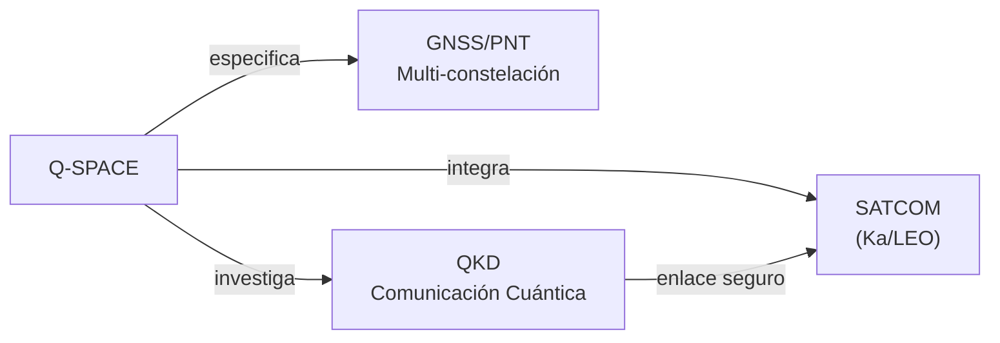
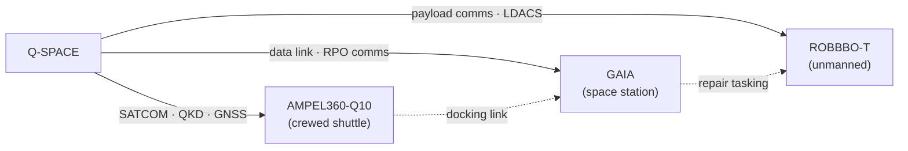

# Q-SPACE — Sistemas Satelitales, Espacio y Comunicaciones
> *El nexo entre el cielo y el espacio: comunicaciones de misión crítica, satélites y conectividad cuántica.*

**Identificador:** GQAOA-ORG-QDIV-Q-SPACE-001
**Versión:** 1.0.0 · **Fecha:** 25 de abril de 2026 · **Estado:** α

---
## Glosario de Términos y Acrónimos

| Acrónimo / Término | Definición completa | Referencia externa |
|--------------------|--------------------|--------------------|
| **AMPEL360-Q10** | Lanzadera tripulada del programa OPT-INS Space SIM; diseñada para viaje espacial y turismo orbital. Instancia `OPT-IN_FRAMEWORK` propia | *(AEROSPACEMODEL-OPT-INS-001)* |
| **GAIA** | Programa OPT-INS de estaciones espaciales y hábitats para habitación humana orbital y en espacio profundo | *(AEROSPACEMODEL-OPT-INS-001)* |
| **ROBBBO-T** | Plataformas no tripuladas OPT-INS para misiones COMMS, SAT, REPAIR y eliminación de debris (DEBRIS removal) | *(AEROSPACEMODEL-OPT-INS-001)* |
| **ACARS** | *Aircraft Communications Addressing and Reporting System* — sistema de enlace de datos aeronáuticos voz/texto | [ARINC 618](https://www.aviation-ia.com/arinc) |
| **ADS-B** | *Automatic Dependent Surveillance–Broadcast* — sistema de vigilancia basado en GNSS que difunde posición e identidad | [ICAO Doc 9871](https://www.icao.int/) |
| **ATM** | *Air Traffic Management* — gestión del tráfico aéreo; en Europa gestionada por EUROCONTROL/SESAR | [EUROCONTROL](https://www.eurocontrol.int/) |
| **DO-160G** | Condiciones ambientales y procedimientos de ensayo para equipos aeronáuticos embarcados | [RTCA DO-160G](https://www.rtca.org/products/do-160/) |
| **EASA Part 21** | Requisitos EASA para diseño, producción y certificación de aeronaves; incluye aprobación de equipos | [EASA Part 21](https://www.easa.europa.eu/en/document-library/regulations/regulation-eu-no-7482012) |
| **ED-202A** | Equivalente EUROCAE al DO-326A — ciberseguridad de sistemas aeronáuticos | [EUROCAE](https://www.eurocae.net/) |
| **EMC** | *Electromagnetic Compatibility* — capacidad de equipos para funcionar en su entorno sin causar ni sufrir interferencias | [IEC 61000](https://www.iec.ch/emc) |
| **EMI** | *Electromagnetic Interference* — perturbación electromagnética que afecta al funcionamiento de un equipo | [IEC 61000](https://www.iec.ch/emc) |
| **EUROCAE** | *European Organisation for Civil Aviation Equipment* — organismo normativo europeo de aviónica | [EUROCAE](https://www.eurocae.net/) |
| **GEO** | *Geostationary Earth Orbit* — órbita a ≈ 35 786 km; los satélites GEO parecen estacionarios desde tierra | *(orbital mechanics)* |
| **GNSS** | *Global Navigation Satellite System* — sistemas de satélites de navegación (GPS, Galileo, GLONASS, BeiDou) | [ESA Galileo](https://www.euspa.europa.eu/european-space/galileo) |
| **HIRF** | *High Intensity Radiated Fields* — ensayo de resistencia de la aeronave a campos electromagnéticos de alta intensidad | [CS-25 §25.1317](https://www.easa.europa.eu/en/document-library/certification-specifications/cs-25-amendment-28) |
| **ITU** | *International Telecommunication Union* — agencia ONU para regulación del espectro radioeléctrico | [ITU](https://www.itu.int/) |
| **LDACS** | *L-band Digital Aeronautical Communications System* — sistema de comunicaciones digitales aeronáuticas de banda L (sustituto de VHF) | [EUROCONTROL LDACS](https://www.eurocontrol.int/ldacs) |
| **LEO** | *Low Earth Orbit* — órbita a 160–2 000 km; usada por constelaciones de satélites de baja latencia (Starlink, OneWeb) | [ESA Space Debris](https://www.esa.int/Space_Safety/Space_Debris) |
| **NOC** | *Network Operations Center* — centro de operaciones de red que monitoriza y gestiona la infraestructura de comunicaciones | *(telecomunicaciones)* |
| **PBN** | *Performance-Based Navigation* — concepto ICAO que define requisitos de rendimiento de navegación | [ICAO Doc 9613](https://www.icao.int/NACC/Documents/Meetings/2014/RNPARSM/RT-PBN-i2.pdf) |
| **QKD** | *Quantum Key Distribution* — protocolo criptográfico cuántico de distribución de claves teóricamente irrompible | [ETSI QKD](https://www.etsi.org/technologies/quantum-key-distribution) |
| **RTCA** | *Radio Technical Commission for Aeronautics* — organismo de normalización aeronáutica de EE.UU. (equivalente a EUROCAE) | [RTCA](https://www.rtca.org/) |
| **SATCOM** | *Satellite Communications* — comunicaciones aeronáuticas vía satélite (GEO/LEO) para voz y datos | *(Inmarsat / Iridium / Starlink Aviation)* |
| **SESAR** | *Single European Sky ATM Research* — programa de modernización ATM europeo | [SESAR JU](https://www.sesarju.eu/) |
| **TRL** | *Technology Readiness Level* — madurez tecnológica 1–9 | [NASA TRL](https://www.nasa.gov/directorates/somd/space-communications-navigation-program/technology-readiness-levels/) |

---

## 1. Misión y Alcance

Q-SPACE es la división técnica responsable del diseño, integración y operación de todos los sistemas de comunicaciones aéreas vía satélite (SATCOM[^1]), enlaces de datos aeronáuticos (ACARS/ADS-B/Link 16), y sistemas de posicionamiento y navegación de precisión (GNSS/PNT[^2]) del programa GQAOA. Su alcance se extiende también a la integración de sistemas de comunicación cuántica (QKD[^3] — Quantum Key Distribution) y al soporte de la infraestructura del Continente Eternity (EC) para los enlaces espaciales.

Q-SPACE actúa como la división enlace entre las capacidades aeronáuticas y la infraestructura espacial europea, coordinando con Q-HPC (integración de QPU y QKD), Q-DATAGOV (ICDs de comunicaciones) y ORB-IT (infraestructura de tierra). La compatibilidad electromagnética (EMC/EMI[^4]) y los estándares PBN[^5] de ICAO son pilares de su proceso de certificación.

---

## 2. Responsabilidades Clave

- **Sistemas SATCOM aeronáuticos:** Diseño e integración de terminales SATCOM de banda Ka/Ku/LEO para comunicaciones de voz y datos de alta velocidad en vuelo.
- **Enlace de datos aeronáuticos:** Gestión de los sistemas ADS-B, ACARS, VHF/HF data link y LDACS para vigilancia y comunicaciones operacionales.
- **GNSS/PNT de precisión:** Integración de receptores GNSS multi-constelación (GPS/Galileo/GLONASS/BeiDou) con aumentación SBAS/GBAS para operaciones PBN.
- **Comunicaciones cuánticas (QKD):** Investigación e integración de canales QKD sobre infraestructura SATCOM para ciberseguridad de comunicaciones de misión crítica.
- **Compatibilidad electromagnética (EMC/EMI):** Responsable del plan de gestión de EMC/EMI para todos los sistemas de radiofrecuencia embarcados.
- **Interfaces con ATM (Air Traffic Management):** Integración con los sistemas de gestión del tráfico aéreo SESAR/NextGen; participación en estándares EUROCAE/RTCA.
- **Infraestructura de tierra de comunicaciones:** Coordinación con ORB-IT para las estaciones de tierra, NOC (Network Operations Center) y redundancia de comunicaciones.
- **Seguridad de comunicaciones:** Gestión de la seguridad de los enlaces de datos aeronáuticos conforme a ED-202A (ARINC 811) y normativa ICAO.

---

## 3. Entregables Clave

| ID | Descripción | Tipo | Estado |
|----|-------------|------|--------|
| Q-SPACE-01-SATCOM-SPEC.md | Especificación del sistema SATCOM aeronáutico (banda Ka/LEO) | MD | α |
| Q-SPACE-02-GNSS-PNT-SPEC.md | Especificación de sistemas GNSS/PNT multi-constelación | MD | α |
| Q-SPACE-03-QKD-INTEGRATION-PLAN.md | Plan de integración de comunicaciones cuánticas (QKD) | MD | β |
| Q-SPACE-04-EMC-PLAN.md | Plan de gestión de compatibilidad electromagnética (EMC/EMI) | MD | β |
| Q-SPACE-05-ATM-INTERFACE-ICD.md | ICD de interfaz con sistemas ATM (ADS-B/LDACS/ACARS) | MD | α |
| Q-SPACE-06-COMMS-SECURITY-ARCH.md | Arquitectura de seguridad de comunicaciones (ED-202A) | MD | β |

---

## 4. RACI de Dominio

| Actividad | Q-SPACE Lead | Co-Q-Divisions (C) | ORB Support (C/I) |
|-----------|-------------|-------------------|-------------------|
| Diseño sistema SATCOM aeronáutico | **A**/R | Q-HPC (C), Q-MECHANICS (C) | ORB-IT (C), ORB-LEG (C) |
| Integración GNSS/PNT | **A**/R | Q-AIR (C), Q-HPC (C) | ORB-LEG (C) |
| Plan integración QKD | **A**/R | Q-HPC (R), Q-DATAGOV (C) | ORB-IT (C), ORB-LEG (C) |
| Gestión EMC/EMI embarcada | **A**/R | Q-MECHANICS (C), Q-AIR (C) | ORB-LEG (I) |
| ICD interfaz ATM (ADS-B/ACARS) | **A**/R | Q-DATAGOV (R), Q-AIR (C) | ORB-LEG (C), ORB-PMO (I) |
| Seguridad comunicaciones ED-202A | **A**/R | Q-HPC (C), Q-DATAGOV (C) | ORB-IT (C), ORB-LEG (C) |

---

## 5. Interfaces Clave

### Con otras Q-Divisions

| Q-Division | Qué se intercambia | Dirección |
|------------|-------------------|-----------|
| Q-HPC | Integración QPU/QKD; procesamiento de señales satelitales con IA | Bidireccional |
| Q-AIR | Requisitos de FMS sobre datos GNSS/PNT; impacto EMI en FCS | Q-SPACE → Q-AIR |
| Q-DATAGOV | ICDs de comunicaciones publicados en CSDB | Q-SPACE → Q-DATAGOV |
| Q-MECHANICS | Instalación física de antenas y terminales en estructura | Q-SPACE → Q-MECH |
| Q-GROUND | Infraestructura de NOC terrestre y estaciones de tierra | Bidireccional |

### Con unidades ORB

| ORB Unit | Naturaleza de la interacción |
|----------|------------------------------|
| ORB-IT | Infraestructura de NOC, servidores de comunicaciones, seguridad de red |
| ORB-LEG | Licencias de frecuencia (ITU/EASA), cumplimiento EUROCAE/RTCA, normativa ICAO |
| ORB-PMO | Hitos de certificación de sistemas de comunicación; cronograma de integración |
| ORB-MKTG | Capacidades de conectividad en vuelo como argumento de venta (passenger Wi-Fi) |

---

## 6. KPIs del Dominio

| KPI | Objetivo | Fuente |
|-----|----------|--------|
| Disponibilidad SATCOM en ruta (en vuelo) | ≥ 99.9% | Q-SPACE-01-SATCOM-SPEC |
| Precisión GNSS/PNT (RNP AR) | ≤ 0.1 NM (RNP 0.1) | Q-SPACE-02-GNSS-PNT-SPEC |
| TRL integración QKD para comunicaciones críticas | TRL ≥ 4 en 2034 | Q-SPACE-03-QKD-INTEGRATION-PLAN |
| Tiempo de certificación EMC (DO-160G) | ≤ 18 meses desde freeze aviónica | Q-SPACE-04-EMC-PLAN |
| Latencia enlace datos aeronáuticos (ADS-B out) | ≤ 500 ms | Q-SPACE-05-ATM-INTERFACE-ICD |

---

## 7. Riesgos Específicos

| Riesgo | Impacto | Probabilidad | Mitigación |
|--------|---------|--------------|------------|
| Interferencia de RF entre sistemas SATCOM y FCS | Alto | Media | Análisis EMC/EMI desde diseño conceptual; ensayos HIRF tempranos |
| Retraso en aprobación de licencias de frecuencia ITU | Medio | Media | Proceso de licenciamiento iniciado 3 años antes del EIS con ORB-LEG |
| Vulnerabilidad de spoofing GNSS | Alto | Media | Integración de receptor GNSS con anti-spoofing; respaldo INS/IRS |
| Madurez insuficiente de QKD aeronáutico para certificación | Medio | Alta | Tratado como tecnología complementaria no crítica en primera fase |

---

---

## 8. Programas OPT-INS Space SIM Asociados

Q-SPACE actúa como división técnica de referencia para los tres programas del wrapper **OPT-INS Space SIM Framework** (`AEROSPACEMODEL-OPT-INS-001`). Cada programa hereda la gobernanza GQAOA con extensión a capítulos espaciales (eje **S** — Space Simulations).

| Programa | Tipo | Misión | Responsabilidades Q-SPACE |
|----------|------|--------|---------------------------|
| **AMPEL360-Q10** | Lanzadera tripulada | Viaje espacial / turismo orbital | SATCOM de misión, GNSS/PNT en órbita, QKD inter-orbital, EMC espacio |
| **GAIA** | Estaciones / hábitats | Habitación orbital y profundo espacio | Enlace de datos de estación, posicionamiento de rendezvous (RPO), comms tierra-órbita |
| **ROBBBO-T** | Plataformas no tripuladas | COMMS · SAT · REPAIR · DEBRIS | Diseño de payloads de comunicaciones, protocolos enlace, gestión de constelación |

Topología Space SIM aplicada a Q-SPACE:

> **Referencia maestra OPT-INS:** [`../../Readme.md#8-programas-opt-ins-asociados`](../Readme.md)

---

## 9. Referencias

### Internas
- [Matriz RACI Maestra Q-Divisions](../Readme.md)
- [Documento Organizacional Maestro GQAOA](../../README.md)
- [AMPEL360-BWB-Q100 Docs](../../../programs/AMPEL360/AMPEL360-BWB-Q100/Docs/readme.md)
- [Eternity Continent Infrastructure](../../Eternity-Continent-Infrastructure.md)

### Externas — Normativa y Estándares
| Referencia | Descripción | Enlace |
|-----------|-------------|--------|
| RTCA DO-160G | Environmental Conditions for Airborne Equipment | [rtca.org](https://www.rtca.org/products/do-160/) |
| EUROCAE ED-202A | Airworthiness Security Process Specification | [eurocae.net](https://www.eurocae.net/) |
| ICAO Annex 10 Vol. III | Communication Systems (ACARS, ADS-B, VHF DL) | [icao.int](https://www.icao.int/) |
| ICAO Doc 9613 | Performance-Based Navigation (PBN) Manual | [icao.int](https://www.icao.int/NACC/Documents/Meetings/2014/RNPARSM/RT-PBN-i2.pdf) |
| ITU Radio Regulations | International spectrum regulation | [itu.int](https://www.itu.int/en/ITU-R/) |
| SESAR JU | Single European Sky ATM Research programme | [sesarju.eu](https://www.sesarju.eu/) |
| ESA Galileo | European GNSS constellation | [euspa.europa.eu](https://www.euspa.europa.eu/european-space/galileo) |
| ETSI QKD Standards | Quantum Key Distribution specifications | [etsi.org](https://www.etsi.org/technologies/quantum-key-distribution) |

## Notas

[^1]: **SATCOM** (Satellite Communications): comunicaciones aeronáuticas enrutadas a través de satélites geoestacionarios (GEO) o de órbita baja (LEO) para voz de alta calidad y datos de banda ancha en vuelo.
[^2]: **GNSS/PNT** (Global Navigation Satellite System / Positioning, Navigation and Timing): conjunto de sistemas de satélites (GPS, Galileo, GLONASS, BeiDou) que proporcionan posicionamiento, navegación y sincronización horaria de alta precisión.
[^3]: **QKD** (Quantum Key Distribution): protocolo criptográfico cuántico que utiliza propiedades de la mecánica cuántica (polarización de fotones, entrelazamiento) para distribuir claves criptográficas de forma teóricamente irrompible.
[^4]: **EMC/EMI** (Electromagnetic Compatibility / Electromagnetic Interference): disciplina de ingeniería que asegura que los sistemas electrónicos funcionen correctamente en su entorno electromagnético sin causar ni sufrir interferencias; ensayos normalizados en DO-160G.
[^5]: **PBN** (Performance-Based Navigation): concepto ICAO que define los requisitos de rendimiento de navegación (precisión, integridad, disponibilidad) en lugar de especificar el equipo, permitiendo operaciones RNP/RNAV.

**[FIN DEL DOCUMENTO]**
