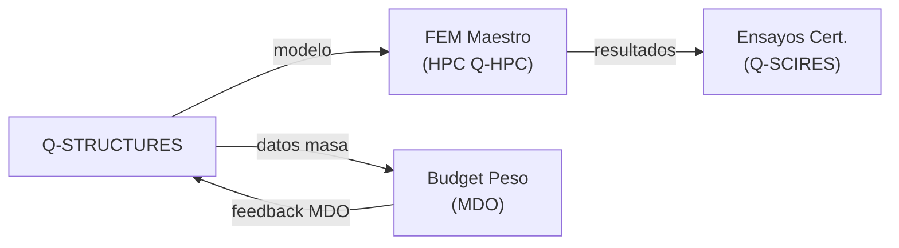

# Q-STRUCTURES — Célula, Materiales e Integridad Estructural
> *La columna vertebral de la aeronave: estructuras ligeras, materiales avanzados e integridad certificable.*

**Identificador:** GQAOA-ORG-QDIV-Q-STRUCTURES-001
**Versión:** 1.0.0 · **Fecha:** 25 de abril de 2026 · **Estado:** α

---
## Glosario de Términos y Acrónimos

| Acrónimo / Término | Definición completa | Referencia externa |
|--------------------|--------------------|--------------------|
| **Allowables** | Valores límite de tensión, deformación o resistencia de un material que se usan en el cálculo estructural certificado | [MIL-HDBK-17](https://www.astm.org/mil-hdbk-17.html) |
| **CFRP** | *Carbon Fibre Reinforced Polymer* — material compuesto de fibra de carbono en matriz epoxídica o termoplástica | [ASTM D3039](https://www.astm.org/d3039_d3039m-17.html) |
| **Coupon** | Probeta pequeña de material usada para generar datos de allowables mediante ensayos destructivos normalizados | [ASTM standards](https://www.astm.org/) |
| **CS-25** | *Certification Specifications for Large Aeroplanes* (EASA) — requisitos de aeronavegabilidad | [EASA CS-25](https://www.easa.europa.eu/en/document-library/certification-specifications/cs-25-amendment-28) |
| **Damage Tolerance** | Filosofía de diseño estructural (CS-25 Subpart D) que acepta defectos y verifica integridad entre inspecciones | [FAA AC 25.571](https://rgl.faa.gov/Regulatory_and_Guidance_Library/rgAdvisoryCircular.nsf/0/95c8d36581dce77f862581c800571b8e/$FILE/AC%2025.571-1E.pdf) |
| **DFM** | *Design for Manufacturability* — metodología que incorpora requisitos de fabricabilidad desde el diseño conceptual | *(DFM best practice)* |
| **FAR-25** | *Federal Aviation Regulations Part 25* (FAA) | [FAR Part 25](https://www.ecfr.gov/current/title-14/chapter-I/subchapter-C/part-25) |
| **FC** | *Flight Cycle* — ciclo completo despegue-crucero-aterrizaje; unidad para fatiga estructural | *(CS-25 §25.571)* |
| **FEM** | *Finite Element Method* — discretización numérica de la geometría en elementos para resolver ecuaciones de elasticidad | [ANSYS](https://www.ansys.com/) |
| **Flutter** | Inestabilidad aeroelástica acoplada entre estructuras y aerodinámica; debe tener margen ≥ 15% sobre VD | [AIAA](https://arc.aiaa.org/) |
| **GFRP** | *Glass Fibre Reinforced Polymer* — material compuesto de fibra de vidrio; mayor tenacidad pero menor rigidez que CFRP | [ASTM D2290](https://www.astm.org/d2290-19a.html) |
| **GVT** | *Ground Vibration Test* — ensayo modal en tierra para caracterizar frecuencias y modos propios de la estructura | *(aerospace SE practice)* |
| **MDO** | *Multidisciplinary Design Optimization* — optimización simultánea de aerodinámica, estructuras, propulsión y peso | [AIAA MDO](https://arc.aiaa.org/doi/10.2514/1.J058993) |
| **MTOW** | *Maximum Take-Off Weight* — peso máximo certificado de despegue | *(CS-25 §25.25)* |
| **OEW** | *Operating Empty Weight* — peso vacío operacional de la aeronave (estructura + sistemas + fluidos no utilizables) | *(CS-25 §25.29)* |
| **ROM** | *Reduced Order Model* — modelo simplificado derivado de un FEM de alta fidelidad; usado para optimización rápida | *(aerospace SE practice)* |
| **S1000D** | Especificación ASD/AIA/ATA para documentación técnica modular en XML | [S1000D.net](https://www.s1000d.net/) |
| **SRM** | *Structural Repair Manual* — manual de reparaciones estructurales aprobadas para servicio | [S1000D.net](https://www.s1000d.net/) |
| **Ti-6Al-4V** | Aleación de titanio (90% Ti, 6% Al, 4% V); alta relación resistencia-peso y excelente resistencia a la corrosión | [ASM Aerospace Specification Metals](https://asm.matweb.com/) |
| **TPC** | *Thermoplastic Composites* — composites con matriz termoplástica (PEEK, PPS); soldables, reciclables y con alta tolerancia al daño | *(Airbus Thermoplastic research)* |
| **TRL** | *Technology Readiness Level* — madurez tecnológica 1–9 | [NASA TRL](https://www.nasa.gov/directorates/somd/space-communications-navigation-program/technology-readiness-levels/) |
| **WBS** | *Work Breakdown Structure* — descomposición jerárquica de trabajo del proyecto en paquetes gestionables | [PMI PMBOK](https://www.pmi.org/pmbok-guide-standards) |

---

## 1. Misión y Alcance

Q-STRUCTURES es la división técnica responsable del diseño, análisis, fabricación y certificación de la estructura primaria y secundaria de la aeronave, incluyendo la selección y cualificación de materiales avanzados (compuestos CFRP[^1], aleaciones metálicas y materiales bio-inspirados). Su alcance cubre toda la integridad estructural del ciclo de vida, desde el diseño conceptual hasta la gestión del damage tolerance[^2] en servicio.

La división es propietaria del modelo de elementos finitos (FEM[^3]) maestro, del espectro de cargas de fatiga, y de los Structural Repair Manuals (SRM[^4]). Actúa como nodo central entre Q-AIR (cargas aerodinámicas), Q-INDUSTRY (procesos de fabricación) y Q-SCIRES (ensayos de certificación estructural), aplicando metodología MDO[^5] para maximizar la relación resistencia-peso.

---

## 2. Responsabilidades Clave

- **Diseño estructural MDO:** Optimización multidisciplinar de la estructura primaria (revestimientos, largueros, cuadernas) maximizando la relación resistencia-peso.
- **Selección y cualificación de materiales:** Evaluación y cualificación de materiales compuestos CFRP, GFRP, Ti-6Al-4V, y materiales bioinspired; gestión del Allowables Database.
- **Análisis FEM de alta fidelidad:** Modelos de elementos finitos para análisis estático, dinámico, fatiga y damage tolerance conforme a CS-25/FAR-25.
- **Gestión de cargas de diseño:** Integración del espectro de cargas entregado por Q-AIR; generación de casos de carga certificables.
- **Integridad estructural en servicio (DASG):** Definición del programa de inspección de damage tolerance y seguimiento de la acumulación de daño en flota.
- **Reparación estructural (SRM):** Desarrollo y publicación del Structural Repair Manual conforme a S1000D.
- **Integración de sistemas en estructura:** Coordinación del paso de cables, tuberías y sistemas embarcados a través de la estructura, con Q-MECHANICS y Q-GREENTECH.
- **Gestión de peso (WEIGHT-CONTROL):** Mantenimiento del presupuesto de peso del programa (OEW/MTOW) y seguimiento de desviaciones.

---

## 3. Entregables Clave

| ID | Descripción | Tipo | Estado |
|----|-------------|------|--------|
| Q-STRUCTURES-01-FEM-MASTER.hdf5 | Modelo FEM maestro de la célula AMPEL360-BWB-Q100 | HDF5 | α |
| Q-STRUCTURES-02-MATERIALS-ALLOWABLES.xlsx | Base de datos de allowables de materiales certificados | XLSX | α |
| Q-STRUCTURES-03-STATIC-TEST-PLAN.md | Plan de ensayos estructurales estáticos y de fatiga | MD | α |
| Q-STRUCTURES-04-DAMAGE-TOLERANCE-REPORT.pdf | Informe de análisis damage tolerance (DT assessment) | PDF | β |
| Q-STRUCTURES-05-SRM-DRAFT.xml | Borrador del Structural Repair Manual (S1000D XML) | XML | β |
| Q-STRUCTURES-06-WEIGHT-BUDGET.xlsx | Presupuesto de peso por WBS — control OEW/MTOW | XLSX | α |
| Q-STRUCTURES-07-COMPOSITE-PROCESS-SPEC.md | Especificación de proceso de fabricación de compuestos | MD | β |

---

## 4. RACI de Dominio

| Actividad | Q-STRUCTURES Lead | Co-Q-Divisions (C) | ORB Support (C/I) |
|-----------|------------------|-------------------|-------------------|
| Diseño estructural primario MDO | **A**/R | Q-AIR (C), Q-INDUSTRY (C) | ORB-PMO (I) |
| Modelo FEM maestro | **A**/R | Q-HPC (R), Q-SCIRES (C) | ORB-PMO (I) |
| Allowables database de materiales | **A**/R | Q-SCIRES (R), Q-INDUSTRY (C) | ORB-LEG (I) |
| Ensayos estructurales (cert.) | **A**/R | Q-SCIRES (R), Q-INDUSTRY (C) | ORB-LEG (C) |
| Análisis damage tolerance | **A**/R | Q-SCIRES (R), Q-AIR (C) | ORB-LEG (C) |
| Gestión del presupuesto de peso | **A**/R | Q-AIR (C), Q-GREENTECH (C) | ORB-PMO (I) |
| Publicación SRM (S1000D) | **A**/R | Q-DATAGOV (R), Q-GROUND (C) | ORB-PMO (I) |
| Integración de sistemas en estructura | **A**/R | Q-MECHANICS (R), Q-GREENTECH (C) | ORB-PMO (I) |

---

## 5. Interfaces Clave

### Con otras Q-Divisions

| Q-Division | Qué se intercambia | Dirección |
|------------|-------------------|-----------|
| Q-AIR | Espectro de cargas aero; impacto de peso/rigidez en aerodinámica | Bidireccional |
| Q-INDUSTRY | Especificaciones de procesos de fabricación; DFM (Design for Manufacture) | Bidireccional |
| Q-SCIRES | Plan de ensayos estructurales; correlación FEM-ensayo; datos de certificación | Bidireccional |
| Q-HPC | Ejecución de FEM a gran escala en infraestructura HPC; MDO asistido por IA | Bidireccional |
| Q-MECHANICS | Paso de tuberías hidráulicas y actuadores por la estructura | Q-MECH → Q-STR |
| Q-GREENTECH | Integración estructural de packs de baterías y tanques H₂ | Bidireccional |
| Q-DATAGOV | Publicación de DMs estructurales en CSDB; gestión del SRM | Q-STR → Q-DATAGOV |

### Con unidades ORB

| ORB Unit | Naturaleza de la interacción |
|----------|------------------------------|
| ORB-LEG | Cumplimiento CS-25 Subpart C/D, FAR 25; damage tolerance regulations |
| ORB-PMO | Seguimiento de hitos de congelado de baseline estructural |
| ORB-PROC | Cualificación de proveedores de materiales compuestos y metálicos |
| ORB-FIN | Presupuesto de ensayos estructurales; coste de materiales avanzados |

---

## 6. KPIs del Dominio

| KPI | Objetivo | Fuente |
|-----|----------|--------|
| OEW (Operating Empty Weight) | ≤ objetivo MDO ±2% | Q-STRUCTURES-06-WEIGHT-BUDGET |
| Margen de reserva último (ultimate load) | ≥ límite × 1.5 (carga última, CS-25 §25.303) | Q-STRUCTURES-01-FEM-MASTER |
| Cobertura de coupon allowables en base de datos | ≥ 95% de familias de materiales certificadas | Q-STRUCTURES-02-MATERIALS-ALLOWABLES |
| TRL de compuestos bio-inspirados | ≥ TRL 5 en 2032 | Q-SCIRES datos |
| Ciclos de fatiga validados (economic life) | ≥ 90,000 FC (flight cycles) | Q-STRUCTURES-03-STATIC-TEST-PLAN |

---

## 7. Riesgos Específicos

| Riesgo | Impacto | Probabilidad | Mitigación |
|--------|---------|--------------|------------|
| Exceso de peso estructural vs. objetivo MDO | Alto | Media | Revisiones de presupuesto de peso cada 3 meses; early DFM review |
| Fallo de programa de ensayos de certificación (ultimate load test) | Crítico | Baja | Ensayos de coupon y componente por fases previas; factor de seguridad conservador |
| Escasez de fibra de carbono de grado aeroespacial | Medio | Media | Acuerdos de suministro a largo plazo con ORB-PROC; investigación de alternativas |
| Incompatibilidad de materiales entre zonas térmicas (H₂) | Alto | Baja | Análisis térmico conjunto Q-GREENTECH; cualificación de materiales criogénicos |

---

## 8. Hoja de Ruta Tecnológica

| Tecnología / Capacidad | TRL Actual | TRL Objetivo | Año Objetivo | Hito Clave |
|------------------------|-----------|-------------|-------------|------------|
| Compuestos CFRP termoplásticos (TPC) | TRL 4 | TRL 7 | 2032 | Cualificación material volar |
| Materiales bio-inspirados estructurales | TRL 3 | TRL 5 | 2034 | Coupon allowables database |
| MDO multifísica acoplada | TRL 5 | TRL 8 | 2031 | Congelado baseline estructural |
| Impresión 3D metálica certificada (Ti/Al) | TRL 5 | TRL 7 | 2033 | Primera pieza primaria producida |
| Damage tolerance in-service monitoring | TRL 4 | TRL 7 | 2035 | Integración con BOB DA |

---

## 9. Referencias

### Internas
- [Matriz RACI Maestra Q-Divisions](../Readme.md)
- [Documento Organizacional Maestro GQAOA](../../README.md)
- [AMPEL360-BWB-Q100 Docs](../../../programs/AMPEL360/AMPEL360-BWB-Q100/Docs/readme.md)
- [CSDB S1000D Validator](../../../CSDB/s1000d_validator.py)

### Externas — Normativa y Estándares
| Referencia | Descripción | Enlace |
|-----------|-------------|--------|
| EASA CS-25 Amdt. 28 | Certification Specifications for Large Aeroplanes | [easa.europa.eu](https://www.easa.europa.eu/en/document-library/certification-specifications/cs-25-amendment-28) |
| FAA AC 25.571-1E | Damage Tolerance and Fatigue Evaluation | [faa.gov](https://rgl.faa.gov/Regulatory_and_Guidance_Library/rgAdvisoryCircular.nsf/0/95c8d36581dce77f862581c800571b8e/$FILE/AC%2025.571-1E.pdf) |
| ASTM D3039 | Standard Test Method for Tensile Properties of Polymer Matrix Composites | [astm.org](https://www.astm.org/d3039_d3039m-17.html) |
| MIL-HDBK-17 | Composite Materials Handbook | [astm.org](https://www.astm.org/mil-hdbk-17.html) |
| SAE ARP4761 | Safety Assessment Process Guidelines | [sae.org](https://www.sae.org/standards/content/arp4761/) |
| AIAA MDO | Multidisciplinary Design Optimization journal | [arc.aiaa.org](https://arc.aiaa.org/doi/10.2514/1.J058993) |
| S1000D | Technical documentation specification | [s1000d.net](https://www.s1000d.net/) |

## Notas

[^1]: **CFRP** (Carbon Fibre Reinforced Polymer): material compuesto de fibra de carbono en matriz epoxídica o termoplástica; ofrece alta relación resistencia-peso, fundamental para estructuras aeronáuticas modernas.
[^2]: **Damage Tolerance**: filosofía de diseño estructural que acepta la presencia de defectos o grietas y asegura la integridad estructural entre inspecciones planificadas, conforme a CS-25 Subpart D.
[^3]: **FEM** (Finite Element Method / Método de Elementos Finitos): técnica numérica de cálculo estructural que discretiza la geometría en elementos para resolver ecuaciones diferenciales de elasticidad y dinámica.
[^4]: **SRM** (Structural Repair Manual): manual que define los procedimientos aprobados para reparar daños estructurales en servicio; publicado conforme al estándar S1000D.
[^5]: **MDO** (Multidisciplinary Design Optimization): metodología de optimización que considera simultáneamente múltiples disciplinas (aerodinámica, estructuras, propulsión, peso) para encontrar el diseño óptimo global.

**[FIN DEL DOCUMENTO]**
