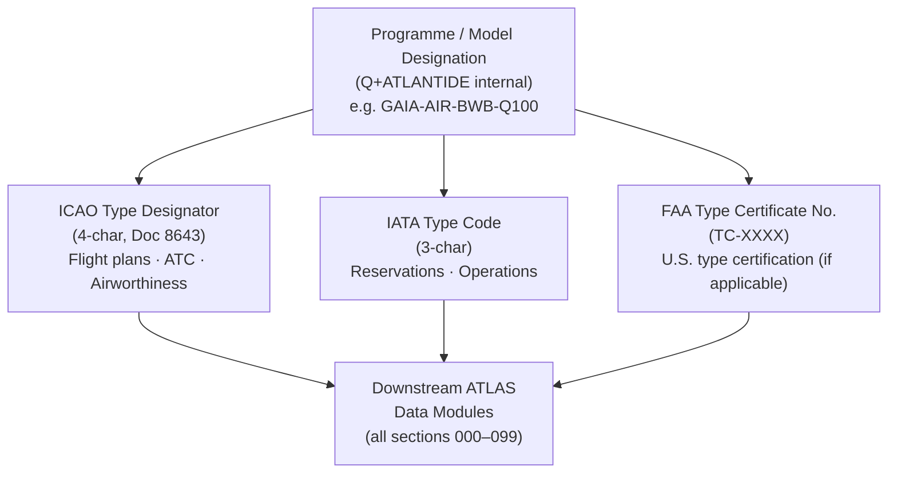

# ATLAS 000-009 · Section 00 · Subsection 000 · Subsubject 001 — Aircraft Identification

## 1. Purpose

Defines the **aircraft identification** scheme — the set of controlled codes and designators that uniquely name an aircraft type across regulatory and industry systems. Establishes the authoritative vocabulary (ICAO type designator, IATA code, FAA designator, and programme-internal model designation) used by every downstream ATLAS subsubject, data module, and maintenance document within the Q+ATLANTIDE baseline[^baseline], conforming to ATA iSpec 2200[^ata2200] and ATA Spec 100[^ataspec100].

## 2. Scope

- Covers the *Aircraft Identification* subsubject (`001`) of subsection `000` *Identificación* within section `00` *Información General y Servicio*.
- Inherits Q-Division authority and ORB support from the parent row in [`../../README.md` §3](../../README.md#3-architecture-table)[^archtable].
- Concepts in scope:
  - **ICAO Aircraft Type Designator** — four-character alphanumeric code assigned by ICAO (Doc 8643[^icaodoc8643]) and used in flight plans, ATC, and airworthiness documentation.
  - **IATA Aircraft Type Code** — three-character code used in commercial-aviation reservation and operations systems.
  - **FAA Type Certificate (TC) Number** — U.S. regulatory identifier issued by the FAA as part of type certification; included where applicable for ATLAS entries covering FAA-certified types.
  - **Programme / Model Designation** — the internal Q+ATLANTIDE programme identifier (e.g., `GAIA-AIR-BWB-Q100`) that links the ICAO/IATA/FAA codes to the baseline's own taxonomy.
  - **Relationship between codes** — the directed mapping from programme designation → ICAO designator → IATA code, and the optional FAA TC cross-reference.
- Out of scope: manufacturer legal-entity identification (`002_`), configuration variants and effectivity (`003_`), physical serial numbers (`004_`), and digital document identifiers (`005_`).

## 3. Diagram — Aircraft Identification Code Hierarchy

The four identification codes form a directed mapping from the programme-internal designation outward to the three external registries (ICAO, IATA, FAA). Each external code is independent but all resolve to the same physical type.

## 4. Footprint

| Metric | Value |
|---|---|
| Architecture | `ATLAS` — Aircraft Top Level Architecture Schema/System (controlled term) |
| Master range | `000–099` |
| Code range | `000-009` |
| Section | `00` — Información General y Servicio |
| Subsection | `000` — Identificación |
| Subsubject | `001` — Aircraft Identification |
| Primary Q-Division | Q-DATAGOV[^qdiv] |
| Support Q-Divisions | Q-GROUND, Q-AIR |
| ORB support | ORB-PMO, ORB-LEG |
| Governance class | `baseline`[^gov] |
| Folder path | `Q+ATLANTIDE/000-099_ATLAS/000-009_Informacion-General-y-Servicio/000_Identificacion/` |
| Document | `001_Aircraft-Identification.md` (this file) |
| Parent subsection | [`README.md`](./README.md) · [`000_Overview.md`](./000_Overview.md) |
| Parent architecture | [`../../README.md`](../../README.md) |
| Parent baseline | [`organization/Q+ATLANTIDE.md`](../../../../organization/Q+ATLANTIDE.md) |

## 5. References & Citations

[^baseline]: **Q+ATLANTIDE controlled baseline (v1.0.0)** — [`organization/Q+ATLANTIDE.md`](../../../../organization/Q+ATLANTIDE.md). Defines the controlled `000-999` architecture-band taxonomy and the ATLAS-1000 register subpart.

[^archtable]: **ATLAS §3 Architecture Table** — [`../../README.md` §3](../../README.md#3-architecture-table). Authoritative source for the `000-009` row (Section `00` — Información General y Servicio, Primary Q-Division Q-DATAGOV).

[^qdiv]: **Q-Division authority** — Q-Divisions provide technical authority over an architecture row (Q+ATLANTIDE Note N-002). See [`organization/Q+ATLANTIDE.md` §4](../../../../organization/Q+ATLANTIDE.md#4-notes).

[^gov]: **Governance class** — `baseline` denotes documents under controlled change management within the Q+ATLANTIDE baseline.

[^ata2200]: **ATA iSpec 2200 — Information Standards for Aviation Maintenance** — Governs aircraft type designation and document-structure conventions for all ATLAS maintenance artefacts.

[^ataspec100]: **ATA Spec 100 — Manufacturers Technical Data** — Baseline standard for aircraft type designation and manufacturer code conventions.

[^s1000d]: **S1000D Issue 6.0 — International specification for technical publications** — Common Source DataBase (CSDB) and Data Module Code (DMC) specification used for all Q+ATLANTIDE artefacts.

[^as9100d]: **AS9100D — Quality Management Systems — Aviation, Space and Defense Organizations** — Quality-management baseline for all Q+ATLANTIDE deliverables.

[^icaodoc8643]: **ICAO Doc 8643 — Aircraft Type Designators** — Authoritative registry of four-character ICAO type designators; updated quarterly by ICAO.

### Applicable industry standards

The following standards apply to this subsubject in addition to the cross-cutting Q+ATLANTIDE governance:

- ATA iSpec 2200 — Information Standards for Aviation Maintenance[^ata2200]
- ATA Spec 100 — Manufacturers Technical Data[^ataspec100]
- ICAO Doc 8643 — Aircraft Type Designators[^icaodoc8643]
- S1000D Issue 6.0 — International specification for technical publications[^s1000d]
- AS9100D — Quality Management Systems — Aviation, Space and Defense Organizations[^as9100d]
