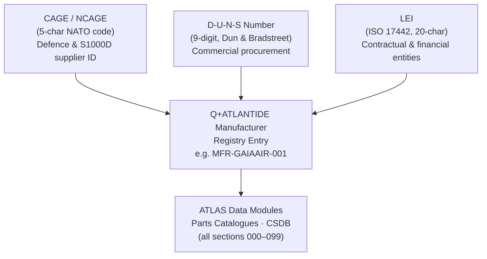

# ATLAS 000-009 · Section 00 · Subsection 000 · Subsubject 002 — Manufacturer Designation

## 1. Purpose

Defines the **manufacturer designation** scheme — the set of legal-entity and trading codes that uniquely identify every Organisation that designs, manufactures, or certifies components and assemblies within the Q+ATLANTIDE programme. Establishes the controlled vocabulary (CAGE code, NCAGE, DUNS/D-U-N-S, LEI, and the Q+ATLANTIDE manufacturer registry entry) used to link aircraft data modules to the responsible party, in conformance with ATA iSpec 2200[^ata2200], ATA Spec 100[^ataspec100], and AS9100D[^as9100d].

## 2. Scope

- Covers the *Manufacturer Designation* subsubject (`002`) of subsection `000` *Identificación* within section `00` *Información General y Servicio*.
- Inherits Q-Division authority and ORB support from the parent row in [`../../README.md` §3](../../README.md#3-architecture-table)[^archtable].
- Concepts in scope:
  - **CAGE / NCAGE Code** — five-character NATO Commercial and Government Entity code; mandatory for all defence and NATO-programme suppliers; serves as the primary supplier identifier in S1000D[^s1000d] data modules.
  - **D-U-N-S Number** — Dun & Bradstreet nine-digit identifier for legal entities; used in commercial procurement and supply-chain traceability.
  - **LEI (Legal Entity Identifier)** — ISO 17442[^iso17442] twenty-character alphanumeric code for entities participating in financial and contractual transactions; included for programme prime contractors.
  - **Q+ATLANTIDE Manufacturer Registry Entry** — the programme-internal short code (e.g., `MFR-GAIAAIR-001`) used to cross-reference supplier entries in ATLAS data modules, parts catalogues, and the CSDB.
  - **Relationship between codes** — the directed mapping from CAGE/NCAGE → D-U-N-S → LEI → Q+ATLANTIDE registry entry, ensuring every supplier has a fully resolved identity chain.
- Out of scope: aircraft type designation (`001_`), configuration and variant labelling (`003_`), physical part marking (`004_`), and digital document identifiers (`005_`).

## 3. Diagram — Manufacturer Designation Code Hierarchy

The manufacturer identity chain maps each external registry code to the programme-internal registry entry, ensuring unambiguous traceability from a data module to the responsible legal entity.

## 4. Footprint

| Metric | Value |
|---|---|
| Architecture | `ATLAS` — Aircraft Top Level Architecture Schema/System (controlled term) |
| Master range | `000–099` |
| Code range | `000-009` |
| Section | `00` — Información General y Servicio |
| Subsection | `000` — Identificación |
| Subsubject | `002` — Manufacturer Designation |
| Primary Q-Division | Q-DATAGOV[^qdiv] |
| Support Q-Divisions | Q-GROUND, Q-AIR |
| ORB support | ORB-PMO, ORB-LEG |
| Governance class | `baseline`[^gov] |
| Folder path | `Q+ATLANTIDE/000-099_ATLAS/000-009_Informacion-General-y-Servicio/000_Identificacion/` |
| Document | `002_Manufacturer-Designation.md` (this file) |
| Parent subsection | [`README.md`](./README.md) · [`000_Overview.md`](./000_Overview.md) |
| Parent architecture | [`../../README.md`](../../README.md) |
| Parent baseline | [`organization/Q+ATLANTIDE.md`](../../../../organization/Q+ATLANTIDE.md) |

## 5. References & Citations

[^baseline]: **Q+ATLANTIDE controlled baseline (v1.0.0)** — [`organization/Q+ATLANTIDE.md`](../../../../organization/Q+ATLANTIDE.md). Defines the controlled `000-999` architecture-band taxonomy and the ATLAS-1000 register subpart.

[^archtable]: **ATLAS §3 Architecture Table** — [`../../README.md` §3](../../README.md#3-architecture-table). Authoritative source for the `000-009` row (Section `00` — Información General y Servicio, Primary Q-Division Q-DATAGOV).

[^qdiv]: **Q-Division authority** — Q-Divisions provide technical authority over an architecture row (Q+ATLANTIDE Note N-002). See [`organization/Q+ATLANTIDE.md` §4](../../../../organization/Q+ATLANTIDE.md#4-notes).

[^gov]: **Governance class** — `baseline` denotes documents under controlled change management within the Q+ATLANTIDE baseline.

[^ata2200]: **ATA iSpec 2200 — Information Standards for Aviation Maintenance** — Governs manufacturer code usage and document structure for all ATLAS maintenance artefacts.

[^ataspec100]: **ATA Spec 100 — Manufacturers Technical Data** — Baseline standard for manufacturer designation conventions.

[^s1000d]: **S1000D Issue 6.0 — International specification for technical publications** — CAGE/NCAGE code usage in Data Module Codes (DMC) and the Common Source DataBase (CSDB).

[^as9100d]: **AS9100D — Quality Management Systems — Aviation, Space and Defense Organizations** — Quality-management baseline requiring traceable supplier identification.

[^iso17442]: **ISO 17442 — Financial Services — Legal Entity Identifier (LEI)** — Defines the twenty-character alphanumeric LEI used to uniquely identify legal entities in contractual and financial contexts.

### Applicable industry standards

The following standards apply to this subsubject in addition to the cross-cutting Q+ATLANTIDE governance:

- ATA iSpec 2200 — Information Standards for Aviation Maintenance[^ata2200]
- ATA Spec 100 — Manufacturers Technical Data[^ataspec100]
- S1000D Issue 6.0 — International specification for technical publications[^s1000d]
- AS9100D — Quality Management Systems — Aviation, Space and Defense Organizations[^as9100d]
- ISO 17442 — Legal Entity Identifier (LEI)[^iso17442]
