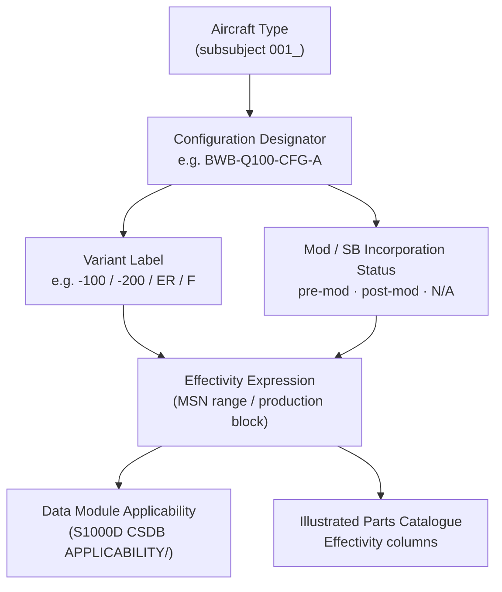

# ATLAS 000-009 · Section 00 · Subsection 000 · Subsubject 003 — Configuration Identification

## 1. Purpose

Defines the **configuration identification** scheme — the controlled notation system that unambiguously describes which variant, modification standard, and effectivity expression applies to a given aircraft or data module within the Q+ATLANTIDE programme. Establishes the vocabulary (configuration designator, mod/SB incorporation status, effectivity expression, and variant label) used in all ATLAS data modules, in conformance with ATA iSpec 2200[^ata2200] and ATA Spec 100[^ataspec100].

## 2. Scope

- Covers the *Configuration Identification* subsubject (`003`) of subsection `000` *Identificación* within section `00` *Información General y Servicio*.
- Inherits Q-Division authority and ORB support from the parent row in [`../../README.md` §3](../../README.md#3-architecture-table)[^archtable].
- Concepts in scope:
  - **Configuration Designator** — a controlled alphanumeric string (e.g., `BWB-Q100-CFG-A`) that names the top-level configuration of an aircraft type. It encodes the variant identifier and the baseline modification standard.
  - **Variant Labelling** — sub-designators that distinguish structural, propulsion, or mission variants of the same type (e.g., `-100`, `-200`, `ER`, `F` for freighter). Governed by the Q+ATLANTIDE configuration management plan.
  - **Modification / Service Bulletin Incorporation Status** — the explicit declaration of which Service Bulletins (SBs) or Engineering Orders (EOs) are incorporated (*pre-mod*, *post-mod*, *N/A*). Expressed as a mod-status attribute in S1000D[^s1000d] applicability.
  - **Effectivity Expression** — the formal notation (serial-number range, MSN list, or production-block expression) that bounds applicability of a data module or illustrated part to a specific set of aircraft. Follows the S1000D applicability model defined in the CSDB `APPLICABILITY/` directories.
  - **Baseline Configuration Record** — the immutable reference record in the ATLAS-1000 register that captures the approved configuration at a given programme milestone; change-controlled by Q-DATAGOV via ORB-PMO.
- Out of scope: type-level aircraft identification (`001_`), manufacturer codes (`002_`), physical serial numbers and marking (`004_`), and digital document identifiers (`005_`).

## 3. Diagram — Configuration Identification Hierarchy

Configuration identification proceeds from the top-level type down to the effectivity expression that bounds individual data-module applicability.

## 4. Footprint

| Metric | Value |
|---|---|
| Architecture | `ATLAS` — Aircraft Top Level Architecture Schema/System (controlled term) |
| Master range | `000–099` |
| Code range | `000-009` |
| Section | `00` — Información General y Servicio |
| Subsection | `000` — Identificación |
| Subsubject | `003` — Configuration Identification |
| Primary Q-Division | Q-DATAGOV[^qdiv] |
| Support Q-Divisions | Q-GROUND, Q-AIR |
| ORB support | ORB-PMO, ORB-LEG |
| Governance class | `baseline`[^gov] |
| Folder path | `Q+ATLANTIDE/000-099_ATLAS/000-009_Informacion-General-y-Servicio/000_Identificacion/` |
| Document | `003_Configuration-Identification.md` (this file) |
| Parent subsection | [`README.md`](./README.md) · [`000_Overview.md`](./000_Overview.md) |
| Parent architecture | [`../../README.md`](../../README.md) |
| Parent baseline | [`organization/Q+ATLANTIDE.md`](../../../../organization/Q+ATLANTIDE.md) |

## 5. References & Citations

[^baseline]: **Q+ATLANTIDE controlled baseline (v1.0.0)** — [`organization/Q+ATLANTIDE.md`](../../../../organization/Q+ATLANTIDE.md). Defines the controlled `000-999` architecture-band taxonomy and the ATLAS-1000 register subpart.

[^archtable]: **ATLAS §3 Architecture Table** — [`../../README.md` §3](../../README.md#3-architecture-table). Authoritative source for the `000-009` row (Section `00` — Información General y Servicio, Primary Q-Division Q-DATAGOV).

[^qdiv]: **Q-Division authority** — Q-Divisions provide technical authority over an architecture row (Q+ATLANTIDE Note N-002). See [`organization/Q+ATLANTIDE.md` §4](../../../../organization/Q+ATLANTIDE.md#4-notes).

[^gov]: **Governance class** — `baseline` denotes documents under controlled change management within the Q+ATLANTIDE baseline.

[^ata2200]: **ATA iSpec 2200 — Information Standards for Aviation Maintenance** — Governs configuration identification, effectivity notation, and applicability expressions for all ATLAS artefacts.

[^ataspec100]: **ATA Spec 100 — Manufacturers Technical Data** — Baseline standard for variant labelling and configuration designator conventions.

[^s1000d]: **S1000D Issue 6.0 — International specification for technical publications** — Defines the applicability model (ACT/PCT/CCT, `modStatus`, effectivity logic) used in the CSDB `APPLICABILITY/` directories.

[^as9100d]: **AS9100D — Quality Management Systems — Aviation, Space and Defense Organizations** — Quality-management baseline requiring traceable configuration identification at all lifecycle stages.

### Applicable industry standards

The following standards apply to this subsubject in addition to the cross-cutting Q+ATLANTIDE governance:

- ATA iSpec 2200 — Information Standards for Aviation Maintenance[^ata2200]
- ATA Spec 100 — Manufacturers Technical Data[^ataspec100]
- S1000D Issue 6.0 — International specification for technical publications[^s1000d]
- AS9100D — Quality Management Systems — Aviation, Space and Defense Organizations[^as9100d]
