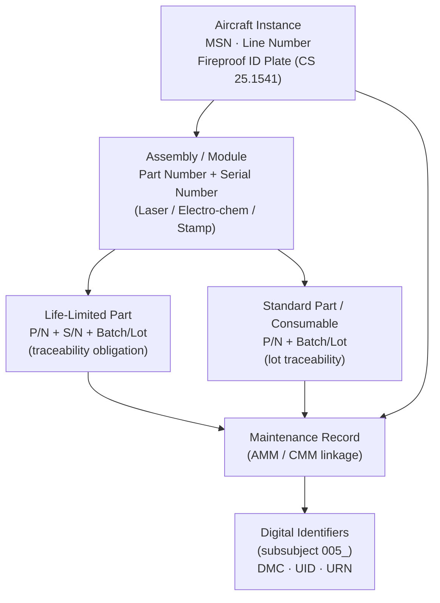

# ATLAS 000-009 · Section 00 · Subsection 000 · Subsubject 004 — Serialization and Marking

## 1. Purpose

Defines the **serialization and marking** scheme — the physical and administrative identification applied to each individual aircraft and to its tracked components and assemblies. Establishes the controlled vocabulary (MSN, line number, part number, batch/lot number, and physical marking method) used to link every aircraft instance to its maintenance history, configuration record, and digital data modules within the Q+ATLANTIDE baseline[^baseline], in conformance with ATA iSpec 2200[^ata2200], ATA Spec 100[^ataspec100], AS9100D[^as9100d], and ISO 15459[^iso15459].

## 2. Scope

- Covers the *Serialization and Marking* subsubject (`004`) of subsection `000` *Identificación* within section `00` *Información General y Servicio*.
- Inherits Q-Division authority and ORB support from the parent row in [`../../README.md` §3](../../README.md#3-architecture-table)[^archtable].
- Concepts in scope:
  - **Manufacturer Serial Number (MSN)** — the unique numeric or alphanumeric serial assigned by the airframe manufacturer to each individual aircraft at production. The MSN is the primary physical-instance identifier throughout the ATLAS-1000 register and appears in all effectivity expressions.
  - **Line Number** — the sequential build-order number assigned during final assembly; used internally by the manufacturer and may differ from the MSN.
  - **Part Number (P/N)** — the design-authority number that identifies a specific part design; combined with Serial Number (S/N) it uniquely identifies a specific piece.
  - **Batch / Lot Number** — the production batch identifier for interchangeable parts; used in traceability for life-limited parts and repetitive inspections.
  - **Physical Marking Method** — the approved technique for applying identification marks: electro-chemical etching, laser marking, stamping, engraved placard, or Data Matrix barcode (per ISO 15459[^iso15459]). Method selection is driven by material, temperature environment, and regulatory requirement.
  - **Fireproof Identification Plate** — the regulatory requirement (CS 25.1541 / FAR 45.13) for an aircraft data plate bearing the manufacturer name, type designator, TC/STC number, MSN, and maximum weight.
- Out of scope: type designation (`001_`), manufacturer legal identity (`002_`), configuration variants and effectivity (`003_`), and digital document identifiers (`005_`).

## 3. Diagram — Serialization and Marking Hierarchy

Each level of the physical hierarchy carries its own mandatory identifier; all levels trace upward to the MSN and downward into the maintenance record.

## 4. Footprint

| Metric | Value |
|---|---|
| Architecture | `ATLAS` — Aircraft Top Level Architecture Schema/System (controlled term) |
| Master range | `000–099` |
| Code range | `000-009` |
| Section | `00` — Información General y Servicio |
| Subsection | `000` — Identificación |
| Subsubject | `004` — Serialization and Marking |
| Primary Q-Division | Q-DATAGOV[^qdiv] |
| Support Q-Divisions | Q-GROUND, Q-AIR |
| ORB support | ORB-PMO, ORB-LEG |
| Governance class | `baseline`[^gov] |
| Folder path | `Q+ATLANTIDE/000-099_ATLAS/000-009_Informacion-General-y-Servicio/000_Identificacion/` |
| Document | `004_Serialization-and-Marking.md` (this file) |
| Parent subsection | [`README.md`](./README.md) · [`000_Overview.md`](./000_Overview.md) |
| Parent architecture | [`../../README.md`](../../README.md) |
| Parent baseline | [`organization/Q+ATLANTIDE.md`](../../../../organization/Q+ATLANTIDE.md) |

## 5. References & Citations

[^baseline]: **Q+ATLANTIDE controlled baseline (v1.0.0)** — [`organization/Q+ATLANTIDE.md`](../../../../organization/Q+ATLANTIDE.md). Defines the controlled `000-999` architecture-band taxonomy and the ATLAS-1000 register subpart.

[^archtable]: **ATLAS §3 Architecture Table** — [`../../README.md` §3](../../README.md#3-architecture-table). Authoritative source for the `000-009` row (Section `00` — Información General y Servicio, Primary Q-Division Q-DATAGOV).

[^qdiv]: **Q-Division authority** — Q-Divisions provide technical authority over an architecture row (Q+ATLANTIDE Note N-002). See [`organization/Q+ATLANTIDE.md` §4](../../../../organization/Q+ATLANTIDE.md#4-notes).

[^gov]: **Governance class** — `baseline` denotes documents under controlled change management within the Q+ATLANTIDE baseline.

[^ata2200]: **ATA iSpec 2200 — Information Standards for Aviation Maintenance** — Governs serialisation references and part-number usage in ATLAS maintenance data modules.

[^ataspec100]: **ATA Spec 100 — Manufacturers Technical Data** — Baseline standard for part-number format and aircraft serial-number conventions.

[^s1000d]: **S1000D Issue 6.0 — International specification for technical publications** — MSN and serial-number usage in Data Module applicability and the Common Source DataBase.

[^as9100d]: **AS9100D — Quality Management Systems — Aviation, Space and Defense Organizations** — Quality-management requirements for serialisation, part marking, traceability of life-limited parts, and first-article inspection records.

[^iso15459]: **ISO 15459 — Unique Identification of Transport Units and Unit Loads** — Defines unique identifier (UID) structures, including Data Matrix barcode encoding, for aircraft, assemblies, and parts.

### Applicable industry standards

The following standards apply to this subsubject in addition to the cross-cutting Q+ATLANTIDE governance:

- ATA iSpec 2200 — Information Standards for Aviation Maintenance[^ata2200]
- ATA Spec 100 — Manufacturers Technical Data[^ataspec100]
- S1000D Issue 6.0 — International specification for technical publications[^s1000d]
- AS9100D — Quality Management Systems — Aviation, Space and Defense Organizations[^as9100d]
- ISO 15459 — Unique Identification of Transport Units and Unit Loads[^iso15459]
