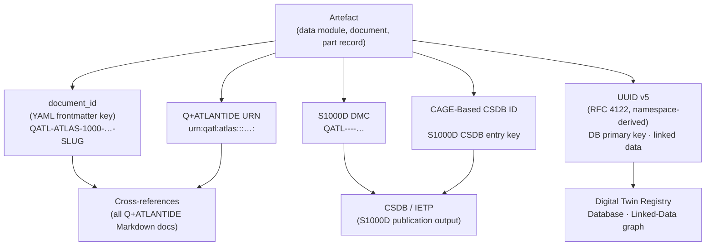

# ATLAS 000-009 · Section 00 · Subsection 000 · Subsubject 005 — Digital Identifiers

## 1. Purpose

Defines the **digital identifier** scheme — the complete set of machine-readable codes and URIs that uniquely name every artefact (document, data module, part, configuration, and baseline entry) within the Q+ATLANTIDE ecosystem. Establishes the controlled vocabulary (S1000D Data Module Code, Q+ATLANTIDE URN, UUID v5, and CSDB CAGE-based identifier) used to cross-link all ATLAS-1000 data modules, parts catalogues, and programme documents, in conformance with S1000D Issue 6.0[^s1000d] and ISO 15459[^iso15459].

## 2. Scope

- Covers the *Digital Identifiers* subsubject (`005`) of subsection `000` *Identificación* within section `00` *Información General y Servicio*.
- Inherits Q-Division authority and ORB support from the parent row in [`../../README.md` §3](../../README.md#3-architecture-table)[^archtable].
- Concepts in scope:
  - **S1000D Data Module Code (DMC)** — the structured alphanumeric key `<modelIdent>-<sdc>-<chapNum>-<section>-<subsect>-<subject>-<infoCode>-<infoCodeVariant>-<itemLocationCode>` that uniquely addresses every data module in the Q+ATLANTIDE CSDB. All ATLAS-1000 modules use the programme `modelIdent` `QATL`.
  - **Q+ATLANTIDE Document URN** — the programme-internal Uniform Resource Name following the pattern `urn:qatl:atlas:<band>:<range>:<section>:<subsection>:<subsubject>:<version>` (e.g., `urn:qatl:atlas:ATLAS:000-009:00:000:005:1.0.0`). Used as the canonical persistent link in cross-references and digital twins.
  - **UUID v5 (namespace-based)** — a deterministic RFC 4122[^rfc4122] version-5 UUID derived from the Q+ATLANTIDE namespace UUID and the document's canonical URN. Provides a globally unique, collision-free identifier suitable for database primary keys and linked-data contexts.
  - **CAGE-Based CSDB Identifier** — the five-character CAGE code prefix plus a sequential document number used as the CSDB entry key in S1000D-compliant publications (`<cageCode><dmCode>`). Defined in `002_Manufacturer-Designation.md` for the programme prime contractor.
  - **document_id field** — the human-readable programme key used in YAML frontmatter across all Q+ATLANTIDE artefacts (e.g., `QATL-ATLAS-1000-ATLAS-000-009-00-000-005-DIGITAL-IDENTIFIERS`). Formed from the URN components in a dash-delimited, upper-case-slug form.
  - **Identifier lifecycle** — assignment, freezing (on release), and retirement rules; identifiers are never reused and retired identifiers are tombstoned in the CSDB index.
- Out of scope: type designation (`001_`), manufacturer legal identity (`002_`), configuration effectivity (`003_`), and physical serial numbers and marking (`004_`).

## 3. Diagram — Digital Identifier Hierarchy

Each digital identifier type targets a specific scope; all resolve ultimately to a single canonical artefact in the CSDB or programme registry.

## 4. Footprint

| Metric | Value |
|---|---|
| Architecture | `ATLAS` — Aircraft Top Level Architecture Schema/System (controlled term) |
| Master range | `000–099` |
| Code range | `000-009` |
| Section | `00` — Información General y Servicio |
| Subsection | `000` — Identificación |
| Subsubject | `005` — Digital Identifiers |
| Primary Q-Division | Q-DATAGOV[^qdiv] |
| Support Q-Divisions | Q-GROUND, Q-AIR |
| ORB support | ORB-PMO, ORB-LEG |
| Governance class | `baseline`[^gov] |
| Folder path | `Q+ATLANTIDE/000-099_ATLAS/000-009_Informacion-General-y-Servicio/000_Identificacion/` |
| Document | `005_Digital-Identifiers.md` (this file) |
| Parent subsection | [`README.md`](./README.md) · [`000_Overview.md`](./000_Overview.md) |
| Parent architecture | [`../../README.md`](../../README.md) |
| Parent baseline | [`organization/Q+ATLANTIDE.md`](../../../../organization/Q+ATLANTIDE.md) |

## 5. References & Citations

[^baseline]: **Q+ATLANTIDE controlled baseline (v1.0.0)** — [`organization/Q+ATLANTIDE.md`](../../../../organization/Q+ATLANTIDE.md). Defines the controlled `000-999` architecture-band taxonomy and the ATLAS-1000 register subpart.

[^archtable]: **ATLAS §3 Architecture Table** — [`../../README.md` §3](../../README.md#3-architecture-table). Authoritative source for the `000-009` row (Section `00` — Información General y Servicio, Primary Q-Division Q-DATAGOV).

[^qdiv]: **Q-Division authority** — Q-Divisions provide technical authority over an architecture row (Q+ATLANTIDE Note N-002). See [`organization/Q+ATLANTIDE.md` §4](../../../../organization/Q+ATLANTIDE.md#4-notes).

[^gov]: **Governance class** — `baseline` denotes documents under controlled change management within the Q+ATLANTIDE baseline.

[^ata2200]: **ATA iSpec 2200 — Information Standards for Aviation Maintenance** — Governs document identification and data-module cross-reference conventions for all ATLAS artefacts.

[^ataspec100]: **ATA Spec 100 — Manufacturers Technical Data** — Baseline standard for document numbering conventions.

[^s1000d]: **S1000D Issue 6.0 — International specification for technical publications** — Defines the Data Module Code (DMC) structure, CSDB key conventions, and identifier lifecycle rules used throughout the Q+ATLANTIDE CSDB.

[^as9100d]: **AS9100D — Quality Management Systems — Aviation, Space and Defense Organizations** — Quality-management baseline for document control, unique identification, and record retention.

[^iso15459]: **ISO 15459 — Unique Identification of Transport Units and Unit Loads** — Provides the UID framework extended here to digital artefact identification via UUID v5.

[^rfc4122]: **RFC 4122 — A Universally Unique IDentifier (UUID) URN Namespace** — Defines the UUID v5 algorithm (SHA-1 hash within a namespace) used to derive deterministic, globally unique identifiers for Q+ATLANTIDE artefacts.

### Applicable industry standards

The following standards apply to this subsubject in addition to the cross-cutting Q+ATLANTIDE governance:

- ATA iSpec 2200 — Information Standards for Aviation Maintenance[^ata2200]
- ATA Spec 100 — Manufacturers Technical Data[^ataspec100]
- S1000D Issue 6.0 — International specification for technical publications[^s1000d]
- AS9100D — Quality Management Systems — Aviation, Space and Defense Organizations[^as9100d]
- ISO 15459 — Unique Identification of Transport Units and Unit Loads[^iso15459]
- RFC 4122 — A Universally Unique IDentifier (UUID) URN Namespace[^rfc4122]
