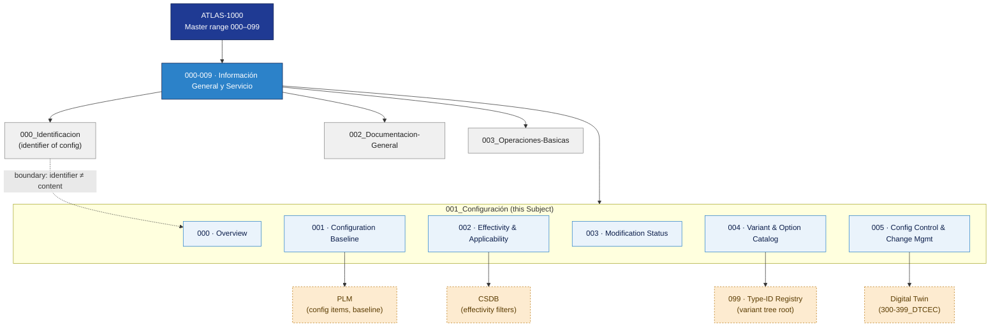

# ATLAS 000-009 · 00.001.000 — Configuración Overview

## 1. Purpose

This document positions subsection `001_Configuración` within the ATLAS top-level architecture schema as the **second Subject of the first Code range of the ATLAS Master range** (`000–099`). Configuration is the controlled state of the aircraft at the top level — what the aircraft *is* at any given moment across its lifecycle.

*ATLAS describes the aircraft as an integrated system at the top level; this Subject controls how that integrated state evolves over time.*

This subsubject is part of the **ATLAS-1000** register, a subpart of the controlled **Q+ATLANTIDE** baseline[^baseline][^n001].

## 2. Scope

### 2.1 Doctrinal Position

Subsection `001_Configuración` is the **content and control layer** for aircraft configuration. It is the second Subject of Code range `000-009` — *Información General y Servicio* — immediately following `000_Identificación`. The two subjects are deliberately adjacent and deliberately separated:

| Subject | Role |
|---|---|
| `000_Identificacion/003_Configuration-Identification.md` | Defines the **identifier** of configuration: label, code, namespace, part-number scheme. |
| `001_Configuracion/` *(this Subject)* | Defines the **configuration itself**: content, baseline, effectivity, modification status, variant catalogue, and change control. |

This boundary shall be declared symmetrically: the word-for-word rule, repeated in both `000_Identificacion/000_Overview.md` and this document, is:

> *`000_Identificacion/003_` defines the **identifier** of configuration (label, code, namespace); `001_Configuracion/` defines the **configuration itself** (content, control, change).*

The ATLAS Schema makes this separation more explicit than ATA-100: because ATLAS is a Schema, the distinction between "what names a thing" (Identificación) and "what the thing is" (Configuración) is intrinsic to the schema, not an implementation detail.

### 2.2 Subsubject Map

| Subsubject | Title | Role |
|---|---|---|
| 000 | Overview *(this file)* | Doctrinal position, boundaries, diagram |
| 001 | Configuration Baseline | Baseline definition, lifecycle gates, digital thread |
| 002 | Effectivity and Applicability | S1000D ACT/PCT/CCT mapping, MSN ranges, filtering logic |
| 003 | Modification Status | MSA, ECO lifecycle, SB tracking, embodiment status |
| 004 | Variant and Option Catalog | AMPEL360 family variants, option codes, architectural decision |
| 005 | Configuration Control and Change Management | CCB procedures, FCA/PCA, PLM/CSDB/DT sync |

### 2.3 Top-Level Scope Principle

All subsubjects under `001_Configuración` operate at the **aircraft top-level**. Configuration items at subsystem level live in their respective Code ranges and aggregate upward to this Subject via the digital thread:

- Propulsion: `070-079_`
- Structures: `050-059_`
- Avionics: `040-049_`
- Core systems: `020-029_`

Subsystem baselines, effectivity rules, modification records and change boards are *not* maintained here. They feed this Subject as inputs via integration interfaces defined in `005_Configuration-Control-and-Change-Management.md`.

### 2.4 Cross-System Interfaces

| External System | Interface Point |
|---|---|
| PLM (Product Lifecycle Management) | Configuration item definitions, baseline freeze events, change order tracking |
| CSDB (Common Source DataBase) | Effectivity filters (ACT/PCT/CCT) applied at publication time |
| Digital Twin (`300-399_DTCEC/`) | Real-time configuration state; Physical Configuration Audit evidence |
| `099_Type-Identification-and-Designator-Registry/` | Controlled type designator list; variant tree root |

## 3. Diagram

*Solid arrows show ownership hierarchy; dotted arrows show boundary declarations and external-system interfaces.*

## 4. Footprint

| Metric | Value |
|---|---|
| Architecture | `ATLAS` — Aircraft Top Level Architecture Schema/System (controlled term) |
| Master range | `000–099` |
| Code range | `000-009` |
| Section | `00` — Información General y Servicio |
| Subsection | `001` — Configuración |
| Subsubject | `000` — Overview |
| Primary Q-Division | Q-DATAGOV[^qdiv] |
| Support Q-Divisions | Q-GROUND, Q-AIR |
| ORB support | ORB-PMO, ORB-LEG |
| Governance class | `baseline`[^gov] |
| Folder path | `Q+ATLANTIDE/000-099_ATLAS/000-009_Informacion-General-y-Servicio/001_Configuracion/` |
| Document | `000_Overview.md` (this file) |
| Parent subsection | [`README.md`](./README.md) |
| Boundary declaration | [`../000_Identificacion/000_Overview.md`](../000_Identificacion/README.md) |
| Digital twin cross-ref | `Q+ATLANTIDE/300-399_DTCEC/` |
| Type registry cross-ref | `Q+ATLANTIDE/000-099_ATLAS/090-099_Tipos-Especificos-y-Expansion/099_Type-Identification-and-Designator-Registry/` |

## 5. References & Citations

[^baseline]: **Q+ATLANTIDE controlled baseline (v1.0.0)** — [`organization/Q+ATLANTIDE.md`](../../../../organization/Q+ATLANTIDE.md).

[^archtable]: **§3 — Architecture Table (parent)** — [`../../README.md` §3](../../README.md#3-architecture-table).

[^qdiv]: **Q-Division authority** — [`organization/Q-Divisions/`](../../../../organization/Q-Divisions/).

[^gov]: **Governance class** — `baseline` denotes documents under controlled change management within the Q+ATLANTIDE baseline.

[^ata2200]: **ATA iSpec 2200** — Airlines Electronic Engineering Committee (AEEC) specification for aircraft information management.

[^ataspec100]: **ATA Spec 100** — Historical ATA chapter numbering standard; predecessor to iSpec 2200.

[^s1000d]: **S1000D** — International specification for technical publications; defines CSDB, data module, applicability (ACT/PCT/CCT), and effectivity framework.

[^as9100d]: **AS9100D** — Quality management system standard for the aviation, space and defence industry.

[^n001]: **Note N-001** — Q+ATLANTIDE (with its ATLAS-1000 register subpart) is a taxonomy and traceability ecosystem, not an organization chart. See [`organization/Q+ATLANTIDE.md` §4](../../../../organization/Q+ATLANTIDE.md#4-notes).
