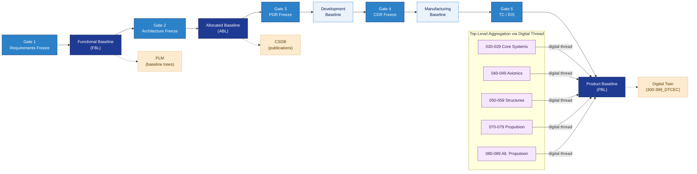

# ATLAS 000-009 · 00.001.001 — Configuration Baseline

## 1. Purpose

Defines the **top-level aircraft configuration baseline** for the AMPEL360 programme: what constitutes a baseline, how baselines are established at lifecycle gates, how they are frozen and released, and how the top-level baseline aggregates subsystem baselines via the digital thread.

This subsubject is part of the **ATLAS-1000** register, a subpart of the controlled **Q+ATLANTIDE** baseline[^baseline][^n001].

## 2. Scope

### 2.1 Baseline Definition

A **configuration baseline** is a formally reviewed and agreed-upon description of the functional and physical characteristics of a configuration item (CI) at a defined lifecycle point. At the top level maintained by this Subject, the CI is the **AMPEL360 aircraft** as a complete integrated system.

Three classical baseline types are recognised:

| Type | Definition | AMPEL360 Lifecycle Gate |
|---|---|---|
| **Functional Baseline (FBL)** | Defines the aircraft's top-level performance requirements and constraints. | Gate 1 — Requirements Freeze |
| **Allocated Baseline (ABL)** | Allocates top-level requirements to subsystem configuration items. | Gate 2 — Architecture Freeze |
| **Product Baseline (PBL)** | Fully defines the aircraft as built, including all part numbers, software loads and certification status. | Gate 5 — Type Certificate / Entry Into Service |

Two intermediate baselines support production and delivery:

| Type | Definition | AMPEL360 Lifecycle Gate |
|---|---|---|
| **Development Baseline** | Configuration released for development activities (PDR-equivalent). | Gate 3 — PDR Freeze |
| **Manufacturing Baseline** | Configuration released for manufacturing (CDR-equivalent). | Gate 4 — CDR Freeze |

### 2.2 Lifecycle Gates

Baseline establishment follows the ATLAS-governed lifecycle gate structure:

| Gate | Name | Baseline Action |
|---|---|---|
| Gate 1 | Requirements Freeze | Establish Functional Baseline; enter FBL into PLM with status `FROZEN` |
| Gate 2 | Architecture Freeze | Establish Allocated Baseline; publish ABL data modules to CSDB |
| Gate 3 | PDR Freeze | Establish Development Baseline; freeze top-level CI tree |
| Gate 4 | CDR Freeze | Establish Manufacturing Baseline; lock part-number structure |
| Gate 5 | TC / EIS | Establish Product Baseline; close all open FBL/ABL discrepancies |

Change after gate freeze requires a Class I change order (see `005_Configuration-Control-and-Change-Management.md`).

### 2.3 Baseline Audit Trail

Every baseline establishment event shall produce an auditable record containing:

- Baseline identifier (see `000_Identificacion/README.md` for naming convention)
- Gate reference and date
- Authorising CCB resolution number
- PLM baseline snapshot reference (version hash or tag)
- CSDB publication reference (data module code list)
- Digital twin snapshot identifier (cross-ref `300-399_DTCEC/`)

All records are maintained in PLM as baseline audit packages and referenced in the CSDB as supporting DMs.

### 2.4 Top-Level Aggregation via Digital Thread

The top-level baseline is **not** a flat list of all part numbers. It is a **pointer structure** that references subsystem baselines managed within their respective Code ranges:

| Code Range | Domain | Baseline Aggregation Point |
|---|---|---|
| `020-029` | Core Aircraft Systems | Core systems configuration item tree |
| `040-049` | Avionics & Information | Software load list, avionics configuration |
| `050-059` | Primary Structures | Structural modification record |
| `070-079` | Eco-Tech & Hybrid-Electric Propulsion | Propulsion variant baseline |
| `080-089` | Alternative & Quantum Propulsion | Demonstrator baseline |

The digital thread in `300-399_DTCEC/` provides the traceability links that connect subsystem baselines to this top-level baseline. The top-level baseline *aggregates* subsystem baselines; it does not duplicate their content.

### 2.5 Freeze and Release Procedure

1. CCB authorises baseline freeze (resolution logged in `005_Configuration-Control-and-Change-Management.md`).
2. PLM baseline is tagged and set to `FROZEN` status — no further changes without Class I change order.
3. CSDB publication is triggered; effectivity filters applied (see `002_Effectivity-and-Applicability.md`).
4. Baseline audit package assembled and stored in evidence archive.
5. Downstream subsystem Code ranges notified via digital thread update.
6. Baseline identifier published and cross-referenced in [`000_Identificacion/README.md`](../000_Identificacion/README.md) (subsection index for identification).

## 3. Diagram

*Solid arrows show the lifecycle gate → baseline progression; dotted arrows show baseline type → system synchronisation. Subsystem baselines aggregate into the top-level PBL via the digital thread.*

## 4. Footprint

| Metric | Value |
|---|---|
| Architecture | `ATLAS` — Aircraft Top Level Architecture Schema/System (controlled term) |
| Master range | `000–099` |
| Code range | `000-009` |
| Section | `00` — Información General y Servicio |
| Subsection | `001` — Configuración |
| Subsubject | `001` — Configuration Baseline |
| Primary Q-Division | Q-DATAGOV[^qdiv] |
| Support Q-Divisions | Q-GROUND, Q-AIR |
| ORB support | ORB-PMO, ORB-LEG |
| Governance class | `baseline`[^gov] |
| Folder path | `Q+ATLANTIDE/000-099_ATLAS/000-009_Informacion-General-y-Servicio/001_Configuracion/` |
| Document | `001_Configuration-Baseline.md` (this file) |
| Parent subsection | [`README.md`](./README.md) |
| Cross-ref: baseline identifier | Configuration Identification document (path pending correction) |
| Cross-ref: change control | [`005_Configuration-Control-and-Change-Management.md`](./005_Configuration-Control-and-Change-Management.md) |
| Cross-ref: effectivity | [`002_Effectivity-and-Applicability.md`](./002_Effectivity-and-Applicability.md) |
| Cross-ref: digital twin | `Q+ATLANTIDE/300-399_DTCEC/` |

## 5. References & Citations

[^baseline]: **Q+ATLANTIDE controlled baseline (v1.0.0)** — [`organization/Q+ATLANTIDE.md`](../../../../organization/Q+ATLANTIDE.md).

[^archtable]: **§3 — Architecture Table (parent)** — [`../../README.md` §3](../../README.md#3-architecture-table).

[^qdiv]: **Q-Division authority** — [`organization/Q-Divisions/`](../../../../organization/Q-Divisions/).

[^gov]: **Governance class** — `baseline` denotes documents under controlled change management within the Q+ATLANTIDE baseline.

[^ata2200]: **ATA iSpec 2200** — Airlines Electronic Engineering Committee (AEEC) specification for aircraft information management.

[^ataspec100]: **ATA Spec 100** — Historical ATA chapter numbering standard; predecessor to iSpec 2200.

[^s1000d]: **S1000D** — International specification for technical publications; defines CSDB, data module, applicability (ACT/PCT/CCT), and effectivity framework.

[^as9100d]: **AS9100D** — Quality management system standard for the aviation, space and defence industry; mandates configuration management procedures.

[^n001]: **Note N-001** — Q+ATLANTIDE (with its ATLAS-1000 register subpart) is a taxonomy and traceability ecosystem, not an organization chart. See [`organization/Q+ATLANTIDE.md` §4](../../../../organization/Q+ATLANTIDE.md#4-notes).
