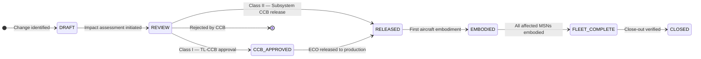
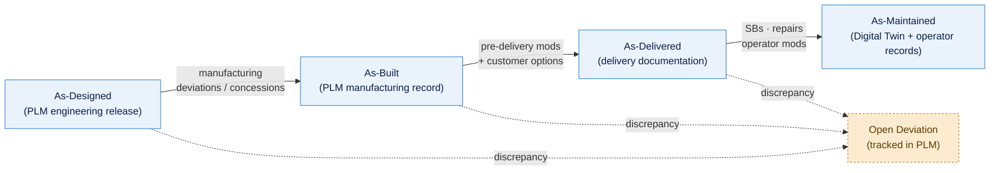

# ATLAS 000-009 · 00.001.003 — Modification Status

## 1. Purpose

Defines the **top-level aircraft modification status accounting (MSA)** framework for AMPEL360: modification record format, the ECO (Engineering Change Order) lifecycle, Service Bulletin tracking, embodiment status per aircraft serial number, and the as-designed / as-built / as-delivered / as-maintained state model.

This subsubject is part of the **ATLAS-1000** register, a subpart of the controlled **Q+ATLANTIDE** baseline[^baseline][^n001].

## 2. Scope

### 2.1 Top-Level Scope Principle

The modification status maintained here records modifications that affect the **aircraft as a system** — changes that cross subsystem boundaries, affect the top-level baseline, or require top-level CCB approval. Component-level modifications (e.g. a valve part-number change) live in their respective Code ranges and aggregate to this Subject only when they affect the top-level configuration state. The aggregation trigger is defined in `005_Configuration-Control-and-Change-Management.md` §2.3.

### 2.2 Modification Record Format

Each top-level modification record shall contain the following fields:

| Field | Description | Example |
|---|---|---|
| `mod_id` | Unique modification identifier | `MOD-AMPEL360-0042` |
| `title` | Short descriptive title | `Wing-body fairing revised geometry` |
| `eco_ref` | Engineering Change Order reference | `ECO-2025-0217` |
| `sb_ref` | Service Bulletin reference (if applicable) | `SB-AMPEL360-00-042` |
| `class` | Change class (Class I / Class II) | `Class I` |
| `affected_baseline` | Baseline(s) impacted | `ABL-2025-R2`, `PBL-0001` |
| `effectivity` | Aircraft applicability (MSN range or condition) | `msn=0001-0050` |
| `status` | Current lifecycle status | `EMBODIED` |
| `embodiment_date` | Date of first embodiment on production aircraft | `2026-03-15` |
| `source_code_range` | Code range raising the modification | `050-059` (Structures) |
| `top_level_impact` | Reason the modification affects the top-level baseline | `Changes certified structural weight` |

### 2.3 Modification Status Accounting (MSA)

MSA is the process of tracking and reporting the modification state of each aircraft in the AMPEL360 fleet. The MSA record for each aircraft (identified by MSN) is the definitive statement of which modifications are embodied on that aircraft.

MSA is maintained in PLM as part of the configuration item tree. The CSDB `modStatus` ACT property (defined in `002_Effectivity-and-Applicability.md`) is derived from the PLM MSA record at each publication cycle.

### 2.4 ECO Lifecycle

An Engineering Change Order (ECO) is the formal mechanism for implementing a modification. Top-level ECO lifecycle states:

| State | Description |
|---|---|
| `DRAFT` | Change identified; impact not yet assessed |
| `REVIEW` | Under engineering review and impact assessment |
| `CCB-APPROVED` | Approved by top-level CCB (see `005_Configuration-Control-and-Change-Management.md`) |
| `RELEASED` | Released for incorporation into drawings, specifications, PLM |
| `EMBODIED` | Incorporated on at least one production aircraft |
| `FLEET-COMPLETE` | Incorporated on all affected aircraft |
| `CLOSED` | Closed; no further action required |

### 2.5 Service Bulletin Tracking

Service Bulletins (SBs) are issued by the manufacturer to implement design changes on in-service aircraft. Each SB maps to one or more ECOs. Top-level SB attributes tracked here:

| Field | Description |
|---|---|
| `sb_number` | Controlled SB number | 
| `category` | `MANDATORY` / `RECOMMENDED` / `OPTIONAL` |
| `compliance_date` | Regulatory compliance date (if mandatory) |
| `affected_msn` | MSN range or list |
| `embodiment_status_per_msn` | Per-aircraft embodiment tracking (linked to MSA record in PLM) |

### 2.6 As-Designed / As-Built / As-Delivered / As-Maintained State Model

The full configuration lifecycle of an individual aircraft is captured across four states:

| State | Definition | Maintained By |
|---|---|---|
| **As-Designed** | Configuration as specified in drawings and specifications at CDR-equivalent gate | PLM (engineering release) |
| **As-Built** | Configuration as actually manufactured at the factory, including manufacturing deviations and concessions | PLM (manufacturing record) |
| **As-Delivered** | Configuration at point of delivery to operator, including all pre-delivery modifications and customer-specific options | Delivery documentation package |
| **As-Maintained** | Configuration as it exists in service, including all embodied SBs, repairs and operator modifications | Operator records + digital twin (`300-399_DTCEC/`) |

Discrepancies between these states shall be recorded as open deviations in PLM and tracked until resolved or accepted by the competent authority.

## 3. Diagram

*Top diagram: ECO lifecycle state machine. Bottom diagram: aircraft configuration states across its lifecycle; dotted arrows indicate discrepancy-tracking deviations recorded in PLM.*

## 4. Footprint

| Metric | Value |
|---|---|
| Architecture | `ATLAS` — Aircraft Top Level Architecture Schema/System (controlled term) |
| Master range | `000–099` |
| Code range | `000-009` |
| Section | `00` — Información General y Servicio |
| Subsection | `001` — Configuración |
| Subsubject | `003` — Modification Status |
| Primary Q-Division | Q-DATAGOV[^qdiv] |
| Support Q-Divisions | Q-GROUND, Q-AIR |
| ORB support | ORB-PMO, ORB-LEG |
| Governance class | `baseline`[^gov] |
| Folder path | `Q+ATLANTIDE/000-099_ATLAS/000-009_Informacion-General-y-Servicio/001_Configuracion/` |
| Document | `003_Modification-Status.md` (this file) |
| Parent subsection | [`README.md`](./README.md) |
| Cross-ref: effectivity | [`002_Effectivity-and-Applicability.md`](./002_Effectivity-and-Applicability.md) |
| Cross-ref: change control | [`005_Configuration-Control-and-Change-Management.md`](./005_Configuration-Control-and-Change-Management.md) |
| Cross-ref: digital twin | `Q+ATLANTIDE/300-399_DTCEC/` |

## 5. References & Citations

[^baseline]: **Q+ATLANTIDE controlled baseline (v1.0.0)** — [`organization/Q+ATLANTIDE.md`](../../../../organization/Q+ATLANTIDE.md).

[^archtable]: **§3 — Architecture Table (parent)** — [`../../README.md` §3](../../README.md#3-architecture-table).

[^qdiv]: **Q-Division authority** — [`organization/Q-Divisions/`](../../../../organization/Q-Divisions/).

[^gov]: **Governance class** — `baseline` denotes documents under controlled change management within the Q+ATLANTIDE baseline.

[^ata2200]: **ATA iSpec 2200** — Airlines Electronic Engineering Committee (AEEC) specification; defines modification record format and SB tracking conventions.

[^ataspec100]: **ATA Spec 100** — Historical ATA chapter numbering standard.

[^s1000d]: **S1000D** — International specification for technical publications; defines `modStatus` applicability property and CSDB SB data module types.

[^as9100d]: **AS9100D** — Quality management system standard for aviation, space and defence; mandates configuration status accounting and change records.

[^n001]: **Note N-001** — Q+ATLANTIDE (with its ATLAS-1000 register subpart) is a taxonomy and traceability ecosystem, not an organization chart. See [`organization/Q+ATLANTIDE.md` §4](../../../../organization/Q+ATLANTIDE.md#4-notes).
