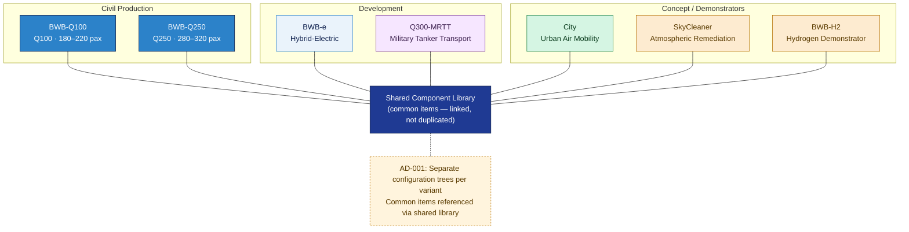

# ATLAS 000-009 · 00.001.004 — Variant and Option Catalog

## 1. Purpose

Catalogues the **AMPEL360 aircraft family variants**, defines option codes and cabin configurations, and records the **architectural decision** governing how variants are managed across the PLM, CSDB and digital twin. This document is where the AMPEL360 family becomes governable.

This subsubject is part of the **ATLAS-1000** register, a subpart of the controlled **Q+ATLANTIDE** baseline[^baseline][^n001].

## 2. Scope

### 2.1 AMPEL360 Family Variants

The following seven variants constitute the AMPEL360 declared family as of baseline v1.0.0:

| Variant Designator | Common Name | Domain | Environment | Lifecycle Status |
|---|---|---|---|---|
| `BWB-Q100` | AMPEL360 Q100 | Commercial short-to-medium haul | Civil | Production |
| `BWB-Q250` | AMPEL360 Q250 | Commercial medium-to-long haul | Civil | Production |
| `BWB-e` | AMPEL360 Electric | Hybrid-electric commercial | Civil | Development |
| `Q300-MRTT` | AMPEL360 MRTT | Multi-Role Tanker Transport | Military | Development |
| `City` | AMPEL360 City | Urban air mobility / short haul | Civil | Concept |
| `SkyCleaner` | AMPEL360 Sky Cleaner | Atmospheric remediation demonstrator | Civil / Research | Demonstrator |
| `BWB-H2` | AMPEL360 H2 | Hydrogen propulsion demonstrator | Civil / Research | Demonstrator |

Designators in this table are controlled; all downstream documents, PLM configurations, CSDB ACT entries and digital twin instances shall use the exact `variant` values from column 1.

Authoritative type designators (formal type certificate designations, ICAO type codes) are maintained in `099_Type-Identification-and-Designator-Registry/`. This catalog provides the *configuration* view; that registry provides the *identification* view.

### 2.2 Option Codes

Option codes are applied on the `optAxis` ACT property (defined in `002_Effectivity-and-Applicability.md`). Options are grouped by axis:

| Option Axis | Code | Description | Compatible Variants |
|---|---|---|---|
| Cabin | `PAX-180` | 180-seat single-class | `BWB-Q100` |
| Cabin | `PAX-220` | 220-seat dual-class | `BWB-Q100` |
| Cabin | `PAX-280` | 280-seat dual-class | `BWB-Q250` |
| Cabin | `PAX-320` | 320-seat tri-class | `BWB-Q250` |
| Mission Kit | `MRTT-BASIC` | Tanker / transport basic kit | `Q300-MRTT` |
| Mission Kit | `MRTT-FULL` | Full MRTT kit (tanker + troop + medical) | `Q300-MRTT` |
| Cargo | `FREIGHTER` | Freight conversion | `BWB-Q100`, `BWB-Q250` |
| Demonstrator | `DEMO-H2` | Hydrogen demonstrator configuration | `BWB-H2` |
| Demonstrator | `DEMO-CLEAN` | Atmospheric remediation configuration | `SkyCleaner` |

### 2.3 Architectural Decision: Variant Tree Structure

**Decision AD-001 (recorded here, effective at baseline v1.0.0):**

> **The AMPEL360 family is managed as *separate configuration trees*, one per variant, with common items cross-referenced via a shared component library.**

**Justification:**

Two architectural options were considered:

| Option | Description | Pros | Cons |
|---|---|---|---|
| **Option A — Separate trees** *(selected)* | Each variant has its own PLM baseline tree. Common parts exist as shared library items linked into each tree. | Clean variant isolation; no accidental cross-contamination of changes; clear certification boundary per variant; simpler supplier coordination (each supplier receives variant-specific package) | Some duplication in common item management; cross-variant change propagation requires explicit action |
| **Option B — Shared tree with flags** | Single PLM baseline tree; items flagged by `variant` attribute. Variant-specific configurations derived by filtering. | Single source of truth for common items; automatic propagation of common changes | Risk of unintended change propagation across variants; complex effectivity expressions; difficult to partition for different certification authorities; harder to scope supplier deliverables |

**Decision rationale:** The AMPEL360 family spans civil and military variants (`Q300-MRTT`), demonstrators with different certification basis (`BWB-H2`, `SkyCleaner`), and variants under different regulatory jurisdictions. A shared tree with flags would create unacceptable risk of cross-contamination between variants with different certification bases. Separate trees with a shared component library provide clean isolation at the cost of explicit cross-variant change management.

**Cascading implications of this decision:**

| Domain | Implication |
|---|---|
| PLM tooling | PLM must support multiple product configurations with shared component library linking. Each variant has a named PLM baseline tree. |
| Supplier coordination | Supplier deliverables are scoped per variant. Suppliers receive variant-specific bills of materials, not a filtered view of a shared tree. |
| CSDB structure | One CSDB publication set per variant family group (civil / military / demonstrator). ACT `variant` property used to select applicable data modules within each set. |
| Digital twin | One digital twin instance per individual aircraft (MSN-level). Twin configuration state derived from the variant tree of that MSN's variant designator. |
| Evidence packages | Certification evidence packages are assembled per variant. No shared certification package across variants. |
| `099_Type-Identification-and-Designator-Registry/` | Each variant listed in the registry with its own type designator, certification basis and program code. |

This decision shall be re-evaluated at Gate 3 (PDR Freeze) if variant count or commonality assumptions change materially.

### 2.4 Common Component Library

Common items shared across variants are maintained in a **shared component library** within PLM, referenced (not duplicated) in each variant's tree. The boundary between "common" and "variant-specific" is:

- **Common**: items identical in design, part number and certification status across all variants that use them.
- **Variant-specific**: items that differ in any of design, part number, material, or certification basis between variants.

Modifications to common library items require CCB approval from all variant programmes using the item. Procedure defined in `005_Configuration-Control-and-Change-Management.md` §2.5.

## 3. Diagram

*Each variant has its own independent configuration tree (Decision AD-001). Common items connect to the shared library (solid lines) — they are linked, never duplicated. The library change procedure requires TL-CCB approval from all affected variant programmes.*

## 4. Footprint

| Metric | Value |
|---|---|
| Architecture | `ATLAS` — Aircraft Top Level Architecture Schema/System (controlled term) |
| Master range | `000–099` |
| Code range | `000-009` |
| Section | `00` — Información General y Servicio |
| Subsection | `001` — Configuración |
| Subsubject | `004` — Variant and Option Catalog |
| Primary Q-Division | Q-DATAGOV[^qdiv] |
| Support Q-Divisions | Q-GROUND, Q-AIR, Q-HORIZON |
| ORB support | ORB-PMO, ORB-LEG, ORB-MKTG |
| Governance class | `baseline`[^gov] |
| Folder path | `Q+ATLANTIDE/000-099_ATLAS/000-009_Informacion-General-y-Servicio/001_Configuracion/` |
| Document | `004_Variant-and-Option-Catalog.md` (this file) |
| Parent subsection | [`README.md`](./README.md) |
| Cross-ref: type designators | `Q+ATLANTIDE/000-099_ATLAS/090-099_Tipos-Especificos-y-Expansion/099_Type-Identification-and-Designator-Registry/` |
| Cross-ref: effectivity / ACT | [`002_Effectivity-and-Applicability.md`](./002_Effectivity-and-Applicability.md) |
| Cross-ref: CCB | [`005_Configuration-Control-and-Change-Management.md`](./005_Configuration-Control-and-Change-Management.md) |
| Architectural decision | AD-001 — Separate variant trees (recorded in §2.3) |

## 5. References & Citations

[^baseline]: **Q+ATLANTIDE controlled baseline (v1.0.0)** — [`organization/Q+ATLANTIDE.md`](../../../../organization/Q+ATLANTIDE.md).

[^archtable]: **§3 — Architecture Table (parent)** — [`../../README.md` §3](../../README.md#3-architecture-table).

[^qdiv]: **Q-Division authority** — [`organization/Q-Divisions/`](../../../../organization/Q-Divisions/).

[^gov]: **Governance class** — `baseline` denotes documents under controlled change management within the Q+ATLANTIDE baseline.

[^ata2200]: **ATA iSpec 2200** — Airlines Electronic Engineering Committee (AEEC) specification for aircraft information management; variant and option code conventions.

[^ataspec100]: **ATA Spec 100** — Historical ATA chapter numbering standard.

[^s1000d]: **S1000D** — International specification for technical publications; variant and option applicability via ACT `variant` and `optAxis` properties.

[^as9100d]: **AS9100D** — Quality management system standard for aviation, space and defence industry; configuration management for product families.

[^n001]: **Note N-001** — Q+ATLANTIDE (with its ATLAS-1000 register subpart) is a taxonomy and traceability ecosystem, not an organization chart. See [`organization/Q+ATLANTIDE.md` §4](../../../../organization/Q+ATLANTIDE.md#4-notes).
