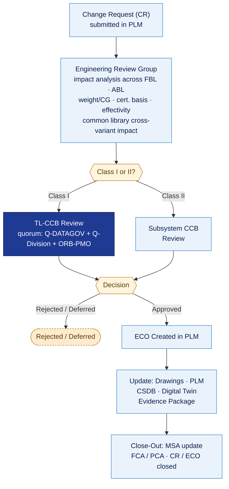
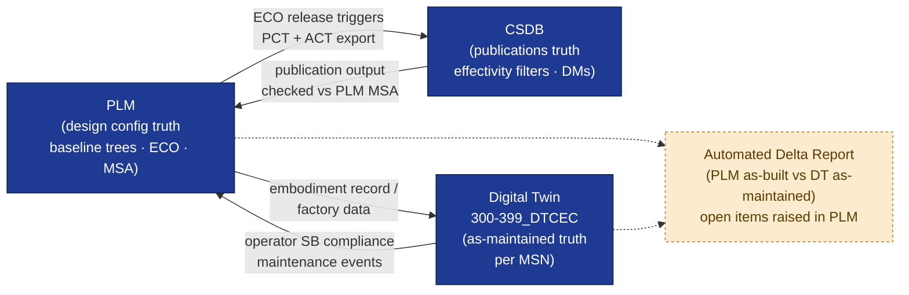

# ATLAS 000-009 · 00.001.005 — Configuration Control and Change Management

## 1. Purpose

Defines the **top-level Change Control Board (CCB) procedures**, change classification (Class I / II), impact assessment workflow, Functional Configuration Audit (FCA) and Physical Configuration Audit (PCA), and the synchronisation of configuration state between PLM, CSDB, evidence packages and the digital twin.

This subsubject is part of the **ATLAS-1000** register, a subpart of the controlled **Q+ATLANTIDE** baseline[^baseline][^n001].

## 2. Scope

### 2.1 Top-Level Scope Principle

The CCB described in this document (the **Top-Level CCB**, hereafter TL-CCB) governs changes that affect the **top-level aircraft baseline** as defined in `001_Configuration-Baseline.md`. Subsystem Code ranges operate their own **Subsystem CCBs** within their Q-Divisions. A subsystem change escalates to the TL-CCB when it:

- Modifies a top-level requirement or allocated baseline item;
- Affects the top-level aircraft weight, CG, performance envelope or certification basis;
- Crosses the boundary of two or more Code ranges;
- Affects a common component library item used by multiple variants (see `004_Variant-and-Option-Catalog.md` §2.4);
- Changes the effectivity or applicability rules defined in `002_Effectivity-and-Applicability.md`.

Changes that do not cross any of these lines are resolved within the subsystem CCB and appear in this Subject only as aggregated modification records (see `003_Modification-Status.md` §2.1).

### 2.2 Change Classification

| Class | Description | Authority | Examples |
|---|---|---|---|
| **Class I** | Change to the approved configuration baseline; impacts performance, safety, airworthiness, cost, schedule, or certification basis. Requires TL-CCB approval. | TL-CCB + competent authority (EASA/FAA) if certification impact | Structural redesign, propulsion system change, cross-variant common item modification, effectivity rule change |
| **Class II** | Minor change; no impact to approved baseline; corrects errors, improves clarity, or incorporates minor improvements within existing tolerances. Subsystem CCB authority. | Subsystem CCB | Drawing correction, material substitution within qualified equivalents, minor tolerance revision |

Class determination shall be documented in the impact assessment (§2.3) before CCB review.

### 2.3 Impact Assessment Workflow

### 2.4 Functional Configuration Audit (FCA) and Physical Configuration Audit (PCA)

#### FCA — Functional Configuration Audit

The FCA verifies that the aircraft (or aircraft subsystem) achieves the performance and functional characteristics defined in the Functional Baseline. FCA is conducted:

- Before Allocated Baseline establishment (Gate 2)
- After any Class I change affecting functional performance
- As a regulatory milestone per EASA CS-25 / FAA FAR Part 25 certification schedule

FCA evidence is archived as a CSDB supporting data module (DM type: `DESCRIPT`) and linked to the baseline audit package in PLM.

#### PCA — Physical Configuration Audit

The PCA verifies that the as-built aircraft matches the Product Baseline documentation. PCA is conducted:

- Before first delivery (PBL establishment, Gate 5)
- After major modifications affecting the as-built record
- As required by customer acceptance procedure

PCA findings are recorded as deviations in PLM. Accepted deviations are documented in the as-delivered configuration record. Unaccepted deviations must be resolved before delivery.

### 2.5 Common Component Library Change Procedure

Changes to common library items (shared across variants; see `004_Variant-and-Option-Catalog.md` §2.4) require:

1. Impact assessment performed for *all* variants using the item.
2. TL-CCB quorum must include representatives of all affected variant programmes.
3. Effectivity rules in `002_Effectivity-and-Applicability.md` updated to reflect any variant-specific phasing.
4. All affected variant PLM baseline trees updated within the same ECO release.

### 2.6 PLM / CSDB / Digital Twin Synchronisation

Configuration state is maintained across three systems that must remain synchronised:

| System | Role | Synchronisation Trigger |
|---|---|---|
| **PLM** | Source of truth for design configuration; maintains baseline trees, ECO records, MSA | All ECO releases; baseline freeze events |
| **CSDB** | Source of truth for technical publications; effectivity filters derived from PLM PCT | Each baseline release; each SB publication |
| **Digital Twin (`300-399_DTCEC/`)** | Source of truth for as-maintained configuration state per MSN | Each embodied modification; each operator SB compliance report |

Synchronisation procedure:

1. PLM ECO released → triggers CSDB export job → updates PCT and ACT in CSDB.
2. CSDB publication regenerated with updated effectivity → output checked against PLM MSA.
3. Digital twin configuration state updated via API from operator maintenance system or factory embodiment record.
4. Discrepancy detection: automated delta report generated between PLM as-built record and digital twin as-maintained state. Discrepancies raised as open items in PLM.
5. Evidence package updated with synchronisation audit trail.

## 3. Diagram

*Top diagram: CCB impact assessment workflow (§2.3). Bottom diagram: PLM / CSDB / Digital Twin synchronisation model (§2.6). The three systems form a closed loop; discrepancies surface as open items in PLM.*

## 4. Footprint

| Metric | Value |
|---|---|
| Architecture | `ATLAS` — Aircraft Top Level Architecture Schema/System (controlled term) |
| Master range | `000–099` |
| Code range | `000-009` |
| Section | `00` — Información General y Servicio |
| Subsection | `001` — Configuración |
| Subsubject | `005` — Configuration Control and Change Management |
| Primary Q-Division | Q-DATAGOV[^qdiv] |
| Support Q-Divisions | Q-GROUND, Q-AIR |
| ORB support | ORB-PMO, ORB-LEG |
| Governance class | `baseline`[^gov] |
| Folder path | `Q+ATLANTIDE/000-099_ATLAS/000-009_Informacion-General-y-Servicio/001_Configuracion/` |
| Document | `005_Configuration-Control-and-Change-Management.md` (this file) |
| Parent subsection | [`README.md`](./README.md) |
| Cross-ref: baseline | [`001_Configuration-Baseline.md`](./001_Configuration-Baseline.md) |
| Cross-ref: effectivity | [`002_Effectivity-and-Applicability.md`](./002_Effectivity-and-Applicability.md) |
| Cross-ref: modification status | [`003_Modification-Status.md`](./003_Modification-Status.md) |
| Cross-ref: variant catalog | [`004_Variant-and-Option-Catalog.md`](./004_Variant-and-Option-Catalog.md) |
| Cross-ref: digital twin | `Q+ATLANTIDE/300-399_DTCEC/` |

## 5. References & Citations

[^baseline]: **Q+ATLANTIDE controlled baseline (v1.0.0)** — [`organization/Q+ATLANTIDE.md`](../../../../organization/Q+ATLANTIDE.md).

[^archtable]: **§3 — Architecture Table (parent)** — [`../../README.md` §3](../../README.md#3-architecture-table).

[^qdiv]: **Q-Division authority** — [`organization/Q-Divisions/`](../../../../organization/Q-Divisions/).

[^gov]: **Governance class** — `baseline` denotes documents under controlled change management within the Q+ATLANTIDE baseline.

[^ata2200]: **ATA iSpec 2200** — Airlines Electronic Engineering Committee (AEEC) specification; change control and configuration audit procedures.

[^ataspec100]: **ATA Spec 100** — Historical ATA chapter numbering standard.

[^s1000d]: **S1000D** — International specification for technical publications; defines CSDB update procedures, data module revision and applicability synchronisation.

[^as9100d]: **AS9100D** — Quality management system standard for aviation, space and defence industry; mandates CCB procedures, FCA/PCA and configuration audit evidence.

[^n001]: **Note N-001** — Q+ATLANTIDE (with its ATLAS-1000 register subpart) is a taxonomy and traceability ecosystem, not an organization chart. See [`organization/Q+ATLANTIDE.md` §4](../../../../organization/Q+ATLANTIDE.md#4-notes).
