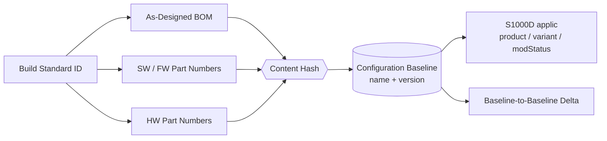

# ATLAS 000-009 · Section 00 · Subsection 001 · Subsubject 001 — Configuration Baseline

## 1. Purpose

Defines the **configuration baseline** for an airframe instance under ATLAS `000-009.001` *configuración*: the named, versioned reference state (build standard, software/hardware part numbers, BOM hash) against which all subsequent modifications are measured. The baseline is the anchor for downstream effectivity evaluation and is published as S1000D applicability conditions on the ATA iSpec 2200 / Spec 100 information set[^ata2200][^ataspec100][^s1000d], in conformance with the controlled Q+ATLANTIDE baseline[^baseline].

## 2. Scope

- Covers the *Configuration Baseline* subsubject (`01`) of subsection `001` *configuración* within section `00` *Información General y Servicio*.
- Inherits Q-Division authority and ORB support from the parent row in [`../../README.md` §3](../../README.md#3-architecture-table)[^archtable].
- Artefact classes in scope: **Build Standard ID**, **As-Designed / As-Built / As-Maintained BOM**, **baseline hash**, **baseline version label**, baseline-to-baseline delta records.
- Baselines are surfaced as S1000D `applic` properties (e.g. `product`, `variant`, `modStatus`) on the ATA iSpec 2200 information set[^ata2200][^s1000d] and quality-controlled per AS9100D[^as9100d].

## 3. Diagram

The diagram below shows how the named **Build Standard** is composed from the BOM, software/hardware part numbers and a content hash to produce a versioned **Configuration Baseline** that anchors downstream applicability evaluation.

## 4. Footprint

| Metric | Value |
|---|---|
| Architecture | `ATLAS` — Aircraft Top-Level Architecture System |
| Master range | `000–099` |
| Code range | `000-009` |
| Section | `00` — Información General y Servicio |
| Subject | `00` — General Information |
| Subsection | `001` — configuración |
| Subsubject | `001` — Configuration Baseline |
| Primary Q-Division | Q-DATAGOV[^qdiv] |
| Support Q-Divisions | Q-GROUND, Q-AIR |
| ORB support | ORB-PMO, ORB-LEG |
| Governance class | `baseline`[^gov] |
| Folder path | `Q+ATLANTIDE/000-099_ATLAS/000-009_Informacion-General-y-Servicio/001_configuracion/` |
| Document | `001_Configuration-Baseline.md` (this file) |
| Parent subsection | [`000_Overview.md`](./000_Overview.md) |
| Parent architecture | [`../../README.md`](../../README.md) |
| Parent baseline | [`organization/Q+ATLANTIDE.md`](../../../../organization/Q+ATLANTIDE.md) |

## 5. References & Citations

[^baseline]: **Q+ATLANTIDE controlled baseline (v1.0.0)** — [`organization/Q+ATLANTIDE.md`](../../../../organization/Q+ATLANTIDE.md). Defines the controlled `000-999` architecture-band taxonomy and the ATLAS-1000 register subpart.

[^archtable]: **ATLAS §3 Architecture Table** — [`../../README.md` §3](../../README.md#3-architecture-table). Authoritative source for the `000-009` row (Section `00` — Información General y Servicio, Primary Q-Division Q-DATAGOV).

[^qdiv]: **Q-Division authority** — Q-Divisions provide technical authority over an architecture row (Q+ATLANTIDE Note N-002). See [`organization/Q+ATLANTIDE.md` §4](../../../../organization/Q+ATLANTIDE.md#4-notes).

[^gov]: **Governance class** — Bands are classified as `baseline` or `restricted` per Q+ATLANTIDE §4 governance rules.

[^ata2200]: **ATA iSpec 2200 — Information Standards for Aviation Maintenance** — Industry standard for digital aircraft maintenance information; governs chapter / section / subject numbering inherited by ATLAS `000-099`.

[^ataspec100]: **ATA Spec 100 — Manufacturers' Technical Data** — Predecessor numbering scheme that established the 00–99 chapter map mirrored by ATLAS sub-ranges.

[^s1000d]: **S1000D Issue 6.0 — International specification for technical publications** — Common Source DataBase (CSDB) and Data Module Code (DMC) specification used across ATLAS technical publications.

[^as9100d]: **AS9100D — Quality Management Systems — Aviation, Space and Defense Organizations** — Quality-management baseline for all Q+ATLANTIDE deliverables.

### Applicable industry standards

The following ATA-family and industry standards apply to this subsubject in addition to the cross-cutting Q+ATLANTIDE governance:

- ATA iSpec 2200 — Information Standards for Aviation Maintenance[^ata2200]
- ATA Spec 100 — Manufacturers' Technical Data[^ataspec100]
- S1000D Issue 6.0 — International specification for technical publications[^s1000d]
- AS9100D — Quality Management Systems — Aviation, Space and Defense Organizations[^as9100d]
