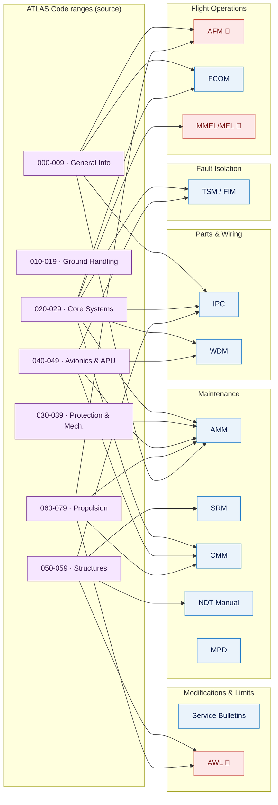

# ATLAS 000-009 · 00.002.001 — Publication Set and Manual Map

## 1. Purpose

Defines the **canonical publication set** for the Q+ programme — the complete list of technical publications produced — and establishes the **manual map**: the navigational chart between the ATLAS schema (Code ranges and Subjects) and the delivered commercial technical manuals.

This document is the most structurally important in the `002_Documentacion-General` subsection. Without a canonical, programme-level manual map, each Code range will define locally which manual it contributes to and inconsistencies will arise (the same procedure appearing in both AMM and CMM, or in neither; coverage gaps invisible until audit). The mapping here is **authoritative**: a 1-to-1 or controlled 1-to-N assignment between Subjects and their owning manuals.

This document links to the controlled Q+ATLANTIDE baseline[^baseline] and to the applicable industry standards listed in §4.

## 2. Scope

### 2.1 Canonical publication set

The programme produces the following technical publications. Each publication has a canonical abbreviation, type, and regulatory / customer basis.

| Abbr. | Title | Type | Regulatory / Customer basis |
|---|---|---|---|
| **AMM** | Aircraft Maintenance Manual | Maintenance | EASA Part-145 / FAA AC 43.13 |
| **SRM** | Structural Repair Manual | Structural repair | EASA CS-25 / FAA AC 120-77 |
| **CMM** | Component Maintenance Manual | Component | ATA iSpec 2200 Chapter 5 |
| **IPC** | Illustrated Parts Catalog | Parts | ATA iSpec 2200 Chapter 7 |
| **WDM** | Wiring Diagram Manual | Electrical | ATA iSpec 2200 Chapter 6 |
| **TSM** | Troubleshooting Manual | Fault isolation | ATA iSpec 2200 Chapter 4 |
| **SB** | Service Bulletins | Modification / SB | EASA Form 1 / FAA 8130-3 |
| **AFM** | Aircraft Flight Manual | Flight operations | EASA CS-25.1581 / FAA FAR 25.1581 (regulatory) |
| **FCOM** | Flight Crew Operating Manual | Flight operations | Operator requirement; EASA AMC 25.1585 |
| **MMEL/MEL** | Master Minimum Equipment List / MEL | Dispatch / airworthiness | EASA AMC 25.1309 / FAA MMEL policy |
| **NDT** | Non-Destructive Testing Manual | Inspection | EN 4179 / NAS 410; EASA Part-66 |
| **FIM** | Fault Isolation Manual | Fault isolation | ATA iSpec 2200 Chapter 4 (merged with TSM when applicable) |
| **MPD** | Maintenance Planning Document | Maintenance planning | EASA AMC MSG-3 |
| **AWL** | Airworthiness Limitations | Airworthiness | EASA CS-25.1529 (mandatory section of AMM or separate document) |

### 2.2 Manual-to-ATLAS Code-range map (navigational chart)

This table is the **canonical mapping** between each technical manual and the ATLAS Code ranges / Subjects that populate it. A Subject that is not listed for a given manual does **not** contribute DMs to that manual.

| Manual | Primary ATLAS Code ranges | Notes |
|---|---|---|
| AMM | 000-009 (§002, §003), 010-019, 020-029, 030-039, 040-049, 050-059, 060-069, 070-079, 080-089 | Broadest coverage; all systems contribute maintenance tasks |
| SRM | 050-059 (primary), 030-039 (partial) | Structural Code range is primary SRM source |
| CMM | 020-029, 030-039, 040-049, 060-069, 070-079, 080-089 | Component-level; each removable LRU/SRU contributes a CMM volume |
| IPC | 000-009 through 090-099 (all) | All illustrated parts across all Code ranges |
| WDM | 020-029 (§023 Electrical Power), 040-049 | Electrical architecture and IMA wiring |
| TSM / FIM | 020-029, 030-039, 040-049, 060-069, 070-079, 080-089 | Fault trees and isolation procedures per system |
| SB | All Code ranges | Service Bulletins reference the system Code range they modify |
| AFM | 000-009 (§003 Operaciones Básicas), 060-069, 070-079 | Performance, limitations, emergency procedures; regulatory |
| FCOM | 000-009 (§003), 020-029, 060-069, 070-079 | Normal, abnormal, emergency procedures for crew |
| MMEL/MEL | 020-029, 040-049 | System dispatch items; derived from SSA/FMEA per ATLAS systems |
| NDT Manual | 050-059 (primary), 030-039 | Structural and mechanical inspection procedures |
| MPD | All Code ranges | Maintenance tasks sourced from all AMM-contributing ranges |
| AWL | 050-059, 060-069, 070-079 | Structural and propulsion life limits |

### 2.3 Mapping rules

1. **Canonical assignment**: each Subject within a Code range shall identify, in its subsubject index (README), which manual(s) it contributes DMs to. That declaration must be consistent with the table in §2.2 of this document.
2. **No duplication without control**: a procedure that appears in both AMM and FCOM must be flagged as a **shared DM** with a single authoritative S1000D data module referenced from both publication modules (PM). It is never duplicated as separate source text.
3. **CMM separation**: LRU/SRU component procedures that require a dedicated CMM volume shall be declared as CMM-scope in the originating Subject's subsubject, and shall not appear as standalone tasks in the AMM (AMM references CMM instead).
4. **Regulatory vs. operator manuals**: AFM is regulatory (type-certificate holder controls); FCOM is operator-advisory. Any discrepancy between AFM and FCOM must be resolved in favour of AFM.

## 3. Diagram

*🔴 denotes regulatory manuals (AFM, MMEL, AWL) subject to EASA/FAA approval before distribution. Solid arrows show ATLAS Code range → manual publication contribution.*

## 4. Footprint

| Metric | Value |
|---|---|
| Architecture | `ATLAS` — Aircraft Top Level Architecture Schema/System (controlled term) |
| Master range | `000–099` |
| Code range | `000-009` |
| Section | `00` — Información General y Servicio |
| Subsection | `002` — Documentación General |
| Subsubject | `001` — Publication Set and Manual Map |
| Primary Q-Division | Q-DATAGOV[^qdiv] |
| Support Q-Divisions | Q-GROUND, Q-AIR |
| ORB support | ORB-PMO, ORB-LEG |
| Governance class | `baseline`[^gov] |
| Folder path | `Q+ATLANTIDE/000-099_ATLAS/000-009_Informacion-General-y-Servicio/002_Documentacion-General/` |
| Document | `001_Publication-Set-and-Manual-Map.md` (this file) |
| Parent subsection index | [`README.md`](./README.md) |
| Parent section | [`../README.md`](../README.md) |
| Parent architecture | [`../../README.md`](../../README.md) |
| Parent baseline | [`organization/Q+ATLANTIDE.md`](../../../../organization/Q+ATLANTIDE.md) |

## 5. References & Citations

[^baseline]: **Q+ATLANTIDE controlled baseline (v1.0.0)** — [`organization/Q+ATLANTIDE.md`](../../../../organization/Q+ATLANTIDE.md).

[^archtable]: **§3 — Architecture Table (parent)** — [`../../README.md` §3](../../README.md#3-architecture-table).

[^qdiv]: **Q-Division authority** — [`organization/Q-Divisions/`](../../../../organization/Q-Divisions/).

[^gov]: **Governance class** — `baseline` denotes documents under controlled change management within the Q+ATLANTIDE baseline.

[^ata2200]: **ATA iSpec 2200 — Information Standards for Aviation Maintenance** — Governs the structure, content, and exchange of aircraft maintenance data; defines chapter structure from which this manual list is derived.

[^ataspec100]: **ATA Spec 100 — Manufacturers' Technical Data** — Legacy predecessor to iSpec 2200; normative for legacy publication formats and IPC structure.

[^s1000d]: **S1000D Issue 6.0 — International specification for technical publications** — CSDB and PM structure used for all Q+ATLANTIDE publications. Adopted version declared in `002_S1000D-CSDB-and-Data-Modules.md`.

[^easacs25]: **EASA CS-25 — Certification Specifications for Large Aeroplanes** — Regulatory basis for AFM (CS-25.1581), AWL (CS-25.1529), and MMEL (AMC 25.1309).

[^as9100d]: **AS9100D — Quality Management Systems — Aviation, Space and Defense Organizations** — Quality-management baseline for all Q+ATLANTIDE deliverables.

### Applicable industry standards

- ATA iSpec 2200 — Information Standards for Aviation Maintenance[^ata2200]
- ATA Spec 100 — Manufacturers' Technical Data[^ataspec100]
- S1000D Issue 6.0 — International specification for technical publications[^s1000d]
- EASA CS-25 — Certification Specifications for Large Aeroplanes[^easacs25]
- AS9100D — Quality Management Systems — Aviation, Space and Defense Organizations[^as9100d]
