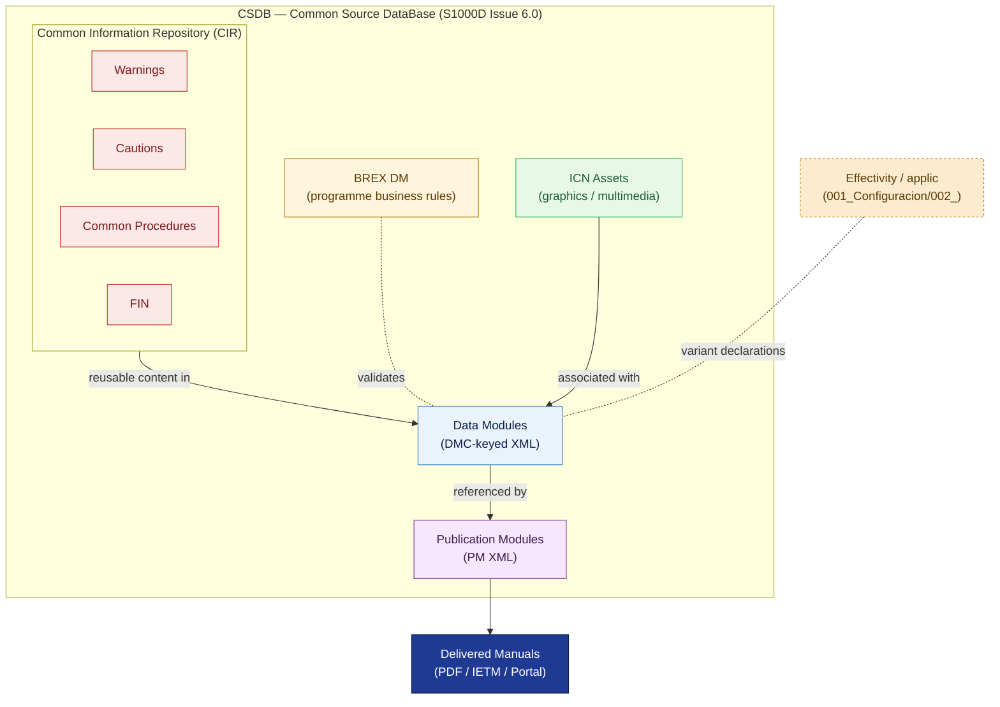

# ATLAS 000-009 · 00.002.002 — S1000D CSDB and Data Modules

## 1. Purpose

Defines the S1000D issue policy adopted by the Q+ programme, the Common Source DataBase (CSDB) infrastructure, Data Module Code (DMC) format, Information Control Number (ICN) namespacing, Business Rules Exchange (BREX) schema, Illustrated Parts Data (IPD) integration, and Common Information Repository (CIR) structure.

**This document establishes the CSDB schema and top-level rules. Individual Data Modules (DMs) live in their respective Code range folders (`020-029/...`, `040-049/...`, etc.) and are registered against the schema defined here.**

This document links to the controlled Q+ATLANTIDE baseline[^baseline] and to the applicable industry standards listed in §4.

## 2. Scope

### 2.1 S1000D version decision

> **Adopted version: S1000D Issue 6.0**
>
> Reference: *S1000D — International specification for technical publications using a Common Source DataBase*, Issue 6.0, ASD/AIA/ATA, 2022.
>
> **Justification**: Issue 6.0 provides the most complete support for XML-based authoring, CSDB management, and applicability filtering required by the Q+ programme's multi-variant aircraft architecture. It aligns with current toolchain capabilities of major CSDB vendors and is the version actively supported by the ASD/AIA/ATA joint steering committee.
>
> **Version against which compliance is measured**: Issue 6.0 (the reference international version).
>
> **Future migration policy**: If the programme requires migration to a later issue (Issue 6.1+), a formal CSDB Migration Plan shall be produced. That plan must address: (1) BREX schema rewrite, (2) DMC format changes, (3) full DM regeneration and re-validation, (4) toolchain update and re-qualification, and (5) re-submission to all distribution authorities. Migration is a **Major Baseline Event** and requires Engineering Change Order (ECO) authority. Migration shall not be undertaken without completing all five steps.

#### S1000D version comparison summary

| Criterion | Issue 5.0 | Issue 6.0 (adopted) |
|---|---|---|
| XML schema | Schema 5.0 | Schema 6.0 (breaking changes) |
| DMC format | 17-element (no modcode3) | 17-element + modcode3 extension |
| BREX | Chapter 7 DTD | Chapter 7 XSD |
| Applicability | `applic` element v2 | `applic` element v3 (enhanced) |
| ICN namespacing | Programme-defined | Programme-defined (unchanged) |
| Toolchain support | Broad (legacy) | Broad (current) |

### 2.2 CSDB infrastructure

The programme CSDB is the central repository for all source Data Modules. It is the single authoritative source for technical publication content.

| Component | Description |
|---|---|
| CSDB type | XML-based, S1000D Issue 6.0 compliant |
| DM storage | One XML file per Data Module; keyed by DMC |
| ICN storage | Binary assets (graphics, multimedia) referenced by ICN |
| BREX storage | `BREX-DM` at root of CSDB; programme BREX declared in §2.4 |
| PM storage | Publication Module XML files assembled from DMs |
| Version control | Git-based; every DM commit must update `issueNumber` and `inWork` attributes |
| Access control | Q-DATAGOV authority; read access per operator subscription level |
| Backup and DR | Defined in ORB-PMO CSDB Operations Procedure |

### 2.3 Data Module Code (DMC) format

The DMC identifies every Data Module uniquely within the CSDB. The programme adopts the standard S1000D Issue 6.0 DMC structure:

```
DMC-{modelIdentCode}-{systemDiffCode}-{systemCode}-{subSystemCode}{subSubSystemCode}-{assyCode}-{disassyCode}{disassyCodeVariant}-{infoCode}{infoCodeVariant}-{itemLocationCode}_{languageIsoCode}
```

| Field | Programme value / rule |
|---|---|
| `modelIdentCode` | `QPLUS` (5 characters, uppercase) |
| `systemDiffCode` | A–Z per configuration variant (see `001_Configuracion/README.md`) |
| `systemCode` | 3-digit; maps to ATLAS Code range tens (`020`, `040`, `060`, …) |
| `subSystemCode` | 2-character; maps to Subject within Code range |
| `subSubSystemCode` | 2-character; maps to subsubject |
| `assyCode` | 4-character assembly identifier |
| `disassyCode` | 3-character disassembly code |
| `disassyCodeVariant` | 1-character variant |
| `infoCode` | 3-character ATA/S1000D information code (e.g. `040` = Description, `520` = Procedure) |
| `infoCodeVariant` | 1-character |
| `itemLocationCode` | A = On aircraft, B = Off aircraft, C = On/off aircraft |
| `languageIsoCode` | `EN` (authoritative); `ES`, `IT`, `FR`, `DE` (translations — see `005_`) |

### 2.4 Information Control Number (ICN) namespacing

ICNs identify graphic and multimedia assets associated with DMs. The programme ICN namespace is:

```
ICN-QPLUS-{subSystemCode}-{subSubSystemCode}-{sequenceNumber}-{issueNumber}-{variantCode}
```

- `subSystemCode` and `subSubSystemCode` follow the same Code-range mapping as DMC.
- `sequenceNumber`: 5-digit, zero-padded, unique within the subsystem.
- ICNs are stored in the CSDB alongside their referencing DMs.
- ICN variants (e.g. exploded-view vs. schematic) use `variantCode` A, B, C, …

### 2.5 BREX (Business Rules Exchange)

The programme BREX DM (`DMC-QPLUS-A-00-00-0000-00A-022A-A_EN`) declares all project-specific business rules that constrain authoring within this CSDB. Key programme BREX rules include:

| Rule ID | Rule description |
|---|---|
| BREX-001 | Every DM must have a `techName` element matching the ATLAS Subject title |
| BREX-002 | `applic` elements must reference variants declared in the programme configuration/effectivity definition maintained in the CSDB |
| BREX-003 | ICN references must resolve to assets registered in the CSDB ICN index |
| BREX-004 | Warning and Caution elements must reference the applicable CIR (§2.7) |
| BREX-005 | STE compliance check: DMs in English must pass ASD-STE100 validation |
| BREX-006 | Translation DMs must carry `languageIsoCode` matching an authorised locale |
| BREX-007 | Revision marks (`changeType`) must be present on all modified elements |

### 2.6 Illustrated Parts Data (IPD) integration

Illustrated Parts Data modules are S1000D `<illustratedPartsData>` elements stored as DMs within the CSDB. IPD DMs follow the DMC with `infoCode = 941` (Illustrated Parts Data). IPD DMs are the source for the IPC publication module (PM) and are the sole authoritative source for part numbers associated with illustrated assemblies.

Rules:
- IPD DMs shall be maintained in sync with Part Master data from the PDM/PLM system.
- IPD effectivity must reference the same `applic` variants as the corresponding Descriptive/Procedure DMs for the same assembly.

### 2.7 Common Information Repository (CIR)

The CIR provides reusable content objects referenced across multiple DMs. The programme CIR comprises:

| CIR type | Description | DM type code |
|---|---|---|
| Warnings CIR | Standard warning statements (safety-critical) | `058W` |
| Cautions CIR | Standard caution statements (equipment protection) | `058C` |
| Notes CIR | Standard note statements (informational) | `058N` |
| Common Procedures CIR | Reusable procedural blocks (e.g. ESD precautions, torque tables) | `058P` |
| Functional Item Name (FIN) CIR | Controlled functional item names used across DMs | `058F` |

CIR DMs are maintained by Q-DATAGOV. Changes to CIR content propagate automatically to all referencing DMs on next CSDB publication cycle.

## 3. Diagram



*Solid arrows show data flow and containment; dotted arrows show external dependencies (effectivity source and BREX validation). The CSDB is the single authoritative source; delivered manuals are derived outputs.*

## 4. Footprint

| Metric | Value |
|---|---|
| Architecture | `ATLAS` — Aircraft Top Level Architecture Schema/System (controlled term) |
| Master range | `000–099` |
| Code range | `000-009` |
| Section | `00` — Información General y Servicio |
| Subsection | `002` — Documentación General |
| Subsubject | `002` — S1000D CSDB and Data Modules |
| S1000D adopted version | Issue 6.0 |
| Primary Q-Division | Q-DATAGOV[^qdiv] |
| Support Q-Divisions | Q-GROUND, Q-AIR |
| ORB support | ORB-PMO, ORB-LEG |
| Governance class | `baseline`[^gov] |
| Folder path | `Q+ATLANTIDE/000-099_ATLAS/000-009_Informacion-General-y-Servicio/002_Documentacion-General/` |
| Document | `002_S1000D-CSDB-and-Data-Modules.md` (this file) |
| Parent subsection index | [`README.md`](./README.md) |
| Parent section | [`../README.md`](../README.md) |
| Parent architecture | [`../../README.md`](../../README.md) |
| Parent baseline | [`organization/Q+ATLANTIDE.md`](../../../../organization/Q+ATLANTIDE.md) |

## 5. References & Citations

[^baseline]: **Q+ATLANTIDE controlled baseline (v1.0.0)** — [`organization/Q+ATLANTIDE.md`](../../../../organization/Q+ATLANTIDE.md).

[^archtable]: **§3 — Architecture Table (parent)** — [`../../README.md` §3](../../README.md#3-architecture-table).

[^qdiv]: **Q-Division authority** — [`organization/Q-Divisions/`](../../../../organization/Q-Divisions/).

[^gov]: **Governance class** — `baseline` denotes documents under controlled change management within the Q+ATLANTIDE baseline.

[^s1000d60]: **S1000D Issue 6.0 — International specification for technical publications** — ASD/AIA/ATA, 2022. The adopted CSDB and DM specification for the Q+ programme. Available from AeroSpace and Defence Industries Association of Europe (ASD).

[^ata2200]: **ATA iSpec 2200 — Information Standards for Aviation Maintenance** — ATA, current issue. Secondary normative reference for information code conventions and chapter structure.

[^as9100d]: **AS9100D — Quality Management Systems — Aviation, Space and Defense Organizations** — Quality-management baseline for all Q+ATLANTIDE deliverables.

[^sub001config]: **`001_Configuracion/`** — [`../001_Configuracion/`](../001_Configuracion/). Source of `applic` variant declarations consumed by CSDB effectivity filtering.

### Applicable industry standards

- S1000D Issue 6.0 — International specification for technical publications[^s1000d60]
- ATA iSpec 2200 — Information Standards for Aviation Maintenance[^ata2200]
- AS9100D — Quality Management Systems — Aviation, Space and Defense Organizations[^as9100d]
