# ATLAS 000-009 · 00.002.003 — Publication Modules and Manuals

## 1. Purpose

Defines the **Publication Module (PM)** format, the structure of PMs per manual type, the assembly of Data Modules (DMs) into PMs, applicability filtering within PMs, the generation of delivered manuals from PMs, and the relationship between the S1000D PM primitive and the commercial manual deliverable.

This document links to the controlled Q+ATLANTIDE baseline[^baseline] and to the applicable industry standards listed in §4.

## 2. Scope

### 2.1 Publication Module (PM) format

A Publication Module is an S1000D XML document that assembles references to Data Modules and organises them into the structure of a deliverable manual. PMs do **not** contain technical content directly — they are structural containers that reference DMs stored in the CSDB.

Key PM XML elements:

| Element | Purpose |
|---|---|
| `<pmEntry>` | Structural entry (chapter, section, subject) within the PM hierarchy |
| `<dmRef>` | Reference to a Data Module by DMC |
| `<applic>` | Applicability condition (variant, MSN range, modification status) |
| `<pmStatus>` | Issue number, date, security classification of the PM |
| `<externalPubRef>` | Reference to an externally held publication (e.g. CMM cross-reference) |

### 2.2 PM structure per manual type

Each manual type has a canonical PM hierarchy. The table below defines the top-level chapter structure. Detailed chapter schemas are defined in the individual PM configuration files within the CSDB.

| Manual | Top-level PM structure |
|---|---|
| AMM | Introduction → General → System chapters (by ATA/ATLAS Code) → Appendices |
| SRM | Introduction → Structural zones → Repair schemes → Appendices |
| CMM | Introduction → Description → Operation → Removal/Installation → Test → Storage |
| IPC | Introduction → Aircraft figure → System figures (by ATA/ATLAS Code) → Effectivity list |
| WDM | Introduction → Diagram index → System wiring diagrams → Component location |
| TSM / FIM | Introduction → Fault symptom index → Fault isolation procedures → System checks |
| AFM | Introduction → Limitations → Normal procedures → Abnormal procedures → Emergency procedures → Performance |
| FCOM | Introduction → Limitations → Normal procedures → Abnormal procedures → Emergency procedures → Performance |
| SB | Cover → Compliance → Planning → Accomplishment instructions → Parts |
| MMEL/MEL | Introduction → System items (by ATA/ATLAS Code) → Maintenance procedures |
| NDT Manual | Introduction → Inspection zones → Methods → Acceptance criteria → Records |
| MPD | Introduction → Maintenance task list (by zone/system) → Intervals → Effectivity |

### 2.3 DM assembly in PMs

Assembly rules:

1. A DM may be referenced in multiple PMs (e.g. a generic engine-change procedure appearing in both AMM and CMM). The DM source is single; the PM references are multiple.
2. DMs are sequenced within PMs by `<pmEntry>` order, which reflects the human-readable chapter/section structure of the delivered manual.
3. DMs with applicability restrictions (`<applic>` on the DM) are automatically filtered during PM compilation; the PM `<applic>` at PM entry level provides an additional filtering layer.
4. The PM compiler (toolchain) resolves DMC references at build time and flags broken references as build errors; a PM with unresolved DM references shall not be published.

### 2.4 Applicability filtering in PMs

Applicability filtering determines which DMs appear in a delivered manual for a specific aircraft configuration. The programme uses S1000D `<applic>` v3 (Issue 6.0).

Effectivity data source: `../001_Configuracion/README.md` (Configuration subsubject README)[^sub001config]. The PM applicability declarations must reference the same `applicPropertyIdent` values declared in that document. There is a single source of truth for effectivity definitions; PMs consume it — they do not define it independently.

Filter dimensions used in this programme:

| `applicPropertyIdent` | Type | Source |
|---|---|---|
| `product` | prodattr | Programme product line (e.g. `QPLUS-100`, `QPLUS-200`) |
| `variant` | prodattr | Aircraft configuration variant (e.g. `STD`, `EXTENDED`) |
| `msn` | prodattr | Manufacturer Serial Number range |
| `modStatus` | prodattr | Modification (SB) incorporated or not |
| `operator` | prodattr | Operator code (for operator-specific customisation) |
| `lcPhase` | condtype | Lifecycle phase (assembly, in-service, maintenance) |

### 2.5 Delivered manual generation from PMs

The publication pipeline converts CSDB PMs into delivered manuals through the following stages:

```
CSDB DMs + PM → [Applicability Filter] → [Resolved DM set]
             → [Stylesheet (XSL-FO / HTML5)] → [Rendered output]
             → [Issue numbering + distribution header] → Delivered manual
```

Delivered formats:
- **PDF** (print-formatted; AS9100D quality-controlled output)
- **Interactive Electronic Technical Manual (IETM)** — S1000D `type="S4L"` or `type="S5"` viewer-compatible
- **Operator-portal HTML** (subset; for rapid access to specific procedures)

A delivered manual is always traceable to a specific CSDB PM version, issue number, and CSDB snapshot. The traceability chain: *Delivered manual* → *PM version* → *DM set (CSDB snapshot)* → *BREX version* → *Issue number* (see `004_Revision-Issue-and-Distribution-Control.md`).

### 2.6 Relationship: PM (S1000D primitive) vs. manual (commercial deliverable)

| Dimension | PM (S1000D primitive) | Manual (commercial deliverable) |
|---|---|---|
| Nature | XML document in the CSDB | Published artefact (PDF / IETM / portal) |
| Content | References to DMs (by DMC) | Rendered content of those DMs |
| Versioning | `issueNumber` + `inWork` attributes | Issue number + revision date (human-readable) |
| Applicability | `<applic>` filters at compile time | Fixed to a specific configuration at delivery |
| Authority | Source of truth | Derived deliverable |
| Change mechanism | DM update → PM rebuild | Manual re-issue |

> **Rule**: The PM is always the authoritative source. If there is any discrepancy between the PM/DM content in the CSDB and a printed or distributed manual, the CSDB content governs.

## 3. Diagram

```mermaid
flowchart LR
    DM["CSDB<br/>Data Modules"]:::csdb
    PM["Publication Module<br/>(PM XML)"]:::pm
    FILTER["Applicability Filter<br/>(variant / MSN / modStatus)"]:::filter
    STYLE["Stylesheet<br/>(XSL-FO / HTML5)"]:::proc
    ISSUE["Issue Number<br/>+ Distribution Header"]:::proc

    subgraph OUT["Delivered Formats"]
        PDF["PDF<br/>(print)"]:::out
        IETM["IETM<br/>(S4L / S5 viewer)"]:::out
        HTML["Operator-portal<br/>HTML"]:::out
    end

    DM --> PM
    PM --> FILTER
    FILTER --> STYLE
    STYLE --> ISSUE
    ISSUE --> OUT

    EFFDATA["001_Configuracion/002_<br/>(effectivity source)"]:::ext
    EFFDATA -. "applic declarations" .- FILTER

    TRACE["Traceability<br/>Manual → PM version → DM set<br/>→ BREX → Issue N"]:::note
    OUT -. "traced to" .- TRACE

    classDef csdb fill:#eaf3fb,stroke:#2c82c9,color:#0b1d4a
    classDef pm fill:#f6e6ff,stroke:#7d3c98,color:#3b1f4d
    classDef filter fill:#fff4dd,stroke:#b9770e,color:#5a3b00
    classDef proc fill:#e8f8e8,stroke:#27ae60,color:#1a5c3a
    classDef out fill:#1f3a93,stroke:#0b1d4a,color:#fff
    classDef ext fill:#fdebd0,stroke:#b9770e,color:#5a3b00,stroke-dasharray:3 3
    classDef note fill:#f5f5f5,stroke:#aaa,color:#444
```



*Solid arrows show the publication pipeline from CSDB source through the delivered manual; dotted arrows show the effectivity data dependency and the traceability chain back to the CSDB snapshot.*

## 4. Footprint

| Metric | Value |
|---|---|
| Architecture | `ATLAS` — Aircraft Top Level Architecture Schema/System (controlled term) |
| Master range | `000–099` |
| Code range | `000-009` |
| Section | `00` — Información General y Servicio |
| Subsection | `002` — Documentación General |
| Subsubject | `003` — Publication Modules and Manuals |
| Primary Q-Division | Q-DATAGOV[^qdiv] |
| Support Q-Divisions | Q-GROUND, Q-AIR |
| ORB support | ORB-PMO, ORB-LEG |
| Governance class | `baseline`[^gov] |
| Folder path | `Q+ATLANTIDE/000-099_ATLAS/000-009_Informacion-General-y-Servicio/002_Documentacion-General/` |
| Document | `003_Publication-Modules-and-Manuals.md` (this file) |
| Parent subsection index | [`README.md`](./README.md) |
| Parent section | [`../README.md`](../README.md) |
| Parent architecture | [`../../README.md`](../../README.md) |
| Parent baseline | [`organization/Q+ATLANTIDE.md`](../../../../organization/Q+ATLANTIDE.md) |

## 5. References & Citations

[^baseline]: **Q+ATLANTIDE controlled baseline (v1.0.0)** — [`organization/Q+ATLANTIDE.md`](../../../../organization/Q+ATLANTIDE.md).

[^archtable]: **§3 — Architecture Table (parent)** — [`../../README.md` §3](../../README.md#3-architecture-table).

[^qdiv]: **Q-Division authority** — [`organization/Q-Divisions/`](../../../../organization/Q-Divisions/).

[^gov]: **Governance class** — `baseline` denotes documents under controlled change management within the Q+ATLANTIDE baseline.

[^s1000d60]: **S1000D Issue 6.0 — International specification for technical publications** — ASD/AIA/ATA, 2022. PM format, applicability filtering, and DM assembly rules are defined in Chapters 3, 6, and 7 of this specification.

[^ata2200]: **ATA iSpec 2200 — Information Standards for Aviation Maintenance** — ATA, current issue. Chapter structure reference for AMM, IPC, WDM, and TSM PM hierarchy.

[^as9100d]: **AS9100D — Quality Management Systems — Aviation, Space and Defense Organizations** — Quality-management baseline for delivered manual production.

[^sub001config]: **`001_Configuracion/002_`** — [`../001_Configuracion/`](../001_Configuracion/). Source of applicability/effectivity declarations consumed by PM `<applic>` filtering.

### Applicable industry standards

- S1000D Issue 6.0 — International specification for technical publications[^s1000d60]
- ATA iSpec 2200 — Information Standards for Aviation Maintenance[^ata2200]
- AS9100D — Quality Management Systems — Aviation, Space and Defense Organizations[^as9100d]
