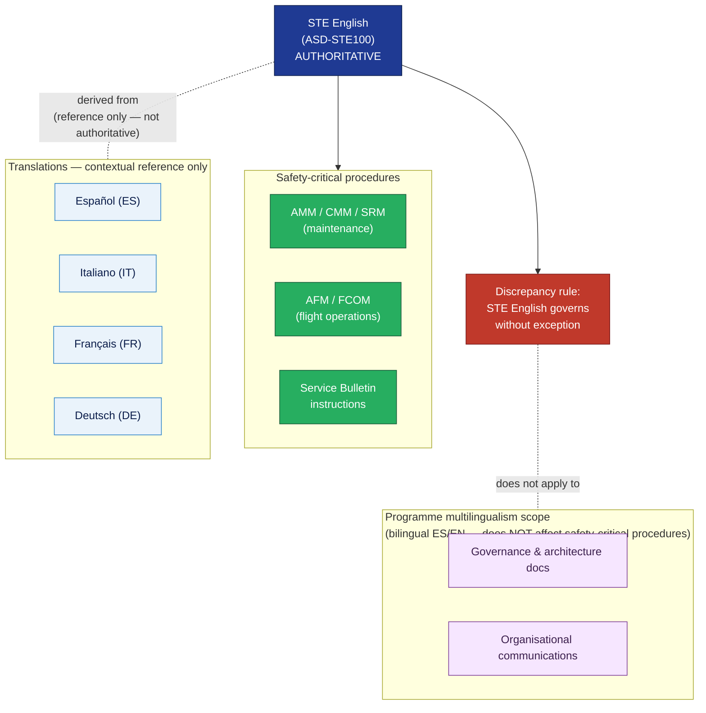

# ATLAS 000-009 · 00.002.005 — Language, Localization and STE

## 1. Purpose

Defines the **language policy** for all technical publications produced by the Q+ programme: Simplified Technical English (ASD-STE100) as the authoritative language for safety-critical procedures, the localization and translation policy for operational jurisdictions, quality control for translations, and the **authority hierarchy** that resolves any discrepancy between the English source and translated versions.

This document explicitly declares the tension between the programme's multilingüal doctrinal identity and the operational necessity of a single authoritative technical language — and resolves it unambiguously in favour of flight safety.

This document links to the controlled Q+ATLANTIDE baseline[^baseline] and to the applicable industry standards listed in §4.

## 2. Scope

### 2.1 Simplified Technical English (ASD-STE100) as authoritative language

**All technical procedures and safety-critical content in Q+ programme publications are authored in Simplified Technical English (STE), conforming to ASD-STE100[^ste100].**

STE is the authoritative writing standard for:
- Maintenance procedures (AMM, CMM, SRM, NDT Manual)
- Fault isolation procedures (TSM/FIM)
- Normal, abnormal, and emergency procedures (AFM, FCOM)
- Warning, Caution, and Note statements (CIR — see `002_S1000D-CSDB-and-Data-Modules.md` §2.7)
- Service Bulletin accomplishment instructions

STE is **not** required for:
- Parts descriptions and nomenclature (IPC)
- Illustrated wiring diagrams (WDM — legend only)
- Maintenance Planning Document task titles (MPD)
- Programme management and governance documents (this document, architecture documents)

**Rationale**: STE was developed specifically for the aviation maintenance domain to ensure that technical procedures are unambiguous, concise, and accessible to non-native English speakers worldwide. A maintenance technician in any country should be able to execute a procedure written in STE without ambiguity caused by idiomatic English, complex sentence structure, or specialist vocabulary beyond the STE-approved word list. This operational necessity overrides aesthetic or political preferences about which language is "primary."

### 2.2 The doctrinal tension and its resolution

The P&L.inc / Q+ programme has a documented multilingüal identity: paneuropean-panmediterranean, with Spanish, Italian, Neapolitan, and French as substrate languages of the programme's founder and institutional culture. Programme governance documents, baseline architecture documents, and organisational materials are authored bilingually (ES/EN) as a deliberate doctrinal choice.

This bilingualism **does not extend to safety-critical technical procedures**.

> **The programme declares the following unambiguously**:
>
> 1. **Authoritative language for safety-critical procedures**: Simplified Technical English (STE, ASD-STE100).
> 2. **Translation languages** (contextual reference only): Spanish (ES), Italian (IT), French (FR), German (DE).
> 3. **Authority hierarchy**: In case of any discrepancy between the English STE source and any translation, **the STE English version governs without exception**.
> 4. **Non-substitutability of translations**: Translated versions are contextual references for comprehension support. They are **not authoritative** and **must not be used alone** for the execution of any safety-critical maintenance, repair, or flight-crew procedure.
> 5. **Labelling requirement**: Every translated DM must carry a prominent notice: *"This is a translation for reference only. The authoritative version is the English STE original (DMC: …). In case of discrepancy, the English version governs."*

**Why this resolution is correct**: A maintenance technician of any nationality working on a Q+ aircraft at any airport in the world needs a single, unambiguous reference. STE English provides the broadest coverage, the largest trained technician base, and the most developed regulatory framework (EASA Part-66, FAA A&P, ICAO Doc 9379). A discrepancy between translations could lead to a procedural error; the rule that English governs eliminates that risk at the source.

### 2.3 Translation and localization policy

#### 2.3.1 Which manuals are translated

| Manual | Translation scope | Languages |
|---|---|---|
| AMM | Selected high-frequency procedures | ES, IT |
| FCOM | Full translation | ES, IT, FR, DE |
| AFM | Performance and limitations sections | ES, IT, FR, DE (as required by operational jurisdiction) |
| SB (safety-critical / MSB) | Full translation | ES, IT, FR, DE |
| NDT Manual | No translation (specialist technicians; STE English is standard) | — |
| IPC, WDM | No translation (part numbers and diagrams are language-independent) | — |
| TSM/FIM | Selected procedures | ES, IT |
| MPD | No translation | — |

Translation is triggered by:
- Regulatory requirement (national authority requirement in jurisdiction of operation)
- Operator contractual requirement
- Programme decision for strategic markets (declared by ORB-PMO)

#### 2.3.2 Translation version control

Translations are managed as **sibling DMs** in the CSDB with `languageIsoCode` set to the target language (`ES`, `IT`, `FR`, `DE`). The English DM is the master; translation DMs are derived and must be updated at every FR cycle that changes the English master.

Translation DM status:
- A translation DM that has not been updated following a change to the English master is automatically flagged `inWork = 01 (translation pending)` and must not be distributed until updated.
- The CSDB change management process includes a translation queue managed by Q-DATAGOV.

#### 2.3.3 Authorised translators and quality control

| Step | Actor | Output |
|---|---|---|
| Translation | Authorised aviation technical translator (ATA/iSpec 2200 competent) | Draft translated DM |
| Technical review | Subject-matter expert in target language | Reviewed draft |
| STE back-translation check | STE-qualified reviewer (EN) | Verification that meaning is preserved |
| Approval | Q-DATAGOV release authority | Approved translation DM |

Translation quality control follows AS9100D[^as9100d] and is part of the CSDB DM release process. The signoff chain for translated DMs is the same as for source English DMs (see `004_Revision-Issue-and-Distribution-Control.md` §2.3).

### 2.4 STE compliance validation

STE compliance is enforced at two levels:

1. **Authoring level**: Authors use STE-compliant authoring tools with integrated ASD-STE100 word-list checking and style-rule validation.
2. **BREX validation level**: The programme BREX rule `BREX-005` (declared in `002_S1000D-CSDB-and-Data-Modules.md` §2.5) enforces STE compliance as a CSDB build check. A DM that fails STE validation cannot be assembled into a PM and cannot be published.

STE violations are classified:
- **Blocking**: Non-approved word, prohibited syntactic construction. DM cannot be published.
- **Warning**: Style recommendation. DM can be published with documented exception reviewed by Q-DATAGOV.

### 2.5 Programme-level multilingüalism declaration

The Q+ programme affirms its multilingüal identity at the programme-governance layer while strictly separating it from the operational-safety layer:

| Layer | Language policy |
|---|---|
| Programme governance (architecture, strategy, organisation) | Bilingual ES/EN; Spanish may be primary in some documents |
| Technical publication authoring (procedures, DMs) | STE English only (authoritative) |
| Technical publication distribution | STE English (authoritative) + translations (contextual) |
| Operator-facing communications | Operator's language + English |
| Regulatory submissions | English (EASA/FAA primary) |

This separation is the canonical resolution of the programme's doctrinal tension. It is not a compromise — it is the correct application of each standard to its proper domain.

## 3. Diagram

*Solid arrows show the authority chain: STE English is authoritative for all safety-critical procedures. Translations are derived contextual references. The rule that English governs in case of discrepancy is absolute. The programme's multilingual identity applies to governance and organisational communications — not to safety-critical technical procedures.*

## 4. Footprint

| Metric | Value |
|---|---|
| Architecture | `ATLAS` — Aircraft Top Level Architecture Schema/System (controlled term) |
| Master range | `000–099` |
| Code range | `000-009` |
| Section | `00` — Información General y Servicio |
| Subsection | `002` — Documentación General |
| Subsubject | `005` — Language, Localization and STE |
| Authoritative language | Simplified Technical English (ASD-STE100) |
| Translation languages | ES, IT, FR, DE |
| Primary Q-Division | Q-DATAGOV[^qdiv] |
| Support Q-Divisions | Q-GROUND, Q-AIR |
| ORB support | ORB-PMO, ORB-LEG |
| Governance class | `baseline`[^gov] |
| Folder path | `Q+ATLANTIDE/000-099_ATLAS/000-009_Informacion-General-y-Servicio/002_Documentacion-General/` |
| Document | `005_Language-Localization-and-STE.md` (this file) |
| Parent subsection index | [`README.md`](./README.md) |
| Parent section | [`../README.md`](../README.md) |
| Parent architecture | [`../../README.md`](../../README.md) |
| Parent baseline | [`organization/Q+ATLANTIDE.md`](../../../../organization/Q+ATLANTIDE.md) |

## 5. References & Citations

[^baseline]: **Q+ATLANTIDE controlled baseline (v1.0.0)** — [`organization/Q+ATLANTIDE.md`](../../../../organization/Q+ATLANTIDE.md).

[^archtable]: **§3 — Architecture Table (parent)** — [`../../README.md` §3](../../README.md#3-architecture-table).

[^qdiv]: **Q-Division authority** — [`organization/Q-Divisions/`](../../../../organization/Q-Divisions/).

[^gov]: **Governance class** — `baseline` denotes documents under controlled change management within the Q+ATLANTIDE baseline.

[^ste100]: **ASD-STE100 — Simplified Technical English — Specification for the Preparation of Maintenance Documentation in a Controlled Language** — AeroSpace and Defence Industries Association of Europe (ASD), current issue. The authoritative writing standard for all safety-critical technical procedures in Q+ publications.

[^s1000d60]: **S1000D Issue 6.0 — International specification for technical publications** — ASD/AIA/ATA, 2022. Language code handling in DMC (`languageIsoCode`) and translation DM management are defined in Chapter 6.

[^ata2200]: **ATA iSpec 2200 — Information Standards for Aviation Maintenance** — ATA, current issue. Language and localization conventions for maintenance publications.

[^as9100d]: **AS9100D — Quality Management Systems — Aviation, Space and Defense Organizations** — Quality-management baseline for translation quality control and DM release.

[^icao9379]: **ICAO Doc 9379 — Manual of Procedures for Establishment and Management of a State's Personnel Licensing System** — Aviation English language proficiency framework; contextual reference for technician language competency.

### Applicable industry standards

- ASD-STE100 — Simplified Technical English[^ste100]
- S1000D Issue 6.0 — International specification for technical publications[^s1000d60]
- ATA iSpec 2200 — Information Standards for Aviation Maintenance[^ata2200]
- AS9100D — Quality Management Systems — Aviation, Space and Defense Organizations[^as9100d]
- ICAO Doc 9379 — Manual of Procedures for Personnel Licensing (aviation English proficiency)[^icao9379]
