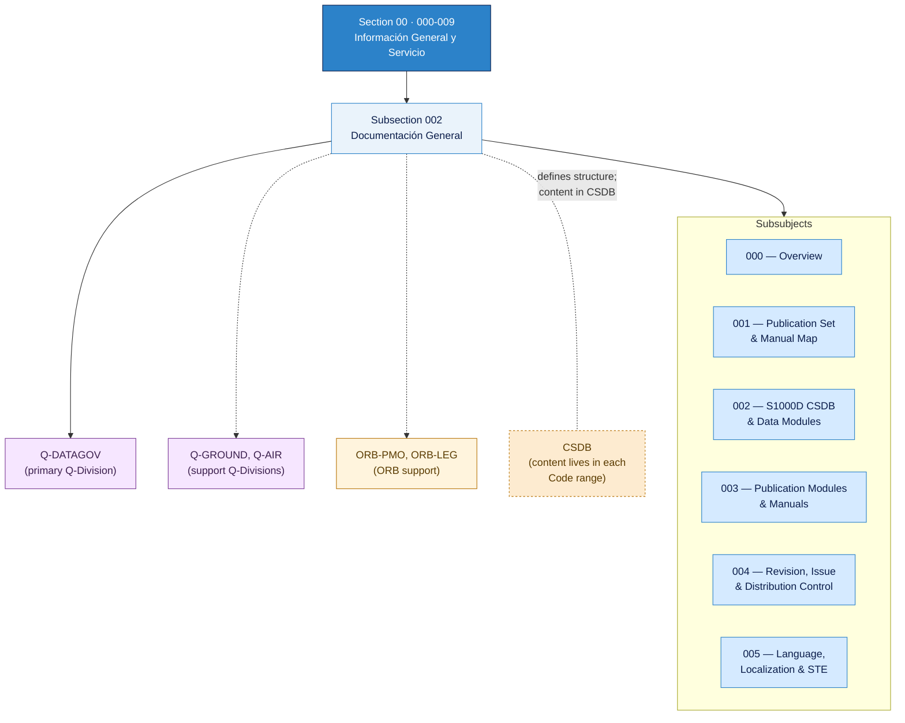

# ATLAS 000-009 · Section 00 · Subsection 002 — Documentación General

## 1. Purpose

Subsection-level index for *Documentación General* (`002`) within ATLAS `000-009` — *Información General y Servicio* — Publication set, S1000D CSDB architecture, revision control, and language/localization policy.

This subsection is part of the **ATLAS-1000** register, a subpart of the controlled **Q+ATLANTIDE** baseline[^baseline][^n001]. It is the **third Subject** of the first Code range (`000-009`) of the ATLAS master range (`000–099`), and serves as the publication-control layer that materialises what ATLAS describes.

## 2. Scope

- Defines and governs the subsubject namespace `000`–`099` of subsection `002` *Documentación General*.
- Inherits Q-Division authority and ORB support from the parent row in [`../../README.md` §3](../../README.md#3-architecture-table)[^archtable] and the section index in [`../README.md`](../README.md).
- Contains the Overview, canonical publication-set mapping, S1000D/CSDB architecture, publication-module assembly, revision control, and language/localization policy for the programme.
- **Boundary rule**: this subsection defines the *structure* of publication; the *content* of published data modules lives in each Code range's CSDB respectively.

## 3. Subsubject Index

| NNN | Title | Document | Status |
|---:|---|---|---|
| 000 | Overview | [`000_Overview.md`](./000_Overview.md) | active |
| 001 | Publication Set and Manual Map | [`001_Publication-Set-and-Manual-Map.md`](./001_Publication-Set-and-Manual-Map.md) | active |
| 002 | S1000D CSDB and Data Modules | [`002_S1000D-CSDB-and-Data-Modules.md`](./002_S1000D-CSDB-and-Data-Modules.md) | active |
| 003 | Publication Modules and Manuals | [`003_Publication-Modules-and-Manuals.md`](./003_Publication-Modules-and-Manuals.md) | active |
| 004 | Revision, Issue and Distribution Control | [`004_Revision-Issue-and-Distribution-Control.md`](./004_Revision-Issue-and-Distribution-Control.md) | active |
| 005 | Language, Localization and STE | [`005_Language-Localization-and-STE.md`](./005_Language-Localization-and-STE.md) | active |

## 4. Interfaces Diagram

*Solid arrows show parent→subsection→subsubject ownership and primary Q-Division authority; dotted arrows show support Q-Divisions, ORB enterprise support, and the CSDB boundary.*

## 5. Footprint

| Metric | Value |
|---|---|
| Architecture | `ATLAS` — Aircraft Top Level Architecture Schema/System (controlled term) |
| Master range | `000–099` |
| Code range | `000-009` |
| Section | `00` — Información General y Servicio |
| Subsection | `002` — Documentación General |
| Subsubject namespace | `000`–`099` |
| Subsubjects populated | 6 (000–005) |
| Primary Q-Division | Q-DATAGOV[^qdiv] |
| Support Q-Divisions | Q-GROUND, Q-AIR |
| ORB support | ORB-PMO, ORB-LEG |
| Governance class | `baseline`[^gov] |
| Folder path | `Q+ATLANTIDE/000-099_ATLAS/000-009_Informacion-General-y-Servicio/002_Documentacion-General/` |
| Document | `README.md` (this file) |
| Parent section | [`../README.md`](../README.md) |
| Parent architecture | [`../../README.md`](../../README.md) |
| Parent baseline | [`organization/Q+ATLANTIDE.md`](../../../../organization/Q+ATLANTIDE.md) |

## Governance

Governed by [`organization/Q+ATLANTIDE.md`](../../../../organization/Q+ATLANTIDE.md)[^baseline]. All subsubjects under this subsection inherit `architecture_code = ATLAS`, `primary_q_division = Q-DATAGOV` and `governance_class = baseline` from the parent ATLAS section. Extensions added under `000`–`099` shall preserve those header fields and reuse the footnote set declared here.

## Sibling-Subject Pointers

| Subject | Folder | Relationship |
|---|---|---|
| `000` — Identificación | [`../000_Identificacion/`](../000_Identificacion/) | Aircraft/programme identifiers that appear in publication metadata and DMC |
| `001` — Configuración | [`../001_Configuracion/`](../001_Configuracion/) | Effectivity/variant data consumed by Publication Modules (PM applicability filtering) |
| `003` — Operaciones Básicas | [`../003_Operaciones-Basicas/`](../003_Operaciones-Basicas/) | Operational-procedure DMs that are assembled and published per this subsection's rules |

## Change Log

| Version | Date | Description |
|---|---|---|
| 1.0.0 | 2026-05-07 | Initial population of subsubjects 000–005; status promoted to active |

## 6. References & Citations

[^baseline]: **Q+ATLANTIDE controlled baseline (v1.0.0)** — [`organization/Q+ATLANTIDE.md`](../../../../organization/Q+ATLANTIDE.md).

[^archtable]: **§3 — Architecture Table (parent)** — [`../../README.md` §3](../../README.md#3-architecture-table).

[^qdiv]: **Q-Division authority** — [`organization/Q-Divisions/`](../../../../organization/Q-Divisions/).

[^gov]: **Governance class** — `baseline` denotes documents under controlled change management within the Q+ATLANTIDE baseline.

[^n001]: **Note N-001** — Q+ATLANTIDE (with its ATLAS-1000 register subpart) is a taxonomy and traceability ecosystem, not an organization chart. See [`organization/Q+ATLANTIDE.md` §4](../../../../organization/Q+ATLANTIDE.md#4-notes).
