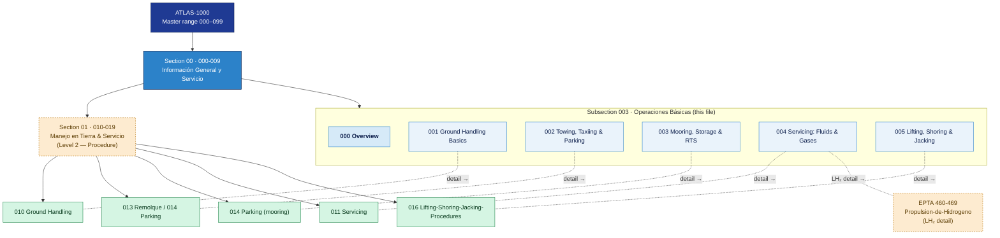

# ATLAS 000-009 · Section 00 · Subsection 003 · Subsubject 000 — Overview

## 1. Purpose

Overview entry-point for *Operaciones Básicas* (`003`) — the **fourth and final subsection** of Code range `000-009` (*Información General y Servicio*), which is itself the **first Code range of the ATLAS master range** (`000–099`).

This subsubject introduces the scope, doctrinal position, and boundary rules of `003_Operaciones-Basicas/` within the controlled Q+ATLANTIDE baseline[^baseline] and links outward to the applicable industry standards listed in §4.

> **Doctrinal phrase (canonical, controlled):**
> *ATLAS describes the aircraft as an integrated system at the top level; this subsection defines the basic operations necessary to introduce, move, maintain and service an aircraft in its operational environment — at the level of general orientation, not at the level of detailed procedure.*

## 2. Scope

### 2.1 Position within ATLAS

`003_Operaciones-Basicas/` occupies the fourth slot of Code range `000-009`:

| Code | Title | Role within the Code range |
|---|---|---|
| `000` | Identificación | Aircraft, programme and component identity |
| `001` | Configuración | Configuration baseline, effectivity, variants |
| `002` | Documentación General | Documentation policy, standards, applicability |
| **`003`** | **Operaciones Básicas** | **Introductory orientation for basic operations** ← this subsection |

### 2.2 Content in scope

Subsubjects `001`–`005` introduce (at orientation level, not procedural level):

| 00N | Title | Key concepts |
|---|---|---|
| `001` | Ground Handling Basics | Positioning, exclusion zones, GSE overview, safety perimeter, weight-on-wheels, brakes states |
| `002` | Towing, Taxiing and Parking | Towbar vs. towbarless, bypass pin, taxi speed limits, parking configurations |
| `003` | Mooring, Storage and Return to Service | Tie-down points, gust locks, control surface lock-out, preservation, RTS inspection |
| `004` | Servicing: Fluids and Gases | Fuel (Jet-A / LH₂ by variant), oil, hydraulic, water, waste, O₂, N₂; replenishment vs. drainage |
| `005` | Lifting, Shoring and Jacking Basics | Jack points, jacking sequence, load distribution, leveling references |

### 2.3 Explicit boundary against `010-019_Manejo-en-Tierra-Servicio/` — CRITICAL

The following rule is **binding** for all contributors and must be understood before adding content to either Code range:

> **Rule OB-01 — Three-level separation of concerns:**
>
> | Level | Where | Role |
> |---|---|---|
> | **Level 1 — Orientation** | `000-009_Informacion-General-y-Servicio/003_Operaciones-Basicas/` | *What* the operation is, *why* it exists, key concepts and vocabulary. A new mechanic reading these files understands *what* ground handling, towing, servicing, and lifting are. |
> | **Level 2 — Procedure** | `010-019_Manejo-en-Tierra-Servicio/` and its six (+one) subsections | *How* each operation is executed: step sequences, safety checks, tooling requirements, limits, sign-offs. |
> | **Level 3 — Publication** | Published manuals (AMM, GMM, etc.) | The materializatio of Levels 1 and 2 in approved, distributable form. |
>
> **Three levels, three roles. Content shall not be duplicated across levels.** If a step-by-step procedure appears in `003_`, it belongs in `010-019_`. If `010-019_` lacks a conceptual definition, the definition shall be added to `003_`, not duplicated in the procedure.

### 2.4 Boundary clarification — "Servicio" disambiguation

The word *servicio* / *servicing* appears in three distinct places in the ATLAS taxonomy:

1. **Code range `000-009_Informacion-General-y-Servicio`** — *Servicio* here refers to the scope of the first Code range as a whole (general information **and** servicing context). This subsection (`003_`) is the orientation layer.
2. **Code range `010-019_Manejo-en-Tierra-Servicio`** — *Servicio* here refers to the category of operational procedures that go with ground handling.
3. **Subsection `010-019/011_Servicing/`** — *Servicing* here is the specific procedure Subject covering fluid/gas replenishment and drain operations.

These three instances are **not duplicates**; they are three distinct layers of the same subject matter. The rule is: read `003/004_` for *what* servicing is; go to `010-019/011_` for *how* to do it.

### 2.5 Variant sensitivity (AMPEL360-specific)

Content in this subsection — especially `004_Servicing-Fluids-and-Gases.md` — is **variant-dependent**. AMPEL360 aircraft variants differ in propulsion architecture:

- **Gen 1** (AMPEL360e, tube-and-wing): Jet-A / SAF kerosene propulsion.
- **Gen 2** (BWB-H2 demonstrator): LH₂ propulsion.
- **Intermediate/hybrid variants**: dual-fuel or hybrid architecture.

The list of serviced fluids and gases is **not static**. Contributors must resolve the applicable variant via the Configuration Baseline ([`../001_Configuracion/`](../001_Configuracion/)) before declaring the fluid list for a specific aircraft.

## 3. Diagram — Position and Boundary Map

*Solid arrows indicate parent → section → subsection ownership. Dotted arrows indicate cross-section interfaces (procedural detail and specialised references).*

## 4. Footprint

| Metric | Value |
|---|---|
| Architecture | `ATLAS` — Aircraft Top Level Architecture Schema/System (controlled term) |
| Master range | `000–099` |
| Code range | `000-009` |
| Section | `00` — Información General y Servicio |
| Subsection | `003` — Operaciones Básicas |
| Subsubject | `000` — Overview |
| Variant sensitivity | Variant-dependent (fluid list in `004_`); resolve via [`../001_Configuracion/`](../001_Configuracion/) |
| Primary Q-Division | Q-DATAGOV[^qdiv] |
| Support Q-Divisions | Q-GROUND, Q-AIR |
| ORB support | ORB-PMO, ORB-LEG |
| Governance class | `baseline`[^gov] |
| Folder path | `Q+ATLANTIDE/000-099_ATLAS/000-009_Informacion-General-y-Servicio/003_Operaciones-Basicas/` |
| Document | `000_Overview.md` (this file) |
| Parent subsection | [`README.md`](./README.md) |
| Parent architecture | [`../../README.md`](../../README.md) |
| Parent baseline | [`organization/Q+ATLANTIDE.md`](../../../../organization/Q+ATLANTIDE.md) |

## 5. References & Citations

[^baseline]: **Q+ATLANTIDE controlled baseline (v1.0.0)** — [`organization/Q+ATLANTIDE.md`](../../../../organization/Q+ATLANTIDE.md). Defines the controlled `000-999` architecture-band taxonomy and the ATLAS-1000 register subpart.

[^archtable]: **§3 — Architecture Table (parent)** — [`../../README.md` §3](../../README.md#3-architecture-table). Source of authority for primary/support Q-Divisions and ORB support of this section.

[^qdiv]: **Q-Division authority** — [`organization/Q-Divisions/`](../../../../organization/Q-Divisions/). Technical-authority units for the Q+ATLANTIDE baseline.

[^gov]: **Governance class** — `baseline` denotes documents under controlled change management within the Q+ATLANTIDE baseline.

[^ata2200]: **ATA iSpec 2200** — Information standards for aviation maintenance documentation. Governs data-module structure, ATA chapter mapping, and technical-publication interchange for ATLAS artefacts.

[^ataspec100]: **ATA Spec 100** — Manufacturers' Technical Data standard. Legacy reference for ATA chapter/subject numbering conventions reflected in the ATLAS `000-099` band.

[^s1000d]: **S1000D Issue 6.0** — International specification for technical publications. Common Source DataBase (CSDB) and Data Module Code (DMC) specification used for all Q+ATLANTIDE artefacts.

[^as9100d]: **AS9100D** — Quality Management Systems — Aviation, Space and Defense Organizations. Quality-management baseline for all Q+ATLANTIDE deliverables.

[^icao9137]: **ICAO Doc 9137 — Airport Services Manual** — ICAO reference for ground-handling safety standards, GSE operation, and aircraft turnaround procedures. Applicable to subsection `003` orientation scope.

[^iata_igom]: **IATA Ground Operations Manual (IGOM)** — Industry standard for ground-handling procedures at the operational level. Procedural content cross-referenced from `010-019_` subsections.

### Applicable industry standards

- ATA iSpec 2200 — Information standards for aviation maintenance[^ata2200]
- ATA Spec 100 — Manufacturers' Technical Data[^ataspec100]
- S1000D Issue 6.0 — International specification for technical publications[^s1000d]
- AS9100D — Quality Management Systems — Aviation, Space and Defense Organizations[^as9100d]
- ICAO Doc 9137 — Airport Services Manual[^icao9137]
- IATA Ground Operations Manual (IGOM)[^iata_igom]
