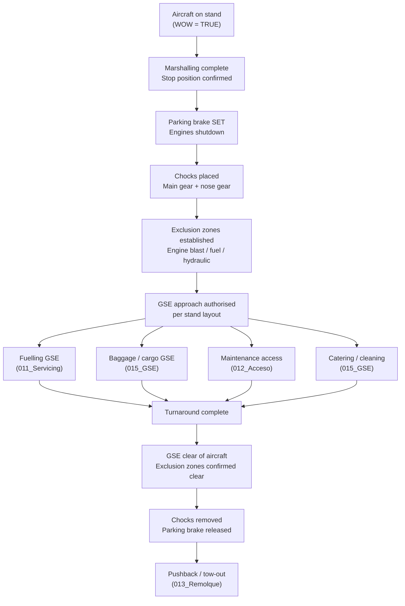

# ATLAS 000-009 · Section 00 · Subsection 003 · Subsubject 001 — Ground Handling Basics

## 1. Purpose

Introduces **ground handling** as a practice — the set of support activities performed on an aircraft while it is on the ground between flights (turnaround) or during extended maintenance. This subsubject establishes shared vocabulary and top-level concepts for contributors and maintenance personnel reading the ATLAS register.

> **Scope boundary:** This file is **introductory orientation**. It defines *what* ground handling is and introduces key concepts. The step-by-step operational procedure lives in [`../../010-019_Manejo-en-Tierra-Servicio/010_Ground-handling/`](../../010-019_Manejo-en-Tierra-Servicio/010_Ground-handling/) per the three-level rule declared in [`000_Overview.md`](./000_Overview.md) §2.3.

## 2. Scope

### 2.1 Definition

**Ground handling** encompasses all services and operations performed on an aircraft while it is stationary on the ground, including marshalling, chocking, grounding, fuelling, catering, cleaning, baggage loading, maintenance access, towing, and pushback. The term excludes in-flight operations and excludes operations performed under dedicated system chapters (e.g., engine run-up under propulsion Code ranges).

For the AMPEL360 programme, ground handling interfaces with both conventional (Jet-A/SAF) and LH₂ servicing workflows — the applicable procedures depend on the active aircraft variant (see [`../001_Configuracion/`](../001_Configuracion/)).

### 2.2 Aircraft positioning on the apron

- **Stand allocation:** The aircraft is assigned a specific parking stand on the apron. Stand type (nose-in, angled, remote) determines the arrival and departure corridor, the required marshalling procedure, and the safe GSE approach path.
- **Marshalling signals:** Standardised ICAO hand signals (or light-wand signals at night) guide the aircraft to the exact stop position. Stop accuracy is critical for aerobridge alignment, chock placement, and fuel point accessibility.
- **Wheel chock placement:** After engine shutdown and parking brake set, chocks are placed fore and aft of the main-gear wheels (and where required, nose gear) to prevent inadvertent movement. Chock removal sequence is specified in the operational procedure in `010_Ground-handling/`.

### 2.3 Exclusion zones

An **exclusion zone** (also called a safety perimeter or danger area) is a defined area around the aircraft in which access is restricted during specific ground-handling phases:

- **Engine blast zone (rear arc):** No personnel or GSE shall be positioned in the jet exhaust path during engine start or taxi operations.
- **Propeller/rotor arc (if applicable):** Rotating propeller or rotor arc is a hard exclusion zone at all times during operation.
- **Fuel servicing zone:** A specified radius around active fuel points from which ignition sources and non-essential personnel are excluded during fuelling.
- **High-pressure hydraulic zone:** Access restricted during hydraulic pressurisation tests.

Exclusion zones for AMPEL360 variants are defined in the applicable Ground Handling Manual (GHM), cross-referenced from `010-019_/010_Ground-handling/`.

### 2.4 Ground support equipment (GSE) — overview

**Ground Support Equipment (GSE)** is the collective term for all specialised vehicles and equipment used to service an aircraft on the ground. Categories include:

| Category | Examples | ATLAS Cross-ref |
|---|---|---|
| Ramp transport | Baggage tractors, cargo loaders, passenger steps | `010-019_/015_GSE/` |
| Power supply | Ground Power Unit (GPU), Air Start Unit (ASU) | `010-019_/015_GSE/` |
| Fuelling | Fuel hydrant dispenser, fuel bowser | `010-019_/011_Servicing/` |
| Towing | Towbar tractors, towbarless tractors | `010-019_/013_Remolque/` |
| Maintenance access | Ground stairs, maintenance platforms, docking systems | `010-019_/012_Acceso/` |
| Safety | Fire extinguisher carts, spill kits | `010-019_/010_Ground-handling/` |

For AMPEL360 Gen 2 (LH₂), additional GSE includes cryogenic fuel vehicles, boil-off capture units, and grounding cables for electrostatic management — details in EPTA `460-469_`.

### 2.5 Weight-on-wheels (WOW) logic

**Weight-on-wheels (WOW)** is the binary sensor state that indicates whether the aircraft is on the ground (WOW = TRUE, squat switch compressed) or airborne (WOW = FALSE). WOW state governs:

- Ground spoiler deployment logic.
- Thrust reverser arming inhibit.
- Nose-wheel steering engagement.
- Ground power interlock (external power accepted only when WOW = TRUE on all main gear).
- Certain pressurisation and braking modes.

Ground handling personnel must be aware that WOW = TRUE is a **necessary but not sufficient** condition for safe ground operations — it does not mean the aircraft is fully safe for maintenance access (hydraulic pressure may still be present, engines may still be running, etc.).

### 2.6 Brakes states

Two discrete brake states govern access safety on the ramp:

| State | Condition | Access implication |
|---|---|---|
| **Brakes set** | Parking brake applied; wheel brakes hydraulically or mechanically locked | Aircraft is stationary; chocks may be placed; towing requires parking brake release |
| **Brakes released** | Parking brake off; wheel brakes depressurised | Aircraft may move under gravity if on a slope; chocks must be in place before brakes are released |

The operational sequence for transitioning between brakes states during pushback and towing is specified in `010-019_/013_Remolque/`.

## 3. Diagram — Ground Handling Key Concepts

## 4. Footprint

| Metric | Value |
|---|---|
| Architecture | `ATLAS` — Aircraft Top Level Architecture Schema/System (controlled term) |
| Master range | `000–099` |
| Code range | `000-009` |
| Section | `00` — Información General y Servicio |
| Subsection | `003` — Operaciones Básicas |
| Subsubject | `001` — Ground Handling Basics |
| Scope level | Introductory orientation (Level 1); procedural detail in `010-019_/010_Ground-handling/` |
| Primary Q-Division | Q-DATAGOV[^qdiv] |
| Support Q-Divisions | Q-GROUND, Q-AIR |
| ORB support | ORB-PMO, ORB-LEG |
| Governance class | `baseline`[^gov] |
| Folder path | `Q+ATLANTIDE/000-099_ATLAS/000-009_Informacion-General-y-Servicio/003_Operaciones-Basicas/` |
| Document | `001_Ground-Handling-Basics.md` (this file) |
| Parent subsection | [`README.md`](./README.md) · [`000_Overview.md`](./000_Overview.md) |
| Procedural detail | [`../../010-019_Manejo-en-Tierra-Servicio/010_Ground-handling/`](../../010-019_Manejo-en-Tierra-Servicio/010_Ground-handling/) |
| Parent architecture | [`../../README.md`](../../README.md) |
| Parent baseline | [`organization/Q+ATLANTIDE.md`](../../../../organization/Q+ATLANTIDE.md) |

## 5. References & Citations

[^baseline]: **Q+ATLANTIDE controlled baseline (v1.0.0)** — [`organization/Q+ATLANTIDE.md`](../../../../organization/Q+ATLANTIDE.md). Defines the controlled `000-999` architecture-band taxonomy and the ATLAS-1000 register subpart.

[^archtable]: **§3 — Architecture Table (parent)** — [`../../README.md` §3](../../README.md#3-architecture-table). Source of authority for primary/support Q-Divisions and ORB support of this section.

[^qdiv]: **Q-Division authority** — [`organization/Q-Divisions/`](../../../../organization/Q-Divisions/). Technical-authority units for the Q+ATLANTIDE baseline.

[^gov]: **Governance class** — `baseline` denotes documents under controlled change management within the Q+ATLANTIDE baseline.

[^ata2200]: **ATA iSpec 2200** — Information standards for aviation maintenance documentation. Governs data-module structure and ATA chapter mapping for ATLAS artefacts.

[^ataspec100]: **ATA Spec 100** — Manufacturers' Technical Data standard. ATA chapter/section numbering conventions reflected in the ATLAS `000-099` band; ATA chapter 10 covers parking and mooring.

[^s1000d]: **S1000D Issue 6.0** — International specification for technical publications. CSDB and DMC specification used for all Q+ATLANTIDE artefacts.

[^as9100d]: **AS9100D** — Quality Management Systems — Aviation, Space and Defense Organizations. Quality-management baseline for all Q+ATLANTIDE deliverables.

[^icao9137]: **ICAO Doc 9137 — Airport Services Manual** — ICAO reference for ground-handling safety, GSE operation, aircraft turnaround, and exclusion-zone standards.

[^iata_igom]: **IATA Ground Operations Manual (IGOM)** — Industry standard for ground-handling procedures. Step-level content in `010-019_/010_` cross-references this document.

### Applicable industry standards

- ATA iSpec 2200 — Information standards for aviation maintenance[^ata2200]
- ATA Spec 100 — Manufacturers' Technical Data[^ataspec100]
- S1000D Issue 6.0 — International specification for technical publications[^s1000d]
- AS9100D — Quality Management Systems — Aviation, Space and Defense Organizations[^as9100d]
- ICAO Doc 9137 — Airport Services Manual[^icao9137]
- IATA Ground Operations Manual (IGOM)[^iata_igom]
