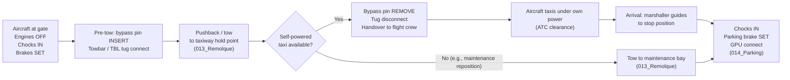

# ATLAS 000-009 · Section 00 · Subsection 003 · Subsubject 002 — Towing, Taxiing and Parking

## 1. Purpose

Introduces the three movement-and-positioning operations that constitute a typical aircraft turnaround on the apron: **towing** (aircraft moved by a ground tug), **taxiing** (aircraft moved under its own propulsion), and **parking** (aircraft stationary at a stand or bay). This subsubject establishes shared vocabulary and conceptual boundaries for contributors reading the ATLAS register.

> **Scope boundary:** This file is **introductory orientation** (Level 1). Step-by-step towing procedures are in [`../../010-019_Manejo-en-Tierra-Servicio/013_Remolque/`](../../010-019_Manejo-en-Tierra-Servicio/013_Remolque/); parking procedures are in [`../../010-019_Manejo-en-Tierra-Servicio/014_Parking/`](../../010-019_Manejo-en-Tierra-Servicio/014_Parking/). Taxiing as a self-powered operation is governed by flight operations (not this Code range) — this file treats taxiing **only at its intersection with ground handling** (e.g., departure from stand, arrival to stand, slow apron taxi under ATC clearance).

## 2. Scope

### 2.1 Towing — aircraft moved by a ground tug

**Towing** is the movement of an aircraft on the ground by an external tug vehicle connected to the aircraft landing gear. Towing is used for pushback from a stand, repositioning on the apron, and transit between maintenance bays.

#### 2.1.1 Towbar vs. towbarless

| Method | Description | Applicability |
|---|---|---|
| **Towbar** | A rigid bar couples the tug to the aircraft nose-gear steering collar via a towhead. Steering is transmitted mechanically through the bar. | Standard for most towing operations; towbar is type-specific (AMPEL360 requires approved towbar per maintenance manual). |
| **Towbarless (TBL)** | The tug lifts and cradles the nose gear directly; no towbar is required. The tug manoeuvres independently. | Used at high-throughput stands where speed of connection/disconnection matters; requires an approved TBL tug qualified for the AMPEL360 nose-gear geometry. |

#### 2.1.2 Bypass pin (tow pin / steering disconnect pin)

The **bypass pin** (also called *tow pin* or *steering disconnect pin*) is inserted into the nose-gear steering mechanism before towing to **disconnect the hydraulic nose-wheel steering actuator** from the nose gear. This prevents hydraulic steering loads from fighting the towbar/tug and avoids damage to the steering system.

- Bypass pin insertion is a mandatory pre-tow step.
- The pin must be **removed and stowed** before the next powered taxi or flight.
- Loss of the bypass pin in a flight-ready aircraft is an airworthiness discrepancy.

The bypass pin procedure and aircraft-specific part number are specified in `013_Remolque/`.

#### 2.1.3 Tow speed limits

Towing speed limits protect the nose gear, towbar, and ground personnel. General constraints (specific limits in the maintenance manual and GHM):

- Walking pace (~5 km/h) on congested aprons.
- Higher speeds (~15 km/h) on open taxiways with clearance, never faster than ground crew can maintain a safety escort position.
- Hard stop before any turn exceeding the aircraft's **nose-gear steering angle limit** — exceeding this limit shears the towbar shear bolt (by design) or, in worse cases, damages the nose gear.

### 2.2 Taxiing — aircraft moving under own power

**Taxiing** is the movement of the aircraft on the ground under its own propulsion (engines or, for AMPEL360e with electric taxi systems, electric drive motors). Taxiing is controlled by the flight crew from the flight deck.

**This subsubject treats taxiing only at its intersection with ground handling**, not as a flight operation:

- **Departure from stand:** Ground crew authorises pushback/departure; signals clear of stand; tug disconnects; aircraft transitions to self-powered taxi. The handover point between towing and taxiing is documented in `013_Remolque/`.
- **Arrival at stand:** Aircraft arrives under self-powered taxi; marshaller guides aircraft to stop position; ground crew places chocks and connects GPU.
- **Apron speed limits:** Typically 10–15 km/h on busy aprons with ground crew present; exact limits in the applicable Aerodrome Operating Procedure (AOP).

### 2.3 Parking — aircraft stationary at a stand or bay

**Parking** is the state of an aircraft positioned at a stand, bay, or maintenance hangar with engines off, parking brake set, and chocks in place. Parking configurations differ by duration and purpose:

| Configuration | Duration | Key features |
|---|---|---|
| **Turnaround parking** | Minutes to hours (normal between-flight interval) | Chocks, GPU connected, servicing in progress |
| **Overnight/scheduled parking** | Hours to days | Chocks, pitot covers, engine blanks optional, CFMI shutdown procedure per variant |
| **Extended parking** | Days to weeks | Full mooring rig, gust locks, preservation may begin — see `003_Mooring-Storage-and-Return-to-Service.md` |
| **Maintenance bay** | Variable | Aircraft positioned for specific maintenance access; jacking may be required — see `005_Lifting-Shoring-and-Jacking-Basics.md` |

Detailed parking procedures including stand layout, chock placement, and ground power connections are in [`010-019_Manejo-en-Tierra-Servicio/014_Parking/`](../../010-019_Manejo-en-Tierra-Servicio/014_Parking/).

## 3. Diagram — Towing, Taxiing and Parking Sequence

## 4. Footprint

| Metric | Value |
|---|---|
| Architecture | `ATLAS` — Aircraft Top Level Architecture Schema/System (controlled term) |
| Master range | `000–099` |
| Code range | `000-009` |
| Section | `00` — Información General y Servicio |
| Subsection | `003` — Operaciones Básicas |
| Subsubject | `002` — Towing, Taxiing and Parking |
| Scope level | Introductory orientation (Level 1); procedural detail in `013_Remolque/` and `014_Parking/` |
| Primary Q-Division | Q-DATAGOV[^qdiv] |
| Support Q-Divisions | Q-GROUND, Q-AIR |
| ORB support | ORB-PMO, ORB-LEG |
| Governance class | `baseline`[^gov] |
| Folder path | `Q+ATLANTIDE/000-099_ATLAS/000-009_Informacion-General-y-Servicio/003_Operaciones-Basicas/` |
| Document | `002_Towing-Taxiing-and-Parking.md` (this file) |
| Parent subsection | [`README.md`](./README.md) · [`000_Overview.md`](./000_Overview.md) |
| Towing procedure | [`../../010-019_Manejo-en-Tierra-Servicio/013_Remolque/`](../../010-019_Manejo-en-Tierra-Servicio/013_Remolque/) |
| Parking procedure | [`../../010-019_Manejo-en-Tierra-Servicio/014_Parking/`](../../010-019_Manejo-en-Tierra-Servicio/014_Parking/) |
| Parent architecture | [`../../README.md`](../../README.md) |
| Parent baseline | [`organization/Q+ATLANTIDE.md`](../../../../organization/Q+ATLANTIDE.md) |

## 5. References & Citations

[^baseline]: **Q+ATLANTIDE controlled baseline (v1.0.0)** — [`organization/Q+ATLANTIDE.md`](../../../../organization/Q+ATLANTIDE.md).

[^archtable]: **§3 — Architecture Table (parent)** — [`../../README.md` §3](../../README.md#3-architecture-table).

[^qdiv]: **Q-Division authority** — [`organization/Q-Divisions/`](../../../../organization/Q-Divisions/).

[^gov]: **Governance class** — `baseline` denotes documents under controlled change management within the Q+ATLANTIDE baseline.

[^ata2200]: **ATA iSpec 2200** — Information standards for aviation maintenance documentation.

[^ataspec100]: **ATA Spec 100** — Manufacturers' Technical Data standard. ATA chapter 9 covers towing and taxiing; chapter 10 covers parking and mooring.

[^s1000d]: **S1000D Issue 6.0** — International specification for technical publications.

[^as9100d]: **AS9100D** — Quality Management Systems — Aviation, Space and Defense Organizations.

[^icao9137]: **ICAO Doc 9137 — Airport Services Manual, Part 4** — Ground vehicle operations, apron management, and towing procedures.

[^iata_igom]: **IATA Ground Operations Manual (IGOM)** — Aircraft towing and pushback procedures at the operational level.

### Applicable industry standards

- ATA iSpec 2200 — Information standards for aviation maintenance[^ata2200]
- ATA Spec 100 — Manufacturers' Technical Data (ATA chapters 9, 10)[^ataspec100]
- S1000D Issue 6.0 — International specification for technical publications[^s1000d]
- AS9100D — Quality Management Systems — Aviation, Space and Defense Organizations[^as9100d]
- ICAO Doc 9137 Part 4 — Airport Services Manual[^icao9137]
- IATA Ground Operations Manual (IGOM)[^iata_igom]
