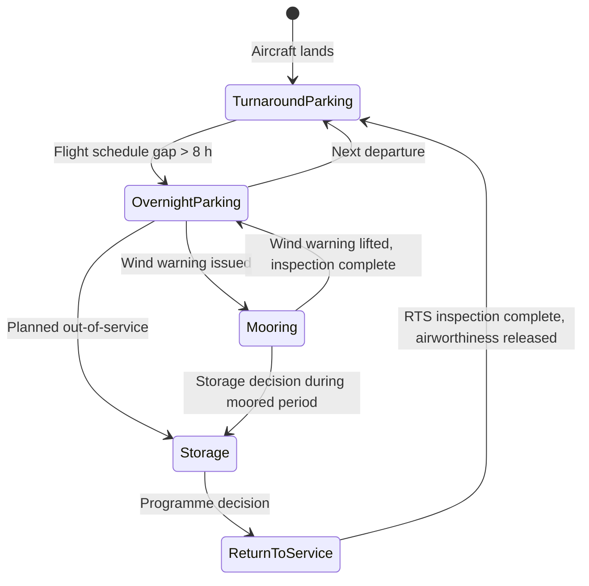

# ATLAS 000-009 · Section 00 · Subsection 003 · Subsubject 003 — Mooring, Storage and Return to Service

## 1. Purpose

Introduces three **prolonged stationary states** of the aircraft that go beyond normal between-flight parking: **mooring** (tie-down in anticipation of high winds), **storage** (planned out-of-service period lasting weeks or months), and **return to service (RTS)** (the procedure for restoring a stored or moored aircraft to airworthy operational status). This subsubject establishes the conceptual vocabulary for contributors and maintenance personnel.

> **Scope boundary:** This file is **introductory orientation** (Level 1). Detailed mooring and long-term parking procedures are in [`../../010-019_Manejo-en-Tierra-Servicio/014_Parking/`](../../010-019_Manejo-en-Tierra-Servicio/014_Parking/). Storage and RTS procedures, if the programme adopts a dedicated Subject, may reside in a future operational Subject within `010-019_` or in the applicable Aircraft Maintenance Manual (AMM).

## 2. Scope

### 2.1 Mooring — tie-down against wind loads

**Mooring** is the securing of an aircraft to fixed anchor points on the ground using ropes, chains, or tie-down straps to resist wind loads. Mooring is applied when:

- Forecast wind speeds exceed the aircraft's threshold for unsecured parking (threshold defined in GHM and AMM).
- The aircraft will be on an exposed stand or remote pad without shelter.
- Tropical storm or severe weather warning is in effect at the airfield.

#### 2.1.1 Tie-down points

Approved **tie-down points** are structural hard-points on the airframe designed to accept rated tie-down loads without damage. Locations vary by variant but typically include:

- Forward fuselage / nose gear attachment fittings.
- Main gear axle attachment points or dedicated wing lower-surface fittings.
- Tail/empennage fittings (where provided by design).

**Non-approved tie-down** to unrated airframe features (antennas, fairings, access panels) constitutes an airworthiness hazard. Use only approved points listed in the AMM.

#### 2.1.2 Gust locks

**Gust locks** (also *flight control locks*) prevent flight control surfaces from moving under wind loads when the aircraft is parked. Types:

- **Internal gust locks:** Mechanical locks built into the cockpit controls (control-column lock, rudder pedal lock). Fitted by flight crew or maintenance personnel.
- **External surface locks:** Physical pins or brackets inserted at the control surface hinge or actuator to prevent surface travel.
- **Streamline position:** For some surfaces, the approved park position is a specific streamlined deflection angle that minimises wind-driven flutter rather than locking the surface; the GHM specifies which.

**Warning:** Flight with gust locks fitted is a **fatal hazard**. Gust lock removal is a mandatory item on the before-flight checklist and RTS inspection.

### 2.2 Control surface lock-out

**Control surface lock-out** is the more formal maintenance term for mechanically isolating flight control surfaces during maintenance. Unlike gust locks (wind protection), lock-out is applied to:

- Prevent inadvertent movement during hydraulic system maintenance.
- Protect personnel working near surfaces during ground testing.
- Ensure a known surface position during structural load testing.

Lock-out devices are approved tooling items; their use and removal are governed by the AMM and the applicable Maintenance Task Cards (MTC).

### 2.3 Storage — planned out-of-service period

**Storage** is the deliberate placement of an aircraft into a planned out-of-service configuration for an extended period. Storage types vary by duration and required preservation level:

| Type | Duration | Preservation level |
|---|---|---|
| **Short-term** | Up to 30 days | Minimal preservation: pitot/static covers, control locks, engine inlet/exhaust plugs, reduced inspection interval |
| **Medium-term** | 30–90 days | Partial preservation: engine preservation oil, dehumidification bags in avionics bays, landing gear grease protection, fuel system inhibition |
| **Long-term** | > 90 days | Full preservation: engine pickling (cosmoline / preservation oil per engine manual), battery removal or maintenance charge, tire pressure monitoring, regular walk-around inspections per storage schedule |

Storage significantly affects the RTS inspection workload (see §2.4). The longer the storage period, the more extensive the RTS task list.

#### 2.3.1 Preservation procedures (top-level)

Preservation during storage aims to prevent corrosion, contamination, and degradation of systems. Top-level preservation items include:

- **Engines:** Preservation oil injection per Engine Manual; intake and exhaust sealed.
- **Fuel system:** Drained or filled per storage programme (full tanks reduce corrosion risk; drained tanks reduce fire risk in certain storage environments).
- **Hydraulic system:** Hydraulic fluid maintained at operating level; reservoirs sealed.
- **Avionics:** Dehumidification and temperature control in bays where practical.
- **Tyres:** Inflated to storage pressure; jackstands may be used for very long storage to relieve flat-spot risk.
- **Exterior:** Protective coatings applied to high-wear areas; pitot and static probe covers fitted.

### 2.4 Return to Service (RTS) — restoring operational status

**Return to Service** is the process of transitioning an aircraft from a stored or moored condition back to airworthy operational status. RTS requires a documented inspection sequence signed off by authorised maintenance personnel.

#### 2.4.1 RTS inspection sequence (conceptual)

| Phase | Actions |
|---|---|
| **1 — Exterior** | Remove all covers (pitot, static, engine, wheel-well); inspect for external damage, bird ingestion, foreign object debris (FOD) in inlets; check tie-down and gust-lock removal |
| **2 — Structure** | Check for corrosion at known storage-sensitive areas; inspect tyre condition and pressure; inspect landing gear and bay for fluid leaks |
| **3 — Systems** | Restore hydraulic system; reconnect/restore battery; check fluid levels (fuel, oil, hydraulic, potable water) per post-storage servicing task |
| **4 — Engines** | De-preserve engines per Engine Manual; borescope inspection if storage exceeded threshold; engine run-up to operating temperature |
| **5 — Avionics** | Power-up avionics; complete BITE (Built-In Test Equipment) checks; verify navigation database currency |
| **6 — Flight controls** | Verify all gust locks and lock-out devices removed; perform control-surface full-range free-play check |
| **7 — Documentation** | All RTS tasks signed off on work orders; airworthiness release signed by authorised certifying staff |

## 3. Diagram — States Transition

## 4. Footprint

| Metric | Value |
|---|---|
| Architecture | `ATLAS` — Aircraft Top Level Architecture Schema/System (controlled term) |
| Master range | `000–099` |
| Code range | `000-009` |
| Section | `00` — Información General y Servicio |
| Subsection | `003` — Operaciones Básicas |
| Subsubject | `003` — Mooring, Storage and Return to Service |
| Scope level | Introductory orientation (Level 1); mooring/parking procedure detail in `014_Parking/`; storage/RTS in AMM or future dedicated Subject |
| Primary Q-Division | Q-DATAGOV[^qdiv] |
| Support Q-Divisions | Q-GROUND, Q-AIR |
| ORB support | ORB-PMO, ORB-LEG |
| Governance class | `baseline`[^gov] |
| Folder path | `Q+ATLANTIDE/000-099_ATLAS/000-009_Informacion-General-y-Servicio/003_Operaciones-Basicas/` |
| Document | `003_Mooring-Storage-and-Return-to-Service.md` (this file) |
| Parent subsection | [`README.md`](./README.md) · [`000_Overview.md`](./000_Overview.md) |
| Mooring/parking procedure | [`../../010-019_Manejo-en-Tierra-Servicio/014_Parking/`](../../010-019_Manejo-en-Tierra-Servicio/014_Parking/) |
| Parent architecture | [`../../README.md`](../../README.md) |
| Parent baseline | [`organization/Q+ATLANTIDE.md`](../../../../organization/Q+ATLANTIDE.md) |

## 5. References & Citations

[^baseline]: **Q+ATLANTIDE controlled baseline (v1.0.0)** — [`organization/Q+ATLANTIDE.md`](../../../../organization/Q+ATLANTIDE.md).

[^archtable]: **§3 — Architecture Table (parent)** — [`../../README.md` §3](../../README.md#3-architecture-table).

[^qdiv]: **Q-Division authority** — [`organization/Q-Divisions/`](../../../../organization/Q-Divisions/).

[^gov]: **Governance class** — `baseline` denotes documents under controlled change management within the Q+ATLANTIDE baseline.

[^ata2200]: **ATA iSpec 2200** — Information standards for aviation maintenance documentation.

[^ataspec100]: **ATA Spec 100** — ATA chapter 10 covers parking and mooring; storage procedures are typically in ATA chapter 5 (time limits) and dedicated AMM sections.

[^s1000d]: **S1000D Issue 6.0** — International specification for technical publications.

[^as9100d]: **AS9100D** — Quality Management Systems — Aviation, Space and Defense Organizations.

[^icao9137]: **ICAO Doc 9137 — Airport Services Manual** — Includes procedures for aircraft storage at airports and ground-handling safety.

[^iata_igom]: **IATA Ground Operations Manual (IGOM)** — Ground operations standards including parking protection procedures.

### Applicable industry standards

- ATA iSpec 2200 — Information standards for aviation maintenance[^ata2200]
- ATA Spec 100 — Manufacturers' Technical Data (ATA chapters 5, 10)[^ataspec100]
- S1000D Issue 6.0 — International specification for technical publications[^s1000d]
- AS9100D — Quality Management Systems — Aviation, Space and Defense Organizations[^as9100d]
- ICAO Doc 9137 — Airport Services Manual[^icao9137]
- IATA Ground Operations Manual (IGOM)[^iata_igom]
