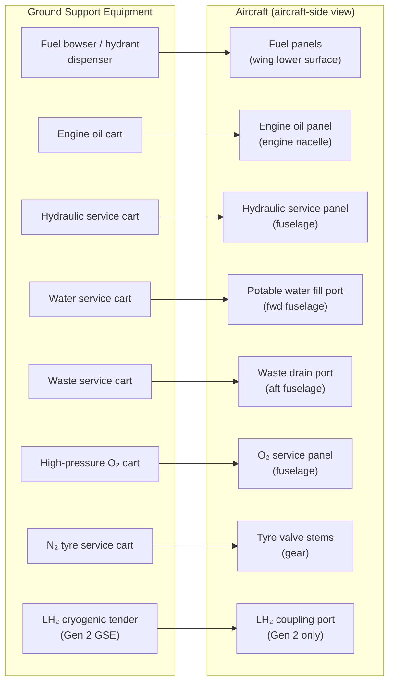

# ATLAS 000-009 · Section 00 · Subsection 003 · Subsubject 004 — Servicing: Fluids and Gases

## 1. Purpose

Introduces the fluids and gases that AMPEL360 aircraft consume or carry during turnaround and maintenance operations. This subsubject establishes the vocabulary and top-level concepts for the servicing domain.

> **Scope boundary:** This file is **introductory orientation** (Level 1) and covers the **aircraft-side** view of servicing. Step-by-step servicing procedures are in [`../../010-019_Manejo-en-Tierra-Servicio/011_Servicing/`](../../010-019_Manejo-en-Tierra-Servicio/011_Servicing/). For LH₂ (liquid hydrogen) — couplings, transfer rates, boil-off management, and ground infrastructure — the authoritative detail is in `Q+ATLANTIDE/400-499_EPTA/460-469_Propulsion-de-Hidrogeno-y-Celdas-de-Combustible/`; this file covers only the aircraft-side interface points.

> **Variant sensitivity:** The fluid list for AMPEL360 is **not static** — it depends on the active aircraft variant. Resolve the applicable variant via the Configuration Baseline before declaring a complete servicing fluid set for any specific aircraft. See [`../001_Configuracion/`](../001_Configuracion/).

## 2. Scope

### 2.1 Variant-conditional fluid architecture

AMPEL360 aircraft variants differ fundamentally in propulsion architecture, which directly determines the fuel and energy fluid configuration:

| Variant | Propulsion | Primary fuel/energy fluid | Additional energy storage |
|---|---|---|---|
| **Gen 1 — AMPEL360e** (tube-and-wing) | Turbofan (Jet-A / SAF) | Jet-A kerosene or Sustainable Aviation Fuel (SAF) | None (conventional) |
| **Gen 2 — BWB-H2** (Blended Wing Body) | LH₂ fuel cell + electric | Liquid Hydrogen (LH₂) | Battery buffer (electric) |
| **Hybrid variants** | Dual-fuel or series-hybrid | Jet-A **and** LH₂ (variant-specific split) | Battery buffer |

All other fluids (hydraulic, oil, potable water, waste, O₂, N₂) are present across variants unless a specific variant's design eliminates a system. Verify via the Variant Catalog in [`../001_Configuracion/`](../001_Configuracion/).

### 2.2 Fluids and gases — inventory

#### 2.2.1 Fuel

| Variant | Fuel type | Servicing point(s) | Notes |
|---|---|---|---|
| Gen 1 (Jet-A/SAF) | Jet-A kerosene or ASTM D7566-compliant SAF | Wing lower-surface fuel panels (port/starboard) | Standard pressure or gravity fuelling; fuelling rate limited by aircraft fuel system capacity and venting |
| Gen 2 (LH₂) | Liquid Hydrogen, cryo-grade | Fuselage or wing LH₂ coupling port (variant-specific) | Cryogenic handling required; coupling, transfer rate, boil-off management in EPTA `460-469_` |
| Hybrid | Jet-A + LH₂ | Both fuel panels active | Both fuelling regimes required; interlocking safety procedures |

#### 2.2.2 Engine oil

Engine oil replenishment is performed at the engine oil service panel during turnaround or maintenance. Oil type and quantity limits are defined in the Engine Manual cross-referenced from the propulsion Code ranges (`060-069_` for turbofan, `070-079_` for hybrid). Top-level concept: **replenishment is additive** (add oil to bring level to the upper limit); **drainage** is a maintenance action (not a standard turnaround task).

#### 2.2.3 Hydraulic fluid

The hydraulic system(s) use aircraft-grade hydraulic fluid (typically Skydrol or phosphate ester, per system specification in `028_Hydraulic-Power/`). Hydraulic servicing at turnaround is limited to level check and minor top-up if within approved limits; significant hydraulic fluid loss triggers a maintenance investigation before the next flight.

#### 2.2.4 Potable water

Passenger cabin water system replenishment via the potable water service panel. Water is loaded via a clean fill port and pumped to onboard tanks. Water quality must meet WHO or national drinking-water standards. Quantity loaded depends on mission length and passenger count.

#### 2.2.5 Waste water (lavatory drain)

Lavatory waste tanks are drained via the waste service port using a dedicated waste cart. Drain-before-fill sequencing (drain first, then flush, then close) prevents overpressure and contamination at the service port. Waste service is a separate GSE workflow from potable water (colour-coded equipment; no cross-connection permitted).

#### 2.2.6 Crew and passenger oxygen

Supplemental oxygen system (crew oxygen in flight deck; passenger oxygen in cabin overhead units) is a high-pressure gas system. Servicing involves:

- **Recharging** crew oxygen bottles from a high-pressure oxygen GSE cart after consumption (emergency deployment or maintenance use).
- **Verifying** passenger oxygen system pressure indication is within limits before each flight.

High-pressure oxygen is a fire and explosion risk near hydrocarbons. Oxygen servicing is segregated from fuelling operations. Procedures in AMM (ATA chapter 35 / ATLAS `034_Oxygen/`).

#### 2.2.7 Nitrogen (OBIGGS and tyre service)

Nitrogen (N₂) is used for:

- **Tyre inflation:** Nitrogen prevents tyre combustion risk from oxygen accumulation at high-temperature braking events. Tyre pressures are checked before each flight and at scheduled intervals.
- **OBIGGS (On-Board Inert Gas Generating System):** Where fitted, OBIGGS generates nitrogen-enriched air (NEA) to reduce fuel-tank ullage oxygen concentration. Ground servicing of OBIGGS is minimal; the system is self-generating from bleed air in flight.

#### 2.2.8 Additional — Gen 2 / LH₂ variants

LH₂ variants require ground-side infrastructure and procedures not present on kerosene variants:

- **Cryogenic coupling connection/disconnection** at aircraft LH₂ interface port.
- **Boil-off gas management** — LH₂ boil-off is vented to a capture system (not atmosphere) during fuelling and when parked with residual LH₂.
- **Grounding and bonding** — electrostatic bonding is mandatory before coupling to prevent ignition from static discharge.

Detail of all LH₂ ground servicing procedures is in EPTA `460-469_Propulsion-de-Hidrogeno-y-Celdas-de-Combustible/`.

### 2.3 Replenishment vs. drainage

Two fundamental servicing operations:

| Operation | Definition | Typical use |
|---|---|---|
| **Replenishment** | Adding fluid or gas to bring a system to its required operating level | Fuel load, oil top-up, water load, tyre inflation, O₂ recharge |
| **Drainage** | Removing fluid from a system | Waste drain, fuel drain for maintenance, hydraulic drain for system work |

Replenishment and drainage are operationally distinct workflows with different GSE, safety requirements, and documentation. They shall never be performed simultaneously on the same system.

### 2.4 Contamination control

Fluid contamination is a common cause of system degradation and airworthiness events:

- **Fuel contamination:** Water in fuel tanks is detected by water-sensing paste or drain-plug sampling. Free water must be drained before each flight. SAF misfuelling (wrong fuel grade) requires a maintenance investigation.
- **Oil contamination:** Metal particles in engine oil (detected by chip detector) indicate internal wear; oil analysis provides early warning.
- **Hydraulic contamination:** Particle count in hydraulic fluid is monitored; contaminated fluid requires system flushing.
- **Water system:** Microbial contamination is controlled by scheduled flushing and biocide treatments.

## 3. Diagram — Aircraft Servicing Points (Generic Layout)

## 4. Footprint

| Metric | Value |
|---|---|
| Architecture | `ATLAS` — Aircraft Top Level Architecture Schema/System (controlled term) |
| Master range | `000–099` |
| Code range | `000-009` |
| Section | `00` — Información General y Servicio |
| Subsection | `003` — Operaciones Básicas |
| Subsubject | `004` — Servicing: Fluids and Gases |
| Scope level | Introductory orientation, aircraft-side only (Level 1); procedural detail in `011_Servicing/`; LH₂ ground-side in EPTA `460-469_` |
| Variant sensitivity | **Yes** — fluid list depends on active variant; resolve via [`../001_Configuracion/`](../001_Configuracion/) |
| Primary Q-Division | Q-DATAGOV[^qdiv] |
| Support Q-Divisions | Q-GROUND, Q-AIR |
| ORB support | ORB-PMO, ORB-LEG |
| Governance class | `baseline`[^gov] |
| Folder path | `Q+ATLANTIDE/000-099_ATLAS/000-009_Informacion-General-y-Servicio/003_Operaciones-Basicas/` |
| Document | `004_Servicing-Fluids-and-Gases.md` (this file) |
| Parent subsection | [`README.md`](./README.md) · [`000_Overview.md`](./000_Overview.md) |
| Servicing procedure | [`../../010-019_Manejo-en-Tierra-Servicio/011_Servicing/`](../../010-019_Manejo-en-Tierra-Servicio/011_Servicing/) |
| LH₂ detail | `Q+ATLANTIDE/400-499_EPTA/460-469_Propulsion-de-Hidrogeno-y-Celdas-de-Combustible/` |
| Variant catalog | [`../001_Configuracion/`](../001_Configuracion/) |
| Parent architecture | [`../../README.md`](../../README.md) |
| Parent baseline | [`organization/Q+ATLANTIDE.md`](../../../../organization/Q+ATLANTIDE.md) |

## 5. References & Citations

[^baseline]: **Q+ATLANTIDE controlled baseline (v1.0.0)** — [`organization/Q+ATLANTIDE.md`](../../../../organization/Q+ATLANTIDE.md).

[^archtable]: **§3 — Architecture Table (parent)** — [`../../README.md` §3](../../README.md#3-architecture-table).

[^qdiv]: **Q-Division authority** — [`organization/Q-Divisions/`](../../../../organization/Q-Divisions/).

[^gov]: **Governance class** — `baseline` denotes documents under controlled change management within the Q+ATLANTIDE baseline.

[^ata2200]: **ATA iSpec 2200** — Information standards for aviation maintenance documentation.

[^ataspec100]: **ATA Spec 100** — ATA chapter 12 covers servicing. Cross-referenced for ATA chapter/subject alignment.

[^s1000d]: **S1000D Issue 6.0** — International specification for technical publications.

[^as9100d]: **AS9100D** — Quality Management Systems — Aviation, Space and Defense Organizations.

[^icao9137]: **ICAO Doc 9137 — Airport Services Manual** — Fuelling procedures, contamination control, and safety standards for aircraft servicing.

[^iata_igom]: **IATA Ground Operations Manual (IGOM)** — Servicing procedures at operational level.

[^iata_afm]: **IATA Airport Fuel Services Manual** — Ground-side fuel quality management, hydrant system operation, and fuelling safety.

[^astm_d7566]: **ASTM D7566** — Standard Specification for Aviation Turbine Fuel Containing Synthesized Hydrocarbons (SAF). Governs SAF drop-in fuel specifications for Gen 1 variants.

### Applicable industry standards

- ATA iSpec 2200 — Information standards for aviation maintenance[^ata2200]
- ATA Spec 100 — Manufacturers' Technical Data (ATA chapter 12: Servicing)[^ataspec100]
- S1000D Issue 6.0 — International specification for technical publications[^s1000d]
- AS9100D — Quality Management Systems — Aviation, Space and Defense Organizations[^as9100d]
- ICAO Doc 9137 — Airport Services Manual[^icao9137]
- IATA Ground Operations Manual (IGOM)[^iata_igom]
- IATA Airport Fuel Services Manual[^iata_afm]
- ASTM D7566 — Aviation Turbine Fuel Containing Synthesized Hydrocarbons (SAF)[^astm_d7566]
